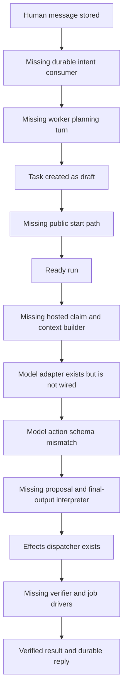

# Implementation gap audit

Audit date: 2026-09-19. Baseline commit: `34d291f4c44b1a2a4950e8155498daad2a56c251`.

Zatiti has a substantial implemented control plane, but the path from an admitted intent to independently verified work is disconnected at multiple points. The missing component is a durable worker/planning loop, plus the contexts, action routing, job drivers and output verification that make it useful. Rebuilding the existing CRUD/storage/transport packages would miss the main problem.

The audit covers all 36 frozen roots, the 264-operation catalog (197 public, 67 internal), 127 requirement blocks and 116 named acceptance cases. That is exhaustive inventory/assignment coverage, not a claim that every line or every runtime behavior has been proved correct. Confirmed gaps below are distinguished from integration risks. Provider capability judgments refer to the checked-in pin/implementation; current upstream capabilities were not independently researched.

Local validation: `GOMAXPROCS=2 go test -p 2 -json ./...` exited 0: 34 packages passed, 2612 passing test/subtest events and 14 skipped test/subtest events. Test counts include parent/subtests. The root has no tests. Renderer check passed for 40 generated files. See [baseline.json](baseline.json) for exact package/skip identities. No Flutter/native/provider/named-client qualification was run. The shared build lease was acquired and released.

Existing untracked recovery and design files were present before the audit and were not changed. This assignment adds planning documents only; production code and frozen specification outputs are unchanged. Ajent retrieval was unavailable (HTTP 409); no external finding was treated as evidence.

## The broken work path

An external agent can administer existing operations, but that is different from Zatiti autonomously running its own workers. Scheduled tasks can use internal ready transitions; that does not solve the public first-task path or hosted execution.

## G01 — Messages have no intent consumer

Evidence: **source-confirmed**.

Delivery stores the message and recipient rows. _messaging.pending exists, but the production controller/execution loop does not call it. No production path consumes a chief inbox into a planning turn.

Result: Chat can acknowledge and display messages while producing no reply or work.

Sources: [internal/messaging/delivery.go:133](../../internal/messaging/delivery.go), [internal/messaging/handlers_internal.go:138](../../internal/messaging/handlers_internal.go), [internal/controller/tick.go:15](../../internal/controller/tick.go).

Coding assignments: [P10](assignments/P10.md), [P14](assignments/P14.md), [P16](assignments/P16.md), [P22](assignments/P22.md), [P42](assignments/P42.md).

## G02 — Public task creation stops at draft

Evidence: **source-and-test-confirmed**.

task.create persists draft; task.assign changes worker/version without readying it. The current public catalog has no task.start. The first-task test explicitly asserts draft. Internal scheduling can ready generated tasks, so readiness itself is not entirely absent.

Result: A publicly created first task has no normal public transition into executable work.

Sources: [internal/tasks/handlers_public.go:29](../../internal/tasks/handlers_public.go), [internal/tasks/transition.go:348](../../internal/tasks/transition.go), [cmd/zatiti/firsttask_test.go:129](../../cmd/zatiti/firsttask_test.go), [internal/installation/firsttask.go:16](../../internal/installation/firsttask.go).

Coding assignments: [P00](assignments/P00.md), [P11](assignments/P11.md), [P25](assignments/P25.md), [P39](assignments/P39.md), [P40](assignments/P40.md).

## G03 — Hosted runs are not automatically claimed

Evidence: **source-confirmed**.

readyScan only counts tasks. _execution.tick expires leases and admits already claimed attempts with a ContextArtifact. It does not claim queued hosted runs.

Result: Even ready scheduled work does not initiate a hosted attempt by itself.

Sources: [internal/controller/tick.go:81](../../internal/controller/tick.go), [internal/execution/controller_ops.go:228](../../internal/execution/controller_ops.go), [internal/execution/run_ops.go:133](../../internal/execution/run_ops.go).

Coding assignments: [P14](assignments/P14.md), [P22](assignments/P22.md).

## G04 — Context assembler is absent

Evidence: **source-confirmed**.

run.claim can return a digest-only synthetic input envelope; _execution.context records a supplied artifact but no production caller builds and publishes the actual transcript/tool/memory context.

Result: No assembled authorized model input reaches a hosted worker.

Sources: [internal/execution/run_ops.go:322](../../internal/execution/run_ops.go), [internal/execution/controller_ops.go:21](../../internal/execution/controller_ops.go), [internal/adapters/responses/contextdoc.go](../../internal/adapters/responses/contextdoc.go).

Coding assignments: [P05](assignments/P05.md), [P09](assignments/P09.md), [P15](assignments/P15.md), [P21](assignments/P21.md).

## G05 — Prepared model action is incompatible with the implemented adapter

Evidence: **source-confirmed**.

Execution emits attempt_id/run_id/model parameters, empty content, tool=profile.ID and connection.version=1. Responses requires schema/kind/context_artifact/max_output_tokens/tool_contract_versions and rejects unknown fields. Controller infers callback routing from attempt_id in those same parameters.

Result: Simply registering Responses still produces invalid actions; removing the illegal parameters would also lose the current callback route.

Sources: [internal/execution/controller_ops.go:318](../../internal/execution/controller_ops.go), [internal/adapters/responses/wire.go:96](../../internal/adapters/responses/wire.go), [internal/adapters/responses/action.go:15](../../internal/adapters/responses/action.go), [internal/controller/deliver.go:34](../../internal/controller/deliver.go).

Coding assignments: [P00](assignments/P00.md), [P06](assignments/P06.md), [P12](assignments/P12.md), [P13](assignments/P13.md), [P15](assignments/P15.md).

## G06 — Model output is not converted into actions or a final result

Evidence: **source-confirmed**.

handleObservation records observations and increments a counter, then prepares another model effect on succeeded or accepted until the bound. It does not consume text/tool_proposals, publish a chief reply, invoke local product operations, or report final outputs.

Result: The central intent-to-work step is unbuilt. A model call alone cannot run a workflow.

Sources: [internal/execution/controller_ops.go:121](../../internal/execution/controller_ops.go), [internal/adapters/responses/wire.go:254](../../internal/adapters/responses/wire.go).

Coding assignments: [P04](assignments/P04.md), [P14](assignments/P14.md), [P15](assignments/P15.md), [P16](assignments/P16.md).

## G07 — Responses is implemented but not wired

Evidence: **source-confirmed**.

Startup constructors register github/httpread/serenity only; responses is still explicitly listed as unimplemented although its package and tests exist. A responses.json profile is rejected as an unknown adapter.

Result: Production cannot use its existing model adapter.

Sources: [cmd/zatiti/adapters.go:29](../../cmd/zatiti/adapters.go), [cmd/zatiti/adapters.go:37](../../cmd/zatiti/adapters.go), [internal/adapters/responses/adapter.go](../../internal/adapters/responses/adapter.go).

Coding assignments: [P13](assignments/P13.md), [P24](assignments/P24.md).

## G08 — Verification has no production driver

Evidence: **source-confirmed**.

Reports create rows in execution_verification_jobs. NewVerifier and _execution.verification.record exist, but controller has no verifier phase/caller or pending verification scan, and entrypoint attaches only Identity and Blobs.

Result: Reported work cannot automatically become independently verified success.

Sources: [internal/execution/attempt_ops.go:195](../../internal/execution/attempt_ops.go), [internal/execution/verifier.go:34](../../internal/execution/verifier.go), [internal/execution/store.go:940](../../internal/execution/store.go), [cmd/zatiti/serve.go:167](../../cmd/zatiti/serve.go).

Coding assignments: [P18](assignments/P18.md), [P23](assignments/P23.md), [P24](assignments/P24.md).

## G09 — Generated-output acceptance is not connected end to end

Evidence: **source-confirmed**.

Presence checks demand an expected digest at task admission, while report builds VerificationRequest.Outputs as an empty array. Verifier addresses artifacts by expected digest rather than resolving the attempt output name.

Result: A newly generated report cannot be verified by its named output contract without prior knowledge or a workaround.

Sources: [internal/tasks/acceptance.go:140](../../internal/tasks/acceptance.go), [internal/execution/attempt_ops.go:239](../../internal/execution/attempt_ops.go), [internal/execution/verifier.go:124](../../internal/execution/verifier.go).

Coding assignments: [P00](assignments/P00.md), [P09](assignments/P09.md), [P11](assignments/P11.md), [P18](assignments/P18.md).

## G10 — Repository verification runner is unbuilt

Evidence: **source-confirmed**.

Repository patch/check observation kinds fall into an unavailable result explaining the controlled runner is absent. Artifact presence/digest/schema checks do exist.

Result: Engineering tasks cannot establish independent patch/check acceptance.

Sources: [internal/execution/verifier.go:186](../../internal/execution/verifier.go).

Coding assignments: [P20](assignments/P20.md), [P47](assignments/P47.md).

## G11 — Durable local jobs have no production runners

Evidence: **source-confirmed**.

Jobs without a registered exact owner/operation runner remain pending; production registers no Jobs map. skill.evaluate and run.export create such work.

Result: These public operations can return a durable identity without ever producing their result.

Sources: [internal/controller/jobs.go:78](../../internal/controller/jobs.go), [cmd/zatiti/serve.go:167](../../cmd/zatiti/serve.go), [internal/skills/handlers.go:218](../../internal/skills/handlers.go), [internal/execution/run_ops.go:528](../../internal/execution/run_ops.go).

Coding assignments: [P19](assignments/P19.md), [P21](assignments/P21.md), [P23](assignments/P23.md), [P24](assignments/P24.md).

## G12 — Configuration exports return unregistered result identities

Evidence: **source-confirmed**.

handleExport stages/publishes bytes inside the handler and constructs succeeded Job and Artifact IDs locally; it does not persist them through execution/artifacts owners.

Result: Returned job/artifact references have no demonstrated owner-backed lookup/read lifecycle; writer transaction also contains blob IO.

Sources: [internal/configuration/handlers.go:1185](../../internal/configuration/handlers.go).

Coding assignments: [P05](assignments/P05.md), [P09](assignments/P09.md), [P23](assignments/P23.md).

## G13 — Reconciliation cannot reach Adapter.Reconcile

Evidence: **source-confirmed**.

operation.reconcile creates an execution job referring to the original operation_id. Generic jobs treat linked effects as externally completed, while dispatch skips unknown/awaiting-confirmation originals. Production physical invocation calls Invoke; no controller caller invokes Reconcile.

Result: Unknown/accepted effects have no complete runtime lookup/confirmation path.

Sources: [internal/effects/handlers.go:1132](../../internal/effects/handlers.go), [internal/execution/job_ops.go:122](../../internal/execution/job_ops.go), [internal/controller/jobs.go:86](../../internal/controller/jobs.go), [internal/controller/perform.go:55](../../internal/controller/perform.go).

Coding assignments: [P12](assignments/P12.md), [P23](assignments/P23.md).

## G14 — Responsibility cycles never feed back their next decision

Evidence: **source-confirmed**.

Wake admission creates a cycle task and deliberately leaves the next wake for _scheduling.cycle.record. There is no production execution caller that interprets the cycle and records it.

Result: An ongoing responsibility does not autonomously reason, spawn useful work and schedule its next reconsideration.

Sources: [internal/scheduling/wake.go:304](../../internal/scheduling/wake.go), [internal/scheduling/cycle.go:24](../../internal/scheduling/cycle.go), [internal/execution/service.go:54](../../internal/execution/service.go).

Coding assignments: [P16](assignments/P16.md), [P17](assignments/P17.md), [P22](assignments/P22.md).

## G15 — Credential setup ends at a helper contract without a shipped producer

Evidence: **source-confirmed**.

Connections verifies signed helper receipts using a provisioned receipt key and a resolvable credential reference. Packaging validates secure-helper metadata. No production helper implementation/entrypoint producing this setup handoff was found in the executable tree.

Result: The operator cannot complete the intended secret-free onboarding solely through the advertised product flow.

Sources: [internal/connections/localio.go:38](../../internal/connections/localio.go), [internal/connections/localio.go:474](../../internal/connections/localio.go), [cmd/zatiti/run.go:30](../../cmd/zatiti/run.go), [packaging/manifest.go:388](../../packaging/manifest.go).

Coding assignments: [P06](assignments/P06.md), [P24](assignments/P24.md), [P25](assignments/P25.md), [P45](assignments/P45.md).

## G16 — Serenity is a capability-refusal adapter, not working memory

Evidence: **source-confirmed**.

The pinned capability report declares physical_calls=none and unsupported command lookup; adapter operations refuse required missing guarantees rather than making requests. Local memory bindings/jobs exist.

Result: Real recall/curation/promotion/context memory and full memory backup require a qualified upstream seam, not just wiring.

Sources: [internal/adapters/serenity/adapter.go:86](../../internal/adapters/serenity/adapter.go), [internal/adapters/serenity/capability.go:138](../../internal/adapters/serenity/capability.go), [internal/adapters/serenity/PROTOCOL.md](../../internal/adapters/serenity/PROTOCOL.md).

Coding assignments: [P26](assignments/P26.md), [P27](assignments/P27.md), [P28](assignments/P28.md), [P31](assignments/P31.md).

## G17 — Backup captures database bytes but omits required content

Evidence: **source-and-test-confirmed**.

Backup genuinely captures/encrypts database bytes. Manifest schema versions, artifacts, brains and retained obligations are empty lists; these are required for complete installation recovery.

Result: A valid encrypted bundle is not yet a complete portable installation backup.

Sources: [internal/installation/backup.go:213](../../internal/installation/backup.go), [tests/integration/defects_test.go:341](../../tests/integration/defects_test.go).

Coding assignments: [P09](assignments/P09.md), [P29](assignments/P29.md), [P30](assignments/P30.md), [P31](assignments/P31.md).

## G18 — Restore prepares an overlay but never rewinds the live installation

Evidence: **source-and-test-confirmed**.

Restore validates a bundle and stages a recovery overlay; comments explicitly defer file replacement to controller. No production restore coordinator is wired. Integration test ends accepted/paused, not after restored data is read. The overlay also needs complete monotonic records, not only obligation summaries.

Result: Restore remains an incomplete job; clean-destination artifact/key/brain restoration and revocation preservation are not demonstrated.

Sources: [internal/installation/restore.go:12](../../internal/installation/restore.go), [internal/installation/restore.go:247](../../internal/installation/restore.go), [cmd/zatiti/serve.go:167](../../cmd/zatiti/serve.go), [tests/integration/defects_test.go:403](../../tests/integration/defects_test.go).

Coding assignments: [P29](assignments/P29.md), [P30](assignments/P30.md), [P31](assignments/P31.md), [P32](assignments/P32.md), [P33](assignments/P33.md).

## G19 — Desktop chat contract lacks persistent complete history

Evidence: **source-confirmed**.

Desktop combines incoming mailbox and this window’s sent messages; catalog lacks full thread history/current caller/read-state projections. Local UI cache is in-memory; restart persistence is not implemented in the inspected client.

Result: Relaunch cannot show a reliable complete conversation, unread state or retained offline draft.

Sources: [apps/desktop/lib/src/state/live_source.dart:599](../../apps/desktop/lib/src/state/live_source.dart), [apps/desktop/README.md](../../apps/desktop/README.md), [internal/messaging/store.go](../../internal/messaging/store.go).

Coding assignments: [P03](assignments/P03.md), [P10](assignments/P10.md), [P34](assignments/P34.md), [P42](assignments/P42.md).

## G20 — Desktop management and detail journeys are incomplete

Evidence: **source-confirmed**.

The live client honestly renders notices for unlistable memory and absent history/provenance/check projections. New org/worker/task/responsibility creation flows and populated daily-work behavior are not complete production journeys.

Result: A rendered chat shell is not the specified daily work application.

Sources: [apps/desktop/lib/src/state/live_source.dart:431](../../apps/desktop/lib/src/state/live_source.dart), [apps/desktop/lib/src/api/controller_api.dart](../../apps/desktop/lib/src/api/controller_api.dart), [apps/desktop/README.md](../../apps/desktop/README.md).

Coding assignments: [P09](assignments/P09.md), [P17](assignments/P17.md), [P26](assignments/P26.md), [P35](assignments/P35.md), [P42](assignments/P42.md), [P43](assignments/P43.md), [P44](assignments/P44.md).

## G21 — Qualification has unconditional not-run branches

Evidence: **source-and-test-confirmed**.

Responses qualification always calls notRun even when Go source exists. Desktop cases always notRun even if a driver appears. Distribution tests always notRun after host checks. Named-agent sessions are correctly opt-in. Baseline observed 14 skipped test/subtest events.

Result: A green go test run does not mean these release gates are satisfied. Some need harness code, others real authorized environments.

Sources: [tests/qualification/adapter_bounds_test.go:589](../../tests/qualification/adapter_bounds_test.go), [tests/qualification/desktop_test.go:98](../../tests/qualification/desktop_test.go), [tests/qualification/desktop_test.go:121](../../tests/qualification/desktop_test.go), [tests/qualification/agent_clients_test.go:54](../../tests/qualification/agent_clients_test.go).

Coding assignments: [P45](assignments/P45.md), [P47](assignments/P47.md), [P48](assignments/P48.md).

## G22 — Parity tests cover a small script, not all behavioral lifecycles

Evidence: **source-confirmed**.

Current parity script has nine calls largely covering installation/principal operations. Discovery tests enumerate the whole surface, but that is not all-operation success/state/recovery parity or end-to-end work. Many controller unit tests use fake owners.

Result: Package-local green tests can miss incompatible runtime seams and missing transitions.

Sources: [tests/integration/parity_test.go:15](../../tests/integration/parity_test.go), [tests/integration/parity_test.go:136](../../tests/integration/parity_test.go), [tests/integration/exposure_test.go](../../tests/integration/exposure_test.go).

Coding assignments: [P46](assignments/P46.md), [P47](assignments/P47.md), [P48](assignments/P48.md).

## G23 — Release library exists but no installable product is qualified

Evidence: **source-confirmed**.

Packaging implements manifests, signing, install plans, services and desktop archives against synthetic trees. It lacks a completed artifact-production/clean-host lifecycle, and qualification workflow intentionally does not publish.

Result: Distribution/helper/service/keychain behavior remains coding plus real platform qualification work.

Sources: [packaging/README.md](../../packaging/README.md), [packaging/plan.go](../../packaging/plan.go), [packaging/desktop_bundle.go](../../packaging/desktop_bundle.go), [.github/workflows/release-qualification.yml](../../.github/workflows/release-qualification.yml).

Coding assignments: [P24](assignments/P24.md), [P45](assignments/P45.md), [P47](assignments/P47.md), [P48](assignments/P48.md).

## G24 — Documentation and dependency evidence are stale

Evidence: **source-confirmed**.

README says no runnable implementation; index calls this only a scaffold; lock lists old Fyne qualification; Responses startup comments are stale. Some desktop notes describe defects now covered by passing regression tests.

Result: New implementers could rebuild working packages or carry obsolete assumptions forward.

Sources: [README.md:11](../../README.md), [docs/implementation/README.md:3](../../docs/implementation/README.md), [docs/implementation/dependencies.lock.json](../../docs/implementation/dependencies.lock.json), [cmd/zatiti/adapters.go:20](../../cmd/zatiti/adapters.go), [apps/desktop/README.md](../../apps/desktop/README.md).

Coding assignments: [P02](assignments/P02.md), [P25](assignments/P25.md), [P49](assignments/P49.md).

## G25 — Root budgets and authority need real-loop integration proof

Evidence: **integration-risk-not-proven-defect**.

Task/attempt/effect reservations and current authority exist independently. The missing hosted path has not demonstrated their combined semantics, worker identity intersection, current revocation and unknown cost settlement.

Result: Naively adding a planner could bypass authorization or double-reserve/spend; preserve existing code and test the integrated path.

Sources: [internal/accounting/reserve_ops.go](../../internal/accounting/reserve_ops.go), [internal/policy/authority.go](../../internal/policy/authority.go), [internal/execution/run_ops.go](../../internal/execution/run_ops.go), [internal/tasks/admission.go](../../internal/tasks/admission.go).

Coding assignments: [P03](assignments/P03.md), [P04](assignments/P04.md), [P07](assignments/P07.md), [P08](assignments/P08.md), [P16](assignments/P16.md), [P46](assignments/P46.md).

## G26 — Recovery/fairness edges need explicit coverage

Evidence: **source-confirmed-and-integration-risk**.

Controller documents a stranded claim when a lost claim acknowledgement cannot be resolved through pending reads. Several pending scans are limited batches without a complete fair work cursor; starvation under many blocked records needs a reproducer.

Result: Recovery and long-running installations can stall even after the happy path is wired.

Sources: [internal/controller/jobs.go:204](../../internal/controller/jobs.go), [internal/controller/tick.go:113](../../internal/controller/tick.go), [internal/execution/job_ops.go:163](../../internal/execution/job_ops.go).

Coding assignments: [P12](assignments/P12.md), [P14](assignments/P14.md), [P22](assignments/P22.md), [P23](assignments/P23.md), [P46](assignments/P46.md).

## G27 — Responses performs two physical requests in one dispatch

Evidence: **source-confirmed**. Invoke can create a conversation and then call Responses before returning one observation. This violates the frozen one-physical-call dispatch expectation and leaves the session-handle handoff inside adapter IO. Checked-in protocol notes correctly say an empty conversation cannot prove nonexecution and reconciled items do not recover billing usage.

Result: Crash accounting, call-count guarantees and uncertainty need a coordinated contract/runtime repair; a successful API-key probe does not establish them.

Sources: [Responses Invoke](../../internal/adapters/responses/adapter.go), [protocol preparation](../../internal/adapters/responses/openai.go), [recorded correction](../../docs/roadmap.md). Assignments: P00, P12, P13, P15, P23, P47.

## Existing behavior to retain

SQLite transactions/migrations/outbox; owner-bound internal ports; authenticated CLI/MCP/socket transport; command replay; staged configuration plans; task/lease/effect state models; exact reviews; budget reservations; encrypted blob upload/read; independent artifact-check implementation; GitHub/public-HTTP/Responses protocol adapters; Flutter client transport and review rendering; packaging manifest/install libraries. Their passing tests are useful baseline evidence, not proof of the missing full workflow.

The old first-task reservation failure, bootstrap credential encoding, configuration candidate digest and command-lookup issues described in earlier notes should not be reclassified as open without reproducing them: the relevant current regression tests passed. First-task creation now works as a **draft**, which is a different and still-open problem from executing it.

## Scope disposition

| Root | Assigned work | Assessment |
|---|---|---|
| `internal/contract` | P01 | Existing implementation/scaffold present; targeted changes and integration/qualification assigned, not a rewrite. |
| `internal/platform` | P30 | Existing implementation/scaffold present; targeted changes and integration/qualification assigned, not a rewrite. |
| `internal/storage` | P29 | Existing implementation/scaffold present; targeted changes and integration/qualification assigned, not a rewrite. |
| `internal/identity` | P03 | Existing implementation/scaffold present; targeted changes and integration/qualification assigned, not a rewrite. |
| `internal/configuration` | P05 | Existing implementation/scaffold present; targeted changes and integration/qualification assigned, not a rewrite. |
| `internal/skills` | P19 | Existing implementation/scaffold present; targeted changes and integration/qualification assigned, not a rewrite. |
| `internal/connections` | P06 | Existing implementation/scaffold present; targeted changes and integration/qualification assigned, not a rewrite. |
| `internal/policy` | P07, P36 | Existing implementation/scaffold present; targeted changes and integration/qualification assigned, not a rewrite. |
| `internal/reviews` | P35 | Existing implementation/scaffold present; targeted changes and integration/qualification assigned, not a rewrite. |
| `internal/accounting` | P08 | Existing implementation/scaffold present; targeted changes and integration/qualification assigned, not a rewrite. |
| `internal/tasks` | P11 | Existing implementation/scaffold present; targeted changes and integration/qualification assigned, not a rewrite. |
| `internal/scheduling` | P17 | Existing implementation/scaffold present; targeted changes and integration/qualification assigned, not a rewrite. |
| `internal/messaging` | P10 | Existing implementation/scaffold present; targeted changes and integration/qualification assigned, not a rewrite. |
| `internal/execution` | P14, P15, P16, P18, P20, P21 | Existing implementation/scaffold present; targeted changes and integration/qualification assigned, not a rewrite. |
| `internal/effects` | P12 | Existing implementation/scaffold present; targeted changes and integration/qualification assigned, not a rewrite. |
| `internal/memory` | P26, P28 | Existing implementation/scaffold present; targeted changes and integration/qualification assigned, not a rewrite. |
| `internal/artifacts` | P09 | Existing implementation/scaffold present; targeted changes and integration/qualification assigned, not a rewrite. |
| `internal/evidence` | P34 | Existing implementation/scaffold present; targeted changes and integration/qualification assigned, not a rewrite. |
| `internal/installation` | P25, P31 | Existing implementation/scaffold present; targeted changes and integration/qualification assigned, not a rewrite. |
| `internal/registry` | P37 | Existing implementation/scaffold present; targeted changes and integration/qualification assigned, not a rewrite. |
| `internal/application` | P04 | Existing implementation/scaffold present; targeted changes and integration/qualification assigned, not a rewrite. |
| `internal/controller` | P22, P23, P32 | Existing implementation/scaffold present; targeted changes and integration/qualification assigned, not a rewrite. |
| `internal/server` | P41 | Existing implementation/scaffold present; targeted changes and integration/qualification assigned, not a rewrite. |
| `internal/client` | P38 | Existing implementation/scaffold present; targeted changes and integration/qualification assigned, not a rewrite. |
| `internal/cli` | P39 | Existing implementation/scaffold present; targeted changes and integration/qualification assigned, not a rewrite. |
| `internal/mcp` | P40 | Existing implementation/scaffold present; targeted changes and integration/qualification assigned, not a rewrite. |
| `apps/desktop` | P42, P43, P44 | Existing implementation/scaffold present; targeted changes and integration/qualification assigned, not a rewrite. |
| `internal/adapters/responses` | P13 | Existing implementation/scaffold present; targeted changes and integration/qualification assigned, not a rewrite. |
| `internal/adapters/github` | P46, P47 | Implemented strict repository adapter; preserve and exercise via real effect/reconciliation/engineering journeys (P12/P20/P46/P47). No separate replacement justified. |
| `internal/adapters/httpread` | P46, P47 | Implemented bounded public-read adapter; preserve and exercise via real research tool loop and qualification (P16/P46/P47). No separate replacement justified. |
| `internal/adapters/serenity` | P27 | Existing implementation/scaffold present; targeted changes and integration/qualification assigned, not a rewrite. |
| `cmd/zatiti` | P24, P33 | Existing implementation/scaffold present; targeted changes and integration/qualification assigned, not a rewrite. |
| `tests/integration` | P46 | Existing implementation/scaffold present; targeted changes and integration/qualification assigned, not a rewrite. |
| `tests/qualification` | P47 | Existing implementation/scaffold present; targeted changes and integration/qualification assigned, not a rewrite. |
| `packaging` | P45 | Existing implementation/scaffold present; targeted changes and integration/qualification assigned, not a rewrite. |
| `.github/workflows` | P48 | Existing implementation/scaffold present; targeted changes and integration/qualification assigned, not a rewrite. |

## Release boundary

The local suite being green is consistent with the product being unable to do autonomous work: it tests many valuable individual contracts, often with fake peer owners, while the production orchestration is absent. A capability refusal that correctly fails closed is implemented refusal behavior, not implemented memory or repository verification. A test named restore that stops at accepted/paused is not an executed restore.

The minimum useful milestone is a real controller processing one authorized message, making a controlled model call, invoking an allowed tool, producing a new named artifact, independently verifying it and delivering one durable reply. It must also survive a lost acknowledgement/restart without duplicate work. Full release additionally requires all existing Z01–Z21, journeys and platform/client/provider qualification; no out-of-scope replacement provider or weakened acceptance is assumed.

The 2026-09-19 sitrep says the core loops are done and only an API-key probe remains. That conclusion is not supported by the production call paths above. Its “empty skip list” refers to tests/integration; this audit observed no integration skips, but 14 qualification skips. Its backup claim demonstrates decryptable bundles and accepted restore preparation, not a completed live rewind. Preserve these historical reports, but use this evidence-based inventory to dispatch further work.
