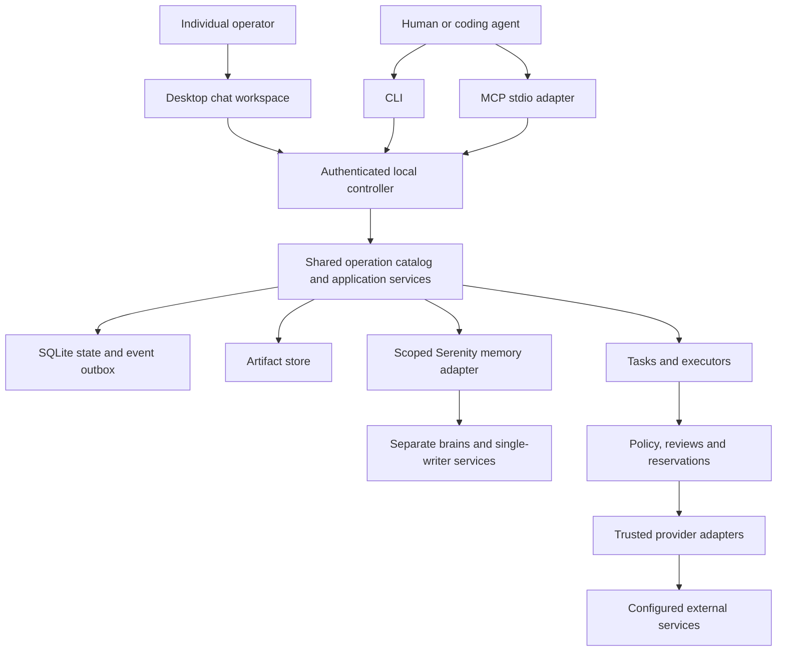

# RFC 0001: Zatiti

## 1. Status and summary

| Field | Value |
|---|---|
| Status | Draft; proposed implementation specification |
| Date | 2026-09-07 |
| Repository | [zatiti/zatiti](https://github.com/zatiti/zatiti) |
| License | Apache-2.0 |
| Implementation | Go |
| Interfaces | Desktop application for people; CLI and Model Context Protocol (MCP) for coding agents, with shared product operations |
| Deployment | Single-tenant, operator-controlled installation |

Zatiti gives humans and coding agents a shared system for organizing and operating persistent AI workers. An authorized agent can create organizations, projects, skills, workers, connections, policies, and schedules; assign and delegate tasks; inspect artifacts; and manage recovery through either CLI or MCP. These interfaces operate the same state and use the same permissions.

The primary user is an individual operating a personal agent organization through a chat-first desktop workspace. First launch opens a conversation with a personal chief. The user gives it bounded tasks and ongoing responsibilities, and grows an organization through conversation: "Create marketing and engineering chiefs and have them build their teams." Each new chief heads a child organization; ordinary workers do not require their own organizations. CLI and MCP let external coding agents operate the same product without becoming the human user's required interface.

Organizations describe responsibilities. Workers carry identity and versioned configuration. Tasks describe outcomes. Runs and attempts execute tasks. Deterministic services authorize actions, manage budgets, protect credentials, and record evidence. A worker's assertion is an observation, not proof of completion.

This RFC is a design, not a claim of working software. Go, Apache-2.0, single tenancy, agent operation, and CLI/MCP parity are product requirements. The storage, authentication, operation schemas, and release decomposition below are proposed design choices. Amend this document when those choices change.

## 2. Product scope

### 2.1 Single installation, multiple organizations

One installation belongs to one operator or team and has one database, credential custody boundary, controller owner, and administrative trust root. It may contain multiple organizations. An organization is a grouping of teams, projects, workers, and configuration; it is not a hosted tenant.

Organization and project scopes still restrict ordinary principals and workers. Cross-organization references require an explicit binding, and secrets are never globally available by default. These checks protect against accidental or unauthorized application access. They do not promise isolation from the installation administrator, database owner, or another process with unrestricted access to the same operating-system account.

Organizations form an acyclic parent-child tree rooted in the personal organization. Bootstrap creates that root and its personal-chief identity; paid execution remains unavailable until the operator configures a provider and limits. Creating another organization creates its chief in the same configuration plan. Each active organization has exactly one designated chief, whose replacement preserves the organization's identity, memory, obligations, and history. Workers have one home organization; cross-organization assignments require explicit bindings. Creating an ordinary worker does not create an organization.

Parent organizations impose permission ceilings and aggregate budget limits on descendants. Child policy can narrow those limits, never expand them. Parent chiefs receive authorized reports from children, not automatic access to every descendant's private memory, credentials, or project data. Moving an organization or worker is an explicit configuration plan that rechecks inherited limits and memory bindings; it cannot silently transfer old private memories or widen the authority of active work.

There is no tenant routing, tenant signup, tenant billing, or hosted multitenant control plane in v1. Separate installations are the boundary for mutually untrusted operators. Installation IDs prevent accidental mixing of exports, credentials, and checkpoints; they are not tenant IDs in another form.

### 2.2 Agents can operate the whole product

An external agent may use MCP or invoke the CLI in JSON mode to discover operations and operate every authorized product capability. Zatiti does not require its own chat UI, a proprietary planning model, or a separate human-only administration API.

Agent access and worker execution are distinct:

- A **client agent** manages Zatiti using a scoped principal. Claude Code, Codex, Cursor, or another compatible client can fill this role.
- A **worker** is a persistent Zatiti identity and configuration. An executor may run a hosted model loop or an external agent may claim work for it.
- An **executor** owns a particular process or cooperative run attempt. Supporting a client over MCP does not imply that Zatiti can launch or sandbox that client's application.

Full operation means complete API coverage under the principal's authority. It does not mean permission to expand that authority, bypass provider consent, read stored secret bytes, or satisfy a human-required decision by claiming that a human approved it.

### 2.3 First-release outcomes

1. An operator initializes an installation and configures scoped access for an agent.
2. That agent creates an organization, imports a skill, binds a connection, creates workers and a project, validates the resulting configuration, and activates it under current policy.
3. The agent assigns a task with pinned inputs, a resource envelope, and an acceptance contract; it follows runs, artifacts, reviews, costs, and results.
4. A worker delegates bounded child tasks, waits durably, and resumes after controller restart without duplicating protected effects.
5. A human or appropriately authorized principal reviews exact actions; a separate client can inspect or continue the workflow.
6. The installation can pause, export, back up, restore, and reconcile unresolved work through the same operation model.

The first release includes the chat-first desktop application, CLI and local stdio MCP, a complete shared operation catalog, hierarchical organization authoring, personal and organization chiefs, Serenity-backed memory, versioned skills, connection setup, durable execution, scoped policy, earned autonomy, approvals, evidence, and recovery. It includes one qualified hosted model-provider adapter, the cooperative external-worker protocol, bounded HTTP reads, repository artifact workflows, and one qualified GitHub adapter for explicitly authorized repository actions. Provider/model selections are installation inputs, not hardcoded personal accounts or model aliases.

Initial distribution targets macOS and Linux. Windows is a later qualification target. No advertised platform or agent-client compatibility is established solely by code compiling.

### 2.4 Exclusions

V1 does not include a standalone web client, a mobile client, hosted multitenancy, remote MCP over HTTP, high availability, multiple active controllers, automatic controller migration, cloud fleet provisioning, a marketplace, or a universal guarantee of exactly-once effects. Social publishing, external chat ingestion, arbitrary third-party server execution, and additional provider adapters can follow the same contracts later; they do not gate the first release. The desktop framework remains an implementation decision; a browser-based renderer inside the desktop application does not imply a separately supported web product.

An external worker is advisory in v1. A contained runner is a separately qualified extension, not an implied property of MCP, a subprocess, or a container. Zatiti does not require a particular coding planner or fleet scheduler.

## 3. Architecture and storage

Ship a `zatiti` Go controller/CLI binary with CLI commands, `serve`, and `mcp serve`, plus a desktop client and a pinned Serenity integration. One always-on controller owns scheduling, admission, persistence, credential access, and recovery. It may run on the user's computer or an operator-controlled server; ongoing work requires that host to remain available. Closing the desktop client does not stop the controller. Optional local execution workers connect to that same owner; moving work between controllers is not a v1 feature.

Desktop, CLI, and MCP are clients of the controller's application services. MCP processes do not start separate schedulers or write the database directly. Local clients use a private Unix-domain socket; a remote desktop connection uses an explicitly configured authenticated TLS endpoint over the same versioned operation contract. Credentials remain in secure client storage and are not supplied as model-visible arguments. Reconnection reads snapshots and replayable events, and retries commands with their original submission keys. A disconnected desktop can display cached history and retain unsent drafts, but cannot claim a command, approval, or pause reached the controller until acknowledged.

The controller publishes a versioned API contract; a pinned Mint generation step may turn that contract into the MCP server shipped with Zatiti. Mint is a build-time adapter, not a second source of domain behavior. Serenity has a separate canonical memory store and one writer owner per brain; this revises the original single-binary-only deployment proposal. Its process packaging and lifecycle must be qualified with the desktop/controller distribution.



| Area | Proposed implementation |
|---|---|
| Language | Supported stable Go toolchain, pinned in `go.mod` and CI |
| CLI | Cobra for command structure; generated operation commands over shared schemas |
| MCP | Generated from the versioned API contract with Mint, pinned and tested against the supported MCP protocol; explicit protocol and parity tests |
| Client transport | Versioned HTTP/JSON over a private Unix-domain socket locally; authenticated TLS for explicitly configured remote desktop access |
| State | SQLite in WAL mode, foreign keys enabled, bounded busy timeout, short explicit transactions; a pinned Go SQLite driver |
| Artifacts | Content-addressed local files; encrypted sensitive content and integrity-checked metadata |
| Credentials | OS secret store or explicitly provisioned headless secret source; encrypted database values reference an external master key |
| Logs | Structured `slog` on stderr or protected files; bounded, redacted fields |
| Tests | Go unit/integration suites, deterministic clocks and provider simulators, subprocess CLI/MCP conformance tests |

SQLite is selected to make a single-tenant installation usable without a database service. There is one controller writer and no shared network-filesystem database. An exclusive installation lock prevents a second controller from serving the same state directory. Startup advances a persisted controller generation; workers, dispatch claims, and leases bind that generation. Losing installation ownership stops admission. The supported deployment relies on local OS lock semantics; distributed fencing is not claimed.

The controller uses a single ordered write path with transaction-aware domain methods. Reads use consistent snapshots. No network or model call runs inside a retryable database transaction. State changes and their event/outbox entries commit together. Crash recovery reads durable state, not log text. Database contention returns a bounded retryable error rather than hanging a client indefinitely.

The database owns principals, grants, revisions, tasks, schedules, runs, attempts, operations, approvals, reservations, commands, events, artifact metadata, and recovery obligations. Definition JSON is canonicalized before hashing. Query projections are not a second hashing authority. Files are staged and hashed before metadata publication; unreferenced staging content is reclaimed later. A committed reference whose bytes are unavailable produces a visible artifact fault, never a successful result.

## 4. Domain model and ownership

| Entity | Meaning |
|---|---|
| Installation | One administrative trust and storage boundary |
| Principal | Authenticated human, client agent, worker, or service identity |
| Organization | Versioned responsibility scope with one chief, optional parent, shared memory, and inherited authority and budget ceilings |
| Responsibility | Ongoing outcome mandate with an owner, triggers, reasoning policy, limits, and review criteria; creates bounded tasks |
| Memory binding | Explicit read, write, or promotion access to a worker, organization, or installation Serenity brain |
| Autonomy qualification | Evidence-backed permission eligibility for an exact capability, scope, and execution configuration |
| Team | Organizational grouping; membership alone grants no authority |
| Project | Explicit repository, data, connection, artifact, and budget scope |
| Worker | Persistent identity, purpose, instructions, skills, tool bindings, execution profile, limits, and delegation rules |
| Skill version | Immutable instructional package with schemas, requirements, provenance, and evaluation references |
| Tool contract | Typed operation, effect classification, input/output schemas, provider behavior, and recovery rules |
| Connection | Named provider/account identity, credential reference, allowed destinations/scopes, and validation state |
| Binding | Explicit attachment of a tool, skill, connection, worker, or repository to a permitted scope |
| Configuration plan | Exact proposed definition changes, expected revision, dependencies, authority delta, and required decisions |
| Task | Desired outcome, owner, assignee, inputs, dependencies, acceptance contract, and limits |
| Run / run attempt | One task execution / one executor lifetime within it |
| Operation / operation attempt | One logical protected effect / one physical provider invocation |
| Review / decision | A request for an exact action / an immutable eligible principal response |
| Artifact / event | Immutable output bytes / an observed state transition or fact |

Use stable UUID identities, explicit enums, UTC timestamps, and monotonically increasing resource versions. Human-readable keys resolve within explicit organization/project scope. Every public mutation validates the referenced objects and current scope. Missing scope is an error when ambiguous; an implicit global organization is not selected on an agent's behalf.

Proposed Go ownership boundaries are `identity`, `configuration`, `skills`, `connections`, `policy`, `tasks`, `execution`, `accounting`, `artifacts`, and `evidence`, with transport and platform packages around them. Application services compose transactions through owner methods. A module does not mutate another owner's tables through raw SQL. Add packages when behavior warrants them, not merely to mirror this table.

## 5. Identity, authorization and agent administration

Bootstrap establishes a local owner under explicit OS-level installation access. `installation.init` is available through both interfaces before normal authentication exists, but only in a one-time local bootstrap mode. `zatiti init` and `zatiti mcp serve --bootstrap` use the same initializer. Bootstrap checks the destination is uninitialized, acquires exclusive ownership, creates owner credentials in the selected secure store, and returns metadata only. It refuses reinitialization; it never exports an owner token into model context. Bootstrap mode ends after successful initialization and cannot be used as an alternate administration session.

Normal CLI and MCP sessions select an explicitly provisioned local credential profile. The controller authenticates its credential and resolves a principal; a profile name, tool argument, MCP client name, socket access, or OS username alone does not establish application authority. MCP tool arguments cannot select a more privileged profile. Subprocesses do not receive the owner's credential environment by default. Same-user processes with access to the secure store remain within the OS trust boundary described in section 2.

An owner can delegate administration of named organizations, projects, workers, skills, and connections to a client-agent principal. This permits an agent to create and activate ordinary configuration within that existing envelope without a human confirming every edit. Requests outside the envelope produce a precise review or denial. Authority is evaluated using current grants and policy, never the proposed replacement policy.

Permissions intersect principal scope, project/organization binding, worker/task scope where applicable, policy, active restrictions, resource availability, and required review. Delegation only narrows tool access, destinations, deadlines, and shared budgets. Explicit denials win. Unknown required conditions refuse admission. Worker self-modification and imported skill text cannot install grants.

Policy supports standing authorized classes and exact-review classes. Default external publication, outbound messages, merges, deployment, credential-account substitution, and permission expansion require an eligible owner's decision unless the owner has explicitly established a narrower standing policy for that class. New policy is applied under old authority. Enabling automation, including an earned-autonomy promotion rule, is an explicit administrative act, not a competence score or model assertion.

Workers and chiefs start with minimum permissions. The product supports increasing autonomy up to the operator's explicitly authorized ceilings. Chiefs propose promotions using recorded outcomes; deterministic rules evaluate independently established evidence against operator-approved requirements before activating a narrowly scoped grant. Without an applicable promotion rule, expansion requires the eligible owner's decision. No worker can approve its own evidence, rewrite its qualification criteria, or enlarge the ceiling that permits promotion.

Qualifications bind capability, destination/scope, worker identity, relevant model/tool/skill versions, evidence window, and the promotion-rule version. Success in one capability does not grant unrelated powers. Relevant configuration changes trigger requalification; specified failures or incidents automatically restrict or demote the affected grant before further admission. Promotion and demotion produce durable events and user-visible explanations. Mandatory human-review classes remain mandatory unless the owner explicitly changes their governing policy under existing authority.

Reviews declare whether a human is required. The same `review.decide` operation exists in CLI and MCP; both enforce principal kind, eligibility, current version, action digest, expiry, and optional separation of proposer and reviewer. An agent credential cannot satisfy a human-required review, even if it sends `approved_by_human: true` or runs the CLI instead. A human session can use either transport. V1 does not claim a model invocation through a human-authorized process proves physical human presence; installation owners are responsible for credential delegation.

Pause, revoke, and cancel commit restrictive state immediately under authorized access, without a model call, configuration compilation, or spend reservation. Resume and expansion use normal authorization. A pause prevents future admissions; it cannot retract a request already transmitted or terminate an uncooperative external process by assertion.

## 6. Configuration and organization authoring

The desktop personal chief is the primary conversational authoring interface for the individual user. Organization chiefs provide the same assistance within their delegated scope. An external coding agent can independently discover schemas, read relevant state, submit drafts, inspect diagnostics and plans, resolve prerequisites, and apply authorized changes through CLI or MCP. All authoring paths use the same compiler. Zatiti stores drafts and plan lineage; it need not store an external client's hidden reasoning or entire conversation.

All definition writes converge on one compiler. Typed resource operations such as `worker.create` and `connection.update` stage changes in a draft; they do not mutate effective configuration. `configuration.plan` validates and seals a complete change plan. `configuration.apply` activates that exact plan. CLI convenience commands cannot invent a second live CRUD path. Runtime commands such as task cancellation and credential revocation have their own explicit transactions.

The organization export schema is `zatiti.organization/v1`. It contains the organization identity, base revision, teams, projects, worker definitions, skill-version references, tool and connection bindings, policies, schedules, and execution profiles. Exports exclude secret values, principals' credentials, task histories, and mutable operation state. Credential references are opaque and require explicit rebinding on another installation. Run history export and encrypted backup are separate operations.

JSON is the canonical interchange format. Reject duplicate keys, invalid references, cyclic dependencies, unknown fields outside inert namespaced extensions, unsafe artifact paths, and unsupported executable bindings. Patches and complete snapshots are distinct types. Deletions are explicit; omission never silently removes live objects. Canonicalization sorts maps and declared sets while preserving semantic order and exact skill bytes.

A plan pins its base revision, candidate digest, changed objects, resolved dependency versions, compiler/schema versions, current authority requirements, and any prerequisite connection/profile checks. It returns a structured preview and missing requirements, not a claim that resources are already active. An unverified connection may exist as a draft, but an executable binding that requires it cannot activate.

Apply atomically rechecks current head, authority, restrictions, dependency identities, prerequisite validity, and required decisions; records the new revision and event; and activates the complete bundle. Two conflicting applies cannot both succeed. A stale plan must be regenerated and any digest-bound decision renewed. Retrying a completed apply with the same submission key returns its original result. Rollback is a new plan against the current revision.

Removing a worker, project, or organization first disables new work. Active runs, retained artifacts, unresolved operations, and policy obligations block destructive removal or require an explicit archival disposition. A successful delete command never implies erased external effects or discarded accounting obligations.

## 7. Skills, tools and connections

### 7.1 Skills

A skill package contains instructions, optional bounded supporting files, input/output schemas, declared tool/data requirements, and optional evaluation fixtures. Support `SKILL.md` packages using the published Agent Skills format through a validating import adapter; store executable meaning in Zatiti's versioned metadata rather than inventing authority from frontmatter. Skills are reusable across organizations only through explicit bindings.

Import creates an immutable draft version with content hashes, source and license provenance, dependencies, and diagnostics. Reject path traversal, symlink escapes, device files, duplicate/case-colliding paths, oversized extraction, and dependency cycles before publication. Imported scripts do not execute during discovery, import, or archive extraction. Imported text and tool output remain untrusted data.

Evaluation can run against sealed fixture inputs before a worker activates. Pin the candidate, evaluator, inputs, model/profile, limits, and expected observations. Agent-generated tests are development evidence; they do not replace an independently accepted completion contract. A changed skill, evaluator, dependency, or model invalidates only the qualifications that depended on it. Evaluation does not automatically expand authority.

### 7.2 Tools

A tool contract defines stable identity/version, schemas, read/disclosure/mutation classification, destinations, credential requirements, cost bounds, timeout, idempotency semantics, provider confirmations, and reconciliation behavior. Registered Go adapters execute trusted effects. A worker receives only the tools in its pinned binding closure.

Zatiti's MCP server exposes the management API to clients. Connecting to an external MCP server as a worker tool source is a separate integration capability. Discovery is not execution authorization: schema changes, redirects, authentication, callbacks and subprocess behavior need a reviewed adapter contract. V1 does not execute arbitrary external MCP servers or imported plugins merely because a client can describe one.

### 7.3 Connections and secrets

Creating a connection records provider kind, account identity, allowed scopes/destinations, and credential reference. It grants no worker access until binding and activation. `connection.validate` performs a separately authorized bounded probe and records observed identity/scopes and validation freshness. Credential rotation for the same account and substituting a different account are distinct operations.

Credential setup uses a typed challenge lifecycle: begin, status, complete, cancel. Both CLI and MCP can start and inspect setup; external consent may open a provider's browser flow. An existing OS-store or headless-store reference can be attached through either interface. A trusted helper consumes secret input locally and stores it; tool arguments, ordinary command flags, exported manifests, logs, and MCP results never carry raw provider secrets. Authorization codes and tokens are exchanged by the helper, not pasted into chat. When automation cannot finish a provider prerequisite, return `external_action_required` and an actionable challenge reference.

Connection and execution profiles may authorize disclosure to configured model providers. Repository and task content default to internal classification; lowering classification or expanding provider destinations requires current authorization. A missing connection, price bound, or model profile produces a named refusal; no silent provider or billing fallback.

## 8. CLI and MCP contract

### 8.1 One operation catalog

Define one typed Go operation registry. Each descriptor supplies operation ID/version, input/output JSON Schemas, effect category, scope requirements, stale-write/idempotency behavior, and handler. Generate the versioned local API description, CLI command registration, MCP tool definitions, capability documentation, and parity test cases from that registry.

Mint can consume the generated OpenAPI 3.x description and generate the MCP transport and client calls. The generated server calls Zatiti's authenticated local API; it never receives database access or bypasses application services. Pin the Mint version or commit and the generated output in a release build, review generated diffs, and run parity tests against the same controller fixtures. A Mint-generated tool is not accepted if an operation is missing from the CLI, has a different schema, loses submission-key/version semantics, changes error mapping, or exposes an unreviewed endpoint. If Mint cannot represent a required contract, keep the MCP operation in a hand-written adapter or block release; do not weaken the domain contract to fit the generator.

For operation `worker.create`, the CLI is `zatiti worker create` and the MCP tool is `zatiti_worker_create`. Operation IDs use an unambiguous naming convention; generation rejects CLI/MCP name collisions. Every product operation has both mappings. Executing an arbitrary shell command or asking MCP to run the CLI does not satisfy parity.

| Operation family | Required v1 operations |
|---|---|
| Installation | init, status, pause, resume, doctor, backup, restore |
| Capabilities | list operation descriptors, get schema and supported versions |
| Principals and grants | create, list, get, update, revoke; provision/revoke credential references |
| Organizations, teams, projects | create, list, get, update, archive, export, import |
| Workers | create, list, get, update, archive, pause, resume |
| Skills | import, list, get, evaluate, evaluation status, archive |
| Tools | list contracts, inspect schema, bind, unbind; no arbitrary code installation |
| Connections | create, list, get, update, validate, setup begin/status/complete/cancel, rotate, revoke, archive |
| Configuration | draft create/get/update/list/discard, plan, plan get/list, apply, revision list/get, rollback plan |
| Policies | create, list, get, update, archive, explain against a specified action |
| Tasks | create, list, get, update pending inputs, assign, delegate, cancel, retry, dependency inspection |
| Schedules | create, list, get, update, pause, resume, archive |
| Runs and attempts | list, get, claim, heartbeat, checkpoint, report, cancel, inspect recovery state |
| Reviews | list, get exact preview, decide, delegate |
| Operations | list, get, reconcile, propose compensation/replacement |
| Artifacts | upload begin/chunk/finish/cancel, list, get metadata, read bounded bytes, export |
| Events and commands | list events after cursor, get event, get command by submission key |
| Budgets and usage | get limits, propose limit changes, inspect spent/reserved/unknown usage |

This table specifies coverage rather than an unchecked claim of generated tooling. Before implementation, give every concrete operation a descriptor and schema. Compound lifecycle operations such as credential setup remain individually discoverable tools. Optional MCP resources/prompts cannot be the only route to product functionality. An agent must be able to learn the product through capabilities and schemas without reading repository source.

### 8.2 CLI

Every product command accepts structured input through `--input @file.json`, `--input -` for stdin, or an equivalent inline JSON option. Convenient flags may populate that same request schema. Input files are read by the CLI client, not arbitrary paths opened by the controller. `--json` emits exactly one versioned JSON result to stdout; diagnostics go to stderr. Commands do not require a TTY and never silently prompt when input is incomplete. Human rendering and optional interactive helpers use the same requests.

The exceptional capability shortcut is `zatiti capabilities --json`, mapping to `zatiti_capabilities`; the descriptor records its name explicitly. General request example:

```json
{
  "schema": "zatiti.request/v1",
  "submission_key": "demo-org-create-001",
  "input": {"key": "demo", "name": "Demo organization"}
}
```

`zatiti organization create --input @organization.json --json` and `zatiti_organization_create` with these arguments call the same handler. Creating the organization returns its draft and identity; activation follows plan/apply.

### 8.3 MCP

V1 uses stdio with the generated Mint adapter (or an equivalent pinned adapter) and a pinned supported protocol revision. `zatiti mcp serve` connects to the configured local controller as the selected scoped principal. MCP stdout carries protocol frames only; diagnostic logging goes to stderr. Reconnection does not create another controller or restart tasks. A missing controller returns a named availability error; process-start convenience must not hide a second scheduler.

The server advertises typed tools with input and output schemas. It returns the common result envelope as `structuredContent`, with equivalent serialized JSON in text content for clients that need it. Domain failures use a tool result with `isError: true`; malformed protocol messages use protocol errors. Zatiti specifies this mapping against the [MCP tools contract](https://modelcontextprotocol.io/specification/2025-11-25/server/tools).

Do not require optional client features such as sampling, elicitation, resources, prompts, or protocol-level task extensions for baseline product access. Long work uses Zatiti task/command IDs and polling. Local stdio is the first-release transport; remote HTTP requires a separate authentication and exposure design before support. See the [MCP transport specification](https://modelcontextprotocol.io/specification/2025-11-25/basic/transports) and [official Go SDK](https://github.com/modelcontextprotocol/go-sdk).

### 8.4 Results, retries and parity

```json
{
  "schema": "zatiti.result/v1",
  "command_id": "00000000-0000-4000-8000-000000000001",
  "status": "completed",
  "data": {"draft_id": "00000000-0000-4000-8000-000000000002", "version": 1},
  "error": null,
  "next_cursor": null
}
```

`status` is `completed`, `accepted`, or `failed`. Completion of a command such as task creation or approval is not completion of the task or external effect it refers to. Data carries resource IDs, actual lifecycle state, versions, relevant artifact/event references and next actions. Accepted long operations include an inspectable task/job reference. Stable error codes include `invalid_input`, `not_found`, `permission_denied`, `stale_version`, `review_required`, `prerequisite_missing`, `external_action_required`, `budget_unavailable`, `capability_unsupported`, `controller_unavailable`, and `outcome_unknown`.

CLI exits are 0 for completed/accepted commands, 2 for input errors, 3 for denied/review-required access, 4 for stale/conflicting state, 5 for missing prerequisites or unsupported capability, 6 for unavailable/unknown outcomes, and 1 for other failures. Machine clients inspect the envelope as well as the exit code. A pending task is not a CLI failure. An unknown external outcome is not a successful write.

Mutating requests require a caller-generated submission key except during initial bootstrap, where the uninitialized installation lock supplies uniqueness. The controller binds keys to principal, operation ID/version and canonical request hash. Reuse with identical input returns the original durable command disposition; changed input refuses. A lost acknowledgement is recovered through command lookup, not a new key. Keep keys at least 30 days and through all unresolved obligations. MCP JSON-RPC request IDs are not submission keys.

Resource changes require an expected version or base revision. Pagination uses stable opaque cursors and bounded page sizes; list/get/event operations return the same scope and freshness in both transports. MCP resources and CLI watch are optional presentation conveniences over replayable event reads. Clients encountering an expired event cursor fetch a new snapshot and resume; no silent gap is presented as complete history.

Large content uses bounded chunk upload and byte-range read operations in both interfaces. The client chooses local file locations; MCP never accepts an unrestricted server filesystem path. Backup creation returns an opaque backup artifact, and restore consumes an uploaded backup reference in a quiesced maintenance mode. The same local owner operation can enter maintenance through CLI or MCP; it does not require a transport-specific admin endpoint.

Starting/stopping a client process, shell completion, help formatting and MCP protocol negotiation are transport mechanics rather than product operations. Installation initialization, health, credentials, backup and restore remain product operations and require parity. The parity suite enumerates the registry and rejects unmapped operations or unequal authorization, state, error, pagination, or event behavior.

## 9. Tasks, schedules and worker execution

Tasks pin an accountable principal, organization/project, assigned worker, outcome, input artifacts, required outputs, acceptance contract and resource envelope. Acceptance identifies verifier code/version, sealed inputs, expected observations and whether independent verification or authorized manual acceptance is required. Workers may propose contracts, but cannot replace their task's accepted verifier during execution.

Task states are `draft`, `ready`, `running`, `waiting`, `verifying`, `succeeded`, `failed`, and `cancelled`. Waiting includes explicit dependencies, human decisions, prerequisites and recovery owners. Cancellation records intent first; terminal cancellation requires owned execution to stop or be conclusively fenced, and unresolved effects remain visible separately. A worker report and process exit do not independently set `succeeded`.

Runs pin effective configuration and input versions. Each run attempt has one executor, lease, generation, heartbeat, resource reservation and output disposition. Retrying creates a new attempt; it cannot silently change the accepted task contract. A failed verification cannot release dependents whose acceptance requires verified success. A manual acceptance decision remains labeled manual rather than represented as automated proof.

Zatiti owns the model loop used by chiefs and ongoing responsibilities. Specialist tasks may use external harness adapters under the same task and effect contracts. Adapters declare supported capabilities, including checkpointing, continuation, interruption, context capture, and cost reporting; unsupported guarantees fail explicitly rather than being inferred from a harness name. An external harness does not own a second copy of Zatiti's task graph.

The initial executors are:

- **Hosted loop:** a configured provider adapter runs bounded model steps with only the declared tools and credential broker. Model calls, disclosure and costs follow the same scope and accounting rules.
- **Cooperative external worker:** an authorized client claims work, receives pinned task context and lease identity, sends heartbeats/checkpoints, proposes governed effects, and submits artifacts and completion observations. Zatiti verifies the submitted result independently. The worker's external shell, network and billing remain advisory unless a separately qualified execution boundary contains them.

Claim/heartbeat/report APIs bind the worker, attempt and generation. Concurrent claims cannot create two current owners. Lease expiry fences future Zatiti mutations but does not prove the old process stopped; a replacement waits for explicit recovery disposition of conflicting resources and possible external effects. A caller cannot report for another attempt or turn a stale result into current completion.

Schedules reference pinned task templates, explicit time zones, occurrence keys, and misfire rules. Default missed occurrences coalesce once within a configured catch-up window; pause disables admission. Daylight-saving changes and repeated polling cannot duplicate an admitted occurrence. Conditions such as cancellation or a recorded reply are checked transactionally at wake. v1 reply conditions use explicit authenticated events; external chat-channel intake is a later adapter.

Child tasks inherit intersected authority, project data, deadlines and root budgets. Parent completion criteria explicitly state which child outcomes are required. Delegation depth, child count, concurrency, planner steps and wall time are finite. No nested fleet scheduler may claim ownership of the same Zatiti task graph.

Responsibilities support both durable schedules/event subscriptions and repeated reasoning. A responsibility records what outcome to pursue, what signals to inspect, when to reconsider, its finite per-cycle and aggregate spending limits, and conditions for pausing or escalating. Reasoning cycles may discover and propose useful work even without a new external event. Every cycle is a bounded admitted run with a durable next-wake decision, a minimum reconsideration interval, and accountable outputs; an idle loop cannot spend indefinitely or silently create unbounded tasks. The operator can pause a responsibility without cancelling unrelated work.

Agent messages use durable mailboxes with sender, recipient, organization scope, task references, and stable message identity. Receipt is acknowledged only after durable target admission; redelivery deduplicates by identity. Running workers receive admitted messages at a safe step boundary, and idle workers can be resumed. Coordination messages and unsolicited context remain untrusted observations, never replacement authority. Direct user instructions and chief assignments converge on versioned tasks so concurrent conversations cannot silently overwrite responsibility.

For the owned loop, every model-visible input must be reconstructable from persisted context: user messages, tool definitions and results, memory excerpts, effective instructions, and injected agent messages. Persist the request context before model dispatch and the protected effect intent before tool dispatch. Compaction retains lineage to its source context. External executors declare the limits of their context capture; Zatiti must not advertise exact transcript replay when an adapter cannot supply it.

## 10. Protected effects and recovery

External reads, model disclosure and mutations use registered contracts. Separate immutable **action** (exact intent), **operation** (logical effect) and **attempt** (physical invocation). An action binds account identity, destination, content/media hashes, timing, preconditions, and relevant configuration/tool versions. Reviews bind this digest. A changed action requires a new review where policy requires one.

Operation states are `prepared`, `awaiting_review`, `ready`, `executing`, `awaiting_confirmation`, `outcome_unknown`, `succeeded`, `failed`, and unsent terminal states `denied`, `expired`, `cancelled`. An operation is unsent only if no earlier attempt can still take effect. Provider acceptance and confirmed completion are distinct observations.

Execution uses three short local transactions around a network call:

1. **Admit:** validate current authority/review/preconditions, reserve all applicable budgets, create attempt and dispatch intent, and append evidence atomically.
2. **Claim:** the trusted sender consumes an attempt-bound claim after checking current generation, revocation and expiry. Workers never receive a reusable dispatch credential.
3. **Record:** after invocation, atomically store provider observations, outcome, settlement or retained uncertainty, and events. A failed record write does not authorize repeating the provider call.

Once dispatch is claimed, a crash or lost response can mean the provider acted. Recovery retains `outcome_unknown` and its reservation until supported evidence resolves it. An expired lease, timeout, cancellation, operator acknowledgement or eventually consistent not-found cannot establish non-execution. Revocation before claim prevents dispatch; revocation after claim cannot retract transmitted bytes.

Automatic mutation retries are disabled unless a qualified contract establishes request equivalence and safe idempotency within the provider's actual retention window, or authoritative non-execution. Each retry has current authorization and a separate attempt record. Disable hidden SDK retries that would bypass physical-call accounting. A failed retry cannot erase an earlier unknown attempt.

Reconciliation is a separately authorized, bounded read. Compensation and replacement are new linked operations with their own consequences and review, not a rewrite of the original outcome. Conflicting late evidence creates an explicit correction/dispute. The first GitHub adapter must bind repository, branch/head, exact change and relevant automation constraints; opening a pull request must not be treated as harmless when downstream automation can cause broader effects.

## 11. Accounting, evidence and operations

Use exact integer micro-units of an explicit currency and rational rate arithmetic. Reserve enforceable costs atomically across installation, organization, project, worker and root task using a stable lock/update order. Inference, evaluation, retries and delegated tasks share relevant limits. Record spent, reserved, estimated and unknown amounts separately. Missing prices or advisory external usage are not zero cost. Hard caps are claimed only where the selected provider contract bounds charges.

Budgets need finite defaults. Proposed defaults are one concurrent attempt per worker, four per installation, a 30-minute attempt, 100 model steps, eight children, delegation depth three, and a 24-hour root deadline. Installations explicitly select currency and spending limits before paid work; the shipped default refuses paid execution until configured. No fixed provider price is embedded in the RFC.

Commands, configuration revisions, state transitions, decisions, provider observations and artifact digests produce durable evidence. Receipts are projections over these records. Hash integrity is not a claim of an incorruptible log or independent external custody. A host/database administrator is outside the evidence threat model; external signing/anchoring is future work.

Backups use the database's consistent backup mechanism and a pinned artifact manifest; copying a live database file without its consistency requirements is not a backup contract. Encrypt backups, preserve key-recovery prerequisites separately, and verify before advertising completion. Restore acquires exclusive maintenance ownership and starts paused. Preserve unresolved operations, reservations, credentials' revocation state and retained command identities. Reconcile pending dispatches before resuming. A database rewind cannot undo provider effects.

Bound input sizes, archive expansion, log payloads, lists and event replay. Redact credentials before persistence and logging where possible; arbitrary secret recognition is not claimed. Retention never removes unresolved obligations to make the system appear healthy. Disk pressure pauses new artifact-producing work; it does not discard unknown effects. A doctor report names missing prerequisites and current execution/profile limitations without exposing secrets.

## 12. Invariants and acceptance

These gates must produce named executed cases, source/config/tool versions, expected and observed results, and retained failure evidence. Planned tests, skipped suites and a passing process exit are not release evidence.

| ID | Required property | Required proving cases |
|---|---|---|
| Z01 | One installation owner and scoped identities | Duplicate controller, revoked principal, cross-organization/project reference, unauthorized credential access |
| Z02 | CLI/MCP feature parity | Every registry operation exposed in both; equivalent results, state, errors, pagination and authorization on isolated matching fixtures |
| Z03 | Complete agent administration | Agent creates organization/skills/workers/connections, resolves prerequisites, plans/applies and starts work through MCP; identical CLI journey; no dashboard or source-code knowledge required |
| Z04 | One compiler and exact atomic activation | Concurrent apply, stale dependency, explicit removal, authority expansion under old policy, repeated submission key |
| Z05 | Instructions and discovery grant no authority | Malicious skill text, archive escape, changed tool schema, callback request, empty bindings and agent self-grant |
| Z06 | Current authorization for every physical effect | Admission/claim/revoke/crash races; exact adapter call counts and no hidden mutation retries |
| Z07 | Exact eligible review | Content/destination/time/head changes; agent posing as human; revoked/delegated reviewer; CLI cannot bypass MCP denial |
| Z08 | Unknown outcomes remain honest | Lost response after provider success, failed retry after unknown, expired provider key, delayed confirmation and cancellation |
| Z09 | Atomic bounded accounting | Concurrent children and model calls, unknown external costs, missing price, reservation settlement and recovery |
| Z10 | Durable task and execution identity | Duplicate schedules/claims, restart, stale heartbeat, lost claim acknowledgement, cancelled wake and conflicting replacement |
| Z11 | Independently established completion | Exit zero with missing output, tampered verifier, worker assertion, failed child acceptance, manual acceptance distinctly labeled |
| Z12 | Narrowing delegation | Child scope/tool/deadline/budget expansion refused; root limits remain shared |
| Z13 | Credentials and execution claims are honest | No secret in CLI/MCP/log/export; advisory worker limitation visible; no client compatibility inferred as containment |
| Z14 | Safe evidence and restore | Atomic state/event failure, missing artifact, paused clean restore, unresolved outbox and revocation preserved |
| Z15 | Portable definitions without live authority leakage | Canonical export/import round trip, stable IDs, cross-installation rebinding, no secret or runtime history in organization export |
| Z16 | Transport-independent recovery | Start through CLI, continue through MCP and reverse; disconnect after mutation, command lookup, cursor expiry, interrupted upload and maintenance restore |
| Z17 | Hierarchical organization ownership | Atomic organization/chief creation, cycle rejection, chief replacement, inherited denial and ancestor budget exhaustion, scoped reparenting |
| Z18 | Scoped memory and traceable curation | Unauthorized brain never queried, restricted project data excluded, chief promotion with provenance, correction across promoted copies, stale index reported, recalled context retained |
| Z19 | Earned autonomy within prior authority | Self-promotion refused, unsupported evidence rejected, capability-specific promotion, version-triggered requalification, immediate demotion, human-review class preserved |
| Z20 | Durable ongoing responsibility | Scheduled and reasoning-driven cycles, bounded idle spend, restart at wake, mailbox redelivery, duplicate assignment conflict, responsibility pause |
| Z21 | Desktop personal-chief journey | First conversation, create two child chiefs, delegate work, inspect organization breadcrumb, handle exact approval, reconnect without duplicate effects, close client while controller continues |

Parity compares fixtures with the same principal and state, normalizing only generated IDs/timestamps with an explicit mapping. It must not normalize away permissions, outcome uncertainty, resource versions or business events. Golden files alone cannot prove lifecycle equivalence; exercise the handlers through real CLI subprocesses and an MCP client against controlled controllers.

Three release journeys cover the product:

1. **Organization setup:** discover capabilities, create an organization and two workers, import/evaluate a skill, establish a provider connection without exposing credentials, activate a plan, and produce a first verified artifact.
2. **Engineering:** a cooperative worker claims a repository task, checkpoints, submits a patch and independent check evidence, and proposes an exact repository publication action under configured policy. Failed checks block completion; a stale repository head invalidates applicable review.
3. **Research and drafting:** a hosted worker gathers bounded public sources and produces a cited brief and draft artifact. This proves generality without requiring a social publishing integration. Scope and disclosure controls apply to reads and model calls.

Run each journey entirely through CLI and entirely through MCP, plus interruption/cross-interface cases. Test actual client sessions before naming a supported Claude Code, Codex or Cursor version in release documentation. Also test baseline MCP behavior with optional resources, prompts, sampling, elicitation and task extensions unavailable.

Run the organization setup and daily results/decisions journeys through the real desktop client as well. Begin with the personal chief, create marketing and engineering child organizations, add ordinary workers, assign both a bounded task and an ongoing responsibility, inspect a result, and handle an exact pending decision. Verify the displayed hierarchy and work state against the controller; a chat message claiming creation or completion is insufficient. Memory and earned-autonomy qualification are first-release gates, not implied by Serenity's or another harness's test results.

## 13. Delivery sequence

| Stage | Deliverable | Exit gate |
|---|---|---|
| 1 | Go binary, SQLite/controller ownership, bootstrap, identity, operation registry, CLI and MCP adapters | One real operation round-trips through both; bootstrap and denial parity; clean restart |
| 2 | Hierarchical organizations/chiefs/projects/workers, skills, connections, compiler/revisions, first desktop conversation | Personal-chief setup, child creation, exact plans, secret-free provisioning, concurrent apply and portability |
| 3 | Tasks/responsibilities, hosted/cooperative execution, schedules and reasoning cycles, mailboxes, reviews, effects, accounting and Serenity bindings | Governed work and scoped recall survive failure; verified completion and physical-call fault tests |
| 4 | Earned autonomy, desktop daily workflows, chief memory curation, artifact/evidence/recovery/backup completion and qualified adapters | CLI/MCP and desktop journeys, Z01-Z21, restore, packaging and named client compatibility |

CLI and MCP ship together at every stage; MCP is not a later wrapper around a finished CLI. Desktop workflows use the same operations and authorization, while presenting only what the human needs for the task. Do not advertise the first release until the full first-release gates pass. Build implementation plans from the current frontier, using actual schemas and capability evidence. Additional remote transports, contained runners, channels and clients require separate RFC amendments and qualification.

## 14. Public project and licensing

Distribute Zatiti under Apache License 2.0 and include the unmodified license in [LICENSE](LICENSE). Preserve applicable attribution and license notices for reused dependencies. No private source, proprietary integration, personal infrastructure or confidential operational history is required to understand, build, test or run the project.

Examples and fixtures use synthetic identities, placeholder account bindings and controlled providers. Repository documentation contains no real credentials, private hostnames, personal filesystem paths, private repository references, customer records or unpublished operational details. Public provider and standards references are allowed where they specify an interoperable contract.

Keep the README honest about implementation status. Publish installation commands only after they work from the documented release artifacts. Pin dependencies and supported protocol/profile versions when implementing; this draft does not assert that current upstream binaries or model accounts satisfy its requirements.

## 15. Memory through Serenity

Serenity supplies accumulated knowledge; Zatiti owns execution state, authorization, acceptance, budgets, and recovery obligations. Use its public interfaces through a pinned adapter, without importing its internal packages or creating a competing canonical memory writer. The integration must qualify the pinned implementation rather than treating upstream documentation as proof of supported behavior.

Each worker has an individual brain, each organization has a shared brain, and the installation has a separate brain for deliberately shared cross-organizational knowledge. The personal chief's worker memory, the root organization's shared memory, and installation-wide memory remain distinct scopes even when one chief curates them. Separate brains are logical access boundaries enforced by Zatiti's bindings; they do not isolate data from the installation administrator or unrestricted same-user filesystem access.

Memory bindings explicitly name read, write, curate/promote, and retract permissions. Zatiti resolves the caller's current worker, task, project, organization ancestry, and grants before selecting brains to query. Filter before retrieval or model composition, not after unauthorized data has already reached a model. An organization brain contains only knowledge suitable for its authorized readers; restricted project information remains in a narrower bound brain or governed artifact. Parentage alone never grants read access to a child's private knowledge.

Organization chiefs automatically curate shared memory within their standing authority: reconcile evidence, retain useful lessons, identify contradictions, and promote suitable knowledge from permitted worker or child-organization sources. The personal chief curates installation-wide memory. Automatic curation is scoped work with budgets and evidence, not permission to read everything. Promotion is a new destination claim linked to source brain, claim/version, supporting artifact references, curator identity, and any redaction. It requires both source disclosure authority and destination write authority. Shared-memory writes that exceed that envelope wait for the appropriate decision.

Corrections and retractions propagate through recorded promotion lineage as durable reconciliation obligations. A promoted statement is not independent corroboration of its own source. Revocation blocks subsequent retrieval immediately; it cannot erase already disclosed context. Forget/retract operations distinguish removal from active recall from historical erasure, including copies in Git history, backups, and prior run artifacts. The UI must state that distinction when relevant.

The adapter provides memory recall, remember, inspect, promotion, and retraction operations through the shared registry and exposes their supported prerequisites and outcomes equally through CLI and MCP. Desktop memory controls and conversational requests call those same operations. Recalled results retain scope, source references, confidence, relevant versions, and freshness; each run stores the actual selected context as an artifact. Reads across brains are not presumed to be one atomic snapshot. A task requiring unavailable freshness waits or reports a prerequisite failure rather than silently treating stale context as current.

Serenity's exported Go read facade may serve compatible reads. Canonical writes go to exactly one writer owner per brain through the supported protocol. Its Recall path may invoke models and record spend: "read" does not imply no disclosure or no charge. Composition, embedding, extraction, and curation must obey Zatiti's provider disclosure rules and reservations; until the adapter can enforce a required bound, that execution mode is unavailable or explicitly advisory where policy permits. Serenity's remembered judgments and plan checks inform work but cannot override Zatiti policy or constitute task acceptance on their own.

Zatiti's SQLite transaction cannot atomically commit a Serenity write. Persist a submission intent and adapter command identity before dispatch, record the actual disposition afterward, and reconcile a lost acknowledgment without blindly repeating the write. Backup manifests pin the required brain revisions and key-recovery prerequisites alongside Zatiti state. Restore starts paused and reconciles pending memory writes and promotions before resuming curation. Availability failures remain visible; no failed memory operation is presented as remembered knowledge.

## 16. Desktop experience

The desktop is the human's daily workspace. CLI and MCP are primarily interfaces for coding agents; no human journey requires a terminal, operation identifier, or schema knowledge. The visual and interaction direction is a simple conversation list and selected conversation, informed by the supplied GrokBot screenshots and Rakazo's chat-first workflows. Organization structure becomes visible when useful without requiring an organization chart or dashboard at entry.

The two primary journeys are giving a chief or worker a task/responsibility, and returning to inspect results and handle decisions. First launch, after necessary connection/bootstrap prerequisites, opens the personal-chief conversation with a ready composer. A returning launch restores the current conversation. The personal chief is pinned and is the default place to coordinate multiple organizations; users may contact any worker directly.

The user can say "Create a marketing chief and an engineering chief and have them build their teams." Creating a chief for a new responsibility stages a child organization and its designated worker together, applies permitted changes through the compiler, and shows the resulting organization card from committed state. The card distinguishes proposed, awaiting decision, and created states. A chief can add ordinary workers without creating more organizations. A New menu also offers New worker, New organization, and Group chat; organization creation asks for a name and an optional parent defaulted from the current context. Conversational and direct controls operate the same objects.

The sidebar defaults to All chats. A small organization selector reveals an expandable hierarchy; selecting an organization filters conversations to it and its descendants without navigating away to an administrative home. A muted organization label beside a worker's name gives local context, and the conversation header shows a clickable full path such as `Studio > Engineering > Quality`. Ambiguous search results include enough ancestry to distinguish workers. Membership is never conveyed by color alone. Worker identities persist across tasks and conversations.

An organization owns responsibilities, memory, budgets, workers, and reporting relationships. A group chat is a conversation among selected participants. Creating or joining a group chat does not change home organization, grant new memory access, or expand tool authority. Messages and attachments shared with participants remain governed disclosures. Direct user requests and chief assignments refer to the same durable tasks, with conflicting updates surfaced rather than independently scheduled twice.

Conversation carries requests, answers, meaningful updates, exact approval cards, files, and results. One optional details panel exposes current responsibilities, active work, pending decisions, files, and memory with sources and sharing scope. Durable work remains discoverable outside the message scroll. An action card renders the actual controller disposition and links to evidence; model narration never serves as its state authority.

Chiefs summarize useful outcomes, exceptions, and decisions upward within reporting bindings. Routine internal coordination and repeated reasoning do not continually reorder human chats, mark them unread, or generate notifications. A Needs you filter gathers unresolved human decisions across organizations and links directly to their exact action cards. Users can inspect detailed activity on demand. Closing the desktop leaves authorized server work running, with that behavior made clear during setup; offline cached views explicitly distinguish unsent input and stale state.

Autonomy is expressed as concrete capabilities such as "Can publish documentation updates" and "Asks before spending," not a universal trust score. Promotion cards show the exact authority change, relevant evidence, and whether an existing owner-approved rule activated it or a decision is still needed. Responsibility creation and authority expansion remain distinct: a newly created chief starts with minimum permissions under its parent's ceiling. Pause and stop controls are directly available and report controller acknowledgment and unresolved external effects honestly.

The desktop framework, final visual tokens, and detailed interaction designs remain to be selected. The default personal-chief onboarding, chat-first navigation, optional hierarchy, subtle organization identity, and progressive access to durable work are product requirements.

## 17. References

- [MCP tools](https://modelcontextprotocol.io/specification/2025-11-25/server/tools) and [transports](https://modelcontextprotocol.io/specification/2025-11-25/basic/transports): protocol references for the proposed adapter, not proof of Zatiti conformance.
- [Mint](https://github.com/sirerun/mint): proposed build-time OpenAPI-to-MCP generator; pin its version/commit and qualify generated output before release.
- [Official MCP Go SDK](https://github.com/modelcontextprotocol/go-sdk): protocol implementation used by the generated adapter or a fallback adapter; pin and test a release.
- [Agent Skills specification](https://agentskills.io/specification): proposed instructional-package import format; Zatiti permissions remain separate.
- [SQLite WAL](https://sqlite.org/wal.html) and [online backup API](https://sqlite.org/backup.html): storage implementation references.
- [Apache License 2.0](https://www.apache.org/licenses/LICENSE-2.0): distribution license.
- [Serenity](https://github.com/sirerun/serenity): proposed scoped memory integration; pin and qualify its public read and write interfaces.
- [Rakazo](https://github.com/elie222/rakazo): reference for persistent teammates, chat-first interaction, provider boundaries, and execution recovery; not evidence of Zatiti conformance.
- [DeepSeek Harness](https://github.com/deepseek-ai/deepseek-harness): reference for capability-declared executors, durable agent messaging, reconstructable model context, and pre-effect checkpoints; not a required runtime dependency.
