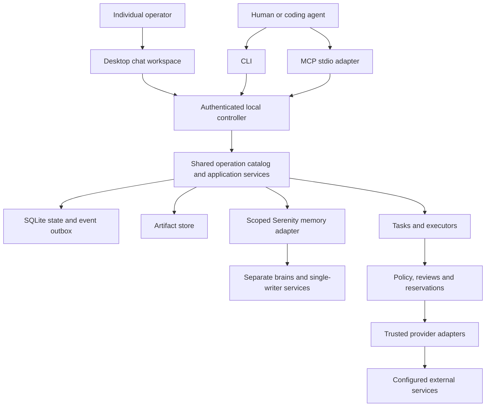

# Implementation assignment: `internal/application`

Generated specification revision 1; source digest `c79b39e5ca496cd59114fdaa2c9dd3a36d7c9c0d3b4426bc131063f5cef22ca2`. This file is committed implementation context. Do not independently edit it. Everything required from the product specification and adjacent interfaces is embedded below; no RFC copy is required.

## Mission and scope

Own authenticated operation execution, transaction composition, internal port allowlists and durable submission replay.

Write scope: **`internal/application/` only**, excluding this generated AGENTS.md. Go package name: `application`. Ownership kind: infrastructure; integration wave: 1.

Allowed production imports from this repository: `github.com/zatiti/zatiti/internal/contract`, `github.com/zatiti/zatiti/internal/registry`. Tests may use interfaces/fakes defined locally and, once available, storage-backed temporary fixtures; integration owns cross-package tests. No sibling raw SQL. No root dependency edits except the integration exception stated in its own brief.

## Implementation decisions and acceptance focus

Expose New(contract.Database,*registry.Registry,contract.Authenticator,contract.Clock,contract.IDSource) (*Application,error); Invoke(context.Context,contract.Actor,string,contract.Request) (contract.Result,error); Internal(context.Context,contract.Actor,contract.Scope,contract.Invocation) (contract.Payload,error); Authenticate(context.Context,[]byte) (contract.Actor,error); AuthenticateCertificate(context.Context,contract.Digest) (contract.Actor,error); Ports() contract.Ports. Application consumes only registry/contract, never imports domain packages. Expose NewPorts() *PortRouter, (*PortRouter).For(string) contract.Ports, and Bind(*Application) error for the exact two-phase assembly specified in common contract. Composition registers modules and injects app Ports using a constructor-safe late-bound dispatcher; no service calls until assembly complete. Public Invoke derives Unit scope from validated input plus referenced resource, revalidates authenticated actor, rejects internal operation. Gate _policy.check for every public capability; exceptions only bootstrap/capabilities as explicitly specified. Create mutation command identity/replay before stale checks; invoke handler in same ordered transaction; wrap result. Internal method callable only trusted controller scope, checks service principal and allowed entrypoints; ordinary domain Ports calls retain same actor/Unit and caller stack. Enforce catalog callers/visibility/mode, no recursive operation loop, no impersonation. Separate local IO prepare/perform/finish paths for explicitly registered IO modules; repeat authorization and version check at final metadata publication/disclosure. An accepted external job is not dispatched in request transaction. Record known refusal after rollback without losing dedupe concurrency. Bootstrap invokes shared installation initializer with special local capability granted by owner lock only.

Local proving focus: Cross-owner rollback, no network under Unit, same-unit actor propagation, forbidden internal transport call, allowlist and cycle check, duplicate commands, IO conflict/revocation races, denial parity.

## Incoming and outgoing boundaries

Incoming callers: entrypoint/assembly or tests via the explicit Go API.

Outgoing owner calls: `_identity.validate`, `_identity.activate`, `_configuration.validate`, `_configuration.activate`, `_skills.validate`, `_skills.activate`, `_connections.validate`, `_connections.activate`, `_policy.validate`, `_policy.activate`, `_accounting.validate`, `_accounting.activate`, `_scheduling.validate`, `_scheduling.activate`, `_memory.validate`, `_memory.activate`, `_identity.authority`, `_configuration.snapshot`, `_policy.check`, `_evidence.command.begin`, `_evidence.command.finish`, `_evidence.snapshot`, `_execution.enqueue`, `_execution.job.create`, `_execution.job.claim`, `_execution.job.record`. Each exact input/output schema appears below. Calls retain current Unit/authority; owner allowlists are mandatory.

### Imported package APIs and behavior

These briefs are embedded so you need not read a sibling prompt to discover its incoming API. Implement only your own package.

**`internal/registry`** — Own typed operation registration, collision checks, discovery, schema/OpenAPI generation and parity enumeration.

Expose New([]contract.Module) (*Registry,error), Lookup(string,int64) (contract.Descriptor,contract.Handler,error), Public() []contract.Descriptor, OpenAPI() ([]byte,error), and Bind generic helper exactly as shared contract. Implement capabilities as registry-owned Module; dependency-free descriptor discovery avoids recursive self-registration. Freeze public IDs/CLI/MCP names and schemas from embedded catalog. Validate unique IDs/version, owner, exact DTO schemas, dot/underscore name collisions, complete mappings, descriptor mode and submission semantics. Internal descriptors never appear in Public/OpenAPI/CLI/MCP or accepted public routing. OpenAPI 3.1 emits local schemas, error/result envelopes, request bodies and explicit accepted references. Generated client-facing catalog is derived from runtime typed registry, never another behavior authority. Baseline functionality cannot depend on optional MCP resources/prompts.

## Shared foundation contract

# Frozen implementation contract, revision 1

These decisions complete the product specification and bind every scope. Report contradictions with an affected-dependency list and proposed coordinated revision; do not change another owner's interface locally.

## Build and dependency decisions

Module `github.com/zatiti/zatiti`; language `go 1.26.0`; initial toolchain `go1.26.2`. Integration owns go.mod/go.sum. Domains import standard library and internal/contract, not sibling domains. Application composes owner methods through a checked in-process dispatcher: ordinary Go calls, not another server or scheduler.

Library families: Cobra CLI; official MCP Go SDK, handwritten adapter for MCP `2025-11-25`; Fyne v2 native Go desktop; modernc.org/sqlite. Mint is optional build-time tooling and cannot weaken contracts. Hosted provider v1: a specifically qualified OpenAI Responses endpoint/profile, with configured model and prices. Other compatible endpoints remain unavailable until qualified. GitHub uses documented REST over net/http, with mutation retries disabled. Serenity is a separate pinned service using public interfaces only. Integration must resolve exact dependency releases/commits, checksums, licenses and qualification commands in a lock report BEFORE dispatching dependent implementation. These are selected implementation families, not claims that upstream behavior has been qualified. No agent independently substitutes libraries, models, prices, accounts or Serenity APIs. Dependency resolution/qualification is an explicit foundation assignment.

## Shared Go declarations

The contract owner implements these exact declarations. Omitted function bodies are the implementation assignment, not production stubs. Public JSON uses snake_case. Schema-derived DTO names concatenate operation path segments in PascalCase plus Input/Output and live in the owning package. JSON integer => int64, UUID => contract.ID, timestamp => time.Time, optional scalar => pointer, array => slice, explicitly open JSON => json.RawMessage. Unknown fields are rejected.

```go
package contract
import (
    "context"
    "database/sql"
    "encoding/json"
    "io"
    "net/http"
    "time"
)
type ID string
type Digest string
type Version int64
type Clock interface { Now() time.Time }
type IDSource interface { New() ID }
type Scope struct {
    InstallationID ID `json:"installation_id"`
    OrganizationID ID `json:"organization_id,omitempty"`
    ProjectID ID `json:"project_id,omitempty"`
    WorkerID ID `json:"worker_id,omitempty"`
    TaskID ID `json:"task_id,omitempty"`
}
type Actor struct {
    PrincipalID ID `json:"principal_id"`
    Kind string `json:"kind"` // human | client_agent | worker | service
    CredentialID ID `json:"credential_id"`
}
type Request struct {
    Schema string `json:"schema"` // zatiti.request/v1
    SubmissionKey string `json:"submission_key,omitempty"`
    Input json.RawMessage `json:"input"`
}
type Fault struct {
    Code string `json:"code"`
    Message string `json:"message"`
    Retryable bool `json:"retryable"`
    Details json.RawMessage `json:"details,omitempty"`
}
func (*Fault) Error() string
type Outcome[T any] struct { Status string; Data T; NextCursor *string }
type Payload struct {
    Status string `json:"status"` // completed | accepted | failed
    Data json.RawMessage `json:"data"`
    Error *Fault `json:"error"`
    NextCursor *string `json:"next_cursor"`
}
type Result struct {
    Schema string `json:"schema"` // zatiti.result/v1
    CommandID ID `json:"command_id"`
    Payload
}
type Invocation struct { Operation string; Version int64; Input json.RawMessage }
type Event struct {
    ID ID `json:"id"`
    Sequence int64 `json:"sequence"`
    At time.Time `json:"at"`
    Scope Scope `json:"scope"`
    Kind string `json:"kind"` // owner.entity.transition
    ResourceID ID `json:"resource_id"`
    ResourceVersion Version `json:"resource_version"`
    Data json.RawMessage `json:"data"`
}
type Reader interface {
    QueryContext(context.Context, string, ...any) (*sql.Rows, error)
    QueryRowContext(context.Context, string, ...any) *sql.Row
}
type Unit interface {
    Reader
    ExecContext(context.Context, string, ...any) (sql.Result, error)
    Actor() Actor
    Scope() Scope
    Generation() int64
    ReadOnly() bool
    Emit(context.Context, Event) error
}
type Ownership interface { Held() bool; Lost() <-chan struct{}; Close() error }
type Database interface {
    StartGeneration(context.Context) (int64, error)
    Generation(context.Context) (int64, error)
    Read(context.Context, Actor, Scope, func(Unit) error) error
    Write(context.Context, Actor, Scope, func(Unit) error) error
    Migrate(context.Context, []Migration) error
    Events(context.Context, int64, int) ([]Event, error)
    Backup(context.Context, io.Writer) error
    Close() error
}
type Migration struct { Owner string; Version int64; SQL string; SHA256 Digest }
type Descriptor struct {
    ID string; Version int64; Owner string
    Visibility string // public | internal
    Mode string // query | mutation
    Effect string // local | disclosure | external_read | external_mutation
    InputSchema json.RawMessage; OutputSchema json.RawMessage; CompletionSchema json.RawMessage
    CLI []string; MCP string; ScopeRequired []string; Callers []string
    ExpectedVersion bool; SubmissionKey bool
}
type Handler func(context.Context, Unit, Invocation) (Payload, error)
type Module interface {
    Name() string
    Migrations() []Migration
    Descriptors() []Descriptor
    Handle(context.Context, Unit, Invocation) (Payload, error)
}
type Ports interface { Call(context.Context, Unit, Invocation) (Payload, error) }
type SecretStore interface {
    Put(context.Context, string, []byte) (string, error)
    Get(context.Context, string) ([]byte, error)
    Delete(context.Context, string) error
}
type BlobStore interface {
    Stage(context.Context, io.Reader, int64) (string, Digest, int64, error)
    Publish(context.Context, string, Digest) error
    Open(context.Context, Digest, int64, int64) (io.ReadCloser, error)
    RemoveStaged(context.Context, string) error
}
type Dependencies struct {
    Clock Clock; IDs IDSource; Ports Ports
    Secrets SecretStore; Blobs BlobStore
}
// Every domain owner: New(Dependencies) (*Service, error).
// *Service implements Module. Only declared outgoing ports may be used.
type Dispatch struct {
    OperationID ID `json:"operation_id"`
    AttemptID ID `json:"attempt_id"`
    Generation int64 `json:"generation"`
    Adapter string `json:"adapter"`
    Action json.RawMessage `json:"action"`
    CredentialRef string `json:"credential_ref"`
    ProviderKey string `json:"provider_key,omitempty"`
    Deadline time.Time `json:"deadline"`
}
type Observation struct {
    Disposition string `json:"disposition"` // succeeded | failed | accepted | unknown | not_sent
    ProviderReference string `json:"provider_reference,omitempty"`
    Evidence json.RawMessage `json:"evidence"`
    Usage json.RawMessage `json:"usage"`
    ConfirmedAt *time.Time `json:"confirmed_at,omitempty"`
}
type Adapter interface {
    Name() string
    Contract() json.RawMessage
    Invoke(context.Context, Dispatch) (Observation, error)
    Reconcile(context.Context, Dispatch) (Observation, error)
}
type AdapterDependencies struct {
    HTTP *http.Client; Secrets SecretStore; Clock Clock; Blobs BlobStore
}
// Every adapter: New(AdapterDependencies, json.RawMessage) (Adapter, error).
// Config is strictly validated, versioned and secret-free.
type Operator interface { Call(context.Context, string, Request) (Result, error) }
type CredentialSource interface { Credential(context.Context) ([]byte, error) }
```

The registry binds concrete input/output DTO types to descriptors and handlers using `Bind[I, O any](descriptor contract.Descriptor, fn func(context.Context, contract.Unit, I) (contract.Outcome[O], error)) (contract.Handler, error)`. JSON decoding is strict and schema validation precedes execution. Internal cross-owner calls use the same schema-checked Invocation boundary to avoid sibling package imports. They retain the same Unit, actor, scope, generation and transaction; cannot mint authority; and are not exposed as public operations.

## Transaction and ownership rules

Each domain owns tables prefixed with its package name and `_`. Schema and migration bodies inside that namespace are package-private; no other package depends on their layout. Storage owns installation generation, migration metadata and `storage_events`. Evidence owns commands/receipts. Migration ordering is explicit in application assembly. All migrations run under exclusive installation ownership before serving. Cross-owner reads and changes use Ports.Call and the embedded internal schemas. Internal operations have a caller allowlist. The dispatcher detects recursive calls. Queries cannot invoke mutation descriptors. Public clients cannot supply Actor or Unit or invoke internal operations.

One controller, one ordered writer, WAL, foreign keys on every connection, synchronous FULL, busy timeout 5 seconds, consistent read snapshots. Database.Write performs ONE transaction callback attempt with no automatic callback retry. Busy exhaustion returns controller_unavailable/retryable. Unit is valid only inside its callback; no goroutines or retained handles. Unit.Emit appends state-correlated evidence to the storage outbox in the same transaction. Delivery is at least once and consumers deduplicate event IDs. No network/model calls, secret-store access, filesystem streaming or subprocess work inside a Unit. Stage bytes or local helper actions outside transactions, then publish metadata or reconciliation intent through owner methods.

Handler errors roll back the entire transaction. Persist a command refusal in a separate short transaction after rollback where necessary, retaining the original request identity. Query command IDs need not be durable. All mutations return durable command IDs; accepted responses must identify inspectable durable work. Output schemas describe Payload.Data, not the result envelope. Never leak SQL, tokens, provider raw responses or private paths through Fault.

Definition creates/updates/archive stage drafts, including schedules, responsibilities, policies and memory bindings. Only configuration.apply activates definitions. It validates owners' candidate slices, seals base revision/dependencies/requirements, and calls internal activate in the same transaction under old authority. Internal activate is admitted only from the compiler during exact plan application, not by a public flag. Public restrictive pause/revoke/cancel commits immediately without compilation or spending. Archive staging may immediately disable new admissions as an explicitly reported restrictive side effect; final removal waits for obligations.

## Effect and execution rules

Admit: current authorization, exact review/preconditions, all budget reservations, attempt/dispatch intent and evidence atomically. Claim: second transaction rechecks generation/restrictions/expiry and consumes the one-use claim. Invoke the adapter outside transactions. Record: third transaction stores observations, costs or retained uncertainty and events. Each physical call, including reconciliation and retries, has a distinct attempt. Reconciliation is an admitted bounded read and links to the original effect; it does not overwrite history. Internal jobs use explicitly provisioned scoped service identities plus current worker/task restrictions.

Once claimed, crash/timeout/cancel/lease expiry/operator acknowledgement/weak not-found cannot prove nonexecution. Preserve outcome_unknown and its reservation until authoritative evidence. Earlier unknown attempts survive later failures. Mutation SDK/HTTP retries are disabled. Even qualified idempotent retries need fresh authorization and physical-attempt evidence. Trusted adapters resolve credential references outside transactions; no public raw secrets or inherited owner credential environment. Fencing external workers blocks Zatiti mutations but cannot prove their processes stopped.

Task success needs independently established acceptance against pinned verifier code/version, sealed inputs and observations. Worker report/exit zero cannot set succeeded. Defaults: one concurrent attempt/worker, four/installation, 30 minutes/attempt, 100 model steps, eight children, delegation depth three, root deadline 24 hours. Configure explicit currency and finite spend limits before paid work. Amounts are int64 micro-units with checked overflow; rational rates use integer numerator/denominator and round reservations upward. Unknown/advisory usage and missing prices are not zero. Children share root and ancestor budgets.

## Wire conventions and limits

UUIDv4 for new identities; stable UUID references thereafter. SHA-256 lowercase hex digests. Versioned canonical JSON sorts keys, rejects duplicate keys/unknown fields, preserves exact integer values and semantic array order; schema-declared sets sort by stable identity. Preserve exact skill bytes. UTC RFC3339Nano timestamps and int64 versions >=1. Patches and snapshots are distinct; explicit delete only. Inert `extensions` alone permits namespaced extra keys. Scope is explicit and every referenced object is revalidated; no implicit global organization.

Default limits: JSON request 1 MiB; chunk 1 MiB decoded; artifact 256 MiB; skill archive 16 MiB compressed, 64 MiB expanded, 4096 entries, depth 32; list 50/max 200; read 1 MiB; redacted log record 8 KiB; event page 100/max 500; upload expiry 24 hours. Narrowing is allowed, increases require authorized configuration. Reject overflow and unsupported bounds.

Mutations require submission_key (1..128 printable ASCII) except one-time init. Bind principal, operation/version and canonical input hash. Retain >=30 days and through unresolved obligations. Replay identical input returns original disposition BEFORE stale-version validation; changed input => submission_conflict. Concurrent duplicates serialize. Recover lost acknowledgements by command lookup, not a new key. Resource updates require expected_version; apply requires base_revision and plan digest. Creation has no existing version. Opaque authenticated cursors bind principal/scope/filter/order/snapshot and expire explicitly with cursor_expired and snapshot_required=true. Event replay cannot silently omit a gap.

HTTP POST `/v1/operations/{operation_id}` uses the common request envelope. Local HTTP runs over a private Unix socket. Explicit remote desktop uses mutual TLS mapped to current application principals over the same operation contract, never remote MCP. Completed => HTTP 200; accepted => 202. Failed mapping: invalid_input 400, permission_denied 403, not_found 404, stale_version/submission_conflict/conflict/review_required/outcome_unknown/artifact_fault 409, cursor_expired 410, prerequisite_missing/external_action_required/budget_unavailable/capability_unsupported/verification_failed 422, controller_unavailable 503, internal_error 500. Domain failures always include the result envelope.

CLI completed/accepted => exit 0; invalid_input 2; permission_denied/review_required 3; stale_version/submission_conflict/conflict 4; prerequisite_missing/external_action_required/budget_unavailable/capability_unsupported 5; controller_unavailable/outcome_unknown 6; other failures 1. CLI --json emits one envelope to stdout, diagnostics stderr, no implicit prompts. MCP structuredContent is the full envelope, text is equivalent JSON, failed => isError true, malformed protocol => protocol error. Dot-separated operation IDs map to CLI tokens and `zatiti_` MCP names. Exceptions: installation.init => `zatiti init` / `zatiti_installation_init`; capabilities.list => `zatiti capabilities` / `zatiti_capabilities`. Lifecycle steps are individual tools. Tool input never selects a credential profile or accepts raw secrets/unrestricted server paths.

## Completion policy

Write only within the assigned root. Do not edit this prompt, siblings, shared contracts, root dependencies or external acceptance inputs. Implement exact fake dependencies locally; do not return invented production success for unavailable prerequisites. Use controlled providers, deterministic clocks and synthetic fixtures. Preserve expected/observed results and failure evidence. Package tests prove local properties; actual subprocess parity, crash recovery, desktop and adapter qualification prove integration. Z01-Z21 and first-release journeys on macOS/Linux must pass before a release is claimed.

## Local IO, authentication, jobs and verification seams

These additional declarations are part of the SAME frozen contract package (using imports already shown). Implementing an interface does not permit calling it inside a Unit except where the signature explicitly takes Unit/Reader.

```go
type Authenticator interface {
    Authenticate(context.Context, Reader, []byte) (Actor, error)
    AuthenticateCertificate(context.Context, Reader, Digest) (Actor, error)
}
type IOPlan struct {
    ID ID
    Owner string
    Invocation Invocation
    Actor Actor
    Scope Scope
    Generation int64
    ExpectedVersions map[ID]Version
    Prepared json.RawMessage
}
type IOResult struct { Data json.RawMessage; Fault *Fault }
type LocalIO interface {
    Prepare(context.Context, Unit, Invocation) (IOPlan, error)
    Perform(context.Context, IOPlan) (IOResult, error)
    Finish(context.Context, Unit, IOPlan, IOResult) (Payload, error)
}
// Request is the exact VerificationRequest JSON schema embedded in the prompt.
type Verification struct { Request json.RawMessage }
// Document is the exact VerificationResult schema, including independently
// observed checks, pinned identity, task/attempt and staged artifact handoff.
type VerificationResult struct { Document json.RawMessage }
type Verifier interface {
    Verify(context.Context, Verification) (VerificationResult, error)
}
type VerifierDependencies struct { Clock Clock; Blobs BlobStore }
```

Identity Service also implements Authenticator. Application receives this interface explicitly in New; it uses a dedicated read snapshot and never reads identity-owned tables itself. Only the byte-slice credential boundary carries secret authentication material, never Invocation JSON. Zero sensitive buffers after use where practical; no logging. Certificate authentication resolves a preprovisioned credential reference and follows the same current principal/revocation rules.

Artifacts, skills, connections and installation Services also implement LocalIO. The registry detects this interface at assembly and routes ONLY registered local IO operations through Prepare/Perform/Finish: artifact.upload.chunk/finish/cancel/read/export; skill.import; connection.setup.begin/complete/cancel; installation.init/backup/restore. LocalIO handles local bounded files, secure helpers and backup work, never unadmitted provider/model calls. Prepare strictly validates input, versions, identity and authority and records replayable local intent under IOPlan.ID; Perform receives that exact trusted in-memory plan outside transactions, resolves opaque staging/helper references, and returns metadata; Finish rechecks authority/versions/generation and commits result/evidence. IOPlan is never public, accepted from an agent or stored with secrets. Prepared/Data JSON must use the operation's declared schemas plus private owner-local metadata, which no other package reads. No cross-owner business protocol may hide in those private fields. Perform must support safe replay of local staging/publication by plan ID, or preserve an inspectable failed/unknown local obligation. A synchronous read does not return bytes to client until final authorization check. New raw provider writes always use effects, not this interface.

For synchronous local IO mutations, persist command identity plus accepted internal pending disposition at Prepare, then replace pending disposition once at Finish. Concurrent same-key calls join/inspect that same in-progress command and never run duplicate Perform. The controller can recover abandoned local intents using the execution job API. Async backup/export uses the same interface with an inspectable job returned immediately. The artifact.upload.chunk endpoint has a 2 MiB encoded request cap (all other ordinary JSON requests 1 MiB), allowing the specified 1 MiB decoded chunk plus envelope.

Execution owns shared durable jobs (execution_jobs), distinct from runs and physical effects. `_execution.job.create` stores the original owner/operation/input and idempotent source identity; public job.get inspects any authorized job. Controller lists pending jobs, claims generation-bound ownership, invokes the named LocalIO owner outside transactions through its exact plan, and records result/obligation. Network jobs first prepare effects and wait on their recorded outcomes. `_execution.job.record` stores result data matching the originating operation's explicit completion_schema and links actual artifact/operation evidence. Never mark a job succeeded merely because its physical request was accepted.

Tasks calls `_execution.enqueue` with ready pinned task inside the same transaction; execution creates one run for task/version and returns it. `_tasks.ready` also exposes a bounded recovery scan. Execution's verifier constructor is `NewVerifier(contract.VerifierDependencies) (contract.Verifier,error)`. Verify executes outside Unit and returns actual independently established observations under the pinned accepted profile; `_execution.verification.record` rechecks attempt/task/version before changing task state. A forged worker-provided VerificationResult is never accepted through public report. Concrete context/adapter/verification payload schemas are included in relevant prompts.

Administrative effects that have no task use their command/operation ID as an accountable admission root; no fictional worker/task or fabricated task foreign key is required. Accounting skips absent scope dimensions but always reserves installation and present organization ancestors/project limits. Task effects additionally share root_task_id. A profile without enforceable charge bounds cannot claim a hard cap.

Typed handler bindings return `contract.Outcome[O]` so accepted results and page cursors survive typed registration. The frozen Bind signature is `Bind[I, O any](contract.Descriptor, func(context.Context, contract.Unit, I) (contract.Outcome[O], error)) (contract.Handler, error)`. Errors carry Fault and roll back, while accepted/completed status and cursor come from Outcome.

Assembly order: application.NewPorts() returns an unbound *PortRouter; For(owner string) returns an owner-bound contract.Ports without domain calls; construct identity and all other modules with those ports; registry.New(modules); application.New(db, registry, identityAuthenticator, clock, ids); router.Bind(app) exactly once; start serving only after Bind. PortRouter exposes `For(string) contract.Ports` and `Bind(*Application) error`, rejects pre-bind invocation, and never allows a domain to change its bound caller identity. Registry also implements Module for its own capabilities methods. Constructor execution must not query peers or start goroutines.

All native BlobStore objects are encrypted at rest (including public-classification content), because Stage has no classification argument. Metadata publication sets encrypted=true; classification separately governs disclosure. Controller records the raw adapter observation and cost disposition durably first, then publishes StagedOutput bytes outside Unit, then commits artifact metadata and normalized owner callbacks through an outbox consumer. Publication failure is a visible artifact obligation and blocks task/job acceptance; it does not erase a confirmed provider observation or authorize resending. The adapter cannot mint artifact IDs.

Entrypoint assembly owns platform.Acquire -> storage.Open -> Migrate -> Database.StartGeneration, exactly once before controller/server admission. Pass the held contract.Ownership into controller.New; controller never acquires a second lock or advances generation again. Ownership.Lost closes when ownership is lost/released; stop admission immediately. Generation is a persisted local-controller fence, not distributed locking. The installation lock is retained until controller shutdown and DB close.

Remote TLS additionally validates the certificate chain and maps the SHA-256 certificate SPKI fingerprint through application.AuthenticateCertificate(ctx,Digest), which delegates to identity Authenticator.AuthenticateCertificate on a read snapshot. Only a verified TLS peer can enter that API; operation input cannot supply the fingerprint. Store certificate fingerprints as identity-owned authentication metadata on an explicitly provisioned credential reference. If a bearer credential is also supplied, its principal must match the verified certificate principal. No self-asserted certificate name, profile name or fingerprint header grants authority.

Every async operation declares completion_schema separately from its immediate Job response. job.get returns that schema as Job.result only when established; pending jobs omit result. Local IO mutations that may be recovered asynchronously accept either their completed resource output or `{job: Job}` in the descriptor output schema. Bootstrap remains synchronous under its exclusive one-time lock. No unspecified job kind may execute: _execution.job.create requires a registered completion_schema or a specifically registered private local-intent recovery contract.

Evidence retains the complete original result envelope for command replay, including fault message/details/retryability and cursor; projections of status/data/error_code must agree with Command.result. `_evidence.command.finish` takes that exact result. A replay cannot reconstruct a different error or lose an accepted job reference. ScopeRequired lists installation_id where input scope is required; resource-specific organization/project/worker conditions are enforced by the owned operation schemas and current referenced-resource validation, never inferred from a profile name.

Descriptor.Callers carries the exact catalog internal caller allowlist into runtime registration; application enforces this metadata rather than inventing it from operation names. Internal metadata remains available to trusted assembly/registry while public capability output contains public operations only. An empty allowlist never authorizes an internal call.

## Owned product requirements

### R3-002 (source section 3; primary owner storage)

Ship a `zatiti` Go controller/CLI binary with CLI commands, `serve`, and `mcp serve`, plus a desktop client and a pinned Serenity integration. One always-on controller owns scheduling, admission, persistence, credential access, and recovery. It may run on the user's computer or an operator-controlled server; ongoing work requires that host to remain available. Closing the desktop client does not stop the controller. Optional local execution workers connect to that same owner; moving work between controllers is not a v1 feature.

### R3-003 (source section 3; primary owner storage)

Desktop, CLI, and MCP are clients of the controller's application services. MCP processes do not start separate schedulers or write the database directly. Local clients use a private Unix-domain socket; a remote desktop connection uses an explicitly configured authenticated TLS endpoint over the same versioned operation contract. Credentials remain in secure client storage and are not supplied as model-visible arguments. Reconnection reads snapshots and replayable events, and retries commands with their original submission keys. A disconnected desktop can display cached history and retain unsent drafts, but cannot claim a command, approval, or pause reached the controller until acknowledged.

### R3-004 (source section 3; primary owner storage)

The controller publishes a versioned API contract; a pinned Mint generation step may turn that contract into the MCP server shipped with Zatiti. Mint is a build-time adapter, not a second source of domain behavior. Serenity has a separate canonical memory store and one writer owner per brain; this revises the original single-binary-only deployment proposal. Its process packaging and lifecycle must be qualified with the desktop/controller distribution.

### R3-005 (source section 3; primary owner storage)



### R3-006 (source section 3; primary owner storage)

| Area | Proposed implementation |
|---|---|
| Language | Supported stable Go toolchain, pinned in `go.mod` and CI |
| CLI | Cobra for command structure; generated operation commands over shared schemas |
| MCP | Generated from the versioned API contract with Mint, pinned and tested against the supported MCP protocol; explicit protocol and parity tests |
| Client transport | Versioned HTTP/JSON over a private Unix-domain socket locally; authenticated TLS for explicitly configured remote desktop access |
| State | SQLite in WAL mode, foreign keys enabled, bounded busy timeout, short explicit transactions; a pinned Go SQLite driver |
| Artifacts | Content-addressed local files; encrypted sensitive content and integrity-checked metadata |
| Credentials | OS secret store or explicitly provisioned headless secret source; encrypted database values reference an external master key |
| Logs | Structured `slog` on stderr or protected files; bounded, redacted fields |
| Tests | Go unit/integration suites, deterministic clocks and provider simulators, subprocess CLI/MCP conformance tests |

### R3-007 (source section 3; primary owner storage)

SQLite is selected to make a single-tenant installation usable without a database service. There is one controller writer and no shared network-filesystem database. An exclusive installation lock prevents a second controller from serving the same state directory. Startup advances a persisted controller generation; workers, dispatch claims, and leases bind that generation. Losing installation ownership stops admission. The supported deployment relies on local OS lock semantics; distributed fencing is not claimed.

### R3-008 (source section 3; primary owner storage)

The controller uses a single ordered write path with transaction-aware domain methods. Reads use consistent snapshots. No network or model call runs inside a retryable database transaction. State changes and their event/outbox entries commit together. Crash recovery reads durable state, not log text. Database contention returns a bounded retryable error rather than hanging a client indefinitely.

### R3-009 (source section 3; primary owner storage)

The database owns principals, grants, revisions, tasks, schedules, runs, attempts, operations, approvals, reservations, commands, events, artifact metadata, and recovery obligations. Definition JSON is canonicalized before hashing. Query projections are not a second hashing authority. Files are staged and hashed before metadata publication; unreferenced staging content is reclaimed later. A committed reference whose bytes are unavailable produces a visible artifact fault, never a successful result.

### R8.1-002 (source section 8.1; primary owner registry)

Define one typed Go operation registry. Each descriptor supplies operation ID/version, input/output JSON Schemas, effect category, scope requirements, stale-write/idempotency behavior, and handler. Generate the versioned local API description, CLI command registration, MCP tool definitions, capability documentation, and parity test cases from that registry.

### R8.1-003 (source section 8.1; primary owner registry)

Mint can consume the generated OpenAPI 3.x description and generate the MCP transport and client calls. The generated server calls Zatiti's authenticated local API; it never receives database access or bypasses application services. Pin the Mint version or commit and the generated output in a release build, review generated diffs, and run parity tests against the same controller fixtures. A Mint-generated tool is not accepted if an operation is missing from the CLI, has a different schema, loses submission-key/version semantics, changes error mapping, or exposes an unreviewed endpoint. If Mint cannot represent a required contract, keep the MCP operation in a hand-written adapter or block release; do not weaken the domain contract to fit the generator.

### R8.1-004 (source section 8.1; primary owner registry)

For operation `worker.create`, the CLI is `zatiti worker create` and the MCP tool is `zatiti_worker_create`. Operation IDs use an unambiguous naming convention; generation rejects CLI/MCP name collisions. Every product operation has both mappings. Executing an arbitrary shell command or asking MCP to run the CLI does not satisfy parity.

### R8.1-005 (source section 8.1; primary owner registry)

| Operation family | Required v1 operations |
|---|---|
| Installation | init, status, pause, resume, doctor, backup, restore |
| Capabilities | list operation descriptors, get schema and supported versions |
| Principals and grants | create, list, get, update, revoke; provision/revoke credential references |
| Organizations, teams, projects | create, list, get, update, archive, export, import |
| Workers | create, list, get, update, archive, pause, resume |
| Skills | import, list, get, evaluate, evaluation status, archive |
| Tools | list contracts, inspect schema, bind, unbind; no arbitrary code installation |
| Connections | create, list, get, update, validate, setup begin/status/complete/cancel, rotate, revoke, archive |
| Configuration | draft create/get/update/list/discard, plan, plan get/list, apply, revision list/get, rollback plan |
| Policies | create, list, get, update, archive, explain against a specified action |
| Tasks | create, list, get, update pending inputs, assign, delegate, cancel, retry, dependency inspection |
| Schedules | create, list, get, update, pause, resume, archive |
| Runs and attempts | list, get, claim, heartbeat, checkpoint, report, cancel, inspect recovery state |
| Reviews | list, get exact preview, decide, delegate |
| Operations | list, get, reconcile, propose compensation/replacement |
| Artifacts | upload begin/chunk/finish/cancel, list, get metadata, read bounded bytes, export |
| Events and commands | list events after cursor, get event, get command by submission key |
| Budgets and usage | get limits, propose limit changes, inspect spent/reserved/unknown usage |

### R8.1-006 (source section 8.1; primary owner registry)

This table specifies coverage rather than an unchecked claim of generated tooling. Before implementation, give every concrete operation a descriptor and schema. Compound lifecycle operations such as credential setup remain individually discoverable tools. Optional MCP resources/prompts cannot be the only route to product functionality. An agent must be able to learn the product through capabilities and schemas without reading repository source.

### R8.4-002 (source section 8.4; primary owner contract)

```json
{
  "schema": "zatiti.result/v1",
  "command_id": "00000000-0000-4000-8000-000000000001",
  "status": "completed",
  "data": {"draft_id": "00000000-0000-4000-8000-000000000002", "version": 1},
  "error": null,
  "next_cursor": null
}
```

### R8.4-003 (source section 8.4; primary owner contract)

`status` is `completed`, `accepted`, or `failed`. Completion of a command such as task creation or approval is not completion of the task or external effect it refers to. Data carries resource IDs, actual lifecycle state, versions, relevant artifact/event references and next actions. Accepted long operations include an inspectable task/job reference. Stable error codes include `invalid_input`, `not_found`, `permission_denied`, `stale_version`, `review_required`, `prerequisite_missing`, `external_action_required`, `budget_unavailable`, `capability_unsupported`, `controller_unavailable`, and `outcome_unknown`.

### R8.4-004 (source section 8.4; primary owner contract)

CLI exits are 0 for completed/accepted commands, 2 for input errors, 3 for denied/review-required access, 4 for stale/conflicting state, 5 for missing prerequisites or unsupported capability, 6 for unavailable/unknown outcomes, and 1 for other failures. Machine clients inspect the envelope as well as the exit code. A pending task is not a CLI failure. An unknown external outcome is not a successful write.

### R8.4-005 (source section 8.4; primary owner contract)

Mutating requests require a caller-generated submission key except during initial bootstrap, where the uninitialized installation lock supplies uniqueness. The controller binds keys to principal, operation ID/version and canonical request hash. Reuse with identical input returns the original durable command disposition; changed input refuses. A lost acknowledgement is recovered through command lookup, not a new key. Keep keys at least 30 days and through all unresolved obligations. MCP JSON-RPC request IDs are not submission keys.

### R8.4-006 (source section 8.4; primary owner contract)

Resource changes require an expected version or base revision. Pagination uses stable opaque cursors and bounded page sizes; list/get/event operations return the same scope and freshness in both transports. MCP resources and CLI watch are optional presentation conveniences over replayable event reads. Clients encountering an expired event cursor fetch a new snapshot and resume; no silent gap is presented as complete history.

### R8.4-007 (source section 8.4; primary owner contract)

Large content uses bounded chunk upload and byte-range read operations in both interfaces. The client chooses local file locations; MCP never accepts an unrestricted server filesystem path. Backup creation returns an opaque backup artifact, and restore consumes an uploaded backup reference in a quiesced maintenance mode. The same local owner operation can enter maintenance through CLI or MCP; it does not require a transport-specific admin endpoint.

### R8.4-008 (source section 8.4; primary owner contract)

Starting/stopping a client process, shell completion, help formatting and MCP protocol negotiation are transport mechanics rather than product operations. Installation initialization, health, credentials, backup and restore remain product operations and require parity. The parity suite enumerates the registry and rejects unmapped operations or unequal authorization, state, error, pagination, or event behavior.
## Exact operation and dependency schemas

### `_accounting.activate` v1 — accounting / internal / mutation / local

Allowed internal callers: configuration, application. Submission key: not required at this internal/query/bootstrap boundary.

Apply owned exact sealed candidate slice inside compiler transaction; caller must hold configuration-apply context established by application. No public activation flag or second compiler.

Input schema:
```json
{"type":"object","additionalProperties":false,"properties":{"candidate":{"$ref":"#/$defs/Candidate"}},"required":["candidate"]}
```
Output data schema:
```json
{"type":"object","additionalProperties":false,"properties":{"versions":{"type":"array","items":{"$ref":"#/$defs/Ref"},"maxItems":4096}},"required":["versions"]}
```

### `_accounting.validate` v1 — accounting / internal / query / local

Allowed internal callers: configuration, application. Submission key: not required at this internal/query/bootstrap boundary.

Validate only owned candidate slice against current snapshot, collect dependency identities/requirements; no live changes or network. Candidate changes must match their registered concrete definition schemas. Expected-version zero is create-only. Authorization comes from old effective state.

Input schema:
```json
{"type":"object","additionalProperties":false,"properties":{"candidate":{"$ref":"#/$defs/Candidate"}},"required":["candidate"]}
```
Output data schema:
```json
{"type":"object","additionalProperties":false,"properties":{"resource":{"$ref":"#/$defs/Validation"}},"required":["resource"]}
```

### `_configuration.activate` v1 — configuration / internal / mutation / local

Allowed internal callers: configuration, application. Submission key: not required at this internal/query/bootstrap boundary.

Apply owned exact sealed candidate slice inside compiler transaction; caller must hold configuration-apply context established by application. No public activation flag or second compiler.

Input schema:
```json
{"type":"object","additionalProperties":false,"properties":{"candidate":{"$ref":"#/$defs/Candidate"}},"required":["candidate"]}
```
Output data schema:
```json
{"type":"object","additionalProperties":false,"properties":{"versions":{"type":"array","items":{"$ref":"#/$defs/Ref"},"maxItems":4096}},"required":["versions"]}
```

### `_configuration.snapshot` v1 — configuration / internal / query / local

Allowed internal callers: application, policy, tasks, execution, effects, memory, reviews, accounting, scheduling, messaging, connections, installation. Submission key: not required at this internal/query/bootstrap boundary.

Read current ancestry, effective bindings, worker/project and revision; no automatic descendant private data access.

Input schema:
```json
{"type":"object","additionalProperties":false,"properties":{"scope":{"$ref":"#/$defs/Scope"}},"required":["scope"]}
```
Output data schema:
```json
{"type":"object","additionalProperties":false,"properties":{"resource":{"$ref":"#/$defs/ScopeSnapshot"}},"required":["resource"]}
```

### `_configuration.validate` v1 — configuration / internal / query / local

Allowed internal callers: configuration, application. Submission key: not required at this internal/query/bootstrap boundary.

Validate only owned candidate slice against current snapshot, collect dependency identities/requirements; no live changes or network. Candidate changes must match their registered concrete definition schemas. Expected-version zero is create-only. Authorization comes from old effective state.

Input schema:
```json
{"type":"object","additionalProperties":false,"properties":{"candidate":{"$ref":"#/$defs/Candidate"}},"required":["candidate"]}
```
Output data schema:
```json
{"type":"object","additionalProperties":false,"properties":{"resource":{"$ref":"#/$defs/Validation"}},"required":["resource"]}
```

### `_connections.activate` v1 — connections / internal / mutation / local

Allowed internal callers: configuration, application. Submission key: not required at this internal/query/bootstrap boundary.

Apply owned exact sealed candidate slice inside compiler transaction; caller must hold configuration-apply context established by application. No public activation flag or second compiler.

Input schema:
```json
{"type":"object","additionalProperties":false,"properties":{"candidate":{"$ref":"#/$defs/Candidate"}},"required":["candidate"]}
```
Output data schema:
```json
{"type":"object","additionalProperties":false,"properties":{"versions":{"type":"array","items":{"$ref":"#/$defs/Ref"},"maxItems":4096}},"required":["versions"]}
```

### `_connections.validate` v1 — connections / internal / query / local

Allowed internal callers: configuration, application. Submission key: not required at this internal/query/bootstrap boundary.

Validate only owned candidate slice against current snapshot, collect dependency identities/requirements; no live changes or network. Candidate changes must match their registered concrete definition schemas. Expected-version zero is create-only. Authorization comes from old effective state.

Input schema:
```json
{"type":"object","additionalProperties":false,"properties":{"candidate":{"$ref":"#/$defs/Candidate"}},"required":["candidate"]}
```
Output data schema:
```json
{"type":"object","additionalProperties":false,"properties":{"resource":{"$ref":"#/$defs/Validation"}},"required":["resource"]}
```

### `_evidence.command.begin` v1 — evidence / internal / mutation / local

Allowed internal callers: application. Submission key: not required at this internal/query/bootstrap boundary.

Atomically acquire command identity or return original disposition; changed hash conflicts. Retention >=30 days plus obligations.

Input schema:
```json
{"type":"object","additionalProperties":false,"properties":{"principal_id":{"type":"string","format":"uuid"},"operation":{"type":"string","maxLength":8192},"operation_version":{"type":"integer","minimum":1,"maximum":9223372036854775807},"submission_key":{"type":"string","maxLength":8192},"request_digest":{"type":"string","pattern":"^[0-9a-f]{64}$"}},"required":["principal_id","operation","operation_version","submission_key","request_digest"]}
```
Output data schema:
```json
{"type":"object","additionalProperties":false,"properties":{"command_id":{"type":"string","format":"uuid"},"existing":{"$ref":"#/$defs/Command"}},"required":["command_id"]}
```

### `_evidence.command.finish` v1 — evidence / internal / mutation / local

Allowed internal callers: application. Submission key: not required at this internal/query/bootstrap boundary.

Persist handler disposition in same transaction as its state/events; remember denial separately after rollback when required. Retain complete original result envelope including Fault message/details/retryability and cursor; replays return it exactly. Command ID must match result.command_id.

Input schema:
```json
{"type":"object","additionalProperties":false,"properties":{"command_id":{"type":"string","format":"uuid"},"result":{"$ref":"#/$defs/Result"}},"required":["command_id","result"]}
```
Output data schema:
```json
{"type":"object","additionalProperties":false,"properties":{"resource":{"$ref":"#/$defs/Command"}},"required":["resource"]}
```

### `_evidence.snapshot` v1 — evidence / internal / query / local

Allowed internal callers: application, installation, messaging. Submission key: not required at this internal/query/bootstrap boundary.

Get current event checkpoint with consistent scoped read; no private events through cursor position.

Input schema:
```json
{"type":"object","additionalProperties":false,"properties":{"scope":{"$ref":"#/$defs/Scope"}},"required":["scope"]}
```
Output data schema:
```json
{"type":"object","additionalProperties":false,"properties":{"last_sequence":{"type":"integer","minimum":0,"maximum":9223372036854775807}},"required":["last_sequence"]}
```

### `_execution.enqueue` v1 — execution / internal / mutation / local

Allowed internal callers: tasks, scheduling, application. Submission key: not required at this internal/query/bootstrap boundary.

Create/deduplicate run for ready task/version with pinned configuration/inputs. Called in task creation/admission transaction; does not claim/dispatch yet.

Input schema:
```json
{"type":"object","additionalProperties":false,"properties":{"task":{"$ref":"#/$defs/Task"}},"required":["task"]}
```
Output data schema:
```json
{"type":"object","additionalProperties":false,"properties":{"resource":{"$ref":"#/$defs/Run"}},"required":["resource"]}
```

### `_execution.job.claim` v1 — execution / internal / mutation / local

Allowed internal callers: controller, application. Submission key: not required at this internal/query/bootstrap boundary.

Atomically claim one current job owner under generation; abandoned claimed provider intent never blindly redispatched.

Input schema:
```json
{"type":"object","additionalProperties":false,"properties":{"job_id":{"type":"string","format":"uuid"},"expected_version":{"type":"integer","minimum":1,"maximum":9223372036854775807},"generation":{"type":"integer","minimum":1,"maximum":9223372036854775807}},"required":["job_id","expected_version","generation"]}
```
Output data schema:
```json
{"type":"object","additionalProperties":false,"properties":{"job":{"$ref":"#/$defs/Job"},"input":{"type":"object","description":"Inert JSON data bounded by the enclosing size limit; never executable authority."}},"required":["job","input"]}
```

### `_execution.job.create` v1 — execution / internal / mutation / local

Allowed internal callers: configuration, skills, connections, memory, artifacts, installation, execution, effects, application. Submission key: not required at this internal/query/bootstrap boundary.

Validate owner/operation against catalog and original input schema; deduplicate source identity with canonical input hash. No arbitrary executable jobs.

Input schema:
```json
{"type":"object","additionalProperties":false,"properties":{"scope":{"$ref":"#/$defs/Scope"},"owner":{"type":"string","maxLength":8192},"operation":{"type":"string","maxLength":8192},"input":{"type":"object","description":"Inert JSON data bounded by the enclosing size limit; never executable authority."},"source_id":{"type":"string","format":"uuid"}},"required":["scope","owner","operation","input","source_id"]}
```
Output data schema:
```json
{"type":"object","additionalProperties":false,"properties":{"resource":{"$ref":"#/$defs/Job"}},"required":["resource"]}
```

### `_execution.job.record` v1 — execution / internal / mutation / local

Allowed internal callers: controller, application, effects, memory, skills, connections, installation. Submission key: not required at this internal/query/bootstrap boundary.

Record real result conforming originating operation schema, preserve unknown obligations and actual evidence; result changes require current claim.

Input schema:
```json
{"type":"object","additionalProperties":false,"properties":{"job_id":{"type":"string","format":"uuid"},"expected_version":{"type":"integer","minimum":1,"maximum":9223372036854775807},"generation":{"type":"integer","minimum":1,"maximum":9223372036854775807},"state":{"type":"string","enum":["pending","running","succeeded","failed","outcome_unknown","cancelled"]},"result":{"type":"object","description":"Inert JSON data bounded by the enclosing size limit; never executable authority."},"evidence_ids":{"type":"array","items":{"type":"string","format":"uuid"},"maxItems":4096}},"required":["job_id","expected_version","generation","state","result","evidence_ids"]}
```
Output data schema:
```json
{"type":"object","additionalProperties":false,"properties":{"resource":{"$ref":"#/$defs/Job"}},"required":["resource"]}
```

### `_identity.activate` v1 — identity / internal / mutation / local

Allowed internal callers: configuration, application. Submission key: not required at this internal/query/bootstrap boundary.

Apply owned exact sealed candidate slice inside compiler transaction; caller must hold configuration-apply context established by application. No public activation flag or second compiler.

Input schema:
```json
{"type":"object","additionalProperties":false,"properties":{"candidate":{"$ref":"#/$defs/Candidate"}},"required":["candidate"]}
```
Output data schema:
```json
{"type":"object","additionalProperties":false,"properties":{"versions":{"type":"array","items":{"$ref":"#/$defs/Ref"},"maxItems":4096}},"required":["versions"]}
```

### `_identity.authority` v1 — identity / internal / query / local

Allowed internal callers: application, policy, reviews, configuration, execution, effects. Submission key: not required at this internal/query/bootstrap boundary.

Read current principal, grants, expiry/revocations and restrictions; no grants from claimed profile/name or proposed policy.

Input schema:
```json
{"type":"object","additionalProperties":false,"properties":{"principal_id":{"type":"string","format":"uuid"},"scope":{"$ref":"#/$defs/Scope"}},"required":["principal_id","scope"]}
```
Output data schema:
```json
{"type":"object","additionalProperties":false,"properties":{"resource":{"$ref":"#/$defs/Authority"}},"required":["resource"]}
```

### `_identity.validate` v1 — identity / internal / query / local

Allowed internal callers: configuration, application. Submission key: not required at this internal/query/bootstrap boundary.

Validate only owned candidate slice against current snapshot, collect dependency identities/requirements; no live changes or network. Candidate changes must match their registered concrete definition schemas. Expected-version zero is create-only. Authorization comes from old effective state.

Input schema:
```json
{"type":"object","additionalProperties":false,"properties":{"candidate":{"$ref":"#/$defs/Candidate"}},"required":["candidate"]}
```
Output data schema:
```json
{"type":"object","additionalProperties":false,"properties":{"resource":{"$ref":"#/$defs/Validation"}},"required":["resource"]}
```

### `_memory.activate` v1 — memory / internal / mutation / local

Allowed internal callers: configuration, application. Submission key: not required at this internal/query/bootstrap boundary.

Apply owned exact sealed candidate slice inside compiler transaction; caller must hold configuration-apply context established by application. No public activation flag or second compiler.

Input schema:
```json
{"type":"object","additionalProperties":false,"properties":{"candidate":{"$ref":"#/$defs/Candidate"}},"required":["candidate"]}
```
Output data schema:
```json
{"type":"object","additionalProperties":false,"properties":{"versions":{"type":"array","items":{"$ref":"#/$defs/Ref"},"maxItems":4096}},"required":["versions"]}
```

### `_memory.validate` v1 — memory / internal / query / local

Allowed internal callers: configuration, application. Submission key: not required at this internal/query/bootstrap boundary.

Validate only owned candidate slice against current snapshot, collect dependency identities/requirements; no live changes or network. Candidate changes must match their registered concrete definition schemas. Expected-version zero is create-only. Authorization comes from old effective state.

Input schema:
```json
{"type":"object","additionalProperties":false,"properties":{"candidate":{"$ref":"#/$defs/Candidate"}},"required":["candidate"]}
```
Output data schema:
```json
{"type":"object","additionalProperties":false,"properties":{"resource":{"$ref":"#/$defs/Validation"}},"required":["resource"]}
```

### `_policy.activate` v1 — policy / internal / mutation / local

Allowed internal callers: configuration, application. Submission key: not required at this internal/query/bootstrap boundary.

Apply owned exact sealed candidate slice inside compiler transaction; caller must hold configuration-apply context established by application. No public activation flag or second compiler.

Input schema:
```json
{"type":"object","additionalProperties":false,"properties":{"candidate":{"$ref":"#/$defs/Candidate"}},"required":["candidate"]}
```
Output data schema:
```json
{"type":"object","additionalProperties":false,"properties":{"versions":{"type":"array","items":{"$ref":"#/$defs/Ref"},"maxItems":4096}},"required":["versions"]}
```

### `_policy.check` v1 — policy / internal / query / local

Allowed internal callers: application, configuration, tasks, execution, effects, memory, messaging, connections, installation, reviews, accounting. Submission key: not required at this internal/query/bootstrap boundary.

Intersect authenticated current grants, ancestry/bindings, task/worker scope, policy, restrictions and required conditions. Explicit deny wins; unknown required conditions fail closed. Check exact human review requirements without accepting user assertions.

Input schema:
```json
{"type":"object","additionalProperties":false,"properties":{"scope":{"$ref":"#/$defs/Scope"},"capability":{"type":"string","maxLength":8192},"action":{"$ref":"#/$defs/Action"},"candidate_digest":{"type":"string","pattern":"^[0-9a-f]{64}$"}},"required":["scope","capability"]}
```
Output data schema:
```json
{"type":"object","additionalProperties":false,"properties":{"resource":{"$ref":"#/$defs/PolicyResult"}},"required":["resource"]}
```

### `_policy.validate` v1 — policy / internal / query / local

Allowed internal callers: configuration, application. Submission key: not required at this internal/query/bootstrap boundary.

Validate only owned candidate slice against current snapshot, collect dependency identities/requirements; no live changes or network. Candidate changes must match their registered concrete definition schemas. Expected-version zero is create-only. Authorization comes from old effective state.

Input schema:
```json
{"type":"object","additionalProperties":false,"properties":{"candidate":{"$ref":"#/$defs/Candidate"}},"required":["candidate"]}
```
Output data schema:
```json
{"type":"object","additionalProperties":false,"properties":{"resource":{"$ref":"#/$defs/Validation"}},"required":["resource"]}
```

### `_scheduling.activate` v1 — scheduling / internal / mutation / local

Allowed internal callers: configuration, application. Submission key: not required at this internal/query/bootstrap boundary.

Apply owned exact sealed candidate slice inside compiler transaction; caller must hold configuration-apply context established by application. No public activation flag or second compiler.

Input schema:
```json
{"type":"object","additionalProperties":false,"properties":{"candidate":{"$ref":"#/$defs/Candidate"}},"required":["candidate"]}
```
Output data schema:
```json
{"type":"object","additionalProperties":false,"properties":{"versions":{"type":"array","items":{"$ref":"#/$defs/Ref"},"maxItems":4096}},"required":["versions"]}
```

### `_scheduling.validate` v1 — scheduling / internal / query / local

Allowed internal callers: configuration, application. Submission key: not required at this internal/query/bootstrap boundary.

Validate only owned candidate slice against current snapshot, collect dependency identities/requirements; no live changes or network. Candidate changes must match their registered concrete definition schemas. Expected-version zero is create-only. Authorization comes from old effective state.

Input schema:
```json
{"type":"object","additionalProperties":false,"properties":{"candidate":{"$ref":"#/$defs/Candidate"}},"required":["candidate"]}
```
Output data schema:
```json
{"type":"object","additionalProperties":false,"properties":{"resource":{"$ref":"#/$defs/Validation"}},"required":["resource"]}
```

### `_skills.activate` v1 — skills / internal / mutation / local

Allowed internal callers: configuration, application. Submission key: not required at this internal/query/bootstrap boundary.

Apply owned exact sealed candidate slice inside compiler transaction; caller must hold configuration-apply context established by application. No public activation flag or second compiler.

Input schema:
```json
{"type":"object","additionalProperties":false,"properties":{"candidate":{"$ref":"#/$defs/Candidate"}},"required":["candidate"]}
```
Output data schema:
```json
{"type":"object","additionalProperties":false,"properties":{"versions":{"type":"array","items":{"$ref":"#/$defs/Ref"},"maxItems":4096}},"required":["versions"]}
```

### `_skills.validate` v1 — skills / internal / query / local

Allowed internal callers: configuration, application. Submission key: not required at this internal/query/bootstrap boundary.

Validate only owned candidate slice against current snapshot, collect dependency identities/requirements; no live changes or network. Candidate changes must match their registered concrete definition schemas. Expected-version zero is create-only. Authorization comes from old effective state.

Input schema:
```json
{"type":"object","additionalProperties":false,"properties":{"candidate":{"$ref":"#/$defs/Candidate"}},"required":["candidate"]}
```
Output data schema:
```json
{"type":"object","additionalProperties":false,"properties":{"resource":{"$ref":"#/$defs/Validation"}},"required":["resource"]}
```

### `artifact.export` v1 — artifacts / public / mutation / local

CLI `zatiti artifact export`; MCP `zatiti_artifact_export`. Submission key: required.

Produce authorized export artifact; client chooses local output path, no server path input.

Input schema:
```json
{"type":"object","additionalProperties":false,"properties":{"scope":{"$ref":"#/$defs/Scope"},"id":{"type":"string","format":"uuid"}},"required":["scope","id"]}
```
Output data schema:
```json
{"type":"object","additionalProperties":false,"properties":{"resource":{"$ref":"#/$defs/Job"}},"required":["resource"]}
```

Eventual job result schema (job.get resource.result):
```json
{"type":"object","additionalProperties":false,"properties":{"resource":{"$ref":"#/$defs/Artifact"}},"required":["resource"]}
```

### `artifact.get` v1 — artifacts / public / query / local

CLI `zatiti artifact get`; MCP `zatiti_artifact_get`. Submission key: not required at this internal/query/bootstrap boundary.

Resolve exact identity/version under current authorization; return not_found or permission_denied without cross-scope data disclosure.

Input schema:
```json
{"type":"object","additionalProperties":false,"properties":{"scope":{"$ref":"#/$defs/Scope"},"id":{"type":"string","format":"uuid"}},"required":["scope","id"]}
```
Output data schema:
```json
{"type":"object","additionalProperties":false,"properties":{"resource":{"$ref":"#/$defs/Artifact"}},"required":["resource"]}
```

### `artifact.list` v1 — artifacts / public / query / local

CLI `zatiti artifact list`; MCP `zatiti_artifact_list`. Submission key: not required at this internal/query/bootstrap boundary.

Read an authorized consistent snapshot. Apply scope and filter before pagination. Cursor binds principal and query. Filters are structured exact-match fields (AND semantics); unsupported fields for this resource refuse invalid_input. Never interpolate filter strings as SQL.

Input schema:
```json
{"type":"object","additionalProperties":false,"properties":{"scope":{"$ref":"#/$defs/Scope"},"cursor":{"type":"string","maxLength":8192},"limit":{"type":"integer","minimum":1,"maximum":200},"filter":{"type":"object","additionalProperties":false,"properties":{"state":{"type":"string","maxLength":8192},"key":{"type":"string","maxLength":8192},"parent_id":{"type":"string","format":"uuid"},"worker_id":{"type":"string","format":"uuid"},"task_id":{"type":"string","format":"uuid"},"organization_id":{"type":"string","format":"uuid"},"descendants":{"type":"boolean"},"needs_you":{"type":"boolean"}},"required":[]}},"required":["scope"]}
```
Output data schema:
```json
{"type":"object","additionalProperties":false,"properties":{"items":{"type":"array","items":{"$ref":"#/$defs/Artifact"},"maxItems":500}},"required":["items"]}
```

### `artifact.read` v1 — artifacts / public / query / local

CLI `zatiti artifact read`; MCP `zatiti_artifact_read`. Submission key: not required at this internal/query/bootstrap boundary.

Read authorized bounded range outside transaction after metadata access; integrity/auth checks precede disclosure. Max encoded output follows 1 MiB decoded.

Input schema:
```json
{"type":"object","additionalProperties":false,"properties":{"scope":{"$ref":"#/$defs/Scope"},"id":{"type":"string","format":"uuid"},"offset":{"type":"integer","minimum":0,"maximum":9223372036854775807},"length":{"type":"integer","minimum":1,"maximum":1048576}},"required":["scope","id","offset","length"]}
```
Output data schema:
```json
{"type":"object","additionalProperties":false,"properties":{"bytes_base64":{"type":"string","maxLength":1398104},"digest":{"type":"string","pattern":"^[0-9a-f]{64}$"},"offset":{"type":"integer","minimum":0,"maximum":9223372036854775807},"total_size":{"type":"integer","minimum":0,"maximum":9223372036854775807}},"required":["bytes_base64","digest","offset","total_size"]}
```

### `artifact.upload.begin` v1 — artifacts / public / mutation / local

CLI `zatiti artifact upload begin`; MCP `zatiti_artifact_upload_begin`. Submission key: required.

Allocate bounded staged upload tied to caller/scope/digest/size; no published artifact yet.

Input schema:
```json
{"type":"object","additionalProperties":false,"properties":{"scope":{"$ref":"#/$defs/Scope"},"size":{"type":"integer","minimum":0,"maximum":9223372036854775807},"digest":{"type":"string","pattern":"^[0-9a-f]{64}$"},"media_type":{"type":"string","maxLength":8192},"classification":{"type":"string","enum":["internal","public","restricted"]}},"required":["scope","size","digest","media_type","classification"]}
```
Output data schema:
```json
{"type":"object","additionalProperties":false,"properties":{"resource":{"$ref":"#/$defs/Upload"}},"required":["resource"]}
```

### `artifact.upload.cancel` v1 — artifacts / public / mutation / local

CLI `zatiti artifact upload cancel`; MCP `zatiti_artifact_upload_cancel`. Submission key: required.

Cancel unpublished upload and queue safe staged-content cleanup; do not delete referenced content.

Input schema:
```json
{"type":"object","additionalProperties":false,"properties":{"scope":{"$ref":"#/$defs/Scope"},"upload_id":{"type":"string","format":"uuid"},"expected_version":{"type":"integer","minimum":1,"maximum":9223372036854775807}},"required":["scope","upload_id","expected_version"]}
```
Output data schema:
```json
{"oneOf":[{"type":"object","additionalProperties":false,"properties":{"resource":{"$ref":"#/$defs/Disposition"}},"required":["resource"]},{"type":"object","additionalProperties":false,"properties":{"job":{"$ref":"#/$defs/Job"}},"required":["job"]}]}
```

Eventual job result schema (job.get resource.result):
```json
{"type":"object","additionalProperties":false,"properties":{"resource":{"$ref":"#/$defs/Disposition"}},"required":["resource"]}
```

### `artifact.upload.chunk` v1 — artifacts / public / mutation / local

CLI `zatiti artifact upload chunk`; MCP `zatiti_artifact_upload_chunk`. Submission key: required.

Write staged bounded chunk outside DB transaction via prepare/record phases. Same offset and bytes replay; different bytes conflict. No arbitrary server path.

Input schema:
```json
{"type":"object","additionalProperties":false,"properties":{"scope":{"$ref":"#/$defs/Scope"},"upload_id":{"type":"string","format":"uuid"},"offset":{"type":"integer","minimum":0,"maximum":9223372036854775807},"bytes_base64":{"type":"string","maxLength":1398104},"chunk_digest":{"type":"string","pattern":"^[0-9a-f]{64}$"}},"required":["scope","upload_id","offset","bytes_base64","chunk_digest"]}
```
Output data schema:
```json
{"oneOf":[{"type":"object","additionalProperties":false,"properties":{"resource":{"$ref":"#/$defs/Upload"}},"required":["resource"]},{"type":"object","additionalProperties":false,"properties":{"job":{"$ref":"#/$defs/Job"}},"required":["job"]}]}
```

Eventual job result schema (job.get resource.result):
```json
{"type":"object","additionalProperties":false,"properties":{"resource":{"$ref":"#/$defs/Upload"}},"required":["resource"]}
```

### `artifact.upload.finish` v1 — artifacts / public / mutation / local

CLI `zatiti artifact upload finish`; MCP `zatiti_artifact_upload_finish`. Submission key: required.

Hash/size verify complete staged bytes, publish content-addressed file, then commit metadata/event. Missing committed bytes produce artifact_fault; orphan bytes are reclaimed later.

Input schema:
```json
{"type":"object","additionalProperties":false,"properties":{"scope":{"$ref":"#/$defs/Scope"},"upload_id":{"type":"string","format":"uuid"},"expected_version":{"type":"integer","minimum":1,"maximum":9223372036854775807}},"required":["scope","upload_id","expected_version"]}
```
Output data schema:
```json
{"oneOf":[{"type":"object","additionalProperties":false,"properties":{"resource":{"$ref":"#/$defs/Artifact"}},"required":["resource"]},{"type":"object","additionalProperties":false,"properties":{"job":{"$ref":"#/$defs/Job"}},"required":["job"]}]}
```

Eventual job result schema (job.get resource.result):
```json
{"type":"object","additionalProperties":false,"properties":{"resource":{"$ref":"#/$defs/Artifact"}},"required":["resource"]}
```

### `attempt.cancel` v1 — execution / public / mutation / local

CLI `zatiti attempt cancel`; MCP `zatiti_attempt_cancel`. Submission key: required.

Commit cancellation intent and fence governed work as applicable; do not assert external process stopped. Preserve uncertain effects.

Input schema:
```json
{"type":"object","additionalProperties":false,"properties":{"scope":{"$ref":"#/$defs/Scope"},"id":{"type":"string","format":"uuid"},"expected_version":{"type":"integer","minimum":1,"maximum":9223372036854775807},"reason":{"type":"string","maxLength":8192}},"required":["scope","id","expected_version","reason"]}
```
Output data schema:
```json
{"type":"object","additionalProperties":false,"properties":{"resource":{"$ref":"#/$defs/Disposition"}},"required":["resource"]}
```

### `attempt.checkpoint` v1 — execution / public / mutation / local

CLI `zatiti attempt checkpoint`; MCP `zatiti_attempt_checkpoint`. Submission key: required.

Persist reconstructable context and output disposition at safe boundary with pinned versions; declare external capture limits.

Input schema:
```json
{"type":"object","additionalProperties":false,"properties":{"scope":{"$ref":"#/$defs/Scope"},"attempt_id":{"type":"string","format":"uuid"},"lease_id":{"type":"string","format":"uuid"},"generation":{"type":"integer","minimum":1,"maximum":9223372036854775807},"expected_version":{"type":"integer","minimum":1,"maximum":9223372036854775807},"context":{"$ref":"#/$defs/ArtifactRef"},"outputs":{"type":"array","items":{"$ref":"#/$defs/ArtifactRef"},"maxItems":4096}},"required":["scope","attempt_id","lease_id","generation","expected_version","context","outputs"]}
```
Output data schema:
```json
{"type":"object","additionalProperties":false,"properties":{"resource":{"$ref":"#/$defs/Attempt"}},"required":["resource"]}
```

### `attempt.get` v1 — execution / public / query / local

CLI `zatiti attempt get`; MCP `zatiti_attempt_get`. Submission key: not required at this internal/query/bootstrap boundary.

Resolve exact identity/version under current authorization; return not_found or permission_denied without cross-scope data disclosure.

Input schema:
```json
{"type":"object","additionalProperties":false,"properties":{"scope":{"$ref":"#/$defs/Scope"},"id":{"type":"string","format":"uuid"}},"required":["scope","id"]}
```
Output data schema:
```json
{"type":"object","additionalProperties":false,"properties":{"resource":{"$ref":"#/$defs/Attempt"}},"required":["resource"]}
```

### `attempt.heartbeat` v1 — execution / public / mutation / local

CLI `zatiti attempt heartbeat`; MCP `zatiti_attempt_heartbeat`. Submission key: required.

Extend current valid lease only for bound identity/generation; stale heartbeats cannot revive fenced attempts.

Input schema:
```json
{"type":"object","additionalProperties":false,"properties":{"scope":{"$ref":"#/$defs/Scope"},"attempt_id":{"type":"string","format":"uuid"},"lease_id":{"type":"string","format":"uuid"},"generation":{"type":"integer","minimum":1,"maximum":9223372036854775807},"expected_version":{"type":"integer","minimum":1,"maximum":9223372036854775807}},"required":["scope","attempt_id","lease_id","generation","expected_version"]}
```
Output data schema:
```json
{"type":"object","additionalProperties":false,"properties":{"resource":{"$ref":"#/$defs/Attempt"}},"required":["resource"]}
```

### `attempt.list` v1 — execution / public / query / local

CLI `zatiti attempt list`; MCP `zatiti_attempt_list`. Submission key: not required at this internal/query/bootstrap boundary.

Read an authorized consistent snapshot. Apply scope and filter before pagination. Cursor binds principal and query. Filters are structured exact-match fields (AND semantics); unsupported fields for this resource refuse invalid_input. Never interpolate filter strings as SQL.

Input schema:
```json
{"type":"object","additionalProperties":false,"properties":{"scope":{"$ref":"#/$defs/Scope"},"cursor":{"type":"string","maxLength":8192},"limit":{"type":"integer","minimum":1,"maximum":200},"filter":{"type":"object","additionalProperties":false,"properties":{"state":{"type":"string","maxLength":8192},"key":{"type":"string","maxLength":8192},"parent_id":{"type":"string","format":"uuid"},"worker_id":{"type":"string","format":"uuid"},"task_id":{"type":"string","format":"uuid"},"organization_id":{"type":"string","format":"uuid"},"descendants":{"type":"boolean"},"needs_you":{"type":"boolean"}},"required":[]}},"required":["scope"]}
```
Output data schema:
```json
{"type":"object","additionalProperties":false,"properties":{"items":{"type":"array","items":{"$ref":"#/$defs/Attempt"},"maxItems":500}},"required":["items"]}
```

### `attempt.recovery` v1 — execution / public / query / local

CLI `zatiti attempt recovery`; MCP `zatiti_attempt_recovery`. Submission key: not required at this internal/query/bootstrap boundary.

Inspect generation, leases, conflicting resources and effect obligations before replacement.

Input schema:
```json
{"type":"object","additionalProperties":false,"properties":{"scope":{"$ref":"#/$defs/Scope"},"id":{"type":"string","format":"uuid"}},"required":["scope","id"]}
```
Output data schema:
```json
{"type":"object","additionalProperties":false,"properties":{"resource":{"$ref":"#/$defs/Attempt"},"obligations":{"type":"array","items":{"$ref":"#/$defs/Requirement"},"maxItems":4096}},"required":["resource","obligations"]}
```

### `attempt.report` v1 — execution / public / mutation / local

CLI `zatiti attempt report`; MCP `zatiti_attempt_report`. Submission key: required.

Persist observations and enter independent verification; process exit/report never directly succeeds task. Reject stale/wrong-attempt reports.

Input schema:
```json
{"type":"object","additionalProperties":false,"properties":{"scope":{"$ref":"#/$defs/Scope"},"attempt_id":{"type":"string","format":"uuid"},"lease_id":{"type":"string","format":"uuid"},"generation":{"type":"integer","minimum":1,"maximum":9223372036854775807},"expected_version":{"type":"integer","minimum":1,"maximum":9223372036854775807},"outputs":{"type":"array","items":{"$ref":"#/$defs/ArtifactRef"},"maxItems":4096},"observations":{"type":"object","description":"Inert JSON data bounded by the enclosing size limit; never executable authority."},"usage":{"$ref":"#/$defs/Usage"}},"required":["scope","attempt_id","lease_id","generation","expected_version","outputs","observations","usage"]}
```
Output data schema:
```json
{"type":"object","additionalProperties":false,"properties":{"resource":{"$ref":"#/$defs/Attempt"}},"required":["resource"]}
```

### `autonomy.demote` v1 — policy / public / mutation / local

CLI `zatiti autonomy demote`; MCP `zatiti_autonomy_demote`. Submission key: required.

Commit immediate capability-specific restriction before any further admission, append explanatory event, retain evidence and grant history.

Input schema:
```json
{"type":"object","additionalProperties":false,"properties":{"scope":{"$ref":"#/$defs/Scope"},"id":{"type":"string","format":"uuid"},"expected_version":{"type":"integer","minimum":1,"maximum":9223372036854775807},"reason":{"type":"string","maxLength":8192},"evidence_ids":{"type":"array","items":{"type":"string","format":"uuid"},"maxItems":4096}},"required":["scope","id","expected_version","reason","evidence_ids"]}
```
Output data schema:
```json
{"type":"object","additionalProperties":false,"properties":{"resource":{"$ref":"#/$defs/Qualification"}},"required":["resource"]}
```

### `autonomy.evaluate` v1 — policy / public / mutation / local

CLI `zatiti autonomy evaluate`; MCP `zatiti_autonomy_evaluate`. Submission key: required.

Deterministically evaluate independently established evidence against exact prior rule/version and configuration. Apply narrowly eligible grant only within old ceiling; mandatory human classes remain. Otherwise create review/denial.

Input schema:
```json
{"type":"object","additionalProperties":false,"properties":{"scope":{"$ref":"#/$defs/Scope"},"id":{"type":"string","format":"uuid"},"expected_version":{"type":"integer","minimum":1,"maximum":9223372036854775807}},"required":["scope","id","expected_version"]}
```
Output data schema:
```json
{"type":"object","additionalProperties":false,"properties":{"resource":{"$ref":"#/$defs/Qualification"}},"required":["resource"]}
```

### `autonomy.propose` v1 — policy / public / mutation / local

CLI `zatiti autonomy propose`; MCP `zatiti_autonomy_propose`. Submission key: required.

Record scoped proposal; proposer cannot approve own evidence or widen criteria/ceiling.

Input schema:
```json
{"type":"object","additionalProperties":false,"properties":{"scope":{"$ref":"#/$defs/Scope"},"worker_id":{"type":"string","format":"uuid"},"rule":{"$ref":"#/$defs/Ref"},"evidence_ids":{"type":"array","items":{"type":"string","format":"uuid"},"maxItems":4096}},"required":["scope","worker_id","rule","evidence_ids"]}
```
Output data schema:
```json
{"type":"object","additionalProperties":false,"properties":{"resource":{"$ref":"#/$defs/Qualification"}},"required":["resource"]}
```

### `autonomy.qualification.get` v1 — policy / public / query / local

CLI `zatiti autonomy qualification get`; MCP `zatiti_autonomy_qualification_get`. Submission key: not required at this internal/query/bootstrap boundary.

Resolve exact identity/version under current authorization; return not_found or permission_denied without cross-scope data disclosure.

Input schema:
```json
{"type":"object","additionalProperties":false,"properties":{"scope":{"$ref":"#/$defs/Scope"},"id":{"type":"string","format":"uuid"}},"required":["scope","id"]}
```
Output data schema:
```json
{"type":"object","additionalProperties":false,"properties":{"resource":{"$ref":"#/$defs/Qualification"}},"required":["resource"]}
```

### `autonomy.qualification.list` v1 — policy / public / query / local

CLI `zatiti autonomy qualification list`; MCP `zatiti_autonomy_qualification_list`. Submission key: not required at this internal/query/bootstrap boundary.

Read an authorized consistent snapshot. Apply scope and filter before pagination. Cursor binds principal and query. Filters are structured exact-match fields (AND semantics); unsupported fields for this resource refuse invalid_input. Never interpolate filter strings as SQL.

Input schema:
```json
{"type":"object","additionalProperties":false,"properties":{"scope":{"$ref":"#/$defs/Scope"},"cursor":{"type":"string","maxLength":8192},"limit":{"type":"integer","minimum":1,"maximum":200},"filter":{"type":"object","additionalProperties":false,"properties":{"state":{"type":"string","maxLength":8192},"key":{"type":"string","maxLength":8192},"parent_id":{"type":"string","format":"uuid"},"worker_id":{"type":"string","format":"uuid"},"task_id":{"type":"string","format":"uuid"},"organization_id":{"type":"string","format":"uuid"},"descendants":{"type":"boolean"},"needs_you":{"type":"boolean"}},"required":[]}},"required":["scope"]}
```
Output data schema:
```json
{"type":"object","additionalProperties":false,"properties":{"items":{"type":"array","items":{"$ref":"#/$defs/Qualification"},"maxItems":500}},"required":["items"]}
```

### `autonomy.restrict` v1 — policy / public / mutation / local

CLI `zatiti autonomy restrict`; MCP `zatiti_autonomy_restrict`. Submission key: required.

Commit immediate capability-specific restriction before any further admission, append explanatory event, retain evidence and grant history.

Input schema:
```json
{"type":"object","additionalProperties":false,"properties":{"scope":{"$ref":"#/$defs/Scope"},"id":{"type":"string","format":"uuid"},"expected_version":{"type":"integer","minimum":1,"maximum":9223372036854775807},"reason":{"type":"string","maxLength":8192},"evidence_ids":{"type":"array","items":{"type":"string","format":"uuid"},"maxItems":4096}},"required":["scope","id","expected_version","reason","evidence_ids"]}
```
Output data schema:
```json
{"type":"object","additionalProperties":false,"properties":{"resource":{"$ref":"#/$defs/Qualification"}},"required":["resource"]}
```

### `autonomy.rule.archive` v1 — policy / public / mutation / local

CLI `zatiti autonomy rule archive`; MCP `zatiti_autonomy_rule_archive`. Submission key: required.

Stage a typed archive in configuration; return draft and resource identity. Never directly activate a definition. Explicit archive checks retained work and obligations; no omission deletion.

Input schema:
```json
{"type":"object","additionalProperties":false,"properties":{"scope":{"$ref":"#/$defs/Scope"},"id":{"type":"string","format":"uuid"},"expected_version":{"type":"integer","minimum":1,"maximum":9223372036854775807},"draft_id":{"type":"string","format":"uuid"}},"required":["scope","id","expected_version"]}
```
Output data schema:
```json
{"type":"object","additionalProperties":false,"properties":{"draft":{"$ref":"#/$defs/Draft"},"resource":{"$ref":"#/$defs/PromotionRule"}},"required":["draft","resource"]}
```

### `autonomy.rule.create` v1 — policy / public / mutation / local

CLI `zatiti autonomy rule create`; MCP `zatiti_autonomy_rule_create`. Submission key: required.

Stage a typed create in configuration; return draft and resource identity. Never directly activate a definition. Explicit archive checks retained work and obligations; no omission deletion.

Input schema:
```json
{"type":"object","additionalProperties":false,"properties":{"scope":{"$ref":"#/$defs/Scope"},"definition":{"type":"object","additionalProperties":false,"properties":{"scope":{"$ref":"#/$defs/Scope"},"capability":{"type":"string","maxLength":8192},"destinations":{"type":"array","items":{"type":"string","maxLength":8192},"maxItems":4096},"required_evidence":{"type":"array","items":{"type":"string","maxLength":8192},"maxItems":4096},"minimum_successes":{"type":"integer","minimum":1,"maximum":9223372036854775807},"evidence_window_seconds":{"type":"integer","minimum":1,"maximum":9223372036854775807},"disqualifying_events":{"type":"array","items":{"type":"string","maxLength":8192},"maxItems":4096},"ceiling_grant_id":{"type":"string","format":"uuid"},"human_required_preserved":{"type":"boolean"}},"required":["scope","capability","destinations","required_evidence","minimum_successes","evidence_window_seconds","disqualifying_events","ceiling_grant_id","human_required_preserved"]},"draft_id":{"type":"string","format":"uuid"}},"required":["scope","definition"]}
```
Output data schema:
```json
{"type":"object","additionalProperties":false,"properties":{"draft":{"$ref":"#/$defs/Draft"},"resource":{"$ref":"#/$defs/PromotionRule"}},"required":["draft","resource"]}
```

### `autonomy.rule.get` v1 — policy / public / query / local

CLI `zatiti autonomy rule get`; MCP `zatiti_autonomy_rule_get`. Submission key: not required at this internal/query/bootstrap boundary.

Resolve exact identity/version under current authorization; return not_found or permission_denied without cross-scope data disclosure.

Input schema:
```json
{"type":"object","additionalProperties":false,"properties":{"scope":{"$ref":"#/$defs/Scope"},"id":{"type":"string","format":"uuid"}},"required":["scope","id"]}
```
Output data schema:
```json
{"type":"object","additionalProperties":false,"properties":{"resource":{"$ref":"#/$defs/PromotionRule"}},"required":["resource"]}
```

### `autonomy.rule.list` v1 — policy / public / query / local

CLI `zatiti autonomy rule list`; MCP `zatiti_autonomy_rule_list`. Submission key: not required at this internal/query/bootstrap boundary.

Read an authorized consistent snapshot. Apply scope and filter before pagination. Cursor binds principal and query. Filters are structured exact-match fields (AND semantics); unsupported fields for this resource refuse invalid_input. Never interpolate filter strings as SQL.

Input schema:
```json
{"type":"object","additionalProperties":false,"properties":{"scope":{"$ref":"#/$defs/Scope"},"cursor":{"type":"string","maxLength":8192},"limit":{"type":"integer","minimum":1,"maximum":200},"filter":{"type":"object","additionalProperties":false,"properties":{"state":{"type":"string","maxLength":8192},"key":{"type":"string","maxLength":8192},"parent_id":{"type":"string","format":"uuid"},"worker_id":{"type":"string","format":"uuid"},"task_id":{"type":"string","format":"uuid"},"organization_id":{"type":"string","format":"uuid"},"descendants":{"type":"boolean"},"needs_you":{"type":"boolean"}},"required":[]}},"required":["scope"]}
```
Output data schema:
```json
{"type":"object","additionalProperties":false,"properties":{"items":{"type":"array","items":{"$ref":"#/$defs/PromotionRule"},"maxItems":500}},"required":["items"]}
```

### `autonomy.rule.update` v1 — policy / public / mutation / local

CLI `zatiti autonomy rule update`; MCP `zatiti_autonomy_rule_update`. Submission key: required.

Stage a typed update in configuration; return draft and resource identity. Never directly activate a definition. Explicit archive checks retained work and obligations; no omission deletion.

Input schema:
```json
{"type":"object","additionalProperties":false,"properties":{"scope":{"$ref":"#/$defs/Scope"},"id":{"type":"string","format":"uuid"},"expected_version":{"type":"integer","minimum":1,"maximum":9223372036854775807},"definition":{"type":"object","additionalProperties":false,"properties":{"scope":{"$ref":"#/$defs/Scope"},"capability":{"type":"string","maxLength":8192},"destinations":{"type":"array","items":{"type":"string","maxLength":8192},"maxItems":4096},"required_evidence":{"type":"array","items":{"type":"string","maxLength":8192},"maxItems":4096},"minimum_successes":{"type":"integer","minimum":1,"maximum":9223372036854775807},"evidence_window_seconds":{"type":"integer","minimum":1,"maximum":9223372036854775807},"disqualifying_events":{"type":"array","items":{"type":"string","maxLength":8192},"maxItems":4096},"ceiling_grant_id":{"type":"string","format":"uuid"},"human_required_preserved":{"type":"boolean"}},"required":["scope","capability","destinations","required_evidence","minimum_successes","evidence_window_seconds","disqualifying_events","ceiling_grant_id","human_required_preserved"]},"draft_id":{"type":"string","format":"uuid"}},"required":["scope","id","expected_version","definition"]}
```
Output data schema:
```json
{"type":"object","additionalProperties":false,"properties":{"draft":{"$ref":"#/$defs/Draft"},"resource":{"$ref":"#/$defs/PromotionRule"}},"required":["draft","resource"]}
```

### `binding.archive` v1 — configuration / public / mutation / local

CLI `zatiti binding archive`; MCP `zatiti_binding_archive`. Submission key: required.

Stage a typed archive in configuration; return draft and resource identity. Never directly activate a definition. Explicit archive checks retained work and obligations; no omission deletion.

Input schema:
```json
{"type":"object","additionalProperties":false,"properties":{"scope":{"$ref":"#/$defs/Scope"},"id":{"type":"string","format":"uuid"},"expected_version":{"type":"integer","minimum":1,"maximum":9223372036854775807},"draft_id":{"type":"string","format":"uuid"}},"required":["scope","id","expected_version"]}
```
Output data schema:
```json
{"type":"object","additionalProperties":false,"properties":{"draft":{"$ref":"#/$defs/Draft"},"resource":{"$ref":"#/$defs/Binding"}},"required":["draft","resource"]}
```

### `binding.create` v1 — configuration / public / mutation / local

CLI `zatiti binding create`; MCP `zatiti_binding_create`. Submission key: required.

Stage a typed create in configuration; return draft and resource identity. Never directly activate a definition. Explicit archive checks retained work and obligations; no omission deletion.

Input schema:
```json
{"type":"object","additionalProperties":false,"properties":{"scope":{"$ref":"#/$defs/Scope"},"definition":{"type":"object","additionalProperties":false,"properties":{"scope":{"$ref":"#/$defs/Scope"},"kind":{"type":"string","enum":["tool","skill","connection","worker","repository","reporting","memory"]},"target_id":{"type":"string","format":"uuid"},"permissions":{"type":"array","items":{"type":"string","maxLength":8192},"maxItems":4096},"source_scope":{"$ref":"#/$defs/Scope"},"destinations":{"type":"array","items":{"type":"string","maxLength":8192},"maxItems":4096}},"required":["scope","kind","target_id","permissions"]},"draft_id":{"type":"string","format":"uuid"}},"required":["scope","definition"]}
```
Output data schema:
```json
{"type":"object","additionalProperties":false,"properties":{"draft":{"$ref":"#/$defs/Draft"},"resource":{"$ref":"#/$defs/Binding"}},"required":["draft","resource"]}
```

### `binding.get` v1 — configuration / public / query / local

CLI `zatiti binding get`; MCP `zatiti_binding_get`. Submission key: not required at this internal/query/bootstrap boundary.

Resolve exact identity/version under current authorization; return not_found or permission_denied without cross-scope data disclosure.

Input schema:
```json
{"type":"object","additionalProperties":false,"properties":{"scope":{"$ref":"#/$defs/Scope"},"id":{"type":"string","format":"uuid"}},"required":["scope","id"]}
```
Output data schema:
```json
{"type":"object","additionalProperties":false,"properties":{"resource":{"$ref":"#/$defs/Binding"}},"required":["resource"]}
```

### `binding.list` v1 — configuration / public / query / local

CLI `zatiti binding list`; MCP `zatiti_binding_list`. Submission key: not required at this internal/query/bootstrap boundary.

Read an authorized consistent snapshot. Apply scope and filter before pagination. Cursor binds principal and query. Filters are structured exact-match fields (AND semantics); unsupported fields for this resource refuse invalid_input. Never interpolate filter strings as SQL.

Input schema:
```json
{"type":"object","additionalProperties":false,"properties":{"scope":{"$ref":"#/$defs/Scope"},"cursor":{"type":"string","maxLength":8192},"limit":{"type":"integer","minimum":1,"maximum":200},"filter":{"type":"object","additionalProperties":false,"properties":{"state":{"type":"string","maxLength":8192},"key":{"type":"string","maxLength":8192},"parent_id":{"type":"string","format":"uuid"},"worker_id":{"type":"string","format":"uuid"},"task_id":{"type":"string","format":"uuid"},"organization_id":{"type":"string","format":"uuid"},"descendants":{"type":"boolean"},"needs_you":{"type":"boolean"}},"required":[]}},"required":["scope"]}
```
Output data schema:
```json
{"type":"object","additionalProperties":false,"properties":{"items":{"type":"array","items":{"$ref":"#/$defs/Binding"},"maxItems":500}},"required":["items"]}
```

### `binding.update` v1 — configuration / public / mutation / local

CLI `zatiti binding update`; MCP `zatiti_binding_update`. Submission key: required.

Stage a typed update in configuration; return draft and resource identity. Never directly activate a definition. Explicit archive checks retained work and obligations; no omission deletion.

Input schema:
```json
{"type":"object","additionalProperties":false,"properties":{"scope":{"$ref":"#/$defs/Scope"},"id":{"type":"string","format":"uuid"},"expected_version":{"type":"integer","minimum":1,"maximum":9223372036854775807},"definition":{"type":"object","additionalProperties":false,"properties":{"scope":{"$ref":"#/$defs/Scope"},"kind":{"type":"string","enum":["tool","skill","connection","worker","repository","reporting","memory"]},"target_id":{"type":"string","format":"uuid"},"permissions":{"type":"array","items":{"type":"string","maxLength":8192},"maxItems":4096},"source_scope":{"$ref":"#/$defs/Scope"},"destinations":{"type":"array","items":{"type":"string","maxLength":8192},"maxItems":4096}},"required":["scope","kind","target_id","permissions"]},"draft_id":{"type":"string","format":"uuid"}},"required":["scope","id","expected_version","definition"]}
```
Output data schema:
```json
{"type":"object","additionalProperties":false,"properties":{"draft":{"$ref":"#/$defs/Draft"},"resource":{"$ref":"#/$defs/Binding"}},"required":["draft","resource"]}
```

### `budget.get` v1 — accounting / public / query / local

CLI `zatiti budget get`; MCP `zatiti_budget_get`. Submission key: not required at this internal/query/bootstrap boundary.

Inspect effective intersected installation/ancestor/project/worker/root limits.

Input schema:
```json
{"type":"object","additionalProperties":false,"properties":{"scope":{"$ref":"#/$defs/Scope"}},"required":["scope"]}
```
Output data schema:
```json
{"type":"object","additionalProperties":false,"properties":{"limits":{"$ref":"#/$defs/Limits"}},"required":["limits"]}
```

### `budget.propose` v1 — accounting / public / mutation / local

CLI `zatiti budget propose`; MCP `zatiti_budget_propose`. Submission key: required.

Stage exact budget change under old authority; no paid execution until explicit currency/finite spend.

Input schema:
```json
{"type":"object","additionalProperties":false,"properties":{"scope":{"$ref":"#/$defs/Scope"},"expected_version":{"type":"integer","minimum":1,"maximum":9223372036854775807},"limits":{"$ref":"#/$defs/Limits"},"draft_id":{"type":"string","format":"uuid"}},"required":["scope","expected_version","limits"]}
```
Output data schema:
```json
{"type":"object","additionalProperties":false,"properties":{"resource":{"$ref":"#/$defs/Draft"}},"required":["resource"]}
```

### `capabilities.list` v1 — registry / public / query / local

CLI `zatiti capabilities`; MCP `zatiti_capabilities`. Submission key: not required at this internal/query/bootstrap boundary.

Enumerate complete public operation catalog/support versions without granting authority.

Input schema:
```json
{"type":"object","additionalProperties":false,"properties":{"scope":{"$ref":"#/$defs/Scope"}},"required":[]}
```
Output data schema:
```json
{"type":"object","additionalProperties":false,"properties":{"items":{"type":"array","items":{"$ref":"#/$defs/Descriptor"},"maxItems":500}},"required":["items"]}
```

### `capabilities.schema` v1 — registry / public / query / local

CLI `zatiti capabilities schema`; MCP `zatiti_capabilities_schema`. Submission key: not required at this internal/query/bootstrap boundary.

Return exact schemas, names, semantics and availability prerequisites; no hidden product operations.

Input schema:
```json
{"type":"object","additionalProperties":false,"properties":{"operation":{"type":"string","maxLength":8192},"version":{"type":"integer","minimum":1,"maximum":9223372036854775807}},"required":["operation","version"]}
```
Output data schema:
```json
{"type":"object","additionalProperties":false,"properties":{"resource":{"$ref":"#/$defs/Descriptor"}},"required":["resource"]}
```

### `command.get` v1 — evidence / public / query / local

CLI `zatiti command get`; MCP `zatiti_command_get`. Submission key: not required at this internal/query/bootstrap boundary.

Look up caller-bound durable disposition after lost acknowledgement; never return another principal command.

Input schema:
```json
{"type":"object","additionalProperties":false,"properties":{"scope":{"$ref":"#/$defs/Scope"},"submission_key":{"type":"string","maxLength":8192},"operation":{"type":"string","maxLength":8192},"operation_version":{"type":"integer","minimum":1,"maximum":9223372036854775807}},"required":["scope","submission_key","operation","operation_version"]}
```
Output data schema:
```json
{"type":"object","additionalProperties":false,"properties":{"resource":{"$ref":"#/$defs/Command"}},"required":["resource"]}
```

### `configuration.apply` v1 — configuration / public / mutation / local

CLI `zatiti configuration apply`; MCP `zatiti_configuration_apply`. Submission key: required.

Atomically recheck current head, old authority, restrictions, dependency/prerequisite validity and exact decisions, activate complete bundle and append event. Stale plans fail, identical key replay returns original result.

Input schema:
```json
{"type":"object","additionalProperties":false,"properties":{"scope":{"$ref":"#/$defs/Scope"},"plan_id":{"type":"string","format":"uuid"},"base_revision":{"type":"integer","minimum":1,"maximum":9223372036854775807},"candidate_digest":{"type":"string","pattern":"^[0-9a-f]{64}$"}},"required":["scope","plan_id","base_revision","candidate_digest"]}
```
Output data schema:
```json
{"type":"object","additionalProperties":false,"properties":{"resource":{"$ref":"#/$defs/Revision"}},"required":["resource"]}
```

### `configuration.draft.create` v1 — configuration / public / mutation / local

CLI `zatiti configuration draft create`; MCP `zatiti_configuration_draft_create`. Submission key: required.

Create empty draft against current revision.

Input schema:
```json
{"type":"object","additionalProperties":false,"properties":{"scope":{"$ref":"#/$defs/Scope"},"base_revision":{"type":"integer","minimum":1,"maximum":9223372036854775807}},"required":["scope","base_revision"]}
```
Output data schema:
```json
{"type":"object","additionalProperties":false,"properties":{"resource":{"$ref":"#/$defs/Draft"}},"required":["resource"]}
```

### `configuration.draft.discard` v1 — configuration / public / mutation / local

CLI `zatiti configuration draft discard`; MCP `zatiti_configuration_draft_discard`. Submission key: required.

Discard only draft; preserve plan lineage and evidence.

Input schema:
```json
{"type":"object","additionalProperties":false,"properties":{"scope":{"$ref":"#/$defs/Scope"},"id":{"type":"string","format":"uuid"},"expected_version":{"type":"integer","minimum":1,"maximum":9223372036854775807}},"required":["scope","id","expected_version"]}
```
Output data schema:
```json
{"type":"object","additionalProperties":false,"properties":{"resource":{"$ref":"#/$defs/Disposition"}},"required":["resource"]}
```

### `configuration.draft.get` v1 — configuration / public / query / local

CLI `zatiti configuration draft get`; MCP `zatiti_configuration_draft_get`. Submission key: not required at this internal/query/bootstrap boundary.

Resolve exact identity/version under current authorization; return not_found or permission_denied without cross-scope data disclosure.

Input schema:
```json
{"type":"object","additionalProperties":false,"properties":{"scope":{"$ref":"#/$defs/Scope"},"id":{"type":"string","format":"uuid"}},"required":["scope","id"]}
```
Output data schema:
```json
{"type":"object","additionalProperties":false,"properties":{"resource":{"$ref":"#/$defs/Draft"}},"required":["resource"]}
```

### `configuration.draft.list` v1 — configuration / public / query / local

CLI `zatiti configuration draft list`; MCP `zatiti_configuration_draft_list`. Submission key: not required at this internal/query/bootstrap boundary.

Read an authorized consistent snapshot. Apply scope and filter before pagination. Cursor binds principal and query. Filters are structured exact-match fields (AND semantics); unsupported fields for this resource refuse invalid_input. Never interpolate filter strings as SQL.

Input schema:
```json
{"type":"object","additionalProperties":false,"properties":{"scope":{"$ref":"#/$defs/Scope"},"cursor":{"type":"string","maxLength":8192},"limit":{"type":"integer","minimum":1,"maximum":200},"filter":{"type":"object","additionalProperties":false,"properties":{"state":{"type":"string","maxLength":8192},"key":{"type":"string","maxLength":8192},"parent_id":{"type":"string","format":"uuid"},"worker_id":{"type":"string","format":"uuid"},"task_id":{"type":"string","format":"uuid"},"organization_id":{"type":"string","format":"uuid"},"descendants":{"type":"boolean"},"needs_you":{"type":"boolean"}},"required":[]}},"required":["scope"]}
```
Output data schema:
```json
{"type":"object","additionalProperties":false,"properties":{"items":{"type":"array","items":{"$ref":"#/$defs/Draft"},"maxItems":500}},"required":["items"]}
```

### `configuration.draft.update` v1 — configuration / public / mutation / local

CLI `zatiti configuration draft update`; MCP `zatiti_configuration_draft_update`. Submission key: required.

Validate each change against its concrete kind schema. Complete definitions, no implicit deletion. Unknown kind or fields fail. Changes remain inactive.

Input schema:
```json
{"type":"object","additionalProperties":false,"properties":{"scope":{"$ref":"#/$defs/Scope"},"id":{"type":"string","format":"uuid"},"expected_version":{"type":"integer","minimum":1,"maximum":9223372036854775807},"changes":{"type":"array","items":{"$ref":"#/$defs/Change"},"maxItems":4096}},"required":["scope","id","expected_version","changes"]}
```
Output data schema:
```json
{"type":"object","additionalProperties":false,"properties":{"resource":{"$ref":"#/$defs/Draft"}},"required":["resource"]}
```

### `configuration.plan` v1 — configuration / public / mutation / local

CLI `zatiti configuration plan`; MCP `zatiti_configuration_plan`. Submission key: required.

Seal canonical candidate, base revision, changed objects, dependency identities, compiler/schema versions, authority delta and prerequisites. Return exact preview and missing requirements; no live activation.

Input schema:
```json
{"type":"object","additionalProperties":false,"properties":{"scope":{"$ref":"#/$defs/Scope"},"draft_id":{"type":"string","format":"uuid"},"expected_version":{"type":"integer","minimum":1,"maximum":9223372036854775807}},"required":["scope","draft_id","expected_version"]}
```
Output data schema:
```json
{"type":"object","additionalProperties":false,"properties":{"resource":{"$ref":"#/$defs/Plan"}},"required":["resource"]}
```

### `configuration.plan.get` v1 — configuration / public / query / local

CLI `zatiti configuration plan get`; MCP `zatiti_configuration_plan_get`. Submission key: not required at this internal/query/bootstrap boundary.

Resolve exact identity/version under current authorization; return not_found or permission_denied without cross-scope data disclosure.

Input schema:
```json
{"type":"object","additionalProperties":false,"properties":{"scope":{"$ref":"#/$defs/Scope"},"id":{"type":"string","format":"uuid"}},"required":["scope","id"]}
```
Output data schema:
```json
{"type":"object","additionalProperties":false,"properties":{"resource":{"$ref":"#/$defs/Plan"}},"required":["resource"]}
```

### `configuration.plan.list` v1 — configuration / public / query / local

CLI `zatiti configuration plan list`; MCP `zatiti_configuration_plan_list`. Submission key: not required at this internal/query/bootstrap boundary.

Read an authorized consistent snapshot. Apply scope and filter before pagination. Cursor binds principal and query. Filters are structured exact-match fields (AND semantics); unsupported fields for this resource refuse invalid_input. Never interpolate filter strings as SQL.

Input schema:
```json
{"type":"object","additionalProperties":false,"properties":{"scope":{"$ref":"#/$defs/Scope"},"cursor":{"type":"string","maxLength":8192},"limit":{"type":"integer","minimum":1,"maximum":200},"filter":{"type":"object","additionalProperties":false,"properties":{"state":{"type":"string","maxLength":8192},"key":{"type":"string","maxLength":8192},"parent_id":{"type":"string","format":"uuid"},"worker_id":{"type":"string","format":"uuid"},"task_id":{"type":"string","format":"uuid"},"organization_id":{"type":"string","format":"uuid"},"descendants":{"type":"boolean"},"needs_you":{"type":"boolean"}},"required":[]}},"required":["scope"]}
```
Output data schema:
```json
{"type":"object","additionalProperties":false,"properties":{"items":{"type":"array","items":{"$ref":"#/$defs/Plan"},"maxItems":500}},"required":["items"]}
```

### `configuration.revision.get` v1 — configuration / public / query / local

CLI `zatiti configuration revision get`; MCP `zatiti_configuration_revision_get`. Submission key: not required at this internal/query/bootstrap boundary.

Resolve exact identity/version under current authorization; return not_found or permission_denied without cross-scope data disclosure.

Input schema:
```json
{"type":"object","additionalProperties":false,"properties":{"scope":{"$ref":"#/$defs/Scope"},"id":{"type":"string","format":"uuid"}},"required":["scope","id"]}
```
Output data schema:
```json
{"type":"object","additionalProperties":false,"properties":{"resource":{"$ref":"#/$defs/Revision"}},"required":["resource"]}
```

### `configuration.revision.list` v1 — configuration / public / query / local

CLI `zatiti configuration revision list`; MCP `zatiti_configuration_revision_list`. Submission key: not required at this internal/query/bootstrap boundary.

Read an authorized consistent snapshot. Apply scope and filter before pagination. Cursor binds principal and query. Filters are structured exact-match fields (AND semantics); unsupported fields for this resource refuse invalid_input. Never interpolate filter strings as SQL.

Input schema:
```json
{"type":"object","additionalProperties":false,"properties":{"scope":{"$ref":"#/$defs/Scope"},"cursor":{"type":"string","maxLength":8192},"limit":{"type":"integer","minimum":1,"maximum":200},"filter":{"type":"object","additionalProperties":false,"properties":{"state":{"type":"string","maxLength":8192},"key":{"type":"string","maxLength":8192},"parent_id":{"type":"string","format":"uuid"},"worker_id":{"type":"string","format":"uuid"},"task_id":{"type":"string","format":"uuid"},"organization_id":{"type":"string","format":"uuid"},"descendants":{"type":"boolean"},"needs_you":{"type":"boolean"}},"required":[]}},"required":["scope"]}
```
Output data schema:
```json
{"type":"object","additionalProperties":false,"properties":{"items":{"type":"array","items":{"$ref":"#/$defs/Revision"},"maxItems":500}},"required":["items"]}
```

### `configuration.rollback.plan` v1 — configuration / public / mutation / local

CLI `zatiti configuration rollback plan`; MCP `zatiti_configuration_rollback_plan`. Submission key: required.

Build a new plan against current head restoring eligible definitions; no database rewind or erased obligations.

Input schema:
```json
{"type":"object","additionalProperties":false,"properties":{"scope":{"$ref":"#/$defs/Scope"},"revision_id":{"type":"string","format":"uuid"},"base_revision":{"type":"integer","minimum":1,"maximum":9223372036854775807}},"required":["scope","revision_id","base_revision"]}
```
Output data schema:
```json
{"type":"object","additionalProperties":false,"properties":{"resource":{"$ref":"#/$defs/Plan"}},"required":["resource"]}
```

### `connection.archive` v1 — connections / public / mutation / local

CLI `zatiti connection archive`; MCP `zatiti_connection_archive`. Submission key: required.

Stage a typed archive in configuration; return draft and resource identity. Never directly activate a definition. Explicit archive checks retained work and obligations; no omission deletion.

Input schema:
```json
{"type":"object","additionalProperties":false,"properties":{"scope":{"$ref":"#/$defs/Scope"},"id":{"type":"string","format":"uuid"},"expected_version":{"type":"integer","minimum":1,"maximum":9223372036854775807},"draft_id":{"type":"string","format":"uuid"}},"required":["scope","id","expected_version"]}
```
Output data schema:
```json
{"type":"object","additionalProperties":false,"properties":{"draft":{"$ref":"#/$defs/Draft"},"resource":{"$ref":"#/$defs/Connection"}},"required":["draft","resource"]}
```

### `connection.create` v1 — connections / public / mutation / local

CLI `zatiti connection create`; MCP `zatiti_connection_create`. Submission key: required.

Stage a typed create in configuration; return draft and resource identity. Never directly activate a definition. Explicit archive checks retained work and obligations; no omission deletion.

Input schema:
```json
{"type":"object","additionalProperties":false,"properties":{"scope":{"$ref":"#/$defs/Scope"},"definition":{"type":"object","additionalProperties":false,"properties":{"scope":{"$ref":"#/$defs/Scope"},"provider":{"type":"string","maxLength":8192},"account_identity":{"type":"string","maxLength":8192},"credential_ref":{"type":"string","maxLength":8192},"destinations":{"type":"array","items":{"type":"string","maxLength":8192},"maxItems":4096},"allowed_scopes":{"type":"array","items":{"type":"string","maxLength":8192},"maxItems":4096}},"required":["scope","provider","account_identity","credential_ref","destinations","allowed_scopes"]},"draft_id":{"type":"string","format":"uuid"}},"required":["scope","definition"]}
```
Output data schema:
```json
{"type":"object","additionalProperties":false,"properties":{"draft":{"$ref":"#/$defs/Draft"},"resource":{"$ref":"#/$defs/Connection"}},"required":["draft","resource"]}
```

### `connection.get` v1 — connections / public / query / local

CLI `zatiti connection get`; MCP `zatiti_connection_get`. Submission key: not required at this internal/query/bootstrap boundary.

Resolve exact identity/version under current authorization; return not_found or permission_denied without cross-scope data disclosure.

Input schema:
```json
{"type":"object","additionalProperties":false,"properties":{"scope":{"$ref":"#/$defs/Scope"},"id":{"type":"string","format":"uuid"}},"required":["scope","id"]}
```
Output data schema:
```json
{"type":"object","additionalProperties":false,"properties":{"resource":{"$ref":"#/$defs/Connection"}},"required":["resource"]}
```

### `connection.list` v1 — connections / public / query / local

CLI `zatiti connection list`; MCP `zatiti_connection_list`. Submission key: not required at this internal/query/bootstrap boundary.

Read an authorized consistent snapshot. Apply scope and filter before pagination. Cursor binds principal and query. Filters are structured exact-match fields (AND semantics); unsupported fields for this resource refuse invalid_input. Never interpolate filter strings as SQL.

Input schema:
```json
{"type":"object","additionalProperties":false,"properties":{"scope":{"$ref":"#/$defs/Scope"},"cursor":{"type":"string","maxLength":8192},"limit":{"type":"integer","minimum":1,"maximum":200},"filter":{"type":"object","additionalProperties":false,"properties":{"state":{"type":"string","maxLength":8192},"key":{"type":"string","maxLength":8192},"parent_id":{"type":"string","format":"uuid"},"worker_id":{"type":"string","format":"uuid"},"task_id":{"type":"string","format":"uuid"},"organization_id":{"type":"string","format":"uuid"},"descendants":{"type":"boolean"},"needs_you":{"type":"boolean"}},"required":[]}},"required":["scope"]}
```
Output data schema:
```json
{"type":"object","additionalProperties":false,"properties":{"items":{"type":"array","items":{"$ref":"#/$defs/Connection"},"maxItems":500}},"required":["items"]}
```

### `connection.revoke` v1 — connections / public / mutation / local

CLI `zatiti connection revoke`; MCP `zatiti_connection_revoke`. Submission key: required.

Immediately block credential use and future dispatch; retain unresolved effects and secret cleanup obligation.

Input schema:
```json
{"type":"object","additionalProperties":false,"properties":{"scope":{"$ref":"#/$defs/Scope"},"id":{"type":"string","format":"uuid"},"expected_version":{"type":"integer","minimum":1,"maximum":9223372036854775807}},"required":["scope","id","expected_version"]}
```
Output data schema:
```json
{"type":"object","additionalProperties":false,"properties":{"resource":{"$ref":"#/$defs/Disposition"}},"required":["resource"]}
```

### `connection.rotate` v1 — connections / public / mutation / external_read

CLI `zatiti connection rotate`; MCP `zatiti_connection_rotate`. Submission key: required.

Same-account rotation validates account identity before replacement. Account substitution requires a new exact configuration/review under old policy.

Input schema:
```json
{"type":"object","additionalProperties":false,"properties":{"scope":{"$ref":"#/$defs/Scope"},"id":{"type":"string","format":"uuid"},"expected_version":{"type":"integer","minimum":1,"maximum":9223372036854775807},"store_ref":{"type":"string","maxLength":8192}},"required":["scope","id","expected_version","store_ref"]}
```
Output data schema:
```json
{"type":"object","additionalProperties":false,"properties":{"resource":{"$ref":"#/$defs/Job"}},"required":["resource"]}
```

Eventual job result schema (job.get resource.result):
```json
{"type":"object","additionalProperties":false,"properties":{"resource":{"$ref":"#/$defs/Connection"}},"required":["resource"]}
```

### `connection.setup.begin` v1 — connections / public / mutation / local

CLI `zatiti connection setup begin`; MCP `zatiti_connection_setup_begin`. Submission key: required.

Typed credential challenge: begin. Trusted local helper handles all codes/tokens outside model-visible data. Begin may return external_action_required with challenge; complete validates bound helper result/account/current authority. Expired/cancelled challenges cannot complete.

Input schema:
```json
{"type":"object","additionalProperties":false,"properties":{"scope":{"$ref":"#/$defs/Scope"},"connection_id":{"type":"string","format":"uuid"},"expected_version":{"type":"integer","minimum":1,"maximum":9223372036854775807},"method":{"type":"string","enum":["browser","store_reference"]}},"required":["scope","connection_id","expected_version","method"]}
```
Output data schema:
```json
{"oneOf":[{"type":"object","additionalProperties":false,"properties":{"resource":{"$ref":"#/$defs/Challenge"}},"required":["resource"]},{"type":"object","additionalProperties":false,"properties":{"job":{"$ref":"#/$defs/Job"}},"required":["job"]}]}
```

Eventual job result schema (job.get resource.result):
```json
{"type":"object","additionalProperties":false,"properties":{"resource":{"$ref":"#/$defs/Challenge"}},"required":["resource"]}
```

### `connection.setup.cancel` v1 — connections / public / mutation / local

CLI `zatiti connection setup cancel`; MCP `zatiti_connection_setup_cancel`. Submission key: required.

Typed credential challenge: cancel. Trusted local helper handles all codes/tokens outside model-visible data. Begin may return external_action_required with challenge; complete validates bound helper result/account/current authority. Expired/cancelled challenges cannot complete.

Input schema:
```json
{"type":"object","additionalProperties":false,"properties":{"scope":{"$ref":"#/$defs/Scope"},"challenge_id":{"type":"string","format":"uuid"},"expected_version":{"type":"integer","minimum":1,"maximum":9223372036854775807}},"required":["scope","challenge_id","expected_version"]}
```
Output data schema:
```json
{"oneOf":[{"type":"object","additionalProperties":false,"properties":{"resource":{"$ref":"#/$defs/Challenge"}},"required":["resource"]},{"type":"object","additionalProperties":false,"properties":{"job":{"$ref":"#/$defs/Job"}},"required":["job"]}]}
```

Eventual job result schema (job.get resource.result):
```json
{"type":"object","additionalProperties":false,"properties":{"resource":{"$ref":"#/$defs/Challenge"}},"required":["resource"]}
```

### `connection.setup.complete` v1 — connections / public / mutation / local

CLI `zatiti connection setup complete`; MCP `zatiti_connection_setup_complete`. Submission key: required.

Typed credential challenge: complete. Trusted local helper handles all codes/tokens outside model-visible data. Begin may return external_action_required with challenge; complete validates bound helper result/account/current authority. Expired/cancelled challenges cannot complete.

Input schema:
```json
{"type":"object","additionalProperties":false,"properties":{"scope":{"$ref":"#/$defs/Scope"},"challenge_id":{"type":"string","format":"uuid"},"expected_version":{"type":"integer","minimum":1,"maximum":9223372036854775807},"helper_ref":{"type":"string","maxLength":8192}},"required":["scope","challenge_id","expected_version","helper_ref"]}
```
Output data schema:
```json
{"oneOf":[{"type":"object","additionalProperties":false,"properties":{"resource":{"$ref":"#/$defs/Challenge"}},"required":["resource"]},{"type":"object","additionalProperties":false,"properties":{"job":{"$ref":"#/$defs/Job"}},"required":["job"]}]}
```

Eventual job result schema (job.get resource.result):
```json
{"type":"object","additionalProperties":false,"properties":{"resource":{"$ref":"#/$defs/Challenge"}},"required":["resource"]}
```

### `connection.setup.status` v1 — connections / public / query / local

CLI `zatiti connection setup status`; MCP `zatiti_connection_setup_status`. Submission key: not required at this internal/query/bootstrap boundary.

Typed credential challenge: status. Trusted local helper handles all codes/tokens outside model-visible data. Begin may return external_action_required with challenge; complete validates bound helper result/account/current authority. Expired/cancelled challenges cannot complete.

Input schema:
```json
{"type":"object","additionalProperties":false,"properties":{"scope":{"$ref":"#/$defs/Scope"},"challenge_id":{"type":"string","format":"uuid"}},"required":["scope","challenge_id"]}
```
Output data schema:
```json
{"type":"object","additionalProperties":false,"properties":{"resource":{"$ref":"#/$defs/Challenge"}},"required":["resource"]}
```

### `connection.update` v1 — connections / public / mutation / local

CLI `zatiti connection update`; MCP `zatiti_connection_update`. Submission key: required.

Stage a typed update in configuration; return draft and resource identity. Never directly activate a definition. Explicit archive checks retained work and obligations; no omission deletion.

Input schema:
```json
{"type":"object","additionalProperties":false,"properties":{"scope":{"$ref":"#/$defs/Scope"},"id":{"type":"string","format":"uuid"},"expected_version":{"type":"integer","minimum":1,"maximum":9223372036854775807},"definition":{"type":"object","additionalProperties":false,"properties":{"scope":{"$ref":"#/$defs/Scope"},"provider":{"type":"string","maxLength":8192},"account_identity":{"type":"string","maxLength":8192},"credential_ref":{"type":"string","maxLength":8192},"destinations":{"type":"array","items":{"type":"string","maxLength":8192},"maxItems":4096},"allowed_scopes":{"type":"array","items":{"type":"string","maxLength":8192},"maxItems":4096}},"required":["scope","provider","account_identity","credential_ref","destinations","allowed_scopes"]},"draft_id":{"type":"string","format":"uuid"}},"required":["scope","id","expected_version","definition"]}
```
Output data schema:
```json
{"type":"object","additionalProperties":false,"properties":{"draft":{"$ref":"#/$defs/Draft"},"resource":{"$ref":"#/$defs/Connection"}},"required":["draft","resource"]}
```

### `connection.validate` v1 — connections / public / mutation / external_read

CLI `zatiti connection validate`; MCP `zatiti_connection_validate`. Submission key: required.

Admit a bounded separately authorized provider probe. Record observed account/scopes, timestamp and freshness. Mismatch cannot silently substitute accounts.

Input schema:
```json
{"type":"object","additionalProperties":false,"properties":{"scope":{"$ref":"#/$defs/Scope"},"id":{"type":"string","format":"uuid"},"expected_version":{"type":"integer","minimum":1,"maximum":9223372036854775807}},"required":["scope","id","expected_version"]}
```
Output data schema:
```json
{"type":"object","additionalProperties":false,"properties":{"resource":{"$ref":"#/$defs/Job"}},"required":["resource"]}
```

Eventual job result schema (job.get resource.result):
```json
{"type":"object","additionalProperties":false,"properties":{"resource":{"$ref":"#/$defs/Connection"}},"required":["resource"]}
```

### `conversation.create` v1 — messaging / public / mutation / local

CLI `zatiti conversation create`; MCP `zatiti_conversation_create`. Submission key: required.

Create conversation without changing home organization, memory access or tool grants; validate participant disclosure bindings.

Input schema:
```json
{"type":"object","additionalProperties":false,"properties":{"scope":{"$ref":"#/$defs/Scope"},"kind":{"type":"string","enum":["direct","group"]},"participant_ids":{"type":"array","items":{"type":"string","format":"uuid"},"maxItems":4096},"title":{"type":"string","maxLength":8192}},"required":["scope","kind","participant_ids","title"]}
```
Output data schema:
```json
{"type":"object","additionalProperties":false,"properties":{"resource":{"$ref":"#/$defs/Conversation"}},"required":["resource"]}
```

### `conversation.get` v1 — messaging / public / query / local

CLI `zatiti conversation get`; MCP `zatiti_conversation_get`. Submission key: not required at this internal/query/bootstrap boundary.

Resolve exact identity/version under current authorization; return not_found or permission_denied without cross-scope data disclosure.

Input schema:
```json
{"type":"object","additionalProperties":false,"properties":{"scope":{"$ref":"#/$defs/Scope"},"id":{"type":"string","format":"uuid"}},"required":["scope","id"]}
```
Output data schema:
```json
{"type":"object","additionalProperties":false,"properties":{"resource":{"$ref":"#/$defs/Conversation"}},"required":["resource"]}
```

### `conversation.list` v1 — messaging / public / query / local

CLI `zatiti conversation list`; MCP `zatiti_conversation_list`. Submission key: not required at this internal/query/bootstrap boundary.

Read an authorized consistent snapshot. Apply scope and filter before pagination. Cursor binds principal and query. Filters are structured exact-match fields (AND semantics); unsupported fields for this resource refuse invalid_input. Never interpolate filter strings as SQL.

Input schema:
```json
{"type":"object","additionalProperties":false,"properties":{"scope":{"$ref":"#/$defs/Scope"},"cursor":{"type":"string","maxLength":8192},"limit":{"type":"integer","minimum":1,"maximum":200},"filter":{"type":"object","additionalProperties":false,"properties":{"state":{"type":"string","maxLength":8192},"key":{"type":"string","maxLength":8192},"parent_id":{"type":"string","format":"uuid"},"worker_id":{"type":"string","format":"uuid"},"task_id":{"type":"string","format":"uuid"},"organization_id":{"type":"string","format":"uuid"},"descendants":{"type":"boolean"},"needs_you":{"type":"boolean"}},"required":[]}},"required":["scope"]}
```
Output data schema:
```json
{"type":"object","additionalProperties":false,"properties":{"items":{"type":"array","items":{"$ref":"#/$defs/Conversation"},"maxItems":500}},"required":["items"]}
```

### `conversation.message.send` v1 — messaging / public / mutation / disclosure

CLI `zatiti conversation message send`; MCP `zatiti_conversation_message_send`. Submission key: required.

Durably admit authenticated user message; attachments/participants are governed disclosures. Task creation/assignment uses existing versioned task operations, not duplicate scheduling.

Input schema:
```json
{"type":"object","additionalProperties":false,"properties":{"scope":{"$ref":"#/$defs/Scope"},"conversation_id":{"type":"string","format":"uuid"},"message_id":{"type":"string","format":"uuid"},"body":{"type":"string","maxLength":8192},"attachments":{"type":"array","items":{"$ref":"#/$defs/ArtifactRef"},"maxItems":4096},"task_ids":{"type":"array","items":{"type":"string","format":"uuid"},"maxItems":4096}},"required":["scope","conversation_id","message_id","body","attachments","task_ids"]}
```
Output data schema:
```json
{"type":"object","additionalProperties":false,"properties":{"resource":{"$ref":"#/$defs/Message"}},"required":["resource"]}
```

### `conversation.update` v1 — messaging / public / mutation / local

CLI `zatiti conversation update`; MCP `zatiti_conversation_update`. Submission key: required.

Versioned membership/title updates require governed disclosure; joining grants no historical restricted material automatically.

Input schema:
```json
{"type":"object","additionalProperties":false,"properties":{"scope":{"$ref":"#/$defs/Scope"},"id":{"type":"string","format":"uuid"},"expected_version":{"type":"integer","minimum":1,"maximum":9223372036854775807},"participant_ids":{"type":"array","items":{"type":"string","format":"uuid"},"maxItems":4096},"title":{"type":"string","maxLength":8192},"pinned":{"type":"boolean"}},"required":["scope","id","expected_version"]}
```
Output data schema:
```json
{"type":"object","additionalProperties":false,"properties":{"resource":{"$ref":"#/$defs/Conversation"}},"required":["resource"]}
```

### `credential.provision` v1 — identity / public / mutation / local

CLI `zatiti credential provision`; MCP `zatiti_credential_provision`. Submission key: required.

Attach a helper-provisioned opaque local reference; authenticate its binding. Never accept or return secret bytes.

Input schema:
```json
{"type":"object","additionalProperties":false,"properties":{"scope":{"$ref":"#/$defs/Scope"},"principal_id":{"type":"string","format":"uuid"},"store_ref":{"type":"string","maxLength":8192},"expires_at":{"type":"string","format":"date-time"}},"required":["scope","principal_id","store_ref"]}
```
Output data schema:
```json
{"type":"object","additionalProperties":false,"properties":{"resource":{"$ref":"#/$defs/Credential"}},"required":["resource"]}
```

### `credential.revoke` v1 — identity / public / mutation / local

CLI `zatiti credential revoke`; MCP `zatiti_credential_revoke`. Submission key: required.

Commit revocation immediately; future authentication and claims fail. Retain revocation through restore.

Input schema:
```json
{"type":"object","additionalProperties":false,"properties":{"scope":{"$ref":"#/$defs/Scope"},"id":{"type":"string","format":"uuid"},"expected_version":{"type":"integer","minimum":1,"maximum":9223372036854775807}},"required":["scope","id","expected_version"]}
```
Output data schema:
```json
{"type":"object","additionalProperties":false,"properties":{"resource":{"$ref":"#/$defs/Credential"}},"required":["resource"]}
```

### `event.get` v1 — evidence / public / query / local

CLI `zatiti event get`; MCP `zatiti_event_get`. Submission key: not required at this internal/query/bootstrap boundary.

Read authorized immutable event.

Input schema:
```json
{"type":"object","additionalProperties":false,"properties":{"scope":{"$ref":"#/$defs/Scope"},"id":{"type":"string","format":"uuid"}},"required":["scope","id"]}
```
Output data schema:
```json
{"type":"object","additionalProperties":false,"properties":{"resource":{"$ref":"#/$defs/Event"}},"required":["resource"]}
```

### `event.list` v1 — evidence / public / query / local

CLI `zatiti event list`; MCP `zatiti_event_list`. Submission key: not required at this internal/query/bootstrap boundary.

Replay authorized events after opaque cursor with explicit gap/expiry handling; fetch snapshot when expired. Filters are structured exact-match fields (AND semantics); unsupported fields for this resource refuse invalid_input. Never interpolate filter strings as SQL.

Input schema:
```json
{"type":"object","additionalProperties":false,"properties":{"scope":{"$ref":"#/$defs/Scope"},"cursor":{"type":"string","maxLength":8192},"limit":{"type":"integer","minimum":1,"maximum":500},"filter":{"type":"object","additionalProperties":false,"properties":{"state":{"type":"string","maxLength":8192},"key":{"type":"string","maxLength":8192},"parent_id":{"type":"string","format":"uuid"},"worker_id":{"type":"string","format":"uuid"},"task_id":{"type":"string","format":"uuid"},"organization_id":{"type":"string","format":"uuid"},"descendants":{"type":"boolean"},"needs_you":{"type":"boolean"}},"required":[]}},"required":["scope"]}
```
Output data schema:
```json
{"type":"object","additionalProperties":false,"properties":{"items":{"type":"array","items":{"$ref":"#/$defs/Event"},"maxItems":500}},"required":["items"]}
```

### `execution_profile.archive` v1 — configuration / public / mutation / local

CLI `zatiti execution_profile archive`; MCP `zatiti_execution_profile_archive`. Submission key: required.

Stage a typed archive in configuration; return draft and resource identity. Never directly activate a definition. Explicit archive checks retained work and obligations; no omission deletion.

Input schema:
```json
{"type":"object","additionalProperties":false,"properties":{"scope":{"$ref":"#/$defs/Scope"},"id":{"type":"string","format":"uuid"},"expected_version":{"type":"integer","minimum":1,"maximum":9223372036854775807},"draft_id":{"type":"string","format":"uuid"}},"required":["scope","id","expected_version"]}
```
Output data schema:
```json
{"type":"object","additionalProperties":false,"properties":{"draft":{"$ref":"#/$defs/Draft"},"resource":{"$ref":"#/$defs/ExecutionProfile"}},"required":["draft","resource"]}
```

### `execution_profile.create` v1 — configuration / public / mutation / local

CLI `zatiti execution_profile create`; MCP `zatiti_execution_profile_create`. Submission key: required.

Stage a typed create in configuration; return draft and resource identity. Never directly activate a definition. Explicit archive checks retained work and obligations; no omission deletion.

Input schema:
```json
{"type":"object","additionalProperties":false,"properties":{"scope":{"$ref":"#/$defs/Scope"},"definition":{"type":"object","additionalProperties":false,"properties":{"executor":{"type":"string","enum":["hosted","cooperative"]},"model":{"type":"string","maxLength":8192},"connection_id":{"type":"string","format":"uuid"},"provider_destination":{"type":"string","maxLength":8192},"capabilities":{"type":"array","items":{"type":"string","maxLength":8192},"maxItems":4096},"cost_bound":{"$ref":"#/$defs/Money"},"classification":{"type":"string","enum":["internal","public","restricted"]},"context_capture":{"type":"string","enum":["complete","partial","advisory"]}},"required":["executor","model","connection_id","provider_destination","capabilities","cost_bound","classification","context_capture"]},"draft_id":{"type":"string","format":"uuid"}},"required":["scope","definition"]}
```
Output data schema:
```json
{"type":"object","additionalProperties":false,"properties":{"draft":{"$ref":"#/$defs/Draft"},"resource":{"$ref":"#/$defs/ExecutionProfile"}},"required":["draft","resource"]}
```

### `execution_profile.get` v1 — configuration / public / query / local

CLI `zatiti execution_profile get`; MCP `zatiti_execution_profile_get`. Submission key: not required at this internal/query/bootstrap boundary.

Resolve exact identity/version under current authorization; return not_found or permission_denied without cross-scope data disclosure.

Input schema:
```json
{"type":"object","additionalProperties":false,"properties":{"scope":{"$ref":"#/$defs/Scope"},"id":{"type":"string","format":"uuid"}},"required":["scope","id"]}
```
Output data schema:
```json
{"type":"object","additionalProperties":false,"properties":{"resource":{"$ref":"#/$defs/ExecutionProfile"}},"required":["resource"]}
```

### `execution_profile.list` v1 — configuration / public / query / local

CLI `zatiti execution_profile list`; MCP `zatiti_execution_profile_list`. Submission key: not required at this internal/query/bootstrap boundary.

Read an authorized consistent snapshot. Apply scope and filter before pagination. Cursor binds principal and query. Filters are structured exact-match fields (AND semantics); unsupported fields for this resource refuse invalid_input. Never interpolate filter strings as SQL.

Input schema:
```json
{"type":"object","additionalProperties":false,"properties":{"scope":{"$ref":"#/$defs/Scope"},"cursor":{"type":"string","maxLength":8192},"limit":{"type":"integer","minimum":1,"maximum":200},"filter":{"type":"object","additionalProperties":false,"properties":{"state":{"type":"string","maxLength":8192},"key":{"type":"string","maxLength":8192},"parent_id":{"type":"string","format":"uuid"},"worker_id":{"type":"string","format":"uuid"},"task_id":{"type":"string","format":"uuid"},"organization_id":{"type":"string","format":"uuid"},"descendants":{"type":"boolean"},"needs_you":{"type":"boolean"}},"required":[]}},"required":["scope"]}
```
Output data schema:
```json
{"type":"object","additionalProperties":false,"properties":{"items":{"type":"array","items":{"$ref":"#/$defs/ExecutionProfile"},"maxItems":500}},"required":["items"]}
```

### `execution_profile.update` v1 — configuration / public / mutation / local

CLI `zatiti execution_profile update`; MCP `zatiti_execution_profile_update`. Submission key: required.

Stage a typed update in configuration; return draft and resource identity. Never directly activate a definition. Explicit archive checks retained work and obligations; no omission deletion.

Input schema:
```json
{"type":"object","additionalProperties":false,"properties":{"scope":{"$ref":"#/$defs/Scope"},"id":{"type":"string","format":"uuid"},"expected_version":{"type":"integer","minimum":1,"maximum":9223372036854775807},"definition":{"type":"object","additionalProperties":false,"properties":{"executor":{"type":"string","enum":["hosted","cooperative"]},"model":{"type":"string","maxLength":8192},"connection_id":{"type":"string","format":"uuid"},"provider_destination":{"type":"string","maxLength":8192},"capabilities":{"type":"array","items":{"type":"string","maxLength":8192},"maxItems":4096},"cost_bound":{"$ref":"#/$defs/Money"},"classification":{"type":"string","enum":["internal","public","restricted"]},"context_capture":{"type":"string","enum":["complete","partial","advisory"]}},"required":["executor","model","connection_id","provider_destination","capabilities","cost_bound","classification","context_capture"]},"draft_id":{"type":"string","format":"uuid"}},"required":["scope","id","expected_version","definition"]}
```
Output data schema:
```json
{"type":"object","additionalProperties":false,"properties":{"draft":{"$ref":"#/$defs/Draft"},"resource":{"$ref":"#/$defs/ExecutionProfile"}},"required":["draft","resource"]}
```

### `grant.create` v1 — identity / public / mutation / local

CLI `zatiti grant create`; MCP `zatiti_grant_create`. Submission key: required.

Apply create with current authorization, expected version where existing, durable command replay and atomic evidence. Revocation is immediate restriction.

Input schema:
```json
{"type":"object","additionalProperties":false,"properties":{"scope":{"$ref":"#/$defs/Scope"},"definition":{"type":"object","additionalProperties":false,"properties":{"principal_id":{"type":"string","format":"uuid"},"scope":{"$ref":"#/$defs/Scope"},"capabilities":{"type":"array","items":{"type":"string","maxLength":8192},"maxItems":4096},"destinations":{"type":"array","items":{"type":"string","maxLength":8192},"maxItems":4096},"denied":{"type":"boolean"},"expires_at":{"type":"string","format":"date-time"},"parent_grant_id":{"type":"string","format":"uuid"}},"required":["principal_id","scope","capabilities","destinations","denied"]}},"required":["scope","definition"]}
```
Output data schema:
```json
{"type":"object","additionalProperties":false,"properties":{"resource":{"$ref":"#/$defs/Grant"}},"required":["resource"]}
```

### `grant.get` v1 — identity / public / query / local

CLI `zatiti grant get`; MCP `zatiti_grant_get`. Submission key: not required at this internal/query/bootstrap boundary.

Resolve exact identity/version under current authorization; return not_found or permission_denied without cross-scope data disclosure.

Input schema:
```json
{"type":"object","additionalProperties":false,"properties":{"scope":{"$ref":"#/$defs/Scope"},"id":{"type":"string","format":"uuid"}},"required":["scope","id"]}
```
Output data schema:
```json
{"type":"object","additionalProperties":false,"properties":{"resource":{"$ref":"#/$defs/Grant"}},"required":["resource"]}
```

### `grant.list` v1 — identity / public / query / local

CLI `zatiti grant list`; MCP `zatiti_grant_list`. Submission key: not required at this internal/query/bootstrap boundary.

Read an authorized consistent snapshot. Apply scope and filter before pagination. Cursor binds principal and query. Filters are structured exact-match fields (AND semantics); unsupported fields for this resource refuse invalid_input. Never interpolate filter strings as SQL.

Input schema:
```json
{"type":"object","additionalProperties":false,"properties":{"scope":{"$ref":"#/$defs/Scope"},"cursor":{"type":"string","maxLength":8192},"limit":{"type":"integer","minimum":1,"maximum":200},"filter":{"type":"object","additionalProperties":false,"properties":{"state":{"type":"string","maxLength":8192},"key":{"type":"string","maxLength":8192},"parent_id":{"type":"string","format":"uuid"},"worker_id":{"type":"string","format":"uuid"},"task_id":{"type":"string","format":"uuid"},"organization_id":{"type":"string","format":"uuid"},"descendants":{"type":"boolean"},"needs_you":{"type":"boolean"}},"required":[]}},"required":["scope"]}
```
Output data schema:
```json
{"type":"object","additionalProperties":false,"properties":{"items":{"type":"array","items":{"$ref":"#/$defs/Grant"},"maxItems":500}},"required":["items"]}
```

### `grant.revoke` v1 — identity / public / mutation / local

CLI `zatiti grant revoke`; MCP `zatiti_grant_revoke`. Submission key: required.

Apply revoke with current authorization, expected version where existing, durable command replay and atomic evidence. Revocation is immediate restriction.

Input schema:
```json
{"type":"object","additionalProperties":false,"properties":{"scope":{"$ref":"#/$defs/Scope"},"id":{"type":"string","format":"uuid"},"expected_version":{"type":"integer","minimum":1,"maximum":9223372036854775807}},"required":["scope","id","expected_version"]}
```
Output data schema:
```json
{"type":"object","additionalProperties":false,"properties":{"resource":{"$ref":"#/$defs/Grant"}},"required":["resource"]}
```

### `grant.update` v1 — identity / public / mutation / local

CLI `zatiti grant update`; MCP `zatiti_grant_update`. Submission key: required.

Apply update with current authorization, expected version where existing, durable command replay and atomic evidence. Revocation is immediate restriction.

Input schema:
```json
{"type":"object","additionalProperties":false,"properties":{"scope":{"$ref":"#/$defs/Scope"},"id":{"type":"string","format":"uuid"},"expected_version":{"type":"integer","minimum":1,"maximum":9223372036854775807},"definition":{"type":"object","additionalProperties":false,"properties":{"principal_id":{"type":"string","format":"uuid"},"scope":{"$ref":"#/$defs/Scope"},"capabilities":{"type":"array","items":{"type":"string","maxLength":8192},"maxItems":4096},"destinations":{"type":"array","items":{"type":"string","maxLength":8192},"maxItems":4096},"denied":{"type":"boolean"},"expires_at":{"type":"string","format":"date-time"},"parent_grant_id":{"type":"string","format":"uuid"}},"required":["principal_id","scope","capabilities","destinations","denied"]}},"required":["scope","id","expected_version","definition"]}
```
Output data schema:
```json
{"type":"object","additionalProperties":false,"properties":{"resource":{"$ref":"#/$defs/Grant"}},"required":["resource"]}
```

### `installation.backup` v1 — installation / public / mutation / local

CLI `zatiti installation backup`; MCP `zatiti_installation_backup`. Submission key: required.

Create encrypted verified consistent SQLite+artifact+brain manifest backup. Return opaque backup artifact; preserve separate key-recovery prerequisites. Never copy a live SQLite file casually.

Input schema:
```json
{"type":"object","additionalProperties":false,"properties":{"scope":{"$ref":"#/$defs/Scope"}},"required":["scope"]}
```
Output data schema:
```json
{"type":"object","additionalProperties":false,"properties":{"resource":{"$ref":"#/$defs/Job"}},"required":["resource"]}
```

Eventual job result schema (job.get resource.result):
```json
{"type":"object","additionalProperties":false,"properties":{"resource":{"$ref":"#/$defs/Backup"}},"required":["resource"]}
```

### `installation.doctor` v1 — installation / public / query / local

CLI `zatiti installation doctor`; MCP `zatiti_installation_doctor`. Submission key: not required at this internal/query/bootstrap boundary.

Inspect acknowledged owner/generation/paused/maintenance state and named prerequisites/limitations with secret-free diagnostics.

Input schema:
```json
{"type":"object","additionalProperties":false,"properties":{"scope":{"$ref":"#/$defs/Scope"}},"required":["scope"]}
```
Output data schema:
```json
{"type":"object","additionalProperties":false,"properties":{"resource":{"$ref":"#/$defs/Status"}},"required":["resource"]}
```

### `installation.init` v1 — installation / public / mutation / local

CLI `zatiti init`; MCP `zatiti_installation_init`. Submission key: not required at this internal/query/bootstrap boundary.

One-time OS-authorized local bootstrap acquires exclusive lock and creates installation, owner credential and personal organization/chief together. Return metadata only. Refuse initialized destination. End bootstrap session; paid work remains unavailable.

Input schema:
```json
{"type":"object","additionalProperties":false,"properties":{"credential_store":{"type":"string","enum":["os","headless"]},"owner_name":{"type":"string","maxLength":8192},"headless_key_ref":{"type":"string","maxLength":8192}},"required":["credential_store","owner_name"]}
```
Output data schema:
```json
{"type":"object","additionalProperties":false,"properties":{"resource":{"$ref":"#/$defs/Status"}},"required":["resource"]}
```

### `installation.job.get` v1 — installation / public / query / local

CLI `zatiti installation job get`; MCP `zatiti_installation_job_get`. Submission key: not required at this internal/query/bootstrap boundary.

Inspect durable backup/restore progress and verified results.

Input schema:
```json
{"type":"object","additionalProperties":false,"properties":{"scope":{"$ref":"#/$defs/Scope"},"id":{"type":"string","format":"uuid"}},"required":["scope","id"]}
```
Output data schema:
```json
{"type":"object","additionalProperties":false,"properties":{"resource":{"$ref":"#/$defs/Job"}},"required":["resource"]}
```

### `installation.maintenance.enter` v1 — installation / public / mutation / local

CLI `zatiti installation maintenance enter`; MCP `zatiti_installation_maintenance_enter`. Submission key: required.

Pause/maintenance enter immediately blocks new admissions; maintenance drains/fences work and records unresolved effects. Resume rechecks current authority and recovery prerequisites; never claims in-flight bytes were retracted.

Input schema:
```json
{"type":"object","additionalProperties":false,"properties":{"scope":{"$ref":"#/$defs/Scope"},"expected_version":{"type":"integer","minimum":1,"maximum":9223372036854775807}},"required":["scope","expected_version"]}
```
Output data schema:
```json
{"type":"object","additionalProperties":false,"properties":{"resource":{"$ref":"#/$defs/Status"}},"required":["resource"]}
```

### `installation.pause` v1 — installation / public / mutation / local

CLI `zatiti installation pause`; MCP `zatiti_installation_pause`. Submission key: required.

Pause/maintenance enter immediately blocks new admissions; maintenance drains/fences work and records unresolved effects. Resume rechecks current authority and recovery prerequisites; never claims in-flight bytes were retracted.

Input schema:
```json
{"type":"object","additionalProperties":false,"properties":{"scope":{"$ref":"#/$defs/Scope"},"expected_version":{"type":"integer","minimum":1,"maximum":9223372036854775807}},"required":["scope","expected_version"]}
```
Output data schema:
```json
{"type":"object","additionalProperties":false,"properties":{"resource":{"$ref":"#/$defs/Status"}},"required":["resource"]}
```

### `installation.restore` v1 — installation / public / mutation / local

CLI `zatiti installation restore`; MCP `zatiti_installation_restore`. Submission key: required.

Require exclusive quiesced local-owner maintenance session. Verify encrypted backup/installation bindings/keys. Restore paused, preserve revocation/command identities/reservations and reconcile provider/memory intents before resume.

Input schema:
```json
{"type":"object","additionalProperties":false,"properties":{"scope":{"$ref":"#/$defs/Scope"},"backup_artifact":{"$ref":"#/$defs/ArtifactRef"},"expected_version":{"type":"integer","minimum":1,"maximum":9223372036854775807}},"required":["scope","backup_artifact","expected_version"]}
```
Output data schema:
```json
{"type":"object","additionalProperties":false,"properties":{"resource":{"$ref":"#/$defs/Job"}},"required":["resource"]}
```

Eventual job result schema (job.get resource.result):
```json
{"type":"object","additionalProperties":false,"properties":{"resource":{"$ref":"#/$defs/Status"}},"required":["resource"]}
```

### `installation.resume` v1 — installation / public / mutation / local

CLI `zatiti installation resume`; MCP `zatiti_installation_resume`. Submission key: required.

Pause/maintenance enter immediately blocks new admissions; maintenance drains/fences work and records unresolved effects. Resume rechecks current authority and recovery prerequisites; never claims in-flight bytes were retracted.

Input schema:
```json
{"type":"object","additionalProperties":false,"properties":{"scope":{"$ref":"#/$defs/Scope"},"expected_version":{"type":"integer","minimum":1,"maximum":9223372036854775807}},"required":["scope","expected_version"]}
```
Output data schema:
```json
{"type":"object","additionalProperties":false,"properties":{"resource":{"$ref":"#/$defs/Status"}},"required":["resource"]}
```

### `installation.status` v1 — installation / public / query / local

CLI `zatiti installation status`; MCP `zatiti_installation_status`. Submission key: not required at this internal/query/bootstrap boundary.

Inspect acknowledged owner/generation/paused/maintenance state and named prerequisites/limitations with secret-free diagnostics.

Input schema:
```json
{"type":"object","additionalProperties":false,"properties":{"scope":{"$ref":"#/$defs/Scope"}},"required":["scope"]}
```
Output data schema:
```json
{"type":"object","additionalProperties":false,"properties":{"resource":{"$ref":"#/$defs/Status"}},"required":["resource"]}
```

### `job.get` v1 — execution / public / query / local

CLI `zatiti job get`; MCP `zatiti_job_get`. Submission key: not required at this internal/query/bootstrap boundary.

Inspect authorized durable job state/result/evidence for any owner. Status never equates provider acceptance to confirmed success.

Input schema:
```json
{"type":"object","additionalProperties":false,"properties":{"scope":{"$ref":"#/$defs/Scope"},"id":{"type":"string","format":"uuid"}},"required":["scope","id"]}
```
Output data schema:
```json
{"type":"object","additionalProperties":false,"properties":{"resource":{"$ref":"#/$defs/Job"}},"required":["resource"]}
```

### `mailbox.ack` v1 — messaging / public / mutation / local

CLI `zatiti mailbox ack`; MCP `zatiti_mailbox_ack`. Submission key: required.

Acknowledge durable target admission at safe worker boundary; enforce recipient/current attempt where worker-bound.

Input schema:
```json
{"type":"object","additionalProperties":false,"properties":{"scope":{"$ref":"#/$defs/Scope"},"message_id":{"type":"string","format":"uuid"},"recipient_id":{"type":"string","format":"uuid"},"expected_version":{"type":"integer","minimum":1,"maximum":9223372036854775807}},"required":["scope","message_id","recipient_id","expected_version"]}
```
Output data schema:
```json
{"type":"object","additionalProperties":false,"properties":{"resource":{"$ref":"#/$defs/Message"}},"required":["resource"]}
```

### `mailbox.list` v1 — messaging / public / query / local

CLI `zatiti mailbox list`; MCP `zatiti_mailbox_list`. Submission key: not required at this internal/query/bootstrap boundary.

Read authorized admitted messages; no authority from body text. Filters are structured exact-match fields (AND semantics); unsupported fields for this resource refuse invalid_input. Never interpolate filter strings as SQL.

Input schema:
```json
{"type":"object","additionalProperties":false,"properties":{"scope":{"$ref":"#/$defs/Scope"},"cursor":{"type":"string","maxLength":8192},"limit":{"type":"integer","minimum":1,"maximum":200},"filter":{"type":"object","additionalProperties":false,"properties":{"state":{"type":"string","maxLength":8192},"key":{"type":"string","maxLength":8192},"parent_id":{"type":"string","format":"uuid"},"worker_id":{"type":"string","format":"uuid"},"task_id":{"type":"string","format":"uuid"},"organization_id":{"type":"string","format":"uuid"},"descendants":{"type":"boolean"},"needs_you":{"type":"boolean"}},"required":[]},"recipient_id":{"type":"string","format":"uuid"}},"required":["scope","recipient_id"]}
```
Output data schema:
```json
{"type":"object","additionalProperties":false,"properties":{"items":{"type":"array","items":{"$ref":"#/$defs/Message"},"maxItems":500}},"required":["items"]}
```

### `mailbox.send` v1 — messaging / public / mutation / disclosure

CLI `zatiti mailbox send`; MCP `zatiti_mailbox_send`. Submission key: required.

Record authenticated sender, scope and stable identity; acknowledge receipt only after durable target admission. Redelivery deduplicates identity and checks changed content conflict.

Input schema:
```json
{"type":"object","additionalProperties":false,"properties":{"scope":{"$ref":"#/$defs/Scope"},"message_id":{"type":"string","format":"uuid"},"recipient_id":{"type":"string","format":"uuid"},"body":{"type":"string","maxLength":8192},"attachments":{"type":"array","items":{"$ref":"#/$defs/ArtifactRef"},"maxItems":4096},"task_ids":{"type":"array","items":{"type":"string","format":"uuid"},"maxItems":4096}},"required":["scope","message_id","recipient_id","body","attachments","task_ids"]}
```
Output data schema:
```json
{"type":"object","additionalProperties":false,"properties":{"resource":{"$ref":"#/$defs/Message"}},"required":["resource"]}
```

### `memory.binding.archive` v1 — memory / public / mutation / local

CLI `zatiti memory binding archive`; MCP `zatiti_memory_binding_archive`. Submission key: required.

Stage a typed archive in configuration; return draft and resource identity. Never directly activate a definition. Explicit archive checks retained work and obligations; no omission deletion.

Input schema:
```json
{"type":"object","additionalProperties":false,"properties":{"scope":{"$ref":"#/$defs/Scope"},"id":{"type":"string","format":"uuid"},"expected_version":{"type":"integer","minimum":1,"maximum":9223372036854775807},"draft_id":{"type":"string","format":"uuid"}},"required":["scope","id","expected_version"]}
```
Output data schema:
```json
{"type":"object","additionalProperties":false,"properties":{"draft":{"$ref":"#/$defs/Draft"},"resource":{"$ref":"#/$defs/MemoryBinding"}},"required":["draft","resource"]}
```

### `memory.binding.create` v1 — memory / public / mutation / local

CLI `zatiti memory binding create`; MCP `zatiti_memory_binding_create`. Submission key: required.

Stage a typed create in configuration; return draft and resource identity. Never directly activate a definition. Explicit archive checks retained work and obligations; no omission deletion.

Input schema:
```json
{"type":"object","additionalProperties":false,"properties":{"scope":{"$ref":"#/$defs/Scope"},"definition":{"type":"object","additionalProperties":false,"properties":{"scope":{"$ref":"#/$defs/Scope"},"brain_id":{"type":"string","format":"uuid"},"permissions":{"type":"array","items":{"type":"string","enum":["read","write","curate","promote","retract"]},"maxItems":4096},"classification":{"type":"string","enum":["internal","public","restricted"]}},"required":["scope","brain_id","permissions","classification"]},"draft_id":{"type":"string","format":"uuid"}},"required":["scope","definition"]}
```
Output data schema:
```json
{"type":"object","additionalProperties":false,"properties":{"draft":{"$ref":"#/$defs/Draft"},"resource":{"$ref":"#/$defs/MemoryBinding"}},"required":["draft","resource"]}
```

### `memory.binding.get` v1 — memory / public / query / local

CLI `zatiti memory binding get`; MCP `zatiti_memory_binding_get`. Submission key: not required at this internal/query/bootstrap boundary.

Resolve exact identity/version under current authorization; return not_found or permission_denied without cross-scope data disclosure.

Input schema:
```json
{"type":"object","additionalProperties":false,"properties":{"scope":{"$ref":"#/$defs/Scope"},"id":{"type":"string","format":"uuid"}},"required":["scope","id"]}
```
Output data schema:
```json
{"type":"object","additionalProperties":false,"properties":{"resource":{"$ref":"#/$defs/MemoryBinding"}},"required":["resource"]}
```

### `memory.binding.list` v1 — memory / public / query / local

CLI `zatiti memory binding list`; MCP `zatiti_memory_binding_list`. Submission key: not required at this internal/query/bootstrap boundary.

Read an authorized consistent snapshot. Apply scope and filter before pagination. Cursor binds principal and query. Filters are structured exact-match fields (AND semantics); unsupported fields for this resource refuse invalid_input. Never interpolate filter strings as SQL.

Input schema:
```json
{"type":"object","additionalProperties":false,"properties":{"scope":{"$ref":"#/$defs/Scope"},"cursor":{"type":"string","maxLength":8192},"limit":{"type":"integer","minimum":1,"maximum":200},"filter":{"type":"object","additionalProperties":false,"properties":{"state":{"type":"string","maxLength":8192},"key":{"type":"string","maxLength":8192},"parent_id":{"type":"string","format":"uuid"},"worker_id":{"type":"string","format":"uuid"},"task_id":{"type":"string","format":"uuid"},"organization_id":{"type":"string","format":"uuid"},"descendants":{"type":"boolean"},"needs_you":{"type":"boolean"}},"required":[]}},"required":["scope"]}
```
Output data schema:
```json
{"type":"object","additionalProperties":false,"properties":{"items":{"type":"array","items":{"$ref":"#/$defs/MemoryBinding"},"maxItems":500}},"required":["items"]}
```

### `memory.binding.update` v1 — memory / public / mutation / local

CLI `zatiti memory binding update`; MCP `zatiti_memory_binding_update`. Submission key: required.

Stage a typed update in configuration; return draft and resource identity. Never directly activate a definition. Explicit archive checks retained work and obligations; no omission deletion.

Input schema:
```json
{"type":"object","additionalProperties":false,"properties":{"scope":{"$ref":"#/$defs/Scope"},"id":{"type":"string","format":"uuid"},"expected_version":{"type":"integer","minimum":1,"maximum":9223372036854775807},"definition":{"type":"object","additionalProperties":false,"properties":{"scope":{"$ref":"#/$defs/Scope"},"brain_id":{"type":"string","format":"uuid"},"permissions":{"type":"array","items":{"type":"string","enum":["read","write","curate","promote","retract"]},"maxItems":4096},"classification":{"type":"string","enum":["internal","public","restricted"]}},"required":["scope","brain_id","permissions","classification"]},"draft_id":{"type":"string","format":"uuid"}},"required":["scope","id","expected_version","definition"]}
```
Output data schema:
```json
{"type":"object","additionalProperties":false,"properties":{"draft":{"$ref":"#/$defs/Draft"},"resource":{"$ref":"#/$defs/MemoryBinding"}},"required":["draft","resource"]}
```

### `memory.inspect` v1 — memory / public / query / local

CLI `zatiti memory inspect`; MCP `zatiti_memory_inspect`. Submission key: not required at this internal/query/bootstrap boundary.

Inspect authorized scoped claim through public adapter facade; no unbound brain access. Potential provider work still requires separately admitted job.

Input schema:
```json
{"type":"object","additionalProperties":false,"properties":{"scope":{"$ref":"#/$defs/Scope"},"brain_id":{"type":"string","format":"uuid"},"claim_id":{"type":"string","format":"uuid"}},"required":["scope","brain_id","claim_id"]}
```
Output data schema:
```json
{"type":"object","additionalProperties":false,"properties":{"resource":{"$ref":"#/$defs/Claim"}},"required":["resource"]}
```

### `memory.job.get` v1 — memory / public / query / local

CLI `zatiti memory job get`; MCP `zatiti_memory_job_get`. Submission key: not required at this internal/query/bootstrap boundary.

Inspect actual memory disposition, prerequisites, context artifact and unresolved writer obligations.

Input schema:
```json
{"type":"object","additionalProperties":false,"properties":{"scope":{"$ref":"#/$defs/Scope"},"id":{"type":"string","format":"uuid"}},"required":["scope","id"]}
```
Output data schema:
```json
{"type":"object","additionalProperties":false,"properties":{"resource":{"$ref":"#/$defs/Job"}},"required":["resource"]}
```

### `memory.promote` v1 — memory / public / mutation / external_mutation

CLI `zatiti memory promote`; MCP `zatiti_memory_promote`. Submission key: required.

Require source disclosure and destination write/curate authority. New destination claim retains source/version/evidence/curator/redaction lineage; copies are not independent corroboration.

Input schema:
```json
{"type":"object","additionalProperties":false,"properties":{"scope":{"$ref":"#/$defs/Scope"},"source_brain_id":{"type":"string","format":"uuid"},"source_claim":{"$ref":"#/$defs/Ref"},"destination_binding_id":{"type":"string","format":"uuid"},"redaction":{"type":"string","maxLength":8192},"limits":{"$ref":"#/$defs/Limits"}},"required":["scope","source_brain_id","source_claim","destination_binding_id","limits"]}
```
Output data schema:
```json
{"type":"object","additionalProperties":false,"properties":{"resource":{"$ref":"#/$defs/Job"}},"required":["resource"]}
```

Eventual job result schema (job.get resource.result):
```json
{"type":"object","additionalProperties":false,"properties":{"claims":{"type":"array","items":{"$ref":"#/$defs/Claim"},"maxItems":4096},"obligations":{"type":"array","items":{"$ref":"#/$defs/Requirement"},"maxItems":4096}},"required":["claims","obligations"]}
```

### `memory.recall` v1 — memory / public / mutation / disclosure

CLI `zatiti memory recall`; MCP `zatiti_memory_recall`. Submission key: required.

Authorize and select brains BEFORE retrieval/model composition. Recall may charge/disclose and uses governed effects. Store actual context artifact with scope/sources/confidence/versions/freshness; unavailable bound => wait/refusal.

Input schema:
```json
{"type":"object","additionalProperties":false,"properties":{"scope":{"$ref":"#/$defs/Scope"},"query":{"type":"string","maxLength":8192},"binding_ids":{"type":"array","items":{"type":"string","format":"uuid"},"maxItems":4096},"minimum_freshness":{"type":"string","format":"date-time"},"limits":{"$ref":"#/$defs/Limits"}},"required":["scope","query","binding_ids","minimum_freshness","limits"]}
```
Output data schema:
```json
{"type":"object","additionalProperties":false,"properties":{"resource":{"$ref":"#/$defs/Job"}},"required":["resource"]}
```

Eventual job result schema (job.get resource.result):
```json
{"type":"object","additionalProperties":false,"properties":{"context_artifact":{"$ref":"#/$defs/ArtifactRef"},"claims":{"type":"array","items":{"$ref":"#/$defs/Claim"},"maxItems":4096},"brain_versions":{"type":"array","items":{"$ref":"#/$defs/Ref"},"maxItems":4096},"freshness":{"type":"string","format":"date-time"},"requirements":{"type":"array","items":{"$ref":"#/$defs/Requirement"},"maxItems":4096}},"required":["context_artifact","claims","brain_versions","freshness","requirements"]}
```

### `memory.remember` v1 — memory / public / mutation / external_mutation

CLI `zatiti memory remember`; MCP `zatiti_memory_remember`. Submission key: required.

Persist canonical writer intent/command ID before dispatch to exactly one Serenity writer for brain; lost acknowledgement requires reconciliation, not blind retry.

Input schema:
```json
{"type":"object","additionalProperties":false,"properties":{"scope":{"$ref":"#/$defs/Scope"},"binding_id":{"type":"string","format":"uuid"},"text":{"type":"string","maxLength":8192},"sources":{"type":"array","items":{"$ref":"#/$defs/ArtifactRef"},"maxItems":4096},"limits":{"$ref":"#/$defs/Limits"}},"required":["scope","binding_id","text","sources","limits"]}
```
Output data schema:
```json
{"type":"object","additionalProperties":false,"properties":{"resource":{"$ref":"#/$defs/Job"}},"required":["resource"]}
```

Eventual job result schema (job.get resource.result):
```json
{"type":"object","additionalProperties":false,"properties":{"claims":{"type":"array","items":{"$ref":"#/$defs/Claim"},"maxItems":4096},"obligations":{"type":"array","items":{"$ref":"#/$defs/Requirement"},"maxItems":4096}},"required":["claims","obligations"]}
```

### `memory.retract` v1 — memory / public / mutation / external_mutation

CLI `zatiti memory retract`; MCP `zatiti_memory_retract`. Submission key: required.

Immediately exclude revoked claim from future recall, persist downstream promotion reconciliation obligations, explain active-recall removal versus historical erasure.

Input schema:
```json
{"type":"object","additionalProperties":false,"properties":{"scope":{"$ref":"#/$defs/Scope"},"brain_id":{"type":"string","format":"uuid"},"claim":{"$ref":"#/$defs/Ref"},"reason":{"type":"string","maxLength":8192}},"required":["scope","brain_id","claim","reason"]}
```
Output data schema:
```json
{"type":"object","additionalProperties":false,"properties":{"resource":{"$ref":"#/$defs/Job"}},"required":["resource"]}
```

Eventual job result schema (job.get resource.result):
```json
{"type":"object","additionalProperties":false,"properties":{"claims":{"type":"array","items":{"$ref":"#/$defs/Claim"},"maxItems":4096},"obligations":{"type":"array","items":{"$ref":"#/$defs/Requirement"},"maxItems":4096},"historical_erasure":{"const":false}},"required":["claims","obligations","historical_erasure"]}
```

### `operation.compensation.propose` v1 — effects / public / mutation / local

CLI `zatiti operation compensation propose`; MCP `zatiti_operation_compensation_propose`. Submission key: required.

New linked compensation operation with own review/budget and consequences; original history remains unchanged.

Input schema:
```json
{"type":"object","additionalProperties":false,"properties":{"scope":{"$ref":"#/$defs/Scope"},"id":{"type":"string","format":"uuid"},"expected_version":{"type":"integer","minimum":1,"maximum":9223372036854775807},"action":{"$ref":"#/$defs/Action"}},"required":["scope","id","expected_version","action"]}
```
Output data schema:
```json
{"type":"object","additionalProperties":false,"properties":{"resource":{"$ref":"#/$defs/Operation"}},"required":["resource"]}
```

### `operation.get` v1 — effects / public / query / local

CLI `zatiti operation get`; MCP `zatiti_operation_get`. Submission key: not required at this internal/query/bootstrap boundary.

Resolve exact identity/version under current authorization; return not_found or permission_denied without cross-scope data disclosure.

Input schema:
```json
{"type":"object","additionalProperties":false,"properties":{"scope":{"$ref":"#/$defs/Scope"},"id":{"type":"string","format":"uuid"}},"required":["scope","id"]}
```
Output data schema:
```json
{"type":"object","additionalProperties":false,"properties":{"resource":{"$ref":"#/$defs/Operation"}},"required":["resource"]}
```

### `operation.list` v1 — effects / public / query / local

CLI `zatiti operation list`; MCP `zatiti_operation_list`. Submission key: not required at this internal/query/bootstrap boundary.

Read an authorized consistent snapshot. Apply scope and filter before pagination. Cursor binds principal and query. Filters are structured exact-match fields (AND semantics); unsupported fields for this resource refuse invalid_input. Never interpolate filter strings as SQL.

Input schema:
```json
{"type":"object","additionalProperties":false,"properties":{"scope":{"$ref":"#/$defs/Scope"},"cursor":{"type":"string","maxLength":8192},"limit":{"type":"integer","minimum":1,"maximum":200},"filter":{"type":"object","additionalProperties":false,"properties":{"state":{"type":"string","maxLength":8192},"key":{"type":"string","maxLength":8192},"parent_id":{"type":"string","format":"uuid"},"worker_id":{"type":"string","format":"uuid"},"task_id":{"type":"string","format":"uuid"},"organization_id":{"type":"string","format":"uuid"},"descendants":{"type":"boolean"},"needs_you":{"type":"boolean"}},"required":[]}},"required":["scope"]}
```
Output data schema:
```json
{"type":"object","additionalProperties":false,"properties":{"items":{"type":"array","items":{"$ref":"#/$defs/Operation"},"maxItems":500}},"required":["items"]}
```

### `operation.propose` v1 — effects / public / mutation / local

CLI `zatiti operation propose`; MCP `zatiti_operation_propose`. Submission key: required.

Canonicalize immutable exact action, resolve current prerequisites/policy and create logical operation. No provider call in handler.

Input schema:
```json
{"type":"object","additionalProperties":false,"properties":{"scope":{"$ref":"#/$defs/Scope"},"action":{"$ref":"#/$defs/Action"}},"required":["scope","action"]}
```
Output data schema:
```json
{"type":"object","additionalProperties":false,"properties":{"resource":{"$ref":"#/$defs/Operation"}},"required":["resource"]}
```

### `operation.reconcile` v1 — effects / public / mutation / external_read

CLI `zatiti operation reconcile`; MCP `zatiti_operation_reconcile`. Submission key: required.

Create separately admitted bounded reconciliation read; retain original unknown outcome and reservation until supported evidence resolves it.

Input schema:
```json
{"type":"object","additionalProperties":false,"properties":{"scope":{"$ref":"#/$defs/Scope"},"id":{"type":"string","format":"uuid"},"expected_version":{"type":"integer","minimum":1,"maximum":9223372036854775807}},"required":["scope","id","expected_version"]}
```
Output data schema:
```json
{"type":"object","additionalProperties":false,"properties":{"resource":{"$ref":"#/$defs/Job"}},"required":["resource"]}
```

Eventual job result schema (job.get resource.result):
```json
{"type":"object","additionalProperties":false,"properties":{"resource":{"$ref":"#/$defs/Operation"}},"required":["resource"]}
```

### `operation.replacement.propose` v1 — effects / public / mutation / local

CLI `zatiti operation replacement propose`; MCP `zatiti_operation_replacement_propose`. Submission key: required.

New linked replacement operation with own review/budget and consequences; original history remains unchanged.

Input schema:
```json
{"type":"object","additionalProperties":false,"properties":{"scope":{"$ref":"#/$defs/Scope"},"id":{"type":"string","format":"uuid"},"expected_version":{"type":"integer","minimum":1,"maximum":9223372036854775807},"action":{"$ref":"#/$defs/Action"}},"required":["scope","id","expected_version","action"]}
```
Output data schema:
```json
{"type":"object","additionalProperties":false,"properties":{"resource":{"$ref":"#/$defs/Operation"}},"required":["resource"]}
```

### `organization.archive` v1 — configuration / public / mutation / local

CLI `zatiti organization archive`; MCP `zatiti_organization_archive`. Submission key: required.

Stage a typed archive in configuration; return draft and resource identity. Never directly activate a definition. Explicit archive checks retained work and obligations; no omission deletion.

Input schema:
```json
{"type":"object","additionalProperties":false,"properties":{"scope":{"$ref":"#/$defs/Scope"},"id":{"type":"string","format":"uuid"},"expected_version":{"type":"integer","minimum":1,"maximum":9223372036854775807},"draft_id":{"type":"string","format":"uuid"}},"required":["scope","id","expected_version"]}
```
Output data schema:
```json
{"type":"object","additionalProperties":false,"properties":{"draft":{"$ref":"#/$defs/Draft"},"resource":{"$ref":"#/$defs/Organization"}},"required":["draft","resource"]}
```

### `organization.chief.replace` v1 — configuration / public / mutation / local

CLI `zatiti organization chief replace`; MCP `zatiti_organization_chief_replace`. Submission key: required.

Stage explicit atomic change. Reject ancestry cycles, recheck inherited authority/budgets and memory bindings. Preserve organization identity, memory, obligations and history. Do not transfer private memory or widen active-work authority.

Input schema:
```json
{"type":"object","additionalProperties":false,"properties":{"scope":{"$ref":"#/$defs/Scope"},"id":{"type":"string","format":"uuid"},"expected_version":{"type":"integer","minimum":1,"maximum":9223372036854775807},"chief_id":{"type":"string","format":"uuid"},"draft_id":{"type":"string","format":"uuid"}},"required":["scope","id","expected_version","chief_id"]}
```
Output data schema:
```json
{"type":"object","additionalProperties":false,"properties":{"draft":{"$ref":"#/$defs/Draft"}},"required":["draft"]}
```

### `organization.create` v1 — configuration / public / mutation / local

CLI `zatiti organization create`; MCP `zatiti_organization_create`. Submission key: required.

Stage a typed create in configuration; return draft and resource identity. Never directly activate a definition. Explicit archive checks retained work and obligations; no omission deletion. Allocate organization and designated chief IDs together; bootstrap can create a non-executable minimum-permission chief before provider/limits exist. Ordinary worker creation creates no organization.

Input schema:
```json
{"type":"object","additionalProperties":false,"properties":{"scope":{"$ref":"#/$defs/Scope"},"definition":{"type":"object","additionalProperties":false,"properties":{"key":{"type":"string","maxLength":8192},"name":{"type":"string","maxLength":8192},"parent_id":{"type":"string","format":"uuid"},"limits":{"$ref":"#/$defs/Limits"},"extensions":{"type":"object","description":"Inert JSON data bounded by the enclosing size limit; never executable authority."}},"required":["key","name"]},"draft_id":{"type":"string","format":"uuid"},"chief":{"type":"object","additionalProperties":false,"properties":{"key":{"type":"string","maxLength":8192},"name":{"type":"string","maxLength":8192},"purpose":{"type":"string","maxLength":8192},"instructions":{"type":"string","maxLength":8192},"skill_versions":{"type":"array","items":{"$ref":"#/$defs/Ref"},"maxItems":4096},"bindings":{"type":"array","items":{"type":"string","format":"uuid"},"maxItems":4096},"profile":{"anyOf":[{"$ref":"#/$defs/ExecutionProfile"},{"type":"null"}]},"limits":{"anyOf":[{"$ref":"#/$defs/Limits"},{"type":"null"}]},"extensions":{"type":"object","description":"Inert JSON data bounded by the enclosing size limit; never executable authority."}},"required":["key","name","purpose","instructions","skill_versions","bindings","profile","limits"]}},"required":["scope","definition","chief"]}
```
Output data schema:
```json
{"type":"object","additionalProperties":false,"properties":{"draft":{"$ref":"#/$defs/Draft"},"resource":{"$ref":"#/$defs/Organization"}},"required":["draft","resource"]}
```

### `organization.export` v1 — configuration / public / mutation / local

CLI `zatiti organization export`; MCP `zatiti_organization_export`. Submission key: required.

Create a bounded artifact job containing zatiti.organization/v1 portable definitions scoped to this resource. Exclude secrets, credentials and runtime history. Opaque credential refs require explicit destination rebinding.

Input schema:
```json
{"type":"object","additionalProperties":false,"properties":{"scope":{"$ref":"#/$defs/Scope"},"id":{"type":"string","format":"uuid"}},"required":["scope","id"]}
```
Output data schema:
```json
{"type":"object","additionalProperties":false,"properties":{"job":{"$ref":"#/$defs/Job"}},"required":["job"]}
```

Eventual job result schema (job.get resource.result):
```json
{"type":"object","additionalProperties":false,"properties":{"resource":{"$ref":"#/$defs/Artifact"}},"required":["resource"]}
```

### `organization.get` v1 — configuration / public / query / local

CLI `zatiti organization get`; MCP `zatiti_organization_get`. Submission key: not required at this internal/query/bootstrap boundary.

Resolve exact identity/version under current authorization; return not_found or permission_denied without cross-scope data disclosure.

Input schema:
```json
{"type":"object","additionalProperties":false,"properties":{"scope":{"$ref":"#/$defs/Scope"},"id":{"type":"string","format":"uuid"}},"required":["scope","id"]}
```
Output data schema:
```json
{"type":"object","additionalProperties":false,"properties":{"resource":{"$ref":"#/$defs/Organization"}},"required":["resource"]}
```

### `organization.import` v1 — configuration / public / mutation / local

CLI `zatiti organization import`; MCP `zatiti_organization_import`. Submission key: required.

Validate schema, IDs, references, rebinding and canonical digest, then stage a draft. Cross-installation import never transfers live authority.

Input schema:
```json
{"type":"object","additionalProperties":false,"properties":{"scope":{"$ref":"#/$defs/Scope"},"artifact":{"$ref":"#/$defs/ArtifactRef"},"rebindings":{"type":"array","items":{"type":"object","additionalProperties":false,"properties":{"source_ref":{"type":"string","maxLength":8192},"destination_ref":{"type":"string","maxLength":8192}},"required":["source_ref","destination_ref"]},"maxItems":4096},"draft_id":{"type":"string","format":"uuid"}},"required":["scope","artifact","rebindings"]}
```
Output data schema:
```json
{"type":"object","additionalProperties":false,"properties":{"draft":{"$ref":"#/$defs/Draft"},"diagnostics":{"type":"array","items":{"$ref":"#/$defs/Diagnostic"},"maxItems":4096}},"required":["draft","diagnostics"]}
```

### `organization.list` v1 — configuration / public / query / local

CLI `zatiti organization list`; MCP `zatiti_organization_list`. Submission key: not required at this internal/query/bootstrap boundary.

Read an authorized consistent snapshot. Apply scope and filter before pagination. Cursor binds principal and query. Filters are structured exact-match fields (AND semantics); unsupported fields for this resource refuse invalid_input. Never interpolate filter strings as SQL.

Input schema:
```json
{"type":"object","additionalProperties":false,"properties":{"scope":{"$ref":"#/$defs/Scope"},"cursor":{"type":"string","maxLength":8192},"limit":{"type":"integer","minimum":1,"maximum":200},"filter":{"type":"object","additionalProperties":false,"properties":{"state":{"type":"string","maxLength":8192},"key":{"type":"string","maxLength":8192},"parent_id":{"type":"string","format":"uuid"},"worker_id":{"type":"string","format":"uuid"},"task_id":{"type":"string","format":"uuid"},"organization_id":{"type":"string","format":"uuid"},"descendants":{"type":"boolean"},"needs_you":{"type":"boolean"}},"required":[]}},"required":["scope"]}
```
Output data schema:
```json
{"type":"object","additionalProperties":false,"properties":{"items":{"type":"array","items":{"$ref":"#/$defs/Organization"},"maxItems":500}},"required":["items"]}
```

### `organization.move` v1 — configuration / public / mutation / local

CLI `zatiti organization move`; MCP `zatiti_organization_move`. Submission key: required.

Stage explicit atomic change. Reject ancestry cycles, recheck inherited authority/budgets and memory bindings. Preserve organization identity, memory, obligations and history. Do not transfer private memory or widen active-work authority.

Input schema:
```json
{"type":"object","additionalProperties":false,"properties":{"scope":{"$ref":"#/$defs/Scope"},"id":{"type":"string","format":"uuid"},"expected_version":{"type":"integer","minimum":1,"maximum":9223372036854775807},"parent_id":{"type":"string","format":"uuid"},"draft_id":{"type":"string","format":"uuid"}},"required":["scope","id","expected_version","parent_id"]}
```
Output data schema:
```json
{"type":"object","additionalProperties":false,"properties":{"draft":{"$ref":"#/$defs/Draft"}},"required":["draft"]}
```

### `organization.update` v1 — configuration / public / mutation / local

CLI `zatiti organization update`; MCP `zatiti_organization_update`. Submission key: required.

Stage a typed update in configuration; return draft and resource identity. Never directly activate a definition. Explicit archive checks retained work and obligations; no omission deletion.

Input schema:
```json
{"type":"object","additionalProperties":false,"properties":{"scope":{"$ref":"#/$defs/Scope"},"id":{"type":"string","format":"uuid"},"expected_version":{"type":"integer","minimum":1,"maximum":9223372036854775807},"definition":{"type":"object","additionalProperties":false,"properties":{"key":{"type":"string","maxLength":8192},"name":{"type":"string","maxLength":8192},"chief_id":{"type":"string","format":"uuid"},"parent_id":{"type":"string","format":"uuid"},"limits":{"$ref":"#/$defs/Limits"},"extensions":{"type":"object","description":"Inert JSON data bounded by the enclosing size limit; never executable authority."}},"required":["key","name","chief_id"]},"draft_id":{"type":"string","format":"uuid"}},"required":["scope","id","expected_version","definition"]}
```
Output data schema:
```json
{"type":"object","additionalProperties":false,"properties":{"draft":{"$ref":"#/$defs/Draft"},"resource":{"$ref":"#/$defs/Organization"}},"required":["draft","resource"]}
```

### `policy.archive` v1 — policy / public / mutation / local

CLI `zatiti policy archive`; MCP `zatiti_policy_archive`. Submission key: required.

Stage a typed archive in configuration; return draft and resource identity. Never directly activate a definition. Explicit archive checks retained work and obligations; no omission deletion.

Input schema:
```json
{"type":"object","additionalProperties":false,"properties":{"scope":{"$ref":"#/$defs/Scope"},"id":{"type":"string","format":"uuid"},"expected_version":{"type":"integer","minimum":1,"maximum":9223372036854775807},"draft_id":{"type":"string","format":"uuid"}},"required":["scope","id","expected_version"]}
```
Output data schema:
```json
{"type":"object","additionalProperties":false,"properties":{"draft":{"$ref":"#/$defs/Draft"},"resource":{"$ref":"#/$defs/Policy"}},"required":["draft","resource"]}
```

### `policy.create` v1 — policy / public / mutation / local

CLI `zatiti policy create`; MCP `zatiti_policy_create`. Submission key: required.

Stage a typed create in configuration; return draft and resource identity. Never directly activate a definition. Explicit archive checks retained work and obligations; no omission deletion.

Input schema:
```json
{"type":"object","additionalProperties":false,"properties":{"scope":{"$ref":"#/$defs/Scope"},"definition":{"type":"object","additionalProperties":false,"properties":{"scope":{"$ref":"#/$defs/Scope"},"rules":{"type":"array","items":{"$ref":"#/$defs/Rule"},"maxItems":4096},"extensions":{"type":"object","description":"Inert JSON data bounded by the enclosing size limit; never executable authority."}},"required":["scope","rules"]},"draft_id":{"type":"string","format":"uuid"}},"required":["scope","definition"]}
```
Output data schema:
```json
{"type":"object","additionalProperties":false,"properties":{"draft":{"$ref":"#/$defs/Draft"},"resource":{"$ref":"#/$defs/Policy"}},"required":["draft","resource"]}
```

### `policy.explain` v1 — policy / public / query / local

CLI `zatiti policy explain`; MCP `zatiti_policy_explain`. Submission key: not required at this internal/query/bootstrap boundary.

Evaluate current intersected authority and explain exact action without granting or dispatching it.

Input schema:
```json
{"type":"object","additionalProperties":false,"properties":{"scope":{"$ref":"#/$defs/Scope"},"action":{"$ref":"#/$defs/Action"}},"required":["scope","action"]}
```
Output data schema:
```json
{"type":"object","additionalProperties":false,"properties":{"decision":{"type":"string","enum":["allow","deny","review","prerequisite_missing"]},"reasons":{"type":"array","items":{"type":"string","maxLength":8192},"maxItems":4096},"requirements":{"type":"array","items":{"$ref":"#/$defs/DecisionRequirement"},"maxItems":4096}},"required":["decision","reasons","requirements"]}
```

### `policy.get` v1 — policy / public / query / local

CLI `zatiti policy get`; MCP `zatiti_policy_get`. Submission key: not required at this internal/query/bootstrap boundary.

Resolve exact identity/version under current authorization; return not_found or permission_denied without cross-scope data disclosure.

Input schema:
```json
{"type":"object","additionalProperties":false,"properties":{"scope":{"$ref":"#/$defs/Scope"},"id":{"type":"string","format":"uuid"}},"required":["scope","id"]}
```
Output data schema:
```json
{"type":"object","additionalProperties":false,"properties":{"resource":{"$ref":"#/$defs/Policy"}},"required":["resource"]}
```

### `policy.list` v1 — policy / public / query / local

CLI `zatiti policy list`; MCP `zatiti_policy_list`. Submission key: not required at this internal/query/bootstrap boundary.

Read an authorized consistent snapshot. Apply scope and filter before pagination. Cursor binds principal and query. Filters are structured exact-match fields (AND semantics); unsupported fields for this resource refuse invalid_input. Never interpolate filter strings as SQL.

Input schema:
```json
{"type":"object","additionalProperties":false,"properties":{"scope":{"$ref":"#/$defs/Scope"},"cursor":{"type":"string","maxLength":8192},"limit":{"type":"integer","minimum":1,"maximum":200},"filter":{"type":"object","additionalProperties":false,"properties":{"state":{"type":"string","maxLength":8192},"key":{"type":"string","maxLength":8192},"parent_id":{"type":"string","format":"uuid"},"worker_id":{"type":"string","format":"uuid"},"task_id":{"type":"string","format":"uuid"},"organization_id":{"type":"string","format":"uuid"},"descendants":{"type":"boolean"},"needs_you":{"type":"boolean"}},"required":[]}},"required":["scope"]}
```
Output data schema:
```json
{"type":"object","additionalProperties":false,"properties":{"items":{"type":"array","items":{"$ref":"#/$defs/Policy"},"maxItems":500}},"required":["items"]}
```

### `policy.update` v1 — policy / public / mutation / local

CLI `zatiti policy update`; MCP `zatiti_policy_update`. Submission key: required.

Stage a typed update in configuration; return draft and resource identity. Never directly activate a definition. Explicit archive checks retained work and obligations; no omission deletion.

Input schema:
```json
{"type":"object","additionalProperties":false,"properties":{"scope":{"$ref":"#/$defs/Scope"},"id":{"type":"string","format":"uuid"},"expected_version":{"type":"integer","minimum":1,"maximum":9223372036854775807},"definition":{"type":"object","additionalProperties":false,"properties":{"scope":{"$ref":"#/$defs/Scope"},"rules":{"type":"array","items":{"$ref":"#/$defs/Rule"},"maxItems":4096},"extensions":{"type":"object","description":"Inert JSON data bounded by the enclosing size limit; never executable authority."}},"required":["scope","rules"]},"draft_id":{"type":"string","format":"uuid"}},"required":["scope","id","expected_version","definition"]}
```
Output data schema:
```json
{"type":"object","additionalProperties":false,"properties":{"draft":{"$ref":"#/$defs/Draft"},"resource":{"$ref":"#/$defs/Policy"}},"required":["draft","resource"]}
```

### `principal.create` v1 — identity / public / mutation / local

CLI `zatiti principal create`; MCP `zatiti_principal_create`. Submission key: required.

Apply create with current authorization, expected version where existing, durable command replay and atomic evidence. Revocation is immediate restriction.

Input schema:
```json
{"type":"object","additionalProperties":false,"properties":{"scope":{"$ref":"#/$defs/Scope"},"definition":{"type":"object","additionalProperties":false,"properties":{"kind":{"type":"string","enum":["human","client_agent","worker","service"]},"name":{"type":"string","maxLength":8192},"scope":{"$ref":"#/$defs/Scope"},"revoked":{"type":"boolean"}},"required":["kind","name","scope","revoked"]}},"required":["scope","definition"]}
```
Output data schema:
```json
{"type":"object","additionalProperties":false,"properties":{"resource":{"$ref":"#/$defs/Principal"}},"required":["resource"]}
```

### `principal.get` v1 — identity / public / query / local

CLI `zatiti principal get`; MCP `zatiti_principal_get`. Submission key: not required at this internal/query/bootstrap boundary.

Resolve exact identity/version under current authorization; return not_found or permission_denied without cross-scope data disclosure.

Input schema:
```json
{"type":"object","additionalProperties":false,"properties":{"scope":{"$ref":"#/$defs/Scope"},"id":{"type":"string","format":"uuid"}},"required":["scope","id"]}
```
Output data schema:
```json
{"type":"object","additionalProperties":false,"properties":{"resource":{"$ref":"#/$defs/Principal"}},"required":["resource"]}
```

### `principal.list` v1 — identity / public / query / local

CLI `zatiti principal list`; MCP `zatiti_principal_list`. Submission key: not required at this internal/query/bootstrap boundary.

Read an authorized consistent snapshot. Apply scope and filter before pagination. Cursor binds principal and query. Filters are structured exact-match fields (AND semantics); unsupported fields for this resource refuse invalid_input. Never interpolate filter strings as SQL.

Input schema:
```json
{"type":"object","additionalProperties":false,"properties":{"scope":{"$ref":"#/$defs/Scope"},"cursor":{"type":"string","maxLength":8192},"limit":{"type":"integer","minimum":1,"maximum":200},"filter":{"type":"object","additionalProperties":false,"properties":{"state":{"type":"string","maxLength":8192},"key":{"type":"string","maxLength":8192},"parent_id":{"type":"string","format":"uuid"},"worker_id":{"type":"string","format":"uuid"},"task_id":{"type":"string","format":"uuid"},"organization_id":{"type":"string","format":"uuid"},"descendants":{"type":"boolean"},"needs_you":{"type":"boolean"}},"required":[]}},"required":["scope"]}
```
Output data schema:
```json
{"type":"object","additionalProperties":false,"properties":{"items":{"type":"array","items":{"$ref":"#/$defs/Principal"},"maxItems":500}},"required":["items"]}
```

### `principal.revoke` v1 — identity / public / mutation / local

CLI `zatiti principal revoke`; MCP `zatiti_principal_revoke`. Submission key: required.

Apply revoke with current authorization, expected version where existing, durable command replay and atomic evidence. Revocation is immediate restriction.

Input schema:
```json
{"type":"object","additionalProperties":false,"properties":{"scope":{"$ref":"#/$defs/Scope"},"id":{"type":"string","format":"uuid"},"expected_version":{"type":"integer","minimum":1,"maximum":9223372036854775807}},"required":["scope","id","expected_version"]}
```
Output data schema:
```json
{"type":"object","additionalProperties":false,"properties":{"resource":{"$ref":"#/$defs/Principal"}},"required":["resource"]}
```

### `principal.update` v1 — identity / public / mutation / local

CLI `zatiti principal update`; MCP `zatiti_principal_update`. Submission key: required.

Apply update with current authorization, expected version where existing, durable command replay and atomic evidence. Revocation is immediate restriction.

Input schema:
```json
{"type":"object","additionalProperties":false,"properties":{"scope":{"$ref":"#/$defs/Scope"},"id":{"type":"string","format":"uuid"},"expected_version":{"type":"integer","minimum":1,"maximum":9223372036854775807},"definition":{"type":"object","additionalProperties":false,"properties":{"kind":{"type":"string","enum":["human","client_agent","worker","service"]},"name":{"type":"string","maxLength":8192},"scope":{"$ref":"#/$defs/Scope"},"revoked":{"type":"boolean"}},"required":["kind","name","scope","revoked"]}},"required":["scope","id","expected_version","definition"]}
```
Output data schema:
```json
{"type":"object","additionalProperties":false,"properties":{"resource":{"$ref":"#/$defs/Principal"}},"required":["resource"]}
```

### `project.archive` v1 — configuration / public / mutation / local

CLI `zatiti project archive`; MCP `zatiti_project_archive`. Submission key: required.

Stage a typed archive in configuration; return draft and resource identity. Never directly activate a definition. Explicit archive checks retained work and obligations; no omission deletion.

Input schema:
```json
{"type":"object","additionalProperties":false,"properties":{"scope":{"$ref":"#/$defs/Scope"},"id":{"type":"string","format":"uuid"},"expected_version":{"type":"integer","minimum":1,"maximum":9223372036854775807},"draft_id":{"type":"string","format":"uuid"}},"required":["scope","id","expected_version"]}
```
Output data schema:
```json
{"type":"object","additionalProperties":false,"properties":{"draft":{"$ref":"#/$defs/Draft"},"resource":{"$ref":"#/$defs/Project"}},"required":["draft","resource"]}
```

### `project.create` v1 — configuration / public / mutation / local

CLI `zatiti project create`; MCP `zatiti_project_create`. Submission key: required.

Stage a typed create in configuration; return draft and resource identity. Never directly activate a definition. Explicit archive checks retained work and obligations; no omission deletion.

Input schema:
```json
{"type":"object","additionalProperties":false,"properties":{"scope":{"$ref":"#/$defs/Scope"},"definition":{"type":"object","additionalProperties":false,"properties":{"organization_id":{"type":"string","format":"uuid"},"key":{"type":"string","maxLength":8192},"name":{"type":"string","maxLength":8192},"repositories":{"type":"array","items":{"type":"string","maxLength":8192},"maxItems":4096},"bindings":{"type":"array","items":{"type":"string","format":"uuid"},"maxItems":4096},"classification":{"type":"string","enum":["internal","public","restricted"]},"limits":{"$ref":"#/$defs/Limits"},"extensions":{"type":"object","description":"Inert JSON data bounded by the enclosing size limit; never executable authority."}},"required":["organization_id","key","name","repositories","bindings","classification"]},"draft_id":{"type":"string","format":"uuid"}},"required":["scope","definition"]}
```
Output data schema:
```json
{"type":"object","additionalProperties":false,"properties":{"draft":{"$ref":"#/$defs/Draft"},"resource":{"$ref":"#/$defs/Project"}},"required":["draft","resource"]}
```

### `project.export` v1 — configuration / public / mutation / local

CLI `zatiti project export`; MCP `zatiti_project_export`. Submission key: required.

Create a bounded artifact job containing zatiti.organization/v1 portable definitions scoped to this resource. Exclude secrets, credentials and runtime history. Opaque credential refs require explicit destination rebinding.

Input schema:
```json
{"type":"object","additionalProperties":false,"properties":{"scope":{"$ref":"#/$defs/Scope"},"id":{"type":"string","format":"uuid"}},"required":["scope","id"]}
```
Output data schema:
```json
{"type":"object","additionalProperties":false,"properties":{"job":{"$ref":"#/$defs/Job"}},"required":["job"]}
```

Eventual job result schema (job.get resource.result):
```json
{"type":"object","additionalProperties":false,"properties":{"resource":{"$ref":"#/$defs/Artifact"}},"required":["resource"]}
```

### `project.get` v1 — configuration / public / query / local

CLI `zatiti project get`; MCP `zatiti_project_get`. Submission key: not required at this internal/query/bootstrap boundary.

Resolve exact identity/version under current authorization; return not_found or permission_denied without cross-scope data disclosure.

Input schema:
```json
{"type":"object","additionalProperties":false,"properties":{"scope":{"$ref":"#/$defs/Scope"},"id":{"type":"string","format":"uuid"}},"required":["scope","id"]}
```
Output data schema:
```json
{"type":"object","additionalProperties":false,"properties":{"resource":{"$ref":"#/$defs/Project"}},"required":["resource"]}
```

### `project.import` v1 — configuration / public / mutation / local

CLI `zatiti project import`; MCP `zatiti_project_import`. Submission key: required.

Validate schema, IDs, references, rebinding and canonical digest, then stage a draft. Cross-installation import never transfers live authority.

Input schema:
```json
{"type":"object","additionalProperties":false,"properties":{"scope":{"$ref":"#/$defs/Scope"},"artifact":{"$ref":"#/$defs/ArtifactRef"},"rebindings":{"type":"array","items":{"type":"object","additionalProperties":false,"properties":{"source_ref":{"type":"string","maxLength":8192},"destination_ref":{"type":"string","maxLength":8192}},"required":["source_ref","destination_ref"]},"maxItems":4096},"draft_id":{"type":"string","format":"uuid"}},"required":["scope","artifact","rebindings"]}
```
Output data schema:
```json
{"type":"object","additionalProperties":false,"properties":{"draft":{"$ref":"#/$defs/Draft"},"diagnostics":{"type":"array","items":{"$ref":"#/$defs/Diagnostic"},"maxItems":4096}},"required":["draft","diagnostics"]}
```

### `project.list` v1 — configuration / public / query / local

CLI `zatiti project list`; MCP `zatiti_project_list`. Submission key: not required at this internal/query/bootstrap boundary.

Read an authorized consistent snapshot. Apply scope and filter before pagination. Cursor binds principal and query. Filters are structured exact-match fields (AND semantics); unsupported fields for this resource refuse invalid_input. Never interpolate filter strings as SQL.

Input schema:
```json
{"type":"object","additionalProperties":false,"properties":{"scope":{"$ref":"#/$defs/Scope"},"cursor":{"type":"string","maxLength":8192},"limit":{"type":"integer","minimum":1,"maximum":200},"filter":{"type":"object","additionalProperties":false,"properties":{"state":{"type":"string","maxLength":8192},"key":{"type":"string","maxLength":8192},"parent_id":{"type":"string","format":"uuid"},"worker_id":{"type":"string","format":"uuid"},"task_id":{"type":"string","format":"uuid"},"organization_id":{"type":"string","format":"uuid"},"descendants":{"type":"boolean"},"needs_you":{"type":"boolean"}},"required":[]}},"required":["scope"]}
```
Output data schema:
```json
{"type":"object","additionalProperties":false,"properties":{"items":{"type":"array","items":{"$ref":"#/$defs/Project"},"maxItems":500}},"required":["items"]}
```

### `project.update` v1 — configuration / public / mutation / local

CLI `zatiti project update`; MCP `zatiti_project_update`. Submission key: required.

Stage a typed update in configuration; return draft and resource identity. Never directly activate a definition. Explicit archive checks retained work and obligations; no omission deletion.

Input schema:
```json
{"type":"object","additionalProperties":false,"properties":{"scope":{"$ref":"#/$defs/Scope"},"id":{"type":"string","format":"uuid"},"expected_version":{"type":"integer","minimum":1,"maximum":9223372036854775807},"definition":{"type":"object","additionalProperties":false,"properties":{"organization_id":{"type":"string","format":"uuid"},"key":{"type":"string","maxLength":8192},"name":{"type":"string","maxLength":8192},"repositories":{"type":"array","items":{"type":"string","maxLength":8192},"maxItems":4096},"bindings":{"type":"array","items":{"type":"string","format":"uuid"},"maxItems":4096},"classification":{"type":"string","enum":["internal","public","restricted"]},"limits":{"$ref":"#/$defs/Limits"},"extensions":{"type":"object","description":"Inert JSON data bounded by the enclosing size limit; never executable authority."}},"required":["organization_id","key","name","repositories","bindings","classification"]},"draft_id":{"type":"string","format":"uuid"}},"required":["scope","id","expected_version","definition"]}
```
Output data schema:
```json
{"type":"object","additionalProperties":false,"properties":{"draft":{"$ref":"#/$defs/Draft"},"resource":{"$ref":"#/$defs/Project"}},"required":["draft","resource"]}
```

### `responsibility.archive` v1 — scheduling / public / mutation / local

CLI `zatiti responsibility archive`; MCP `zatiti_responsibility_archive`. Submission key: required.

Stage a typed archive in configuration; return draft and resource identity. Never directly activate a definition. Explicit archive checks retained work and obligations; no omission deletion.

Input schema:
```json
{"type":"object","additionalProperties":false,"properties":{"scope":{"$ref":"#/$defs/Scope"},"id":{"type":"string","format":"uuid"},"expected_version":{"type":"integer","minimum":1,"maximum":9223372036854775807},"draft_id":{"type":"string","format":"uuid"}},"required":["scope","id","expected_version"]}
```
Output data schema:
```json
{"type":"object","additionalProperties":false,"properties":{"draft":{"$ref":"#/$defs/Draft"},"resource":{"$ref":"#/$defs/Responsibility"}},"required":["draft","resource"]}
```

### `responsibility.create` v1 — scheduling / public / mutation / local

CLI `zatiti responsibility create`; MCP `zatiti_responsibility_create`. Submission key: required.

Stage a typed create in configuration; return draft and resource identity. Never directly activate a definition. Explicit archive checks retained work and obligations; no omission deletion.

Input schema:
```json
{"type":"object","additionalProperties":false,"properties":{"scope":{"$ref":"#/$defs/Scope"},"definition":{"type":"object","additionalProperties":false,"properties":{"scope":{"$ref":"#/$defs/Scope"},"worker_id":{"type":"string","format":"uuid"},"outcome":{"type":"string","maxLength":8192},"signals":{"type":"array","items":{"type":"string","maxLength":8192},"maxItems":4096},"triggers":{"type":"array","items":{"type":"string","maxLength":8192},"maxItems":4096},"reasoning_policy":{"type":"string","maxLength":8192},"min_interval_seconds":{"type":"integer","minimum":1,"maximum":9223372036854775807},"cycle_limits":{"$ref":"#/$defs/Limits"},"aggregate_limits":{"$ref":"#/$defs/Limits"},"pause_conditions":{"type":"array","items":{"type":"string","maxLength":8192},"maxItems":4096},"escalation_conditions":{"type":"array","items":{"type":"string","maxLength":8192},"maxItems":4096},"acceptance":{"$ref":"#/$defs/Acceptance"},"paused":{"type":"boolean"}},"required":["scope","worker_id","outcome","signals","triggers","reasoning_policy","min_interval_seconds","cycle_limits","aggregate_limits","pause_conditions","escalation_conditions","acceptance","paused"]},"draft_id":{"type":"string","format":"uuid"}},"required":["scope","definition"]}
```
Output data schema:
```json
{"type":"object","additionalProperties":false,"properties":{"draft":{"$ref":"#/$defs/Draft"},"resource":{"$ref":"#/$defs/Responsibility"}},"required":["draft","resource"]}
```

### `responsibility.get` v1 — scheduling / public / query / local

CLI `zatiti responsibility get`; MCP `zatiti_responsibility_get`. Submission key: not required at this internal/query/bootstrap boundary.

Resolve exact identity/version under current authorization; return not_found or permission_denied without cross-scope data disclosure.

Input schema:
```json
{"type":"object","additionalProperties":false,"properties":{"scope":{"$ref":"#/$defs/Scope"},"id":{"type":"string","format":"uuid"}},"required":["scope","id"]}
```
Output data schema:
```json
{"type":"object","additionalProperties":false,"properties":{"resource":{"$ref":"#/$defs/Responsibility"}},"required":["resource"]}
```

### `responsibility.list` v1 — scheduling / public / query / local

CLI `zatiti responsibility list`; MCP `zatiti_responsibility_list`. Submission key: not required at this internal/query/bootstrap boundary.

Read an authorized consistent snapshot. Apply scope and filter before pagination. Cursor binds principal and query. Filters are structured exact-match fields (AND semantics); unsupported fields for this resource refuse invalid_input. Never interpolate filter strings as SQL.

Input schema:
```json
{"type":"object","additionalProperties":false,"properties":{"scope":{"$ref":"#/$defs/Scope"},"cursor":{"type":"string","maxLength":8192},"limit":{"type":"integer","minimum":1,"maximum":200},"filter":{"type":"object","additionalProperties":false,"properties":{"state":{"type":"string","maxLength":8192},"key":{"type":"string","maxLength":8192},"parent_id":{"type":"string","format":"uuid"},"worker_id":{"type":"string","format":"uuid"},"task_id":{"type":"string","format":"uuid"},"organization_id":{"type":"string","format":"uuid"},"descendants":{"type":"boolean"},"needs_you":{"type":"boolean"}},"required":[]}},"required":["scope"]}
```
Output data schema:
```json
{"type":"object","additionalProperties":false,"properties":{"items":{"type":"array","items":{"$ref":"#/$defs/Responsibility"},"maxItems":500}},"required":["items"]}
```

### `responsibility.pause` v1 — scheduling / public / mutation / local

CLI `zatiti responsibility pause`; MCP `zatiti_responsibility_pause`. Submission key: required.

Pause disables future admissions immediately; resume requires current authority. Responsibility pause does not cancel unrelated tasks. Preserve durable next-wake/occurrence identity.

Input schema:
```json
{"type":"object","additionalProperties":false,"properties":{"scope":{"$ref":"#/$defs/Scope"},"id":{"type":"string","format":"uuid"},"expected_version":{"type":"integer","minimum":1,"maximum":9223372036854775807}},"required":["scope","id","expected_version"]}
```
Output data schema:
```json
{"type":"object","additionalProperties":false,"properties":{"resource":{"$ref":"#/$defs/Disposition"}},"required":["resource"]}
```

### `responsibility.resume` v1 — scheduling / public / mutation / local

CLI `zatiti responsibility resume`; MCP `zatiti_responsibility_resume`. Submission key: required.

Pause disables future admissions immediately; resume requires current authority. Responsibility pause does not cancel unrelated tasks. Preserve durable next-wake/occurrence identity.

Input schema:
```json
{"type":"object","additionalProperties":false,"properties":{"scope":{"$ref":"#/$defs/Scope"},"id":{"type":"string","format":"uuid"},"expected_version":{"type":"integer","minimum":1,"maximum":9223372036854775807}},"required":["scope","id","expected_version"]}
```
Output data schema:
```json
{"type":"object","additionalProperties":false,"properties":{"resource":{"$ref":"#/$defs/Disposition"}},"required":["resource"]}
```

### `responsibility.update` v1 — scheduling / public / mutation / local

CLI `zatiti responsibility update`; MCP `zatiti_responsibility_update`. Submission key: required.

Stage a typed update in configuration; return draft and resource identity. Never directly activate a definition. Explicit archive checks retained work and obligations; no omission deletion.

Input schema:
```json
{"type":"object","additionalProperties":false,"properties":{"scope":{"$ref":"#/$defs/Scope"},"id":{"type":"string","format":"uuid"},"expected_version":{"type":"integer","minimum":1,"maximum":9223372036854775807},"definition":{"type":"object","additionalProperties":false,"properties":{"scope":{"$ref":"#/$defs/Scope"},"worker_id":{"type":"string","format":"uuid"},"outcome":{"type":"string","maxLength":8192},"signals":{"type":"array","items":{"type":"string","maxLength":8192},"maxItems":4096},"triggers":{"type":"array","items":{"type":"string","maxLength":8192},"maxItems":4096},"reasoning_policy":{"type":"string","maxLength":8192},"min_interval_seconds":{"type":"integer","minimum":1,"maximum":9223372036854775807},"cycle_limits":{"$ref":"#/$defs/Limits"},"aggregate_limits":{"$ref":"#/$defs/Limits"},"pause_conditions":{"type":"array","items":{"type":"string","maxLength":8192},"maxItems":4096},"escalation_conditions":{"type":"array","items":{"type":"string","maxLength":8192},"maxItems":4096},"acceptance":{"$ref":"#/$defs/Acceptance"},"paused":{"type":"boolean"}},"required":["scope","worker_id","outcome","signals","triggers","reasoning_policy","min_interval_seconds","cycle_limits","aggregate_limits","pause_conditions","escalation_conditions","acceptance","paused"]},"draft_id":{"type":"string","format":"uuid"}},"required":["scope","id","expected_version","definition"]}
```
Output data schema:
```json
{"type":"object","additionalProperties":false,"properties":{"draft":{"$ref":"#/$defs/Draft"},"resource":{"$ref":"#/$defs/Responsibility"}},"required":["draft","resource"]}
```

### `review.decide` v1 — reviews / public / mutation / local

CLI `zatiti review decide`; MCP `zatiti_review_decide`. Submission key: required.

Check current principal kind/eligibility, separation, expiry, version and exact digest; immutable decision. Agent claims of human approval are invalid input, not authority.

Input schema:
```json
{"type":"object","additionalProperties":false,"properties":{"scope":{"$ref":"#/$defs/Scope"},"id":{"type":"string","format":"uuid"},"expected_version":{"type":"integer","minimum":1,"maximum":9223372036854775807},"action_digest":{"type":"string","pattern":"^[0-9a-f]{64}$"},"decision":{"type":"string","enum":["approve","reject"]},"reason":{"type":"string","maxLength":8192}},"required":["scope","id","expected_version","action_digest","decision","reason"]}
```
Output data schema:
```json
{"type":"object","additionalProperties":false,"properties":{"resource":{"$ref":"#/$defs/Decision"}},"required":["resource"]}
```

### `review.delegate` v1 — reviews / public / mutation / local

CLI `zatiti review delegate`; MCP `zatiti_review_delegate`. Submission key: required.

Delegate only inside existing reviewer authority and eligible kind; human-required and proposer separation remain enforced.

Input schema:
```json
{"type":"object","additionalProperties":false,"properties":{"scope":{"$ref":"#/$defs/Scope"},"id":{"type":"string","format":"uuid"},"expected_version":{"type":"integer","minimum":1,"maximum":9223372036854775807},"principal_id":{"type":"string","format":"uuid"}},"required":["scope","id","expected_version","principal_id"]}
```
Output data schema:
```json
{"type":"object","additionalProperties":false,"properties":{"resource":{"$ref":"#/$defs/Review"}},"required":["resource"]}
```

### `review.get` v1 — reviews / public / query / local

CLI `zatiti review get`; MCP `zatiti_review_get`. Submission key: not required at this internal/query/bootstrap boundary.

Resolve exact identity/version under current authorization; return not_found or permission_denied without cross-scope data disclosure.

Input schema:
```json
{"type":"object","additionalProperties":false,"properties":{"scope":{"$ref":"#/$defs/Scope"},"id":{"type":"string","format":"uuid"}},"required":["scope","id"]}
```
Output data schema:
```json
{"type":"object","additionalProperties":false,"properties":{"resource":{"$ref":"#/$defs/Review"}},"required":["resource"]}
```

### `review.list` v1 — reviews / public / query / local

CLI `zatiti review list`; MCP `zatiti_review_list`. Submission key: not required at this internal/query/bootstrap boundary.

Read an authorized consistent snapshot. Apply scope and filter before pagination. Cursor binds principal and query. Filters are structured exact-match fields (AND semantics); unsupported fields for this resource refuse invalid_input. Never interpolate filter strings as SQL.

Input schema:
```json
{"type":"object","additionalProperties":false,"properties":{"scope":{"$ref":"#/$defs/Scope"},"cursor":{"type":"string","maxLength":8192},"limit":{"type":"integer","minimum":1,"maximum":200},"filter":{"type":"object","additionalProperties":false,"properties":{"state":{"type":"string","maxLength":8192},"key":{"type":"string","maxLength":8192},"parent_id":{"type":"string","format":"uuid"},"worker_id":{"type":"string","format":"uuid"},"task_id":{"type":"string","format":"uuid"},"organization_id":{"type":"string","format":"uuid"},"descendants":{"type":"boolean"},"needs_you":{"type":"boolean"}},"required":[]}},"required":["scope"]}
```
Output data schema:
```json
{"type":"object","additionalProperties":false,"properties":{"items":{"type":"array","items":{"$ref":"#/$defs/Review"},"maxItems":500}},"required":["items"]}
```

### `run.cancel` v1 — execution / public / mutation / local

CLI `zatiti run cancel`; MCP `zatiti_run_cancel`. Submission key: required.

Commit cancellation intent and fence governed work as applicable; do not assert external process stopped. Preserve uncertain effects.

Input schema:
```json
{"type":"object","additionalProperties":false,"properties":{"scope":{"$ref":"#/$defs/Scope"},"id":{"type":"string","format":"uuid"},"expected_version":{"type":"integer","minimum":1,"maximum":9223372036854775807},"reason":{"type":"string","maxLength":8192}},"required":["scope","id","expected_version","reason"]}
```
Output data schema:
```json
{"type":"object","additionalProperties":false,"properties":{"resource":{"$ref":"#/$defs/Disposition"}},"required":["resource"]}
```

### `run.claim` v1 — execution / public / mutation / local

CLI `zatiti run claim`; MCP `zatiti_run_claim`. Submission key: required.

Atomically claim exactly one current attempt and reserve envelope; bind scoped caller, worker, lease and generation. Lost acknowledgement replays original claim. Reject unsupported required executor guarantees.

Input schema:
```json
{"type":"object","additionalProperties":false,"properties":{"scope":{"$ref":"#/$defs/Scope"},"run_id":{"type":"string","format":"uuid"},"worker_id":{"type":"string","format":"uuid"},"expected_version":{"type":"integer","minimum":1,"maximum":9223372036854775807},"capabilities":{"type":"array","items":{"type":"string","maxLength":8192},"maxItems":4096}},"required":["scope","run_id","worker_id","expected_version","capabilities"]}
```
Output data schema:
```json
{"type":"object","additionalProperties":false,"properties":{"attempt":{"$ref":"#/$defs/Attempt"},"task":{"$ref":"#/$defs/Task"},"context":{"$ref":"#/$defs/ArtifactRef"}},"required":["attempt","task","context"]}
```

### `run.export` v1 — execution / public / mutation / local

CLI `zatiti run export`; MCP `zatiti_run_export`. Submission key: required.

Export authorized bounded run history artifact separately from portable definitions and encrypted backups.

Input schema:
```json
{"type":"object","additionalProperties":false,"properties":{"scope":{"$ref":"#/$defs/Scope"},"id":{"type":"string","format":"uuid"}},"required":["scope","id"]}
```
Output data schema:
```json
{"type":"object","additionalProperties":false,"properties":{"resource":{"$ref":"#/$defs/Job"}},"required":["resource"]}
```

Eventual job result schema (job.get resource.result):
```json
{"type":"object","additionalProperties":false,"properties":{"resource":{"$ref":"#/$defs/Artifact"}},"required":["resource"]}
```

### `run.get` v1 — execution / public / query / local

CLI `zatiti run get`; MCP `zatiti_run_get`. Submission key: not required at this internal/query/bootstrap boundary.

Resolve exact identity/version under current authorization; return not_found or permission_denied without cross-scope data disclosure.

Input schema:
```json
{"type":"object","additionalProperties":false,"properties":{"scope":{"$ref":"#/$defs/Scope"},"id":{"type":"string","format":"uuid"}},"required":["scope","id"]}
```
Output data schema:
```json
{"type":"object","additionalProperties":false,"properties":{"resource":{"$ref":"#/$defs/Run"}},"required":["resource"]}
```

### `run.list` v1 — execution / public / query / local

CLI `zatiti run list`; MCP `zatiti_run_list`. Submission key: not required at this internal/query/bootstrap boundary.

Read an authorized consistent snapshot. Apply scope and filter before pagination. Cursor binds principal and query. Filters are structured exact-match fields (AND semantics); unsupported fields for this resource refuse invalid_input. Never interpolate filter strings as SQL.

Input schema:
```json
{"type":"object","additionalProperties":false,"properties":{"scope":{"$ref":"#/$defs/Scope"},"cursor":{"type":"string","maxLength":8192},"limit":{"type":"integer","minimum":1,"maximum":200},"filter":{"type":"object","additionalProperties":false,"properties":{"state":{"type":"string","maxLength":8192},"key":{"type":"string","maxLength":8192},"parent_id":{"type":"string","format":"uuid"},"worker_id":{"type":"string","format":"uuid"},"task_id":{"type":"string","format":"uuid"},"organization_id":{"type":"string","format":"uuid"},"descendants":{"type":"boolean"},"needs_you":{"type":"boolean"}},"required":[]}},"required":["scope"]}
```
Output data schema:
```json
{"type":"object","additionalProperties":false,"properties":{"items":{"type":"array","items":{"$ref":"#/$defs/Run"},"maxItems":500}},"required":["items"]}
```

### `run.recovery` v1 — execution / public / query / local

CLI `zatiti run recovery`; MCP `zatiti_run_recovery`. Submission key: not required at this internal/query/bootstrap boundary.

Inspect generation, leases, conflicting resources and effect obligations before replacement.

Input schema:
```json
{"type":"object","additionalProperties":false,"properties":{"scope":{"$ref":"#/$defs/Scope"},"id":{"type":"string","format":"uuid"}},"required":["scope","id"]}
```
Output data schema:
```json
{"type":"object","additionalProperties":false,"properties":{"resource":{"$ref":"#/$defs/Run"},"obligations":{"type":"array","items":{"$ref":"#/$defs/Requirement"},"maxItems":4096}},"required":["resource","obligations"]}
```

### `schedule.archive` v1 — scheduling / public / mutation / local

CLI `zatiti schedule archive`; MCP `zatiti_schedule_archive`. Submission key: required.

Stage a typed archive in configuration; return draft and resource identity. Never directly activate a definition. Explicit archive checks retained work and obligations; no omission deletion.

Input schema:
```json
{"type":"object","additionalProperties":false,"properties":{"scope":{"$ref":"#/$defs/Scope"},"id":{"type":"string","format":"uuid"},"expected_version":{"type":"integer","minimum":1,"maximum":9223372036854775807},"draft_id":{"type":"string","format":"uuid"}},"required":["scope","id","expected_version"]}
```
Output data schema:
```json
{"type":"object","additionalProperties":false,"properties":{"draft":{"$ref":"#/$defs/Draft"},"resource":{"$ref":"#/$defs/Schedule"}},"required":["draft","resource"]}
```

### `schedule.create` v1 — scheduling / public / mutation / local

CLI `zatiti schedule create`; MCP `zatiti_schedule_create`. Submission key: required.

Stage a typed create in configuration; return draft and resource identity. Never directly activate a definition. Explicit archive checks retained work and obligations; no omission deletion.

Input schema:
```json
{"type":"object","additionalProperties":false,"properties":{"scope":{"$ref":"#/$defs/Scope"},"definition":{"type":"object","additionalProperties":false,"properties":{"scope":{"$ref":"#/$defs/Scope"},"task_template":{"$ref":"#/$defs/Task"},"timezone":{"type":"string","maxLength":8192},"expression":{"type":"string","maxLength":8192},"misfire":{"type":"string","enum":["coalesce","skip"]},"catch_up_seconds":{"type":"integer","minimum":0,"maximum":9223372036854775807},"paused":{"type":"boolean"}},"required":["scope","task_template","timezone","expression","misfire","catch_up_seconds","paused"]},"draft_id":{"type":"string","format":"uuid"}},"required":["scope","definition"]}
```
Output data schema:
```json
{"type":"object","additionalProperties":false,"properties":{"draft":{"$ref":"#/$defs/Draft"},"resource":{"$ref":"#/$defs/Schedule"}},"required":["draft","resource"]}
```

### `schedule.get` v1 — scheduling / public / query / local

CLI `zatiti schedule get`; MCP `zatiti_schedule_get`. Submission key: not required at this internal/query/bootstrap boundary.

Resolve exact identity/version under current authorization; return not_found or permission_denied without cross-scope data disclosure.

Input schema:
```json
{"type":"object","additionalProperties":false,"properties":{"scope":{"$ref":"#/$defs/Scope"},"id":{"type":"string","format":"uuid"}},"required":["scope","id"]}
```
Output data schema:
```json
{"type":"object","additionalProperties":false,"properties":{"resource":{"$ref":"#/$defs/Schedule"}},"required":["resource"]}
```

### `schedule.list` v1 — scheduling / public / query / local

CLI `zatiti schedule list`; MCP `zatiti_schedule_list`. Submission key: not required at this internal/query/bootstrap boundary.

Read an authorized consistent snapshot. Apply scope and filter before pagination. Cursor binds principal and query. Filters are structured exact-match fields (AND semantics); unsupported fields for this resource refuse invalid_input. Never interpolate filter strings as SQL.

Input schema:
```json
{"type":"object","additionalProperties":false,"properties":{"scope":{"$ref":"#/$defs/Scope"},"cursor":{"type":"string","maxLength":8192},"limit":{"type":"integer","minimum":1,"maximum":200},"filter":{"type":"object","additionalProperties":false,"properties":{"state":{"type":"string","maxLength":8192},"key":{"type":"string","maxLength":8192},"parent_id":{"type":"string","format":"uuid"},"worker_id":{"type":"string","format":"uuid"},"task_id":{"type":"string","format":"uuid"},"organization_id":{"type":"string","format":"uuid"},"descendants":{"type":"boolean"},"needs_you":{"type":"boolean"}},"required":[]}},"required":["scope"]}
```
Output data schema:
```json
{"type":"object","additionalProperties":false,"properties":{"items":{"type":"array","items":{"$ref":"#/$defs/Schedule"},"maxItems":500}},"required":["items"]}
```

### `schedule.pause` v1 — scheduling / public / mutation / local

CLI `zatiti schedule pause`; MCP `zatiti_schedule_pause`. Submission key: required.

Pause disables future admissions immediately; resume requires current authority. Responsibility pause does not cancel unrelated tasks. Preserve durable next-wake/occurrence identity.

Input schema:
```json
{"type":"object","additionalProperties":false,"properties":{"scope":{"$ref":"#/$defs/Scope"},"id":{"type":"string","format":"uuid"},"expected_version":{"type":"integer","minimum":1,"maximum":9223372036854775807}},"required":["scope","id","expected_version"]}
```
Output data schema:
```json
{"type":"object","additionalProperties":false,"properties":{"resource":{"$ref":"#/$defs/Disposition"}},"required":["resource"]}
```

### `schedule.resume` v1 — scheduling / public / mutation / local

CLI `zatiti schedule resume`; MCP `zatiti_schedule_resume`. Submission key: required.

Pause disables future admissions immediately; resume requires current authority. Responsibility pause does not cancel unrelated tasks. Preserve durable next-wake/occurrence identity.

Input schema:
```json
{"type":"object","additionalProperties":false,"properties":{"scope":{"$ref":"#/$defs/Scope"},"id":{"type":"string","format":"uuid"},"expected_version":{"type":"integer","minimum":1,"maximum":9223372036854775807}},"required":["scope","id","expected_version"]}
```
Output data schema:
```json
{"type":"object","additionalProperties":false,"properties":{"resource":{"$ref":"#/$defs/Disposition"}},"required":["resource"]}
```

### `schedule.update` v1 — scheduling / public / mutation / local

CLI `zatiti schedule update`; MCP `zatiti_schedule_update`. Submission key: required.

Stage a typed update in configuration; return draft and resource identity. Never directly activate a definition. Explicit archive checks retained work and obligations; no omission deletion.

Input schema:
```json
{"type":"object","additionalProperties":false,"properties":{"scope":{"$ref":"#/$defs/Scope"},"id":{"type":"string","format":"uuid"},"expected_version":{"type":"integer","minimum":1,"maximum":9223372036854775807},"definition":{"type":"object","additionalProperties":false,"properties":{"scope":{"$ref":"#/$defs/Scope"},"task_template":{"$ref":"#/$defs/Task"},"timezone":{"type":"string","maxLength":8192},"expression":{"type":"string","maxLength":8192},"misfire":{"type":"string","enum":["coalesce","skip"]},"catch_up_seconds":{"type":"integer","minimum":0,"maximum":9223372036854775807},"paused":{"type":"boolean"}},"required":["scope","task_template","timezone","expression","misfire","catch_up_seconds","paused"]},"draft_id":{"type":"string","format":"uuid"}},"required":["scope","id","expected_version","definition"]}
```
Output data schema:
```json
{"type":"object","additionalProperties":false,"properties":{"draft":{"$ref":"#/$defs/Draft"},"resource":{"$ref":"#/$defs/Schedule"}},"required":["draft","resource"]}
```

### `skill.archive` v1 — skills / public / mutation / local

CLI `zatiti skill archive`; MCP `zatiti_skill_archive`. Submission key: required.

Stage a typed archive in configuration; return draft and resource identity. Never directly activate a definition. Explicit archive checks retained work and obligations; no omission deletion.

Input schema:
```json
{"type":"object","additionalProperties":false,"properties":{"scope":{"$ref":"#/$defs/Scope"},"id":{"type":"string","format":"uuid"},"expected_version":{"type":"integer","minimum":1,"maximum":9223372036854775807},"draft_id":{"type":"string","format":"uuid"}},"required":["scope","id","expected_version"]}
```
Output data schema:
```json
{"type":"object","additionalProperties":false,"properties":{"draft":{"$ref":"#/$defs/Draft"},"resource":{"$ref":"#/$defs/Skill"}},"required":["draft","resource"]}
```

### `skill.evaluate` v1 — skills / public / mutation / local

CLI `zatiti skill evaluate`; MCP `zatiti_skill_evaluate`. Submission key: required.

Create admitted evaluation with sealed fixtures/evaluator/profile versions. Skill or evaluator changes invalidate only dependent qualifications; evaluation grants no authority.

Input schema:
```json
{"type":"object","additionalProperties":false,"properties":{"scope":{"$ref":"#/$defs/Scope"},"skill":{"$ref":"#/$defs/Ref"},"acceptance":{"$ref":"#/$defs/Acceptance"},"profile":{"$ref":"#/$defs/ExecutionProfile"},"limits":{"$ref":"#/$defs/Limits"}},"required":["scope","skill","acceptance","profile","limits"]}
```
Output data schema:
```json
{"type":"object","additionalProperties":false,"properties":{"resource":{"$ref":"#/$defs/Job"}},"required":["resource"]}
```

Eventual job result schema (job.get resource.result):
```json
{"type":"object","additionalProperties":false,"properties":{"evaluation_id":{"type":"string","format":"uuid"},"passed":{"type":"boolean"},"evidence":{"type":"array","items":{"$ref":"#/$defs/ArtifactRef"},"maxItems":4096}},"required":["evaluation_id","passed","evidence"]}
```

### `skill.evaluation.status` v1 — skills / public / query / local

CLI `zatiti skill evaluation status`; MCP `zatiti_skill_evaluation_status`. Submission key: not required at this internal/query/bootstrap boundary.

Inspect actual evaluation disposition and retained evidence.

Input schema:
```json
{"type":"object","additionalProperties":false,"properties":{"scope":{"$ref":"#/$defs/Scope"},"id":{"type":"string","format":"uuid"}},"required":["scope","id"]}
```
Output data schema:
```json
{"type":"object","additionalProperties":false,"properties":{"resource":{"$ref":"#/$defs/Job"}},"required":["resource"]}
```

### `skill.get` v1 — skills / public / query / local

CLI `zatiti skill get`; MCP `zatiti_skill_get`. Submission key: not required at this internal/query/bootstrap boundary.

Resolve exact identity/version under current authorization; return not_found or permission_denied without cross-scope data disclosure.

Input schema:
```json
{"type":"object","additionalProperties":false,"properties":{"scope":{"$ref":"#/$defs/Scope"},"id":{"type":"string","format":"uuid"}},"required":["scope","id"]}
```
Output data schema:
```json
{"type":"object","additionalProperties":false,"properties":{"resource":{"$ref":"#/$defs/Skill"}},"required":["resource"]}
```

### `skill.import` v1 — skills / public / mutation / local

CLI `zatiti skill import`; MCP `zatiti_skill_import`. Submission key: required.

Stage immutable content-hashed skill after bounded archive validation. Never execute imported scripts; reject traversal, escaping symlinks, devices, collisions and dependency cycles.

Input schema:
```json
{"type":"object","additionalProperties":false,"properties":{"scope":{"$ref":"#/$defs/Scope"},"artifact":{"$ref":"#/$defs/ArtifactRef"},"source":{"type":"string","maxLength":8192},"license":{"type":"string","maxLength":8192},"draft_id":{"type":"string","format":"uuid"}},"required":["scope","artifact","source","license"]}
```
Output data schema:
```json
{"oneOf":[{"type":"object","additionalProperties":false,"properties":{"resource":{"$ref":"#/$defs/Skill"}},"required":["resource"]},{"type":"object","additionalProperties":false,"properties":{"job":{"$ref":"#/$defs/Job"}},"required":["job"]}]}
```

Eventual job result schema (job.get resource.result):
```json
{"type":"object","additionalProperties":false,"properties":{"resource":{"$ref":"#/$defs/Skill"}},"required":["resource"]}
```

### `skill.list` v1 — skills / public / query / local

CLI `zatiti skill list`; MCP `zatiti_skill_list`. Submission key: not required at this internal/query/bootstrap boundary.

Read an authorized consistent snapshot. Apply scope and filter before pagination. Cursor binds principal and query. Filters are structured exact-match fields (AND semantics); unsupported fields for this resource refuse invalid_input. Never interpolate filter strings as SQL.

Input schema:
```json
{"type":"object","additionalProperties":false,"properties":{"scope":{"$ref":"#/$defs/Scope"},"cursor":{"type":"string","maxLength":8192},"limit":{"type":"integer","minimum":1,"maximum":200},"filter":{"type":"object","additionalProperties":false,"properties":{"state":{"type":"string","maxLength":8192},"key":{"type":"string","maxLength":8192},"parent_id":{"type":"string","format":"uuid"},"worker_id":{"type":"string","format":"uuid"},"task_id":{"type":"string","format":"uuid"},"organization_id":{"type":"string","format":"uuid"},"descendants":{"type":"boolean"},"needs_you":{"type":"boolean"}},"required":[]}},"required":["scope"]}
```
Output data schema:
```json
{"type":"object","additionalProperties":false,"properties":{"items":{"type":"array","items":{"$ref":"#/$defs/Skill"},"maxItems":500}},"required":["items"]}
```

### `task.accept` v1 — tasks / public / mutation / local

CLI `zatiti task accept`; MCP `zatiti_task_accept`. Submission key: required.

Eligible manual acceptance only for a manual contract; label manual distinctly. Worker cannot self-accept by report. Independent contracts need verifier observations.

Input schema:
```json
{"type":"object","additionalProperties":false,"properties":{"scope":{"$ref":"#/$defs/Scope"},"id":{"type":"string","format":"uuid"},"expected_version":{"type":"integer","minimum":1,"maximum":9223372036854775807},"decision":{"type":"string","enum":["accept","reject"]},"evidence_ids":{"type":"array","items":{"type":"string","format":"uuid"},"maxItems":4096},"reason":{"type":"string","maxLength":8192}},"required":["scope","id","expected_version","decision","evidence_ids","reason"]}
```
Output data schema:
```json
{"type":"object","additionalProperties":false,"properties":{"resource":{"$ref":"#/$defs/Task"}},"required":["resource"]}
```

### `task.assign` v1 — tasks / public / mutation / local

CLI `zatiti task assign`; MCP `zatiti_task_assign`. Submission key: required.

Versioned assignment shared by direct user and chief requests; conflicting concurrent assignment fails.

Input schema:
```json
{"type":"object","additionalProperties":false,"properties":{"scope":{"$ref":"#/$defs/Scope"},"id":{"type":"string","format":"uuid"},"expected_version":{"type":"integer","minimum":1,"maximum":9223372036854775807},"worker_id":{"type":"string","format":"uuid"}},"required":["scope","id","expected_version","worker_id"]}
```
Output data schema:
```json
{"type":"object","additionalProperties":false,"properties":{"resource":{"$ref":"#/$defs/Task"}},"required":["resource"]}
```

### `task.cancel` v1 — tasks / public / mutation / local

CLI `zatiti task cancel`; MCP `zatiti_task_cancel`. Submission key: required.

Cancel first records intent and blocks new work; terminal only after owned execution stops or is conclusively fenced, retaining unresolved effects. Retry creates new run attempt under unchanged acceptance and requires safe replacement disposition.

Input schema:
```json
{"type":"object","additionalProperties":false,"properties":{"scope":{"$ref":"#/$defs/Scope"},"id":{"type":"string","format":"uuid"},"expected_version":{"type":"integer","minimum":1,"maximum":9223372036854775807},"reason":{"type":"string","maxLength":8192}},"required":["scope","id","expected_version","reason"]}
```
Output data schema:
```json
{"type":"object","additionalProperties":false,"properties":{"resource":{"$ref":"#/$defs/Task"}},"required":["resource"]}
```

### `task.create` v1 — tasks / public / mutation / local

CLI `zatiti task create`; MCP `zatiti_task_create`. Submission key: required.

Create bounded durable task with pinned outcome/inputs/acceptance/limits. Validate references, finite envelopes and worker home/bindings; ready only if prerequisites hold.

Input schema:
```json
{"type":"object","additionalProperties":false,"properties":{"scope":{"$ref":"#/$defs/Scope"},"definition":{"type":"object","additionalProperties":false,"properties":{"scope":{"$ref":"#/$defs/Scope"},"owner_id":{"type":"string","format":"uuid"},"worker_id":{"type":"string","format":"uuid"},"outcome":{"type":"string","maxLength":8192},"inputs":{"type":"array","items":{"$ref":"#/$defs/ArtifactRef"},"maxItems":4096},"required_outputs":{"type":"array","items":{"type":"string","maxLength":8192},"maxItems":4096},"acceptance":{"$ref":"#/$defs/Acceptance"},"limits":{"$ref":"#/$defs/Limits"},"dependencies":{"type":"array","items":{"type":"string","format":"uuid"},"maxItems":4096},"parent_id":{"type":"string","format":"uuid"},"root_id":{"type":"string","format":"uuid"},"waiting_reason":{"type":"string","maxLength":8192},"cancellation_requested":{"type":"boolean"},"manual_acceptance":{"type":"boolean"}},"required":["scope","owner_id","worker_id","outcome","inputs","required_outputs","acceptance","limits","dependencies"]}},"required":["scope","definition"]}
```
Output data schema:
```json
{"type":"object","additionalProperties":false,"properties":{"resource":{"$ref":"#/$defs/Task"}},"required":["resource"]}
```

### `task.delegate` v1 — tasks / public / mutation / local

CLI `zatiti task delegate`; MCP `zatiti_task_delegate`. Submission key: required.

Create linked child with intersected permissions/data/deadline, shared root budgets and finite depth/count/concurrency. Expansion is denied.

Input schema:
```json
{"type":"object","additionalProperties":false,"properties":{"scope":{"$ref":"#/$defs/Scope"},"id":{"type":"string","format":"uuid"},"expected_version":{"type":"integer","minimum":1,"maximum":9223372036854775807},"child":{"type":"object","additionalProperties":false,"properties":{"scope":{"$ref":"#/$defs/Scope"},"owner_id":{"type":"string","format":"uuid"},"worker_id":{"type":"string","format":"uuid"},"outcome":{"type":"string","maxLength":8192},"inputs":{"type":"array","items":{"$ref":"#/$defs/ArtifactRef"},"maxItems":4096},"required_outputs":{"type":"array","items":{"type":"string","maxLength":8192},"maxItems":4096},"acceptance":{"$ref":"#/$defs/Acceptance"},"limits":{"$ref":"#/$defs/Limits"},"dependencies":{"type":"array","items":{"type":"string","format":"uuid"},"maxItems":4096},"parent_id":{"type":"string","format":"uuid"},"root_id":{"type":"string","format":"uuid"},"waiting_reason":{"type":"string","maxLength":8192},"cancellation_requested":{"type":"boolean"},"manual_acceptance":{"type":"boolean"}},"required":["scope","owner_id","worker_id","outcome","inputs","required_outputs","acceptance","limits","dependencies"]}},"required":["scope","id","expected_version","child"]}
```
Output data schema:
```json
{"type":"object","additionalProperties":false,"properties":{"resource":{"$ref":"#/$defs/Task"}},"required":["resource"]}
```

### `task.dependencies` v1 — tasks / public / query / local

CLI `zatiti task dependencies`; MCP `zatiti_task_dependencies`. Submission key: not required at this internal/query/bootstrap boundary.

Inspect dependency states without treating worker claims or failed verification as success.

Input schema:
```json
{"type":"object","additionalProperties":false,"properties":{"scope":{"$ref":"#/$defs/Scope"},"id":{"type":"string","format":"uuid"}},"required":["scope","id"]}
```
Output data schema:
```json
{"type":"object","additionalProperties":false,"properties":{"dependencies":{"type":"array","items":{"$ref":"#/$defs/Task"},"maxItems":4096}},"required":["dependencies"]}
```

### `task.get` v1 — tasks / public / query / local

CLI `zatiti task get`; MCP `zatiti_task_get`. Submission key: not required at this internal/query/bootstrap boundary.

Resolve exact identity/version under current authorization; return not_found or permission_denied without cross-scope data disclosure.

Input schema:
```json
{"type":"object","additionalProperties":false,"properties":{"scope":{"$ref":"#/$defs/Scope"},"id":{"type":"string","format":"uuid"}},"required":["scope","id"]}
```
Output data schema:
```json
{"type":"object","additionalProperties":false,"properties":{"resource":{"$ref":"#/$defs/Task"}},"required":["resource"]}
```

### `task.list` v1 — tasks / public / query / local

CLI `zatiti task list`; MCP `zatiti_task_list`. Submission key: not required at this internal/query/bootstrap boundary.

Read an authorized consistent snapshot. Apply scope and filter before pagination. Cursor binds principal and query. Filters are structured exact-match fields (AND semantics); unsupported fields for this resource refuse invalid_input. Never interpolate filter strings as SQL.

Input schema:
```json
{"type":"object","additionalProperties":false,"properties":{"scope":{"$ref":"#/$defs/Scope"},"cursor":{"type":"string","maxLength":8192},"limit":{"type":"integer","minimum":1,"maximum":200},"filter":{"type":"object","additionalProperties":false,"properties":{"state":{"type":"string","maxLength":8192},"key":{"type":"string","maxLength":8192},"parent_id":{"type":"string","format":"uuid"},"worker_id":{"type":"string","format":"uuid"},"task_id":{"type":"string","format":"uuid"},"organization_id":{"type":"string","format":"uuid"},"descendants":{"type":"boolean"},"needs_you":{"type":"boolean"}},"required":[]}},"required":["scope"]}
```
Output data schema:
```json
{"type":"object","additionalProperties":false,"properties":{"items":{"type":"array","items":{"$ref":"#/$defs/Task"},"maxItems":500}},"required":["items"]}
```

### `task.retry` v1 — tasks / public / mutation / local

CLI `zatiti task retry`; MCP `zatiti_task_retry`. Submission key: required.

Cancel first records intent and blocks new work; terminal only after owned execution stops or is conclusively fenced, retaining unresolved effects. Retry creates new run attempt under unchanged acceptance and requires safe replacement disposition.

Input schema:
```json
{"type":"object","additionalProperties":false,"properties":{"scope":{"$ref":"#/$defs/Scope"},"id":{"type":"string","format":"uuid"},"expected_version":{"type":"integer","minimum":1,"maximum":9223372036854775807},"reason":{"type":"string","maxLength":8192}},"required":["scope","id","expected_version","reason"]}
```
Output data schema:
```json
{"type":"object","additionalProperties":false,"properties":{"resource":{"$ref":"#/$defs/Task"}},"required":["resource"]}
```

### `task.update` v1 — tasks / public / mutation / local

CLI `zatiti task update`; MCP `zatiti_task_update`. Submission key: required.

Update only pending draft/ready input under version check; accepted verifier cannot be changed during execution.

Input schema:
```json
{"type":"object","additionalProperties":false,"properties":{"scope":{"$ref":"#/$defs/Scope"},"id":{"type":"string","format":"uuid"},"expected_version":{"type":"integer","minimum":1,"maximum":9223372036854775807},"inputs":{"type":"array","items":{"$ref":"#/$defs/ArtifactRef"},"maxItems":4096},"outcome":{"type":"string","maxLength":8192}},"required":["scope","id","expected_version","inputs"]}
```
Output data schema:
```json
{"type":"object","additionalProperties":false,"properties":{"resource":{"$ref":"#/$defs/Task"}},"required":["resource"]}
```

### `team.archive` v1 — configuration / public / mutation / local

CLI `zatiti team archive`; MCP `zatiti_team_archive`. Submission key: required.

Stage a typed archive in configuration; return draft and resource identity. Never directly activate a definition. Explicit archive checks retained work and obligations; no omission deletion.

Input schema:
```json
{"type":"object","additionalProperties":false,"properties":{"scope":{"$ref":"#/$defs/Scope"},"id":{"type":"string","format":"uuid"},"expected_version":{"type":"integer","minimum":1,"maximum":9223372036854775807},"draft_id":{"type":"string","format":"uuid"}},"required":["scope","id","expected_version"]}
```
Output data schema:
```json
{"type":"object","additionalProperties":false,"properties":{"draft":{"$ref":"#/$defs/Draft"},"resource":{"$ref":"#/$defs/Team"}},"required":["draft","resource"]}
```

### `team.create` v1 — configuration / public / mutation / local

CLI `zatiti team create`; MCP `zatiti_team_create`. Submission key: required.

Stage a typed create in configuration; return draft and resource identity. Never directly activate a definition. Explicit archive checks retained work and obligations; no omission deletion.

Input schema:
```json
{"type":"object","additionalProperties":false,"properties":{"scope":{"$ref":"#/$defs/Scope"},"definition":{"type":"object","additionalProperties":false,"properties":{"organization_id":{"type":"string","format":"uuid"},"key":{"type":"string","maxLength":8192},"name":{"type":"string","maxLength":8192},"worker_ids":{"type":"array","items":{"type":"string","format":"uuid"},"maxItems":4096},"extensions":{"type":"object","description":"Inert JSON data bounded by the enclosing size limit; never executable authority."}},"required":["organization_id","key","name","worker_ids"]},"draft_id":{"type":"string","format":"uuid"}},"required":["scope","definition"]}
```
Output data schema:
```json
{"type":"object","additionalProperties":false,"properties":{"draft":{"$ref":"#/$defs/Draft"},"resource":{"$ref":"#/$defs/Team"}},"required":["draft","resource"]}
```

### `team.export` v1 — configuration / public / mutation / local

CLI `zatiti team export`; MCP `zatiti_team_export`. Submission key: required.

Create a bounded artifact job containing zatiti.organization/v1 portable definitions scoped to this resource. Exclude secrets, credentials and runtime history. Opaque credential refs require explicit destination rebinding.

Input schema:
```json
{"type":"object","additionalProperties":false,"properties":{"scope":{"$ref":"#/$defs/Scope"},"id":{"type":"string","format":"uuid"}},"required":["scope","id"]}
```
Output data schema:
```json
{"type":"object","additionalProperties":false,"properties":{"job":{"$ref":"#/$defs/Job"}},"required":["job"]}
```

Eventual job result schema (job.get resource.result):
```json
{"type":"object","additionalProperties":false,"properties":{"resource":{"$ref":"#/$defs/Artifact"}},"required":["resource"]}
```

### `team.get` v1 — configuration / public / query / local

CLI `zatiti team get`; MCP `zatiti_team_get`. Submission key: not required at this internal/query/bootstrap boundary.

Resolve exact identity/version under current authorization; return not_found or permission_denied without cross-scope data disclosure.

Input schema:
```json
{"type":"object","additionalProperties":false,"properties":{"scope":{"$ref":"#/$defs/Scope"},"id":{"type":"string","format":"uuid"}},"required":["scope","id"]}
```
Output data schema:
```json
{"type":"object","additionalProperties":false,"properties":{"resource":{"$ref":"#/$defs/Team"}},"required":["resource"]}
```

### `team.import` v1 — configuration / public / mutation / local

CLI `zatiti team import`; MCP `zatiti_team_import`. Submission key: required.

Validate schema, IDs, references, rebinding and canonical digest, then stage a draft. Cross-installation import never transfers live authority.

Input schema:
```json
{"type":"object","additionalProperties":false,"properties":{"scope":{"$ref":"#/$defs/Scope"},"artifact":{"$ref":"#/$defs/ArtifactRef"},"rebindings":{"type":"array","items":{"type":"object","additionalProperties":false,"properties":{"source_ref":{"type":"string","maxLength":8192},"destination_ref":{"type":"string","maxLength":8192}},"required":["source_ref","destination_ref"]},"maxItems":4096},"draft_id":{"type":"string","format":"uuid"}},"required":["scope","artifact","rebindings"]}
```
Output data schema:
```json
{"type":"object","additionalProperties":false,"properties":{"draft":{"$ref":"#/$defs/Draft"},"diagnostics":{"type":"array","items":{"$ref":"#/$defs/Diagnostic"},"maxItems":4096}},"required":["draft","diagnostics"]}
```

### `team.list` v1 — configuration / public / query / local

CLI `zatiti team list`; MCP `zatiti_team_list`. Submission key: not required at this internal/query/bootstrap boundary.

Read an authorized consistent snapshot. Apply scope and filter before pagination. Cursor binds principal and query. Filters are structured exact-match fields (AND semantics); unsupported fields for this resource refuse invalid_input. Never interpolate filter strings as SQL.

Input schema:
```json
{"type":"object","additionalProperties":false,"properties":{"scope":{"$ref":"#/$defs/Scope"},"cursor":{"type":"string","maxLength":8192},"limit":{"type":"integer","minimum":1,"maximum":200},"filter":{"type":"object","additionalProperties":false,"properties":{"state":{"type":"string","maxLength":8192},"key":{"type":"string","maxLength":8192},"parent_id":{"type":"string","format":"uuid"},"worker_id":{"type":"string","format":"uuid"},"task_id":{"type":"string","format":"uuid"},"organization_id":{"type":"string","format":"uuid"},"descendants":{"type":"boolean"},"needs_you":{"type":"boolean"}},"required":[]}},"required":["scope"]}
```
Output data schema:
```json
{"type":"object","additionalProperties":false,"properties":{"items":{"type":"array","items":{"$ref":"#/$defs/Team"},"maxItems":500}},"required":["items"]}
```

### `team.update` v1 — configuration / public / mutation / local

CLI `zatiti team update`; MCP `zatiti_team_update`. Submission key: required.

Stage a typed update in configuration; return draft and resource identity. Never directly activate a definition. Explicit archive checks retained work and obligations; no omission deletion.

Input schema:
```json
{"type":"object","additionalProperties":false,"properties":{"scope":{"$ref":"#/$defs/Scope"},"id":{"type":"string","format":"uuid"},"expected_version":{"type":"integer","minimum":1,"maximum":9223372036854775807},"definition":{"type":"object","additionalProperties":false,"properties":{"organization_id":{"type":"string","format":"uuid"},"key":{"type":"string","maxLength":8192},"name":{"type":"string","maxLength":8192},"worker_ids":{"type":"array","items":{"type":"string","format":"uuid"},"maxItems":4096},"extensions":{"type":"object","description":"Inert JSON data bounded by the enclosing size limit; never executable authority."}},"required":["organization_id","key","name","worker_ids"]},"draft_id":{"type":"string","format":"uuid"}},"required":["scope","id","expected_version","definition"]}
```
Output data schema:
```json
{"type":"object","additionalProperties":false,"properties":{"draft":{"$ref":"#/$defs/Draft"},"resource":{"$ref":"#/$defs/Team"}},"required":["draft","resource"]}
```

### `tool.bind` v1 — connections / public / mutation / local

CLI `zatiti tool bind`; MCP `zatiti_tool_bind`. Submission key: required.

Stage explicit tool binding change through compiler; reject unknown adapter or unqualified executable binding.

Input schema:
```json
{"type":"object","additionalProperties":false,"properties":{"scope":{"$ref":"#/$defs/Scope"},"binding":{"$ref":"#/$defs/Binding"},"draft_id":{"type":"string","format":"uuid"}},"required":["scope","binding"]}
```
Output data schema:
```json
{"type":"object","additionalProperties":false,"properties":{"resource":{"$ref":"#/$defs/Draft"}},"required":["resource"]}
```

### `tool.get` v1 — connections / public / query / local

CLI `zatiti tool get`; MCP `zatiti_tool_get`. Submission key: not required at this internal/query/bootstrap boundary.

Resolve exact identity/version under current authorization; return not_found or permission_denied without cross-scope data disclosure.

Input schema:
```json
{"type":"object","additionalProperties":false,"properties":{"scope":{"$ref":"#/$defs/Scope"},"id":{"type":"string","format":"uuid"}},"required":["scope","id"]}
```
Output data schema:
```json
{"type":"object","additionalProperties":false,"properties":{"resource":{"$ref":"#/$defs/Tool"}},"required":["resource"]}
```

### `tool.list` v1 — connections / public / query / local

CLI `zatiti tool list`; MCP `zatiti_tool_list`. Submission key: not required at this internal/query/bootstrap boundary.

Read an authorized consistent snapshot. Apply scope and filter before pagination. Cursor binds principal and query. Filters are structured exact-match fields (AND semantics); unsupported fields for this resource refuse invalid_input. Never interpolate filter strings as SQL.

Input schema:
```json
{"type":"object","additionalProperties":false,"properties":{"scope":{"$ref":"#/$defs/Scope"},"cursor":{"type":"string","maxLength":8192},"limit":{"type":"integer","minimum":1,"maximum":200},"filter":{"type":"object","additionalProperties":false,"properties":{"state":{"type":"string","maxLength":8192},"key":{"type":"string","maxLength":8192},"parent_id":{"type":"string","format":"uuid"},"worker_id":{"type":"string","format":"uuid"},"task_id":{"type":"string","format":"uuid"},"organization_id":{"type":"string","format":"uuid"},"descendants":{"type":"boolean"},"needs_you":{"type":"boolean"}},"required":[]}},"required":["scope"]}
```
Output data schema:
```json
{"type":"object","additionalProperties":false,"properties":{"items":{"type":"array","items":{"$ref":"#/$defs/Tool"},"maxItems":500}},"required":["items"]}
```

### `tool.schema` v1 — connections / public / query / local

CLI `zatiti tool schema`; MCP `zatiti_tool_schema`. Submission key: not required at this internal/query/bootstrap boundary.

Inspect exact pinned contract; discovery installs no authority.

Input schema:
```json
{"type":"object","additionalProperties":false,"properties":{"scope":{"$ref":"#/$defs/Scope"},"id":{"type":"string","format":"uuid"}},"required":["scope","id"]}
```
Output data schema:
```json
{"type":"object","additionalProperties":false,"properties":{"input_schema":{"type":"object","description":"Inert JSON data bounded by the enclosing size limit; never executable authority."},"output_schema":{"type":"object","description":"Inert JSON data bounded by the enclosing size limit; never executable authority."}},"required":["input_schema","output_schema"]}
```

### `tool.unbind` v1 — connections / public / mutation / local

CLI `zatiti tool unbind`; MCP `zatiti_tool_unbind`. Submission key: required.

Stage explicit tool binding change through compiler; reject unknown adapter or unqualified executable binding.

Input schema:
```json
{"type":"object","additionalProperties":false,"properties":{"scope":{"$ref":"#/$defs/Scope"},"binding":{"$ref":"#/$defs/Binding"},"draft_id":{"type":"string","format":"uuid"}},"required":["scope","binding"]}
```
Output data schema:
```json
{"type":"object","additionalProperties":false,"properties":{"resource":{"$ref":"#/$defs/Draft"}},"required":["resource"]}
```

### `usage.get` v1 — accounting / public / query / local

CLI `zatiti usage get`; MCP `zatiti_usage_get`. Submission key: not required at this internal/query/bootstrap boundary.

Return spent/reserved/estimated/unknown separately; advisory/missing price is not zero.

Input schema:
```json
{"type":"object","additionalProperties":false,"properties":{"scope":{"$ref":"#/$defs/Scope"}},"required":["scope"]}
```
Output data schema:
```json
{"type":"object","additionalProperties":false,"properties":{"resource":{"$ref":"#/$defs/Usage"}},"required":["resource"]}
```

### `worker.archive` v1 — configuration / public / mutation / local

CLI `zatiti worker archive`; MCP `zatiti_worker_archive`. Submission key: required.

Stage a typed archive in configuration; return draft and resource identity. Never directly activate a definition. Explicit archive checks retained work and obligations; no omission deletion.

Input schema:
```json
{"type":"object","additionalProperties":false,"properties":{"scope":{"$ref":"#/$defs/Scope"},"id":{"type":"string","format":"uuid"},"expected_version":{"type":"integer","minimum":1,"maximum":9223372036854775807},"draft_id":{"type":"string","format":"uuid"}},"required":["scope","id","expected_version"]}
```
Output data schema:
```json
{"type":"object","additionalProperties":false,"properties":{"draft":{"$ref":"#/$defs/Draft"},"resource":{"$ref":"#/$defs/Worker"}},"required":["draft","resource"]}
```

### `worker.create` v1 — configuration / public / mutation / local

CLI `zatiti worker create`; MCP `zatiti_worker_create`. Submission key: required.

Stage a typed create in configuration; return draft and resource identity. Never directly activate a definition. Explicit archive checks retained work and obligations; no omission deletion.

Input schema:
```json
{"type":"object","additionalProperties":false,"properties":{"scope":{"$ref":"#/$defs/Scope"},"definition":{"type":"object","additionalProperties":false,"properties":{"organization_id":{"type":"string","format":"uuid"},"key":{"type":"string","maxLength":8192},"name":{"type":"string","maxLength":8192},"purpose":{"type":"string","maxLength":8192},"instructions":{"type":"string","maxLength":8192},"skill_versions":{"type":"array","items":{"$ref":"#/$defs/Ref"},"maxItems":4096},"bindings":{"type":"array","items":{"type":"string","format":"uuid"},"maxItems":4096},"profile":{"anyOf":[{"$ref":"#/$defs/ExecutionProfile"},{"type":"null"}]},"limits":{"anyOf":[{"$ref":"#/$defs/Limits"},{"type":"null"}]},"extensions":{"type":"object","description":"Inert JSON data bounded by the enclosing size limit; never executable authority."}},"required":["organization_id","key","name","purpose","instructions","skill_versions","bindings","profile","limits"]},"draft_id":{"type":"string","format":"uuid"}},"required":["scope","definition"]}
```
Output data schema:
```json
{"type":"object","additionalProperties":false,"properties":{"draft":{"$ref":"#/$defs/Draft"},"resource":{"$ref":"#/$defs/Worker"}},"required":["draft","resource"]}
```

### `worker.get` v1 — configuration / public / query / local

CLI `zatiti worker get`; MCP `zatiti_worker_get`. Submission key: not required at this internal/query/bootstrap boundary.

Resolve exact identity/version under current authorization; return not_found or permission_denied without cross-scope data disclosure.

Input schema:
```json
{"type":"object","additionalProperties":false,"properties":{"scope":{"$ref":"#/$defs/Scope"},"id":{"type":"string","format":"uuid"}},"required":["scope","id"]}
```
Output data schema:
```json
{"type":"object","additionalProperties":false,"properties":{"resource":{"$ref":"#/$defs/Worker"}},"required":["resource"]}
```

### `worker.list` v1 — configuration / public / query / local

CLI `zatiti worker list`; MCP `zatiti_worker_list`. Submission key: not required at this internal/query/bootstrap boundary.

Read an authorized consistent snapshot. Apply scope and filter before pagination. Cursor binds principal and query. Filters are structured exact-match fields (AND semantics); unsupported fields for this resource refuse invalid_input. Never interpolate filter strings as SQL.

Input schema:
```json
{"type":"object","additionalProperties":false,"properties":{"scope":{"$ref":"#/$defs/Scope"},"cursor":{"type":"string","maxLength":8192},"limit":{"type":"integer","minimum":1,"maximum":200},"filter":{"type":"object","additionalProperties":false,"properties":{"state":{"type":"string","maxLength":8192},"key":{"type":"string","maxLength":8192},"parent_id":{"type":"string","format":"uuid"},"worker_id":{"type":"string","format":"uuid"},"task_id":{"type":"string","format":"uuid"},"organization_id":{"type":"string","format":"uuid"},"descendants":{"type":"boolean"},"needs_you":{"type":"boolean"}},"required":[]}},"required":["scope"]}
```
Output data schema:
```json
{"type":"object","additionalProperties":false,"properties":{"items":{"type":"array","items":{"$ref":"#/$defs/Worker"},"maxItems":500}},"required":["items"]}
```

### `worker.move` v1 — configuration / public / mutation / local

CLI `zatiti worker move`; MCP `zatiti_worker_move`. Submission key: required.

Stage explicit atomic change. Reject ancestry cycles, recheck inherited authority/budgets and memory bindings. Preserve organization identity, memory, obligations and history. Do not transfer private memory or widen active-work authority.

Input schema:
```json
{"type":"object","additionalProperties":false,"properties":{"scope":{"$ref":"#/$defs/Scope"},"id":{"type":"string","format":"uuid"},"expected_version":{"type":"integer","minimum":1,"maximum":9223372036854775807},"organization_id":{"type":"string","format":"uuid"},"draft_id":{"type":"string","format":"uuid"}},"required":["scope","id","expected_version","organization_id"]}
```
Output data schema:
```json
{"type":"object","additionalProperties":false,"properties":{"draft":{"$ref":"#/$defs/Draft"}},"required":["draft"]}
```

### `worker.pause` v1 — execution / public / mutation / local

CLI `zatiti worker pause`; MCP `zatiti_worker_pause`. Submission key: required.

Pause immediately blocks new worker admissions without inference or spending; resume requires current normal authority. Existing external effects remain visible.

Input schema:
```json
{"type":"object","additionalProperties":false,"properties":{"scope":{"$ref":"#/$defs/Scope"},"id":{"type":"string","format":"uuid"},"expected_version":{"type":"integer","minimum":1,"maximum":9223372036854775807}},"required":["scope","id","expected_version"]}
```
Output data schema:
```json
{"type":"object","additionalProperties":false,"properties":{"resource":{"$ref":"#/$defs/Disposition"}},"required":["resource"]}
```

### `worker.resume` v1 — execution / public / mutation / local

CLI `zatiti worker resume`; MCP `zatiti_worker_resume`. Submission key: required.

Pause immediately blocks new worker admissions without inference or spending; resume requires current normal authority. Existing external effects remain visible.

Input schema:
```json
{"type":"object","additionalProperties":false,"properties":{"scope":{"$ref":"#/$defs/Scope"},"id":{"type":"string","format":"uuid"},"expected_version":{"type":"integer","minimum":1,"maximum":9223372036854775807}},"required":["scope","id","expected_version"]}
```
Output data schema:
```json
{"type":"object","additionalProperties":false,"properties":{"resource":{"$ref":"#/$defs/Disposition"}},"required":["resource"]}
```

### `worker.update` v1 — configuration / public / mutation / local

CLI `zatiti worker update`; MCP `zatiti_worker_update`. Submission key: required.

Stage a typed update in configuration; return draft and resource identity. Never directly activate a definition. Explicit archive checks retained work and obligations; no omission deletion.

Input schema:
```json
{"type":"object","additionalProperties":false,"properties":{"scope":{"$ref":"#/$defs/Scope"},"id":{"type":"string","format":"uuid"},"expected_version":{"type":"integer","minimum":1,"maximum":9223372036854775807},"definition":{"type":"object","additionalProperties":false,"properties":{"organization_id":{"type":"string","format":"uuid"},"key":{"type":"string","maxLength":8192},"name":{"type":"string","maxLength":8192},"purpose":{"type":"string","maxLength":8192},"instructions":{"type":"string","maxLength":8192},"skill_versions":{"type":"array","items":{"$ref":"#/$defs/Ref"},"maxItems":4096},"bindings":{"type":"array","items":{"type":"string","format":"uuid"},"maxItems":4096},"profile":{"anyOf":[{"$ref":"#/$defs/ExecutionProfile"},{"type":"null"}]},"limits":{"anyOf":[{"$ref":"#/$defs/Limits"},{"type":"null"}]},"extensions":{"type":"object","description":"Inert JSON data bounded by the enclosing size limit; never executable authority."}},"required":["organization_id","key","name","purpose","instructions","skill_versions","bindings","profile","limits"]},"draft_id":{"type":"string","format":"uuid"}},"required":["scope","id","expected_version","definition"]}
```
Output data schema:
```json
{"type":"object","additionalProperties":false,"properties":{"draft":{"$ref":"#/$defs/Draft"},"resource":{"$ref":"#/$defs/Worker"}},"required":["draft","resource"]}
```

### Local schema definitions

The schemas above resolve exclusively against this embedded `$defs` object. Input objects reject additional properties except explicitly open schema/data fields. Field semantics are completed by the owned requirements and operation descriptions. Output `resource`, `items`, `draft`, `job`, etc. are literal keys. Pagination cursor lives in the common envelope.

```json
{"$defs":{"Acceptance":{"type":"object","additionalProperties":false,"properties":{"verifier_id":{"type":"string","maxLength":8192},"verifier_version":{"type":"string","maxLength":8192},"sealed_inputs":{"type":"array","items":{"$ref":"#/$defs/ArtifactRef"},"maxItems":4096},"expected_observations":{"type":"array","items":{"$ref":"#/$defs/Adapter_ExpectedVerificationObservation"},"maxItems":512},"mode":{"type":"string","enum":["independent","manual"]},"required_child_ids":{"type":"array","items":{"type":"string","format":"uuid"},"maxItems":4096},"profile":{"$ref":"#/$defs/Adapter_VerificationProfile"}},"required":["verifier_id","verifier_version","sealed_inputs","expected_observations","mode","required_child_ids","profile"]},"Action":{"type":"object","additionalProperties":false,"properties":{"scope":{"$ref":"#/$defs/Scope"},"tool":{"$ref":"#/$defs/Ref"},"connection":{"$ref":"#/$defs/Ref"},"account_identity":{"type":"string","maxLength":8192},"destination":{"type":"string","maxLength":8192},"content":{"type":"array","items":{"$ref":"#/$defs/ArtifactRef"},"maxItems":4096},"not_before":{"type":"string","format":"date-time"},"expires_at":{"type":"string","format":"date-time"},"preconditions":{"type":"object","description":"Inert JSON data bounded by the enclosing size limit; never executable authority."},"configuration_revision":{"type":"integer","minimum":1,"maximum":9223372036854775807},"parameters":{"type":"object","description":"Inert JSON data bounded by the enclosing size limit; never executable authority."},"cost_bound":{"$ref":"#/$defs/Money"}},"required":["scope","tool","connection","account_identity","destination","content","not_before","expires_at","preconditions","configuration_revision","parameters","cost_bound"]},"Adapter_ArtifactRef":{"type":"object","additionalProperties":false,"properties":{"id":{"$ref":"#/$defs/Adapter_ID"},"digest":{"$ref":"#/$defs/Adapter_Digest"}},"required":["id","digest"],"$schema":"https://json-schema.org/draft/2020-12/schema"},"Adapter_ArtifactVerifierProfile":{"type":"object","additionalProperties":false,"properties":{"schema":{"const":"zatiti.verifier-profile/v1","type":"string"},"kind":{"const":"artifact_contract","type":"string"},"id":{"type":"string","minLength":1,"maxLength":256},"version":{"type":"string","minLength":1,"maxLength":128},"code_digest":{"$ref":"#/$defs/Adapter_Digest"},"supported_checks":{"type":"array","items":{"type":"string","enum":["presence","digest","json_schema"]},"minItems":1,"maxItems":3},"max_bytes":{"type":"integer","minimum":1,"maximum":268435456},"timeout_seconds":{"type":"integer","minimum":1,"maximum":1800},"capability_evidence":{"$ref":"#/$defs/Adapter_CapabilityEvidence"}},"required":["schema","kind","id","version","code_digest","supported_checks","max_bytes","timeout_seconds","capability_evidence"],"$schema":"https://json-schema.org/draft/2020-12/schema"},"Adapter_CapabilityEvidence":{"type":"object","additionalProperties":false,"properties":{"artifact":{"$ref":"#/$defs/Adapter_ArtifactRef"},"adapter_version":{"type":"string","minLength":1,"maxLength":128},"source_revision":{"type":"string","minLength":1,"maxLength":128},"protocol_revision":{"type":"string","minLength":1,"maxLength":128},"profile_digest":{"$ref":"#/$defs/Adapter_Digest"},"qualified_at":{"$ref":"#/$defs/Adapter_UTC"},"capabilities":{"type":"array","items":{"type":"string","minLength":1,"maxLength":128},"minItems":0,"maxItems":128},"limitations":{"type":"array","items":{"type":"string","minLength":1,"maxLength":2048},"minItems":0,"maxItems":128}},"required":["artifact","adapter_version","source_revision","protocol_revision","profile_digest","qualified_at","capabilities","limitations"],"$schema":"https://json-schema.org/draft/2020-12/schema"},"Adapter_Digest":{"type":"string","pattern":"^[0-9a-f]{64}$","maxLength":64,"$schema":"https://json-schema.org/draft/2020-12/schema"},"Adapter_ExpectedVerificationObservation":{"type":"object","additionalProperties":false,"properties":{"check_id":{"type":"string","minLength":1,"maxLength":256},"kind":{"type":"string","enum":["artifact_presence","artifact_digest","json_schema","repository_patch_applies","repository_command"]},"expected":{"type":"string","enum":["pass","fail"]},"artifact_name":{"type":"string","minLength":1,"maxLength":128},"expected_digest":{"$ref":"#/$defs/Adapter_Digest"},"schema":{"$ref":"#/$defs/Adapter_InertSchema"},"command_id":{"type":"string","minLength":1,"maxLength":256},"expected_exit_code":{"type":"integer","minimum":-2147483648,"maximum":2147483647}},"required":["check_id","kind","expected"],"$schema":"https://json-schema.org/draft/2020-12/schema"},"Adapter_ID":{"type":"string","format":"uuid","maxLength":36,"$schema":"https://json-schema.org/draft/2020-12/schema"},"Adapter_InertSchema":{"type":"object","description":"A bounded JSON Schema 2020-12 document. Local references only; validators reject remote references, duplicate keys, excessive depth/node count and unsupported executable behavior. This is schema data, not authority.","maxProperties":256,"$schema":"https://json-schema.org/draft/2020-12/schema"},"Adapter_RepositoryVerifierProfile":{"type":"object","additionalProperties":false,"properties":{"schema":{"const":"zatiti.verifier-profile/v1","type":"string"},"kind":{"const":"repository_patch","type":"string"},"id":{"type":"string","minLength":1,"maxLength":256},"version":{"type":"string","minLength":1,"maxLength":128},"code_digest":{"$ref":"#/$defs/Adapter_Digest"},"runner_profile":{"type":"string","minLength":1,"maxLength":256},"command_id":{"type":"string","minLength":1,"maxLength":256},"command_digest":{"$ref":"#/$defs/Adapter_Digest"},"environment_profile":{"type":"string","minLength":1,"maxLength":256},"network":{"type":"string","enum":["disabled","qualified_allowlist"]},"max_output_bytes":{"type":"integer","minimum":1,"maximum":1048576},"timeout_seconds":{"type":"integer","minimum":1,"maximum":1800},"capability_evidence":{"$ref":"#/$defs/Adapter_CapabilityEvidence"}},"required":["schema","kind","id","version","code_digest","runner_profile","command_id","command_digest","environment_profile","network","max_output_bytes","timeout_seconds","capability_evidence"],"$schema":"https://json-schema.org/draft/2020-12/schema"},"Adapter_UTC":{"type":"string","format":"date-time","pattern":"Z$","maxLength":40,"$schema":"https://json-schema.org/draft/2020-12/schema"},"Adapter_VerificationProfile":{"oneOf":[{"$ref":"#/$defs/Adapter_ArtifactVerifierProfile"},{"$ref":"#/$defs/Adapter_RepositoryVerifierProfile"}],"$schema":"https://json-schema.org/draft/2020-12/schema"},"Artifact":{"type":"object","additionalProperties":false,"properties":{"id":{"type":"string","format":"uuid"},"version":{"type":"integer","minimum":1,"maximum":9223372036854775807},"scope":{"$ref":"#/$defs/Scope"},"digest":{"type":"string","pattern":"^[0-9a-f]{64}$"},"size":{"type":"integer","minimum":0,"maximum":9223372036854775807},"media_type":{"type":"string","maxLength":8192},"classification":{"type":"string","enum":["internal","public","restricted"]},"encrypted":{"type":"boolean"},"state":{"type":"string","enum":["available","fault"]},"created_at":{"type":"string","format":"date-time"}},"required":["id","version","scope","digest","size","media_type","classification","encrypted","state","created_at"]},"ArtifactRef":{"type":"object","additionalProperties":false,"properties":{"id":{"type":"string","format":"uuid"},"digest":{"type":"string","pattern":"^[0-9a-f]{64}$"}},"required":["id","digest"]},"Attempt":{"type":"object","additionalProperties":false,"properties":{"id":{"type":"string","format":"uuid"},"version":{"type":"integer","minimum":1,"maximum":9223372036854775807},"run_id":{"type":"string","format":"uuid"},"worker_id":{"type":"string","format":"uuid"},"executor":{"type":"string","enum":["hosted","cooperative"]},"generation":{"type":"integer","minimum":1,"maximum":9223372036854775807},"lease_id":{"type":"string","format":"uuid"},"lease_expires_at":{"type":"string","format":"date-time"},"last_heartbeat":{"type":"string","format":"date-time"},"reservation_id":{"type":"string","format":"uuid"},"state":{"type":"string","enum":["claimed","running","waiting","reported","fenced","stopped","failed"]},"capabilities":{"type":"array","items":{"type":"string","maxLength":8192},"maxItems":4096},"context_artifact":{"$ref":"#/$defs/ArtifactRef"},"recovery_reason":{"type":"string","maxLength":8192}},"required":["id","version","run_id","worker_id","executor","generation","lease_id","lease_expires_at","last_heartbeat","reservation_id","state","capabilities"]},"Authority":{"type":"object","additionalProperties":false,"properties":{"principal":{"$ref":"#/$defs/Principal"},"grants":{"type":"array","items":{"$ref":"#/$defs/Grant"},"maxItems":4096},"restrictions":{"type":"array","items":{"type":"string","maxLength":8192},"maxItems":4096}},"required":["principal","grants","restrictions"]},"Backup":{"type":"object","additionalProperties":false,"properties":{"id":{"type":"string","format":"uuid"},"version":{"type":"integer","minimum":1,"maximum":9223372036854775807},"artifact":{"$ref":"#/$defs/ArtifactRef"},"installation_id":{"type":"string","format":"uuid"},"created_at":{"type":"string","format":"date-time"},"brain_revisions":{"type":"array","items":{"$ref":"#/$defs/Ref"},"maxItems":4096},"key_prerequisites":{"type":"array","items":{"type":"string","maxLength":8192},"maxItems":4096},"verified":{"type":"boolean"}},"required":["id","version","artifact","installation_id","created_at","brain_revisions","key_prerequisites","verified"]},"Binding":{"type":"object","additionalProperties":false,"properties":{"id":{"type":"string","format":"uuid"},"version":{"type":"integer","minimum":1,"maximum":9223372036854775807},"scope":{"$ref":"#/$defs/Scope"},"kind":{"type":"string","enum":["tool","skill","connection","worker","repository","reporting","memory"]},"target_id":{"type":"string","format":"uuid"},"permissions":{"type":"array","items":{"type":"string","maxLength":8192},"maxItems":4096},"source_scope":{"$ref":"#/$defs/Scope"},"destinations":{"type":"array","items":{"type":"string","maxLength":8192},"maxItems":4096}},"required":["id","version","scope","kind","target_id","permissions"]},"Candidate":{"type":"object","additionalProperties":false,"properties":{"plan_id":{"type":"string","format":"uuid"},"base_revision":{"type":"integer","minimum":1,"maximum":9223372036854775807},"candidate_digest":{"type":"string","pattern":"^[0-9a-f]{64}$"},"changes":{"type":"array","items":{"$ref":"#/$defs/Change"},"maxItems":4096},"dependencies":{"type":"array","items":{"$ref":"#/$defs/Ref"},"maxItems":4096}},"required":["plan_id","base_revision","candidate_digest","changes","dependencies"]},"Challenge":{"type":"object","additionalProperties":false,"properties":{"id":{"type":"string","format":"uuid"},"version":{"type":"integer","minimum":1,"maximum":9223372036854775807},"connection_id":{"type":"string","format":"uuid"},"state":{"type":"string","enum":["pending","external_action_required","completed","cancelled","expired","failed"]},"expires_at":{"type":"string","format":"date-time"},"consent_url":{"type":"string","maxLength":8192},"helper_ref":{"type":"string","maxLength":8192},"requirements":{"type":"array","items":{"$ref":"#/$defs/Requirement"},"maxItems":4096}},"required":["id","version","connection_id","state","expires_at"]},"Change":{"oneOf":[{"type":"object","additionalProperties":false,"properties":{"kind":{"const":"organization"},"action":{"type":"string","enum":["create","update","archive","delete"]},"id":{"type":"string","format":"uuid"},"expected_version":{"type":"integer","minimum":0,"maximum":9223372036854775807},"definition":{"$ref":"#/$defs/Organization"}},"required":["kind","action","id","expected_version","definition"]},{"type":"object","additionalProperties":false,"properties":{"kind":{"const":"team"},"action":{"type":"string","enum":["create","update","archive","delete"]},"id":{"type":"string","format":"uuid"},"expected_version":{"type":"integer","minimum":0,"maximum":9223372036854775807},"definition":{"$ref":"#/$defs/Team"}},"required":["kind","action","id","expected_version","definition"]},{"type":"object","additionalProperties":false,"properties":{"kind":{"const":"project"},"action":{"type":"string","enum":["create","update","archive","delete"]},"id":{"type":"string","format":"uuid"},"expected_version":{"type":"integer","minimum":0,"maximum":9223372036854775807},"definition":{"$ref":"#/$defs/Project"}},"required":["kind","action","id","expected_version","definition"]},{"type":"object","additionalProperties":false,"properties":{"kind":{"const":"worker"},"action":{"type":"string","enum":["create","update","archive","delete"]},"id":{"type":"string","format":"uuid"},"expected_version":{"type":"integer","minimum":0,"maximum":9223372036854775807},"definition":{"$ref":"#/$defs/Worker"}},"required":["kind","action","id","expected_version","definition"]},{"type":"object","additionalProperties":false,"properties":{"kind":{"const":"binding"},"action":{"type":"string","enum":["create","update","archive","delete"]},"id":{"type":"string","format":"uuid"},"expected_version":{"type":"integer","minimum":0,"maximum":9223372036854775807},"definition":{"$ref":"#/$defs/Binding"}},"required":["kind","action","id","expected_version","definition"]},{"type":"object","additionalProperties":false,"properties":{"kind":{"const":"execution_profile"},"action":{"type":"string","enum":["create","update","archive","delete"]},"id":{"type":"string","format":"uuid"},"expected_version":{"type":"integer","minimum":0,"maximum":9223372036854775807},"definition":{"$ref":"#/$defs/ExecutionProfile"}},"required":["kind","action","id","expected_version","definition"]},{"type":"object","additionalProperties":false,"properties":{"kind":{"const":"skill"},"action":{"type":"string","enum":["create","update","archive","delete"]},"id":{"type":"string","format":"uuid"},"expected_version":{"type":"integer","minimum":0,"maximum":9223372036854775807},"definition":{"$ref":"#/$defs/Skill"}},"required":["kind","action","id","expected_version","definition"]},{"type":"object","additionalProperties":false,"properties":{"kind":{"const":"connection"},"action":{"type":"string","enum":["create","update","archive","delete"]},"id":{"type":"string","format":"uuid"},"expected_version":{"type":"integer","minimum":0,"maximum":9223372036854775807},"definition":{"$ref":"#/$defs/Connection"}},"required":["kind","action","id","expected_version","definition"]},{"type":"object","additionalProperties":false,"properties":{"kind":{"const":"policy"},"action":{"type":"string","enum":["create","update","archive","delete"]},"id":{"type":"string","format":"uuid"},"expected_version":{"type":"integer","minimum":0,"maximum":9223372036854775807},"definition":{"$ref":"#/$defs/Policy"}},"required":["kind","action","id","expected_version","definition"]},{"type":"object","additionalProperties":false,"properties":{"kind":{"const":"autonomy_rule"},"action":{"type":"string","enum":["create","update","archive","delete"]},"id":{"type":"string","format":"uuid"},"expected_version":{"type":"integer","minimum":0,"maximum":9223372036854775807},"definition":{"$ref":"#/$defs/PromotionRule"}},"required":["kind","action","id","expected_version","definition"]},{"type":"object","additionalProperties":false,"properties":{"kind":{"const":"schedule"},"action":{"type":"string","enum":["create","update","archive","delete"]},"id":{"type":"string","format":"uuid"},"expected_version":{"type":"integer","minimum":0,"maximum":9223372036854775807},"definition":{"$ref":"#/$defs/Schedule"}},"required":["kind","action","id","expected_version","definition"]},{"type":"object","additionalProperties":false,"properties":{"kind":{"const":"responsibility"},"action":{"type":"string","enum":["create","update","archive","delete"]},"id":{"type":"string","format":"uuid"},"expected_version":{"type":"integer","minimum":0,"maximum":9223372036854775807},"definition":{"$ref":"#/$defs/Responsibility"}},"required":["kind","action","id","expected_version","definition"]},{"type":"object","additionalProperties":false,"properties":{"kind":{"const":"memory_binding"},"action":{"type":"string","enum":["create","update","archive","delete"]},"id":{"type":"string","format":"uuid"},"expected_version":{"type":"integer","minimum":0,"maximum":9223372036854775807},"definition":{"$ref":"#/$defs/MemoryBinding"}},"required":["kind","action","id","expected_version","definition"]},{"type":"object","additionalProperties":false,"properties":{"kind":{"const":"budget"},"action":{"type":"string","enum":["create","update","archive","delete"]},"id":{"type":"string","format":"uuid"},"expected_version":{"type":"integer","minimum":0,"maximum":9223372036854775807},"definition":{"$ref":"#/$defs/Limits"}},"required":["kind","action","id","expected_version","definition"]}]},"Claim":{"type":"object","additionalProperties":false,"properties":{"id":{"type":"string","format":"uuid"},"version":{"type":"integer","minimum":1,"maximum":9223372036854775807},"brain_id":{"type":"string","format":"uuid"},"text":{"type":"string","maxLength":8192},"sources":{"type":"array","items":{"$ref":"#/$defs/ArtifactRef"},"maxItems":4096},"confidence":{"type":"integer","minimum":0,"maximum":1000000},"freshness":{"type":"string","format":"date-time"},"active":{"type":"boolean"},"source_brain_id":{"type":"string","format":"uuid"},"source_claim":{"$ref":"#/$defs/Ref"},"curator_id":{"type":"string","format":"uuid"},"redaction":{"type":"string","maxLength":8192}},"required":["id","version","brain_id","text","sources","confidence","freshness","active"]},"Command":{"type":"object","additionalProperties":false,"properties":{"id":{"type":"string","format":"uuid"},"principal_id":{"type":"string","format":"uuid"},"operation":{"type":"string","maxLength":8192},"operation_version":{"type":"integer","minimum":1,"maximum":9223372036854775807},"submission_key":{"type":"string","maxLength":8192},"request_digest":{"type":"string","pattern":"^[0-9a-f]{64}$"},"status":{"type":"string","enum":["completed","accepted","failed"]},"data":{"type":"object","description":"Inert JSON data bounded by the enclosing size limit; never executable authority."},"error_code":{"type":"string","maxLength":8192},"result":{"$ref":"#/$defs/Result"}},"required":["id","principal_id","operation","operation_version","submission_key","request_digest","status","data","result"]},"Connection":{"type":"object","additionalProperties":false,"properties":{"id":{"type":"string","format":"uuid"},"version":{"type":"integer","minimum":1,"maximum":9223372036854775807},"scope":{"$ref":"#/$defs/Scope"},"provider":{"type":"string","maxLength":8192},"account_identity":{"type":"string","maxLength":8192},"credential_ref":{"type":"string","maxLength":8192},"destinations":{"type":"array","items":{"type":"string","maxLength":8192},"maxItems":4096},"allowed_scopes":{"type":"array","items":{"type":"string","maxLength":8192},"maxItems":4096},"validation_state":{"type":"string","enum":["unverified","valid","invalid","expired","revoked"]},"validated_at":{"type":"string","format":"date-time"},"valid_until":{"type":"string","format":"date-time"}},"required":["id","version","scope","provider","account_identity","credential_ref","destinations","allowed_scopes","validation_state"]},"Conversation":{"type":"object","additionalProperties":false,"properties":{"id":{"type":"string","format":"uuid"},"version":{"type":"integer","minimum":1,"maximum":9223372036854775807},"scope":{"$ref":"#/$defs/Scope"},"kind":{"type":"string","enum":["direct","group"]},"participant_ids":{"type":"array","items":{"type":"string","format":"uuid"},"maxItems":4096},"title":{"type":"string","maxLength":8192},"pinned":{"type":"boolean"},"last_meaningful_event":{"type":"string","format":"date-time"}},"required":["id","version","scope","kind","participant_ids","title","pinned"]},"Credential":{"type":"object","additionalProperties":false,"properties":{"id":{"type":"string","format":"uuid"},"version":{"type":"integer","minimum":1,"maximum":9223372036854775807},"principal_id":{"type":"string","format":"uuid"},"store_ref":{"type":"string","maxLength":8192},"revoked":{"type":"boolean"},"expires_at":{"type":"string","format":"date-time"}},"required":["id","version","principal_id","store_ref","revoked"]},"Decision":{"type":"object","additionalProperties":false,"properties":{"id":{"type":"string","format":"uuid"},"review_id":{"type":"string","format":"uuid"},"review_version":{"type":"integer","minimum":1,"maximum":9223372036854775807},"action_digest":{"type":"string","pattern":"^[0-9a-f]{64}$"},"reviewer_id":{"type":"string","format":"uuid"},"decision":{"type":"string","enum":["approve","reject"]},"at":{"type":"string","format":"date-time"},"reason":{"type":"string","maxLength":8192}},"required":["id","review_id","review_version","action_digest","reviewer_id","decision","at","reason"]},"DecisionRequirement":{"type":"object","additionalProperties":false,"properties":{"action_digest":{"type":"string","pattern":"^[0-9a-f]{64}$"},"human_required":{"type":"boolean"},"eligible_principals":{"type":"array","items":{"type":"string","format":"uuid"},"maxItems":4096},"expires_at":{"type":"string","format":"date-time"},"separate_proposer":{"type":"boolean"}},"required":["action_digest","human_required","eligible_principals","expires_at","separate_proposer"]},"Descriptor":{"type":"object","additionalProperties":false,"properties":{"id":{"type":"string","maxLength":8192},"version":{"type":"integer","minimum":1,"maximum":9223372036854775807},"owner":{"type":"string","maxLength":8192},"input_schema":{"type":"object","description":"Inert JSON data bounded by the enclosing size limit; never executable authority."},"output_schema":{"type":"object","description":"Inert JSON data bounded by the enclosing size limit; never executable authority."},"effect":{"type":"string","maxLength":8192},"scope_requirements":{"type":"array","items":{"type":"string","maxLength":8192},"maxItems":4096},"cli":{"type":"array","items":{"type":"string","maxLength":8192},"maxItems":4096},"mcp":{"type":"string","maxLength":8192},"submission_key":{"type":"boolean"},"expected_version":{"type":"boolean"},"completion_schema":{"type":"object","description":"Inert JSON data bounded by the enclosing size limit; never executable authority."}},"required":["id","version","owner","input_schema","output_schema","effect","scope_requirements","cli","mcp","submission_key","expected_version"]},"Diagnostic":{"type":"object","additionalProperties":false,"properties":{"path":{"type":"string","maxLength":8192},"code":{"type":"string","maxLength":8192},"message":{"type":"string","maxLength":8192},"severity":{"type":"string","enum":["error","warning","info"]}},"required":["path","code","message","severity"]},"Disposition":{"type":"object","additionalProperties":false,"properties":{"id":{"type":"string","format":"uuid"},"version":{"type":"integer","minimum":1,"maximum":9223372036854775807},"state":{"type":"string","maxLength":8192},"job":{"$ref":"#/$defs/Job"},"operation":{"$ref":"#/$defs/Operation"},"requirements":{"type":"array","items":{"$ref":"#/$defs/Requirement"},"maxItems":4096}},"required":["id","version","state"]},"Draft":{"type":"object","additionalProperties":false,"properties":{"id":{"type":"string","format":"uuid"},"version":{"type":"integer","minimum":1,"maximum":9223372036854775807},"base_revision":{"type":"integer","minimum":1,"maximum":9223372036854775807},"changes":{"type":"array","items":{"type":"object","description":"Inert JSON data bounded by the enclosing size limit; never executable authority."},"maxItems":4096},"diagnostics":{"type":"array","items":{"$ref":"#/$defs/Diagnostic"},"maxItems":4096}},"required":["id","version","base_revision","changes","diagnostics"]},"Event":{"type":"object","additionalProperties":false,"properties":{"id":{"type":"string","format":"uuid"},"sequence":{"type":"integer","minimum":1,"maximum":9223372036854775807},"at":{"type":"string","format":"date-time"},"scope":{"$ref":"#/$defs/Scope"},"kind":{"type":"string","maxLength":8192},"resource_id":{"type":"string","format":"uuid"},"resource_version":{"type":"integer","minimum":1,"maximum":9223372036854775807},"data":{"type":"object","description":"Inert JSON data bounded by the enclosing size limit; never executable authority."}},"required":["id","sequence","at","scope","kind","resource_id","resource_version","data"]},"ExecutionProfile":{"type":"object","additionalProperties":false,"properties":{"id":{"type":"string","format":"uuid"},"version":{"type":"integer","minimum":1,"maximum":9223372036854775807},"executor":{"type":"string","enum":["hosted","cooperative"]},"model":{"type":"string","maxLength":8192},"connection_id":{"type":"string","format":"uuid"},"provider_destination":{"type":"string","maxLength":8192},"capabilities":{"type":"array","items":{"type":"string","maxLength":8192},"maxItems":4096},"cost_bound":{"$ref":"#/$defs/Money"},"classification":{"type":"string","enum":["internal","public","restricted"]},"context_capture":{"type":"string","enum":["complete","partial","advisory"]}},"required":["id","version","executor","model","connection_id","provider_destination","capabilities","cost_bound","classification","context_capture"]},"Fault":{"type":"object","additionalProperties":false,"properties":{"code":{"type":"string","maxLength":8192},"message":{"type":"string","maxLength":8192},"retryable":{"type":"boolean"},"details":{"type":"object","description":"Inert JSON data bounded by the enclosing size limit; never executable authority."}},"required":["code","message","retryable"]},"Grant":{"type":"object","additionalProperties":false,"properties":{"id":{"type":"string","format":"uuid"},"version":{"type":"integer","minimum":1,"maximum":9223372036854775807},"principal_id":{"type":"string","format":"uuid"},"scope":{"$ref":"#/$defs/Scope"},"capabilities":{"type":"array","items":{"type":"string","maxLength":8192},"maxItems":4096},"destinations":{"type":"array","items":{"type":"string","maxLength":8192},"maxItems":4096},"denied":{"type":"boolean"},"expires_at":{"type":"string","format":"date-time"},"parent_grant_id":{"type":"string","format":"uuid"}},"required":["id","version","principal_id","scope","capabilities","destinations","denied"]},"Job":{"type":"object","additionalProperties":false,"properties":{"id":{"type":"string","format":"uuid"},"version":{"type":"integer","minimum":1,"maximum":9223372036854775807},"kind":{"type":"string","maxLength":8192},"state":{"type":"string","enum":["pending","running","succeeded","failed","outcome_unknown","cancelled"]},"requirements":{"type":"array","items":{"$ref":"#/$defs/Requirement"},"maxItems":4096},"result_artifact":{"$ref":"#/$defs/ArtifactRef"},"operation_id":{"type":"string","format":"uuid"},"owner":{"type":"string","maxLength":8192},"operation":{"type":"string","maxLength":8192},"result":{"type":"object","description":"Inert JSON data bounded by the enclosing size limit; never executable authority."}},"required":["id","version","kind","state","requirements","owner","operation"]},"Limits":{"type":"object","additionalProperties":false,"properties":{"currency":{"type":"string","pattern":"^[A-Z]{3}$"},"spend_micro_units":{"type":"integer","minimum":0,"maximum":9223372036854775807},"concurrency":{"type":"integer","minimum":1,"maximum":9223372036854775807},"model_steps":{"type":"integer","minimum":1,"maximum":9223372036854775807},"child_count":{"type":"integer","minimum":0,"maximum":9223372036854775807},"delegation_depth":{"type":"integer","minimum":0,"maximum":9223372036854775807},"attempt_seconds":{"type":"integer","minimum":1,"maximum":9223372036854775807},"root_deadline":{"type":"string","format":"date-time"}},"required":["currency","spend_micro_units","concurrency","model_steps","child_count","delegation_depth","attempt_seconds","root_deadline"]},"MemoryBinding":{"type":"object","additionalProperties":false,"properties":{"id":{"type":"string","format":"uuid"},"version":{"type":"integer","minimum":1,"maximum":9223372036854775807},"scope":{"$ref":"#/$defs/Scope"},"brain_id":{"type":"string","format":"uuid"},"permissions":{"type":"array","items":{"type":"string","enum":["read","write","curate","promote","retract"]},"maxItems":4096},"classification":{"type":"string","enum":["internal","public","restricted"]}},"required":["id","version","scope","brain_id","permissions","classification"]},"Message":{"type":"object","additionalProperties":false,"properties":{"id":{"type":"string","format":"uuid"},"version":{"type":"integer","minimum":1,"maximum":9223372036854775807},"sender_id":{"type":"string","format":"uuid"},"recipient_ids":{"type":"array","items":{"type":"string","format":"uuid"},"maxItems":4096},"scope":{"$ref":"#/$defs/Scope"},"task_ids":{"type":"array","items":{"type":"string","format":"uuid"},"maxItems":4096},"body":{"type":"string","maxLength":8192},"attachments":{"type":"array","items":{"$ref":"#/$defs/ArtifactRef"},"maxItems":4096},"state":{"type":"string","enum":["submitted","admitted","acknowledged"]},"created_at":{"type":"string","format":"date-time"},"conversation_id":{"type":"string","format":"uuid"}},"required":["id","version","sender_id","recipient_ids","scope","task_ids","body","attachments","state","created_at"]},"Money":{"type":"object","additionalProperties":false,"properties":{"currency":{"type":"string","pattern":"^[A-Z]{3}$"},"micro_units":{"type":"integer","minimum":0,"maximum":9223372036854775807}},"required":["currency","micro_units"]},"Operation":{"type":"object","additionalProperties":false,"properties":{"id":{"type":"string","format":"uuid"},"version":{"type":"integer","minimum":1,"maximum":9223372036854775807},"action":{"$ref":"#/$defs/Action"},"action_digest":{"type":"string","pattern":"^[0-9a-f]{64}$"},"state":{"type":"string","enum":["prepared","awaiting_review","ready","executing","awaiting_confirmation","outcome_unknown","succeeded","failed","denied","expired","cancelled"]},"attempt_ids":{"type":"array","items":{"type":"string","format":"uuid"},"maxItems":4096},"linked_operation_id":{"type":"string","format":"uuid"},"relationship":{"type":"string","enum":["retry","reconciliation","compensation","replacement"]}},"required":["id","version","action","action_digest","state","attempt_ids"]},"Organization":{"type":"object","additionalProperties":false,"properties":{"id":{"type":"string","format":"uuid"},"version":{"type":"integer","minimum":1,"maximum":9223372036854775807},"key":{"type":"string","maxLength":8192},"name":{"type":"string","maxLength":8192},"chief_id":{"type":"string","format":"uuid"},"parent_id":{"type":"string","format":"uuid"},"limits":{"$ref":"#/$defs/Limits"},"extensions":{"type":"object","description":"Inert JSON data bounded by the enclosing size limit; never executable authority."}},"required":["id","version","key","name","chief_id"]},"Plan":{"type":"object","additionalProperties":false,"properties":{"id":{"type":"string","format":"uuid"},"version":{"type":"integer","minimum":1,"maximum":9223372036854775807},"draft_id":{"type":"string","format":"uuid"},"base_revision":{"type":"integer","minimum":1,"maximum":9223372036854775807},"candidate_digest":{"type":"string","pattern":"^[0-9a-f]{64}$"},"changes":{"type":"array","items":{"type":"object","description":"Inert JSON data bounded by the enclosing size limit; never executable authority."},"maxItems":4096},"dependencies":{"type":"array","items":{"$ref":"#/$defs/Ref"},"maxItems":4096},"compiler_version":{"type":"string","maxLength":8192},"schema_version":{"type":"string","maxLength":8192},"authority_requirements":{"type":"array","items":{"$ref":"#/$defs/Requirement"},"maxItems":4096},"decisions":{"type":"array","items":{"$ref":"#/$defs/DecisionRequirement"},"maxItems":4096},"diagnostics":{"type":"array","items":{"$ref":"#/$defs/Diagnostic"},"maxItems":4096},"requirements":{"type":"array","items":{"$ref":"#/$defs/Requirement"},"maxItems":4096}},"required":["id","version","draft_id","base_revision","candidate_digest","changes","dependencies","compiler_version","schema_version","authority_requirements","decisions","diagnostics","requirements"]},"Policy":{"type":"object","additionalProperties":false,"properties":{"id":{"type":"string","format":"uuid"},"version":{"type":"integer","minimum":1,"maximum":9223372036854775807},"scope":{"$ref":"#/$defs/Scope"},"rules":{"type":"array","items":{"$ref":"#/$defs/Rule"},"maxItems":4096},"extensions":{"type":"object","description":"Inert JSON data bounded by the enclosing size limit; never executable authority."}},"required":["id","version","scope","rules"]},"PolicyResult":{"type":"object","additionalProperties":false,"properties":{"decision":{"type":"string","enum":["allow","deny","review","prerequisite_missing"]},"reasons":{"type":"array","items":{"type":"string","maxLength":8192},"maxItems":4096},"requirements":{"type":"array","items":{"$ref":"#/$defs/DecisionRequirement"},"maxItems":4096}},"required":["decision","reasons","requirements"]},"Principal":{"type":"object","additionalProperties":false,"properties":{"id":{"type":"string","format":"uuid"},"version":{"type":"integer","minimum":1,"maximum":9223372036854775807},"kind":{"type":"string","enum":["human","client_agent","worker","service"]},"name":{"type":"string","maxLength":8192},"scope":{"$ref":"#/$defs/Scope"},"revoked":{"type":"boolean"}},"required":["id","version","kind","name","scope","revoked"]},"Project":{"type":"object","additionalProperties":false,"properties":{"id":{"type":"string","format":"uuid"},"version":{"type":"integer","minimum":1,"maximum":9223372036854775807},"organization_id":{"type":"string","format":"uuid"},"key":{"type":"string","maxLength":8192},"name":{"type":"string","maxLength":8192},"repositories":{"type":"array","items":{"type":"string","maxLength":8192},"maxItems":4096},"bindings":{"type":"array","items":{"type":"string","format":"uuid"},"maxItems":4096},"classification":{"type":"string","enum":["internal","public","restricted"]},"limits":{"$ref":"#/$defs/Limits"},"extensions":{"type":"object","description":"Inert JSON data bounded by the enclosing size limit; never executable authority."}},"required":["id","version","organization_id","key","name","repositories","bindings","classification"]},"PromotionRule":{"type":"object","additionalProperties":false,"properties":{"id":{"type":"string","format":"uuid"},"version":{"type":"integer","minimum":1,"maximum":9223372036854775807},"scope":{"$ref":"#/$defs/Scope"},"capability":{"type":"string","maxLength":8192},"destinations":{"type":"array","items":{"type":"string","maxLength":8192},"maxItems":4096},"required_evidence":{"type":"array","items":{"type":"string","maxLength":8192},"maxItems":4096},"minimum_successes":{"type":"integer","minimum":1,"maximum":9223372036854775807},"evidence_window_seconds":{"type":"integer","minimum":1,"maximum":9223372036854775807},"disqualifying_events":{"type":"array","items":{"type":"string","maxLength":8192},"maxItems":4096},"ceiling_grant_id":{"type":"string","format":"uuid"},"human_required_preserved":{"type":"boolean"}},"required":["id","version","scope","capability","destinations","required_evidence","minimum_successes","evidence_window_seconds","disqualifying_events","ceiling_grant_id","human_required_preserved"]},"Qualification":{"type":"object","additionalProperties":false,"properties":{"id":{"type":"string","format":"uuid"},"version":{"type":"integer","minimum":1,"maximum":9223372036854775807},"worker_id":{"type":"string","format":"uuid"},"capability":{"type":"string","maxLength":8192},"destinations":{"type":"array","items":{"type":"string","maxLength":8192},"maxItems":4096},"rule":{"$ref":"#/$defs/Ref"},"model":{"type":"string","maxLength":8192},"tool_versions":{"type":"array","items":{"$ref":"#/$defs/Ref"},"maxItems":4096},"skill_versions":{"type":"array","items":{"$ref":"#/$defs/Ref"},"maxItems":4096},"evidence_ids":{"type":"array","items":{"type":"string","format":"uuid"},"maxItems":4096},"window_start":{"type":"string","format":"date-time"},"window_end":{"type":"string","format":"date-time"},"state":{"type":"string","enum":["proposed","qualified","rejected","restricted","expired"]},"explanation":{"type":"string","maxLength":8192}},"required":["id","version","worker_id","capability","destinations","rule","model","tool_versions","skill_versions","evidence_ids","window_start","window_end","state","explanation"]},"Ref":{"type":"object","additionalProperties":false,"properties":{"id":{"type":"string","format":"uuid"},"version":{"type":"integer","minimum":1,"maximum":9223372036854775807}},"required":["id","version"]},"Requirement":{"type":"object","additionalProperties":false,"properties":{"code":{"type":"string","maxLength":8192},"message":{"type":"string","maxLength":8192},"resource_id":{"type":"string","format":"uuid"},"challenge_id":{"type":"string","format":"uuid"}},"required":["code","message"]},"Responsibility":{"type":"object","additionalProperties":false,"properties":{"id":{"type":"string","format":"uuid"},"version":{"type":"integer","minimum":1,"maximum":9223372036854775807},"scope":{"$ref":"#/$defs/Scope"},"worker_id":{"type":"string","format":"uuid"},"outcome":{"type":"string","maxLength":8192},"signals":{"type":"array","items":{"type":"string","maxLength":8192},"maxItems":4096},"triggers":{"type":"array","items":{"type":"string","maxLength":8192},"maxItems":4096},"reasoning_policy":{"type":"string","maxLength":8192},"min_interval_seconds":{"type":"integer","minimum":1,"maximum":9223372036854775807},"cycle_limits":{"$ref":"#/$defs/Limits"},"aggregate_limits":{"$ref":"#/$defs/Limits"},"pause_conditions":{"type":"array","items":{"type":"string","maxLength":8192},"maxItems":4096},"escalation_conditions":{"type":"array","items":{"type":"string","maxLength":8192},"maxItems":4096},"acceptance":{"$ref":"#/$defs/Acceptance"},"paused":{"type":"boolean"},"next_wake":{"type":"string","format":"date-time"}},"required":["id","version","scope","worker_id","outcome","signals","triggers","reasoning_policy","min_interval_seconds","cycle_limits","aggregate_limits","pause_conditions","escalation_conditions","acceptance","paused"]},"Result":{"type":"object","additionalProperties":false,"properties":{"schema":{"const":"zatiti.result/v1"},"command_id":{"type":"string","format":"uuid"},"status":{"type":"string","enum":["completed","accepted","failed"]},"data":{"anyOf":[{"type":"object","description":"Inert JSON data bounded by the enclosing size limit; never executable authority."},{"type":"null"}]},"error":{"anyOf":[{"$ref":"#/$defs/Fault"},{"type":"null"}]},"next_cursor":{"anyOf":[{"type":"string","maxLength":8192},{"type":"null"}]}},"required":["schema","command_id","status","data","error","next_cursor"]},"Review":{"type":"object","additionalProperties":false,"properties":{"id":{"type":"string","format":"uuid"},"version":{"type":"integer","minimum":1,"maximum":9223372036854775807},"scope":{"$ref":"#/$defs/Scope"},"action_digest":{"type":"string","pattern":"^[0-9a-f]{64}$"},"preview":{"$ref":"#/$defs/Action"},"requirement":{"$ref":"#/$defs/DecisionRequirement"},"proposer_id":{"type":"string","format":"uuid"},"state":{"type":"string","enum":["pending","approved","rejected","expired","invalidated"]},"decision_id":{"type":"string","format":"uuid"}},"required":["id","version","scope","action_digest","preview","requirement","proposer_id","state"]},"Revision":{"type":"object","additionalProperties":false,"properties":{"id":{"type":"string","format":"uuid"},"version":{"type":"integer","minimum":1,"maximum":9223372036854775807},"plan_id":{"type":"string","format":"uuid"},"candidate_digest":{"type":"string","pattern":"^[0-9a-f]{64}$"},"activated_at":{"type":"string","format":"date-time"}},"required":["id","version","plan_id","candidate_digest","activated_at"]},"Rule":{"type":"object","additionalProperties":false,"properties":{"capability":{"type":"string","maxLength":8192},"effect":{"type":"string","enum":["local","disclosure","external_read","external_mutation"]},"destinations":{"type":"array","items":{"type":"string","maxLength":8192},"maxItems":4096},"decision":{"type":"string","enum":["allow","deny","review"]},"human_required":{"type":"boolean"},"conditions":{"type":"object","description":"Inert JSON data bounded by the enclosing size limit; never executable authority."}},"required":["capability","effect","destinations","decision","human_required","conditions"]},"Run":{"type":"object","additionalProperties":false,"properties":{"id":{"type":"string","format":"uuid"},"version":{"type":"integer","minimum":1,"maximum":9223372036854775807},"task_id":{"type":"string","format":"uuid"},"configuration_revision":{"type":"integer","minimum":1,"maximum":9223372036854775807},"input_versions":{"type":"array","items":{"$ref":"#/$defs/Ref"},"maxItems":4096},"state":{"type":"string","enum":["ready","running","waiting","verifying","succeeded","failed","cancelled"]},"attempt_ids":{"type":"array","items":{"type":"string","format":"uuid"},"maxItems":4096}},"required":["id","version","task_id","configuration_revision","input_versions","state","attempt_ids"]},"Schedule":{"type":"object","additionalProperties":false,"properties":{"id":{"type":"string","format":"uuid"},"version":{"type":"integer","minimum":1,"maximum":9223372036854775807},"scope":{"$ref":"#/$defs/Scope"},"task_template":{"$ref":"#/$defs/Task"},"timezone":{"type":"string","maxLength":8192},"expression":{"type":"string","maxLength":8192},"misfire":{"type":"string","enum":["coalesce","skip"]},"catch_up_seconds":{"type":"integer","minimum":0,"maximum":9223372036854775807},"paused":{"type":"boolean"},"next_wake":{"type":"string","format":"date-time"}},"required":["id","version","scope","task_template","timezone","expression","misfire","catch_up_seconds","paused"]},"Scope":{"type":"object","additionalProperties":false,"properties":{"installation_id":{"type":"string","format":"uuid"},"organization_id":{"type":"string","format":"uuid"},"project_id":{"type":"string","format":"uuid"},"worker_id":{"type":"string","format":"uuid"},"task_id":{"type":"string","format":"uuid"}},"required":["installation_id"]},"ScopeSnapshot":{"type":"object","additionalProperties":false,"properties":{"scope":{"$ref":"#/$defs/Scope"},"revision":{"type":"integer","minimum":1,"maximum":9223372036854775807},"ancestors":{"type":"array","items":{"$ref":"#/$defs/Organization"},"maxItems":4096},"bindings":{"type":"array","items":{"$ref":"#/$defs/Binding"},"maxItems":4096},"worker":{"$ref":"#/$defs/Worker"},"project":{"$ref":"#/$defs/Project"}},"required":["scope","revision","ancestors","bindings"]},"Skill":{"type":"object","additionalProperties":false,"properties":{"id":{"type":"string","format":"uuid"},"version":{"type":"integer","minimum":1,"maximum":9223372036854775807},"name":{"type":"string","maxLength":8192},"instruction_artifact":{"$ref":"#/$defs/ArtifactRef"},"content_digest":{"type":"string","pattern":"^[0-9a-f]{64}$"},"input_schema":{"type":"object","description":"Inert JSON data bounded by the enclosing size limit; never executable authority."},"output_schema":{"type":"object","description":"Inert JSON data bounded by the enclosing size limit; never executable authority."},"requirements":{"type":"array","items":{"type":"string","maxLength":8192},"maxItems":4096},"dependencies":{"type":"array","items":{"$ref":"#/$defs/Ref"},"maxItems":4096},"source":{"type":"string","maxLength":8192},"license":{"type":"string","maxLength":8192},"evaluation_refs":{"type":"array","items":{"type":"string","format":"uuid"},"maxItems":4096},"diagnostics":{"type":"array","items":{"$ref":"#/$defs/Diagnostic"},"maxItems":4096}},"required":["id","version","name","instruction_artifact","content_digest","input_schema","output_schema","requirements","dependencies","source","license","evaluation_refs","diagnostics"]},"Status":{"type":"object","additionalProperties":false,"properties":{"installation_id":{"type":"string","format":"uuid"},"generation":{"type":"integer","minimum":1,"maximum":9223372036854775807},"paused":{"type":"boolean"},"maintenance":{"type":"boolean"},"initialized":{"type":"boolean"},"requirements":{"type":"array","items":{"$ref":"#/$defs/Requirement"},"maxItems":4096},"version":{"type":"integer","minimum":1,"maximum":9223372036854775807}},"required":["installation_id","generation","paused","maintenance","initialized","requirements","version"]},"Task":{"type":"object","additionalProperties":false,"properties":{"id":{"type":"string","format":"uuid"},"version":{"type":"integer","minimum":1,"maximum":9223372036854775807},"scope":{"$ref":"#/$defs/Scope"},"owner_id":{"type":"string","format":"uuid"},"worker_id":{"type":"string","format":"uuid"},"outcome":{"type":"string","maxLength":8192},"inputs":{"type":"array","items":{"$ref":"#/$defs/ArtifactRef"},"maxItems":4096},"required_outputs":{"type":"array","items":{"type":"string","maxLength":8192},"maxItems":4096},"acceptance":{"$ref":"#/$defs/Acceptance"},"limits":{"$ref":"#/$defs/Limits"},"dependencies":{"type":"array","items":{"type":"string","format":"uuid"},"maxItems":4096},"state":{"type":"string","enum":["draft","ready","running","waiting","verifying","succeeded","failed","cancelled"]},"parent_id":{"type":"string","format":"uuid"},"root_id":{"type":"string","format":"uuid"},"waiting_reason":{"type":"string","maxLength":8192},"cancellation_requested":{"type":"boolean"},"manual_acceptance":{"type":"boolean"}},"required":["id","version","scope","owner_id","worker_id","outcome","inputs","required_outputs","acceptance","limits","dependencies","state"]},"Team":{"type":"object","additionalProperties":false,"properties":{"id":{"type":"string","format":"uuid"},"version":{"type":"integer","minimum":1,"maximum":9223372036854775807},"organization_id":{"type":"string","format":"uuid"},"key":{"type":"string","maxLength":8192},"name":{"type":"string","maxLength":8192},"worker_ids":{"type":"array","items":{"type":"string","format":"uuid"},"maxItems":4096},"extensions":{"type":"object","description":"Inert JSON data bounded by the enclosing size limit; never executable authority."}},"required":["id","version","organization_id","key","name","worker_ids"]},"Tool":{"type":"object","additionalProperties":false,"properties":{"id":{"type":"string","format":"uuid"},"version":{"type":"integer","minimum":1,"maximum":9223372036854775807},"name":{"type":"string","maxLength":8192},"input_schema":{"type":"object","description":"Inert JSON data bounded by the enclosing size limit; never executable authority."},"output_schema":{"type":"object","description":"Inert JSON data bounded by the enclosing size limit; never executable authority."},"effect":{"type":"string","enum":["local","disclosure","external_read","external_mutation"]},"destinations":{"type":"array","items":{"type":"string","maxLength":8192},"maxItems":4096},"credential_kind":{"type":"string","maxLength":8192},"cost_bound":{"$ref":"#/$defs/Money"},"timeout_seconds":{"type":"integer","minimum":1,"maximum":9223372036854775807},"idempotency":{"type":"string","enum":["none","qualified_key","authoritative_nonexecution"]},"key_retention_seconds":{"type":"integer","minimum":0,"maximum":9223372036854775807},"confirmation":{"type":"string","enum":["synchronous","asynchronous","advisory"]},"reconciliation":{"type":"string","maxLength":8192},"adapter":{"type":"string","maxLength":8192}},"required":["id","version","name","input_schema","output_schema","effect","destinations","credential_kind","cost_bound","timeout_seconds","idempotency","key_retention_seconds","confirmation","reconciliation","adapter"]},"Upload":{"type":"object","additionalProperties":false,"properties":{"id":{"type":"string","format":"uuid"},"version":{"type":"integer","minimum":1,"maximum":9223372036854775807},"scope":{"$ref":"#/$defs/Scope"},"expected_size":{"type":"integer","minimum":0,"maximum":9223372036854775807},"expected_digest":{"type":"string","pattern":"^[0-9a-f]{64}$"},"received_size":{"type":"integer","minimum":0,"maximum":9223372036854775807},"expires_at":{"type":"string","format":"date-time"},"state":{"type":"string","enum":["open","finished","cancelled","expired"]}},"required":["id","version","scope","expected_size","expected_digest","received_size","expires_at","state"]},"Usage":{"type":"object","additionalProperties":false,"properties":{"currency":{"type":"string","pattern":"^[A-Z]{3}$"},"spent":{"type":"integer","minimum":0,"maximum":9223372036854775807},"reserved":{"type":"integer","minimum":0,"maximum":9223372036854775807},"estimated":{"type":"integer","minimum":0,"maximum":9223372036854775807},"unknown":{"type":"integer","minimum":0,"maximum":9223372036854775807},"advisory":{"type":"boolean"}},"required":["currency","spent","reserved","estimated","unknown","advisory"]},"Validation":{"type":"object","additionalProperties":false,"properties":{"diagnostics":{"type":"array","items":{"$ref":"#/$defs/Diagnostic"},"maxItems":4096},"requirements":{"type":"array","items":{"$ref":"#/$defs/Requirement"},"maxItems":4096},"dependencies":{"type":"array","items":{"$ref":"#/$defs/Ref"},"maxItems":4096}},"required":["diagnostics","requirements","dependencies"]},"Worker":{"type":"object","additionalProperties":false,"properties":{"id":{"type":"string","format":"uuid"},"version":{"type":"integer","minimum":1,"maximum":9223372036854775807},"organization_id":{"type":"string","format":"uuid"},"key":{"type":"string","maxLength":8192},"name":{"type":"string","maxLength":8192},"purpose":{"type":"string","maxLength":8192},"instructions":{"type":"string","maxLength":8192},"skill_versions":{"type":"array","items":{"$ref":"#/$defs/Ref"},"maxItems":4096},"bindings":{"type":"array","items":{"type":"string","format":"uuid"},"maxItems":4096},"profile":{"anyOf":[{"$ref":"#/$defs/ExecutionProfile"},{"type":"null"}]},"limits":{"anyOf":[{"$ref":"#/$defs/Limits"},{"type":"null"}]},"extensions":{"type":"object","description":"Inert JSON data bounded by the enclosing size limit; never executable authority."}},"required":["id","version","organization_id","key","name","purpose","instructions","skill_versions","bindings","profile","limits"]}}}
```

## Named acceptance cases

Tests are implementation deliverables, not claims of already executed qualification. Retain expected/observed results, exact source/config/tool versions and failure evidence.

### Z01.revoked_principal — Z01

Setup: A client principal has an authenticated session and an authorized scoped mutation.

Action: Revoke its credential or grant, then repeat the mutation using the existing session.

Expected:

- Current authorization denies the mutation.
- Revocation is durable and survives controller restart.

### Z02.lifecycle_parity — Z02

Setup: Create isolated matching controllers with equivalent state and principals plus controlled provider fixtures.

Action: Execute each registry operation through real CLI subprocesses and an MCP client, including lifecycle sequences.

Expected:

- Equivalent results, resource versions, state changes, errors, pagination, authorization and business events are observed.
- Only generated IDs and timestamps are normalized through an explicit mapping; permissions and uncertainty are never normalized away.

### Z04.concurrent_apply — Z04

Setup: Two plans share one active base revision and conflict on at least one object.

Action: Apply both concurrently.

Expected:

- Exactly one revision activates; the other returns stale/conflicting state.
- Every object in the winning bundle and its event commit atomically; no partial activation occurs.

### Z04.submission_replay — Z04

Setup: An apply has committed but its acknowledgement is lost.

Action: Retry with the same principal, operation version, submission key and canonical input; then reuse that key with different input.

Expected:

- Identical retry returns the original durable command disposition without another revision or event.
- Changed input is refused; command identity survives restart and remains retained through unresolved obligations and at least 30 days.

### Z10.lost_claim_ack — Z10

Setup: A cooperative claim commits and its network acknowledgement is dropped.

Action: Repeat the claim with the same submission identity and inspect the command.

Expected:

- The claimant recovers the original attempt/lease disposition.
- No duplicate current owner or replacement attempt is created merely because the acknowledgement was lost.

### Z14.atomic_state_event — Z14

Setup: Fault injection can fail event/outbox insertion or state persistence inside a shared transaction.

Action: Perform representative configuration, task and effect transitions with each failure injected.

Expected:

- Neither state without its required event nor an event without its state becomes committed.
- Recovery reads durable records and does not infer success from log text.

### Z16.disconnect_command_lookup — Z16

Setup: A mutation commits immediately before its transport connection drops.

Action: Reconnect, look up the command by its original submission key and retry only with that key.

Expected:

- The original disposition is recovered without another business mutation or event.
- JSON-RPC request IDs are not treated as durable submission keys.

### Z21.reconnect_no_duplicate — Z21

Setup: The desktop sends a mutation whose response is lost before disconnect.

Action: Show cached history, enter an offline draft, reconnect and retry with original submission identity.

Expected:

- Unsent input and stale cached state remain distinguishable until controller acknowledgement.
- Reconnection restores snapshots/replay and command disposition without duplicate tasks or external effects.

## Delivery

Implement production behavior and meaningful local tests within scope. Report files changed, commands actually run, observed results, unresolved dependency qualifications and contract defects. A missing dependency may use an exact local fake for development; production must return a named prerequisite/unsupported error instead of fake success. Integration owns shared dependency changes, real assembly, cross-package proving and landing. Do not advertise release or client/platform support from compilation alone.
