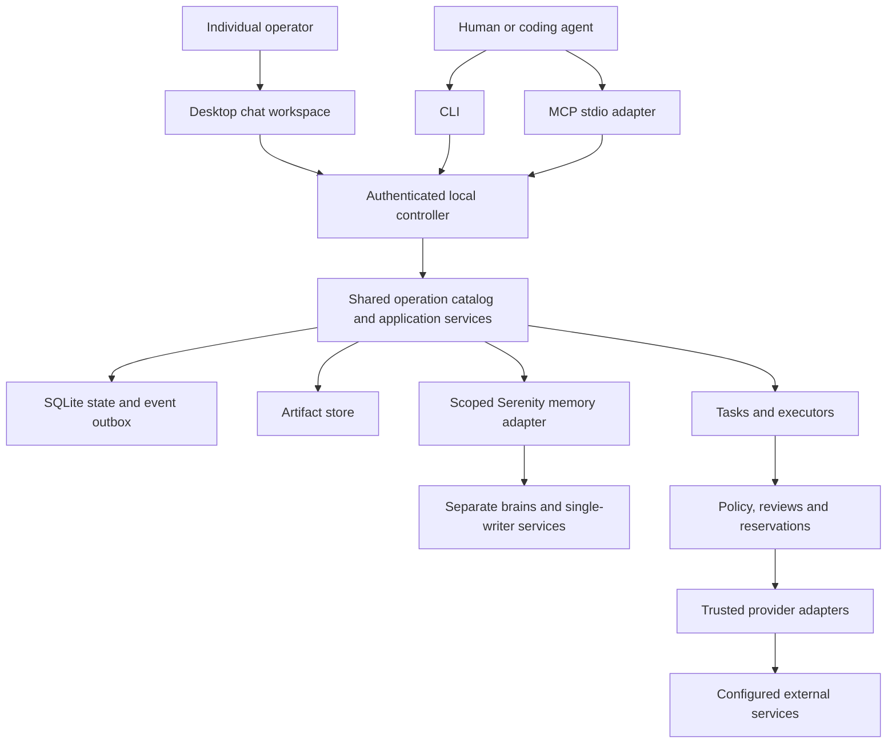

# Implementation assignment: `internal/client`

Generated specification revision 1; source digest `c79b39e5ca496cd59114fdaa2c9dd3a36d7c9c0d3b4426bc131063f5cef22ca2`. This file is committed implementation context. Do not independently edit it. Everything required from the product specification and adjacent interfaces is embedded below; no RFC copy is required.

## Mission and scope

Own shared controller client, secure credential plumbing, reconnect and explicit submission-key retry.

Write scope: **`internal/client/` only**, excluding this generated AGENTS.md. Go package name: `client`. Ownership kind: infrastructure; integration wave: 1.

Allowed production imports from this repository: `github.com/zatiti/zatiti/internal/contract`. Tests may use interfaces/fakes defined locally and, once available, storage-backed temporary fixtures; integration owns cross-package tests. No sibling raw SQL. No root dependency edits except the integration exception stated in its own brief.

## Implementation decisions and acceptance focus

Expose Config{SocketPath string; RemoteURL string; TLSConfig *tls.Config; Timeout time.Duration}; New(Config,contract.CredentialSource) (*Client,error); (*Client).Call(context.Context,string,contract.Request) (contract.Result,error), implementing contract.Operator. Local Unix HTTP transport; explicit remote TLS only for configured desktop. CredentialSource provides header bytes securely per request, never JSON/tool arguments. Strict envelope validation and bounded body reads. Never replace a mutation key after timeout. Auto retries only safe transport connection establishment before any request bytes, or explicit identical submission with same key; unknown ack resolved command.get. Cursor expiry surfaces snapshot_required so caller refreshes snapshot before replay; never fill gap silently. No server file opens, scheduler, model defaults or hidden paid fallback. Cancellation of local wait is not cancellation of accepted command.

Local proving focus: Disconnect-before/after-commit, original key replay, malformed envelope, unavailable controller, TLS validation, no secret in diagnostics, expired cursor snapshot recovery.

## Incoming and outgoing boundaries

Incoming callers: entrypoint/assembly or tests via the explicit Go API.

Outgoing owner calls: none; use only declared Go dependency interfaces. Each exact input/output schema appears below. Calls retain current Unit/authority; owner allowlists are mandatory.

### Imported package APIs and behavior

These briefs are embedded so you need not read a sibling prompt to discover its incoming API. Implement only your own package.

## Shared foundation contract

# Frozen implementation contract, revision 1

These decisions complete the product specification and bind every scope. Report contradictions with an affected-dependency list and proposed coordinated revision; do not change another owner's interface locally.

## Build and dependency decisions

Module `github.com/zatiti/zatiti`; language `go 1.26.0`; initial toolchain `go1.26.2`. Integration owns go.mod/go.sum. Domains import standard library and internal/contract, not sibling domains. Application composes owner methods through a checked in-process dispatcher: ordinary Go calls, not another server or scheduler.

Library families: Cobra CLI; official MCP Go SDK, handwritten adapter for MCP `2025-11-25`; Fyne v2 native Go desktop; modernc.org/sqlite. Mint is optional build-time tooling and cannot weaken contracts. Hosted provider v1: a specifically qualified OpenAI Responses endpoint/profile, with configured model and prices. Other compatible endpoints remain unavailable until qualified. GitHub uses documented REST over net/http, with mutation retries disabled. Serenity is a separate pinned service using public interfaces only. Integration must resolve exact dependency releases/commits, checksums, licenses and qualification commands in a lock report BEFORE dispatching dependent implementation. These are selected implementation families, not claims that upstream behavior has been qualified. No agent independently substitutes libraries, models, prices, accounts or Serenity APIs. Dependency resolution/qualification is an explicit foundation assignment.

## Shared Go declarations

The contract owner implements these exact declarations. Omitted function bodies are the implementation assignment, not production stubs. Public JSON uses snake_case. Schema-derived DTO names concatenate operation path segments in PascalCase plus Input/Output and live in the owning package. JSON integer => int64, UUID => contract.ID, timestamp => time.Time, optional scalar => pointer, array => slice, explicitly open JSON => json.RawMessage. Unknown fields are rejected.

```go
package contract
import (
    "context"
    "database/sql"
    "encoding/json"
    "io"
    "net/http"
    "time"
)
type ID string
type Digest string
type Version int64
type Clock interface { Now() time.Time }
type IDSource interface { New() ID }
type Scope struct {
    InstallationID ID `json:"installation_id"`
    OrganizationID ID `json:"organization_id,omitempty"`
    ProjectID ID `json:"project_id,omitempty"`
    WorkerID ID `json:"worker_id,omitempty"`
    TaskID ID `json:"task_id,omitempty"`
}
type Actor struct {
    PrincipalID ID `json:"principal_id"`
    Kind string `json:"kind"` // human | client_agent | worker | service
    CredentialID ID `json:"credential_id"`
}
type Request struct {
    Schema string `json:"schema"` // zatiti.request/v1
    SubmissionKey string `json:"submission_key,omitempty"`
    Input json.RawMessage `json:"input"`
}
type Fault struct {
    Code string `json:"code"`
    Message string `json:"message"`
    Retryable bool `json:"retryable"`
    Details json.RawMessage `json:"details,omitempty"`
}
func (*Fault) Error() string
type Outcome[T any] struct { Status string; Data T; NextCursor *string }
type Payload struct {
    Status string `json:"status"` // completed | accepted | failed
    Data json.RawMessage `json:"data"`
    Error *Fault `json:"error"`
    NextCursor *string `json:"next_cursor"`
}
type Result struct {
    Schema string `json:"schema"` // zatiti.result/v1
    CommandID ID `json:"command_id"`
    Payload
}
type Invocation struct { Operation string; Version int64; Input json.RawMessage }
type Event struct {
    ID ID `json:"id"`
    Sequence int64 `json:"sequence"`
    At time.Time `json:"at"`
    Scope Scope `json:"scope"`
    Kind string `json:"kind"` // owner.entity.transition
    ResourceID ID `json:"resource_id"`
    ResourceVersion Version `json:"resource_version"`
    Data json.RawMessage `json:"data"`
}
type Reader interface {
    QueryContext(context.Context, string, ...any) (*sql.Rows, error)
    QueryRowContext(context.Context, string, ...any) *sql.Row
}
type Unit interface {
    Reader
    ExecContext(context.Context, string, ...any) (sql.Result, error)
    Actor() Actor
    Scope() Scope
    Generation() int64
    ReadOnly() bool
    Emit(context.Context, Event) error
}
type Ownership interface { Held() bool; Lost() <-chan struct{}; Close() error }
type Database interface {
    StartGeneration(context.Context) (int64, error)
    Generation(context.Context) (int64, error)
    Read(context.Context, Actor, Scope, func(Unit) error) error
    Write(context.Context, Actor, Scope, func(Unit) error) error
    Migrate(context.Context, []Migration) error
    Events(context.Context, int64, int) ([]Event, error)
    Backup(context.Context, io.Writer) error
    Close() error
}
type Migration struct { Owner string; Version int64; SQL string; SHA256 Digest }
type Descriptor struct {
    ID string; Version int64; Owner string
    Visibility string // public | internal
    Mode string // query | mutation
    Effect string // local | disclosure | external_read | external_mutation
    InputSchema json.RawMessage; OutputSchema json.RawMessage; CompletionSchema json.RawMessage
    CLI []string; MCP string; ScopeRequired []string; Callers []string
    ExpectedVersion bool; SubmissionKey bool
}
type Handler func(context.Context, Unit, Invocation) (Payload, error)
type Module interface {
    Name() string
    Migrations() []Migration
    Descriptors() []Descriptor
    Handle(context.Context, Unit, Invocation) (Payload, error)
}
type Ports interface { Call(context.Context, Unit, Invocation) (Payload, error) }
type SecretStore interface {
    Put(context.Context, string, []byte) (string, error)
    Get(context.Context, string) ([]byte, error)
    Delete(context.Context, string) error
}
type BlobStore interface {
    Stage(context.Context, io.Reader, int64) (string, Digest, int64, error)
    Publish(context.Context, string, Digest) error
    Open(context.Context, Digest, int64, int64) (io.ReadCloser, error)
    RemoveStaged(context.Context, string) error
}
type Dependencies struct {
    Clock Clock; IDs IDSource; Ports Ports
    Secrets SecretStore; Blobs BlobStore
}
// Every domain owner: New(Dependencies) (*Service, error).
// *Service implements Module. Only declared outgoing ports may be used.
type Dispatch struct {
    OperationID ID `json:"operation_id"`
    AttemptID ID `json:"attempt_id"`
    Generation int64 `json:"generation"`
    Adapter string `json:"adapter"`
    Action json.RawMessage `json:"action"`
    CredentialRef string `json:"credential_ref"`
    ProviderKey string `json:"provider_key,omitempty"`
    Deadline time.Time `json:"deadline"`
}
type Observation struct {
    Disposition string `json:"disposition"` // succeeded | failed | accepted | unknown | not_sent
    ProviderReference string `json:"provider_reference,omitempty"`
    Evidence json.RawMessage `json:"evidence"`
    Usage json.RawMessage `json:"usage"`
    ConfirmedAt *time.Time `json:"confirmed_at,omitempty"`
}
type Adapter interface {
    Name() string
    Contract() json.RawMessage
    Invoke(context.Context, Dispatch) (Observation, error)
    Reconcile(context.Context, Dispatch) (Observation, error)
}
type AdapterDependencies struct {
    HTTP *http.Client; Secrets SecretStore; Clock Clock; Blobs BlobStore
}
// Every adapter: New(AdapterDependencies, json.RawMessage) (Adapter, error).
// Config is strictly validated, versioned and secret-free.
type Operator interface { Call(context.Context, string, Request) (Result, error) }
type CredentialSource interface { Credential(context.Context) ([]byte, error) }
```

The registry binds concrete input/output DTO types to descriptors and handlers using `Bind[I, O any](descriptor contract.Descriptor, fn func(context.Context, contract.Unit, I) (contract.Outcome[O], error)) (contract.Handler, error)`. JSON decoding is strict and schema validation precedes execution. Internal cross-owner calls use the same schema-checked Invocation boundary to avoid sibling package imports. They retain the same Unit, actor, scope, generation and transaction; cannot mint authority; and are not exposed as public operations.

## Transaction and ownership rules

Each domain owns tables prefixed with its package name and `_`. Schema and migration bodies inside that namespace are package-private; no other package depends on their layout. Storage owns installation generation, migration metadata and `storage_events`. Evidence owns commands/receipts. Migration ordering is explicit in application assembly. All migrations run under exclusive installation ownership before serving. Cross-owner reads and changes use Ports.Call and the embedded internal schemas. Internal operations have a caller allowlist. The dispatcher detects recursive calls. Queries cannot invoke mutation descriptors. Public clients cannot supply Actor or Unit or invoke internal operations.

One controller, one ordered writer, WAL, foreign keys on every connection, synchronous FULL, busy timeout 5 seconds, consistent read snapshots. Database.Write performs ONE transaction callback attempt with no automatic callback retry. Busy exhaustion returns controller_unavailable/retryable. Unit is valid only inside its callback; no goroutines or retained handles. Unit.Emit appends state-correlated evidence to the storage outbox in the same transaction. Delivery is at least once and consumers deduplicate event IDs. No network/model calls, secret-store access, filesystem streaming or subprocess work inside a Unit. Stage bytes or local helper actions outside transactions, then publish metadata or reconciliation intent through owner methods.

Handler errors roll back the entire transaction. Persist a command refusal in a separate short transaction after rollback where necessary, retaining the original request identity. Query command IDs need not be durable. All mutations return durable command IDs; accepted responses must identify inspectable durable work. Output schemas describe Payload.Data, not the result envelope. Never leak SQL, tokens, provider raw responses or private paths through Fault.

Definition creates/updates/archive stage drafts, including schedules, responsibilities, policies and memory bindings. Only configuration.apply activates definitions. It validates owners' candidate slices, seals base revision/dependencies/requirements, and calls internal activate in the same transaction under old authority. Internal activate is admitted only from the compiler during exact plan application, not by a public flag. Public restrictive pause/revoke/cancel commits immediately without compilation or spending. Archive staging may immediately disable new admissions as an explicitly reported restrictive side effect; final removal waits for obligations.

## Effect and execution rules

Admit: current authorization, exact review/preconditions, all budget reservations, attempt/dispatch intent and evidence atomically. Claim: second transaction rechecks generation/restrictions/expiry and consumes the one-use claim. Invoke the adapter outside transactions. Record: third transaction stores observations, costs or retained uncertainty and events. Each physical call, including reconciliation and retries, has a distinct attempt. Reconciliation is an admitted bounded read and links to the original effect; it does not overwrite history. Internal jobs use explicitly provisioned scoped service identities plus current worker/task restrictions.

Once claimed, crash/timeout/cancel/lease expiry/operator acknowledgement/weak not-found cannot prove nonexecution. Preserve outcome_unknown and its reservation until authoritative evidence. Earlier unknown attempts survive later failures. Mutation SDK/HTTP retries are disabled. Even qualified idempotent retries need fresh authorization and physical-attempt evidence. Trusted adapters resolve credential references outside transactions; no public raw secrets or inherited owner credential environment. Fencing external workers blocks Zatiti mutations but cannot prove their processes stopped.

Task success needs independently established acceptance against pinned verifier code/version, sealed inputs and observations. Worker report/exit zero cannot set succeeded. Defaults: one concurrent attempt/worker, four/installation, 30 minutes/attempt, 100 model steps, eight children, delegation depth three, root deadline 24 hours. Configure explicit currency and finite spend limits before paid work. Amounts are int64 micro-units with checked overflow; rational rates use integer numerator/denominator and round reservations upward. Unknown/advisory usage and missing prices are not zero. Children share root and ancestor budgets.

## Wire conventions and limits

UUIDv4 for new identities; stable UUID references thereafter. SHA-256 lowercase hex digests. Versioned canonical JSON sorts keys, rejects duplicate keys/unknown fields, preserves exact integer values and semantic array order; schema-declared sets sort by stable identity. Preserve exact skill bytes. UTC RFC3339Nano timestamps and int64 versions >=1. Patches and snapshots are distinct; explicit delete only. Inert `extensions` alone permits namespaced extra keys. Scope is explicit and every referenced object is revalidated; no implicit global organization.

Default limits: JSON request 1 MiB; chunk 1 MiB decoded; artifact 256 MiB; skill archive 16 MiB compressed, 64 MiB expanded, 4096 entries, depth 32; list 50/max 200; read 1 MiB; redacted log record 8 KiB; event page 100/max 500; upload expiry 24 hours. Narrowing is allowed, increases require authorized configuration. Reject overflow and unsupported bounds.

Mutations require submission_key (1..128 printable ASCII) except one-time init. Bind principal, operation/version and canonical input hash. Retain >=30 days and through unresolved obligations. Replay identical input returns original disposition BEFORE stale-version validation; changed input => submission_conflict. Concurrent duplicates serialize. Recover lost acknowledgements by command lookup, not a new key. Resource updates require expected_version; apply requires base_revision and plan digest. Creation has no existing version. Opaque authenticated cursors bind principal/scope/filter/order/snapshot and expire explicitly with cursor_expired and snapshot_required=true. Event replay cannot silently omit a gap.

HTTP POST `/v1/operations/{operation_id}` uses the common request envelope. Local HTTP runs over a private Unix socket. Explicit remote desktop uses mutual TLS mapped to current application principals over the same operation contract, never remote MCP. Completed => HTTP 200; accepted => 202. Failed mapping: invalid_input 400, permission_denied 403, not_found 404, stale_version/submission_conflict/conflict/review_required/outcome_unknown/artifact_fault 409, cursor_expired 410, prerequisite_missing/external_action_required/budget_unavailable/capability_unsupported/verification_failed 422, controller_unavailable 503, internal_error 500. Domain failures always include the result envelope.

CLI completed/accepted => exit 0; invalid_input 2; permission_denied/review_required 3; stale_version/submission_conflict/conflict 4; prerequisite_missing/external_action_required/budget_unavailable/capability_unsupported 5; controller_unavailable/outcome_unknown 6; other failures 1. CLI --json emits one envelope to stdout, diagnostics stderr, no implicit prompts. MCP structuredContent is the full envelope, text is equivalent JSON, failed => isError true, malformed protocol => protocol error. Dot-separated operation IDs map to CLI tokens and `zatiti_` MCP names. Exceptions: installation.init => `zatiti init` / `zatiti_installation_init`; capabilities.list => `zatiti capabilities` / `zatiti_capabilities`. Lifecycle steps are individual tools. Tool input never selects a credential profile or accepts raw secrets/unrestricted server paths.

## Completion policy

Write only within the assigned root. Do not edit this prompt, siblings, shared contracts, root dependencies or external acceptance inputs. Implement exact fake dependencies locally; do not return invented production success for unavailable prerequisites. Use controlled providers, deterministic clocks and synthetic fixtures. Preserve expected/observed results and failure evidence. Package tests prove local properties; actual subprocess parity, crash recovery, desktop and adapter qualification prove integration. Z01-Z21 and first-release journeys on macOS/Linux must pass before a release is claimed.

## Local IO, authentication, jobs and verification seams

These additional declarations are part of the SAME frozen contract package (using imports already shown). Implementing an interface does not permit calling it inside a Unit except where the signature explicitly takes Unit/Reader.

```go
type Authenticator interface {
    Authenticate(context.Context, Reader, []byte) (Actor, error)
    AuthenticateCertificate(context.Context, Reader, Digest) (Actor, error)
}
type IOPlan struct {
    ID ID
    Owner string
    Invocation Invocation
    Actor Actor
    Scope Scope
    Generation int64
    ExpectedVersions map[ID]Version
    Prepared json.RawMessage
}
type IOResult struct { Data json.RawMessage; Fault *Fault }
type LocalIO interface {
    Prepare(context.Context, Unit, Invocation) (IOPlan, error)
    Perform(context.Context, IOPlan) (IOResult, error)
    Finish(context.Context, Unit, IOPlan, IOResult) (Payload, error)
}
// Request is the exact VerificationRequest JSON schema embedded in the prompt.
type Verification struct { Request json.RawMessage }
// Document is the exact VerificationResult schema, including independently
// observed checks, pinned identity, task/attempt and staged artifact handoff.
type VerificationResult struct { Document json.RawMessage }
type Verifier interface {
    Verify(context.Context, Verification) (VerificationResult, error)
}
type VerifierDependencies struct { Clock Clock; Blobs BlobStore }
```

Identity Service also implements Authenticator. Application receives this interface explicitly in New; it uses a dedicated read snapshot and never reads identity-owned tables itself. Only the byte-slice credential boundary carries secret authentication material, never Invocation JSON. Zero sensitive buffers after use where practical; no logging. Certificate authentication resolves a preprovisioned credential reference and follows the same current principal/revocation rules.

Artifacts, skills, connections and installation Services also implement LocalIO. The registry detects this interface at assembly and routes ONLY registered local IO operations through Prepare/Perform/Finish: artifact.upload.chunk/finish/cancel/read/export; skill.import; connection.setup.begin/complete/cancel; installation.init/backup/restore. LocalIO handles local bounded files, secure helpers and backup work, never unadmitted provider/model calls. Prepare strictly validates input, versions, identity and authority and records replayable local intent under IOPlan.ID; Perform receives that exact trusted in-memory plan outside transactions, resolves opaque staging/helper references, and returns metadata; Finish rechecks authority/versions/generation and commits result/evidence. IOPlan is never public, accepted from an agent or stored with secrets. Prepared/Data JSON must use the operation's declared schemas plus private owner-local metadata, which no other package reads. No cross-owner business protocol may hide in those private fields. Perform must support safe replay of local staging/publication by plan ID, or preserve an inspectable failed/unknown local obligation. A synchronous read does not return bytes to client until final authorization check. New raw provider writes always use effects, not this interface.

For synchronous local IO mutations, persist command identity plus accepted internal pending disposition at Prepare, then replace pending disposition once at Finish. Concurrent same-key calls join/inspect that same in-progress command and never run duplicate Perform. The controller can recover abandoned local intents using the execution job API. Async backup/export uses the same interface with an inspectable job returned immediately. The artifact.upload.chunk endpoint has a 2 MiB encoded request cap (all other ordinary JSON requests 1 MiB), allowing the specified 1 MiB decoded chunk plus envelope.

Execution owns shared durable jobs (execution_jobs), distinct from runs and physical effects. `_execution.job.create` stores the original owner/operation/input and idempotent source identity; public job.get inspects any authorized job. Controller lists pending jobs, claims generation-bound ownership, invokes the named LocalIO owner outside transactions through its exact plan, and records result/obligation. Network jobs first prepare effects and wait on their recorded outcomes. `_execution.job.record` stores result data matching the originating operation's explicit completion_schema and links actual artifact/operation evidence. Never mark a job succeeded merely because its physical request was accepted.

Tasks calls `_execution.enqueue` with ready pinned task inside the same transaction; execution creates one run for task/version and returns it. `_tasks.ready` also exposes a bounded recovery scan. Execution's verifier constructor is `NewVerifier(contract.VerifierDependencies) (contract.Verifier,error)`. Verify executes outside Unit and returns actual independently established observations under the pinned accepted profile; `_execution.verification.record` rechecks attempt/task/version before changing task state. A forged worker-provided VerificationResult is never accepted through public report. Concrete context/adapter/verification payload schemas are included in relevant prompts.

Administrative effects that have no task use their command/operation ID as an accountable admission root; no fictional worker/task or fabricated task foreign key is required. Accounting skips absent scope dimensions but always reserves installation and present organization ancestors/project limits. Task effects additionally share root_task_id. A profile without enforceable charge bounds cannot claim a hard cap.

Typed handler bindings return `contract.Outcome[O]` so accepted results and page cursors survive typed registration. The frozen Bind signature is `Bind[I, O any](contract.Descriptor, func(context.Context, contract.Unit, I) (contract.Outcome[O], error)) (contract.Handler, error)`. Errors carry Fault and roll back, while accepted/completed status and cursor come from Outcome.

Assembly order: application.NewPorts() returns an unbound *PortRouter; For(owner string) returns an owner-bound contract.Ports without domain calls; construct identity and all other modules with those ports; registry.New(modules); application.New(db, registry, identityAuthenticator, clock, ids); router.Bind(app) exactly once; start serving only after Bind. PortRouter exposes `For(string) contract.Ports` and `Bind(*Application) error`, rejects pre-bind invocation, and never allows a domain to change its bound caller identity. Registry also implements Module for its own capabilities methods. Constructor execution must not query peers or start goroutines.

All native BlobStore objects are encrypted at rest (including public-classification content), because Stage has no classification argument. Metadata publication sets encrypted=true; classification separately governs disclosure. Controller records the raw adapter observation and cost disposition durably first, then publishes StagedOutput bytes outside Unit, then commits artifact metadata and normalized owner callbacks through an outbox consumer. Publication failure is a visible artifact obligation and blocks task/job acceptance; it does not erase a confirmed provider observation or authorize resending. The adapter cannot mint artifact IDs.

Entrypoint assembly owns platform.Acquire -> storage.Open -> Migrate -> Database.StartGeneration, exactly once before controller/server admission. Pass the held contract.Ownership into controller.New; controller never acquires a second lock or advances generation again. Ownership.Lost closes when ownership is lost/released; stop admission immediately. Generation is a persisted local-controller fence, not distributed locking. The installation lock is retained until controller shutdown and DB close.

Remote TLS additionally validates the certificate chain and maps the SHA-256 certificate SPKI fingerprint through application.AuthenticateCertificate(ctx,Digest), which delegates to identity Authenticator.AuthenticateCertificate on a read snapshot. Only a verified TLS peer can enter that API; operation input cannot supply the fingerprint. Store certificate fingerprints as identity-owned authentication metadata on an explicitly provisioned credential reference. If a bearer credential is also supplied, its principal must match the verified certificate principal. No self-asserted certificate name, profile name or fingerprint header grants authority.

Every async operation declares completion_schema separately from its immediate Job response. job.get returns that schema as Job.result only when established; pending jobs omit result. Local IO mutations that may be recovered asynchronously accept either their completed resource output or `{job: Job}` in the descriptor output schema. Bootstrap remains synchronous under its exclusive one-time lock. No unspecified job kind may execute: _execution.job.create requires a registered completion_schema or a specifically registered private local-intent recovery contract.

Evidence retains the complete original result envelope for command replay, including fault message/details/retryability and cursor; projections of status/data/error_code must agree with Command.result. `_evidence.command.finish` takes that exact result. A replay cannot reconstruct a different error or lose an accepted job reference. ScopeRequired lists installation_id where input scope is required; resource-specific organization/project/worker conditions are enforced by the owned operation schemas and current referenced-resource validation, never inferred from a profile name.

Descriptor.Callers carries the exact catalog internal caller allowlist into runtime registration; application enforces this metadata rather than inventing it from operation names. Internal metadata remains available to trusted assembly/registry while public capability output contains public operations only. An empty allowlist never authorizes an internal call.

## Owned product requirements

### R3-002 (source section 3; primary owner storage)

Ship a `zatiti` Go controller/CLI binary with CLI commands, `serve`, and `mcp serve`, plus a desktop client and a pinned Serenity integration. One always-on controller owns scheduling, admission, persistence, credential access, and recovery. It may run on the user's computer or an operator-controlled server; ongoing work requires that host to remain available. Closing the desktop client does not stop the controller. Optional local execution workers connect to that same owner; moving work between controllers is not a v1 feature.

### R3-003 (source section 3; primary owner storage)

Desktop, CLI, and MCP are clients of the controller's application services. MCP processes do not start separate schedulers or write the database directly. Local clients use a private Unix-domain socket; a remote desktop connection uses an explicitly configured authenticated TLS endpoint over the same versioned operation contract. Credentials remain in secure client storage and are not supplied as model-visible arguments. Reconnection reads snapshots and replayable events, and retries commands with their original submission keys. A disconnected desktop can display cached history and retain unsent drafts, but cannot claim a command, approval, or pause reached the controller until acknowledged.

### R3-004 (source section 3; primary owner storage)

The controller publishes a versioned API contract; a pinned Mint generation step may turn that contract into the MCP server shipped with Zatiti. Mint is a build-time adapter, not a second source of domain behavior. Serenity has a separate canonical memory store and one writer owner per brain; this revises the original single-binary-only deployment proposal. Its process packaging and lifecycle must be qualified with the desktop/controller distribution.

### R3-005 (source section 3; primary owner storage)



### R3-006 (source section 3; primary owner storage)

| Area | Proposed implementation |
|---|---|
| Language | Supported stable Go toolchain, pinned in `go.mod` and CI |
| CLI | Cobra for command structure; generated operation commands over shared schemas |
| MCP | Generated from the versioned API contract with Mint, pinned and tested against the supported MCP protocol; explicit protocol and parity tests |
| Client transport | Versioned HTTP/JSON over a private Unix-domain socket locally; authenticated TLS for explicitly configured remote desktop access |
| State | SQLite in WAL mode, foreign keys enabled, bounded busy timeout, short explicit transactions; a pinned Go SQLite driver |
| Artifacts | Content-addressed local files; encrypted sensitive content and integrity-checked metadata |
| Credentials | OS secret store or explicitly provisioned headless secret source; encrypted database values reference an external master key |
| Logs | Structured `slog` on stderr or protected files; bounded, redacted fields |
| Tests | Go unit/integration suites, deterministic clocks and provider simulators, subprocess CLI/MCP conformance tests |

### R3-007 (source section 3; primary owner storage)

SQLite is selected to make a single-tenant installation usable without a database service. There is one controller writer and no shared network-filesystem database. An exclusive installation lock prevents a second controller from serving the same state directory. Startup advances a persisted controller generation; workers, dispatch claims, and leases bind that generation. Losing installation ownership stops admission. The supported deployment relies on local OS lock semantics; distributed fencing is not claimed.

### R3-008 (source section 3; primary owner storage)

The controller uses a single ordered write path with transaction-aware domain methods. Reads use consistent snapshots. No network or model call runs inside a retryable database transaction. State changes and their event/outbox entries commit together. Crash recovery reads durable state, not log text. Database contention returns a bounded retryable error rather than hanging a client indefinitely.

### R3-009 (source section 3; primary owner storage)

The database owns principals, grants, revisions, tasks, schedules, runs, attempts, operations, approvals, reservations, commands, events, artifact metadata, and recovery obligations. Definition JSON is canonicalized before hashing. Query projections are not a second hashing authority. Files are staged and hashed before metadata publication; unreferenced staging content is reclaimed later. A committed reference whose bytes are unavailable produces a visible artifact fault, never a successful result.

### R7.3-002 (source section 7.3; primary owner connections)

Creating a connection records provider kind, account identity, allowed scopes/destinations, and credential reference. It grants no worker access until binding and activation. `connection.validate` performs a separately authorized bounded probe and records observed identity/scopes and validation freshness. Credential rotation for the same account and substituting a different account are distinct operations.

### R7.3-003 (source section 7.3; primary owner connections)

Credential setup uses a typed challenge lifecycle: begin, status, complete, cancel. Both CLI and MCP can start and inspect setup; external consent may open a provider's browser flow. An existing OS-store or headless-store reference can be attached through either interface. A trusted helper consumes secret input locally and stores it; tool arguments, ordinary command flags, exported manifests, logs, and MCP results never carry raw provider secrets. Authorization codes and tokens are exchanged by the helper, not pasted into chat. When automation cannot finish a provider prerequisite, return `external_action_required` and an actionable challenge reference.

### R7.3-004 (source section 7.3; primary owner connections)

Connection and execution profiles may authorize disclosure to configured model providers. Repository and task content default to internal classification; lowering classification or expanding provider destinations requires current authorization. A missing connection, price bound, or model profile produces a named refusal; no silent provider or billing fallback.

### R8.2-002 (source section 8.2; primary owner cli)

Every product command accepts structured input through `--input @file.json`, `--input -` for stdin, or an equivalent inline JSON option. Convenient flags may populate that same request schema. Input files are read by the CLI client, not arbitrary paths opened by the controller. `--json` emits exactly one versioned JSON result to stdout; diagnostics go to stderr. Commands do not require a TTY and never silently prompt when input is incomplete. Human rendering and optional interactive helpers use the same requests.

### R8.2-003 (source section 8.2; primary owner cli)

The exceptional capability shortcut is `zatiti capabilities --json`, mapping to `zatiti_capabilities`; the descriptor records its name explicitly. General request example:

### R8.2-004 (source section 8.2; primary owner cli)

```json
{
  "schema": "zatiti.request/v1",
  "submission_key": "demo-org-create-001",
  "input": {"key": "demo", "name": "Demo organization"}
}
```

### R8.2-005 (source section 8.2; primary owner cli)

`zatiti organization create --input @organization.json --json` and `zatiti_organization_create` with these arguments call the same handler. Creating the organization returns its draft and identity; activation follows plan/apply.

### R8.3-002 (source section 8.3; primary owner mcp)

V1 uses stdio with the generated Mint adapter (or an equivalent pinned adapter) and a pinned supported protocol revision. `zatiti mcp serve` connects to the configured local controller as the selected scoped principal. MCP stdout carries protocol frames only; diagnostic logging goes to stderr. Reconnection does not create another controller or restart tasks. A missing controller returns a named availability error; process-start convenience must not hide a second scheduler.

### R8.3-003 (source section 8.3; primary owner mcp)

The server advertises typed tools with input and output schemas. It returns the common result envelope as `structuredContent`, with equivalent serialized JSON in text content for clients that need it. Domain failures use a tool result with `isError: true`; malformed protocol messages use protocol errors. Zatiti specifies this mapping against the [MCP tools contract](https://modelcontextprotocol.io/specification/2025-11-25/server/tools).

### R8.3-004 (source section 8.3; primary owner mcp)

Do not require optional client features such as sampling, elicitation, resources, prompts, or protocol-level task extensions for baseline product access. Long work uses Zatiti task/command IDs and polling. Local stdio is the first-release transport; remote HTTP requires a separate authentication and exposure design before support. See the [MCP transport specification](https://modelcontextprotocol.io/specification/2025-11-25/basic/transports) and [official Go SDK](https://github.com/modelcontextprotocol/go-sdk).

### R8.4-002 (source section 8.4; primary owner contract)

```json
{
  "schema": "zatiti.result/v1",
  "command_id": "00000000-0000-4000-8000-000000000001",
  "status": "completed",
  "data": {"draft_id": "00000000-0000-4000-8000-000000000002", "version": 1},
  "error": null,
  "next_cursor": null
}
```

### R8.4-003 (source section 8.4; primary owner contract)

`status` is `completed`, `accepted`, or `failed`. Completion of a command such as task creation or approval is not completion of the task or external effect it refers to. Data carries resource IDs, actual lifecycle state, versions, relevant artifact/event references and next actions. Accepted long operations include an inspectable task/job reference. Stable error codes include `invalid_input`, `not_found`, `permission_denied`, `stale_version`, `review_required`, `prerequisite_missing`, `external_action_required`, `budget_unavailable`, `capability_unsupported`, `controller_unavailable`, and `outcome_unknown`.

### R8.4-004 (source section 8.4; primary owner contract)

CLI exits are 0 for completed/accepted commands, 2 for input errors, 3 for denied/review-required access, 4 for stale/conflicting state, 5 for missing prerequisites or unsupported capability, 6 for unavailable/unknown outcomes, and 1 for other failures. Machine clients inspect the envelope as well as the exit code. A pending task is not a CLI failure. An unknown external outcome is not a successful write.

### R8.4-005 (source section 8.4; primary owner contract)

Mutating requests require a caller-generated submission key except during initial bootstrap, where the uninitialized installation lock supplies uniqueness. The controller binds keys to principal, operation ID/version and canonical request hash. Reuse with identical input returns the original durable command disposition; changed input refuses. A lost acknowledgement is recovered through command lookup, not a new key. Keep keys at least 30 days and through all unresolved obligations. MCP JSON-RPC request IDs are not submission keys.

### R8.4-006 (source section 8.4; primary owner contract)

Resource changes require an expected version or base revision. Pagination uses stable opaque cursors and bounded page sizes; list/get/event operations return the same scope and freshness in both transports. MCP resources and CLI watch are optional presentation conveniences over replayable event reads. Clients encountering an expired event cursor fetch a new snapshot and resume; no silent gap is presented as complete history.

### R8.4-007 (source section 8.4; primary owner contract)

Large content uses bounded chunk upload and byte-range read operations in both interfaces. The client chooses local file locations; MCP never accepts an unrestricted server filesystem path. Backup creation returns an opaque backup artifact, and restore consumes an uploaded backup reference in a quiesced maintenance mode. The same local owner operation can enter maintenance through CLI or MCP; it does not require a transport-specific admin endpoint.

### R8.4-008 (source section 8.4; primary owner contract)

Starting/stopping a client process, shell completion, help formatting and MCP protocol negotiation are transport mechanics rather than product operations. Installation initialization, health, credentials, backup and restore remain product operations and require parity. The parity suite enumerates the registry and rejects unmapped operations or unequal authorization, state, error, pagination, or event behavior.

### R16-002 (source section 16; primary owner desktop)

The desktop is the human's daily workspace. CLI and MCP are primarily interfaces for coding agents; no human journey requires a terminal, operation identifier, or schema knowledge. The visual and interaction direction is a simple conversation list and selected conversation, informed by the supplied GrokBot screenshots and Rakazo's chat-first workflows. Organization structure becomes visible when useful without requiring an organization chart or dashboard at entry.

### R16-003 (source section 16; primary owner desktop)

The two primary journeys are giving a chief or worker a task/responsibility, and returning to inspect results and handle decisions. First launch, after necessary connection/bootstrap prerequisites, opens the personal-chief conversation with a ready composer. A returning launch restores the current conversation. The personal chief is pinned and is the default place to coordinate multiple organizations; users may contact any worker directly.

### R16-004 (source section 16; primary owner desktop)

The user can say "Create a marketing chief and an engineering chief and have them build their teams." Creating a chief for a new responsibility stages a child organization and its designated worker together, applies permitted changes through the compiler, and shows the resulting organization card from committed state. The card distinguishes proposed, awaiting decision, and created states. A chief can add ordinary workers without creating more organizations. A New menu also offers New worker, New organization, and Group chat; organization creation asks for a name and an optional parent defaulted from the current context. Conversational and direct controls operate the same objects.

### R16-005 (source section 16; primary owner desktop)

The sidebar defaults to All chats. A small organization selector reveals an expandable hierarchy; selecting an organization filters conversations to it and its descendants without navigating away to an administrative home. A muted organization label beside a worker's name gives local context, and the conversation header shows a clickable full path such as `Studio > Engineering > Quality`. Ambiguous search results include enough ancestry to distinguish workers. Membership is never conveyed by color alone. Worker identities persist across tasks and conversations.

### R16-006 (source section 16; primary owner desktop)

An organization owns responsibilities, memory, budgets, workers, and reporting relationships. A group chat is a conversation among selected participants. Creating or joining a group chat does not change home organization, grant new memory access, or expand tool authority. Messages and attachments shared with participants remain governed disclosures. Direct user requests and chief assignments refer to the same durable tasks, with conflicting updates surfaced rather than independently scheduled twice.

### R16-007 (source section 16; primary owner desktop)

Conversation carries requests, answers, meaningful updates, exact approval cards, files, and results. One optional details panel exposes current responsibilities, active work, pending decisions, files, and memory with sources and sharing scope. Durable work remains discoverable outside the message scroll. An action card renders the actual controller disposition and links to evidence; model narration never serves as its state authority.

### R16-008 (source section 16; primary owner desktop)

Chiefs summarize useful outcomes, exceptions, and decisions upward within reporting bindings. Routine internal coordination and repeated reasoning do not continually reorder human chats, mark them unread, or generate notifications. A Needs you filter gathers unresolved human decisions across organizations and links directly to their exact action cards. Users can inspect detailed activity on demand. Closing the desktop leaves authorized server work running, with that behavior made clear during setup; offline cached views explicitly distinguish unsent input and stale state.

### R16-009 (source section 16; primary owner desktop)

Autonomy is expressed as concrete capabilities such as "Can publish documentation updates" and "Asks before spending," not a universal trust score. Promotion cards show the exact authority change, relevant evidence, and whether an existing owner-approved rule activated it or a decision is still needed. Responsibility creation and authority expansion remain distinct: a newly created chief starts with minimum permissions under its parent's ceiling. Pause and stop controls are directly available and report controller acknowledgment and unresolved external effects honestly.

### R16-010 (source section 16; primary owner desktop)

The desktop framework, final visual tokens, and detailed interaction designs remain to be selected. The default personal-chief onboarding, chat-first navigation, optional hierarchy, subtle organization identity, and progressive access to durable work are product requirements.
## Exact operation and dependency schemas

No operation handlers are owned or called by this scope. Its Go interfaces are specified above.

## Named acceptance cases

Tests are implementation deliverables, not claims of already executed qualification. Retain expected/observed results, exact source/config/tool versions and failure evidence.

### Z16.cli_to_mcp — Z16

Setup: A scoped principal creates and starts durable work through CLI.

Action: Disconnect the CLI and inspect, decide or continue that same work through MCP.

Expected:

- The second transport uses the same task, command, review, state and authorization.
- No duplicate controller, scheduler or task is created.

### Z16.mcp_to_cli — Z16

Setup: A scoped principal creates and starts durable work through MCP.

Action: Disconnect MCP and continue that work using CLI.

Expected:

- Equivalent authorized state and durable identities are preserved across transports.
- No transport-specific prerequisite is required to continue the workflow.

### Z16.disconnect_command_lookup — Z16

Setup: A mutation commits immediately before its transport connection drops.

Action: Reconnect, look up the command by its original submission key and retry only with that key.

Expected:

- The original disposition is recovered without another business mutation or event.
- JSON-RPC request IDs are not treated as durable submission keys.

### Z16.cursor_expiry — Z16

Setup: An event cursor falls outside the retained replay window while scoped state continues changing.

Action: Resume event reading with that cursor.

Expected:

- A named cursor-expiry result requires a fresh authorized snapshot and new replay position.
- The client never presents an unseen event gap as complete history; both transports preserve equivalent scope and freshness.

### Z16.interrupted_upload — Z16

Setup: A bounded chunk upload is partially accepted before a client disconnects.

Action: Resume or inspect using the stable upload identity, retry an accepted chunk, finish and cancel a separate partial upload.

Expected:

- Chunk retries do not corrupt content or publish duplicate artifacts; finish verifies the full digest and bounds.
- Partial bytes are not published as completed artifacts; cancellation leaves only reclaimable staging data.
- Neither interface accepts an unrestricted controller filesystem path.

### Z21.reconnect_no_duplicate — Z21

Setup: The desktop sends a mutation whose response is lost before disconnect.

Action: Show cached history, enter an offline draft, reconnect and retry with original submission identity.

Expected:

- Unsent input and stale cached state remain distinguishable until controller acknowledgement.
- Reconnection restores snapshots/replay and command disposition without duplicate tasks or external effects.

### JOURNEY.cross_interface_fault_matrix — JOURNEY

Setup: Prepare each organization, engineering and research journey at mutation acknowledgement, claim, checkpoint, review, upload, effect return and restart boundaries.

Action: Interrupt at each boundary and continue through the opposite interface in both directions.

Expected:

- Submission identity, pinned contracts, events and authorization remain equivalent.
- No duplicate protected effect occurs; unknown outcomes remain unknown until qualified reconciliation.
- The evidence names each fault boundary and both starting/continuing transports.

### QUALIFICATION.named_agent_clients — QUALIFICATION

Setup: Select exact Claude Code, Codex or Cursor versions for each client compatibility claim intended for release.

Action: Use actual sessions of every claimed version to discover tools, perform setup, execute long work, encounter denial and recover a disconnected mutation.

Expected:

- Each named client/version has retained executed interoperability evidence.
- Unsupported or untested clients are not advertised as qualified and client compatibility is not an executor-containment claim.

## Delivery

Implement production behavior and meaningful local tests within scope. Report files changed, commands actually run, observed results, unresolved dependency qualifications and contract defects. A missing dependency may use an exact local fake for development; production must return a named prerequisite/unsupported error instead of fake success. Integration owns shared dependency changes, real assembly, cross-package proving and landing. Do not advertise release or client/platform support from compilation alone.
