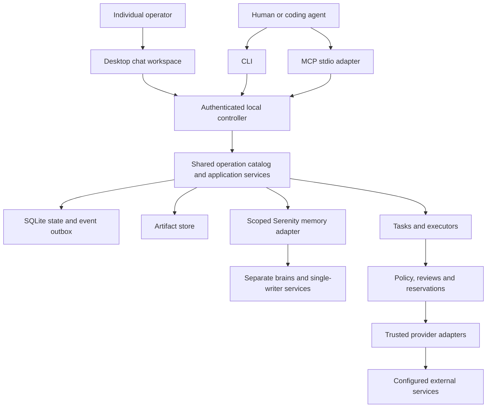

# Implementation assignment: `internal/client`

Generated specification revision 9; source digest `5105dbf11bdbd4d6a51832b0ce0683b1f4410682c803ac96e4a1d437b471d1fd`. This file is committed implementation context. Do not independently edit it. Everything required from the product specification and adjacent interfaces is embedded below; no RFC copy is required.

## Mission and scope

Own shared controller client, secure credential plumbing, reconnect and explicit submission-key retry.

Write scope: **`internal/client/` only**, excluding this generated AGENTS.md. Go package name: `client`. Ownership kind: infrastructure; integration wave: 1.

Allowed production imports from this repository: `github.com/zatiti/zatiti/internal/contract`. Tests may use interfaces/fakes defined locally and, once available, storage-backed temporary fixtures; integration owns cross-package tests. No sibling raw SQL. No root dependency edits except the integration exception stated in its own brief.

## Implementation decisions and acceptance focus

Expose Config{SocketPath string; RemoteURL string; TLSConfig *tls.Config; Timeout time.Duration}; New(Config,contract.CredentialSource) (*Client,error); (*Client).Call(context.Context,string,contract.Request) (contract.Result,error), implementing contract.Operator. Local Unix HTTP transport; explicit remote TLS only where configured. Go callers (CLI, MCP, qualification drivers) use this package; the Flutter desktop at apps/desktop cannot import it and reimplements these exact semantics in Dart against the same wire contract. CredentialSource provides header bytes securely per request, never JSON/tool arguments. Strict envelope validation and bounded body reads. Never replace a mutation key after timeout. Auto retries only safe transport connection establishment before any request bytes, or explicit identical submission with same key; unknown ack resolved command.get. Cursor expiry surfaces snapshot_required so caller refreshes snapshot before replay; never fill gap silently. No server file opens, scheduler, model defaults or hidden paid fallback. Cancellation of local wait is not cancellation of accepted command.

Local proving focus: Disconnect-before/after-commit, original key replay, malformed envelope, unavailable controller, TLS validation, no secret in diagnostics, expired cursor snapshot recovery.

## Incoming and outgoing boundaries

Incoming callers: entrypoint/assembly or tests via the explicit Go API.

Outgoing owner calls: none; use only declared Go dependency interfaces. Each exact input/output schema appears below. Calls retain current Unit/authority; owner allowlists are mandatory.

### Imported package APIs and behavior

These briefs are embedded so you need not read a sibling prompt to discover its incoming API. Implement only your own package.

## Shared foundation contract

# Frozen implementation contract, revision 9

These decisions complete the product specification and bind every scope. Report contradictions with an affected-dependency list and proposed coordinated revision; do not change another owner's interface locally.

Revision 9 freezes the **Mac installed package binding and local provider-key capture boundary**. It changes no public operation schema, release descriptor, delivery schema, or Serenity requirement; the component manifest gains one Mac-controller-only executable artifact kind `credential_helper` at exact relative path `bin/zatiti-credential-helper`. Both native amd64 and arm64 must satisfy the same full first-chat release gates; a reduced-capability preview is not implied. In particular the pinned Serenity public protocol, one canonical writer per brain, scoped recall/curation, command reconciliation, cost/disclosure bounds and backup revision behavior remain hard release prerequisites. A missing or unqualified guarantee blocks the release rather than becoming a silent fallback.

**Data-only per-user package.** For each architecture, the signed `zatiti-<version>-darwin-<arch>-installer.pkg` is a single-choice flat product package with a distribution domain allowing only `currentUserHome` (`enable_currentUserHome=true`, `enable_localSystem=false`, `enable_anywhere=false`, no admin authentication). The package contains exactly one component payload rooted at `Library/Application Support/zatiti-installer/inbox/<release_sequence>/<arch>/` relative to the selected home. That inbox contains exactly three owner-only regular files: `binding.json`, `controller.tar.gz`, and `desktop.tar.gz`; it has no install scripts, executable payload, extra component/choice, symlink, hard link or path outside that subtree. The final app, controller version tree, LaunchAgent and state are activated only by the trusted bootstrap's existing `packaging.Apply` path **after** package installation and re-verification; the package itself does not start services or modify the active distribution. A package opened directly in Installer may stage inert bytes but does not constitute an installed/runnable Zatiti release. Incomplete inbox data is quarantined or removed without changing the accepted release. This layout is intentionally separate from the revision-8 accepted watermark and controller state.

The strict canonical UTF-8 `zatiti.mac_pkg_binding/v1` `binding.json` is at most 4096 bytes and has exactly `schema`, positive `release_sequence`, `version`, `arch` (`amd64` or `arm64`), `release_descriptor_sha256`, `controller_sha256`, and `desktop_sha256`; all hashes are lowercase SHA-256. Its descriptor digest covers the **inner canonical signed MacReleaseDescriptor bytes** already verified under revision 7, while the component digests cover the exact archived bytes named by that descriptor's corresponding delivery assets. The bootstrap separately verifies the outer signed delivery record and its installer asset hash. The binding never contains the delivery digest, package digest, URL, signing key, or mutable path: the delivery record contains the package hash, so placing that hash or the delivery digest inside the package would create a circular dependency. The sequence/version/architecture and both component digests must match the already verified delivery plan. Duplicate JSON keys, unknown fields, noncanonical bytes, extra/missing payload entries or unsupported schema fail closed.

Before activation, `packaging` must inspect the actual bounded package payload bytes and script/component inventory, not infer them from `pkgutil --expand` metadata, a receipt, filenames or outer SHA alone. Verify its final download size/SHA against the signed delivery, Developer ID Installer signature and pinned **out-of-band** Team ID/certificate requirement, stapled notarization and local Gatekeeper install assessment; `pkgutil --check-signature`, `xcrun stapler validate` during producer qualification, and `/usr/sbin/spctl --assess --type install --verbose <pkg>` are diagnostic evidence, not substitutes for parsing payload bytes and comparing the exact trusted signer. The end-user bootstrap may use only system tools and native Security APIs; it must not require Xcode, `xcrun` or disabled Gatekeeper. Refuse a failed or unavailable trust check. Invoke only `/usr/sbin/installer -pkg <privately-staged-verified-pkg> -target CurrentUserHomeDirectory` with fixed arguments, no `sudo`, alternate target, script-provided command, or inherited secret. After installer returns, check the installed inbox owner/modes/no symlinks and hash every byte again against the binding and already downloaded components; only then invoke `Apply` to stage the two signed component trees and fixed LaunchAgent, audit both active trees and launcher against the descriptor, and advance the revision-8 watermark while holding its bootstrap lock. A crash between package staging, Apply and fence advancement is reconciled from exact signed bytes and an authoritative active-tree audit; never trust a package receipt or rerun an ambiguous activation blindly. The package verifier/runner must be a real production capability before `RunMacBootstrap` may activate; injected fakes prove only orchestration. Producer CI builds and signs nested code, package-signs the final bytes, notarizes/staples, verifies both architecture-specific packages, then computes delivery hashes and signs the delivery record. The actual Team ID, certificate identity, notarization account, hosting URL, trust-root rotation and native clean-host results are external release inputs/evidence, never invented source constants or completed claims. Apple documents the [per-user distribution domain](https://developer.apple.com/library/archive/documentation/DeveloperTools/Reference/DistributionDefinitionRef/Chapters/Distribution_XML_Ref.html), [package-signature diagnosis](https://developer.apple.com/documentation/security/resolving-common-notarization-issues), and [Gatekeeper package assessment](https://developer.apple.com/library/archive/documentation/Security/Conceptual/CodeSigningGuide/Procedures/Procedures.html); the exact fixed invocation and payload parser still require qualification on supported macOS versions.

**Activation-time master-key custody.** While holding the revision-8 bootstrap lock, after validating/staging the package inbox and before `Apply` may start the controller, the trusted local bootstrap composition injects `platform.ProvisionMacMasterKey(ctx, stateDir) error` into `packaging.RunMacBootstrap` through a narrow `MacMasterKeyProvisioner` capability and calls it for the fixed default state directory. `packaging` never imports `internal/platform` or derives a Keychain service itself. It creates or validates the owner-only 0700 state root and durable 0600 `instance.id` using the platform's existing instance-ID rules, derives the existing service name `com.zatiti.zatiti.v1.<first 16 hex instance characters>`, and addresses exactly the generic-password account `master` in the current user's **login Keychain**. It performs a create-only Security.framework `SecItemAdd` of 32 CSPRNG bytes encoded in the existing SecretStore base64 representation; it must never call the current `Put` replacement path for an existing master item. On `errSecDuplicateItem` or rerun, it reads and strictly decodes the existing item through the same backend, checks exactly 32 key bytes, and retains it unchanged. Lock, ACL refusal, malformed value, missing instance identity, race or uncertain add/read result fails closed; after a crash following a successful add, the next run reads the same item and continues. No master bytes enter stdout, log, argv, environment, database, inbox, package or backup, and temporary mutable copies are cleared where feasible. The provisioning call returns only readiness/typed error, never the bytes or a caller-selected account. It never rotates or deletes the item automatically; upgrade and ordinary uninstall retain both `instance.id` and the Keychain item. Explicit destructive data deletion requires a separate owner action and backup warning. The installed controller LaunchAgent uses `--credential-backend keychain --master-key secret:master` against the exact default state directory; these are fixed nonsecret selectors, not caller input. The GUI helper uses the same fixed selectors internally. Before claiming readiness, verify controller and helper reopen the *same* instance and key. The trusted command/bootstrap composition binds the platform implementation before the controller LaunchAgent starts; a nil production provisioner blocks activation. This is a coordinated `internal/platform` + `packaging` + `cmd/zatiti` capability; a data-only pkg cannot provision the key itself.

**One-line bootstrap entrypoint and trust distribution.** The published command is generated only from final signed/hosted artifacts and contains an immutable literal SHA-256 for a bounded `zatiti-bootstrap.sh` downloaded from one fixed HTTPS origin into an owner-only temporary directory. It downloads the script with redirects disabled, verifies the exact literal hash using system `/usr/bin/shasum`, then invokes `/bin/sh` on that verified local file; it never pipes network bytes to a shell. The short script contains only fixed nonsecret URL/SHA-256 literals for a universal amd64+arm64 `ZatitiBootstrap.app.zip` on that same origin, downloads with redirects disabled and a byte cap, verifies the archive hash, extracts into the private directory using system `/usr/bin/ditto`, rejects extra/symlinked/unsafe entries, verifies the exact signed `ZatitiBootstrap.app` designated identifier and externally pinned Team ID plus stapled notarization/Gatekeeper assessment, then launches only its `Contents/MacOS/zatiti-bootstrap` executable with no user-supplied arguments or inherited secret. The app is a universal, separately signed/notarized native wrapper around `RunMacBootstrap`; it embeds the trusted Ed25519 delivery public keys and fixed stable-channel metadata URL, with no fetched trust key or private key. It detects **hardware** architecture, including Rosetta, and selects only the matching three assets from the verified revision-7 delivery record. The script and app archive hashes are pinned in the release-generated command/script respectively; both must be regenerated when their bytes change. The README/release page is the trusted distribution point for the literal one-line command, and the signed release CI records its URL/hash/Team ID/entitlements/notary evidence, while key rotation ships an overlapping bootstrap before a new delivery signer is used. This bootstrap app is a seventh, independently pinned distribution artifact outside the six-asset delivery record, so it cannot derive its own trust from fetched delivery metadata. A user may also install via a reviewed cask with its own literal package SHA pin. No hostname, command hash, Team ID, signing identity or working public command is filled with a placeholder and advertised before actual hosting, signing, notarization and both clean-host runs. If the universal bootstrap wrapper or its script cannot pass those checks, the one-line install claim is blocked, even if `RunMacBootstrap` unit tests pass.

**Signed native credential helper.** The architecture-matched Mac controller distribution carries one separately signed AppKit executable as manifest artifact kind `credential_helper` at `bin/zatiti-credential-helper`; the desktop bundle continues to carry no secure helper. Its installed path is exactly `$HOME/Library/Application Support/zatiti-dist/current/bin/zatiti-credential-helper`, reached through packaging's owner-checked `current` link. Its signing identifier is `com.zatiti.credential-helper`, with the actual Team ID supplied by trusted release configuration. Verify the helper's declared SHA, architecture, code signature and pinned designated requirement before launch, and use a parent/responsible-process launch constraint requiring the signed Zatiti Flutter Runner. The native Runner alone resolves this fixed installed path from the protected default installation layout and spawns it directly; neither Dart nor discovery metadata supplies an executable path. A Flutter-to-Runner method channel request `zatiti.gui-credential-capture/v1` contains exactly `schema`, lowercase UUID `installation_id`, and lowercase UUID `connection_id`, at most 4096 bytes. It is allowed only for an installed local Mac profile after authenticated installation identity comparison; development/remote/headless modes report capability unavailable. The Runner serializes one capture, uses a bounded cancellation/deadline, and invokes the helper with fixed nonsecret arguments `capture --installation-id <UUID> --connection-id <UUID>` and a sanitized environment/closed unrelated descriptors. No raw provider key, owner header, receipt, store reference, master-key reference, state/socket path or arbitrary argument crosses the method channel or argv/environment. The helper's bounded, strict result to Runner is only `zatiti.gui-credential-capture-result/v1` with `schema`, `status` (`completed`, `cancelled`, `retryable`, `repair_required`), and a fixed nonsecret `reason_code`; it contains no free-form diagnostic, credential, reference or receipt. The Runner returns that redacted result to Dart, which reads authoritative `connection.get` and `connection.setup.status` before showing ready state.

The helper runs in the user's interactive GUI session and presents an `NSSecureTextField` with a locally fetched provider/account label and explicit consent. The field accepts a nonempty bounded UTF-8 provider credential (maximum 4096 bytes); cancel and expiry make no new connection authority. The helper itself resolves strict protected `desktop.json`, authenticates to the private socket using the existing installed owner Keychain item, verifies live installation ID, and uses the fixed installed default state directory and Keychain backend with the fixed nonsecret master key selector `secret:master`. Installer provisioning must establish and retain that master item in the same installation-local login Keychain service; absence, lock, ACL refusal or a mismatched launcher configuration is a named repair prerequisite, never a plaintext fallback. The currently used login-Keychain backend is not silently replaced by a data-protection access group; signed Runner/helper/controller access and continuity across upgrades need real Keychain/ACL qualification. The helper owns `connection.get` → `connection.setup.begin(method=store_reference)` → UI entry → `SecretStore.Put` → helper receipt → `connection.setup.complete` through the same trusted engine as the terminal helper. Both `setup.begin` and `setup.complete` are keyed mutation requests: mint and durably retain one submission key per intended call, pass it in the existing request envelope, and use `command.get` plus challenge/connection status to reconcile an ambiguous response before replaying the same bytes with that same key. A changed challenge/version/receipt requires a new intended call and key, never a blind retry. The existing terminal helper must obey the same rule; its current `callOperation` omits `SubmissionKey` and permissive fakes do not establish correctness. The receipt remains challenge/account/expiry bound and is verified by `internal/connections`; raw bytes never enter a public operation, MCP/model context, stdout/stderr, log, Dart heap, argv or environment. `NSSecureTextField` masks input, but no claim is made that Swift/Foundation/Go process heaps never hold transient copies. The concrete shared bridge is one **process**: build the Go trusted setup engine from `cmd/zatiti` as a Mac-specific `-buildmode=c-archive` target and statically link it into the Swift/AppKit helper. Keep Swift source/bridge headers in the `cmd/zatiti` ownership root and build architecture-specific signed helper binaries for the controller manifest. The narrow C ABI is `Prepare(installationID, connectionID) -> opaque in-process session handle plus bounded nonsecret provider/account label`, `Commit(handle, const uint8_t *credential, size_t length) -> fixed redacted status`, and `Cancel(handle) -> fixed redacted status`; the Go engine owns discovery, Keychain, authenticated operations, submission keys, pending intent, SecretStore and HMAC receipt. Swift obtains the field value only after consent, rejects >4096 UTF-8 bytes, passes a transient byte pointer directly to linked Go code, and clears mutable buffers where feasible. The pointer is never persisted, passed to another process, logged or returned; Go copies only as required for SecretStore.Put and clears its own temporary byte slice. Handles are process-local, unguessable and single-use. The terminal helper calls this same Go engine with its bounded terminal reader. This bridge adds no provider-key IPC and no second HMAC implementation; qualifying the Go c-archive/AppKit link and Swift memory behavior on both CPUs remains mandatory.

After `Put`, the helper records a protected per-challenge pending intent containing only the opaque store reference and exact challenge/version/installation IDs before attempting completion; it is owner-only, bounded, atomic and removed after authoritative completion/cancel/expiry cleanup. An ambiguous `setup.complete` response or helper crash is reconciled by `connection.setup.status` and `connection.get` under the same installation identity before retrying. If completion committed, report completed and retain the referenced key; if pending and unexpired with the same version, reuse its stored reference and receipt; if cancelled/expired/stale, delete only the recorded orphan reference after confirming it is not the effective connection credential. Never silently begin a second challenge or rotate a key to repair a lost response. The helper does not need an XPC service; adding one would require another coordinated protocol and lifecycle. [Apple's secure field](https://developer.apple.com/documentation/appkit/nssecuretextfield), [launch constraints](https://developer.apple.com/documentation/security/constraining-a-tool%27s-launch-environment), and [legacy Keychain ACLs](https://developer.apple.com/documentation/security/access-control-lists) establish platform concepts, not Zatiti signing or live-provider qualification. This helper contract affects `cmd/zatiti`, `internal/platform`, `internal/connections`, `apps/desktop`, `packaging`, CI and qualification fixtures. No release readiness claim follows until signed native amd64/arm64 UI, locked Keychain, caller-rejection, cancellation, crash and genuine provider/Serenity first-chat tests pass.

Revision 8 freezes only the Mac bootstrap's local replay fence; it changes no public operation, release descriptor, delivery record, or product requirement. `packaging` owns `$HOME/Library/Application Support/zatiti-installer/accepted.json` on macOS, separate from controller state and both distribution trees. Its canonical strict UTF-8 JSON schema `zatiti.mac_accepted_release/v1` has exactly `schema`, positive `release_sequence`, and lowercase 64-digit `delivery_sha256`; the missing file means no release has been accepted. The record is at most 4096 bytes. Its directory is owner-only 0700, the regular file is owner-only 0600, and symlinks, wrong owner, permissive modes, malformed/unknown schema, partial records and corrupt bytes fail closed. Publication uses a same-directory 0600 temporary file, file fsync, atomic rename and directory fsync; it never truncates an accepted record in place. Uninstall retains the fence unless a separate explicit data-deletion action is authorized. A lower sequence or the same sequence with a different signed-delivery digest is rejected. An identical sequence/digest is a no-op only after both installed component trees and launchers audit as that signed release. If activation succeeded but publication failed, a higher-sequence rerun first audits the exact installed release, then advances the fence without invoking installation again. No cached file, package receipt or version string alone proves that audit.

The bootstrap holds a second owner-only advisory lock at `$HOME/Library/Application Support/zatiti-installer/bootstrap.lock` from before reading the fence through post-activation audit and fence publication. This lock serializes competing bootstrap processes; it is distinct from `packaging`'s existing `$HOME/.zatiti-install.lock` because `Apply` acquires that lock inside activation. The bootstrap never holds the existing Apply lock around an Apply call. The lock file is 0600 regular and owner-checked with no symlink traversal; cancellation, process death and failures release the kernel lock. A direct installer and a bootstrap using the same release channel must participate in the bootstrap lock before modifying that channel. Tests cover simultaneous installers, crash after activation before fence, truncated or symlinked record, wrong owner/mode, stale sequence, same-sequence alternate digest, and identical verified reinstall. This is a local packaging contract; `cmd/zatiti`, Flutter, CI and public wire callers gain no new operation or authority. The signed `.pkg` payload, Developer ID Team ID pin, native verifier and fixed activation entrypoint remain unresolved release interfaces; this revision does not authorize running a package or publishing an install command.

Revision 7 adds a downloadable Mac delivery record without changing the already staged `zatiti.mac_release/v1` descriptor or any product operation. A canonical, strict, <=64 KiB `zatiti.mac_delivery/v1` record contains: `schema`; the complete separately signed `MacReleaseDescriptor` and its `MacReleaseSignature`; `channel` (`stable`); positive monotonic `release_sequence`; UTC `published_at` and `expires_at` (at most 30 days apart); and exactly six sorted asset records, one `controller`, one `desktop`, and one `installer` for each of `amd64` and `arm64`. Each asset binds `arch`, `distribution`, exact basename `zatiti-<version>-darwin-<arch>-<distribution>.<extension>` (`tar.gz` for component trees, `pkg` for installer), HTTPS URL, byte size (1..2 GiB), and lowercase SHA-256. URLs have no userinfo, query, fragment, IP literal, traversal, or embedded credential; the basename must match the URL path's final segment and must be unique. Component archives contain the signed component manifest and the exact tree covered by the inner descriptor; the installer package must bind those same components and preserve state. The delivery record has its own Ed25519 signature under domain `zatiti.mac_delivery_signature/v1`, covering the canonical record hash. Its signer is selected only from public keys distributed with the installer/bootstrap or cask, never from a fetched record; key rotation ships overlapping trusted keys before a new signer is used. The signature, time window, sequence and exact assets are checked before any downloaded byte is executed; each download is bounded by signed size, keeps TLS validation, refuses cross-host redirects, verifies exact hash/length, and is staged privately before activation. A protected local sequence watermark refuses downgrade/replay without explicit reviewed recovery.

For a one-line direct installer, the published command must pin the bootstrap script's own SHA-256 (download to a temporary file, verify the literal digest in that command, then run it); a mutable `curl | sh` cannot establish the script's embedded trust key. The bootstrap uses native hardware detection so Apple Silicon under Rosetta selects arm64, chooses only signed delivery assets for that hardware, verifies Developer ID package signature and notarization evidence, and invokes the existing per-user installer without disabling Gatekeeper or installing developer tools. A project cask may instead pin each architecture's package URL and SHA-256 in its formula. Source contains no private signing key, hosting credential or placeholder public release claim. `packaging` owns schemas, offline validation, generation and installer tests; CI binds final signed/notarized bytes and evidence; qualification installs each final artifact on a clean native Intel and Apple Silicon host. No publication or qualified install command follows from synthetic fixtures alone.

Revision 6 freezes the Mac installed-client discovery and owner credential handoff. It adds no public operation or persisted row. The installed Mac release uses the controller's existing default state directory (`os.UserConfigDir()/zatiti`, exactly `$HOME/Library/Application Support/zatiti` on macOS); custom paths remain explicit development configuration. `internal/platform` owns an atomic, owner-only `desktop.json` record in that state directory. Its strict UTF-8 JSON schema is `zatiti.desktop-discovery/v1` and its fields are exactly `schema`, `protocol_version` (integer 1), `socket_path` (absolute local Unix socket path), and, only after committed bootstrap, `installation_id` (lowercase UUID), `keychain_service`, `keychain_account`. No credential, master key reference, provider key, helper executable path or caller-supplied endpoint appears. The record is at most 4096 bytes, has a 0700 parent and 0600 mode, is written by fsync plus atomic rename, and is refused on symlink, wrong owner, permissive mode, malformed/unknown schema, partial post-bootstrap locator or unsafe socket path. A missing record means the controller has not published its location, never that setup is complete. Stale metadata remains for repair after the service stops; the desktop confirms live identity through authenticated `installation.status` before showing user data.

`cmd/zatiti serve` publishes the pre-bootstrap record once its private socket is bound and republishes the initialized record after it reads authoritative `installation.OwnerCredential` from a database snapshot. It does this on every initialized startup and after an `installation.init` commit, including a restart after the commit but before publication; it never reruns init or mints a second owner token to repair publication. The existing CLI profile handoff may continue as a compatibility path, but it must use the same persisted StoreRef rather than an in-memory last-Put value. A missing, revoked or unreadable owner item fails closed with a named prerequisite; locked/unavailable/refused Keychain is distinct from absent metadata and never triggers bootstrap retry or token rotation. `internal/platform` exposes `(*Platform).KeychainLocator(ctx, opaqueRef) (service, account string, err error)` only for a stored, readable Keychain item. It validates the reference and never returns bytes; headless and non-Mac backends refuse capability. The locator corresponds to the exact Keychain generic-password item under the platform's installation-local service and account encoded by the opaque ref. The stored item is base64 of the complete Authorization header value, as current platform custody writes it.

The installed Flutter Mac client reads only this protected metadata by default; explicit environment/remote profiles remain development/advanced overrides. It reads the named login-Keychain item through the pinned `flutter_secure_storage` macOS backend using `MacOsOptions(accountName: keychain_service, usesDataProtectionKeychain: false)` and `read(key: keychain_account)`, strictly decodes one base64 value to a valid complete Authorization header, and supplies it only to `ControllerClient.credentials`. It does not copy the token to another storage item, reveal it in UI/logs, or load controller state files. Before bootstrap, it may call the already-public `installation.init` over the private socket with no credential and `credential_store: os`; it persists the intended owner name and any ambiguous attempt for reconciliation, and does not create a second chief. Once initialized, it waits for the republished locator, authenticates, compares `installation.status`'s installation ID with discovery, and only then opens the pinned chief conversation. Missing service, unreadable metadata, locked/refused Keychain, stale socket, and identity mismatch are distinct repair states. The app never declares chat-ready from socket existence, adapter registration, or successful compilation. This revision affects `internal/platform`, `cmd/zatiti`, `apps/desktop`, and integration/qualification fixtures; packaging's installed LaunchAgent must use the default state path, and qualification must prove signed Keychain access on both Mac architectures and across upgrade. The separate provider-key submission and downloadable release metadata contracts remain unresolved and must be frozen before their dependent tasks are dispatched.

Revision 5 adds `SecretStore.Lookup(ctx, key) (opaqueRef, error)` for trusted code that must recover the current reference for a stable, locally owned secret name. `Put` still returns an opaque reference, and `Get`/`Delete` still accept only such references. Lookup validates the same key bounds as Put, returns `not_found` for a missing key, fails closed when the store is unavailable, and never returns secret bytes or creates a credential. Its result is installation-local and must never appear in a public operation payload, receipt, log, or model context. The helper receipt signer stores its key under `connections/helper/receipt-key`; connection completion resolves that exact name through Lookup and then Get. It must never trust a reference supplied by the receipt or caller. This additive Go interface revision affects `internal/contract`, `internal/platform`, `internal/connections`, `cmd/zatiti`, and their SecretStore test doubles; it changes no wire schema or persisted row.

Revision 4 stages the first distribution on macOS for both native arm64 and amd64. Linux remains the next supported target after its own qualification; Windows and mobile remain later. A Mac release cannot claim Intel or Apple Silicon support from compilation alone: each requires an installed, signed, notarized artifact and clean-host qualification. The product and operation contracts of revision 3 remain in force; this revision changes release dispatch order and platform evidence, not the wire schemas or persisted rows. Required provider, Serenity, backup/restore and other first-release guarantees are not waived by phasing Linux later. Setup must let an installed Mac app reach the pinned personal-chief conversation without environment variables, manual socket paths or manual controller startup; any new helper/discovery or secret-custody interface requires its own coordinated contract before dependent implementation.

Revision 3 changes, each a coordinated revision that code written against revision 2 must follow. Every new field named below is additive and optional on an existing type: no existing required field changed type, name or was removed, so old persisted rows validate unchanged and remain inspectable with the new field simply absent. New tables (`WorkerTurn`, proposal records) and new operations have no prior callers to break.

- **Durable worker turn.** Execution owns a persisted `WorkerTurn` (see the embedded `WorkerTurn`/`TurnSource` schemas in `internal/execution`'s generated prompt) keyed by unique `(installation_id, source_kind, source_id, source_version, recipient_worker_id)`; re-admission through `_execution.turn.admit` returns the same turn. A pending inbox message and its turn admission/processed marker (`_messaging.processed`) commit in one shared transaction. A message arriving during an active turn is admitted as a safe-boundary injection durably linked to that turn, never silently dropped or processed twice. One active decision stream exists per worker/task lane; different eligible workers may run concurrently within aggregate limits. Each model step/proposal is stored separately as a `ProposalRecord` keyed by unique `(turn_id, step_index, proposal_id)`; the same key with different bytes is `submission_conflict`.
- **Worker turn pipeline operations.** `_execution.work.pending`/`.claim`, `_execution.context.prepare`/`.commit`, `_execution.proposal.prepare`/`.record`, `_execution.report`, `_execution.verification.pending`/`.claim`, `_tasks.evidence.record`, `_tasks.dependencies.wake`, `_messaging.ready`/`.processed` are new internal operations driving the durable worker loop end to end (admit → claim work → prepare/commit context → dispatch a model or tool effect → record the proposal → report → independently verify). Public `task.start` transitions an eligible draft/ready task to ready and enqueues its run in the same transaction; `task.create`/`task.assign` are unchanged. Exact schemas, callers and behavior are embedded in the generated prompts of `internal/execution`, `internal/tasks` and `internal/messaging`.
- **Worker operation executor.** A narrow `contract.WorkerOperator` capability (declared below) lets a worker-authored local proposal invoke an ordinary public operation under the worker's own authenticated actor, scope-intersected with the task/source authorization envelope. It resolves the actor from the persisted turn/worker mapping; `WorkerID` is an asserted match against that turn, never a way to select any principal. Local model-visible operations are an explicit allowlist (authorized configuration authoring/inspection, task/delegation/responsibility actions, approved memory/messaging operations, output publication); grant/policy changes, secrets, internal bookkeeping and human review never become available merely because they exist in the public catalog. The controller's administrative identity authorizes scheduling/bookkeeping only, never a model proposal. **Public/internal caller fix:** `task.assign` is a public operation and carries no caller allowlist (the registry rejects a public descriptor with callers — confirmed 2026-09-18 descriptor-drift finding in docs/roadmap.md); a chief-driven assignment is an ordinary authenticated `task.assign` call made through this executor under the requesting worker's own actor, not a domain-internal caller path.
- **Effects callback routing.** `Operation` gains optional `attempts` (`{attempt_id, generation}` pairs, additive alongside the unchanged `attempt_ids`) and optional `callback_route`; `Dispatch` gains the matching optional `callback_route`. `_effects.prepare` accepts an optional `callback_route` (`CallbackRoute`: `worker_turn`/`job`/`memory`/`skill`/`connection` plus the relevant turn/step/job id) persisted alongside the action and returned at claim. The controller resolves callback routing from this persisted route; it never infers routing by inserting an undeclared `attempt_id` into strict adapter parameters (fixes audit finding G05). `_effects.record` gains an optional `current_generation` for the successor-generation rule: a stray attempt is `not_sent` if never actually claimed under its recorded generation, `outcome_unknown` if claimed but unconfirmed — never silently dropped.
- **Effects reconciliation reaches `Adapter.Reconcile`.** New `_effects.reconciliation.prepare`/`.record` create a separately admitted, separately authorized and accounted bounded reconciliation read distinct from the original write, merging the qualified observation into the original operation's uncertainty without overwriting history or replaying the original action (fixes audit finding G13).
- **Job registry linkage.** `_execution.job.create` gains an optional `operation_id`, linking a network-backed job to its originating effects `Operation` at creation so reconciliation resolves it without scanning another owner's table; a job without `operation_id` is an ordinary local runner. New `_skills.evaluation.record` and `_configuration.export.prepare`/`.record` route skill evaluation and configuration export/import through this durable job ledger instead of handler-local ID minting with no owner-backed lookup (fixes audit findings G11, G12).
- **Registry lookup and schema normalization (already implemented; confirmed for revision 3).** `Lookup(id, 0)` resolves the highest registered version for that operation id. The registry accepts either a bare `$defs`-relative schema or a fully self-contained document at registration, and `Lookup` always returns a self-contained document pruned to reachable `$defs`. These two rules were implemented and tested against application's assumptions before this revision; this entry is their authored record (docs/roadmap.md, 2026-09-18).
- **CLI root tokens (clarification, no schema change).** `Descriptor.CLI` is the subcommand path only and excludes the binary name; `cmd/zatiti` prepends `zatiti` once at command-tree assembly. Generated `AGENTS.md` prose shows the full invocation (for example "CLI `zatiti artifact export`") for readability — that rendering convenience is not part of the wire contract, and an implementer must not treat the printed binary name as part of `Descriptor.CLI` (this ambiguity produced a wrong descriptor token shape in 11 modules; docs/roadmap.md, 2026-09-18).
- **Service-principal bootstrap.** `_identity.bootstrap` gains optional `service_credential_id`/`service_store_ref` so the bootstrap-created controller service principal can receive a credential in the same transaction, letting an out-of-process controller authenticate; omitted fields leave the service principal credential-less for the in-process explicit-`Actor` seam, unchanged from revision 2.
- **Review eligibility (ruling, confirmed for revision 3).** The eligible reviewer of an exact review-class request is the human principal whose current authority admitted that request; services, workers and agents are never eligible, and proposer separation stays mandatory for them. This settles "an eligible owner's decision" left undefined in revision 2's policy/reviews briefs (docs/roadmap.md, 2026-09-18 evening REVISION-3 RULING).
- **Internal authority checks (ruling, confirmed for revision 3).** `_identity.authority`, like every internal operation, is gated by its caller allowlist and by the calling actor being a registered, unrevoked principal in the transaction's installation — never by requiring the calling actor to independently hold the capability named in its own request. A standing grant of `_identity.authority` to work around a circular subject-capability check is unnecessary and must not be relied upon (docs/roadmap.md, 2026-09-19 REVISION-3 RULING). Whether an actor may read another principal's authority is an explicit code-level decision this ruling does not settle; downstream implementers must document it in place rather than infer it.
- **Artifact locator staging (confirmed unchanged).** `PhysicalCallEvidence.request_context` and `ModelOutput.request_context` remain the revision-2 `ArtifactLocator` retype; revision 3 makes no further change here and extends the same staged/artifact pattern to `_execution.context.commit`'s `staged_context`.
- **Responses `prepare_session`/`model_step` split.** See "OpenAI Responses session preparation" below.
- **Small query/result additions.** `conversation.get`/`.list` return the calling principal's optional `caller_unread_count`/`caller_last_read_marker`; new public `conversation.message.list` reads authorized message history for one conversation. New public `memory.list` lists authorized scoped claim refs (source/freshness/lineage/supported actions) without performing paid retrieval. `Artifact` gains optional `source_operation_id`/`purpose` (provenance). `Status` gains optional `runtime_ready`. `Responsibility` gains optional `last_cycle_id`, and `_scheduling.cycle.record` gains a required `cycle_id` replay/conflict fence plus optional `turn_id` linkage. New public `installation.verifier.list` enumerates installed trusted verifier profiles (secret-free) so a task's acceptance contract can name one. `event.list`'s drained-cursor/filter/scope/principal/retention behavior is unchanged; this is its explicit revision-3 confirmation, not a schema change. Public task/turn status projection and installed-capability desktop surfacing are explicitly deferred to `internal/evidence` (P34) and `apps/desktop` (P42) rather than invented here.
- **Local decision tools pinned separately from provider tools.** `ReplyProposal`, `ClarifyProposal`, `ReportOutputsProposal` and `CycleDecisionProposal` (schemas below) are the sealed names/inputs for the context builder's non-provider decision tools (`reply`, `clarify`, `report_outputs`, `cycle_decision`). They are execution-local proposals evaluated by the worker operation executor, never routed through a `connections.Tool`/adapter and never given a provider operation mapping; a final text answer alone may complete a chat turn but never implicitly fulfills a task's required outputs.
- Desktop client (ADR 002): the desktop is a Flutter application at `apps/desktop` that is a direct wire client of internal/server. The Go roots `internal/desktop` and `cmd/zatiti-desktop` are retired; no Go package may import or stand in for the desktop.
- Adapter request context: `PhysicalCallEvidence.request_context` and `ModelOutput.request_context` are an `ArtifactLocator`, not a bare `ArtifactRef`. Adapters return the staged variant; the controller publishes it and substitutes the artifact variant in normalized evidence.
- Installation database seam: `contract.DatabaseBackup` is a one-method capability that entrypoint assembly supplies only to internal/installation through `installation.WithDatabaseBackup`. `contract.Dependencies` is unchanged and no domain gains general database access.

## Build and dependency decisions

Module `github.com/zatiti/zatiti`; language `go 1.26.0`; initial toolchain `go1.26.2`. Integration owns go.mod/go.sum. The Flutter desktop pins its own Flutter/Dart SDK and plugins in `apps/desktop/pubspec.lock`; integration records those pins and licenses in the same lock report and the Go module never depends on them. Domains import standard library and internal/contract, not sibling domains. Application composes owner methods through a checked in-process dispatcher: ordinary Go calls, not another server or scheduler.

Library families: Cobra CLI; official MCP Go SDK, handwritten adapter for MCP `2025-11-25`; Flutter (Dart) desktop application at `apps/desktop` with an operating-system secure-storage plugin, outside the Go module; modernc.org/sqlite. Mint is optional build-time tooling and cannot weaken contracts. Hosted provider v1: a specifically qualified OpenAI Responses endpoint/profile, with configured model and prices. Other compatible endpoints remain unavailable until qualified. GitHub uses documented REST over net/http, with mutation retries disabled. Serenity is a separate pinned service using public interfaces only. Integration must resolve exact dependency releases/commits, checksums, licenses and qualification commands in a lock report BEFORE dispatching dependent implementation. These are selected implementation families, not claims that upstream behavior has been qualified. No agent independently substitutes libraries, models, prices, accounts or Serenity APIs. Dependency resolution/qualification is an explicit foundation assignment.

## Shared Go declarations

The contract owner implements these exact declarations. Omitted function bodies are the implementation assignment, not production stubs. Public JSON uses snake_case. Schema-derived DTO names concatenate operation path segments in PascalCase plus Input/Output and live in the owning package. JSON integer => int64, UUID => contract.ID, timestamp => time.Time, optional scalar => pointer, array => slice, explicitly open JSON => json.RawMessage. Unknown fields are rejected.

```go
package contract
import (
    "context"
    "database/sql"
    "encoding/json"
    "io"
    "net/http"
    "time"
)
type ID string
type Digest string
type Version int64
type Clock interface { Now() time.Time }
type IDSource interface { New() ID }
type Scope struct {
    InstallationID ID `json:"installation_id"`
    OrganizationID ID `json:"organization_id,omitempty"`
    ProjectID ID `json:"project_id,omitempty"`
    WorkerID ID `json:"worker_id,omitempty"`
    TaskID ID `json:"task_id,omitempty"`
}
type Actor struct {
    PrincipalID ID `json:"principal_id"`
    Kind string `json:"kind"` // human | client_agent | worker | service
    CredentialID ID `json:"credential_id"`
}
type Request struct {
    Schema string `json:"schema"` // zatiti.request/v1
    SubmissionKey string `json:"submission_key,omitempty"`
    Input json.RawMessage `json:"input"`
}
type Fault struct {
    Code string `json:"code"`
    Message string `json:"message"`
    Retryable bool `json:"retryable"`
    Details json.RawMessage `json:"details,omitempty"`
}
func (*Fault) Error() string
type Outcome[T any] struct { Status string; Data T; NextCursor *string }
type Payload struct {
    Status string `json:"status"` // completed | accepted | failed
    Data json.RawMessage `json:"data"`
    Error *Fault `json:"error"`
    NextCursor *string `json:"next_cursor"`
}
type Result struct {
    Schema string `json:"schema"` // zatiti.result/v1
    CommandID ID `json:"command_id"`
    Payload
}
type Invocation struct { Operation string; Version int64; Input json.RawMessage }
type Event struct {
    ID ID `json:"id"`
    Sequence int64 `json:"sequence"`
    At time.Time `json:"at"`
    Scope Scope `json:"scope"`
    Kind string `json:"kind"` // owner.entity.transition
    ResourceID ID `json:"resource_id"`
    ResourceVersion Version `json:"resource_version"`
    Data json.RawMessage `json:"data"`
}
type Reader interface {
    QueryContext(context.Context, string, ...any) (*sql.Rows, error)
    QueryRowContext(context.Context, string, ...any) *sql.Row
}
type Unit interface {
    Reader
    ExecContext(context.Context, string, ...any) (sql.Result, error)
    Actor() Actor
    Scope() Scope
    Generation() int64
    ReadOnly() bool
    Emit(context.Context, Event) error
}
type Ownership interface { Held() bool; Lost() <-chan struct{}; Close() error }
type Database interface {
    StartGeneration(context.Context) (int64, error)
    Generation(context.Context) (int64, error)
    Read(context.Context, Actor, Scope, func(Unit) error) error
    Write(context.Context, Actor, Scope, func(Unit) error) error
    Migrate(context.Context, []Migration) error
    Events(context.Context, int64, int) ([]Event, error)
    Backup(context.Context, io.Writer) error
    Close() error
}
type Migration struct { Owner string; Version int64; SQL string; SHA256 Digest }
type Descriptor struct {
    ID string; Version int64; Owner string
    Visibility string // public | internal
    Mode string // query | mutation
    Effect string // local | disclosure | external_read | external_mutation
    InputSchema json.RawMessage; OutputSchema json.RawMessage; CompletionSchema json.RawMessage
    CLI []string; MCP string; ScopeRequired []string; Callers []string
    ExpectedVersion bool; SubmissionKey bool
}
type Handler func(context.Context, Unit, Invocation) (Payload, error)
type Module interface {
    Name() string
    Migrations() []Migration
    Descriptors() []Descriptor
    Handle(context.Context, Unit, Invocation) (Payload, error)
}
type Ports interface { Call(context.Context, Unit, Invocation) (Payload, error) }
type SecretStore interface {
    Put(context.Context, string, []byte) (string, error)
    Lookup(context.Context, string) (string, error)
    Get(context.Context, string) ([]byte, error)
    Delete(context.Context, string) error
}
type BlobStore interface {
    Stage(context.Context, io.Reader, int64) (string, Digest, int64, error)
    Publish(context.Context, string, Digest) error
    Open(context.Context, Digest, int64, int64) (io.ReadCloser, error)
    RemoveStaged(context.Context, string) error
}
type Dependencies struct {
    Clock Clock; IDs IDSource; Ports Ports
    Secrets SecretStore; Blobs BlobStore
}
// Every domain owner: New(Dependencies) (*Service, error).
// *Service implements Module. Only declared outgoing ports may be used.
// Sole exception: installation's New also takes options (see DatabaseBackup).
type Dispatch struct {
    OperationID ID `json:"operation_id"`
    AttemptID ID `json:"attempt_id"`
    Generation int64 `json:"generation"`
    Adapter string `json:"adapter"`
    Action json.RawMessage `json:"action"`
    CredentialRef string `json:"credential_ref"`
    ProviderKey string `json:"provider_key,omitempty"`
    Deadline time.Time `json:"deadline"`
}
type Observation struct {
    Disposition string `json:"disposition"` // succeeded | failed | accepted | unknown | not_sent
    ProviderReference string `json:"provider_reference,omitempty"`
    Evidence json.RawMessage `json:"evidence"`
    Usage json.RawMessage `json:"usage"`
    ConfirmedAt *time.Time `json:"confirmed_at,omitempty"`
}
type Adapter interface {
    Name() string
    Contract() json.RawMessage
    Invoke(context.Context, Dispatch) (Observation, error)
    Reconcile(context.Context, Dispatch) (Observation, error)
}
type AdapterDependencies struct {
    HTTP *http.Client; Secrets SecretStore; Clock Clock; Blobs BlobStore
}
// Every adapter: New(AdapterDependencies, json.RawMessage) (Adapter, error).
// Config is strictly validated, versioned and secret-free.
type Operator interface { Call(context.Context, string, Request) (Result, error) }
type CredentialSource interface { Credential(context.Context) ([]byte, error) }
```

The registry binds concrete input/output DTO types to descriptors and handlers using `Bind[I, O any](descriptor contract.Descriptor, fn func(context.Context, contract.Unit, I) (contract.Outcome[O], error)) (contract.Handler, error)`. JSON decoding is strict and schema validation precedes execution. Internal cross-owner calls use the same schema-checked Invocation boundary to avoid sibling package imports. They retain the same Unit, actor, scope, generation and transaction; cannot mint authority; and are not exposed as public operations.

## Transaction and ownership rules

Each domain owns tables prefixed with its package name and `_`. Schema and migration bodies inside that namespace are package-private; no other package depends on their layout. Storage owns installation generation, migration metadata and `storage_events`. Evidence owns commands/receipts. Migration ordering is explicit in application assembly. All migrations run under exclusive installation ownership before serving. Cross-owner reads and changes use Ports.Call and the embedded internal schemas. Internal operations have a caller allowlist. The dispatcher detects recursive calls. Queries cannot invoke mutation descriptors. Public clients cannot supply Actor or Unit or invoke internal operations.

One controller, one ordered writer, WAL, foreign keys on every connection, synchronous FULL, busy timeout 5 seconds, consistent read snapshots. Database.Write performs ONE transaction callback attempt with no automatic callback retry. Busy exhaustion returns controller_unavailable/retryable. Unit is valid only inside its callback; no goroutines or retained handles. Unit.Emit appends state-correlated evidence to the storage outbox in the same transaction. Delivery is at least once and consumers deduplicate event IDs. No network/model calls, secret-store access, filesystem streaming or subprocess work inside a Unit. Stage bytes or local helper actions outside transactions, then publish metadata or reconciliation intent through owner methods.

Handler errors roll back the entire transaction. Persist a command refusal in a separate short transaction after rollback where necessary, retaining the original request identity. Query command IDs need not be durable. All mutations return durable command IDs; accepted responses must identify inspectable durable work. Output schemas describe Payload.Data, not the result envelope. Never leak SQL, tokens, provider raw responses or private paths through Fault.

Definition creates/updates/archive stage drafts, including schedules, responsibilities, policies and memory bindings. Only configuration.apply activates definitions. It validates owners' candidate slices, seals base revision/dependencies/requirements, and calls internal activate in the same transaction under old authority. Internal activate is admitted only from the compiler during exact plan application, not by a public flag. Public restrictive pause/revoke/cancel commits immediately without compilation or spending. Archive staging may immediately disable new admissions as an explicitly reported restrictive side effect; final removal waits for obligations.

## Effect and execution rules

Admit: current authorization, exact review/preconditions, all budget reservations, attempt/dispatch intent and evidence atomically. Claim: second transaction rechecks generation/restrictions/expiry and consumes the one-use claim. Invoke the adapter outside transactions. Record: third transaction stores observations, costs or retained uncertainty and events. Each physical call, including reconciliation and retries, has a distinct attempt. Reconciliation is an admitted bounded read and links to the original effect; it does not overwrite history. Internal jobs use explicitly provisioned scoped service identities plus current worker/task restrictions.

Once claimed, crash/timeout/cancel/lease expiry/operator acknowledgement/weak not-found cannot prove nonexecution. Preserve outcome_unknown and its reservation until authoritative evidence. Earlier unknown attempts survive later failures. Mutation SDK/HTTP retries are disabled. Even qualified idempotent retries need fresh authorization and physical-attempt evidence. Trusted adapters resolve credential references outside transactions; no public raw secrets or inherited owner credential environment. Fencing external workers blocks Zatiti mutations but cannot prove their processes stopped.

Task success needs independently established acceptance against pinned verifier code/version, sealed inputs and observations. Worker report/exit zero cannot set succeeded. Defaults: one concurrent attempt/worker, four/installation, 30 minutes/attempt, 100 model steps, eight children, delegation depth three, root deadline 24 hours. Configure explicit currency and finite spend limits before paid work. Amounts are int64 micro-units with checked overflow; rational rates use integer numerator/denominator and round reservations upward. Unknown/advisory usage and missing prices are not zero. Children share root and ancestor budgets.

## Wire conventions and limits

UUIDv4 for new identities; stable UUID references thereafter. SHA-256 lowercase hex digests. Versioned canonical JSON sorts keys, rejects duplicate keys/unknown fields, preserves exact integer values and semantic array order; schema-declared sets sort by stable identity. Preserve exact skill bytes. UTC RFC3339Nano timestamps and int64 versions >=1. Patches and snapshots are distinct; explicit delete only. Inert `extensions` alone permits namespaced extra keys. Scope is explicit and every referenced object is revalidated; no implicit global organization.

Default limits: JSON request 1 MiB; chunk 1 MiB decoded; artifact 256 MiB; skill archive 16 MiB compressed, 64 MiB expanded, 4096 entries, depth 32; list 50/max 200; read 1 MiB; redacted log record 8 KiB; event page 100/max 500; upload expiry 24 hours. Narrowing is allowed, increases require authorized configuration. Reject overflow and unsupported bounds.

Mutations require submission_key (1..128 printable ASCII) except one-time init. Bind principal, operation/version and canonical input hash. Retain >=30 days and through unresolved obligations. Replay identical input returns original disposition BEFORE stale-version validation; changed input => submission_conflict. Concurrent duplicates serialize. Recover lost acknowledgements by command lookup, not a new key. Resource updates require expected_version; apply requires base_revision and plan digest. Creation has no existing version. Opaque authenticated cursors bind principal/scope/filter/order/snapshot and expire explicitly with cursor_expired and snapshot_required=true. Event replay cannot silently omit a gap.

HTTP POST `/v1/operations/{operation_id}` uses the common request envelope. Local HTTP runs over a private Unix socket. The Flutter desktop is a direct client of this endpoint: the private Unix socket locally and, for an explicitly configured remote desktop, mutual TLS mapped to current application principals over the same operation contract, never remote MCP. It shares the envelope, fault mapping, limits, submission-key replay and cursor rules with every other client, holds no business logic or database access, and consumes the generated operation catalog rather than any Go package. Completed => HTTP 200; accepted => 202. Failed mapping: invalid_input 400, permission_denied 403, not_found 404, stale_version/submission_conflict/conflict/review_required/outcome_unknown/artifact_fault 409, cursor_expired 410, prerequisite_missing/external_action_required/budget_unavailable/capability_unsupported/verification_failed 422, controller_unavailable 503, internal_error 500. Domain failures always include the result envelope.

CLI completed/accepted => exit 0; invalid_input 2; permission_denied/review_required 3; stale_version/submission_conflict/conflict 4; prerequisite_missing/external_action_required/budget_unavailable/capability_unsupported 5; controller_unavailable/outcome_unknown 6; other failures 1. CLI --json emits one envelope to stdout, diagnostics stderr, no implicit prompts. MCP structuredContent is the full envelope, text is equivalent JSON, failed => isError true, malformed protocol => protocol error. Dot-separated operation IDs map to CLI tokens and `zatiti_` MCP names. Exceptions: installation.init => `zatiti init` / `zatiti_installation_init`; capabilities.list => `zatiti capabilities` / `zatiti_capabilities`. Lifecycle steps are individual tools. Tool input never selects a credential profile or accepts raw secrets/unrestricted server paths.

## Completion policy

Write only within the assigned root. Do not edit this prompt, siblings, shared contracts, root dependencies or external acceptance inputs. Implement exact fake dependencies locally; do not return invented production success for unavailable prerequisites. Use controlled providers, deterministic clocks and synthetic fixtures. Preserve expected/observed results and failure evidence. Package tests prove local properties; actual subprocess parity, crash recovery, desktop and adapter qualification prove integration. Z01-Z21 and first-release journeys must pass on both Intel and Apple Silicon macOS before the Mac release is claimed; Linux requires its own later qualification before Linux support is advertised.

## Local IO, authentication, jobs and verification seams

These additional declarations are part of the SAME frozen contract package (using imports already shown). Implementing an interface does not permit calling it inside a Unit except where the signature explicitly takes Unit/Reader.

```go
type Authenticator interface {
    Authenticate(context.Context, Reader, []byte) (Actor, error)
    AuthenticateCertificate(context.Context, Reader, Digest) (Actor, error)
}
type IOPlan struct {
    ID ID
    Owner string
    Invocation Invocation
    Actor Actor
    Scope Scope
    Generation int64
    ExpectedVersions map[ID]Version
    Prepared json.RawMessage
}
type IOResult struct { Data json.RawMessage; Fault *Fault }
type LocalIO interface {
    Prepare(context.Context, Unit, Invocation) (IOPlan, error)
    Perform(context.Context, IOPlan) (IOResult, error)
    Finish(context.Context, Unit, IOPlan, IOResult) (Payload, error)
}
// Request is the exact VerificationRequest JSON schema embedded in the prompt.
type Verification struct { Request json.RawMessage }
// Document is the exact VerificationResult schema, including independently
// observed checks, pinned identity, task/attempt and staged artifact handoff.
type VerificationResult struct { Document json.RawMessage }
type Verifier interface {
    Verify(context.Context, Verification) (VerificationResult, error)
}
type VerifierDependencies struct { Clock Clock; Blobs BlobStore }
// DatabaseBackup is a narrow capability, not database access. Database satisfies
// it structurally. Entrypoint assembly supplies it to installation only.
type DatabaseBackup interface { Backup(ctx context.Context, w io.Writer) error }

// Revision 3: worker operation execution and durable job registry. Same
// package, same import set; no new dependency. (Revision 3 also introduces a
// restore capability, but as shipped it is `controller.RestoreLifecycle`,
// declared in internal/controller, not a contract-package type -- see
// "Restore protocol (revision 3)" below.)
type WorkerRequest struct {
    TurnID ID
    ProposalID string
    WorkerID ID
    Scope Scope
    Operation string
    Version Version
    SubmissionKey string
    Input json.RawMessage
}
// WorkerOperator resolves the actor from the persisted turn/worker mapping and
// re-enters ordinary application authorization; WorkerID is an asserted match
// against that turn, never a way to select any principal. Injected only into
// trusted runtime composition (application, given to execution/controller).
type WorkerOperator interface {
    ExecuteWorker(context.Context, WorkerRequest) (Result, error)
}
// JobWork/JobOutcome/LocalJobRunner are the minimal shared job types, kept in
// contract (not controller) to avoid a domain->controller import. Execution owns
// the durable ledger (execution_jobs); owners retain their domain rows and
// receive idempotent typed completion callbacks through JobOutcome.
type JobWork struct {
    ID ID
    Version Version
    Generation int64
    Owner, Operation string
    Scope Scope
    Input json.RawMessage
}
type JobOutcome struct {
    State string
    Result json.RawMessage
    EvidenceIDs []ID
    Requirements []Requirement
}
type LocalJobRunner interface {
    RunJob(context.Context, JobWork) (JobOutcome, error)
}
// Requirement mirrors the shared $defs/Requirement schema (code/message plus
// optional resource_id/challenge_id); embedded here only for the Go signature.
type Requirement struct {
    Code string `json:"code"`
    Message string `json:"message"`
    ResourceID *ID `json:"resource_id,omitempty"`
    ChallengeID *ID `json:"challenge_id,omitempty"`
}
```

### Restore protocol (revision 3)

The six-step offline restore protocol (contract-proposals.md section 7) is split across two owners as shipped, not implemented by a single entrypoint-owned capability supplied to `internal/installation` alone: `internal/installation`'s public `installation.restore` operation performs steps 1-3 without ever touching the live database file, and `internal/controller` performs steps 4-6. `installation.restore` runs the same synchronous LocalIO Prepare/Perform/Finish flow as `installation.backup` (`internal/installation/restore.go`): Prepare requires exclusive maintenance, validates the pinned backup artifact and creates the durable job; Perform (outside any transaction) decrypts and verifies the uploaded bundle's binding, integrity and framed image, then — before any rewind — exports a sealed, published `RecoveryOverlay` document of this installation's CURRENT pre-restore state (source database digest from the `DatabaseBackup` capability, plus the obligations `snapshotObligations` captured at Prepare time from pending effects and unresolved memory writes); Finish registers that overlay artifact and leaves the job `running` with an `external_action_required` requirement naming the verified backup image. `internal/installation` never swaps the SQLite file itself: a domain module cannot replace the live database out from under its own open handle mid-process, so the installation stays merely paused, not yet rewound, once `installation.restore` completes.

That handoff is driven forward by `RestoreLifecycle`, declared in `internal/controller` (`internal/controller/restore.go`) — not `contract.SnapshotInventory`/`contract.RestoreCoordinator` as this section previously described; no such contract-package types exist. `RestoreLifecycle` has two methods: `StageCandidate(ctx context.Context, restoreJobID contract.ID, dir string) (RestoreCandidate, error)` resolves the job's already-verified backup artifact into a locally staged, decrypted candidate database file, and `MergeOverlay(ctx context.Context, u contract.Unit, restoreJobID contract.ID) error` folds the already-captured `RecoveryOverlay` into every owner's own tables monotonically — never resurrecting a revoked credential, resending a consumed dispatch or erasing a liability absent from the older snapshot — inside one transaction. It is a field of `controller.Collaborators` (`RestoreLifecycle RestoreLifecycle`), attached through `Controller.Attach` exactly like `Verifier`/`Operator`/`Blobs`: only entrypoint assembly may supply an implementation, because only it has direct Go access to `internal/installation`'s private bundle/key/overlay code, and the controller itself never decrypts a backup bundle or resolves a secret reference. `cmd/zatiti/restore.go` defines the one production implementation (unexported `restoreLifecycle{}`); `cmd/zatiti/serve.go`'s `superviseController` wires it into `Collaborators.RestoreLifecycle` alongside every other trusted collaborator before `ctl.Attach(collab)`.

Once a job reaches `running`/`external_action_required`, the controller's own tick flow claims it and `runRestore` drives the remaining steps: quiesce admission and drain every other in-flight unit (`drainOrdinary`), stage the candidate image via `RestoreLifecycle.StageCandidate` and hand it to `storage.Restorable.PrepareRestore`/`CommitRestore` for the atomic file-level swap and generation advance (`performSwap`), fold the overlay via `RestoreLifecycle.MergeOverlay` inside the transaction `storage.Restorable.WriteRestoreOverlay` opens on the freshly reopened, still-paused database, then call `storage.Restorable.ResumeAfterRestore` to lift the write gate (`mergeAndResume`), and finally report the durable disposition back to `internal/installation` through its own internal `_installation.restore.record` operation (`failRestore`/`settleRestore`). A controller lifetime that itself performs the swap cannot continue afterward: its `*application.Application` was built over the now-closed pre-restore database handle and there is no seam to repoint it, so `Controller.Run` returns the `ErrRestoreHandoff` sentinel error — not a fault — the instant the swap, overlay merge and storage resume are durable. `cmd/zatiti`'s `runServe` is an outer loop around exactly this signal: on `ErrRestoreHandoff` it calls `reassembleAfterRestoreHandoff` (closes the stale `Application` and database, reopens storage at the same path — which already observes the swap — and calls `Database.StartGeneration` again to fence out the lifetime that just ended) under the SAME held installation lock, then runs again. A crash mid-protocol recovers the same way at the next startup: `recoverRestoreBeforeFence` runs before the ordinary generation fence and drives any journal entry left open forward from its last durable phase, re-checking `storage.Restorable.RestorePaused` rather than trusting the last written phase, so it never repeats an already-committed swap or loses track of one.

Current state, honestly: production's only `RestoreLifecycle` implementation, `cmd/zatiti`'s `restoreLifecycle{}`, fails both methods closed with `contract.CodePrerequisiteMissing` rather than guessing or fabricating success — exactly the fallback `Collaborators.RestoreLifecycle`'s own doc comment designs for. `StageCandidate` fails because no operation, public or internal, exposes a pending restore job's original backup-artifact reference to entrypoint assembly (public `job.get`'s wire projection never carries `Input`; only the controller's own internal `_execution.job.claim` call does, and that result stays in the controller's private journal entry). `MergeOverlay` fails because no owner-defined merge operation yet exists in `internal/effects`, `internal/identity` or `internal/memory` to fold a `RecoveryOverlay`'s obligations into their own tables, and because credential/grant revocation obligations are never captured into the overlay to begin with: `snapshotObligations` (`internal/installation/restore.go`) records only `claimed_effect`/`unknown_effect` and `memory_write` obligation kinds. This is a scoped, tracked gap — new merge operations spanning effects/identity/memory, revocation-obligation capture in `snapshotObligations`, a job-input lookup path for `StageCandidate` — not a defect in what shipped: a restore observed without a working merge/staging path is recorded failed with `prerequisite_missing`, and the database is never touched by an incomplete attempt. A clean destination additionally needs a secure key-transfer/provisioning route; an opaque source secret-store reference alone is not portability. Missing required Serenity export guarantees blocks a full-memory backup claim; an empty `Brains` array must never be reported complete.

Identity Service also implements Authenticator. Application receives this interface explicitly in New; it uses a dedicated read snapshot and never reads identity-owned tables itself. Only the byte-slice credential boundary carries secret authentication material, never Invocation JSON. Zero sensitive buffers after use where practical; no logging. Certificate authentication resolves a preprovisioned credential reference and follows the same current principal/revocation rules.

Artifacts, skills, connections and installation Services also implement LocalIO. The registry detects this interface at assembly and routes ONLY registered local IO operations through Prepare/Perform/Finish: artifact.upload.chunk/finish/cancel/read/export; skill.import; connection.setup.begin/complete/cancel; installation.init/backup/restore. LocalIO handles local bounded files, secure helpers and backup work, never unadmitted provider/model calls. Prepare strictly validates input, versions, identity and authority and records replayable local intent under IOPlan.ID; Perform receives that exact trusted in-memory plan outside transactions, resolves opaque staging/helper references, and returns metadata; Finish rechecks authority/versions/generation and commits result/evidence. IOPlan is never public, accepted from an agent or stored with secrets. Prepared/Data JSON must use the operation's declared schemas plus private owner-local metadata, which no other package reads. No cross-owner business protocol may hide in those private fields. Perform must support safe replay of local staging/publication by plan ID, or preserve an inspectable failed/unknown local obligation. A synchronous read does not return bytes to client until final authorization check. New raw provider writes always use effects, not this interface.

For synchronous local IO mutations, persist command identity plus accepted internal pending disposition at Prepare, then replace pending disposition once at Finish. Concurrent same-key calls join/inspect that same in-progress command and never run duplicate Perform. The controller can recover abandoned local intents using the execution job API. Async backup/export uses the same interface with an inspectable job returned immediately. The artifact.upload.chunk endpoint has a 2 MiB encoded request cap (all other ordinary JSON requests 1 MiB), allowing the specified 1 MiB decoded chunk plus envelope.

Execution owns shared durable jobs (execution_jobs), distinct from runs and physical effects. `_execution.job.create` stores the original owner/operation/input and idempotent source identity; public job.get inspects any authorized job. Controller lists pending jobs, claims generation-bound ownership, invokes the named LocalIO owner outside transactions through its exact plan, and records result/obligation. Network jobs first prepare effects and wait on their recorded outcomes. `_execution.job.record` stores result data matching the originating operation's explicit completion_schema and links actual artifact/operation evidence. Never mark a job succeeded merely because its physical request was accepted.

Tasks calls `_execution.enqueue` with ready pinned task inside the same transaction; execution creates one run for task/version and returns it. `_tasks.ready` also exposes a bounded recovery scan. Execution's verifier constructor is `NewVerifier(contract.VerifierDependencies) (contract.Verifier,error)`. Verify executes outside Unit and returns actual independently established observations under the pinned accepted profile; `_execution.verification.record` rechecks attempt/task/version before changing task state. A forged worker-provided VerificationResult is never accepted through public report. Concrete context/adapter/verification payload schemas are included in relevant prompts.

Administrative effects that have no task use their command/operation ID as an accountable admission root; no fictional worker/task or fabricated task foreign key is required. Accounting skips absent scope dimensions but always reserves installation and present organization ancestors/project limits. Task effects additionally share root_task_id. A profile without enforceable charge bounds cannot claim a hard cap.

Typed handler bindings return `contract.Outcome[O]` so accepted results and page cursors survive typed registration. The frozen Bind signature is `Bind[I, O any](contract.Descriptor, func(context.Context, contract.Unit, I) (contract.Outcome[O], error)) (contract.Handler, error)`. Errors carry Fault and roll back, while accepted/completed status and cursor come from Outcome.

Assembly order: application.NewPorts() returns an unbound *PortRouter; For(owner string) returns an owner-bound contract.Ports without domain calls; construct identity and all other modules with those ports, passing installation.WithDatabaseBackup(backup-only wrapper over the opened Database) to installation.New and to no other constructor; registry.New(modules); application.New(db, registry, identityAuthenticator, clock, ids); router.Bind(app) exactly once; start serving only after Bind. PortRouter exposes `For(string) contract.Ports` and `Bind(*Application) error`, rejects pre-bind invocation, and never allows a domain to change its bound caller identity. Registry also implements Module for its own capabilities methods. Constructor execution must not query peers or start goroutines.

All native BlobStore objects are encrypted at rest (including public-classification content), because Stage has no classification argument. Metadata publication sets encrypted=true; classification separately governs disclosure. Controller records the raw adapter observation and cost disposition durably first, then publishes StagedOutput bytes outside Unit, then commits artifact metadata and normalized owner callbacks through an outbox consumer. Publication failure is a visible artifact obligation and blocks task/job acceptance; it does not erase a confirmed provider observation or authorize resending. The adapter cannot mint artifact IDs: AdapterDependencies carries no IDSource and BlobStore.Stage returns only a staging reference, digest and size. The same handoff covers the request record. Each adapter stages its exact secret-free request before sending and names it in `physical_call.request_context` as a staged ArtifactLocator with a matching StagedOutput of purpose context; the controller publishes it with the other staged bytes, for every disposition including not_sent and unknown, and delivers normalized evidence whose request_context is the artifact variant. The raw recorded observation keeps the staged locator and is never rewritten.

Installation alone needs the bytes of a consistent SQLite backup: BackupManifest requires database_digest/database_size and RecoveryOverlay requires source_database_digest, while Dependencies {Clock, IDs, Ports, Secrets, Blobs} deliberately exposes no database. The seam is the DatabaseBackup capability above and these exact declarations in internal/installation: `type Option func(*Service)`; `func WithDatabaseBackup(contract.DatabaseBackup) Option`; `func New(contract.Dependencies, ...Option) (*Service, error)`. `New(deps)` without options stays valid, so the common domain constructor shape holds. Dependencies gains no field and no other module receives the capability. Entrypoint assembly passes a wrapper value whose method set is exactly Backup and which delegates to the opened contract.Database, never the Database value itself; installation must not type-assert the capability to any wider interface or retain it beyond the Service. Installation calls Backup only from LocalIO.Perform for installation.backup and for the pre-restore recovery overlay, never inside a Unit, streaming through a hashing writer into BlobStore.Stage so database_digest/database_size and source_database_digest describe the exact staged bytes without unbounded buffering or a caller-supplied path. The capability grants no query, write, migration, event-feed or file-path access and is not the restore rewind mechanism. When the option is absent, installation.backup and installation.restore fail prerequisite_missing naming the database backup capability; they never fabricate a digest, and every other installation operation is unaffected.

Entrypoint assembly owns platform.Acquire -> storage.Open -> Migrate -> Database.StartGeneration, exactly once before controller/server admission. Pass the held contract.Ownership into controller.New; controller never acquires a second lock or advances generation again. Ownership.Lost closes when ownership is lost/released; stop admission immediately. Generation is a persisted local-controller fence, not distributed locking. The installation lock is retained until controller shutdown and DB close.

Remote TLS additionally validates the certificate chain and maps the SHA-256 certificate SPKI fingerprint through application.AuthenticateCertificate(ctx,Digest), which delegates to identity Authenticator.AuthenticateCertificate on a read snapshot. Only a verified TLS peer can enter that API; operation input cannot supply the fingerprint. Store certificate fingerprints as identity-owned authentication metadata on an explicitly provisioned credential reference. If a bearer credential is also supplied, its principal must match the verified certificate principal. No self-asserted certificate name, profile name or fingerprint header grants authority.

Every async operation declares completion_schema separately from its immediate Job response. job.get returns that schema as Job.result only when established; pending jobs omit result. Local IO mutations that may be recovered asynchronously accept either their completed resource output or `{job: Job}` in the descriptor output schema. Bootstrap remains synchronous under its exclusive one-time lock. No unspecified job kind may execute: _execution.job.create requires a registered completion_schema or a specifically registered private local-intent recovery contract.

Evidence retains the complete original result envelope for command replay, including fault message/details/retryability and cursor; projections of status/data/error_code must agree with Command.result. `_evidence.command.finish` takes that exact result. A replay cannot reconstruct a different error or lose an accepted job reference. ScopeRequired lists installation_id where input scope is required; resource-specific organization/project/worker conditions are enforced by the owned operation schemas and current referenced-resource validation, never inferred from a profile name.

Descriptor.Callers carries the exact catalog internal caller allowlist into runtime registration; application enforces this metadata rather than inventing it from operation names. Internal metadata remains available to trusted assembly/registry while public capability output contains public operations only. An empty allowlist never authorizes an internal call.

## OpenAI Responses session preparation (revision 3)

The checked-in `internal/adapters/responses` adapter created a provider conversation and then called Responses inside one `Invoke`, which is two physical requests behind a contract that specifies exactly one physical call per claimed effect (audit finding G27). Revision 3 freezes the split into two explicit effects, each making one physical call, with a persisted session handle passed between them:

- `prepare_session` — `kind: "prepare_session"` — creates the provider conversation and returns its authoritative handle as `ResponsesEvidence.session_handle` (a stable provider-issued string, never fabricated locally). **Disclosure:** the action carries no model-visible content beyond what an empty conversation creation requires; no `context_artifact` is sent. **Timeout:** a timeout after the request was sent leaves the session unknown, not absent — the caller must not create a second session on an unconfirmed `prepare_session` outcome; it waits for recovery. **Cost:** session creation itself is not billed by the pinned protocol; usage is `unknown`/advisory only if the provider's behavior deviates from that pin. **Unknown outcome:** if session creation may have succeeded but its response was lost, retain the unknown outcome without resending — a fresh `prepare_session` could create a second, unlinked provider conversation.
- `model_step` — `kind: "model_step"` — names the persisted session handle (`ResponsesParameters.session_handle`, required) and sends the model input (`context_artifact`, `max_output_tokens`, `tool_contract_versions`). **Disclosure:** exactly the pinned `context_artifact`; no other model-visible bytes. **Timeout:** a timeout after bytes were sent is `outcome_unknown`; an empty item list is equally consistent with "never ran" and "still running" (the provider documents no conversation search), so nonexecution is never assumed. **Cost:** reserved against the profile's accepted token bound before dispatch; a lookup that finds output but no usage cannot release the worst-case billing liability, so it stays reserved. **Unknown outcome:** preserved exactly as any other adapter unknown — no automatic fresh call, no silent retry.

`ResponsesParameters` is versioned to require `kind` (`prepare_session` | `model_step`) as a discriminator; `model_step` additionally requires `session_handle`. `session_handle` is scoped to the same conversation/context lineage as the turn that created it and is never reused across turns. P13 implements both translations against the pinned protocol; P15 consumes the resolved handle when preparing a `model_step` action; P12/P23 journal and dispatch each effect separately through the callback-routed `_effects.prepare`/`.record` pipeline above, so a lost `prepare_session` acknowledgement and a lost `model_step` acknowledgement are two independently recoverable unknowns, never conflated into one. Exact `ResponsesParameters`/`ResponsesEvidence` field-level schemas are frozen in `docs/implementation/adapter-schemas.json` and embedded in `internal/adapters/responses`'s generated prompt; this section is the coordinated-revision record for why they carry a `kind` discriminator and a `session_handle`, not a description of a new adapter behavior beyond the split itself.

## Local decision tool schemas (revision 3)

`ReplyProposal { text }`, `ClarifyProposal { question }`, `ReportOutputsProposal { bindings: [{name, artifact}] }` and `CycleDecisionProposal { decision: continue|wait|escalate|done, reason, next_wake? }` are frozen in `docs/implementation/operations.json`'s `$defs` (via `tools/specgen/model.py`) as `LocalDecisionTool`, a `oneOf` over the four. They are the sealed names/inputs contract-proposals.md section 4 requires before P16 interprets model output: execution-local proposals the context builder registers as non-provider tool definitions, never routed through a `connections.Tool`/adapter and never given a provider operation mapping. A final `reply` alone may complete a chat turn; it never implicitly fulfills a task's required outputs, which only `report_outputs` (bound through `_tasks.evidence.record`) can do.

## Owned product requirements

### R3-002 (source section 3; primary owner storage)

Ship a `zatiti` Go controller/CLI binary with CLI commands, `serve`, and `mcp serve`, plus a desktop client and a pinned Serenity integration. One always-on controller owns scheduling, admission, persistence, credential access, and recovery. It may run on the user's computer or an operator-controlled server; ongoing work requires that host to remain available. Closing the desktop client does not stop the controller. Optional local execution workers connect to that same owner; moving work between controllers is not a v1 feature.

### R3-003 (source section 3; primary owner storage)

Desktop, CLI, and MCP are clients of the controller's application services. MCP processes do not start separate schedulers or write the database directly. Local clients use a private Unix-domain socket; a remote desktop connection uses an explicitly configured authenticated TLS endpoint over the same versioned operation contract. Credentials remain in secure client storage and are not supplied as model-visible arguments. Reconnection reads snapshots and replayable events, and retries commands with their original submission keys. A disconnected desktop can display cached history and retain unsent drafts, but cannot claim a command, approval, or pause reached the controller until acknowledged.

### R3-004 (source section 3; primary owner storage)

The controller publishes a versioned API contract; a pinned Mint generation step may turn that contract into the MCP server shipped with Zatiti. Mint is a build-time adapter, not a second source of domain behavior. Serenity has a separate canonical memory store and one writer owner per brain; this revises the original single-binary-only deployment proposal. Its process packaging and lifecycle must be qualified with the desktop/controller distribution.

### R3-005 (source section 3; primary owner storage)



### R3-006 (source section 3; primary owner storage)

| Area | Proposed implementation |
|---|---|
| Language | Supported stable Go toolchain, pinned in `go.mod` and CI |
| CLI | Cobra for command structure; generated operation commands over shared schemas |
| MCP | Generated from the versioned API contract with Mint, pinned and tested against the supported MCP protocol; explicit protocol and parity tests |
| Client transport | Versioned HTTP/JSON over a private Unix-domain socket locally; authenticated TLS for explicitly configured remote desktop access |
| State | SQLite in WAL mode, foreign keys enabled, bounded busy timeout, short explicit transactions; a pinned Go SQLite driver |
| Artifacts | Content-addressed local files; encrypted sensitive content and integrity-checked metadata |
| Credentials | OS secret store or explicitly provisioned headless secret source; encrypted database values reference an external master key |
| Logs | Structured `slog` on stderr or protected files; bounded, redacted fields |
| Tests | Go unit/integration suites, deterministic clocks and provider simulators, subprocess CLI/MCP conformance tests |

### R3-007 (source section 3; primary owner storage)

SQLite is selected to make a single-tenant installation usable without a database service. There is one controller writer and no shared network-filesystem database. An exclusive installation lock prevents a second controller from serving the same state directory. Startup advances a persisted controller generation; workers, dispatch claims, and leases bind that generation. Losing installation ownership stops admission. The supported deployment relies on local OS lock semantics; distributed fencing is not claimed.

### R3-008 (source section 3; primary owner storage)

The controller uses a single ordered write path with transaction-aware domain methods. Reads use consistent snapshots. No network or model call runs inside a retryable database transaction. State changes and their event/outbox entries commit together. Crash recovery reads durable state, not log text. Database contention returns a bounded retryable error rather than hanging a client indefinitely.

### R3-009 (source section 3; primary owner storage)

The database owns principals, grants, revisions, tasks, schedules, runs, attempts, operations, approvals, reservations, commands, events, artifact metadata, and recovery obligations. Definition JSON is canonicalized before hashing. Query projections are not a second hashing authority. Files are staged and hashed before metadata publication; unreferenced staging content is reclaimed later. A committed reference whose bytes are unavailable produces a visible artifact fault, never a successful result.

### R7.3-002 (source section 7.3; primary owner connections)

Creating a connection records provider kind, account identity, allowed scopes/destinations, and credential reference. It grants no worker access until binding and activation. `connection.validate` performs a separately authorized bounded probe and records observed identity/scopes and validation freshness. Credential rotation for the same account and substituting a different account are distinct operations.

### R7.3-003 (source section 7.3; primary owner connections)

Credential setup uses a typed challenge lifecycle: begin, status, complete, cancel. Both CLI and MCP can start and inspect setup; external consent may open a provider's browser flow. An existing OS-store or headless-store reference can be attached through either interface. A trusted helper consumes secret input locally and stores it; tool arguments, ordinary command flags, exported manifests, logs, and MCP results never carry raw provider secrets. Authorization codes and tokens are exchanged by the helper, not pasted into chat. When automation cannot finish a provider prerequisite, return `external_action_required` and an actionable challenge reference.

### R7.3-004 (source section 7.3; primary owner connections)

Connection and execution profiles may authorize disclosure to configured model providers. Repository and task content default to internal classification; lowering classification or expanding provider destinations requires current authorization. A missing connection, price bound, or model profile produces a named refusal; no silent provider or billing fallback.

### R8.2-002 (source section 8.2; primary owner cli)

Every product command accepts structured input through `--input @file.json`, `--input -` for stdin, or an equivalent inline JSON option. Convenient flags may populate that same request schema. Input files are read by the CLI client, not arbitrary paths opened by the controller. `--json` emits exactly one versioned JSON result to stdout; diagnostics go to stderr. Commands do not require a TTY and never silently prompt when input is incomplete. Human rendering and optional interactive helpers use the same requests.

### R8.2-003 (source section 8.2; primary owner cli)

The exceptional capability shortcut is `zatiti capabilities --json`, mapping to `zatiti_capabilities`; the descriptor records its name explicitly. General request example:

### R8.2-004 (source section 8.2; primary owner cli)

```json
{
  "schema": "zatiti.request/v1",
  "submission_key": "demo-org-create-001",
  "input": {"key": "demo", "name": "Demo organization"}
}
```

### R8.2-005 (source section 8.2; primary owner cli)

`zatiti organization create --input @organization.json --json` and `zatiti_organization_create` with these arguments call the same handler. Creating the organization returns its draft and identity; activation follows plan/apply.

### R8.3-002 (source section 8.3; primary owner mcp)

V1 uses stdio with the generated Mint adapter (or an equivalent pinned adapter) and a pinned supported protocol revision. `zatiti mcp serve` connects to the configured local controller as the selected scoped principal. MCP stdout carries protocol frames only; diagnostic logging goes to stderr. Reconnection does not create another controller or restart tasks. A missing controller returns a named availability error; process-start convenience must not hide a second scheduler.

### R8.3-003 (source section 8.3; primary owner mcp)

The server advertises typed tools with input and output schemas. It returns the common result envelope as `structuredContent`, with equivalent serialized JSON in text content for clients that need it. Domain failures use a tool result with `isError: true`; malformed protocol messages use protocol errors. Zatiti specifies this mapping against the [MCP tools contract](https://modelcontextprotocol.io/specification/2025-11-25/server/tools).

### R8.3-004 (source section 8.3; primary owner mcp)

Do not require optional client features such as sampling, elicitation, resources, prompts, or protocol-level task extensions for baseline product access. Long work uses Zatiti task/command IDs and polling. Local stdio is the first-release transport; remote HTTP requires a separate authentication and exposure design before support. See the [MCP transport specification](https://modelcontextprotocol.io/specification/2025-11-25/basic/transports) and [official Go SDK](https://github.com/modelcontextprotocol/go-sdk).

### R8.4-002 (source section 8.4; primary owner contract)

```json
{
  "schema": "zatiti.result/v1",
  "command_id": "00000000-0000-4000-8000-000000000001",
  "status": "completed",
  "data": {"draft_id": "00000000-0000-4000-8000-000000000002", "version": 1},
  "error": null,
  "next_cursor": null
}
```

### R8.4-003 (source section 8.4; primary owner contract)

`status` is `completed`, `accepted`, or `failed`. Completion of a command such as task creation or approval is not completion of the task or external effect it refers to. Data carries resource IDs, actual lifecycle state, versions, relevant artifact/event references and next actions. Accepted long operations include an inspectable task/job reference. Stable error codes include `invalid_input`, `not_found`, `permission_denied`, `stale_version`, `review_required`, `prerequisite_missing`, `external_action_required`, `budget_unavailable`, `capability_unsupported`, `controller_unavailable`, and `outcome_unknown`.

### R8.4-004 (source section 8.4; primary owner contract)

CLI exits are 0 for completed/accepted commands, 2 for input errors, 3 for denied/review-required access, 4 for stale/conflicting state, 5 for missing prerequisites or unsupported capability, 6 for unavailable/unknown outcomes, and 1 for other failures. Machine clients inspect the envelope as well as the exit code. A pending task is not a CLI failure. An unknown external outcome is not a successful write.

### R8.4-005 (source section 8.4; primary owner contract)

Mutating requests require a caller-generated submission key except during initial bootstrap, where the uninitialized installation lock supplies uniqueness. The controller binds keys to principal, operation ID/version and canonical request hash. Reuse with identical input returns the original durable command disposition; changed input refuses. A lost acknowledgement is recovered through command lookup, not a new key. Keep keys at least 30 days and through all unresolved obligations. MCP JSON-RPC request IDs are not submission keys.

### R8.4-006 (source section 8.4; primary owner contract)

Resource changes require an expected version or base revision. Pagination uses stable opaque cursors and bounded page sizes; list/get/event operations return the same scope and freshness in both transports. MCP resources and CLI watch are optional presentation conveniences over replayable event reads. Clients encountering an expired event cursor fetch a new snapshot and resume; no silent gap is presented as complete history.

### R8.4-007 (source section 8.4; primary owner contract)

Large content uses bounded chunk upload and byte-range read operations in both interfaces. The client chooses local file locations; MCP never accepts an unrestricted server filesystem path. Backup creation returns an opaque backup artifact, and restore consumes an uploaded backup reference in a quiesced maintenance mode. The same local owner operation can enter maintenance through CLI or MCP; it does not require a transport-specific admin endpoint.

### R8.4-008 (source section 8.4; primary owner contract)

Starting/stopping a client process, shell completion, help formatting and MCP protocol negotiation are transport mechanics rather than product operations. Installation initialization, health, credentials, backup and restore remain product operations and require parity. The parity suite enumerates the registry and rejects unmapped operations or unequal authorization, state, error, pagination, or event behavior.

### R16-002 (source section 16; primary owner desktop)

The desktop is the human's daily workspace. CLI and MCP are primarily interfaces for coding agents; no human journey requires a terminal, operation identifier, or schema knowledge. The visual and interaction direction is a simple conversation list and selected conversation, informed by the supplied GrokBot screenshots and Rakazo's chat-first workflows. Organization structure becomes visible when useful without requiring an organization chart or dashboard at entry.

### R16-003 (source section 16; primary owner desktop)

The two primary journeys are giving a chief or worker a task/responsibility, and returning to inspect results and handle decisions. First launch, after necessary connection/bootstrap prerequisites, opens the personal-chief conversation with a ready composer. A returning launch restores the current conversation. The personal chief is pinned and is the default place to coordinate multiple organizations; users may contact any worker directly.

### R16-004 (source section 16; primary owner desktop)

The user can say "Create a marketing chief and an engineering chief and have them build their teams." Creating a chief for a new responsibility stages a child organization and its designated worker together, applies permitted changes through the compiler, and shows the resulting organization card from committed state. The card distinguishes proposed, awaiting decision, and created states. A chief can add ordinary workers without creating more organizations. A New menu also offers New worker, New organization, and Group chat; organization creation asks for a name and an optional parent defaulted from the current context. Conversational and direct controls operate the same objects.

### R16-005 (source section 16; primary owner desktop)

The sidebar defaults to All chats. A small organization selector reveals an expandable hierarchy; selecting an organization filters conversations to it and its descendants without navigating away to an administrative home. A muted organization label beside a worker's name gives local context, and the conversation header shows a clickable full path such as `Studio > Engineering > Quality`. Ambiguous search results include enough ancestry to distinguish workers. Membership is never conveyed by color alone. Worker identities persist across tasks and conversations.

### R16-006 (source section 16; primary owner desktop)

An organization owns responsibilities, memory, budgets, workers, and reporting relationships. A group chat is a conversation among selected participants. Creating or joining a group chat does not change home organization, grant new memory access, or expand tool authority. Messages and attachments shared with participants remain governed disclosures. Direct user requests and chief assignments refer to the same durable tasks, with conflicting updates surfaced rather than independently scheduled twice.

### R16-007 (source section 16; primary owner desktop)

Conversation carries requests, answers, meaningful updates, exact approval cards, files, and results. One optional details panel exposes current responsibilities, active work, pending decisions, files, and memory with sources and sharing scope. Durable work remains discoverable outside the message scroll. An action card renders the actual controller disposition and links to evidence; model narration never serves as its state authority.

### R16-008 (source section 16; primary owner desktop)

Chiefs summarize useful outcomes, exceptions, and decisions upward within reporting bindings. Routine internal coordination and repeated reasoning do not continually reorder human chats, mark them unread, or generate notifications. A Needs you filter gathers unresolved human decisions across organizations and links directly to their exact action cards. Users can inspect detailed activity on demand. Closing the desktop leaves authorized server work running, with that behavior made clear during setup; offline cached views explicitly distinguish unsent input and stale state.

### R16-009 (source section 16; primary owner desktop)

Autonomy is expressed as concrete capabilities such as "Can publish documentation updates" and "Asks before spending," not a universal trust score. Promotion cards show the exact authority change, relevant evidence, and whether an existing owner-approved rule activated it or a decision is still needed. Responsibility creation and authority expansion remain distinct: a newly created chief starts with minimum permissions under its parent's ceiling. Pause and stop controls are directly available and report controller acknowledgment and unresolved external effects honestly.

### R16-010 (source section 16; primary owner desktop)

The desktop framework, final visual tokens, and detailed interaction designs remain to be selected. The default personal-chief onboarding, chat-first navigation, optional hierarchy, subtle organization identity, and progressive access to durable work are product requirements.
## Exact operation and dependency schemas

No operation handlers are owned or called by this scope. Its Go interfaces are specified above.

## Named acceptance cases

Tests are implementation deliverables, not claims of already executed qualification. Retain expected/observed results, exact source/config/tool versions and failure evidence.

### Z16.cli_to_mcp — Z16

Setup: A scoped principal creates and starts durable work through CLI.

Action: Disconnect the CLI and inspect, decide or continue that same work through MCP.

Expected:

- The second transport uses the same task, command, review, state and authorization.
- No duplicate controller, scheduler or task is created.

### Z16.mcp_to_cli — Z16

Setup: A scoped principal creates and starts durable work through MCP.

Action: Disconnect MCP and continue that work using CLI.

Expected:

- Equivalent authorized state and durable identities are preserved across transports.
- No transport-specific prerequisite is required to continue the workflow.

### Z16.disconnect_command_lookup — Z16

Setup: A mutation commits immediately before its transport connection drops.

Action: Reconnect, look up the command by its original submission key and retry only with that key.

Expected:

- The original disposition is recovered without another business mutation or event.
- JSON-RPC request IDs are not treated as durable submission keys.

### Z16.cursor_expiry — Z16

Setup: An event cursor falls outside the retained replay window while scoped state continues changing.

Action: Resume event reading with that cursor.

Expected:

- A named cursor-expiry result requires a fresh authorized snapshot and new replay position.
- The client never presents an unseen event gap as complete history; both transports preserve equivalent scope and freshness.

### Z16.interrupted_upload — Z16

Setup: A bounded chunk upload is partially accepted before a client disconnects.

Action: Resume or inspect using the stable upload identity, retry an accepted chunk, finish and cancel a separate partial upload.

Expected:

- Chunk retries do not corrupt content or publish duplicate artifacts; finish verifies the full digest and bounds.
- Partial bytes are not published as completed artifacts; cancellation leaves only reclaimable staging data.
- Neither interface accepts an unrestricted controller filesystem path.

### Z21.reconnect_no_duplicate — Z21

Setup: The desktop sends a mutation whose response is lost before disconnect.

Action: Show cached history, enter an offline draft, reconnect and retry with original submission identity.

Expected:

- Unsent input and stale cached state remain distinguishable until controller acknowledgement.
- Reconnection restores snapshots/replay and command disposition without duplicate tasks or external effects.

### JOURNEY.cross_interface_fault_matrix — JOURNEY

Setup: Prepare each organization, engineering and research journey at mutation acknowledgement, claim, checkpoint, review, upload, effect return and restart boundaries.

Action: Interrupt at each boundary and continue through the opposite interface in both directions.

Expected:

- Submission identity, pinned contracts, events and authorization remain equivalent.
- No duplicate protected effect occurs; unknown outcomes remain unknown until qualified reconciliation.
- The evidence names each fault boundary and both starting/continuing transports.

### QUALIFICATION.named_agent_clients — QUALIFICATION

Setup: Select exact Claude Code, Codex or Cursor versions for each client compatibility claim intended for release.

Action: Use actual sessions of every claimed version to discover tools, perform setup, execute long work, encounter denial and recover a disconnected mutation.

Expected:

- Each named client/version has retained executed interoperability evidence.
- Unsupported or untested clients are not advertised as qualified and client compatibility is not an executor-containment claim.

## Delivery

Implement production behavior and meaningful local tests within scope. Report files changed, commands actually run, observed results, unresolved dependency qualifications and contract defects. A missing dependency may use an exact local fake for development; production must return a named prerequisite/unsupported error instead of fake success. Integration owns shared dependency changes, real assembly, cross-package proving and landing. Do not advertise release or client/platform support from compilation alone.
