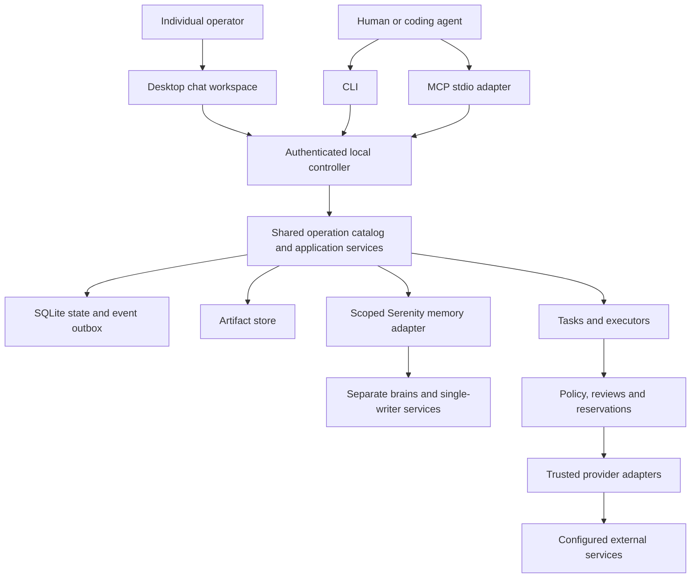

# Implementation assignment: `internal/controller`

Generated specification revision 7; source digest `7e1f4bdde4510d22c756cb91fe526c2a9871e9a246332cef024e5f8fa85ff60e`. This file is committed implementation context. Do not independently edit it. Everything required from the product specification and adjacent interfaces is embedded below; no RFC copy is required.

## Mission and scope

Own one controller lifetime, adapter dispatch, durable background work and recovery coordination.

Write scope: **`internal/controller/` only**, excluding this generated AGENTS.md. Go package name: `controller`. Ownership kind: infrastructure; integration wave: 3.

Allowed production imports from this repository: `github.com/zatiti/zatiti/internal/contract`, `github.com/zatiti/zatiti/internal/application`, `github.com/zatiti/zatiti/internal/platform`, `github.com/zatiti/zatiti/internal/storage`. Tests may use interfaces/fakes defined locally and, once available, storage-backed temporary fixtures; integration owns cross-package tests. No sibling raw SQL. No root dependency edits except the integration exception stated in its own brief.

## Implementation decisions and acceptance focus

Expose Config{StateDir string; TickInterval time.Duration; MaxDispatch int}; New(Config,*application.Application,contract.Database,contract.Ownership,map[string]contract.Adapter,contract.Clock) (*Controller,error); Run(context.Context) error; Stop(context.Context) error. Entrypoint startup holder acquires platform lock, migrates DB and advances generation before constructing controller/listener; controller receives held Ownership, does not lock or advance twice, and stops admission on Ownership.Lost. Tick default 1s and max batch 100, bounded by installation concurrency; no scheduler in MCP/service New, and none in the Flutter desktop client. Resolve durable due wakes and pending intents, admit then claim via app.Internal, call exactly one adapter outside tx, record observation. Persist ambiguity when process dies after claim; restart fences old generation and never resends claimed effects blindly. Owned model/memory/probe outcomes delivered to corresponding internal record/observation methods transactionally after effect record using durable deduplicated outbox. Worker loop context bytes staged and published before context pin and effect intent. After recording a raw adapter observation, publish every StagedOutput through the artifacts owner, including the staged request context named by physical_call.request_context (and ModelOutput.request_context), for every disposition including not_sent and unknown; replace each staged ArtifactLocator with kind artifact and the published ArtifactRef in the normalized evidence delivered to owners, reject an observation whose staged locator matches no StagedOutput or more than one, and never rewrite the raw recorded observation. Trusted verifier runner and local IO background jobs execute outside tx with own pinned accepted profile; record results through task/execution owner. Loss of installation lock/ownership immediately stops admission; graceful shutdown fences or records unresolved work, never invents provider cancellation. Run remains active after desktop disconnect. The controller never hands its contract.Database, or any part of it, to a module: installation's consistent-backup capability is bound by entrypoint assembly before the controller exists, so executing an installation.backup/restore job is only invoking installation's LocalIO plan. A plan that reports prerequisite_missing for the database backup capability is recorded as a failed job with that named prerequisite, never retried into success or substituted by a controller-side file copy. Secret helper/Serenity process lifecycle belongs controller installation packaging, one writer/brain; refuse unsupported version/capability.

Local proving focus: Duplicate controller, startup crash generation, dispatch exact counts, record write loss, wake/mailbox replay, graceful stop versus unknown outcome, client closes while work continues.

## Incoming and outgoing boundaries

Incoming callers: entrypoint/assembly or tests via the explicit Go API.

Outgoing owner calls: `_connections.validation.record`, `_scheduling.wake.due`, `_scheduling.wake.admit`, `_effects.admit`, `_effects.claim`, `_effects.record`, `_effects.pending`, `_execution.tick`, `_execution.context`, `_execution.observation`, `_execution.fence`, `_messaging.admit`, `_memory.record`, `_artifacts.publish`, `_installation.restore.record`, `_execution.enqueue`, `_tasks.ready`, `_execution.job.pending`, `_execution.job.claim`, `_execution.job.record`, `_execution.verification.record`, `_execution.turn.admit`, `_execution.work.pending`, `_execution.work.claim`, `_execution.context.prepare`, `_execution.context.commit`, `_execution.proposal.prepare`, `_execution.proposal.record`, `_execution.report`, `_execution.verification.pending`, `_execution.verification.claim`, `_tasks.dependencies.wake`, `_messaging.ready`, `_effects.reconciliation.prepare`, `_effects.reconciliation.record`, `_skills.evaluation.record`, `_configuration.export.prepare`, `_configuration.export.record`, `_effects.restore.merge`, `_identity.restore.merge`, `_memory.restore.merge`, `_installation.restore.overlay`. Each exact input/output schema appears below. Calls retain current Unit/authority; owner allowlists are mandatory.

### Imported package APIs and behavior

These briefs are embedded so you need not read a sibling prompt to discover its incoming API. Implement only your own package.

**`internal/application`** — Own authenticated operation execution, transaction composition, internal port allowlists and durable submission replay.

Expose New(contract.Database,*registry.Registry,contract.Authenticator,contract.Clock,contract.IDSource) (*Application,error); Invoke(context.Context,contract.Actor,string,contract.Request) (contract.Result,error); Internal(context.Context,contract.Actor,contract.Scope,contract.Invocation) (contract.Payload,error); Authenticate(context.Context,[]byte) (contract.Actor,error); AuthenticateCertificate(context.Context,contract.Digest) (contract.Actor,error); Ports() contract.Ports. Application consumes only registry/contract, never imports domain packages. Expose NewPorts() *PortRouter, (*PortRouter).For(string) contract.Ports, and Bind(*Application) error for the exact two-phase assembly specified in common contract. Composition registers modules and injects app Ports using a constructor-safe late-bound dispatcher; no service calls until assembly complete. Public Invoke derives Unit scope from validated input plus referenced resource, revalidates authenticated actor, rejects internal operation. Gate _policy.check for every public capability; exceptions only bootstrap/capabilities as explicitly specified. Create mutation command identity/replay before stale checks; invoke handler in same ordered transaction; wrap result. Internal method callable only trusted controller scope, checks service principal and allowed entrypoints; ordinary domain Ports calls retain same actor/Unit and caller stack. Enforce catalog callers/visibility/mode, no recursive operation loop, no impersonation. Separate local IO prepare/perform/finish paths for explicitly registered IO modules; repeat authorization and version check at final metadata publication/disclosure. An accepted external job is not dispatched in request transaction. Record known refusal after rollback without losing dedupe concurrency. Bootstrap invokes shared installation initializer with special local capability granted by owner lock only.

**`internal/platform`** — Own OS locks, protected local configuration, secret custody, encrypted blob files and client secure storage.

Expose Config{StateDir string; CredentialBackend string; MasterKeyRef string; MaxArtifactBytes int64}; Open(Config) (*Platform,error); (*Platform).Acquire(context.Context) (contract.Ownership,error); Secrets() contract.SecretStore; Blobs() contract.BlobStore; Close() error. SecretStore and BlobStore implementations are separate objects; use OS keychain/Secret Service or explicitly provisioned headless key source. State root 0700, sensitive files 0600, private Unix socket 0600, forbid unsafe symlink traversal and network-filesystem claims. A held exclusive OS file lock spans controller lifetime; close/release is explicit. No plaintext fallback if secure store unavailable. Encrypt sensitive blob bytes using authenticated encryption with per-object nonce and authenticated digest/metadata; master key lives outside SQLite/backups. Stage returns opaque staging identity, digest of plaintext exact bytes, and bounded size. Publish is atomic and durable before metadata reference; repeated identical publication is idempotent. Open decrypts/verifies full integrity before returning bounded requested bytes; missing/corrupt bytes fail artifact_fault. Never return local absolute paths through product interfaces. Disk pressure rejects new artifact-producing admissions and preserves referenced/unknown-obligation data. Export secret helper support through local trusted process plumbing, never model input. Client credentials, TLS keys and offline drafts use protected storage; do not inherit owner secrets into workers. Revision 6: own protected atomic desktop.json publication and the nonsecret KeychainLocator for a verified opaque owner StoreRef; never expose owner bytes through metadata.

**`internal/storage`** — Own the SQLite writer, consistent reads, transaction Unit, migrations and atomic event outbox.

Expose Config{Path string; BusyTimeout time.Duration}; Open(context.Context,Config) (contract.Database,error). Caller must hold platform installation lock. Implement StartGeneration(context.Context) (int64,error) and Generation(context.Context) (int64,error) on Database; assembly calls StartGeneration once after migrations and before serving under held ownership. SQLite driver family is modernc.org/sqlite; integration pins exact release. Migrate only with exclusive ownership; validate per-owner monotonic versions and migration SHA256, reject changed applied migration. Enforce owner table namespaces through review and migration validation; application supplies actor/scope and never exposes raw Unit externally. Implement ReadOnly guard in Unit.ExecContext/Emit; consistent snapshot Reader on one connection. Write serializes, starts short explicit transaction, calls callback once, commits state/events together, rolls back on failure/panic. SQL busy waits are bounded. Event sequence persisted increasing globally, payload redacted and authorized by evidence owner before exposure. Database.Events is trusted internal raw feed and not directly public. Backup uses actual consistent SQLite backup mechanism, not copy of a live DB main file; it is reached by installation through the one-method contract.DatabaseBackup capability, is called outside any Unit while the controller keeps the database open and serving, and must yield one consistent snapshot without requiring the caller to hold a transaction. No domain schemas in this package.

## Shared foundation contract

# Frozen implementation contract, revision 7

These decisions complete the product specification and bind every scope. Report contradictions with an affected-dependency list and proposed coordinated revision; do not change another owner's interface locally.

Revision 7 adds a downloadable Mac delivery record without changing the already staged `zatiti.mac_release/v1` descriptor or any product operation. A canonical, strict, <=64 KiB `zatiti.mac_delivery/v1` record contains: `schema`; the complete separately signed `MacReleaseDescriptor` and its `MacReleaseSignature`; `channel` (`stable`); positive monotonic `release_sequence`; UTC `published_at` and `expires_at` (at most 30 days apart); and exactly six sorted asset records, one `controller`, one `desktop`, and one `installer` for each of `amd64` and `arm64`. Each asset binds `arch`, `distribution`, exact basename `zatiti-<version>-darwin-<arch>-<distribution>.<extension>` (`tar.gz` for component trees, `pkg` for installer), HTTPS URL, byte size (1..2 GiB), and lowercase SHA-256. URLs have no userinfo, query, fragment, IP literal, traversal, or embedded credential; the basename must match the URL path's final segment and must be unique. Component archives contain the signed component manifest and the exact tree covered by the inner descriptor; the installer package must bind those same components and preserve state. The delivery record has its own Ed25519 signature under domain `zatiti.mac_delivery_signature/v1`, covering the canonical record hash. Its signer is selected only from public keys distributed with the installer/bootstrap or cask, never from a fetched record; key rotation ships overlapping trusted keys before a new signer is used. The signature, time window, sequence and exact assets are checked before any downloaded byte is executed; each download is bounded by signed size, keeps TLS validation, refuses cross-host redirects, verifies exact hash/length, and is staged privately before activation. A protected local sequence watermark refuses downgrade/replay without explicit reviewed recovery.

For a one-line direct installer, the published command must pin the bootstrap script's own SHA-256 (download to a temporary file, verify the literal digest in that command, then run it); a mutable `curl | sh` cannot establish the script's embedded trust key. The bootstrap uses native hardware detection so Apple Silicon under Rosetta selects arm64, chooses only signed delivery assets for that hardware, verifies Developer ID package signature and notarization evidence, and invokes the existing per-user installer without disabling Gatekeeper or installing developer tools. A project cask may instead pin each architecture's package URL and SHA-256 in its formula. Source contains no private signing key, hosting credential or placeholder public release claim. `packaging` owns schemas, offline validation, generation and installer tests; CI binds final signed/notarized bytes and evidence; qualification installs each final artifact on a clean native Intel and Apple Silicon host. No publication or qualified install command follows from synthetic fixtures alone.

Revision 6 freezes the Mac installed-client discovery and owner credential handoff. It adds no public operation or persisted row. The installed Mac release uses the controller's existing default state directory (`os.UserConfigDir()/zatiti`, exactly `$HOME/Library/Application Support/zatiti` on macOS); custom paths remain explicit development configuration. `internal/platform` owns an atomic, owner-only `desktop.json` record in that state directory. Its strict UTF-8 JSON schema is `zatiti.desktop-discovery/v1` and its fields are exactly `schema`, `protocol_version` (integer 1), `socket_path` (absolute local Unix socket path), and, only after committed bootstrap, `installation_id` (lowercase UUID), `keychain_service`, `keychain_account`. No credential, master key reference, provider key, helper executable path or caller-supplied endpoint appears. The record is at most 4096 bytes, has a 0700 parent and 0600 mode, is written by fsync plus atomic rename, and is refused on symlink, wrong owner, permissive mode, malformed/unknown schema, partial post-bootstrap locator or unsafe socket path. A missing record means the controller has not published its location, never that setup is complete. Stale metadata remains for repair after the service stops; the desktop confirms live identity through authenticated `installation.status` before showing user data.

`cmd/zatiti serve` publishes the pre-bootstrap record once its private socket is bound and republishes the initialized record after it reads authoritative `installation.OwnerCredential` from a database snapshot. It does this on every initialized startup and after an `installation.init` commit, including a restart after the commit but before publication; it never reruns init or mints a second owner token to repair publication. The existing CLI profile handoff may continue as a compatibility path, but it must use the same persisted StoreRef rather than an in-memory last-Put value. A missing, revoked or unreadable owner item fails closed with a named prerequisite; locked/unavailable/refused Keychain is distinct from absent metadata and never triggers bootstrap retry or token rotation. `internal/platform` exposes `(*Platform).KeychainLocator(ctx, opaqueRef) (service, account string, err error)` only for a stored, readable Keychain item. It validates the reference and never returns bytes; headless and non-Mac backends refuse capability. The locator corresponds to the exact Keychain generic-password item under the platform's installation-local service and account encoded by the opaque ref. The stored item is base64 of the complete Authorization header value, as current platform custody writes it.

The installed Flutter Mac client reads only this protected metadata by default; explicit environment/remote profiles remain development/advanced overrides. It reads the named login-Keychain item through the pinned `flutter_secure_storage` macOS backend using `MacOsOptions(accountName: keychain_service, usesDataProtectionKeychain: false)` and `read(key: keychain_account)`, strictly decodes one base64 value to a valid complete Authorization header, and supplies it only to `ControllerClient.credentials`. It does not copy the token to another storage item, reveal it in UI/logs, or load controller state files. Before bootstrap, it may call the already-public `installation.init` over the private socket with no credential and `credential_store: os`; it persists the intended owner name and any ambiguous attempt for reconciliation, and does not create a second chief. Once initialized, it waits for the republished locator, authenticates, compares `installation.status`'s installation ID with discovery, and only then opens the pinned chief conversation. Missing service, unreadable metadata, locked/refused Keychain, stale socket, and identity mismatch are distinct repair states. The app never declares chat-ready from socket existence, adapter registration, or successful compilation. This revision affects `internal/platform`, `cmd/zatiti`, `apps/desktop`, and integration/qualification fixtures; packaging's installed LaunchAgent must use the default state path, and qualification must prove signed Keychain access on both Mac architectures and across upgrade. The separate provider-key submission and downloadable release metadata contracts remain unresolved and must be frozen before their dependent tasks are dispatched.

Revision 5 adds `SecretStore.Lookup(ctx, key) (opaqueRef, error)` for trusted code that must recover the current reference for a stable, locally owned secret name. `Put` still returns an opaque reference, and `Get`/`Delete` still accept only such references. Lookup validates the same key bounds as Put, returns `not_found` for a missing key, fails closed when the store is unavailable, and never returns secret bytes or creates a credential. Its result is installation-local and must never appear in a public operation payload, receipt, log, or model context. The helper receipt signer stores its key under `connections/helper/receipt-key`; connection completion resolves that exact name through Lookup and then Get. It must never trust a reference supplied by the receipt or caller. This additive Go interface revision affects `internal/contract`, `internal/platform`, `internal/connections`, `cmd/zatiti`, and their SecretStore test doubles; it changes no wire schema or persisted row.

Revision 4 stages the first distribution on macOS for both native arm64 and amd64. Linux remains the next supported target after its own qualification; Windows and mobile remain later. A Mac release cannot claim Intel or Apple Silicon support from compilation alone: each requires an installed, signed, notarized artifact and clean-host qualification. The product and operation contracts of revision 3 remain in force; this revision changes release dispatch order and platform evidence, not the wire schemas or persisted rows. Required provider, Serenity, backup/restore and other first-release guarantees are not waived by phasing Linux later. Setup must let an installed Mac app reach the pinned personal-chief conversation without environment variables, manual socket paths or manual controller startup; any new helper/discovery or secret-custody interface requires its own coordinated contract before dependent implementation.

Revision 3 changes, each a coordinated revision that code written against revision 2 must follow. Every new field named below is additive and optional on an existing type: no existing required field changed type, name or was removed, so old persisted rows validate unchanged and remain inspectable with the new field simply absent. New tables (`WorkerTurn`, proposal records) and new operations have no prior callers to break.

- **Durable worker turn.** Execution owns a persisted `WorkerTurn` (see the embedded `WorkerTurn`/`TurnSource` schemas in `internal/execution`'s generated prompt) keyed by unique `(installation_id, source_kind, source_id, source_version, recipient_worker_id)`; re-admission through `_execution.turn.admit` returns the same turn. A pending inbox message and its turn admission/processed marker (`_messaging.processed`) commit in one shared transaction. A message arriving during an active turn is admitted as a safe-boundary injection durably linked to that turn, never silently dropped or processed twice. One active decision stream exists per worker/task lane; different eligible workers may run concurrently within aggregate limits. Each model step/proposal is stored separately as a `ProposalRecord` keyed by unique `(turn_id, step_index, proposal_id)`; the same key with different bytes is `submission_conflict`.
- **Worker turn pipeline operations.** `_execution.work.pending`/`.claim`, `_execution.context.prepare`/`.commit`, `_execution.proposal.prepare`/`.record`, `_execution.report`, `_execution.verification.pending`/`.claim`, `_tasks.evidence.record`, `_tasks.dependencies.wake`, `_messaging.ready`/`.processed` are new internal operations driving the durable worker loop end to end (admit → claim work → prepare/commit context → dispatch a model or tool effect → record the proposal → report → independently verify). Public `task.start` transitions an eligible draft/ready task to ready and enqueues its run in the same transaction; `task.create`/`task.assign` are unchanged. Exact schemas, callers and behavior are embedded in the generated prompts of `internal/execution`, `internal/tasks` and `internal/messaging`.
- **Worker operation executor.** A narrow `contract.WorkerOperator` capability (declared below) lets a worker-authored local proposal invoke an ordinary public operation under the worker's own authenticated actor, scope-intersected with the task/source authorization envelope. It resolves the actor from the persisted turn/worker mapping; `WorkerID` is an asserted match against that turn, never a way to select any principal. Local model-visible operations are an explicit allowlist (authorized configuration authoring/inspection, task/delegation/responsibility actions, approved memory/messaging operations, output publication); grant/policy changes, secrets, internal bookkeeping and human review never become available merely because they exist in the public catalog. The controller's administrative identity authorizes scheduling/bookkeeping only, never a model proposal. **Public/internal caller fix:** `task.assign` is a public operation and carries no caller allowlist (the registry rejects a public descriptor with callers — confirmed 2026-09-18 descriptor-drift finding in docs/roadmap.md); a chief-driven assignment is an ordinary authenticated `task.assign` call made through this executor under the requesting worker's own actor, not a domain-internal caller path.
- **Effects callback routing.** `Operation` gains optional `attempts` (`{attempt_id, generation}` pairs, additive alongside the unchanged `attempt_ids`) and optional `callback_route`; `Dispatch` gains the matching optional `callback_route`. `_effects.prepare` accepts an optional `callback_route` (`CallbackRoute`: `worker_turn`/`job`/`memory`/`skill`/`connection` plus the relevant turn/step/job id) persisted alongside the action and returned at claim. The controller resolves callback routing from this persisted route; it never infers routing by inserting an undeclared `attempt_id` into strict adapter parameters (fixes audit finding G05). `_effects.record` gains an optional `current_generation` for the successor-generation rule: a stray attempt is `not_sent` if never actually claimed under its recorded generation, `outcome_unknown` if claimed but unconfirmed — never silently dropped.
- **Effects reconciliation reaches `Adapter.Reconcile`.** New `_effects.reconciliation.prepare`/`.record` create a separately admitted, separately authorized and accounted bounded reconciliation read distinct from the original write, merging the qualified observation into the original operation's uncertainty without overwriting history or replaying the original action (fixes audit finding G13).
- **Job registry linkage.** `_execution.job.create` gains an optional `operation_id`, linking a network-backed job to its originating effects `Operation` at creation so reconciliation resolves it without scanning another owner's table; a job without `operation_id` is an ordinary local runner. New `_skills.evaluation.record` and `_configuration.export.prepare`/`.record` route skill evaluation and configuration export/import through this durable job ledger instead of handler-local ID minting with no owner-backed lookup (fixes audit findings G11, G12).
- **Registry lookup and schema normalization (already implemented; confirmed for revision 3).** `Lookup(id, 0)` resolves the highest registered version for that operation id. The registry accepts either a bare `$defs`-relative schema or a fully self-contained document at registration, and `Lookup` always returns a self-contained document pruned to reachable `$defs`. These two rules were implemented and tested against application's assumptions before this revision; this entry is their authored record (docs/roadmap.md, 2026-09-18).
- **CLI root tokens (clarification, no schema change).** `Descriptor.CLI` is the subcommand path only and excludes the binary name; `cmd/zatiti` prepends `zatiti` once at command-tree assembly. Generated `AGENTS.md` prose shows the full invocation (for example "CLI `zatiti artifact export`") for readability — that rendering convenience is not part of the wire contract, and an implementer must not treat the printed binary name as part of `Descriptor.CLI` (this ambiguity produced a wrong descriptor token shape in 11 modules; docs/roadmap.md, 2026-09-18).
- **Service-principal bootstrap.** `_identity.bootstrap` gains optional `service_credential_id`/`service_store_ref` so the bootstrap-created controller service principal can receive a credential in the same transaction, letting an out-of-process controller authenticate; omitted fields leave the service principal credential-less for the in-process explicit-`Actor` seam, unchanged from revision 2.
- **Review eligibility (ruling, confirmed for revision 3).** The eligible reviewer of an exact review-class request is the human principal whose current authority admitted that request; services, workers and agents are never eligible, and proposer separation stays mandatory for them. This settles "an eligible owner's decision" left undefined in revision 2's policy/reviews briefs (docs/roadmap.md, 2026-09-18 evening REVISION-3 RULING).
- **Internal authority checks (ruling, confirmed for revision 3).** `_identity.authority`, like every internal operation, is gated by its caller allowlist and by the calling actor being a registered, unrevoked principal in the transaction's installation — never by requiring the calling actor to independently hold the capability named in its own request. A standing grant of `_identity.authority` to work around a circular subject-capability check is unnecessary and must not be relied upon (docs/roadmap.md, 2026-09-19 REVISION-3 RULING). Whether an actor may read another principal's authority is an explicit code-level decision this ruling does not settle; downstream implementers must document it in place rather than infer it.
- **Artifact locator staging (confirmed unchanged).** `PhysicalCallEvidence.request_context` and `ModelOutput.request_context` remain the revision-2 `ArtifactLocator` retype; revision 3 makes no further change here and extends the same staged/artifact pattern to `_execution.context.commit`'s `staged_context`.
- **Responses `prepare_session`/`model_step` split.** See "OpenAI Responses session preparation" below.
- **Small query/result additions.** `conversation.get`/`.list` return the calling principal's optional `caller_unread_count`/`caller_last_read_marker`; new public `conversation.message.list` reads authorized message history for one conversation. New public `memory.list` lists authorized scoped claim refs (source/freshness/lineage/supported actions) without performing paid retrieval. `Artifact` gains optional `source_operation_id`/`purpose` (provenance). `Status` gains optional `runtime_ready`. `Responsibility` gains optional `last_cycle_id`, and `_scheduling.cycle.record` gains a required `cycle_id` replay/conflict fence plus optional `turn_id` linkage. New public `installation.verifier.list` enumerates installed trusted verifier profiles (secret-free) so a task's acceptance contract can name one. `event.list`'s drained-cursor/filter/scope/principal/retention behavior is unchanged; this is its explicit revision-3 confirmation, not a schema change. Public task/turn status projection and installed-capability desktop surfacing are explicitly deferred to `internal/evidence` (P34) and `apps/desktop` (P42) rather than invented here.
- **Local decision tools pinned separately from provider tools.** `ReplyProposal`, `ClarifyProposal`, `ReportOutputsProposal` and `CycleDecisionProposal` (schemas below) are the sealed names/inputs for the context builder's non-provider decision tools (`reply`, `clarify`, `report_outputs`, `cycle_decision`). They are execution-local proposals evaluated by the worker operation executor, never routed through a `connections.Tool`/adapter and never given a provider operation mapping; a final text answer alone may complete a chat turn but never implicitly fulfills a task's required outputs.
- Desktop client (ADR 002): the desktop is a Flutter application at `apps/desktop` that is a direct wire client of internal/server. The Go roots `internal/desktop` and `cmd/zatiti-desktop` are retired; no Go package may import or stand in for the desktop.
- Adapter request context: `PhysicalCallEvidence.request_context` and `ModelOutput.request_context` are an `ArtifactLocator`, not a bare `ArtifactRef`. Adapters return the staged variant; the controller publishes it and substitutes the artifact variant in normalized evidence.
- Installation database seam: `contract.DatabaseBackup` is a one-method capability that entrypoint assembly supplies only to internal/installation through `installation.WithDatabaseBackup`. `contract.Dependencies` is unchanged and no domain gains general database access.

## Build and dependency decisions

Module `github.com/zatiti/zatiti`; language `go 1.26.0`; initial toolchain `go1.26.2`. Integration owns go.mod/go.sum. The Flutter desktop pins its own Flutter/Dart SDK and plugins in `apps/desktop/pubspec.lock`; integration records those pins and licenses in the same lock report and the Go module never depends on them. Domains import standard library and internal/contract, not sibling domains. Application composes owner methods through a checked in-process dispatcher: ordinary Go calls, not another server or scheduler.

Library families: Cobra CLI; official MCP Go SDK, handwritten adapter for MCP `2025-11-25`; Flutter (Dart) desktop application at `apps/desktop` with an operating-system secure-storage plugin, outside the Go module; modernc.org/sqlite. Mint is optional build-time tooling and cannot weaken contracts. Hosted provider v1: a specifically qualified OpenAI Responses endpoint/profile, with configured model and prices. Other compatible endpoints remain unavailable until qualified. GitHub uses documented REST over net/http, with mutation retries disabled. Serenity is a separate pinned service using public interfaces only. Integration must resolve exact dependency releases/commits, checksums, licenses and qualification commands in a lock report BEFORE dispatching dependent implementation. These are selected implementation families, not claims that upstream behavior has been qualified. No agent independently substitutes libraries, models, prices, accounts or Serenity APIs. Dependency resolution/qualification is an explicit foundation assignment.

## Shared Go declarations

The contract owner implements these exact declarations. Omitted function bodies are the implementation assignment, not production stubs. Public JSON uses snake_case. Schema-derived DTO names concatenate operation path segments in PascalCase plus Input/Output and live in the owning package. JSON integer => int64, UUID => contract.ID, timestamp => time.Time, optional scalar => pointer, array => slice, explicitly open JSON => json.RawMessage. Unknown fields are rejected.

```go
package contract
import (
    "context"
    "database/sql"
    "encoding/json"
    "io"
    "net/http"
    "time"
)
type ID string
type Digest string
type Version int64
type Clock interface { Now() time.Time }
type IDSource interface { New() ID }
type Scope struct {
    InstallationID ID `json:"installation_id"`
    OrganizationID ID `json:"organization_id,omitempty"`
    ProjectID ID `json:"project_id,omitempty"`
    WorkerID ID `json:"worker_id,omitempty"`
    TaskID ID `json:"task_id,omitempty"`
}
type Actor struct {
    PrincipalID ID `json:"principal_id"`
    Kind string `json:"kind"` // human | client_agent | worker | service
    CredentialID ID `json:"credential_id"`
}
type Request struct {
    Schema string `json:"schema"` // zatiti.request/v1
    SubmissionKey string `json:"submission_key,omitempty"`
    Input json.RawMessage `json:"input"`
}
type Fault struct {
    Code string `json:"code"`
    Message string `json:"message"`
    Retryable bool `json:"retryable"`
    Details json.RawMessage `json:"details,omitempty"`
}
func (*Fault) Error() string
type Outcome[T any] struct { Status string; Data T; NextCursor *string }
type Payload struct {
    Status string `json:"status"` // completed | accepted | failed
    Data json.RawMessage `json:"data"`
    Error *Fault `json:"error"`
    NextCursor *string `json:"next_cursor"`
}
type Result struct {
    Schema string `json:"schema"` // zatiti.result/v1
    CommandID ID `json:"command_id"`
    Payload
}
type Invocation struct { Operation string; Version int64; Input json.RawMessage }
type Event struct {
    ID ID `json:"id"`
    Sequence int64 `json:"sequence"`
    At time.Time `json:"at"`
    Scope Scope `json:"scope"`
    Kind string `json:"kind"` // owner.entity.transition
    ResourceID ID `json:"resource_id"`
    ResourceVersion Version `json:"resource_version"`
    Data json.RawMessage `json:"data"`
}
type Reader interface {
    QueryContext(context.Context, string, ...any) (*sql.Rows, error)
    QueryRowContext(context.Context, string, ...any) *sql.Row
}
type Unit interface {
    Reader
    ExecContext(context.Context, string, ...any) (sql.Result, error)
    Actor() Actor
    Scope() Scope
    Generation() int64
    ReadOnly() bool
    Emit(context.Context, Event) error
}
type Ownership interface { Held() bool; Lost() <-chan struct{}; Close() error }
type Database interface {
    StartGeneration(context.Context) (int64, error)
    Generation(context.Context) (int64, error)
    Read(context.Context, Actor, Scope, func(Unit) error) error
    Write(context.Context, Actor, Scope, func(Unit) error) error
    Migrate(context.Context, []Migration) error
    Events(context.Context, int64, int) ([]Event, error)
    Backup(context.Context, io.Writer) error
    Close() error
}
type Migration struct { Owner string; Version int64; SQL string; SHA256 Digest }
type Descriptor struct {
    ID string; Version int64; Owner string
    Visibility string // public | internal
    Mode string // query | mutation
    Effect string // local | disclosure | external_read | external_mutation
    InputSchema json.RawMessage; OutputSchema json.RawMessage; CompletionSchema json.RawMessage
    CLI []string; MCP string; ScopeRequired []string; Callers []string
    ExpectedVersion bool; SubmissionKey bool
}
type Handler func(context.Context, Unit, Invocation) (Payload, error)
type Module interface {
    Name() string
    Migrations() []Migration
    Descriptors() []Descriptor
    Handle(context.Context, Unit, Invocation) (Payload, error)
}
type Ports interface { Call(context.Context, Unit, Invocation) (Payload, error) }
type SecretStore interface {
    Put(context.Context, string, []byte) (string, error)
    Lookup(context.Context, string) (string, error)
    Get(context.Context, string) ([]byte, error)
    Delete(context.Context, string) error
}
type BlobStore interface {
    Stage(context.Context, io.Reader, int64) (string, Digest, int64, error)
    Publish(context.Context, string, Digest) error
    Open(context.Context, Digest, int64, int64) (io.ReadCloser, error)
    RemoveStaged(context.Context, string) error
}
type Dependencies struct {
    Clock Clock; IDs IDSource; Ports Ports
    Secrets SecretStore; Blobs BlobStore
}
// Every domain owner: New(Dependencies) (*Service, error).
// *Service implements Module. Only declared outgoing ports may be used.
// Sole exception: installation's New also takes options (see DatabaseBackup).
type Dispatch struct {
    OperationID ID `json:"operation_id"`
    AttemptID ID `json:"attempt_id"`
    Generation int64 `json:"generation"`
    Adapter string `json:"adapter"`
    Action json.RawMessage `json:"action"`
    CredentialRef string `json:"credential_ref"`
    ProviderKey string `json:"provider_key,omitempty"`
    Deadline time.Time `json:"deadline"`
}
type Observation struct {
    Disposition string `json:"disposition"` // succeeded | failed | accepted | unknown | not_sent
    ProviderReference string `json:"provider_reference,omitempty"`
    Evidence json.RawMessage `json:"evidence"`
    Usage json.RawMessage `json:"usage"`
    ConfirmedAt *time.Time `json:"confirmed_at,omitempty"`
}
type Adapter interface {
    Name() string
    Contract() json.RawMessage
    Invoke(context.Context, Dispatch) (Observation, error)
    Reconcile(context.Context, Dispatch) (Observation, error)
}
type AdapterDependencies struct {
    HTTP *http.Client; Secrets SecretStore; Clock Clock; Blobs BlobStore
}
// Every adapter: New(AdapterDependencies, json.RawMessage) (Adapter, error).
// Config is strictly validated, versioned and secret-free.
type Operator interface { Call(context.Context, string, Request) (Result, error) }
type CredentialSource interface { Credential(context.Context) ([]byte, error) }
```

The registry binds concrete input/output DTO types to descriptors and handlers using `Bind[I, O any](descriptor contract.Descriptor, fn func(context.Context, contract.Unit, I) (contract.Outcome[O], error)) (contract.Handler, error)`. JSON decoding is strict and schema validation precedes execution. Internal cross-owner calls use the same schema-checked Invocation boundary to avoid sibling package imports. They retain the same Unit, actor, scope, generation and transaction; cannot mint authority; and are not exposed as public operations.

## Transaction and ownership rules

Each domain owns tables prefixed with its package name and `_`. Schema and migration bodies inside that namespace are package-private; no other package depends on their layout. Storage owns installation generation, migration metadata and `storage_events`. Evidence owns commands/receipts. Migration ordering is explicit in application assembly. All migrations run under exclusive installation ownership before serving. Cross-owner reads and changes use Ports.Call and the embedded internal schemas. Internal operations have a caller allowlist. The dispatcher detects recursive calls. Queries cannot invoke mutation descriptors. Public clients cannot supply Actor or Unit or invoke internal operations.

One controller, one ordered writer, WAL, foreign keys on every connection, synchronous FULL, busy timeout 5 seconds, consistent read snapshots. Database.Write performs ONE transaction callback attempt with no automatic callback retry. Busy exhaustion returns controller_unavailable/retryable. Unit is valid only inside its callback; no goroutines or retained handles. Unit.Emit appends state-correlated evidence to the storage outbox in the same transaction. Delivery is at least once and consumers deduplicate event IDs. No network/model calls, secret-store access, filesystem streaming or subprocess work inside a Unit. Stage bytes or local helper actions outside transactions, then publish metadata or reconciliation intent through owner methods.

Handler errors roll back the entire transaction. Persist a command refusal in a separate short transaction after rollback where necessary, retaining the original request identity. Query command IDs need not be durable. All mutations return durable command IDs; accepted responses must identify inspectable durable work. Output schemas describe Payload.Data, not the result envelope. Never leak SQL, tokens, provider raw responses or private paths through Fault.

Definition creates/updates/archive stage drafts, including schedules, responsibilities, policies and memory bindings. Only configuration.apply activates definitions. It validates owners' candidate slices, seals base revision/dependencies/requirements, and calls internal activate in the same transaction under old authority. Internal activate is admitted only from the compiler during exact plan application, not by a public flag. Public restrictive pause/revoke/cancel commits immediately without compilation or spending. Archive staging may immediately disable new admissions as an explicitly reported restrictive side effect; final removal waits for obligations.

## Effect and execution rules

Admit: current authorization, exact review/preconditions, all budget reservations, attempt/dispatch intent and evidence atomically. Claim: second transaction rechecks generation/restrictions/expiry and consumes the one-use claim. Invoke the adapter outside transactions. Record: third transaction stores observations, costs or retained uncertainty and events. Each physical call, including reconciliation and retries, has a distinct attempt. Reconciliation is an admitted bounded read and links to the original effect; it does not overwrite history. Internal jobs use explicitly provisioned scoped service identities plus current worker/task restrictions.

Once claimed, crash/timeout/cancel/lease expiry/operator acknowledgement/weak not-found cannot prove nonexecution. Preserve outcome_unknown and its reservation until authoritative evidence. Earlier unknown attempts survive later failures. Mutation SDK/HTTP retries are disabled. Even qualified idempotent retries need fresh authorization and physical-attempt evidence. Trusted adapters resolve credential references outside transactions; no public raw secrets or inherited owner credential environment. Fencing external workers blocks Zatiti mutations but cannot prove their processes stopped.

Task success needs independently established acceptance against pinned verifier code/version, sealed inputs and observations. Worker report/exit zero cannot set succeeded. Defaults: one concurrent attempt/worker, four/installation, 30 minutes/attempt, 100 model steps, eight children, delegation depth three, root deadline 24 hours. Configure explicit currency and finite spend limits before paid work. Amounts are int64 micro-units with checked overflow; rational rates use integer numerator/denominator and round reservations upward. Unknown/advisory usage and missing prices are not zero. Children share root and ancestor budgets.

## Wire conventions and limits

UUIDv4 for new identities; stable UUID references thereafter. SHA-256 lowercase hex digests. Versioned canonical JSON sorts keys, rejects duplicate keys/unknown fields, preserves exact integer values and semantic array order; schema-declared sets sort by stable identity. Preserve exact skill bytes. UTC RFC3339Nano timestamps and int64 versions >=1. Patches and snapshots are distinct; explicit delete only. Inert `extensions` alone permits namespaced extra keys. Scope is explicit and every referenced object is revalidated; no implicit global organization.

Default limits: JSON request 1 MiB; chunk 1 MiB decoded; artifact 256 MiB; skill archive 16 MiB compressed, 64 MiB expanded, 4096 entries, depth 32; list 50/max 200; read 1 MiB; redacted log record 8 KiB; event page 100/max 500; upload expiry 24 hours. Narrowing is allowed, increases require authorized configuration. Reject overflow and unsupported bounds.

Mutations require submission_key (1..128 printable ASCII) except one-time init. Bind principal, operation/version and canonical input hash. Retain >=30 days and through unresolved obligations. Replay identical input returns original disposition BEFORE stale-version validation; changed input => submission_conflict. Concurrent duplicates serialize. Recover lost acknowledgements by command lookup, not a new key. Resource updates require expected_version; apply requires base_revision and plan digest. Creation has no existing version. Opaque authenticated cursors bind principal/scope/filter/order/snapshot and expire explicitly with cursor_expired and snapshot_required=true. Event replay cannot silently omit a gap.

HTTP POST `/v1/operations/{operation_id}` uses the common request envelope. Local HTTP runs over a private Unix socket. The Flutter desktop is a direct client of this endpoint: the private Unix socket locally and, for an explicitly configured remote desktop, mutual TLS mapped to current application principals over the same operation contract, never remote MCP. It shares the envelope, fault mapping, limits, submission-key replay and cursor rules with every other client, holds no business logic or database access, and consumes the generated operation catalog rather than any Go package. Completed => HTTP 200; accepted => 202. Failed mapping: invalid_input 400, permission_denied 403, not_found 404, stale_version/submission_conflict/conflict/review_required/outcome_unknown/artifact_fault 409, cursor_expired 410, prerequisite_missing/external_action_required/budget_unavailable/capability_unsupported/verification_failed 422, controller_unavailable 503, internal_error 500. Domain failures always include the result envelope.

CLI completed/accepted => exit 0; invalid_input 2; permission_denied/review_required 3; stale_version/submission_conflict/conflict 4; prerequisite_missing/external_action_required/budget_unavailable/capability_unsupported 5; controller_unavailable/outcome_unknown 6; other failures 1. CLI --json emits one envelope to stdout, diagnostics stderr, no implicit prompts. MCP structuredContent is the full envelope, text is equivalent JSON, failed => isError true, malformed protocol => protocol error. Dot-separated operation IDs map to CLI tokens and `zatiti_` MCP names. Exceptions: installation.init => `zatiti init` / `zatiti_installation_init`; capabilities.list => `zatiti capabilities` / `zatiti_capabilities`. Lifecycle steps are individual tools. Tool input never selects a credential profile or accepts raw secrets/unrestricted server paths.

## Completion policy

Write only within the assigned root. Do not edit this prompt, siblings, shared contracts, root dependencies or external acceptance inputs. Implement exact fake dependencies locally; do not return invented production success for unavailable prerequisites. Use controlled providers, deterministic clocks and synthetic fixtures. Preserve expected/observed results and failure evidence. Package tests prove local properties; actual subprocess parity, crash recovery, desktop and adapter qualification prove integration. Z01-Z21 and first-release journeys must pass on both Intel and Apple Silicon macOS before the Mac release is claimed; Linux requires its own later qualification before Linux support is advertised.

## Local IO, authentication, jobs and verification seams

These additional declarations are part of the SAME frozen contract package (using imports already shown). Implementing an interface does not permit calling it inside a Unit except where the signature explicitly takes Unit/Reader.

```go
type Authenticator interface {
    Authenticate(context.Context, Reader, []byte) (Actor, error)
    AuthenticateCertificate(context.Context, Reader, Digest) (Actor, error)
}
type IOPlan struct {
    ID ID
    Owner string
    Invocation Invocation
    Actor Actor
    Scope Scope
    Generation int64
    ExpectedVersions map[ID]Version
    Prepared json.RawMessage
}
type IOResult struct { Data json.RawMessage; Fault *Fault }
type LocalIO interface {
    Prepare(context.Context, Unit, Invocation) (IOPlan, error)
    Perform(context.Context, IOPlan) (IOResult, error)
    Finish(context.Context, Unit, IOPlan, IOResult) (Payload, error)
}
// Request is the exact VerificationRequest JSON schema embedded in the prompt.
type Verification struct { Request json.RawMessage }
// Document is the exact VerificationResult schema, including independently
// observed checks, pinned identity, task/attempt and staged artifact handoff.
type VerificationResult struct { Document json.RawMessage }
type Verifier interface {
    Verify(context.Context, Verification) (VerificationResult, error)
}
type VerifierDependencies struct { Clock Clock; Blobs BlobStore }
// DatabaseBackup is a narrow capability, not database access. Database satisfies
// it structurally. Entrypoint assembly supplies it to installation only.
type DatabaseBackup interface { Backup(ctx context.Context, w io.Writer) error }

// Revision 3: worker operation execution and durable job registry. Same
// package, same import set; no new dependency. (Revision 3 also introduces a
// restore capability, but as shipped it is `controller.RestoreLifecycle`,
// declared in internal/controller, not a contract-package type -- see
// "Restore protocol (revision 3)" below.)
type WorkerRequest struct {
    TurnID ID
    ProposalID string
    WorkerID ID
    Scope Scope
    Operation string
    Version Version
    SubmissionKey string
    Input json.RawMessage
}
// WorkerOperator resolves the actor from the persisted turn/worker mapping and
// re-enters ordinary application authorization; WorkerID is an asserted match
// against that turn, never a way to select any principal. Injected only into
// trusted runtime composition (application, given to execution/controller).
type WorkerOperator interface {
    ExecuteWorker(context.Context, WorkerRequest) (Result, error)
}
// JobWork/JobOutcome/LocalJobRunner are the minimal shared job types, kept in
// contract (not controller) to avoid a domain->controller import. Execution owns
// the durable ledger (execution_jobs); owners retain their domain rows and
// receive idempotent typed completion callbacks through JobOutcome.
type JobWork struct {
    ID ID
    Version Version
    Generation int64
    Owner, Operation string
    Scope Scope
    Input json.RawMessage
}
type JobOutcome struct {
    State string
    Result json.RawMessage
    EvidenceIDs []ID
    Requirements []Requirement
}
type LocalJobRunner interface {
    RunJob(context.Context, JobWork) (JobOutcome, error)
}
// Requirement mirrors the shared $defs/Requirement schema (code/message plus
// optional resource_id/challenge_id); embedded here only for the Go signature.
type Requirement struct {
    Code string `json:"code"`
    Message string `json:"message"`
    ResourceID *ID `json:"resource_id,omitempty"`
    ChallengeID *ID `json:"challenge_id,omitempty"`
}
```

### Restore protocol (revision 3)

The six-step offline restore protocol (contract-proposals.md section 7) is split across two owners as shipped, not implemented by a single entrypoint-owned capability supplied to `internal/installation` alone: `internal/installation`'s public `installation.restore` operation performs steps 1-3 without ever touching the live database file, and `internal/controller` performs steps 4-6. `installation.restore` runs the same synchronous LocalIO Prepare/Perform/Finish flow as `installation.backup` (`internal/installation/restore.go`): Prepare requires exclusive maintenance, validates the pinned backup artifact and creates the durable job; Perform (outside any transaction) decrypts and verifies the uploaded bundle's binding, integrity and framed image, then — before any rewind — exports a sealed, published `RecoveryOverlay` document of this installation's CURRENT pre-restore state (source database digest from the `DatabaseBackup` capability, plus the obligations `snapshotObligations` captured at Prepare time from pending effects and unresolved memory writes); Finish registers that overlay artifact and leaves the job `running` with an `external_action_required` requirement naming the verified backup image. `internal/installation` never swaps the SQLite file itself: a domain module cannot replace the live database out from under its own open handle mid-process, so the installation stays merely paused, not yet rewound, once `installation.restore` completes.

That handoff is driven forward by `RestoreLifecycle`, declared in `internal/controller` (`internal/controller/restore.go`) — not `contract.SnapshotInventory`/`contract.RestoreCoordinator` as this section previously described; no such contract-package types exist. `RestoreLifecycle` has two methods: `StageCandidate(ctx context.Context, restoreJobID contract.ID, dir string) (RestoreCandidate, error)` resolves the job's already-verified backup artifact into a locally staged, decrypted candidate database file, and `MergeOverlay(ctx context.Context, u contract.Unit, restoreJobID contract.ID) error` folds the already-captured `RecoveryOverlay` into every owner's own tables monotonically — never resurrecting a revoked credential, resending a consumed dispatch or erasing a liability absent from the older snapshot — inside one transaction. It is a field of `controller.Collaborators` (`RestoreLifecycle RestoreLifecycle`), attached through `Controller.Attach` exactly like `Verifier`/`Operator`/`Blobs`: only entrypoint assembly may supply an implementation, because only it has direct Go access to `internal/installation`'s private bundle/key/overlay code, and the controller itself never decrypts a backup bundle or resolves a secret reference. `cmd/zatiti/restore.go` defines the one production implementation (unexported `restoreLifecycle{}`); `cmd/zatiti/serve.go`'s `superviseController` wires it into `Collaborators.RestoreLifecycle` alongside every other trusted collaborator before `ctl.Attach(collab)`.

Once a job reaches `running`/`external_action_required`, the controller's own tick flow claims it and `runRestore` drives the remaining steps: quiesce admission and drain every other in-flight unit (`drainOrdinary`), stage the candidate image via `RestoreLifecycle.StageCandidate` and hand it to `storage.Restorable.PrepareRestore`/`CommitRestore` for the atomic file-level swap and generation advance (`performSwap`), fold the overlay via `RestoreLifecycle.MergeOverlay` inside the transaction `storage.Restorable.WriteRestoreOverlay` opens on the freshly reopened, still-paused database, then call `storage.Restorable.ResumeAfterRestore` to lift the write gate (`mergeAndResume`), and finally report the durable disposition back to `internal/installation` through its own internal `_installation.restore.record` operation (`failRestore`/`settleRestore`). A controller lifetime that itself performs the swap cannot continue afterward: its `*application.Application` was built over the now-closed pre-restore database handle and there is no seam to repoint it, so `Controller.Run` returns the `ErrRestoreHandoff` sentinel error — not a fault — the instant the swap, overlay merge and storage resume are durable. `cmd/zatiti`'s `runServe` is an outer loop around exactly this signal: on `ErrRestoreHandoff` it calls `reassembleAfterRestoreHandoff` (closes the stale `Application` and database, reopens storage at the same path — which already observes the swap — and calls `Database.StartGeneration` again to fence out the lifetime that just ended) under the SAME held installation lock, then runs again. A crash mid-protocol recovers the same way at the next startup: `recoverRestoreBeforeFence` runs before the ordinary generation fence and drives any journal entry left open forward from its last durable phase, re-checking `storage.Restorable.RestorePaused` rather than trusting the last written phase, so it never repeats an already-committed swap or loses track of one.

Current state, honestly: production's only `RestoreLifecycle` implementation, `cmd/zatiti`'s `restoreLifecycle{}`, fails both methods closed with `contract.CodePrerequisiteMissing` rather than guessing or fabricating success — exactly the fallback `Collaborators.RestoreLifecycle`'s own doc comment designs for. `StageCandidate` fails because no operation, public or internal, exposes a pending restore job's original backup-artifact reference to entrypoint assembly (public `job.get`'s wire projection never carries `Input`; only the controller's own internal `_execution.job.claim` call does, and that result stays in the controller's private journal entry). `MergeOverlay` fails because no owner-defined merge operation yet exists in `internal/effects`, `internal/identity` or `internal/memory` to fold a `RecoveryOverlay`'s obligations into their own tables, and because credential/grant revocation obligations are never captured into the overlay to begin with: `snapshotObligations` (`internal/installation/restore.go`) records only `claimed_effect`/`unknown_effect` and `memory_write` obligation kinds. This is a scoped, tracked gap — new merge operations spanning effects/identity/memory, revocation-obligation capture in `snapshotObligations`, a job-input lookup path for `StageCandidate` — not a defect in what shipped: a restore observed without a working merge/staging path is recorded failed with `prerequisite_missing`, and the database is never touched by an incomplete attempt. A clean destination additionally needs a secure key-transfer/provisioning route; an opaque source secret-store reference alone is not portability. Missing required Serenity export guarantees blocks a full-memory backup claim; an empty `Brains` array must never be reported complete.

Identity Service also implements Authenticator. Application receives this interface explicitly in New; it uses a dedicated read snapshot and never reads identity-owned tables itself. Only the byte-slice credential boundary carries secret authentication material, never Invocation JSON. Zero sensitive buffers after use where practical; no logging. Certificate authentication resolves a preprovisioned credential reference and follows the same current principal/revocation rules.

Artifacts, skills, connections and installation Services also implement LocalIO. The registry detects this interface at assembly and routes ONLY registered local IO operations through Prepare/Perform/Finish: artifact.upload.chunk/finish/cancel/read/export; skill.import; connection.setup.begin/complete/cancel; installation.init/backup/restore. LocalIO handles local bounded files, secure helpers and backup work, never unadmitted provider/model calls. Prepare strictly validates input, versions, identity and authority and records replayable local intent under IOPlan.ID; Perform receives that exact trusted in-memory plan outside transactions, resolves opaque staging/helper references, and returns metadata; Finish rechecks authority/versions/generation and commits result/evidence. IOPlan is never public, accepted from an agent or stored with secrets. Prepared/Data JSON must use the operation's declared schemas plus private owner-local metadata, which no other package reads. No cross-owner business protocol may hide in those private fields. Perform must support safe replay of local staging/publication by plan ID, or preserve an inspectable failed/unknown local obligation. A synchronous read does not return bytes to client until final authorization check. New raw provider writes always use effects, not this interface.

For synchronous local IO mutations, persist command identity plus accepted internal pending disposition at Prepare, then replace pending disposition once at Finish. Concurrent same-key calls join/inspect that same in-progress command and never run duplicate Perform. The controller can recover abandoned local intents using the execution job API. Async backup/export uses the same interface with an inspectable job returned immediately. The artifact.upload.chunk endpoint has a 2 MiB encoded request cap (all other ordinary JSON requests 1 MiB), allowing the specified 1 MiB decoded chunk plus envelope.

Execution owns shared durable jobs (execution_jobs), distinct from runs and physical effects. `_execution.job.create` stores the original owner/operation/input and idempotent source identity; public job.get inspects any authorized job. Controller lists pending jobs, claims generation-bound ownership, invokes the named LocalIO owner outside transactions through its exact plan, and records result/obligation. Network jobs first prepare effects and wait on their recorded outcomes. `_execution.job.record` stores result data matching the originating operation's explicit completion_schema and links actual artifact/operation evidence. Never mark a job succeeded merely because its physical request was accepted.

Tasks calls `_execution.enqueue` with ready pinned task inside the same transaction; execution creates one run for task/version and returns it. `_tasks.ready` also exposes a bounded recovery scan. Execution's verifier constructor is `NewVerifier(contract.VerifierDependencies) (contract.Verifier,error)`. Verify executes outside Unit and returns actual independently established observations under the pinned accepted profile; `_execution.verification.record` rechecks attempt/task/version before changing task state. A forged worker-provided VerificationResult is never accepted through public report. Concrete context/adapter/verification payload schemas are included in relevant prompts.

Administrative effects that have no task use their command/operation ID as an accountable admission root; no fictional worker/task or fabricated task foreign key is required. Accounting skips absent scope dimensions but always reserves installation and present organization ancestors/project limits. Task effects additionally share root_task_id. A profile without enforceable charge bounds cannot claim a hard cap.

Typed handler bindings return `contract.Outcome[O]` so accepted results and page cursors survive typed registration. The frozen Bind signature is `Bind[I, O any](contract.Descriptor, func(context.Context, contract.Unit, I) (contract.Outcome[O], error)) (contract.Handler, error)`. Errors carry Fault and roll back, while accepted/completed status and cursor come from Outcome.

Assembly order: application.NewPorts() returns an unbound *PortRouter; For(owner string) returns an owner-bound contract.Ports without domain calls; construct identity and all other modules with those ports, passing installation.WithDatabaseBackup(backup-only wrapper over the opened Database) to installation.New and to no other constructor; registry.New(modules); application.New(db, registry, identityAuthenticator, clock, ids); router.Bind(app) exactly once; start serving only after Bind. PortRouter exposes `For(string) contract.Ports` and `Bind(*Application) error`, rejects pre-bind invocation, and never allows a domain to change its bound caller identity. Registry also implements Module for its own capabilities methods. Constructor execution must not query peers or start goroutines.

All native BlobStore objects are encrypted at rest (including public-classification content), because Stage has no classification argument. Metadata publication sets encrypted=true; classification separately governs disclosure. Controller records the raw adapter observation and cost disposition durably first, then publishes StagedOutput bytes outside Unit, then commits artifact metadata and normalized owner callbacks through an outbox consumer. Publication failure is a visible artifact obligation and blocks task/job acceptance; it does not erase a confirmed provider observation or authorize resending. The adapter cannot mint artifact IDs: AdapterDependencies carries no IDSource and BlobStore.Stage returns only a staging reference, digest and size. The same handoff covers the request record. Each adapter stages its exact secret-free request before sending and names it in `physical_call.request_context` as a staged ArtifactLocator with a matching StagedOutput of purpose context; the controller publishes it with the other staged bytes, for every disposition including not_sent and unknown, and delivers normalized evidence whose request_context is the artifact variant. The raw recorded observation keeps the staged locator and is never rewritten.

Installation alone needs the bytes of a consistent SQLite backup: BackupManifest requires database_digest/database_size and RecoveryOverlay requires source_database_digest, while Dependencies {Clock, IDs, Ports, Secrets, Blobs} deliberately exposes no database. The seam is the DatabaseBackup capability above and these exact declarations in internal/installation: `type Option func(*Service)`; `func WithDatabaseBackup(contract.DatabaseBackup) Option`; `func New(contract.Dependencies, ...Option) (*Service, error)`. `New(deps)` without options stays valid, so the common domain constructor shape holds. Dependencies gains no field and no other module receives the capability. Entrypoint assembly passes a wrapper value whose method set is exactly Backup and which delegates to the opened contract.Database, never the Database value itself; installation must not type-assert the capability to any wider interface or retain it beyond the Service. Installation calls Backup only from LocalIO.Perform for installation.backup and for the pre-restore recovery overlay, never inside a Unit, streaming through a hashing writer into BlobStore.Stage so database_digest/database_size and source_database_digest describe the exact staged bytes without unbounded buffering or a caller-supplied path. The capability grants no query, write, migration, event-feed or file-path access and is not the restore rewind mechanism. When the option is absent, installation.backup and installation.restore fail prerequisite_missing naming the database backup capability; they never fabricate a digest, and every other installation operation is unaffected.

Entrypoint assembly owns platform.Acquire -> storage.Open -> Migrate -> Database.StartGeneration, exactly once before controller/server admission. Pass the held contract.Ownership into controller.New; controller never acquires a second lock or advances generation again. Ownership.Lost closes when ownership is lost/released; stop admission immediately. Generation is a persisted local-controller fence, not distributed locking. The installation lock is retained until controller shutdown and DB close.

Remote TLS additionally validates the certificate chain and maps the SHA-256 certificate SPKI fingerprint through application.AuthenticateCertificate(ctx,Digest), which delegates to identity Authenticator.AuthenticateCertificate on a read snapshot. Only a verified TLS peer can enter that API; operation input cannot supply the fingerprint. Store certificate fingerprints as identity-owned authentication metadata on an explicitly provisioned credential reference. If a bearer credential is also supplied, its principal must match the verified certificate principal. No self-asserted certificate name, profile name or fingerprint header grants authority.

Every async operation declares completion_schema separately from its immediate Job response. job.get returns that schema as Job.result only when established; pending jobs omit result. Local IO mutations that may be recovered asynchronously accept either their completed resource output or `{job: Job}` in the descriptor output schema. Bootstrap remains synchronous under its exclusive one-time lock. No unspecified job kind may execute: _execution.job.create requires a registered completion_schema or a specifically registered private local-intent recovery contract.

Evidence retains the complete original result envelope for command replay, including fault message/details/retryability and cursor; projections of status/data/error_code must agree with Command.result. `_evidence.command.finish` takes that exact result. A replay cannot reconstruct a different error or lose an accepted job reference. ScopeRequired lists installation_id where input scope is required; resource-specific organization/project/worker conditions are enforced by the owned operation schemas and current referenced-resource validation, never inferred from a profile name.

Descriptor.Callers carries the exact catalog internal caller allowlist into runtime registration; application enforces this metadata rather than inventing it from operation names. Internal metadata remains available to trusted assembly/registry while public capability output contains public operations only. An empty allowlist never authorizes an internal call.

## OpenAI Responses session preparation (revision 3)

The checked-in `internal/adapters/responses` adapter created a provider conversation and then called Responses inside one `Invoke`, which is two physical requests behind a contract that specifies exactly one physical call per claimed effect (audit finding G27). Revision 3 freezes the split into two explicit effects, each making one physical call, with a persisted session handle passed between them:

- `prepare_session` — `kind: "prepare_session"` — creates the provider conversation and returns its authoritative handle as `ResponsesEvidence.session_handle` (a stable provider-issued string, never fabricated locally). **Disclosure:** the action carries no model-visible content beyond what an empty conversation creation requires; no `context_artifact` is sent. **Timeout:** a timeout after the request was sent leaves the session unknown, not absent — the caller must not create a second session on an unconfirmed `prepare_session` outcome; it waits for recovery. **Cost:** session creation itself is not billed by the pinned protocol; usage is `unknown`/advisory only if the provider's behavior deviates from that pin. **Unknown outcome:** if session creation may have succeeded but its response was lost, retain the unknown outcome without resending — a fresh `prepare_session` could create a second, unlinked provider conversation.
- `model_step` — `kind: "model_step"` — names the persisted session handle (`ResponsesParameters.session_handle`, required) and sends the model input (`context_artifact`, `max_output_tokens`, `tool_contract_versions`). **Disclosure:** exactly the pinned `context_artifact`; no other model-visible bytes. **Timeout:** a timeout after bytes were sent is `outcome_unknown`; an empty item list is equally consistent with "never ran" and "still running" (the provider documents no conversation search), so nonexecution is never assumed. **Cost:** reserved against the profile's accepted token bound before dispatch; a lookup that finds output but no usage cannot release the worst-case billing liability, so it stays reserved. **Unknown outcome:** preserved exactly as any other adapter unknown — no automatic fresh call, no silent retry.

`ResponsesParameters` is versioned to require `kind` (`prepare_session` | `model_step`) as a discriminator; `model_step` additionally requires `session_handle`. `session_handle` is scoped to the same conversation/context lineage as the turn that created it and is never reused across turns. P13 implements both translations against the pinned protocol; P15 consumes the resolved handle when preparing a `model_step` action; P12/P23 journal and dispatch each effect separately through the callback-routed `_effects.prepare`/`.record` pipeline above, so a lost `prepare_session` acknowledgement and a lost `model_step` acknowledgement are two independently recoverable unknowns, never conflated into one. Exact `ResponsesParameters`/`ResponsesEvidence` field-level schemas are frozen in `docs/implementation/adapter-schemas.json` and embedded in `internal/adapters/responses`'s generated prompt; this section is the coordinated-revision record for why they carry a `kind` discriminator and a `session_handle`, not a description of a new adapter behavior beyond the split itself.

## Local decision tool schemas (revision 3)

`ReplyProposal { text }`, `ClarifyProposal { question }`, `ReportOutputsProposal { bindings: [{name, artifact}] }` and `CycleDecisionProposal { decision: continue|wait|escalate|done, reason, next_wake? }` are frozen in `docs/implementation/operations.json`'s `$defs` (via `tools/specgen/model.py`) as `LocalDecisionTool`, a `oneOf` over the four. They are the sealed names/inputs contract-proposals.md section 4 requires before P16 interprets model output: execution-local proposals the context builder registers as non-provider tool definitions, never routed through a `connections.Tool`/adapter and never given a provider operation mapping. A final `reply` alone may complete a chat turn; it never implicitly fulfills a task's required outputs, which only `report_outputs` (bound through `_tasks.evidence.record`) can do.

## Owned product requirements

### R2.4-002 (source section 2.4; primary owner controller)

V1 does not include a standalone web client, a mobile client, hosted multitenancy, remote MCP over HTTP, high availability, multiple active controllers, automatic controller migration, cloud fleet provisioning, a marketplace, or a universal guarantee of exactly-once effects. Social publishing, external chat ingestion, arbitrary third-party server execution, and additional provider adapters can follow the same contracts later; they do not gate the first release. The desktop framework remains an implementation decision; a browser-based renderer inside the desktop application does not imply a separately supported web product.

### R2.4-003 (source section 2.4; primary owner controller)

An external worker is advisory in v1. A contained runner is a separately qualified extension, not an implied property of MCP, a subprocess, or a container. Zatiti does not require a particular coding planner or fleet scheduler.

### R3-002 (source section 3; primary owner storage)

Ship a `zatiti` Go controller/CLI binary with CLI commands, `serve`, and `mcp serve`, plus a desktop client and a pinned Serenity integration. One always-on controller owns scheduling, admission, persistence, credential access, and recovery. It may run on the user's computer or an operator-controlled server; ongoing work requires that host to remain available. Closing the desktop client does not stop the controller. Optional local execution workers connect to that same owner; moving work between controllers is not a v1 feature.

### R3-003 (source section 3; primary owner storage)

Desktop, CLI, and MCP are clients of the controller's application services. MCP processes do not start separate schedulers or write the database directly. Local clients use a private Unix-domain socket; a remote desktop connection uses an explicitly configured authenticated TLS endpoint over the same versioned operation contract. Credentials remain in secure client storage and are not supplied as model-visible arguments. Reconnection reads snapshots and replayable events, and retries commands with their original submission keys. A disconnected desktop can display cached history and retain unsent drafts, but cannot claim a command, approval, or pause reached the controller until acknowledged.

### R3-004 (source section 3; primary owner storage)

The controller publishes a versioned API contract; a pinned Mint generation step may turn that contract into the MCP server shipped with Zatiti. Mint is a build-time adapter, not a second source of domain behavior. Serenity has a separate canonical memory store and one writer owner per brain; this revises the original single-binary-only deployment proposal. Its process packaging and lifecycle must be qualified with the desktop/controller distribution.

### R3-005 (source section 3; primary owner storage)



### R3-006 (source section 3; primary owner storage)

| Area | Proposed implementation |
|---|---|
| Language | Supported stable Go toolchain, pinned in `go.mod` and CI |
| CLI | Cobra for command structure; generated operation commands over shared schemas |
| MCP | Generated from the versioned API contract with Mint, pinned and tested against the supported MCP protocol; explicit protocol and parity tests |
| Client transport | Versioned HTTP/JSON over a private Unix-domain socket locally; authenticated TLS for explicitly configured remote desktop access |
| State | SQLite in WAL mode, foreign keys enabled, bounded busy timeout, short explicit transactions; a pinned Go SQLite driver |
| Artifacts | Content-addressed local files; encrypted sensitive content and integrity-checked metadata |
| Credentials | OS secret store or explicitly provisioned headless secret source; encrypted database values reference an external master key |
| Logs | Structured `slog` on stderr or protected files; bounded, redacted fields |
| Tests | Go unit/integration suites, deterministic clocks and provider simulators, subprocess CLI/MCP conformance tests |

### R3-007 (source section 3; primary owner storage)

SQLite is selected to make a single-tenant installation usable without a database service. There is one controller writer and no shared network-filesystem database. An exclusive installation lock prevents a second controller from serving the same state directory. Startup advances a persisted controller generation; workers, dispatch claims, and leases bind that generation. Losing installation ownership stops admission. The supported deployment relies on local OS lock semantics; distributed fencing is not claimed.

### R3-008 (source section 3; primary owner storage)

The controller uses a single ordered write path with transaction-aware domain methods. Reads use consistent snapshots. No network or model call runs inside a retryable database transaction. State changes and their event/outbox entries commit together. Crash recovery reads durable state, not log text. Database contention returns a bounded retryable error rather than hanging a client indefinitely.

### R3-009 (source section 3; primary owner storage)

The database owns principals, grants, revisions, tasks, schedules, runs, attempts, operations, approvals, reservations, commands, events, artifact metadata, and recovery obligations. Definition JSON is canonicalized before hashing. Query projections are not a second hashing authority. Files are staged and hashed before metadata publication; unreferenced staging content is reclaimed later. A committed reference whose bytes are unavailable produces a visible artifact fault, never a successful result.

### R9-002 (source section 9; primary owner tasks)

Tasks pin an accountable principal, organization/project, assigned worker, outcome, input artifacts, required outputs, acceptance contract and resource envelope. Acceptance identifies verifier code/version, sealed inputs, expected observations and whether independent verification or authorized manual acceptance is required. Workers may propose contracts, but cannot replace their task's accepted verifier during execution.

### R9-003 (source section 9; primary owner tasks)

Task states are `draft`, `ready`, `running`, `waiting`, `verifying`, `succeeded`, `failed`, and `cancelled`. Waiting includes explicit dependencies, human decisions, prerequisites and recovery owners. Cancellation records intent first; terminal cancellation requires owned execution to stop or be conclusively fenced, and unresolved effects remain visible separately. A worker report and process exit do not independently set `succeeded`.

### R9-004 (source section 9; primary owner tasks)

Runs pin effective configuration and input versions. Each run attempt has one executor, lease, generation, heartbeat, resource reservation and output disposition. Retrying creates a new attempt; it cannot silently change the accepted task contract. A failed verification cannot release dependents whose acceptance requires verified success. A manual acceptance decision remains labeled manual rather than represented as automated proof.

### R9-005 (source section 9; primary owner tasks)

Zatiti owns the model loop used by chiefs and ongoing responsibilities. Specialist tasks may use external harness adapters under the same task and effect contracts. Adapters declare supported capabilities, including checkpointing, continuation, interruption, context capture, and cost reporting; unsupported guarantees fail explicitly rather than being inferred from a harness name. An external harness does not own a second copy of Zatiti's task graph.

### R9-006 (source section 9; primary owner tasks)

The initial executors are:

### R9-007 (source section 9; primary owner tasks)

- **Hosted loop:** a configured provider adapter runs bounded model steps with only the declared tools and credential broker. Model calls, disclosure and costs follow the same scope and accounting rules.
- **Cooperative external worker:** an authorized client claims work, receives pinned task context and lease identity, sends heartbeats/checkpoints, proposes governed effects, and submits artifacts and completion observations. Zatiti verifies the submitted result independently. The worker's external shell, network and billing remain advisory unless a separately qualified execution boundary contains them.

### R9-008 (source section 9; primary owner tasks)

Claim/heartbeat/report APIs bind the worker, attempt and generation. Concurrent claims cannot create two current owners. Lease expiry fences future Zatiti mutations but does not prove the old process stopped; a replacement waits for explicit recovery disposition of conflicting resources and possible external effects. A caller cannot report for another attempt or turn a stale result into current completion.

### R9-009 (source section 9; primary owner tasks)

Schedules reference pinned task templates, explicit time zones, occurrence keys, and misfire rules. Default missed occurrences coalesce once within a configured catch-up window; pause disables admission. Daylight-saving changes and repeated polling cannot duplicate an admitted occurrence. Conditions such as cancellation or a recorded reply are checked transactionally at wake. v1 reply conditions use explicit authenticated events; external chat-channel intake is a later adapter.

### R9-010 (source section 9; primary owner tasks)

Child tasks inherit intersected authority, project data, deadlines and root budgets. Parent completion criteria explicitly state which child outcomes are required. Delegation depth, child count, concurrency, planner steps and wall time are finite. No nested fleet scheduler may claim ownership of the same Zatiti task graph.

### R9-011 (source section 9; primary owner tasks)

Responsibilities support both durable schedules/event subscriptions and repeated reasoning. A responsibility records what outcome to pursue, what signals to inspect, when to reconsider, its finite per-cycle and aggregate spending limits, and conditions for pausing or escalating. Reasoning cycles may discover and propose useful work even without a new external event. Every cycle is a bounded admitted run with a durable next-wake decision, a minimum reconsideration interval, and accountable outputs; an idle loop cannot spend indefinitely or silently create unbounded tasks. The operator can pause a responsibility without cancelling unrelated work.

### R9-012 (source section 9; primary owner tasks)

Agent messages use durable mailboxes with sender, recipient, organization scope, task references, and stable message identity. Receipt is acknowledged only after durable target admission; redelivery deduplicates by identity. Running workers receive admitted messages at a safe step boundary, and idle workers can be resumed. Coordination messages and unsolicited context remain untrusted observations, never replacement authority. Direct user instructions and chief assignments converge on versioned tasks so concurrent conversations cannot silently overwrite responsibility.

### R9-013 (source section 9; primary owner tasks)

For the owned loop, every model-visible input must be reconstructable from persisted context: user messages, tool definitions and results, memory excerpts, effective instructions, and injected agent messages. Persist the request context before model dispatch and the protected effect intent before tool dispatch. Compaction retains lineage to its source context. External executors declare the limits of their context capture; Zatiti must not advertise exact transcript replay when an adapter cannot supply it.

### R10-002 (source section 10; primary owner effects)

External reads, model disclosure and mutations use registered contracts. Separate immutable **action** (exact intent), **operation** (logical effect) and **attempt** (physical invocation). An action binds account identity, destination, content/media hashes, timing, preconditions, and relevant configuration/tool versions. Reviews bind this digest. A changed action requires a new review where policy requires one.

### R10-003 (source section 10; primary owner effects)

Operation states are `prepared`, `awaiting_review`, `ready`, `executing`, `awaiting_confirmation`, `outcome_unknown`, `succeeded`, `failed`, and unsent terminal states `denied`, `expired`, `cancelled`. An operation is unsent only if no earlier attempt can still take effect. Provider acceptance and confirmed completion are distinct observations.

### R10-004 (source section 10; primary owner effects)

Execution uses three short local transactions around a network call:

### R10-005 (source section 10; primary owner effects)

1. **Admit:** validate current authority/review/preconditions, reserve all applicable budgets, create attempt and dispatch intent, and append evidence atomically.
2. **Claim:** the trusted sender consumes an attempt-bound claim after checking current generation, revocation and expiry. Workers never receive a reusable dispatch credential.
3. **Record:** after invocation, atomically store provider observations, outcome, settlement or retained uncertainty, and events. A failed record write does not authorize repeating the provider call.

### R10-006 (source section 10; primary owner effects)

Once dispatch is claimed, a crash or lost response can mean the provider acted. Recovery retains `outcome_unknown` and its reservation until supported evidence resolves it. An expired lease, timeout, cancellation, operator acknowledgement or eventually consistent not-found cannot establish non-execution. Revocation before claim prevents dispatch; revocation after claim cannot retract transmitted bytes.

### R10-007 (source section 10; primary owner effects)

Automatic mutation retries are disabled unless a qualified contract establishes request equivalence and safe idempotency within the provider's actual retention window, or authoritative non-execution. Each retry has current authorization and a separate attempt record. Disable hidden SDK retries that would bypass physical-call accounting. A failed retry cannot erase an earlier unknown attempt.

### R10-008 (source section 10; primary owner effects)

Reconciliation is a separately authorized, bounded read. Compensation and replacement are new linked operations with their own consequences and review, not a rewrite of the original outcome. Conflicting late evidence creates an explicit correction/dispute. The first GitHub adapter must bind repository, branch/head, exact change and relevant automation constraints; opening a pull request must not be treated as harmless when downstream automation can cause broader effects.

### P00-001 (source section P00; primary owner execution)

Execution owns a durable WorkerTurn per worker/task/message/responsibility decision stream, keyed by unique (installation_id, source_kind, source_id, source_version, recipient_worker_id). _execution.turn.admit is idempotent: re-admission for the same source identity returns the existing turn rather than creating a second one. A pending inbox message and its turn admission/processed marker commit in one shared transaction; a message arriving during an active turn is admitted as a safe-boundary injection durably linked to that turn, never silently dropped or processed twice.

### P00-002 (source section P00; primary owner execution)

The durable worker loop is driven by _execution.work.pending/.claim, _execution.context.prepare/.commit, _execution.proposal.prepare/.record, _execution.report and _execution.verification.pending/.claim, each internal and callable only by controller. Context preparation is a versioned immutable plan built inside a transaction with no IO and no provider call; a stale plan (expected_version or generation mismatch at commit) is discarded and rebuilt without spending or sending. Each model step/proposal is stored separately, keyed by unique (turn_id, step_index, proposal_id); the same key with different normalized bytes is submission_conflict, not a silent overwrite.

### P00-003 (source section P00; primary owner application)

A narrow contract.WorkerOperator capability lets a worker-authored local proposal invoke an ordinary public operation under the worker's own authenticated actor, scope-intersected with the task/source authorization envelope, resolved from the persisted turn/worker mapping (WorkerID is an asserted match against that turn, never a free choice of principal). Local model-visible operations are an explicit allowlist (authorized configuration authoring/inspection, task/delegation/responsibility actions, approved memory/messaging operations, output publication); grant/policy changes, secrets, internal bookkeeping and human review never become callable merely because they exist in the public catalog, and the controller's administrative identity never substitutes for a worker's own denial.

### P00-005 (source section P00; primary owner messaging)

_messaging.ready bounded-scans admitted messages awaiting a durable worker turn, fair-ordered and scoped without acknowledgment; _messaging.processed records durable delivery disposition sharing the same transaction as turn admission/context commit. conversation.get/.list additionally return the calling principal's own caller_unread_count/caller_last_read_marker; conversation.message.list reads authorized sent/received history for one conversation limited to disclosed membership intervals, disclosing no retroactive restricted history on joining.

### P00-006 (source section P00; primary owner effects)

_effects.prepare accepts an optional callback_route (CallbackRoute: worker_turn/job/memory/skill/connection plus the relevant turn/step/job id) persisted alongside the immutable action and returned unmodified at claim as Dispatch.callback_route; adapters never receive it. The controller resolves callback routing exclusively from this persisted route, never by inserting an undeclared attempt_id into strict adapter parameters (Responses/GitHub/httpread/Serenity all reject unknown fields). _effects.record accepts an optional current_generation to resolve a stray attempt whose claim journal spans a controller-generation change: not_sent for an attempt never actually claimed under its recorded generation, outcome_unknown for one claimed but unconfirmed; the attempt is never silently dropped.

### P00-007 (source section P00; primary owner effects)

_effects.reconciliation.prepare/.record create a separately admitted, separately authorized and accounted bounded reconciliation read distinct from the original write, reaching Adapter.Reconcile through the controller's own dispatch outside any transaction. The reconciliation observation merges into the original operation's uncertainty; it never overwrites the original action or its history, and authoritative no-effect evidence is distinguished from eventual-consistency not-found.

### P00-008 (source section P00; primary owner execution)

_execution.job.create accepts an optional operation_id linking a network-backed job to its originating effects Operation at creation, so reconciliation resolves it without scanning another owner's table; a job without operation_id is an ordinary local runner. _skills.evaluation.record and _configuration.export.prepare/.record route skill evaluation and configuration export/import completions through this durable job ledger instead of a handler-local ID minting with no owner-backed lookup; a skill or evaluator change since evaluation admission invalidates the evaluation instead of recording it.

### P00-009 (source section P00; primary owner responses)

ResponsesParameters/ResponsesEvidence are a kind-discriminated oneOf: prepare_session creates the provider conversation and returns session_handle, carrying no model-visible content and no context_artifact; model_step names that persisted session_handle and sends context_artifact/max_output_tokens/tool_contract_versions. Each adapter Invoke performs exactly one of the two physical calls, never both inside one Invoke. A prepare_session whose response is lost after the request was sent stays unknown and is never retried into a second, unlinked provider conversation; a model_step timeout after bytes were sent is outcome_unknown, and an empty item list is equally consistent with never ran and still running, so nonexecution is never assumed and no automatic fresh call follows. A lookup that finds output but no usage cannot release the worst-case billing liability.

### P00-011 (source section P00; primary owner installation)

A narrow entrypoint-supplied SnapshotInventory/RestoreCoordinator capability, distinct from DatabaseBackup and supplied only to internal/installation the same way, implements the six-step restore protocol: exclusive maintenance and admission closure; source verification including installation binding, schema compatibility and key availability; a captured authenticated current monotonic RecoveryOverlay; atomic database/blob switch without mixing WAL files; reopening with a newer controller generation and an owner-defined monotonic overlay merge that never resurrects a revoked credential, resends a consumed dispatch or erases a liability absent from the older snapshot; and a paused result requiring an explicit authorized resume that rechecks prerequisites again. A missing required Serenity export guarantee blocks a full-memory backup claim; an empty Brains array is never reported complete.

### P00-014 (source section P00; primary owner identity)

_identity.bootstrap accepts optional service_credential_id/service_store_ref so the bootstrap-created controller service principal can receive a credential in the same transaction, letting an out-of-process controller authenticate; an in-process explicit-Actor seam may omit them and remains credential-less as in revision 2. _identity.authority, like every internal operation, is gated by its caller allowlist and by the calling actor being a registered, unrevoked principal in the transaction's installation -- never by requiring that actor to already hold the capability named in its own request; no standing grant of _identity.authority is needed to work around a circular subject-capability check.
## Exact operation and dependency schemas

### `_artifacts.publish` v1 — artifacts / internal / mutation / local

Allowed internal callers: controller, execution, memory, skills, installation. Submission key: not required at this internal/query/bootstrap boundary.

Publish metadata only after trusted IO phase has staged/hashed/published bytes; create visible fault if later bytes unavailable.

Input schema:
```json
{"type":"object","additionalProperties":false,"properties":{"scope":{"$ref":"#/$defs/Scope"},"digest":{"type":"string","pattern":"^[0-9a-f]{64}$"},"size":{"type":"integer","minimum":0,"maximum":9223372036854775807},"media_type":{"type":"string","maxLength":8192},"classification":{"type":"string","enum":["internal","public","restricted"]},"encrypted":{"type":"boolean"}},"required":["scope","digest","size","media_type","classification","encrypted"]}
```
Output data schema:
```json
{"type":"object","additionalProperties":false,"properties":{"resource":{"$ref":"#/$defs/Artifact"}},"required":["resource"]}
```

### `_configuration.export.prepare` v1 — configuration / internal / mutation / local

Allowed internal callers: controller, application. Submission key: not required at this internal/query/bootstrap boundary.

Persist an immutable export snapshot/version plan through the durable job ledger before any bytes are staged; no phantom completed job and no blob IO inside this transaction.

Input schema:
```json
{"type":"object","additionalProperties":false,"properties":{"scope":{"$ref":"#/$defs/Scope"},"family":{"type":"string","maxLength":8192},"resource_id":{"type":"string","format":"uuid"}},"required":["scope","family","resource_id"]}
```
Output data schema:
```json
{"type":"object","additionalProperties":false,"properties":{"resource":{"$ref":"#/$defs/Job"}},"required":["resource"]}
```

### `_configuration.export.record` v1 — configuration / internal / mutation / local

Allowed internal callers: controller. Submission key: not required at this internal/query/bootstrap boundary.

Publish the exported Job/Artifact through their owning ports after canonical bytes are staged outside the transaction; replaces the prior handler-local ID minting that had no owner-backed lookup.

Input schema:
```json
{"type":"object","additionalProperties":false,"properties":{"job_id":{"type":"string","format":"uuid"},"expected_version":{"type":"integer","minimum":1,"maximum":9223372036854775807},"generation":{"type":"integer","minimum":1,"maximum":9223372036854775807},"artifact":{"$ref":"#/$defs/ArtifactRef"}},"required":["job_id","expected_version","generation","artifact"]}
```
Output data schema:
```json
{"type":"object","additionalProperties":false,"properties":{"resource":{"$ref":"#/$defs/Job"}},"required":["resource"]}
```

### `_connections.validation.record` v1 — connections / internal / mutation / local

Allowed internal callers: effects, controller. Submission key: not required at this internal/query/bootstrap boundary.

Record authorized probe identity/scopes/freshness and invalidation without accepting account substitution.

Input schema:
```json
{"type":"object","additionalProperties":false,"properties":{"connection_id":{"type":"string","format":"uuid"},"expected_version":{"type":"integer","minimum":1,"maximum":9223372036854775807},"observation":{"$ref":"#/$defs/Observation"}},"required":["connection_id","expected_version","observation"]}
```
Output data schema:
```json
{"type":"object","additionalProperties":false,"properties":{"resource":{"$ref":"#/$defs/Connection"}},"required":["resource"]}
```

### `_effects.admit` v1 — effects / internal / mutation / local

Allowed internal callers: controller, execution, memory, skills, connections. Submission key: not required at this internal/query/bootstrap boundary.

Atomic current policy/review/preconditions, complete budget reservation, physical attempt/dispatch intent and outbox event. Operation action is immutable.

Input schema:
```json
{"type":"object","additionalProperties":false,"properties":{"operation_id":{"type":"string","format":"uuid"},"expected_version":{"type":"integer","minimum":1,"maximum":9223372036854775807}},"required":["operation_id","expected_version"]}
```
Output data schema:
```json
{"type":"object","additionalProperties":false,"properties":{"resource":{"$ref":"#/$defs/Operation"}},"required":["resource"]}
```

### `_effects.claim` v1 — effects / internal / mutation / local

Allowed internal callers: controller. Submission key: not required at this internal/query/bootstrap boundary.

Consume one-use attempt claim after current generation, revocation, expiry, restriction and action checks. Dispatch never returned to cooperative workers.

Input schema:
```json
{"type":"object","additionalProperties":false,"properties":{"operation_id":{"type":"string","format":"uuid"},"attempt_id":{"type":"string","format":"uuid"},"generation":{"type":"integer","minimum":1,"maximum":9223372036854775807}},"required":["operation_id","attempt_id","generation"]}
```
Output data schema:
```json
{"type":"object","additionalProperties":false,"properties":{"resource":{"$ref":"#/$defs/Dispatch"}},"required":["resource"]}
```

### `_effects.pending` v1 — effects / internal / query / local

Allowed internal callers: controller, installation. Submission key: not required at this internal/query/bootstrap boundary.

List pending intents/confirmation/reconciliation obligations; claimed attempts after restart become unknown, not ready for resend.

Input schema:
```json
{"type":"object","additionalProperties":false,"properties":{"limit":{"type":"integer","minimum":1,"maximum":100}},"required":["limit"]}
```
Output data schema:
```json
{"type":"object","additionalProperties":false,"properties":{"operations":{"type":"array","items":{"$ref":"#/$defs/Operation"},"maxItems":100}},"required":["operations"]}
```

### `_effects.reconciliation.prepare` v1 — effects / internal / mutation / local

Allowed internal callers: controller. Submission key: not required at this internal/query/bootstrap boundary.

Create a separately admitted, separately authorized and accounted bounded reconciliation read distinct from the original write; no replay of the original action.

Input schema:
```json
{"type":"object","additionalProperties":false,"properties":{"operation_id":{"type":"string","format":"uuid"},"expected_version":{"type":"integer","minimum":1,"maximum":9223372036854775807}},"required":["operation_id","expected_version"]}
```
Output data schema:
```json
{"type":"object","additionalProperties":false,"properties":{"resource":{"$ref":"#/$defs/Operation"}},"required":["resource"]}
```

### `_effects.reconciliation.record` v1 — effects / internal / mutation / local

Allowed internal callers: controller. Submission key: not required at this internal/query/bootstrap boundary.

Merge the qualified reconciliation observation into the original operation uncertainty; retain outcome_unknown until authoritative evidence resolves it, and never overwrite the original action or its history.

Input schema:
```json
{"type":"object","additionalProperties":false,"properties":{"operation_id":{"type":"string","format":"uuid"},"attempt_id":{"type":"string","format":"uuid"},"generation":{"type":"integer","minimum":1,"maximum":9223372036854775807},"observation":{"$ref":"#/$defs/Observation"}},"required":["operation_id","attempt_id","generation","observation"]}
```
Output data schema:
```json
{"type":"object","additionalProperties":false,"properties":{"resource":{"$ref":"#/$defs/Operation"}},"required":["resource"]}
```

### `_effects.record` v1 — effects / internal / mutation / local

Allowed internal callers: controller. Submission key: not required at this internal/query/bootstrap boundary.

Store actual provider observation plus cost settlement/uncertainty atomically. Lost record is recoverable without blind resend. Contradictory late evidence records correction/dispute. Optional current_generation names the controller generation attempting to resolve a stray attempt whose claim journal spans a generation change: not_sent for an attempt never actually claimed under its recorded generation, outcome_unknown for one claimed but unconfirmed; the attempt is never silently dropped.

Input schema:
```json
{"type":"object","additionalProperties":false,"properties":{"operation_id":{"type":"string","format":"uuid"},"attempt_id":{"type":"string","format":"uuid"},"generation":{"type":"integer","minimum":1,"maximum":9223372036854775807},"observation":{"$ref":"#/$defs/Observation"},"current_generation":{"type":"integer","minimum":1,"maximum":9223372036854775807}},"required":["operation_id","attempt_id","generation","observation"]}
```
Output data schema:
```json
{"type":"object","additionalProperties":false,"properties":{"resource":{"$ref":"#/$defs/Operation"}},"required":["resource"]}
```

### `_effects.restore.merge` v1 — effects / internal / mutation / local

Allowed internal callers: controller. Submission key: not required at this internal/query/bootstrap boundary.

Fold this restore overlay's claimed_effect/unknown_effect obligations back into effects' own tables, monotonically. An operation absent from the restored image is never resurrected and an operation the restored image already records terminal is never reopened; an operation still in flight there is carried to outcome_unknown, never back to ready, so nothing is resent. Each obligation is folded at most once, keyed by its own obligation id, so a repeated call after a crash between the overlay write and the storage resume applies nothing twice. The caller is the controller inside storage's paused restore-overlay transaction, outside any application dispatch, so this handler independently rechecks the acting principal before writing.

Input schema:
```json
{"type":"object","additionalProperties":false,"properties":{"restore_job_id":{"type":"string","format":"uuid"},"captured_at":{"type":"string","format":"date-time"},"source_generation":{"type":"integer","minimum":1,"maximum":9223372036854775807},"obligations":{"type":"array","items":{"$ref":"#/$defs/RecoveryObligation"},"maxItems":4096}},"required":["restore_job_id","captured_at","source_generation","obligations"]}
```
Output data schema:
```json
{"type":"object","additionalProperties":false,"properties":{"resource":{"$ref":"#/$defs/RecoveryMerge"}},"required":["resource"]}
```

### `_execution.context` v1 — execution / internal / mutation / local

Allowed internal callers: controller. Submission key: not required at this internal/query/bootstrap boundary.

Pin persisted model-visible messages/instructions/tools/results/memory/compaction lineage and safe-boundary mailbox injection before dispatch.

Input schema:
```json
{"type":"object","additionalProperties":false,"properties":{"attempt_id":{"type":"string","format":"uuid"},"context":{"$ref":"#/$defs/Context"}},"required":["attempt_id","context"]}
```
Output data schema:
```json
{"type":"object","additionalProperties":false,"properties":{"resource":{"$ref":"#/$defs/Attempt"}},"required":["resource"]}
```

### `_execution.context.commit` v1 — execution / internal / mutation / local

Allowed internal callers: controller. Submission key: not required at this internal/query/bootstrap boundary.

Publish the plan bytes/metadata and commit the pinned context after rechecking generation, referenced versions and current authority. A stale plan is discarded and rebuilt without spending or sending.

Input schema:
```json
{"type":"object","additionalProperties":false,"properties":{"plan_id":{"type":"string","format":"uuid"},"expected_version":{"type":"integer","minimum":1,"maximum":9223372036854775807},"generation":{"type":"integer","minimum":1,"maximum":9223372036854775807},"staged_context":{"$ref":"#/$defs/Adapter_ArtifactLocator"}},"required":["plan_id","expected_version","generation","staged_context"]}
```
Output data schema:
```json
{"type":"object","additionalProperties":false,"properties":{"resource":{"$ref":"#/$defs/WorkerTurn"}},"required":["resource"]}
```

### `_execution.context.prepare` v1 — execution / internal / mutation / local

Allowed internal callers: controller. Submission key: not required at this internal/query/bootstrap boundary.

Build a versioned immutable context plan naming exact authorized refs, versions and byte/token bounds inside the transaction; no IO, no provider call and no bytes read here.

Input schema:
```json
{"type":"object","additionalProperties":false,"properties":{"turn_id":{"type":"string","format":"uuid"},"expected_version":{"type":"integer","minimum":1,"maximum":9223372036854775807},"generation":{"type":"integer","minimum":1,"maximum":9223372036854775807}},"required":["turn_id","expected_version","generation"]}
```
Output data schema:
```json
{"type":"object","additionalProperties":false,"properties":{"resource":{"$ref":"#/$defs/ContextPlan"}},"required":["resource"]}
```

### `_execution.enqueue` v1 — execution / internal / mutation / local

Allowed internal callers: application, controller, scheduling, tasks. Submission key: not required at this internal/query/bootstrap boundary.

Create/deduplicate run for ready task/version with pinned configuration/inputs. Called in task creation/admission transaction; does not claim/dispatch yet.

Input schema:
```json
{"type":"object","additionalProperties":false,"properties":{"task":{"$ref":"#/$defs/Task"}},"required":["task"]}
```
Output data schema:
```json
{"type":"object","additionalProperties":false,"properties":{"resource":{"$ref":"#/$defs/Run"}},"required":["resource"]}
```

### `_execution.fence` v1 — execution / internal / mutation / local

Allowed internal callers: controller, installation. Submission key: not required at this internal/query/bootstrap boundary.

Fence old governed leases and record recovery obligations; never assert external processes stopped.

Input schema:
```json
{"type":"object","additionalProperties":false,"properties":{"generation":{"type":"integer","minimum":1,"maximum":9223372036854775807},"reason":{"type":"string","maxLength":8192}},"required":["generation","reason"]}
```
Output data schema:
```json
{"type":"object","additionalProperties":false,"properties":{"attempt_ids":{"type":"array","items":{"type":"string","format":"uuid"},"maxItems":4096}},"required":["attempt_ids"]}
```

### `_execution.job.claim` v1 — execution / internal / mutation / local

Allowed internal callers: controller, application. Submission key: not required at this internal/query/bootstrap boundary.

Atomically claim one current job owner under generation; abandoned claimed provider intent never blindly redispatched.

Input schema:
```json
{"type":"object","additionalProperties":false,"properties":{"job_id":{"type":"string","format":"uuid"},"expected_version":{"type":"integer","minimum":1,"maximum":9223372036854775807},"generation":{"type":"integer","minimum":1,"maximum":9223372036854775807}},"required":["job_id","expected_version","generation"]}
```
Output data schema:
```json
{"type":"object","additionalProperties":false,"properties":{"job":{"$ref":"#/$defs/Job"},"input":{"type":"object","description":"Inert JSON data bounded by the enclosing size limit; never executable authority."}},"required":["job","input"]}
```

### `_execution.job.pending` v1 — execution / internal / query / local

Allowed internal callers: controller. Submission key: not required at this internal/query/bootstrap boundary.

Read pending or recoverable local jobs with original owner/input and obligations; no second scheduler.

Input schema:
```json
{"type":"object","additionalProperties":false,"properties":{"limit":{"type":"integer","minimum":1,"maximum":100}},"required":["limit"]}
```
Output data schema:
```json
{"type":"object","additionalProperties":false,"properties":{"items":{"type":"array","items":{"$ref":"#/$defs/Job"},"maxItems":500}},"required":["items"]}
```

### `_execution.job.record` v1 — execution / internal / mutation / local

Allowed internal callers: controller, application, effects, memory, skills, connections, installation. Submission key: not required at this internal/query/bootstrap boundary.

Record real result conforming originating operation schema, preserve unknown obligations and actual evidence; result changes require current claim.

Input schema:
```json
{"type":"object","additionalProperties":false,"properties":{"job_id":{"type":"string","format":"uuid"},"expected_version":{"type":"integer","minimum":1,"maximum":9223372036854775807},"generation":{"type":"integer","minimum":1,"maximum":9223372036854775807},"state":{"type":"string","enum":["pending","running","succeeded","failed","outcome_unknown","cancelled"]},"result":{"type":"object","description":"Inert JSON data bounded by the enclosing size limit; never executable authority."},"evidence_ids":{"type":"array","items":{"type":"string","format":"uuid"},"maxItems":4096}},"required":["job_id","expected_version","generation","state","result","evidence_ids"]}
```
Output data schema:
```json
{"type":"object","additionalProperties":false,"properties":{"resource":{"$ref":"#/$defs/Job"}},"required":["resource"]}
```

### `_execution.observation` v1 — execution / internal / mutation / local

Allowed internal callers: controller. Submission key: not required at this internal/query/bootstrap boundary.

Continue bounded model loop from recorded effect; dispatch declared tools via effects owner, persist output context, verify submitted task independently.

Input schema:
```json
{"type":"object","additionalProperties":false,"properties":{"attempt_id":{"type":"string","format":"uuid"},"operation_id":{"type":"string","format":"uuid"},"observation":{"$ref":"#/$defs/Observation"}},"required":["attempt_id","operation_id","observation"]}
```
Output data schema:
```json
{"type":"object","additionalProperties":false,"properties":{"resource":{"$ref":"#/$defs/Attempt"}},"required":["resource"]}
```

### `_execution.proposal.prepare` v1 — execution / internal / mutation / local

Allowed internal callers: controller. Submission key: not required at this internal/query/bootstrap boundary.

Return the typed proposal built only from persisted normalized model evidence; the caller cannot submit substituted proposal bytes.

Input schema:
```json
{"type":"object","additionalProperties":false,"properties":{"turn_id":{"type":"string","format":"uuid"},"step_index":{"type":"integer","minimum":0,"maximum":9223372036854775807},"proposal_id":{"type":"string","maxLength":8192},"expected_version":{"type":"integer","minimum":1,"maximum":9223372036854775807}},"required":["turn_id","step_index","proposal_id","expected_version"]}
```
Output data schema:
```json
{"type":"object","additionalProperties":false,"properties":{"resource":{"$ref":"#/$defs/ProposalRecord"}},"required":["resource"]}
```

### `_execution.proposal.record` v1 — execution / internal / mutation / local

Allowed internal callers: controller. Submission key: not required at this internal/query/bootstrap boundary.

Record the next durable turn disposition and result artifact refs from a committed command or effect outcome; an identical repeat for the same proposal replays, a different result is submission_conflict.

Input schema:
```json
{"type":"object","additionalProperties":false,"properties":{"proposal_id":{"type":"string","maxLength":8192},"expected_version":{"type":"integer","minimum":1,"maximum":9223372036854775807},"command_id":{"type":"string","format":"uuid"},"effect_operation_id":{"type":"string","format":"uuid"},"result_artifact":{"$ref":"#/$defs/ArtifactRef"}},"required":["proposal_id","expected_version"]}
```
Output data schema:
```json
{"type":"object","additionalProperties":false,"properties":{"resource":{"$ref":"#/$defs/WorkerTurn"}},"required":["resource"]}
```

### `_execution.report` v1 — execution / internal / mutation / local

Allowed internal callers: controller. Submission key: not required at this internal/query/bootstrap boundary.

Same report/verification transition as the public cooperative attempt.report, driven by the controller on behalf of the current worker subject bound to this turn/attempt/lease/generation; process exit/report never directly succeeds the task.

Input schema:
```json
{"type":"object","additionalProperties":false,"properties":{"scope":{"$ref":"#/$defs/Scope"},"attempt_id":{"type":"string","format":"uuid"},"lease_id":{"type":"string","format":"uuid"},"generation":{"type":"integer","minimum":1,"maximum":9223372036854775807},"expected_version":{"type":"integer","minimum":1,"maximum":9223372036854775807},"outputs":{"type":"array","items":{"$ref":"#/$defs/ArtifactRef"},"maxItems":4096},"observations":{"type":"object","description":"Inert JSON data bounded by the enclosing size limit; never executable authority."},"usage":{"$ref":"#/$defs/Usage"}},"required":["scope","attempt_id","lease_id","generation","expected_version","outputs","observations","usage"]}
```
Output data schema:
```json
{"type":"object","additionalProperties":false,"properties":{"resource":{"$ref":"#/$defs/Attempt"}},"required":["resource"]}
```

### `_execution.tick` v1 — execution / internal / mutation / local

Allowed internal callers: controller. Submission key: not required at this internal/query/bootstrap boundary.

Admit bounded owned work/expire leases; persist request context artifact before preparing model effect. Any blob staging happens via IO boundary before this method. No network inside transaction.

Input schema:
```json
{"type":"object","additionalProperties":false,"properties":{"now":{"type":"string","format":"date-time"},"limit":{"type":"integer","minimum":1,"maximum":100}},"required":["now","limit"]}
```
Output data schema:
```json
{"type":"object","additionalProperties":false,"properties":{"attempt_ids":{"type":"array","items":{"type":"string","format":"uuid"},"maxItems":4096}},"required":["attempt_ids"]}
```

### `_execution.turn.admit` v1 — execution / internal / mutation / local

Allowed internal callers: controller, scheduling. Submission key: not required at this internal/query/bootstrap boundary.

Admit or return the existing WorkerTurn for its unique source identity; derive requester/limits from the durable source, never from asserted proposal fields. A message arriving during an active turn is admitted as a safe-boundary injection durably linked to that turn, never silently dropped or processed twice. One active decision stream per worker/task lane; different eligible workers may run concurrently within aggregate limits.

Input schema:
```json
{"type":"object","additionalProperties":false,"properties":{"source":{"$ref":"#/$defs/TurnSource"},"worker_id":{"type":"string","format":"uuid"},"scope":{"$ref":"#/$defs/Scope"},"requester_id":{"type":"string","format":"uuid"}},"required":["source","worker_id","scope","requester_id"]}
```
Output data schema:
```json
{"type":"object","additionalProperties":false,"properties":{"resource":{"$ref":"#/$defs/WorkerTurn"}},"required":["resource"]}
```

### `_execution.verification.claim` v1 — execution / internal / mutation / local

Allowed internal callers: controller. Submission key: not required at this internal/query/bootstrap boundary.

Exact version+generation claim of one sealed VerificationRequest for the trusted verifier identity only; lost claim acknowledgement resolves through this same generation-bound token, never by assuming unclaimed. Also returns the claimed attempt's current live version, read in the same transaction, so the caller can fence its later verification.record call against a real value instead of a guess.

Input schema:
```json
{"type":"object","additionalProperties":false,"properties":{"request_id":{"type":"string","format":"uuid"},"expected_version":{"type":"integer","minimum":1,"maximum":9223372036854775807},"generation":{"type":"integer","minimum":1,"maximum":9223372036854775807}},"required":["request_id","expected_version","generation"]}
```
Output data schema:
```json
{"type":"object","additionalProperties":false,"properties":{"request":{"$ref":"#/$defs/Adapter_VerificationRequest"},"claim_token":{"type":"string","maxLength":8192},"attempt_version":{"type":"integer","minimum":1,"maximum":9223372036854775807}},"required":["request","claim_token","attempt_version"]}
```

### `_execution.verification.pending` v1 — execution / internal / query / local

Allowed internal callers: controller. Submission key: not required at this internal/query/bootstrap boundary.

Bounded scan of sealed VerificationRequest work; no worker can claim verifier authority through this scan.

Input schema:
```json
{"type":"object","additionalProperties":false,"properties":{"limit":{"type":"integer","minimum":1,"maximum":100}},"required":["limit"]}
```
Output data schema:
```json
{"type":"object","additionalProperties":false,"properties":{"items":{"type":"array","items":{"$ref":"#/$defs/Adapter_VerificationRequest"},"maxItems":100}},"required":["items"]}
```

### `_execution.verification.record` v1 — execution / internal / mutation / local

Allowed internal callers: controller. Submission key: not required at this internal/query/bootstrap boundary.

Only trusted controller verifier path; recheck exact accepted verifier/sealed inputs/current task and attempt before independently transitioning task. Worker report cannot call this method.

Input schema:
```json
{"type":"object","additionalProperties":false,"properties":{"attempt_id":{"type":"string","format":"uuid"},"expected_version":{"type":"integer","minimum":1,"maximum":9223372036854775807},"result":{"$ref":"#/$defs/Adapter_VerificationResult"}},"required":["attempt_id","expected_version","result"]}
```
Output data schema:
```json
{"type":"object","additionalProperties":false,"properties":{"resource":{"$ref":"#/$defs/Attempt"}},"required":["resource"]}
```

### `_execution.work.claim` v1 — execution / internal / mutation / local

Allowed internal callers: controller. Submission key: not required at this internal/query/bootstrap boundary.

Return the immutable work item plus a claim token/version; a retry against the same key inspects and returns the same claim rather than creating a second one.

Input schema:
```json
{"type":"object","additionalProperties":false,"properties":{"work_id":{"type":"string","format":"uuid"},"expected_version":{"type":"integer","minimum":1,"maximum":9223372036854775807},"generation":{"type":"integer","minimum":1,"maximum":9223372036854775807}},"required":["work_id","expected_version","generation"]}
```
Output data schema:
```json
{"type":"object","additionalProperties":false,"properties":{"item":{"$ref":"#/$defs/WorkItem"},"claim_token":{"type":"string","maxLength":8192},"version":{"type":"integer","minimum":1,"maximum":9223372036854775807}},"required":["item","claim_token","version"]}
```

### `_execution.work.pending` v1 — execution / internal / query / local

Allowed internal callers: controller. Submission key: not required at this internal/query/bootstrap boundary.

Bounded scan of typed claim/context/proposal/resume work items, including ready hosted runs and safely waiting turns; excludes cooperative auto-claims, which continue to use the public run.claim path.

Input schema:
```json
{"type":"object","additionalProperties":false,"properties":{"limit":{"type":"integer","minimum":1,"maximum":100}},"required":["limit"]}
```
Output data schema:
```json
{"type":"object","additionalProperties":false,"properties":{"items":{"type":"array","items":{"$ref":"#/$defs/WorkItem"},"maxItems":100}},"required":["items"]}
```

### `_identity.restore.merge` v1 — identity / internal / mutation / local

Allowed internal callers: controller. Submission key: not required at this internal/query/bootstrap boundary.

Re-apply this restore overlay's revoked_credential/revoked_grant obligations to identity's own tables, monotonically. A revocation is only ever re-applied, never lifted; a credential or grant absent from the restored image is never created to carry one, an already-revoked row is left exactly as it is, and an obligation recorded after the overlay's own capture point is refused rather than back-dated into the rewound state. Each obligation is folded at most once, keyed by its own obligation id. The caller is the controller inside storage's paused restore-overlay transaction, outside any application dispatch, so this handler independently rechecks that the acting principal is this installation's live controller service principal before writing.

Input schema:
```json
{"type":"object","additionalProperties":false,"properties":{"restore_job_id":{"type":"string","format":"uuid"},"captured_at":{"type":"string","format":"date-time"},"source_generation":{"type":"integer","minimum":1,"maximum":9223372036854775807},"obligations":{"type":"array","items":{"$ref":"#/$defs/RecoveryObligation"},"maxItems":4096}},"required":["restore_job_id","captured_at","source_generation","obligations"]}
```
Output data schema:
```json
{"type":"object","additionalProperties":false,"properties":{"resource":{"$ref":"#/$defs/RecoveryMerge"}},"required":["resource"]}
```

### `_installation.restore.overlay` v1 — installation / internal / query / local

Allowed internal callers: controller. Submission key: not required at this internal/query/bootstrap boundary.

Return the published, sealed recovery-overlay artifact installation.restore already registered against this restore job, so the controller can resolve and merge it after the database swap. The reference is read before the swap, while the caller's own application is still valid, and names bytes the artifacts owner already published; this operation performs no IO, decrypts nothing and returns not_found for a job with no registered overlay rather than guessing one.

Input schema:
```json
{"type":"object","additionalProperties":false,"properties":{"job_id":{"type":"string","format":"uuid"}},"required":["job_id"]}
```
Output data schema:
```json
{"type":"object","additionalProperties":false,"properties":{"artifact":{"$ref":"#/$defs/ArtifactRef"},"size":{"type":"integer","minimum":0,"maximum":9223372036854775807}},"required":["artifact","size"]}
```

### `_installation.restore.record` v1 — installation / internal / mutation / local

Allowed internal callers: controller. Submission key: not required at this internal/query/bootstrap boundary.

Record maintenance job disposition after IO/verification; restored installation remains paused with unresolved obligations intact.

Input schema:
```json
{"type":"object","additionalProperties":false,"properties":{"job_id":{"type":"string","format":"uuid"},"state":{"type":"string","enum":["pending","running","succeeded","failed","outcome_unknown"]},"requirements":{"type":"array","items":{"$ref":"#/$defs/Requirement"},"maxItems":4096}},"required":["job_id","state","requirements"]}
```
Output data schema:
```json
{"type":"object","additionalProperties":false,"properties":{"resource":{"$ref":"#/$defs/Job"}},"required":["resource"]}
```

### `_memory.record` v1 — memory / internal / mutation / local

Allowed internal callers: controller. Submission key: not required at this internal/query/bootstrap boundary.

Record actual writer/recall outcome and provenance/context artifact; lost acknowledgement retains obligation; corrections follow durable promotion lineage.

Input schema:
```json
{"type":"object","additionalProperties":false,"properties":{"job_id":{"type":"string","format":"uuid"},"operation_id":{"type":"string","format":"uuid"},"observation":{"$ref":"#/$defs/Observation"}},"required":["job_id","operation_id","observation"]}
```
Output data schema:
```json
{"type":"object","additionalProperties":false,"properties":{"resource":{"$ref":"#/$defs/Job"}},"required":["resource"]}
```

### `_memory.restore.merge` v1 — memory / internal / mutation / local

Allowed internal callers: controller. Submission key: not required at this internal/query/bootstrap boundary.

Fold this restore overlay's memory_write obligations back into memory's own reconciliation table, so a writer intent whose outcome was unresolved when the overlay was captured survives the rewind as an explicit unresolved obligation instead of vanishing with the rewound rows. It never claims a provider write happened, never resends one and never resolves an obligation. Each obligation is folded at most once, keyed by its own obligation id, so a repeated call after a crash applies nothing twice. The caller is the controller inside storage's paused restore-overlay transaction, outside any application dispatch, so this handler independently rechecks the acting principal before writing.

Input schema:
```json
{"type":"object","additionalProperties":false,"properties":{"restore_job_id":{"type":"string","format":"uuid"},"captured_at":{"type":"string","format":"date-time"},"source_generation":{"type":"integer","minimum":1,"maximum":9223372036854775807},"obligations":{"type":"array","items":{"$ref":"#/$defs/RecoveryObligation"},"maxItems":4096}},"required":["restore_job_id","captured_at","source_generation","obligations"]}
```
Output data schema:
```json
{"type":"object","additionalProperties":false,"properties":{"resource":{"$ref":"#/$defs/RecoveryMerge"}},"required":["resource"]}
```

### `_messaging.admit` v1 — messaging / internal / mutation / local

Allowed internal callers: execution, controller, scheduling. Submission key: not required at this internal/query/bootstrap boundary.

Deduplicate message identity; commit recipient inbox before receipt; preserve scope/attachments and treat content as untrusted.

Input schema:
```json
{"type":"object","additionalProperties":false,"properties":{"message":{"$ref":"#/$defs/Message"}},"required":["message"]}
```
Output data schema:
```json
{"type":"object","additionalProperties":false,"properties":{"resource":{"$ref":"#/$defs/Message"}},"required":["resource"]}
```

### `_messaging.ready` v1 — messaging / internal / query / local

Allowed internal callers: execution, controller. Submission key: not required at this internal/query/bootstrap boundary.

Bounded fair scan of admitted messages awaiting a durable worker turn, scoped and ordered without acknowledgment.

Input schema:
```json
{"type":"object","additionalProperties":false,"properties":{"limit":{"type":"integer","minimum":1,"maximum":100}},"required":["limit"]}
```
Output data schema:
```json
{"type":"object","additionalProperties":false,"properties":{"items":{"type":"array","items":{"$ref":"#/$defs/Message"},"maxItems":500}},"required":["items"]}
```

### `_scheduling.wake.admit` v1 — scheduling / internal / mutation / local

Allowed internal callers: controller. Submission key: not required at this internal/query/bootstrap boundary.

Recheck pause/cancel/reply conditions transactionally, deduplicate occurrence key, create task/cycle and persist next wake in same transaction.

Input schema:
```json
{"type":"object","additionalProperties":false,"properties":{"wake":{"$ref":"#/$defs/Wake"}},"required":["wake"]}
```
Output data schema:
```json
{"type":"object","additionalProperties":false,"properties":{"task":{"$ref":"#/$defs/Task"},"skipped":{"type":"boolean"}},"required":["skipped"]}
```

### `_scheduling.wake.due` v1 — scheduling / internal / query / local

Allowed internal callers: controller. Submission key: not required at this internal/query/bootstrap boundary.

Read due wakes under current generation; reading does not admit occurrence.

Input schema:
```json
{"type":"object","additionalProperties":false,"properties":{"now":{"type":"string","format":"date-time"},"limit":{"type":"integer","minimum":1,"maximum":100}},"required":["now","limit"]}
```
Output data schema:
```json
{"type":"object","additionalProperties":false,"properties":{"wakes":{"type":"array","items":{"$ref":"#/$defs/Wake"},"maxItems":100}},"required":["wakes"]}
```

### `_skills.evaluation.record` v1 — skills / internal / mutation / local

Allowed internal callers: execution, controller. Submission key: not required at this internal/query/bootstrap boundary.

Record published verifier evidence against the exact immutable skill version the evaluation names; a skill or evaluator change since evaluation admission invalidates the evaluation instead of recording it.

Input schema:
```json
{"type":"object","additionalProperties":false,"properties":{"evaluation_id":{"type":"string","format":"uuid"},"job_id":{"type":"string","format":"uuid"},"expected_version":{"type":"integer","minimum":1,"maximum":9223372036854775807},"verifier_id":{"type":"string","maxLength":8192},"verifier_version":{"type":"string","maxLength":8192},"evidence_ids":{"type":"array","items":{"type":"string","format":"uuid"},"maxItems":4096},"passed":{"type":"boolean"}},"required":["evaluation_id","job_id","expected_version","verifier_id","verifier_version","evidence_ids","passed"]}
```
Output data schema:
```json
{"type":"object","additionalProperties":false,"properties":{"resource":{"$ref":"#/$defs/Job"}},"required":["resource"]}
```

### `_tasks.dependencies.wake` v1 — tasks / internal / mutation / local

Allowed internal callers: execution, controller. Submission key: not required at this internal/query/bootstrap boundary.

Bounded scan of dependents blocked on a just-completed task; revalidate current eligibility per dependent and never report success for a dependent whose required child failed.

Input schema:
```json
{"type":"object","additionalProperties":false,"properties":{"completed_task_id":{"type":"string","format":"uuid"},"limit":{"type":"integer","minimum":1,"maximum":100},"cursor":{"type":"string","maxLength":8192}},"required":["completed_task_id","limit"]}
```
Output data schema:
```json
{"type":"object","additionalProperties":false,"properties":{"dependents":{"type":"array","items":{"$ref":"#/$defs/Task"},"maxItems":100},"next_cursor":{"type":"string","maxLength":8192}},"required":["dependents"]}
```

### `_tasks.ready` v1 — tasks / internal / query / local

Allowed internal callers: execution, controller. Submission key: not required at this internal/query/bootstrap boundary.

Bounded recovery scan of ready tasks without current run; execution enqueue deduplicates task/version.

Input schema:
```json
{"type":"object","additionalProperties":false,"properties":{"limit":{"type":"integer","minimum":1,"maximum":100}},"required":["limit"]}
```
Output data schema:
```json
{"type":"object","additionalProperties":false,"properties":{"items":{"type":"array","items":{"$ref":"#/$defs/Task"},"maxItems":500}},"required":["items"]}
```

### Local schema definitions

The schemas above resolve exclusively against this embedded `$defs` object. Input objects reject additional properties except explicitly open schema/data fields. Field semantics are completed by the owned requirements and operation descriptions. Output `resource`, `items`, `draft`, `job`, etc. are literal keys. Pagination cursor lives in the common envelope.

```json
{"$defs":{"Acceptance":{"type":"object","additionalProperties":false,"properties":{"verifier_id":{"type":"string","maxLength":8192},"verifier_version":{"type":"string","maxLength":8192},"sealed_inputs":{"type":"array","items":{"$ref":"#/$defs/ArtifactRef"},"maxItems":4096},"expected_observations":{"type":"array","items":{"$ref":"#/$defs/Adapter_ExpectedVerificationObservation"},"maxItems":512},"mode":{"type":"string","enum":["independent","manual"]},"required_child_ids":{"type":"array","items":{"type":"string","format":"uuid"},"maxItems":4096},"profile":{"$ref":"#/$defs/Adapter_VerificationProfile"}},"required":["verifier_id","verifier_version","sealed_inputs","expected_observations","mode","required_child_ids","profile"]},"Action":{"type":"object","additionalProperties":false,"properties":{"scope":{"$ref":"#/$defs/Scope"},"tool":{"$ref":"#/$defs/Ref"},"connection":{"$ref":"#/$defs/Ref"},"account_identity":{"type":"string","maxLength":8192},"destination":{"type":"string","maxLength":8192},"content":{"type":"array","items":{"$ref":"#/$defs/ArtifactRef"},"maxItems":4096},"not_before":{"type":"string","format":"date-time"},"expires_at":{"type":"string","format":"date-time"},"preconditions":{"type":"object","description":"Inert JSON data bounded by the enclosing size limit; never executable authority."},"configuration_revision":{"type":"integer","minimum":1,"maximum":9223372036854775807},"parameters":{"type":"object","description":"Inert JSON data bounded by the enclosing size limit; never executable authority."},"cost_bound":{"$ref":"#/$defs/Money"}},"required":["scope","tool","connection","account_identity","destination","content","not_before","expires_at","preconditions","configuration_revision","parameters","cost_bound"]},"Adapter_ArtifactLocator":{"oneOf":[{"type":"object","additionalProperties":false,"properties":{"kind":{"const":"artifact","type":"string"},"artifact":{"$ref":"#/$defs/Adapter_ArtifactRef"}},"required":["kind","artifact"]},{"type":"object","additionalProperties":false,"properties":{"kind":{"const":"staged","type":"string"},"staging_ref":{"type":"string","minLength":1,"maxLength":256},"digest":{"$ref":"#/$defs/Adapter_Digest"}},"required":["kind","staging_ref","digest"]}],"$schema":"https://json-schema.org/draft/2020-12/schema"},"Adapter_ArtifactRef":{"type":"object","additionalProperties":false,"properties":{"id":{"$ref":"#/$defs/Adapter_ID"},"digest":{"$ref":"#/$defs/Adapter_Digest"}},"required":["id","digest"],"$schema":"https://json-schema.org/draft/2020-12/schema"},"Adapter_ArtifactVerifierProfile":{"type":"object","additionalProperties":false,"properties":{"schema":{"const":"zatiti.verifier-profile/v1","type":"string"},"kind":{"const":"artifact_contract","type":"string"},"id":{"type":"string","minLength":1,"maxLength":256},"version":{"type":"string","minLength":1,"maxLength":128},"code_digest":{"$ref":"#/$defs/Adapter_Digest"},"supported_checks":{"type":"array","items":{"type":"string","enum":["presence","digest","json_schema"]},"minItems":1,"maxItems":3},"max_bytes":{"type":"integer","minimum":1,"maximum":268435456},"timeout_seconds":{"type":"integer","minimum":1,"maximum":1800},"capability_evidence":{"$ref":"#/$defs/Adapter_CapabilityEvidence"}},"required":["schema","kind","id","version","code_digest","supported_checks","max_bytes","timeout_seconds","capability_evidence"],"$schema":"https://json-schema.org/draft/2020-12/schema"},"Adapter_CapabilityEvidence":{"type":"object","additionalProperties":false,"properties":{"artifact":{"$ref":"#/$defs/Adapter_ArtifactRef"},"adapter_version":{"type":"string","minLength":1,"maxLength":128},"source_revision":{"type":"string","minLength":1,"maxLength":128},"protocol_revision":{"type":"string","minLength":1,"maxLength":128},"profile_digest":{"$ref":"#/$defs/Adapter_Digest"},"qualified_at":{"$ref":"#/$defs/Adapter_UTC"},"capabilities":{"type":"array","items":{"type":"string","minLength":1,"maxLength":128},"minItems":0,"maxItems":128},"limitations":{"type":"array","items":{"type":"string","minLength":1,"maxLength":2048},"minItems":0,"maxItems":128}},"required":["artifact","adapter_version","source_revision","protocol_revision","profile_digest","qualified_at","capabilities","limitations"],"$schema":"https://json-schema.org/draft/2020-12/schema"},"Adapter_Classification":{"type":"string","enum":["public","internal","restricted"],"$schema":"https://json-schema.org/draft/2020-12/schema"},"Adapter_Digest":{"type":"string","pattern":"^[0-9a-f]{64}$","maxLength":64,"$schema":"https://json-schema.org/draft/2020-12/schema"},"Adapter_ExpectedVerificationObservation":{"type":"object","additionalProperties":false,"properties":{"check_id":{"type":"string","minLength":1,"maxLength":256},"kind":{"type":"string","enum":["artifact_presence","artifact_digest","json_schema","repository_patch_applies","repository_command"]},"expected":{"type":"string","enum":["pass","fail"]},"artifact_name":{"type":"string","minLength":1,"maxLength":128},"expected_digest":{"$ref":"#/$defs/Adapter_Digest"},"schema":{"$ref":"#/$defs/Adapter_InertSchema"},"command_id":{"type":"string","minLength":1,"maxLength":256},"expected_exit_code":{"type":"integer","minimum":-2147483648,"maximum":2147483647}},"required":["check_id","kind","expected"],"$schema":"https://json-schema.org/draft/2020-12/schema"},"Adapter_GitSHA":{"type":"string","pattern":"^([0-9a-f]{40}|[0-9a-f]{64})$","maxLength":64,"$schema":"https://json-schema.org/draft/2020-12/schema"},"Adapter_ID":{"type":"string","format":"uuid","maxLength":36,"$schema":"https://json-schema.org/draft/2020-12/schema"},"Adapter_InertSchema":{"type":"object","description":"A bounded JSON Schema 2020-12 document. Local references only; validators reject remote references, duplicate keys, excessive depth/node count and unsupported executable behavior. This is schema data, not authority.","maxProperties":256,"$schema":"https://json-schema.org/draft/2020-12/schema"},"Adapter_ObservedVerificationCheck":{"type":"object","additionalProperties":false,"properties":{"check_id":{"type":"string","minLength":1,"maxLength":256},"kind":{"type":"string","enum":["artifact_presence","artifact_digest","json_schema","repository_patch_applies","repository_command"]},"status":{"type":"string","enum":["passed","failed","unavailable","tampered"]},"evidence":{"type":"array","items":{"$ref":"#/$defs/Adapter_ArtifactLocator"},"minItems":0,"maxItems":128},"explanation":{"type":"string","minLength":0,"maxLength":8192},"observed_digest":{"$ref":"#/$defs/Adapter_Digest"},"observed_exit_code":{"type":"integer","minimum":-2147483648,"maximum":2147483647}},"required":["check_id","kind","status","evidence","explanation"],"$schema":"https://json-schema.org/draft/2020-12/schema"},"Adapter_Repository":{"type":"object","additionalProperties":false,"properties":{"owner":{"type":"string","pattern":"^[A-Za-z0-9][A-Za-z0-9-]{0,99}$"},"name":{"type":"string","pattern":"^[A-Za-z0-9_.-]{1,100}$"}},"required":["owner","name"],"$schema":"https://json-schema.org/draft/2020-12/schema"},"Adapter_RepositoryVerifierProfile":{"type":"object","additionalProperties":false,"properties":{"schema":{"const":"zatiti.verifier-profile/v1","type":"string"},"kind":{"const":"repository_patch","type":"string"},"id":{"type":"string","minLength":1,"maxLength":256},"version":{"type":"string","minLength":1,"maxLength":128},"code_digest":{"$ref":"#/$defs/Adapter_Digest"},"runner_profile":{"type":"string","minLength":1,"maxLength":256},"command_id":{"type":"string","minLength":1,"maxLength":256},"command_digest":{"$ref":"#/$defs/Adapter_Digest"},"environment_profile":{"type":"string","minLength":1,"maxLength":256},"network":{"type":"string","enum":["disabled","qualified_allowlist"]},"max_output_bytes":{"type":"integer","minimum":1,"maximum":1048576},"timeout_seconds":{"type":"integer","minimum":1,"maximum":1800},"capability_evidence":{"$ref":"#/$defs/Adapter_CapabilityEvidence"}},"required":["schema","kind","id","version","code_digest","runner_profile","command_id","command_digest","environment_profile","network","max_output_bytes","timeout_seconds","capability_evidence"],"$schema":"https://json-schema.org/draft/2020-12/schema"},"Adapter_Scope":{"type":"object","additionalProperties":false,"properties":{"installation_id":{"$ref":"#/$defs/Adapter_ID"},"organization_id":{"$ref":"#/$defs/Adapter_ID"},"project_id":{"$ref":"#/$defs/Adapter_ID"},"worker_id":{"$ref":"#/$defs/Adapter_ID"},"task_id":{"$ref":"#/$defs/Adapter_ID"}},"required":["installation_id"],"$schema":"https://json-schema.org/draft/2020-12/schema"},"Adapter_StagedOutput":{"type":"object","additionalProperties":false,"properties":{"staging_ref":{"type":"string","minLength":1,"maxLength":256},"digest":{"$ref":"#/$defs/Adapter_Digest"},"size":{"type":"integer","minimum":0,"maximum":268435456},"media_type":{"type":"string","minLength":1,"maxLength":256},"classification":{"$ref":"#/$defs/Adapter_Classification"},"purpose":{"type":"string","enum":["provider_response","model_text","context","tool_result","repository","public_source","memory","verification","backup","export"]}},"required":["staging_ref","digest","size","media_type","classification","purpose"],"$schema":"https://json-schema.org/draft/2020-12/schema"},"Adapter_UTC":{"type":"string","format":"date-time","pattern":"Z$","maxLength":40,"$schema":"https://json-schema.org/draft/2020-12/schema"},"Adapter_VerificationProfile":{"oneOf":[{"$ref":"#/$defs/Adapter_ArtifactVerifierProfile"},{"$ref":"#/$defs/Adapter_RepositoryVerifierProfile"}],"$schema":"https://json-schema.org/draft/2020-12/schema"},"Adapter_VerificationRequest":{"type":"object","additionalProperties":false,"properties":{"schema":{"const":"zatiti.verification-request/v1","type":"string"},"job_id":{"$ref":"#/$defs/Adapter_ID"},"task_id":{"$ref":"#/$defs/Adapter_ID"},"attempt_id":{"$ref":"#/$defs/Adapter_ID"},"scope":{"$ref":"#/$defs/Adapter_Scope"},"acceptance_digest":{"$ref":"#/$defs/Adapter_Digest"},"profile":{"$ref":"#/$defs/Adapter_VerificationProfile"},"sealed_inputs":{"type":"array","items":{"$ref":"#/$defs/Adapter_ArtifactRef"},"minItems":0,"maxItems":4096},"outputs":{"type":"array","items":{"$ref":"#/$defs/Adapter_VerifierOutputRequirement"},"minItems":0,"maxItems":4096},"expected_observations":{"type":"array","items":{"$ref":"#/$defs/Adapter_ExpectedVerificationObservation"},"minItems":1,"maxItems":512},"deadline":{"$ref":"#/$defs/Adapter_UTC"},"repository":{"$ref":"#/$defs/Adapter_Repository"},"base_sha":{"$ref":"#/$defs/Adapter_GitSHA"},"patch":{"$ref":"#/$defs/Adapter_ArtifactRef"}},"required":["schema","job_id","task_id","attempt_id","scope","acceptance_digest","profile","sealed_inputs","outputs","expected_observations","deadline"],"$schema":"https://json-schema.org/draft/2020-12/schema"},"Adapter_VerificationResult":{"type":"object","additionalProperties":false,"properties":{"schema":{"const":"zatiti.verification-result/v1","type":"string"},"job_id":{"$ref":"#/$defs/Adapter_ID"},"task_id":{"$ref":"#/$defs/Adapter_ID"},"attempt_id":{"$ref":"#/$defs/Adapter_ID"},"acceptance_digest":{"$ref":"#/$defs/Adapter_Digest"},"verifier_id":{"type":"string","minLength":1,"maxLength":256},"verifier_version":{"type":"string","minLength":1,"maxLength":128},"verifier_code_digest":{"$ref":"#/$defs/Adapter_Digest"},"request_artifact":{"$ref":"#/$defs/Adapter_ArtifactRef"},"status":{"type":"string","enum":["passed","failed","prerequisite_missing","tampered","interrupted"]},"observations":{"type":"array","items":{"$ref":"#/$defs/Adapter_ObservedVerificationCheck"},"minItems":0,"maxItems":512},"started_at":{"$ref":"#/$defs/Adapter_UTC"},"finished_at":{"$ref":"#/$defs/Adapter_UTC"},"staged_outputs":{"type":"array","items":{"$ref":"#/$defs/Adapter_StagedOutput"},"minItems":0,"maxItems":256},"output_artifacts":{"type":"array","items":{"$ref":"#/$defs/Adapter_ArtifactRef"},"minItems":0,"maxItems":256},"independent":{"type":"boolean","const":true}},"required":["schema","job_id","task_id","attempt_id","acceptance_digest","verifier_id","verifier_version","verifier_code_digest","request_artifact","status","observations","started_at","finished_at","staged_outputs","output_artifacts","independent"],"$schema":"https://json-schema.org/draft/2020-12/schema"},"Adapter_VerifierOutputRequirement":{"type":"object","additionalProperties":false,"properties":{"name":{"type":"string","minLength":1,"maxLength":128},"artifact":{"$ref":"#/$defs/Adapter_ArtifactRef"},"media_type":{"type":"string","minLength":1,"maxLength":256},"json_schema":{"$ref":"#/$defs/Adapter_InertSchema"}},"required":["name","artifact","media_type"],"$schema":"https://json-schema.org/draft/2020-12/schema"},"Artifact":{"type":"object","additionalProperties":false,"properties":{"id":{"type":"string","format":"uuid"},"version":{"type":"integer","minimum":1,"maximum":9223372036854775807},"scope":{"$ref":"#/$defs/Scope"},"digest":{"type":"string","pattern":"^[0-9a-f]{64}$"},"size":{"type":"integer","minimum":0,"maximum":9223372036854775807},"media_type":{"type":"string","maxLength":8192},"classification":{"type":"string","enum":["internal","public","restricted"]},"encrypted":{"type":"boolean"},"state":{"type":"string","enum":["available","fault"]},"created_at":{"type":"string","format":"date-time"},"source_operation_id":{"type":"string","format":"uuid"},"purpose":{"type":"string","maxLength":8192}},"required":["id","version","scope","digest","size","media_type","classification","encrypted","state","created_at"]},"ArtifactRef":{"type":"object","additionalProperties":false,"properties":{"id":{"type":"string","format":"uuid"},"digest":{"type":"string","pattern":"^[0-9a-f]{64}$"}},"required":["id","digest"]},"Attempt":{"type":"object","additionalProperties":false,"properties":{"id":{"type":"string","format":"uuid"},"version":{"type":"integer","minimum":1,"maximum":9223372036854775807},"run_id":{"type":"string","format":"uuid"},"worker_id":{"type":"string","format":"uuid"},"executor":{"type":"string","enum":["hosted","cooperative"]},"generation":{"type":"integer","minimum":1,"maximum":9223372036854775807},"lease_id":{"type":"string","format":"uuid"},"lease_expires_at":{"type":"string","format":"date-time"},"last_heartbeat":{"type":"string","format":"date-time"},"reservation_id":{"type":"string","format":"uuid"},"state":{"type":"string","enum":["claimed","running","waiting","reported","fenced","stopped","failed"]},"capabilities":{"type":"array","items":{"type":"string","maxLength":8192},"maxItems":4096},"context_artifact":{"$ref":"#/$defs/ArtifactRef"},"recovery_reason":{"type":"string","maxLength":8192}},"required":["id","version","run_id","worker_id","executor","generation","lease_id","lease_expires_at","last_heartbeat","reservation_id","state","capabilities"]},"CallbackRoute":{"type":"object","additionalProperties":false,"properties":{"kind":{"type":"string","enum":["worker_turn","job","memory","skill","connection"]},"turn_id":{"type":"string","format":"uuid"},"step_index":{"type":"integer","minimum":0,"maximum":9223372036854775807},"job_id":{"type":"string","format":"uuid"}},"required":["kind"]},"Connection":{"type":"object","additionalProperties":false,"properties":{"id":{"type":"string","format":"uuid"},"version":{"type":"integer","minimum":1,"maximum":9223372036854775807},"scope":{"$ref":"#/$defs/Scope"},"provider":{"type":"string","maxLength":8192},"account_identity":{"type":"string","maxLength":8192},"credential_ref":{"type":"string","maxLength":8192},"destinations":{"type":"array","items":{"type":"string","maxLength":8192},"maxItems":4096},"allowed_scopes":{"type":"array","items":{"type":"string","maxLength":8192},"maxItems":4096},"validation_state":{"type":"string","enum":["unverified","valid","invalid","expired","revoked"]},"validated_at":{"type":"string","format":"date-time"},"valid_until":{"type":"string","format":"date-time"}},"required":["id","version","scope","provider","account_identity","credential_ref","destinations","allowed_scopes","validation_state"]},"Context":{"type":"object","additionalProperties":false,"properties":{"attempt_id":{"type":"string","format":"uuid"},"artifact":{"$ref":"#/$defs/ArtifactRef"},"configuration_revision":{"type":"integer","minimum":1,"maximum":9223372036854775807},"source_artifacts":{"type":"array","items":{"$ref":"#/$defs/ArtifactRef"},"maxItems":4096},"capture":{"type":"string","enum":["complete","partial","advisory"]}},"required":["attempt_id","artifact","configuration_revision","source_artifacts","capture"]},"ContextPlan":{"type":"object","additionalProperties":false,"properties":{"id":{"type":"string","format":"uuid"},"turn_id":{"type":"string","format":"uuid"},"expected_version":{"type":"integer","minimum":1,"maximum":9223372036854775807},"generation":{"type":"integer","minimum":1,"maximum":9223372036854775807},"refs":{"type":"array","items":{"$ref":"#/$defs/ArtifactRef"},"maxItems":4096},"configuration_revision":{"type":"integer","minimum":1,"maximum":9223372036854775807},"byte_bound":{"type":"integer","minimum":0,"maximum":9223372036854775807},"token_bound":{"type":"integer","minimum":0,"maximum":9223372036854775807}},"required":["id","turn_id","expected_version","generation","refs","configuration_revision","byte_bound","token_bound"]},"Dispatch":{"type":"object","additionalProperties":false,"properties":{"operation_id":{"type":"string","format":"uuid"},"attempt_id":{"type":"string","format":"uuid"},"generation":{"type":"integer","minimum":1,"maximum":9223372036854775807},"adapter":{"type":"string","maxLength":8192},"action":{"$ref":"#/$defs/Action"},"credential_ref":{"type":"string","maxLength":8192},"deadline":{"type":"string","format":"date-time"},"provider_key":{"type":"string","maxLength":8192},"callback_route":{"$ref":"#/$defs/CallbackRoute"}},"required":["operation_id","attempt_id","generation","adapter","action","credential_ref","deadline"]},"Job":{"type":"object","additionalProperties":false,"properties":{"id":{"type":"string","format":"uuid"},"version":{"type":"integer","minimum":1,"maximum":9223372036854775807},"kind":{"type":"string","maxLength":8192},"state":{"type":"string","enum":["pending","running","succeeded","failed","outcome_unknown","cancelled"]},"requirements":{"type":"array","items":{"$ref":"#/$defs/Requirement"},"maxItems":4096},"result_artifact":{"$ref":"#/$defs/ArtifactRef"},"operation_id":{"type":"string","format":"uuid"},"owner":{"type":"string","maxLength":8192},"operation":{"type":"string","maxLength":8192},"result":{"type":"object","description":"Inert JSON data bounded by the enclosing size limit; never executable authority."}},"required":["id","version","kind","state","requirements","owner","operation"]},"Limits":{"type":"object","additionalProperties":false,"properties":{"currency":{"type":"string","pattern":"^[A-Z]{3}$"},"spend_micro_units":{"type":"integer","minimum":0,"maximum":9223372036854775807},"concurrency":{"type":"integer","minimum":1,"maximum":9223372036854775807},"model_steps":{"type":"integer","minimum":1,"maximum":9223372036854775807},"child_count":{"type":"integer","minimum":0,"maximum":9223372036854775807},"delegation_depth":{"type":"integer","minimum":0,"maximum":9223372036854775807},"attempt_seconds":{"type":"integer","minimum":1,"maximum":9223372036854775807},"root_deadline":{"type":"string","format":"date-time"}},"required":["currency","spend_micro_units","concurrency","model_steps","child_count","delegation_depth","attempt_seconds","root_deadline"]},"Message":{"type":"object","additionalProperties":false,"properties":{"id":{"type":"string","format":"uuid"},"version":{"type":"integer","minimum":1,"maximum":9223372036854775807},"sender_id":{"type":"string","format":"uuid"},"recipient_ids":{"type":"array","items":{"type":"string","format":"uuid"},"maxItems":4096},"scope":{"$ref":"#/$defs/Scope"},"task_ids":{"type":"array","items":{"type":"string","format":"uuid"},"maxItems":4096},"body":{"type":"string","maxLength":8192},"attachments":{"type":"array","items":{"$ref":"#/$defs/ArtifactRef"},"maxItems":4096},"state":{"type":"string","enum":["submitted","admitted","acknowledged"]},"created_at":{"type":"string","format":"date-time"},"conversation_id":{"type":"string","format":"uuid"}},"required":["id","version","sender_id","recipient_ids","scope","task_ids","body","attachments","state","created_at"]},"Money":{"type":"object","additionalProperties":false,"properties":{"currency":{"type":"string","pattern":"^[A-Z]{3}$"},"micro_units":{"type":"integer","minimum":0,"maximum":9223372036854775807}},"required":["currency","micro_units"]},"Observation":{"type":"object","additionalProperties":false,"properties":{"disposition":{"type":"string","enum":["succeeded","failed","accepted","unknown","not_sent"]},"evidence":{"type":"object","description":"Inert JSON data bounded by the enclosing size limit; never executable authority."},"usage":{"$ref":"#/$defs/Usage"},"provider_reference":{"type":"string","maxLength":8192},"confirmed_at":{"type":"string","format":"date-time"}},"required":["disposition","evidence","usage"]},"Operation":{"type":"object","additionalProperties":false,"properties":{"id":{"type":"string","format":"uuid"},"version":{"type":"integer","minimum":1,"maximum":9223372036854775807},"action":{"$ref":"#/$defs/Action"},"action_digest":{"type":"string","pattern":"^[0-9a-f]{64}$"},"state":{"type":"string","enum":["prepared","awaiting_review","ready","executing","awaiting_confirmation","outcome_unknown","succeeded","failed","denied","expired","cancelled"]},"attempt_ids":{"type":"array","items":{"type":"string","format":"uuid"},"maxItems":4096},"linked_operation_id":{"type":"string","format":"uuid"},"relationship":{"type":"string","enum":["retry","reconciliation","compensation","replacement"]},"attempts":{"type":"array","items":{"$ref":"#/$defs/OperationAttempt"},"maxItems":4096},"callback_route":{"$ref":"#/$defs/CallbackRoute"}},"required":["id","version","action","action_digest","state","attempt_ids"]},"OperationAttempt":{"type":"object","additionalProperties":false,"properties":{"attempt_id":{"type":"string","format":"uuid"},"generation":{"type":"integer","minimum":1,"maximum":9223372036854775807}},"required":["attempt_id","generation"]},"ProposalRecord":{"type":"object","additionalProperties":false,"properties":{"turn_id":{"type":"string","format":"uuid"},"step_index":{"type":"integer","minimum":0,"maximum":9223372036854775807},"proposal_id":{"type":"string","maxLength":8192},"source_context_digest":{"type":"string","pattern":"^[0-9a-f]{64}$"},"normalized_proposal":{"type":"object","description":"Inert JSON data bounded by the enclosing size limit; never executable authority."},"state":{"type":"string","enum":["prepared","recorded","duplicate","stale","superseded"]},"created_at":{"type":"string","format":"date-time"},"updated_at":{"type":"string","format":"date-time"},"command_id":{"type":"string","format":"uuid"},"effect_operation_id":{"type":"string","format":"uuid"},"result_artifact":{"$ref":"#/$defs/ArtifactRef"}},"required":["turn_id","step_index","proposal_id","source_context_digest","normalized_proposal","state","created_at","updated_at"]},"RecoveryMerge":{"type":"object","additionalProperties":false,"properties":{"restore_job_id":{"type":"string","format":"uuid"},"owner":{"type":"string","maxLength":8192},"applied":{"type":"array","items":{"type":"string","format":"uuid"},"maxItems":4096},"skipped":{"type":"array","items":{"type":"string","format":"uuid"},"maxItems":4096}},"required":["restore_job_id","owner","applied","skipped"]},"RecoveryObligation":{"type":"object","additionalProperties":false,"properties":{"id":{"type":"string","format":"uuid"},"owner":{"type":"string","maxLength":8192},"kind":{"type":"string","maxLength":8192},"resource_id":{"type":"string","format":"uuid"},"resource_version":{"type":"integer","minimum":1,"maximum":9223372036854775807},"record_artifact":{"$ref":"#/$defs/ArtifactRef"},"record_digest":{"type":"string","pattern":"^[0-9a-f]{64}$"},"state":{"type":"string","maxLength":8192},"recorded_at":{"type":"string","format":"date-time"}},"required":["id","owner","kind","resource_id","resource_version","record_artifact","record_digest","state","recorded_at"]},"Ref":{"type":"object","additionalProperties":false,"properties":{"id":{"type":"string","format":"uuid"},"version":{"type":"integer","minimum":1,"maximum":9223372036854775807}},"required":["id","version"]},"Requirement":{"type":"object","additionalProperties":false,"properties":{"code":{"type":"string","maxLength":8192},"message":{"type":"string","maxLength":8192},"resource_id":{"type":"string","format":"uuid"},"challenge_id":{"type":"string","format":"uuid"}},"required":["code","message"]},"Run":{"type":"object","additionalProperties":false,"properties":{"id":{"type":"string","format":"uuid"},"version":{"type":"integer","minimum":1,"maximum":9223372036854775807},"task_id":{"type":"string","format":"uuid"},"configuration_revision":{"type":"integer","minimum":1,"maximum":9223372036854775807},"input_versions":{"type":"array","items":{"$ref":"#/$defs/Ref"},"maxItems":4096},"state":{"type":"string","enum":["ready","running","waiting","verifying","succeeded","failed","cancelled"]},"attempt_ids":{"type":"array","items":{"type":"string","format":"uuid"},"maxItems":4096}},"required":["id","version","task_id","configuration_revision","input_versions","state","attempt_ids"]},"Scope":{"type":"object","additionalProperties":false,"properties":{"installation_id":{"type":"string","format":"uuid"},"organization_id":{"type":"string","format":"uuid"},"project_id":{"type":"string","format":"uuid"},"worker_id":{"type":"string","format":"uuid"},"task_id":{"type":"string","format":"uuid"}},"required":["installation_id"]},"Task":{"type":"object","additionalProperties":false,"properties":{"id":{"type":"string","format":"uuid"},"version":{"type":"integer","minimum":1,"maximum":9223372036854775807},"scope":{"$ref":"#/$defs/Scope"},"owner_id":{"type":"string","format":"uuid"},"worker_id":{"type":"string","format":"uuid"},"outcome":{"type":"string","maxLength":8192},"inputs":{"type":"array","items":{"$ref":"#/$defs/ArtifactRef"},"maxItems":4096},"required_outputs":{"type":"array","items":{"type":"string","maxLength":8192},"maxItems":4096},"acceptance":{"$ref":"#/$defs/Acceptance"},"limits":{"$ref":"#/$defs/Limits"},"dependencies":{"type":"array","items":{"type":"string","format":"uuid"},"maxItems":4096},"state":{"type":"string","enum":["draft","ready","running","waiting","verifying","succeeded","failed","cancelled"]},"parent_id":{"type":"string","format":"uuid"},"root_id":{"type":"string","format":"uuid"},"waiting_reason":{"type":"string","maxLength":8192},"cancellation_requested":{"type":"boolean"},"manual_acceptance":{"type":"boolean"}},"required":["id","version","scope","owner_id","worker_id","outcome","inputs","required_outputs","acceptance","limits","dependencies","state"]},"TurnSource":{"type":"object","additionalProperties":false,"properties":{"kind":{"type":"string","enum":["message","task","responsibility","continuation"]},"source_id":{"type":"string","format":"uuid"},"source_version":{"type":"integer","minimum":1,"maximum":9223372036854775807},"recipient_worker_id":{"type":"string","format":"uuid"}},"required":["kind","source_id","source_version"]},"Usage":{"type":"object","additionalProperties":false,"properties":{"currency":{"type":"string","pattern":"^[A-Z]{3}$"},"spent":{"type":"integer","minimum":0,"maximum":9223372036854775807},"reserved":{"type":"integer","minimum":0,"maximum":9223372036854775807},"estimated":{"type":"integer","minimum":0,"maximum":9223372036854775807},"unknown":{"type":"integer","minimum":0,"maximum":9223372036854775807},"advisory":{"type":"boolean"}},"required":["currency","spent","reserved","estimated","unknown","advisory"]},"Wake":{"type":"object","additionalProperties":false,"properties":{"id":{"type":"string","format":"uuid"},"scope":{"$ref":"#/$defs/Scope"},"source_id":{"type":"string","format":"uuid"},"occurrence_key":{"type":"string","maxLength":8192},"due_at":{"type":"string","format":"date-time"},"condition_version":{"type":"integer","minimum":1,"maximum":9223372036854775807}},"required":["id","scope","source_id","occurrence_key","due_at","condition_version"]},"WorkItem":{"type":"object","additionalProperties":false,"properties":{"id":{"type":"string","format":"uuid"},"kind":{"type":"string","enum":["claim","context","proposal","resume"]},"scope":{"$ref":"#/$defs/Scope"},"turn":{"$ref":"#/$defs/WorkerTurn"},"run_id":{"type":"string","format":"uuid"}},"required":["id","kind","scope","turn"]},"WorkerTurn":{"type":"object","additionalProperties":false,"properties":{"id":{"type":"string","format":"uuid"},"worker_id":{"type":"string","format":"uuid"},"principal_id":{"type":"string","format":"uuid"},"scope":{"$ref":"#/$defs/Scope"},"source":{"$ref":"#/$defs/TurnSource"},"requester_id":{"type":"string","format":"uuid"},"version":{"type":"integer","minimum":1,"maximum":9223372036854775807},"configuration_revision":{"type":"integer","minimum":1,"maximum":9223372036854775807},"state":{"type":"string","enum":["pending","claimed","context_pending","model_pending","proposal_pending","waiting","reporting","completed","failed","cancelled"]},"generation":{"type":"integer","minimum":1,"maximum":9223372036854775807},"limits":{"$ref":"#/$defs/Limits"},"root_id":{"type":"string","format":"uuid"},"steps_used":{"type":"integer","minimum":0,"maximum":9223372036854775807},"created_at":{"type":"string","format":"date-time"},"updated_at":{"type":"string","format":"date-time"},"conversation_id":{"type":"string","format":"uuid"},"task_id":{"type":"string","format":"uuid"},"run_id":{"type":"string","format":"uuid"},"attempt_id":{"type":"string","format":"uuid"},"waiting_reason":{"type":"string","enum":["setup","clarification","review","effect","dependency","budget","recovery"]},"waiting_resource_id":{"type":"string","format":"uuid"},"next_wake":{"type":"string","format":"date-time"},"lease_id":{"type":"string","format":"uuid"},"lease_expires_at":{"type":"string","format":"date-time"},"context_artifact":{"$ref":"#/$defs/ArtifactRef"},"last_observation_id":{"type":"string","format":"uuid"}},"required":["id","worker_id","principal_id","scope","source","requester_id","version","configuration_revision","state","generation","limits","root_id","steps_used","created_at","updated_at"]}}}
```

## Local adapter, context, verifier and backup payloads

These local schemas freeze the handoff between execution, adapters and artifact publication. They do not assert upstream compatibility.

These are exact Zatiti-side contracts, not representations of upstream APIs. Adapter implementation translates to a pinned, separately qualified public upstream protocol; unsupported semantics fail capability_unsupported or preserve outcome_unknown.
To validate a named schema, place definitions under the root $defs and reference the selected name. The catalog container uses definitions for packaging only; every embedded #/$defs/Name resolves against that assembled validation document. JSON Schema dialect is 2020-12.
Validate strict objects, formats, explicit field limits, duplicate-key rejection and exact integer bounds. Runtime must also enforce total JSON/artifact byte limits, at most 64 JSON levels and 100000 schema/input nodes; schema documents and dynamic tool arguments cannot escape the qualified local validation dialect.
Opaque references, URLs, headers and diagnostics must never contain secret bytes. Profile configuration is trusted local configuration; public operation arguments cannot install profiles, select a more privileged credential, open an arbitrary server path or replace capability evidence.
Before dispatch, profile capability evidence must match the canonical profile digest computed with the capability_evidence field omitted; self-referential capability evidence and qualification records do not grant authority. The binding/effect owner independently checks current account, scope, destinations, classification, prices and qualified capability.
PhysicalCallEvidence records exactly one physical network request per claimed attempt. request_context is an ArtifactLocator that identifies the pre-dispatch persisted request. An adapter receives no IDSource and BlobStore mints no artifact identity, so an adapter never fabricates an ArtifactRef and never reuses capability_evidence or any other unrelated artifact as a stand-in. Before writing any request bytes, the adapter stages the exact bounded request record (method, destination, permitted headers and body as sent, with credentials and every secret excluded) through BlobStore.Stage and returns request_context as kind staged with that staging_ref and digest, plus exactly one matching StagedOutput with purpose context in the same observation. If staging fails, the adapter sends nothing. Kind artifact is allowed at adapter return only to pass through, unchanged, a published ArtifactRef received in Dispatch.Action whose bytes already are the complete request record, for example ResponsesParameters.context_artifact when the translated provider request adds nothing model-visible beyond the persisted Action. ModelOutput.request_context equals physical_call.request_context. Reconcile is its own physical call with its own request_context. A not_sent, failed or unknown attempt keeps its staged request context. No adapter adds preflight, redirect, polling, SDK retry or model tool execution inside that request; each such external action requires a separate governed attempt.
StagedOutput is an IO handoff, not a published ArtifactRef. Adapter stages bytes and returns staging_ref/digest metadata; controller uses the artifacts owner to publish metadata and replace staged locators with real ArtifactRefs before delivering normalized observations to execution/memory/other domains. output_artifacts may be empty at adapter return and contains the resulting published refs in recorded domain evidence. ArtifactLocator staged references, including physical_call.request_context and ModelOutput.request_context, must match exactly one StagedOutput in the same observation. The controller is responsible for publishing the staged request context with every other StagedOutput and for replacing the staged locator with kind artifact and the published ArtifactRef in the normalized evidence it delivers; the raw recorded adapter observation is not rewritten. Owners receiving normalized evidence accept only kind artifact for request_context and treat a staged locator there as an unpublished obligation, not success. HTTPReadEvidence therefore allows two staged outputs and two output artifacts: the request context and at most one response body. Failed publication remains a visible obligation/fault.
ContextArtifact.messages and each parts array preserve the exact model-visible semantic order. Tool definitions, memory excerpts and injected messages must all appear in the persisted request context before dispatch. Context source artifacts and compaction lineage do not replace retaining the actual selected text. Complete capture is required for owned hosted loops; external capture limitations remain explicit.
Model tool proposals are observations. tool ID/version must match the pinned context tool closure; operation ID/version must be the qualified mapping for that tool. Validate input against that exact schema and apply current authority/review/budgets before a separate operation. Never execute a model proposal directly in an adapter.
Responses input_rate.unit must equal input_token and output_rate.unit output_token; profile currencies and all reported/reserved usage must agree. Round admission reservations upward using checked integer rational arithmetic. Missing or unbounded required charges refuse hard-cap mode. A null/absent upstream usage report maps to unknown/advisory billing, never free success.
GitHubParameters is discriminated by kind. read_repository requires branch for ref, sha for commit/tree/blob, and pull_request_number for pull_request; irrelevant resource selectors are rejected. Relative repository paths and branch syntax receive Git-aware validation. Profile allowed_actions must be separately qualified against real API preconditions and downstream automation.
GitHub push_commit publishes an already prepared exact commit SHA in one qualified physical request. Creating remote blobs, trees or commits is not hidden inside Invoke: it needs an explicit separately admitted decomposition and qualification before enabling that route. Preflight evidence cannot substitute for atomic provider preconditions where the action requires protection against a race; refuse unsupported guarantees.
GitHub open_pull_request and merge_pull_request are consequential effects bound to exact account/repository/head/base/content/timing/automation constraints. A successful HTTP response or accepted request is not independently assumed confirmed completion; response interpretation follows the qualified contract. Eventual not-found never proves nonexecution.
HTTPRead v1 max_redirects is exactly zero. Return redirect_location as evidence/prerequisite and require a separately authorized read for the new URL. Validate DNS results and bind validated dial addresses; reject local/private/link-local/metadata targets unless explicitly permitted by an installation-authorized destination binding. Header values reject controls and duplicate header names; Authorization, Cookie and arbitrary raw credential input are excluded.
Serenity profile endpoints/root_ref/writer_owner are opaque locally provisioned mappings, not model-selectable arbitrary filesystem locations. They identify real pinned public protocol/read-facade support. Zatiti never imports upstream internal packages or invents public endpoints from these local operation names.
Serenity recall/remember/promote may incur disclosure or charges. All nested upstream provider destinations and spend must fit enforcement; unsupported enforceable bounds disable the mode or require explicitly permitted advisory use. Promote resolves and authorizes source content before preparing the destination write and retains the source evidence; it does not perform an unaccounted extra source read inside Invoke.
Serenity adapter_command_id is the durable pre-dispatch command identity. Its existence does not prove upstream idempotency: reconcile through qualified status semantics, retaining unknown after lost acknowledgement if authoritative lookup is unavailable. One writer owner per brain. Retract removes active recall and leaves historical_erasure false; promotion correction lineage remains a durable memory-owner obligation.
Verification profiles are installation-owned and pinned before task execution. command_id, runner_profile and environment_profile resolve only to prequalified local verifiers; no request supplies executable paths or argv. ArtifactVerifierProfile runs presence/digest/schema checks; RepositoryVerifierProfile runs the pinned controlled patch/check profile outside Unit. A worker cannot alter profile bytes, accepted inputs or result authority.
VerificationResult.independent=true is necessary structure, not trust evidence: only the trusted runner may submit that result through its internal admission identity. Match task/attempt, acceptance digest, verifier identity/version/digest and request artifact before accepting. Passed requires all sealed expected checks observed as required; unavailable, interrupted, worker assertion and process exit zero alone cannot succeed a task. Manual acceptance uses the separate task operation and never fabricates an independent result.
BackupManifest is inside an authenticated encrypted bundle; it never includes decrypting master keys. archive_entry values are normalized relative entries with no traversal, absolute paths, symlinks, duplicate/case collisions or devices. Verify database/artifact/brain digests and qualified revision exports before marking backup verified. Large manifests stream through bounded artifact IO, not public JSON request bodies.
Restore starts paused under exclusive maintenance, validates installation binding and key prerequisites, and retains current recovery overlay before rewinding. Merge revocations, durable command identities, claimed/unknown effects, reservations and memory obligations monotonically via their owners; fail closed on conflict and retain the overlay. Overlay record artifacts must be included/pinned and encrypted. No database/brain rewind is represented as undoing an external effect.
Revision 3 splits ResponsesParameters/ResponsesEvidence by the kind discriminator into prepare_session (creates the provider conversation, returns session_handle, no model-visible content and no context_artifact) and model_step (names the persisted session_handle and sends context_artifact/max_output_tokens/tool_contract_versions). Each is exactly one physical call per Invoke; the adapter never performs both requests inside one Invoke. A prepare_session timeout after the request was sent leaves the session unknown, not absent, and must not be resent; a model_step timeout after bytes were sent is outcome_unknown and an empty item list is equally consistent with never ran and still running, so nonexecution is never assumed and no automatic fresh call follows.

```json
{"$defs":{"ID":{"type":"string","format":"uuid","maxLength":36,"$schema":"https://json-schema.org/draft/2020-12/schema"},"Digest":{"type":"string","pattern":"^[0-9a-f]{64}$","maxLength":64,"$schema":"https://json-schema.org/draft/2020-12/schema"},"UTC":{"type":"string","format":"date-time","pattern":"Z$","maxLength":40,"$schema":"https://json-schema.org/draft/2020-12/schema"},"Version":{"type":"integer","minimum":1,"maximum":9223372036854775807,"$schema":"https://json-schema.org/draft/2020-12/schema"},"Currency":{"type":"string","pattern":"^[A-Z]{3}$","maxLength":3,"$schema":"https://json-schema.org/draft/2020-12/schema"},"Classification":{"type":"string","enum":["public","internal","restricted"],"$schema":"https://json-schema.org/draft/2020-12/schema"},"HTTPSURL":{"type":"string","format":"uri","pattern":"^https://","maxLength":4096,"$schema":"https://json-schema.org/draft/2020-12/schema"},"Scope":{"type":"object","additionalProperties":false,"properties":{"installation_id":{"$ref":"#/$defs/ID"},"organization_id":{"$ref":"#/$defs/ID"},"project_id":{"$ref":"#/$defs/ID"},"worker_id":{"$ref":"#/$defs/ID"},"task_id":{"$ref":"#/$defs/ID"}},"required":["installation_id"],"$schema":"https://json-schema.org/draft/2020-12/schema"},"VersionRef":{"type":"object","additionalProperties":false,"properties":{"id":{"$ref":"#/$defs/ID"},"version":{"$ref":"#/$defs/Version"}},"required":["id","version"],"$schema":"https://json-schema.org/draft/2020-12/schema"},"ArtifactRef":{"type":"object","additionalProperties":false,"properties":{"id":{"$ref":"#/$defs/ID"},"digest":{"$ref":"#/$defs/Digest"}},"required":["id","digest"],"$schema":"https://json-schema.org/draft/2020-12/schema"},"Money":{"type":"object","additionalProperties":false,"properties":{"currency":{"$ref":"#/$defs/Currency"},"micro_units":{"type":"integer","minimum":0,"maximum":9223372036854775807}},"required":["currency","micro_units"],"$schema":"https://json-schema.org/draft/2020-12/schema"},"Usage":{"type":"object","additionalProperties":false,"properties":{"currency":{"$ref":"#/$defs/Currency"},"spent":{"type":"integer","minimum":0,"maximum":9223372036854775807},"reserved":{"type":"integer","minimum":0,"maximum":9223372036854775807},"estimated":{"type":"integer","minimum":0,"maximum":9223372036854775807},"unknown":{"type":"integer","minimum":0,"maximum":9223372036854775807},"advisory":{"type":"boolean"}},"required":["currency","spent","reserved","estimated","unknown","advisory"],"$schema":"https://json-schema.org/draft/2020-12/schema"},"RationalRate":{"type":"object","additionalProperties":false,"properties":{"numerator_micro_units":{"type":"integer","minimum":0,"maximum":9223372036854775807},"denominator_units":{"type":"integer","minimum":1,"maximum":9223372036854775807},"unit":{"type":"string","enum":["input_token","output_token","request","byte","second"]}},"required":["numerator_micro_units","denominator_units","unit"],"$schema":"https://json-schema.org/draft/2020-12/schema"},"CapabilityEvidence":{"type":"object","additionalProperties":false,"properties":{"artifact":{"$ref":"#/$defs/ArtifactRef"},"adapter_version":{"type":"string","minLength":1,"maxLength":128},"source_revision":{"type":"string","minLength":1,"maxLength":128},"protocol_revision":{"type":"string","minLength":1,"maxLength":128},"profile_digest":{"$ref":"#/$defs/Digest"},"qualified_at":{"$ref":"#/$defs/UTC"},"capabilities":{"type":"array","items":{"type":"string","minLength":1,"maxLength":128},"minItems":0,"maxItems":128},"limitations":{"type":"array","items":{"type":"string","minLength":1,"maxLength":2048},"minItems":0,"maxItems":128}},"required":["artifact","adapter_version","source_revision","protocol_revision","profile_digest","qualified_at","capabilities","limitations"],"$schema":"https://json-schema.org/draft/2020-12/schema"},"BoundEnforcement":{"type":"object","additionalProperties":false,"properties":{"cost":{"type":"string","enum":["enforced","advisory","unsupported"]},"disclosure":{"type":"string","enum":["enforced","advisory","unsupported"]},"maximum_cost":{"$ref":"#/$defs/Money"},"provider_destinations":{"type":"array","items":{"$ref":"#/$defs/HTTPSURL"},"minItems":0,"maxItems":64},"classifications":{"type":"array","items":{"$ref":"#/$defs/Classification"},"minItems":1,"maxItems":3},"evidence":{"$ref":"#/$defs/CapabilityEvidence"}},"required":["cost","disclosure","maximum_cost","provider_destinations","classifications","evidence"],"$schema":"https://json-schema.org/draft/2020-12/schema"},"StagedOutput":{"type":"object","additionalProperties":false,"properties":{"staging_ref":{"type":"string","minLength":1,"maxLength":256},"digest":{"$ref":"#/$defs/Digest"},"size":{"type":"integer","minimum":0,"maximum":268435456},"media_type":{"type":"string","minLength":1,"maxLength":256},"classification":{"$ref":"#/$defs/Classification"},"purpose":{"type":"string","enum":["provider_response","model_text","context","tool_result","repository","public_source","memory","verification","backup","export"]}},"required":["staging_ref","digest","size","media_type","classification","purpose"],"$schema":"https://json-schema.org/draft/2020-12/schema"},"ArtifactLocator":{"oneOf":[{"type":"object","additionalProperties":false,"properties":{"kind":{"const":"artifact","type":"string"},"artifact":{"$ref":"#/$defs/ArtifactRef"}},"required":["kind","artifact"]},{"type":"object","additionalProperties":false,"properties":{"kind":{"const":"staged","type":"string"},"staging_ref":{"type":"string","minLength":1,"maxLength":256},"digest":{"$ref":"#/$defs/Digest"}},"required":["kind","staging_ref","digest"]}],"$schema":"https://json-schema.org/draft/2020-12/schema"},"PhysicalCallEvidence":{"type":"object","additionalProperties":false,"properties":{"operation_id":{"$ref":"#/$defs/ID"},"attempt_id":{"$ref":"#/$defs/ID"},"account_identity":{"type":"string","minLength":1,"maxLength":512},"requested_destination":{"type":"string","minLength":1,"maxLength":4096},"resolved_destination":{"type":"string","minLength":1,"maxLength":4096},"profile_digest":{"$ref":"#/$defs/Digest"},"capability_evidence":{"$ref":"#/$defs/ArtifactRef"},"started_at":{"$ref":"#/$defs/UTC"},"finished_at":{"$ref":"#/$defs/UTC"},"request_context":{"$ref":"#/$defs/ArtifactLocator"},"request_sent":{"type":"string","enum":["no","yes","unknown"]},"confirmation":{"type":"string","enum":["authoritative_success","authoritative_failure","provider_accepted","authoritative_nonexecution","unknown"]},"http_status":{"type":"integer","minimum":100,"maximum":599},"provider_reference":{"type":"string","minLength":0,"maxLength":1024},"error_code":{"type":"string","minLength":0,"maxLength":128},"error_message":{"type":"string","minLength":0,"maxLength":2048}},"required":["operation_id","attempt_id","account_identity","requested_destination","resolved_destination","profile_digest","capability_evidence","started_at","finished_at","request_context","request_sent","confirmation"],"$schema":"https://json-schema.org/draft/2020-12/schema"},"ProviderUsage":{"type":"object","additionalProperties":false,"properties":{"accounting":{"$ref":"#/$defs/Usage"},"billing":{"type":"string","enum":["observed","bounded_estimate","unknown","advisory","no_charge"]},"input_tokens":{"type":"integer","minimum":0,"maximum":9223372036854775807},"output_tokens":{"type":"integer","minimum":0,"maximum":9223372036854775807},"input_rate":{"$ref":"#/$defs/RationalRate"},"output_rate":{"$ref":"#/$defs/RationalRate"},"provider_usage_reference":{"type":"string","minLength":0,"maxLength":1024}},"required":["accounting","billing"],"$schema":"https://json-schema.org/draft/2020-12/schema"},"InertSchema":{"type":"object","description":"A bounded JSON Schema 2020-12 document. Local references only; validators reject remote references, duplicate keys, excessive depth/node count and unsupported executable behavior. This is schema data, not authority.","maxProperties":256,"$schema":"https://json-schema.org/draft/2020-12/schema"},"ToolArguments":{"type":"object","description":"Strictly validate against the exact pinned tool input schema before use. Unknown tool fields fail. This open container is never an executable grant.","maxProperties":256,"$schema":"https://json-schema.org/draft/2020-12/schema"},"ModelToolProposal":{"type":"object","additionalProperties":false,"properties":{"id":{"type":"string","minLength":1,"maxLength":256},"tool":{"$ref":"#/$defs/VersionRef"},"operation_id":{"type":"string","minLength":1,"maxLength":128},"operation_version":{"$ref":"#/$defs/Version"},"input":{"$ref":"#/$defs/ToolArguments"},"source_context":{"$ref":"#/$defs/ArtifactRef"},"explanation":{"type":"string","minLength":0,"maxLength":8192}},"required":["id","tool","operation_id","operation_version","input","source_context"],"$schema":"https://json-schema.org/draft/2020-12/schema"},"ContextText":{"type":"object","additionalProperties":false,"properties":{"kind":{"const":"text","type":"string"},"text":{"type":"string","minLength":0,"maxLength":262144}},"required":["kind","text"],"$schema":"https://json-schema.org/draft/2020-12/schema"},"ContextArtifactPart":{"type":"object","additionalProperties":false,"properties":{"kind":{"const":"artifact","type":"string"},"artifact":{"$ref":"#/$defs/ArtifactRef"},"media_type":{"type":"string","minLength":1,"maxLength":256},"classification":{"$ref":"#/$defs/Classification"},"label":{"type":"string","minLength":0,"maxLength":256}},"required":["kind","artifact","media_type","classification"],"$schema":"https://json-schema.org/draft/2020-12/schema"},"ContextToolCall":{"type":"object","additionalProperties":false,"properties":{"kind":{"const":"tool_call","type":"string"},"proposal":{"$ref":"#/$defs/ModelToolProposal"}},"required":["kind","proposal"],"$schema":"https://json-schema.org/draft/2020-12/schema"},"ContextToolResult":{"type":"object","additionalProperties":false,"properties":{"kind":{"const":"tool_result","type":"string"},"proposal_id":{"type":"string","minLength":1,"maxLength":256},"operation_id":{"$ref":"#/$defs/ID"},"status":{"type":"string","enum":["completed","accepted","failed"]},"artifact":{"$ref":"#/$defs/ArtifactRef"},"error_code":{"type":"string","minLength":0,"maxLength":128}},"required":["kind","proposal_id","operation_id","status","artifact"],"$schema":"https://json-schema.org/draft/2020-12/schema"},"ContextMemoryExcerpt":{"type":"object","additionalProperties":false,"properties":{"kind":{"const":"memory_excerpt","type":"string"},"brain_id":{"$ref":"#/$defs/ID"},"claim":{"$ref":"#/$defs/VersionRef"},"text":{"type":"string","minLength":0,"maxLength":262144},"sources":{"type":"array","items":{"$ref":"#/$defs/ArtifactRef"},"minItems":0,"maxItems":256},"confidence":{"type":"integer","minimum":0,"maximum":1000000},"freshness":{"$ref":"#/$defs/UTC"},"scope":{"$ref":"#/$defs/Scope"},"selected_context":{"$ref":"#/$defs/ArtifactRef"}},"required":["kind","brain_id","claim","text","sources","confidence","freshness","scope","selected_context"],"$schema":"https://json-schema.org/draft/2020-12/schema"},"ContextPart":{"oneOf":[{"$ref":"#/$defs/ContextText"},{"$ref":"#/$defs/ContextArtifactPart"},{"$ref":"#/$defs/ContextToolCall"},{"$ref":"#/$defs/ContextToolResult"},{"$ref":"#/$defs/ContextMemoryExcerpt"}],"$schema":"https://json-schema.org/draft/2020-12/schema"},"ContextMessage":{"type":"object","additionalProperties":false,"properties":{"id":{"$ref":"#/$defs/ID"},"role":{"type":"string","enum":["system","developer","user","assistant","tool"]},"origin":{"type":"string","enum":["effective_instruction","user_message","model_output","tool_result","memory_recall","agent_message","compaction"]},"parts":{"type":"array","items":{"$ref":"#/$defs/ContextPart"},"minItems":1,"maxItems":512},"source_artifacts":{"type":"array","items":{"$ref":"#/$defs/ArtifactRef"},"minItems":0,"maxItems":512},"sender_id":{"$ref":"#/$defs/ID"},"message_id":{"$ref":"#/$defs/ID"},"created_at":{"$ref":"#/$defs/UTC"}},"required":["id","role","origin","parts","source_artifacts"],"$schema":"https://json-schema.org/draft/2020-12/schema"},"ContextToolDefinition":{"type":"object","additionalProperties":false,"properties":{"tool":{"$ref":"#/$defs/VersionRef"},"name":{"type":"string","minLength":1,"maxLength":128},"description":{"type":"string","minLength":0,"maxLength":16384},"input_schema":{"$ref":"#/$defs/InertSchema"},"output_schema":{"$ref":"#/$defs/InertSchema"},"effect":{"type":"string","enum":["local","disclosure","external_read","external_mutation"]},"destinations":{"type":"array","items":{"type":"string","minLength":1,"maxLength":4096},"minItems":0,"maxItems":64},"binding_id":{"$ref":"#/$defs/ID"},"schema_digest":{"$ref":"#/$defs/Digest"}},"required":["tool","name","description","input_schema","output_schema","effect","destinations","binding_id","schema_digest"],"$schema":"https://json-schema.org/draft/2020-12/schema"},"ContextArtifact":{"type":"object","additionalProperties":false,"properties":{"schema":{"const":"zatiti.context/v1","type":"string"},"attempt_id":{"$ref":"#/$defs/ID"},"scope":{"$ref":"#/$defs/Scope"},"configuration_revision":{"$ref":"#/$defs/Version"},"worker":{"$ref":"#/$defs/VersionRef"},"execution_profile":{"$ref":"#/$defs/VersionRef"},"skill_versions":{"type":"array","items":{"$ref":"#/$defs/VersionRef"},"minItems":0,"maxItems":256},"messages":{"type":"array","items":{"$ref":"#/$defs/ContextMessage"},"minItems":0,"maxItems":4096},"tools":{"type":"array","items":{"$ref":"#/$defs/ContextToolDefinition"},"minItems":0,"maxItems":256},"source_artifacts":{"type":"array","items":{"$ref":"#/$defs/ArtifactRef"},"minItems":0,"maxItems":4096},"capture":{"type":"string","enum":["complete","partial","advisory"]},"created_at":{"$ref":"#/$defs/UTC"},"compaction":{"type":"object","additionalProperties":false,"properties":{"source_contexts":{"type":"array","items":{"$ref":"#/$defs/ArtifactRef"},"minItems":1,"maxItems":256},"compactor_profile":{"$ref":"#/$defs/VersionRef"},"summary_artifact":{"$ref":"#/$defs/ArtifactRef"}},"required":["source_contexts","compactor_profile","summary_artifact"]}},"required":["schema","attempt_id","scope","configuration_revision","worker","execution_profile","skill_versions","messages","tools","source_artifacts","capture","created_at"],"$schema":"https://json-schema.org/draft/2020-12/schema"},"ModelOutput":{"type":"object","additionalProperties":false,"properties":{"schema":{"const":"zatiti.model-output/v1","type":"string"},"response_id":{"type":"string","minLength":0,"maxLength":1024},"request_context":{"$ref":"#/$defs/ArtifactLocator"},"finish_reason":{"type":"string","enum":["completed","tool_calls","length_limit","refused","interrupted","failed","unknown"]},"text_outputs":{"type":"array","items":{"$ref":"#/$defs/ArtifactLocator"},"minItems":0,"maxItems":256},"tool_proposals":{"type":"array","items":{"$ref":"#/$defs/ModelToolProposal"},"minItems":0,"maxItems":256},"usage":{"$ref":"#/$defs/ProviderUsage"},"refusal":{"type":"string","minLength":0,"maxLength":8192},"continuation_reference":{"type":"string","minLength":0,"maxLength":1024}},"required":["schema","response_id","request_context","finish_reason","text_outputs","tool_proposals","usage"],"$schema":"https://json-schema.org/draft/2020-12/schema"},"ResponsesProfile":{"type":"object","additionalProperties":false,"properties":{"schema":{"const":"zatiti.responses/v1","type":"string"},"endpoint":{"$ref":"#/$defs/HTTPSURL"},"model":{"type":"string","minLength":1,"maxLength":256},"connection_id":{"$ref":"#/$defs/ID"},"max_input_tokens":{"type":"integer","minimum":1,"maximum":10000000},"max_output_tokens":{"type":"integer","minimum":1,"maximum":1000000},"max_response_bytes":{"type":"integer","minimum":1,"maximum":268435456},"timeout_seconds":{"type":"integer","minimum":1,"maximum":1800},"currency":{"$ref":"#/$defs/Currency"},"input_rate":{"$ref":"#/$defs/RationalRate"},"output_rate":{"$ref":"#/$defs/RationalRate"},"enforcement":{"$ref":"#/$defs/BoundEnforcement"},"capability_evidence":{"$ref":"#/$defs/CapabilityEvidence"}},"required":["schema","endpoint","model","connection_id","max_input_tokens","max_output_tokens","max_response_bytes","timeout_seconds","currency","input_rate","output_rate","enforcement","capability_evidence"],"$schema":"https://json-schema.org/draft/2020-12/schema"},"ResponsesParameters":{"oneOf":[{"$ref":"#/$defs/ResponsesPrepareSessionParameters"},{"$ref":"#/$defs/ResponsesModelStepParameters"}],"$schema":"https://json-schema.org/draft/2020-12/schema"},"ResponsesEvidence":{"type":"object","additionalProperties":false,"properties":{"schema":{"const":"zatiti.responses.evidence/v1","type":"string"},"physical_call":{"$ref":"#/$defs/PhysicalCallEvidence"},"session_handle":{"type":"string","minLength":1,"maxLength":1024},"response_id":{"type":"string","minLength":0,"maxLength":1024},"output":{"$ref":"#/$defs/ModelOutput"},"staged_outputs":{"type":"array","items":{"$ref":"#/$defs/StagedOutput"},"minItems":0,"maxItems":256},"output_artifacts":{"type":"array","items":{"$ref":"#/$defs/ArtifactRef"},"minItems":0,"maxItems":256}},"required":["schema","physical_call","session_handle","staged_outputs"],"$schema":"https://json-schema.org/draft/2020-12/schema"},"Repository":{"type":"object","additionalProperties":false,"properties":{"owner":{"type":"string","pattern":"^[A-Za-z0-9][A-Za-z0-9-]{0,99}$"},"name":{"type":"string","pattern":"^[A-Za-z0-9_.-]{1,100}$"}},"required":["owner","name"],"$schema":"https://json-schema.org/draft/2020-12/schema"},"GitSHA":{"type":"string","pattern":"^([0-9a-f]{40}|[0-9a-f]{64})$","maxLength":64,"$schema":"https://json-schema.org/draft/2020-12/schema"},"GitBranch":{"type":"string","minLength":1,"maxLength":1024,"description":"Validate as a safe Git branch/ref name; reject traversal, control characters and invalid Git ref syntax.","$schema":"https://json-schema.org/draft/2020-12/schema"},"RepositoryPath":{"type":"string","minLength":1,"maxLength":4096,"description":"Normalized relative repository path; reject absolute paths, dot/dot-dot components, NUL, backslash ambiguity and path escapes.","$schema":"https://json-schema.org/draft/2020-12/schema"},"AutomationConstraints":{"type":"object","additionalProperties":false,"properties":{"allowed_workflows":{"type":"array","items":{"type":"string","minLength":1,"maxLength":512},"minItems":0,"maxItems":256},"allowed_deployment_environments":{"type":"array","items":{"type":"string","minLength":1,"maxLength":256},"minItems":0,"maxItems":128},"allow_external_notifications":{"type":"boolean"},"allow_automatic_merge":{"type":"boolean"},"unknown_automation":{"type":"string","enum":["deny","review"]},"evidence":{"type":"array","items":{"$ref":"#/$defs/ArtifactRef"},"minItems":0,"maxItems":256}},"required":["allowed_workflows","allowed_deployment_environments","allow_external_notifications","allow_automatic_merge","unknown_automation","evidence"],"$schema":"https://json-schema.org/draft/2020-12/schema"},"GitHubIdempotencyProfile":{"type":"object","additionalProperties":false,"properties":{"mode":{"type":"string","enum":["none","qualified_key","authoritative_nonexecution"]},"retention_seconds":{"type":"integer","minimum":0,"maximum":9223372036854775807},"equivalence_fields":{"type":"array","items":{"type":"string","minLength":1,"maxLength":128},"minItems":0,"maxItems":64},"evidence":{"type":"array","items":{"$ref":"#/$defs/ArtifactRef"},"minItems":0,"maxItems":64}},"required":["mode","retention_seconds","equivalence_fields","evidence"],"$schema":"https://json-schema.org/draft/2020-12/schema"},"GitHubProfile":{"type":"object","additionalProperties":false,"properties":{"schema":{"const":"zatiti.github/v1","type":"string"},"api_base":{"$ref":"#/$defs/HTTPSURL"},"allowed_repositories":{"type":"array","items":{"$ref":"#/$defs/Repository"},"minItems":1,"maxItems":256},"allowed_actions":{"type":"array","items":{"type":"string","enum":["read_repository","create_branch","push_commit","open_pull_request","merge_pull_request"]},"minItems":1,"maxItems":5},"max_response_bytes":{"type":"integer","minimum":1,"maximum":268435456},"timeout_seconds":{"type":"integer","minimum":1,"maximum":1800},"idempotency_profile":{"$ref":"#/$defs/GitHubIdempotencyProfile"},"automation_constraints":{"$ref":"#/$defs/AutomationConstraints"},"capability_evidence":{"$ref":"#/$defs/CapabilityEvidence"}},"required":["schema","api_base","allowed_repositories","allowed_actions","max_response_bytes","timeout_seconds","idempotency_profile","automation_constraints","capability_evidence"],"$schema":"https://json-schema.org/draft/2020-12/schema"},"GitHubReadRepository":{"type":"object","additionalProperties":false,"properties":{"schema":{"const":"zatiti.github.action/v1","type":"string"},"repository":{"$ref":"#/$defs/Repository"},"kind":{"const":"read_repository","type":"string"},"resource":{"type":"string","enum":["metadata","ref","commit","tree","blob","pull_request"]},"branch":{"$ref":"#/$defs/GitBranch"},"sha":{"$ref":"#/$defs/GitSHA"},"path":{"$ref":"#/$defs/RepositoryPath"},"pull_request_number":{"type":"integer","minimum":1,"maximum":9223372036854775807},"preflight_for_operation_id":{"$ref":"#/$defs/ID"}},"required":["schema","repository","kind","resource"],"$schema":"https://json-schema.org/draft/2020-12/schema"},"GitHubCreateBranch":{"type":"object","additionalProperties":false,"properties":{"schema":{"const":"zatiti.github.action/v1","type":"string"},"repository":{"$ref":"#/$defs/Repository"},"kind":{"const":"create_branch","type":"string"},"branch":{"$ref":"#/$defs/GitBranch"},"base_sha":{"$ref":"#/$defs/GitSHA"},"expected_absent":{"const":"required","type":"string"},"automation_constraints":{"$ref":"#/$defs/AutomationConstraints"},"preflight_evidence":{"type":"array","items":{"$ref":"#/$defs/ArtifactRef"},"minItems":1,"maxItems":64}},"required":["schema","repository","kind","branch","base_sha","expected_absent","automation_constraints","preflight_evidence"],"$schema":"https://json-schema.org/draft/2020-12/schema"},"GitHubPushCommit":{"type":"object","additionalProperties":false,"properties":{"schema":{"const":"zatiti.github.action/v1","type":"string"},"repository":{"$ref":"#/$defs/Repository"},"kind":{"const":"push_commit","type":"string"},"branch":{"$ref":"#/$defs/GitBranch"},"expected_head_sha":{"$ref":"#/$defs/GitSHA"},"prepared_commit_sha":{"$ref":"#/$defs/GitSHA"},"base_sha":{"$ref":"#/$defs/GitSHA"},"patch":{"$ref":"#/$defs/ArtifactRef"},"content_artifacts":{"type":"array","items":{"$ref":"#/$defs/ArtifactRef"},"minItems":0,"maxItems":4096},"force":{"const":false,"type":"boolean"},"automation_constraints":{"$ref":"#/$defs/AutomationConstraints"},"preflight_evidence":{"type":"array","items":{"$ref":"#/$defs/ArtifactRef"},"minItems":1,"maxItems":64}},"required":["schema","repository","kind","branch","expected_head_sha","prepared_commit_sha","base_sha","patch","content_artifacts","force","automation_constraints","preflight_evidence"],"$schema":"https://json-schema.org/draft/2020-12/schema"},"GitHubOpenPullRequest":{"type":"object","additionalProperties":false,"properties":{"schema":{"const":"zatiti.github.action/v1","type":"string"},"repository":{"$ref":"#/$defs/Repository"},"kind":{"const":"open_pull_request","type":"string"},"head_branch":{"$ref":"#/$defs/GitBranch"},"head_sha":{"$ref":"#/$defs/GitSHA"},"base_branch":{"$ref":"#/$defs/GitBranch"},"base_sha":{"$ref":"#/$defs/GitSHA"},"title":{"$ref":"#/$defs/ArtifactRef"},"body":{"$ref":"#/$defs/ArtifactRef"},"patch":{"$ref":"#/$defs/ArtifactRef"},"draft":{"type":"boolean"},"automation_constraints":{"$ref":"#/$defs/AutomationConstraints"},"preflight_evidence":{"type":"array","items":{"$ref":"#/$defs/ArtifactRef"},"minItems":1,"maxItems":64}},"required":["schema","repository","kind","head_branch","head_sha","base_branch","base_sha","title","body","patch","draft","automation_constraints","preflight_evidence"],"$schema":"https://json-schema.org/draft/2020-12/schema"},"GitHubMergePullRequest":{"type":"object","additionalProperties":false,"properties":{"schema":{"const":"zatiti.github.action/v1","type":"string"},"repository":{"$ref":"#/$defs/Repository"},"kind":{"const":"merge_pull_request","type":"string"},"pull_request_number":{"type":"integer","minimum":1,"maximum":9223372036854775807},"expected_head_sha":{"$ref":"#/$defs/GitSHA"},"expected_base_sha":{"$ref":"#/$defs/GitSHA"},"merge_method":{"type":"string","enum":["merge","squash","rebase"]},"commit_title":{"$ref":"#/$defs/ArtifactRef"},"commit_body":{"$ref":"#/$defs/ArtifactRef"},"automation_constraints":{"$ref":"#/$defs/AutomationConstraints"},"preflight_evidence":{"type":"array","items":{"$ref":"#/$defs/ArtifactRef"},"minItems":1,"maxItems":64}},"required":["schema","repository","kind","pull_request_number","expected_head_sha","expected_base_sha","merge_method","commit_title","commit_body","automation_constraints","preflight_evidence"],"$schema":"https://json-schema.org/draft/2020-12/schema"},"GitHubParameters":{"oneOf":[{"$ref":"#/$defs/GitHubReadRepository"},{"$ref":"#/$defs/GitHubCreateBranch"},{"$ref":"#/$defs/GitHubPushCommit"},{"$ref":"#/$defs/GitHubOpenPullRequest"},{"$ref":"#/$defs/GitHubMergePullRequest"}],"$schema":"https://json-schema.org/draft/2020-12/schema"},"GitHubEvidence":{"type":"object","additionalProperties":false,"properties":{"schema":{"const":"zatiti.github.evidence/v1","type":"string"},"physical_call":{"$ref":"#/$defs/PhysicalCallEvidence"},"kind":{"type":"string","enum":["read_repository","create_branch","push_commit","open_pull_request","merge_pull_request"]},"repository":{"$ref":"#/$defs/Repository"},"usage":{"$ref":"#/$defs/ProviderUsage"},"staged_outputs":{"type":"array","items":{"$ref":"#/$defs/StagedOutput"},"minItems":0,"maxItems":256},"output_artifacts":{"type":"array","items":{"$ref":"#/$defs/ArtifactRef"},"minItems":0,"maxItems":256},"branch":{"$ref":"#/$defs/GitBranch"},"observed_head_sha":{"$ref":"#/$defs/GitSHA"},"observed_base_sha":{"$ref":"#/$defs/GitSHA"},"commit_sha":{"$ref":"#/$defs/GitSHA"},"pull_request_number":{"type":"integer","minimum":1,"maximum":9223372036854775807},"pull_request_url":{"$ref":"#/$defs/HTTPSURL"},"automation_evidence":{"type":"array","items":{"$ref":"#/$defs/ArtifactRef"},"minItems":0,"maxItems":256}},"required":["schema","physical_call","kind","repository","usage","staged_outputs","output_artifacts"],"$schema":"https://json-schema.org/draft/2020-12/schema"},"HTTPOrigin":{"type":"string","format":"uri","pattern":"^https?://[^/?#]+$","maxLength":2048,"$schema":"https://json-schema.org/draft/2020-12/schema"},"HTTPURL":{"type":"string","format":"uri","pattern":"^https?://","maxLength":4096,"$schema":"https://json-schema.org/draft/2020-12/schema"},"HTTPReadProfile":{"type":"object","additionalProperties":false,"properties":{"schema":{"const":"zatiti.httpread/v1","type":"string"},"allowed_origins":{"type":"array","items":{"$ref":"#/$defs/HTTPOrigin"},"minItems":1,"maxItems":256},"max_bytes":{"type":"integer","minimum":1,"maximum":268435456},"timeout_seconds":{"type":"integer","minimum":1,"maximum":1800},"max_redirects":{"type":"integer","const":0},"allowed_media_types":{"type":"array","items":{"type":"string","minLength":1,"maxLength":256},"minItems":1,"maxItems":128},"capability_evidence":{"$ref":"#/$defs/CapabilityEvidence"}},"required":["schema","allowed_origins","max_bytes","timeout_seconds","max_redirects","allowed_media_types","capability_evidence"],"$schema":"https://json-schema.org/draft/2020-12/schema"},"HTTPReadHeader":{"type":"object","additionalProperties":false,"properties":{"name":{"type":"string","enum":["Accept","Accept-Language","If-None-Match","If-Modified-Since","User-Agent"]},"value":{"type":"string","maxLength":1024,"pattern":"^[^\r\n]*$"}},"required":["name","value"],"$schema":"https://json-schema.org/draft/2020-12/schema"},"HTTPReadParameters":{"type":"object","additionalProperties":false,"properties":{"schema":{"const":"zatiti.httpread.action/v1","type":"string"},"kind":{"const":"read","type":"string"},"url":{"$ref":"#/$defs/HTTPURL"},"method":{"const":"GET","type":"string"},"headers":{"type":"array","items":{"$ref":"#/$defs/HTTPReadHeader"},"minItems":0,"maxItems":16},"expected_media_type":{"type":"string","minLength":1,"maxLength":256}},"required":["schema","kind","url","method","headers","expected_media_type"],"$schema":"https://json-schema.org/draft/2020-12/schema"},"HTTPReadEvidence":{"type":"object","additionalProperties":false,"properties":{"schema":{"const":"zatiti.httpread.evidence/v1","type":"string"},"physical_call":{"$ref":"#/$defs/PhysicalCallEvidence"},"requested_url":{"$ref":"#/$defs/HTTPURL"},"resolved_url":{"$ref":"#/$defs/HTTPURL"},"validated_dial_addresses":{"type":"array","items":{"type":"string","minLength":1,"maxLength":128},"minItems":0,"maxItems":32},"status":{"type":"integer","minimum":100,"maximum":599},"media_type":{"type":"string","minLength":0,"maxLength":256},"freshness":{"$ref":"#/$defs/UTC"},"usage":{"$ref":"#/$defs/ProviderUsage"},"staged_outputs":{"type":"array","items":{"$ref":"#/$defs/StagedOutput"},"minItems":0,"maxItems":2},"output_artifacts":{"type":"array","items":{"$ref":"#/$defs/ArtifactRef"},"minItems":0,"maxItems":2},"content_digest":{"$ref":"#/$defs/Digest"},"content_size":{"type":"integer","minimum":0,"maximum":268435456},"etag":{"type":"string","minLength":0,"maxLength":1024},"last_modified":{"type":"string","minLength":0,"maxLength":128},"redirect_location":{"$ref":"#/$defs/HTTPURL"}},"required":["schema","physical_call","requested_url","resolved_url","validated_dial_addresses","status","media_type","freshness","usage","staged_outputs","output_artifacts"],"$schema":"https://json-schema.org/draft/2020-12/schema"},"SerenityBrainMapping":{"type":"object","additionalProperties":false,"properties":{"brain_id":{"$ref":"#/$defs/ID"},"endpoint":{"type":"string","minLength":1,"maxLength":4096},"root_ref":{"type":"string","minLength":1,"maxLength":512},"writer_owner":{"type":"string","minLength":1,"maxLength":512},"classification":{"$ref":"#/$defs/Classification"}},"required":["brain_id","endpoint","root_ref","writer_owner","classification"],"$schema":"https://json-schema.org/draft/2020-12/schema"},"SerenityLookupSemantics":{"type":"object","additionalProperties":false,"properties":{"mode":{"type":"string","enum":["authoritative","non_authoritative","unsupported"]},"retention_seconds":{"type":"integer","minimum":0,"maximum":9223372036854775807},"command_identity_supported":{"type":"boolean"},"evidence":{"type":"array","items":{"$ref":"#/$defs/ArtifactRef"},"minItems":0,"maxItems":64}},"required":["mode","retention_seconds","command_identity_supported","evidence"],"$schema":"https://json-schema.org/draft/2020-12/schema"},"SerenityFreshnessCapability":{"type":"object","additionalProperties":false,"properties":{"source_revision_supported":{"type":"boolean"},"index_revision_supported":{"type":"boolean"},"minimum_freshness_enforceable":{"type":"boolean"},"read_facade":{"type":"string","enum":["qualified_local","unsupported"]},"evidence":{"type":"array","items":{"$ref":"#/$defs/ArtifactRef"},"minItems":0,"maxItems":64}},"required":["source_revision_supported","index_revision_supported","minimum_freshness_enforceable","read_facade","evidence"],"$schema":"https://json-schema.org/draft/2020-12/schema"},"SerenityBackupProtocol":{"type":"object","additionalProperties":false,"properties":{"mode":{"type":"string","enum":["qualified_pinned_revision","unsupported"]},"protocol_profile":{"type":"string","minLength":1,"maxLength":256},"immutable_revision_export":{"type":"boolean"},"restore_supported":{"type":"boolean"},"evidence":{"type":"array","items":{"$ref":"#/$defs/ArtifactRef"},"minItems":0,"maxItems":64}},"required":["mode","protocol_profile","immutable_revision_export","restore_supported","evidence"],"$schema":"https://json-schema.org/draft/2020-12/schema"},"SerenityProfile":{"type":"object","additionalProperties":false,"properties":{"schema":{"const":"zatiti.serenity/v1","type":"string"},"version":{"type":"string","minLength":1,"maxLength":128},"commit":{"type":"string","minLength":1,"maxLength":128},"brain_mappings":{"type":"array","items":{"$ref":"#/$defs/SerenityBrainMapping"},"minItems":0,"maxItems":4096},"supported_operations":{"type":"array","items":{"type":"string","enum":["recall","remember","inspect","promote","retract","export_revision"]},"minItems":0,"maxItems":6},"enforcement":{"$ref":"#/$defs/BoundEnforcement"},"command_status_lookup":{"$ref":"#/$defs/SerenityLookupSemantics"},"freshness":{"$ref":"#/$defs/SerenityFreshnessCapability"},"timeout_seconds":{"type":"integer","minimum":1,"maximum":1800},"max_bytes":{"type":"integer","minimum":1,"maximum":268435456},"backup_revision_protocol":{"$ref":"#/$defs/SerenityBackupProtocol"},"capability_evidence":{"$ref":"#/$defs/CapabilityEvidence"}},"required":["schema","version","commit","brain_mappings","supported_operations","enforcement","command_status_lookup","freshness","timeout_seconds","max_bytes","backup_revision_protocol","capability_evidence"],"$schema":"https://json-schema.org/draft/2020-12/schema"},"MemoryClaim":{"type":"object","additionalProperties":false,"properties":{"id":{"$ref":"#/$defs/ID"},"version":{"$ref":"#/$defs/Version"},"brain_id":{"$ref":"#/$defs/ID"},"text":{"type":"string","minLength":0,"maxLength":262144},"sources":{"type":"array","items":{"$ref":"#/$defs/ArtifactRef"},"minItems":0,"maxItems":256},"confidence":{"type":"integer","minimum":0,"maximum":1000000},"freshness":{"$ref":"#/$defs/UTC"},"active":{"type":"boolean"},"source_brain_id":{"$ref":"#/$defs/ID"},"source_claim":{"$ref":"#/$defs/VersionRef"},"curator_id":{"$ref":"#/$defs/ID"},"redaction":{"type":"string","minLength":0,"maxLength":8192}},"required":["id","version","brain_id","text","sources","confidence","freshness","active"],"$schema":"https://json-schema.org/draft/2020-12/schema"},"BrainRevision":{"type":"object","additionalProperties":false,"properties":{"brain_id":{"$ref":"#/$defs/ID"},"revision":{"type":"string","minLength":1,"maxLength":256},"digest":{"$ref":"#/$defs/Digest"},"observed_at":{"$ref":"#/$defs/UTC"},"index_revision":{"type":"string","minLength":1,"maxLength":256}},"required":["brain_id","revision","digest","observed_at"],"$schema":"https://json-schema.org/draft/2020-12/schema"},"SerenityRecall":{"type":"object","additionalProperties":false,"properties":{"schema":{"const":"zatiti.serenity.action/v1","type":"string"},"brain_id":{"$ref":"#/$defs/ID"},"adapter_command_id":{"$ref":"#/$defs/ID"},"kind":{"const":"recall","type":"string"},"query":{"type":"string","minLength":1,"maxLength":8192},"minimum_freshness":{"$ref":"#/$defs/UTC"},"max_claims":{"type":"integer","minimum":1,"maximum":200},"maximum_cost":{"$ref":"#/$defs/Money"},"allowed_provider_destinations":{"type":"array","items":{"$ref":"#/$defs/HTTPSURL"},"minItems":0,"maxItems":64},"classification":{"$ref":"#/$defs/Classification"}},"required":["schema","brain_id","adapter_command_id","kind","query","minimum_freshness","max_claims","maximum_cost","allowed_provider_destinations","classification"],"$schema":"https://json-schema.org/draft/2020-12/schema"},"SerenityRemember":{"type":"object","additionalProperties":false,"properties":{"schema":{"const":"zatiti.serenity.action/v1","type":"string"},"brain_id":{"$ref":"#/$defs/ID"},"adapter_command_id":{"$ref":"#/$defs/ID"},"kind":{"const":"remember","type":"string"},"text":{"type":"string","minLength":1,"maxLength":8192},"sources":{"type":"array","items":{"$ref":"#/$defs/ArtifactRef"},"minItems":0,"maxItems":256},"writer_owner":{"type":"string","minLength":1,"maxLength":512},"maximum_cost":{"$ref":"#/$defs/Money"},"allowed_provider_destinations":{"type":"array","items":{"$ref":"#/$defs/HTTPSURL"},"minItems":0,"maxItems":64}},"required":["schema","brain_id","adapter_command_id","kind","text","sources","writer_owner","maximum_cost","allowed_provider_destinations"],"$schema":"https://json-schema.org/draft/2020-12/schema"},"SerenityInspect":{"type":"object","additionalProperties":false,"properties":{"schema":{"const":"zatiti.serenity.action/v1","type":"string"},"brain_id":{"$ref":"#/$defs/ID"},"adapter_command_id":{"$ref":"#/$defs/ID"},"kind":{"const":"inspect","type":"string"},"claim":{"$ref":"#/$defs/VersionRef"},"minimum_freshness":{"$ref":"#/$defs/UTC"}},"required":["schema","brain_id","adapter_command_id","kind","claim","minimum_freshness"],"$schema":"https://json-schema.org/draft/2020-12/schema"},"SerenityPromote":{"type":"object","additionalProperties":false,"properties":{"schema":{"const":"zatiti.serenity.action/v1","type":"string"},"brain_id":{"$ref":"#/$defs/ID"},"adapter_command_id":{"$ref":"#/$defs/ID"},"kind":{"const":"promote","type":"string"},"source_brain_id":{"$ref":"#/$defs/ID"},"source_claim":{"$ref":"#/$defs/VersionRef"},"source_disclosure_evidence":{"type":"array","items":{"$ref":"#/$defs/ArtifactRef"},"minItems":1,"maxItems":64},"text":{"type":"string","minLength":1,"maxLength":8192},"sources":{"type":"array","items":{"$ref":"#/$defs/ArtifactRef"},"minItems":0,"maxItems":256},"curator_id":{"$ref":"#/$defs/ID"},"writer_owner":{"type":"string","minLength":1,"maxLength":512},"maximum_cost":{"$ref":"#/$defs/Money"},"allowed_provider_destinations":{"type":"array","items":{"$ref":"#/$defs/HTTPSURL"},"minItems":0,"maxItems":64},"redaction":{"type":"string","minLength":0,"maxLength":8192}},"required":["schema","brain_id","adapter_command_id","kind","source_brain_id","source_claim","source_disclosure_evidence","text","sources","curator_id","writer_owner","maximum_cost","allowed_provider_destinations"],"$schema":"https://json-schema.org/draft/2020-12/schema"},"SerenityRetract":{"type":"object","additionalProperties":false,"properties":{"schema":{"const":"zatiti.serenity.action/v1","type":"string"},"brain_id":{"$ref":"#/$defs/ID"},"adapter_command_id":{"$ref":"#/$defs/ID"},"kind":{"const":"retract","type":"string"},"claim":{"$ref":"#/$defs/VersionRef"},"reason":{"type":"string","minLength":1,"maxLength":8192},"writer_owner":{"type":"string","minLength":1,"maxLength":512},"removal":{"const":"active_recall","type":"string"}},"required":["schema","brain_id","adapter_command_id","kind","claim","reason","writer_owner","removal"],"$schema":"https://json-schema.org/draft/2020-12/schema"},"SerenityExportRevision":{"type":"object","additionalProperties":false,"properties":{"schema":{"const":"zatiti.serenity.action/v1","type":"string"},"brain_id":{"$ref":"#/$defs/ID"},"adapter_command_id":{"$ref":"#/$defs/ID"},"kind":{"const":"export_revision","type":"string"},"revision":{"$ref":"#/$defs/BrainRevision"}},"required":["schema","brain_id","adapter_command_id","kind","revision"],"$schema":"https://json-schema.org/draft/2020-12/schema"},"SerenityParameters":{"oneOf":[{"$ref":"#/$defs/SerenityRecall"},{"$ref":"#/$defs/SerenityRemember"},{"$ref":"#/$defs/SerenityInspect"},{"$ref":"#/$defs/SerenityPromote"},{"$ref":"#/$defs/SerenityRetract"},{"$ref":"#/$defs/SerenityExportRevision"}],"$schema":"https://json-schema.org/draft/2020-12/schema"},"SerenityEvidence":{"type":"object","additionalProperties":false,"properties":{"schema":{"const":"zatiti.serenity.evidence/v1","type":"string"},"physical_call":{"$ref":"#/$defs/PhysicalCallEvidence"},"kind":{"type":"string","enum":["recall","remember","inspect","promote","retract","export_revision"]},"brain_id":{"$ref":"#/$defs/ID"},"adapter_command_id":{"$ref":"#/$defs/ID"},"command_status":{"type":"string","enum":["not_admitted","accepted","completed","failed","unknown"]},"claims":{"type":"array","items":{"$ref":"#/$defs/MemoryClaim"},"minItems":0,"maxItems":200},"brain_revisions":{"type":"array","items":{"$ref":"#/$defs/BrainRevision"},"minItems":0,"maxItems":64},"usage":{"$ref":"#/$defs/ProviderUsage"},"staged_outputs":{"type":"array","items":{"$ref":"#/$defs/StagedOutput"},"minItems":0,"maxItems":256},"output_artifacts":{"type":"array","items":{"$ref":"#/$defs/ArtifactRef"},"minItems":0,"maxItems":256},"writer_owner":{"type":"string","minLength":1,"maxLength":512},"active_recall_removed":{"type":"boolean"},"historical_erasure":{"type":"boolean","const":false},"selected_context":{"$ref":"#/$defs/ArtifactLocator"},"lookup_authoritative":{"type":"boolean"}},"required":["schema","physical_call","kind","brain_id","adapter_command_id","command_status","claims","brain_revisions","usage","staged_outputs","output_artifacts"],"$schema":"https://json-schema.org/draft/2020-12/schema"},"VerifierOutputRequirement":{"type":"object","additionalProperties":false,"properties":{"name":{"type":"string","minLength":1,"maxLength":128},"artifact":{"$ref":"#/$defs/ArtifactRef"},"media_type":{"type":"string","minLength":1,"maxLength":256},"json_schema":{"$ref":"#/$defs/InertSchema"}},"required":["name","artifact","media_type"],"$schema":"https://json-schema.org/draft/2020-12/schema"},"ArtifactVerifierProfile":{"type":"object","additionalProperties":false,"properties":{"schema":{"const":"zatiti.verifier-profile/v1","type":"string"},"kind":{"const":"artifact_contract","type":"string"},"id":{"type":"string","minLength":1,"maxLength":256},"version":{"type":"string","minLength":1,"maxLength":128},"code_digest":{"$ref":"#/$defs/Digest"},"supported_checks":{"type":"array","items":{"type":"string","enum":["presence","digest","json_schema"]},"minItems":1,"maxItems":3},"max_bytes":{"type":"integer","minimum":1,"maximum":268435456},"timeout_seconds":{"type":"integer","minimum":1,"maximum":1800},"capability_evidence":{"$ref":"#/$defs/CapabilityEvidence"}},"required":["schema","kind","id","version","code_digest","supported_checks","max_bytes","timeout_seconds","capability_evidence"],"$schema":"https://json-schema.org/draft/2020-12/schema"},"RepositoryVerifierProfile":{"type":"object","additionalProperties":false,"properties":{"schema":{"const":"zatiti.verifier-profile/v1","type":"string"},"kind":{"const":"repository_patch","type":"string"},"id":{"type":"string","minLength":1,"maxLength":256},"version":{"type":"string","minLength":1,"maxLength":128},"code_digest":{"$ref":"#/$defs/Digest"},"runner_profile":{"type":"string","minLength":1,"maxLength":256},"command_id":{"type":"string","minLength":1,"maxLength":256},"command_digest":{"$ref":"#/$defs/Digest"},"environment_profile":{"type":"string","minLength":1,"maxLength":256},"network":{"type":"string","enum":["disabled","qualified_allowlist"]},"max_output_bytes":{"type":"integer","minimum":1,"maximum":1048576},"timeout_seconds":{"type":"integer","minimum":1,"maximum":1800},"capability_evidence":{"$ref":"#/$defs/CapabilityEvidence"}},"required":["schema","kind","id","version","code_digest","runner_profile","command_id","command_digest","environment_profile","network","max_output_bytes","timeout_seconds","capability_evidence"],"$schema":"https://json-schema.org/draft/2020-12/schema"},"VerificationProfile":{"oneOf":[{"$ref":"#/$defs/ArtifactVerifierProfile"},{"$ref":"#/$defs/RepositoryVerifierProfile"}],"$schema":"https://json-schema.org/draft/2020-12/schema"},"ExpectedVerificationObservation":{"type":"object","additionalProperties":false,"properties":{"check_id":{"type":"string","minLength":1,"maxLength":256},"kind":{"type":"string","enum":["artifact_presence","artifact_digest","json_schema","repository_patch_applies","repository_command"]},"expected":{"type":"string","enum":["pass","fail"]},"artifact_name":{"type":"string","minLength":1,"maxLength":128},"expected_digest":{"$ref":"#/$defs/Digest"},"schema":{"$ref":"#/$defs/InertSchema"},"command_id":{"type":"string","minLength":1,"maxLength":256},"expected_exit_code":{"type":"integer","minimum":-2147483648,"maximum":2147483647}},"required":["check_id","kind","expected"],"$schema":"https://json-schema.org/draft/2020-12/schema"},"ObservedVerificationCheck":{"type":"object","additionalProperties":false,"properties":{"check_id":{"type":"string","minLength":1,"maxLength":256},"kind":{"type":"string","enum":["artifact_presence","artifact_digest","json_schema","repository_patch_applies","repository_command"]},"status":{"type":"string","enum":["passed","failed","unavailable","tampered"]},"evidence":{"type":"array","items":{"$ref":"#/$defs/ArtifactLocator"},"minItems":0,"maxItems":128},"explanation":{"type":"string","minLength":0,"maxLength":8192},"observed_digest":{"$ref":"#/$defs/Digest"},"observed_exit_code":{"type":"integer","minimum":-2147483648,"maximum":2147483647}},"required":["check_id","kind","status","evidence","explanation"],"$schema":"https://json-schema.org/draft/2020-12/schema"},"VerificationRequest":{"type":"object","additionalProperties":false,"properties":{"schema":{"const":"zatiti.verification-request/v1","type":"string"},"job_id":{"$ref":"#/$defs/ID"},"task_id":{"$ref":"#/$defs/ID"},"attempt_id":{"$ref":"#/$defs/ID"},"scope":{"$ref":"#/$defs/Scope"},"acceptance_digest":{"$ref":"#/$defs/Digest"},"profile":{"$ref":"#/$defs/VerificationProfile"},"sealed_inputs":{"type":"array","items":{"$ref":"#/$defs/ArtifactRef"},"minItems":0,"maxItems":4096},"outputs":{"type":"array","items":{"$ref":"#/$defs/VerifierOutputRequirement"},"minItems":0,"maxItems":4096},"expected_observations":{"type":"array","items":{"$ref":"#/$defs/ExpectedVerificationObservation"},"minItems":1,"maxItems":512},"deadline":{"$ref":"#/$defs/UTC"},"repository":{"$ref":"#/$defs/Repository"},"base_sha":{"$ref":"#/$defs/GitSHA"},"patch":{"$ref":"#/$defs/ArtifactRef"}},"required":["schema","job_id","task_id","attempt_id","scope","acceptance_digest","profile","sealed_inputs","outputs","expected_observations","deadline"],"$schema":"https://json-schema.org/draft/2020-12/schema"},"VerificationResult":{"type":"object","additionalProperties":false,"properties":{"schema":{"const":"zatiti.verification-result/v1","type":"string"},"job_id":{"$ref":"#/$defs/ID"},"task_id":{"$ref":"#/$defs/ID"},"attempt_id":{"$ref":"#/$defs/ID"},"acceptance_digest":{"$ref":"#/$defs/Digest"},"verifier_id":{"type":"string","minLength":1,"maxLength":256},"verifier_version":{"type":"string","minLength":1,"maxLength":128},"verifier_code_digest":{"$ref":"#/$defs/Digest"},"request_artifact":{"$ref":"#/$defs/ArtifactRef"},"status":{"type":"string","enum":["passed","failed","prerequisite_missing","tampered","interrupted"]},"observations":{"type":"array","items":{"$ref":"#/$defs/ObservedVerificationCheck"},"minItems":0,"maxItems":512},"started_at":{"$ref":"#/$defs/UTC"},"finished_at":{"$ref":"#/$defs/UTC"},"staged_outputs":{"type":"array","items":{"$ref":"#/$defs/StagedOutput"},"minItems":0,"maxItems":256},"output_artifacts":{"type":"array","items":{"$ref":"#/$defs/ArtifactRef"},"minItems":0,"maxItems":256},"independent":{"type":"boolean","const":true}},"required":["schema","job_id","task_id","attempt_id","acceptance_digest","verifier_id","verifier_version","verifier_code_digest","request_artifact","status","observations","started_at","finished_at","staged_outputs","output_artifacts","independent"],"$schema":"https://json-schema.org/draft/2020-12/schema"},"BackupArtifactEntry":{"type":"object","additionalProperties":false,"properties":{"artifact":{"$ref":"#/$defs/ArtifactRef"},"size":{"type":"integer","minimum":0,"maximum":268435456},"media_type":{"type":"string","minLength":1,"maxLength":256},"classification":{"$ref":"#/$defs/Classification"},"encrypted":{"type":"boolean"},"archive_entry":{"type":"string","minLength":1,"maxLength":512},"pins":{"type":"array","items":{"$ref":"#/$defs/ID"},"minItems":0,"maxItems":4096}},"required":["artifact","size","media_type","classification","encrypted","archive_entry","pins"],"$schema":"https://json-schema.org/draft/2020-12/schema"},"BackupBrainEntry":{"type":"object","additionalProperties":false,"properties":{"revision":{"$ref":"#/$defs/BrainRevision"},"export_artifact":{"$ref":"#/$defs/ArtifactRef"},"writer_owner":{"type":"string","minLength":1,"maxLength":512},"adapter_profile_digest":{"$ref":"#/$defs/Digest"},"key_prerequisites":{"type":"array","items":{"type":"string","minLength":1,"maxLength":512},"minItems":0,"maxItems":64}},"required":["revision","export_artifact","writer_owner","adapter_profile_digest","key_prerequisites"],"$schema":"https://json-schema.org/draft/2020-12/schema"},"RecoveryObligation":{"type":"object","additionalProperties":false,"properties":{"id":{"$ref":"#/$defs/ID"},"owner":{"type":"string","enum":["identity","evidence","effects","accounting","execution","memory","installation"]},"kind":{"type":"string","enum":["credential_revocation","principal_revocation","command_identity","claimed_effect","unknown_effect","reservation","lease_conflict","memory_write","memory_promotion","memory_retraction"]},"resource_id":{"$ref":"#/$defs/ID"},"resource_version":{"$ref":"#/$defs/Version"},"record_artifact":{"$ref":"#/$defs/ArtifactRef"},"record_digest":{"$ref":"#/$defs/Digest"},"state":{"type":"string","minLength":1,"maxLength":128},"recorded_at":{"$ref":"#/$defs/UTC"}},"required":["id","owner","kind","resource_id","resource_version","record_artifact","record_digest","state","recorded_at"],"$schema":"https://json-schema.org/draft/2020-12/schema"},"BackupManifest":{"type":"object","additionalProperties":false,"properties":{"schema":{"const":"zatiti.backup/v1","type":"string"},"installation_id":{"$ref":"#/$defs/ID"},"backup_id":{"$ref":"#/$defs/ID"},"generation":{"$ref":"#/$defs/Version"},"created_at":{"$ref":"#/$defs/UTC"},"database_digest":{"$ref":"#/$defs/Digest"},"database_size":{"type":"integer","minimum":1,"maximum":9223372036854775807},"database_archive_entry":{"const":"state.sqlite","type":"string"},"database_schema_versions":{"type":"array","items":{"type":"object","additionalProperties":false,"properties":{"owner":{"type":"string","minLength":1,"maxLength":128},"version":{"$ref":"#/$defs/Version"},"migration_digest":{"$ref":"#/$defs/Digest"}},"required":["owner","version","migration_digest"]},"minItems":0,"maxItems":256},"artifacts":{"type":"array","items":{"$ref":"#/$defs/BackupArtifactEntry"},"minItems":0,"maxItems":1000000},"brains":{"type":"array","items":{"$ref":"#/$defs/BackupBrainEntry"},"minItems":0,"maxItems":100000},"retained_obligations":{"type":"array","items":{"$ref":"#/$defs/RecoveryObligation"},"minItems":0,"maxItems":1000000},"key_prerequisites":{"type":"array","items":{"type":"string","minLength":1,"maxLength":512},"minItems":0,"maxItems":256},"source_revision":{"type":"string","minLength":1,"maxLength":128},"controller_version":{"type":"string","minLength":1,"maxLength":128},"required_protocol_profiles":{"type":"array","items":{"type":"string","minLength":1,"maxLength":256},"minItems":0,"maxItems":256},"paused":{"type":"boolean","const":true},"recovery_overlay":{"$ref":"#/$defs/ArtifactRef"}},"required":["schema","installation_id","backup_id","generation","created_at","database_digest","database_size","database_archive_entry","database_schema_versions","artifacts","brains","retained_obligations","key_prerequisites","source_revision","controller_version","required_protocol_profiles","paused"],"$schema":"https://json-schema.org/draft/2020-12/schema"},"RecoveryOverlay":{"type":"object","additionalProperties":false,"properties":{"schema":{"const":"zatiti.recovery-overlay/v1","type":"string"},"installation_id":{"$ref":"#/$defs/ID"},"captured_at":{"$ref":"#/$defs/UTC"},"source_generation":{"$ref":"#/$defs/Version"},"source_database_digest":{"$ref":"#/$defs/Digest"},"obligations":{"type":"array","items":{"$ref":"#/$defs/RecoveryObligation"},"minItems":0,"maxItems":1000000},"artifact_entries":{"type":"array","items":{"$ref":"#/$defs/BackupArtifactEntry"},"minItems":0,"maxItems":1000000},"key_prerequisites":{"type":"array","items":{"type":"string","minLength":1,"maxLength":512},"minItems":0,"maxItems":256}},"required":["schema","installation_id","captured_at","source_generation","source_database_digest","obligations","artifact_entries","key_prerequisites"],"$schema":"https://json-schema.org/draft/2020-12/schema"},"ResponsesPrepareSessionParameters":{"type":"object","additionalProperties":false,"properties":{"schema":{"const":"zatiti.responses.action/v1","type":"string"},"kind":{"const":"prepare_session","type":"string"}},"required":["schema","kind"],"$schema":"https://json-schema.org/draft/2020-12/schema"},"ResponsesModelStepParameters":{"type":"object","additionalProperties":false,"properties":{"schema":{"const":"zatiti.responses.action/v1","type":"string"},"kind":{"const":"model_step","type":"string"},"session_handle":{"type":"string","minLength":1,"maxLength":1024},"context_artifact":{"$ref":"#/$defs/ArtifactRef"},"max_output_tokens":{"type":"integer","minimum":1,"maximum":1000000},"tool_contract_versions":{"type":"array","items":{"$ref":"#/$defs/VersionRef"},"minItems":0,"maxItems":256},"continuation_reference":{"type":"string","minLength":0,"maxLength":1024}},"required":["schema","kind","session_handle","context_artifact","max_output_tokens","tool_contract_versions"],"$schema":"https://json-schema.org/draft/2020-12/schema"}},"adapter_mapping":{"responses":{"profile":"ResponsesProfile","parameters":"ResponsesParameters","evidence":"ResponsesEvidence"},"github":{"profile":"GitHubProfile","parameters":"GitHubParameters","evidence":"GitHubEvidence"},"httpread":{"profile":"HTTPReadProfile","parameters":"HTTPReadParameters","evidence":"HTTPReadEvidence"},"serenity":{"profile":"SerenityProfile","parameters":"SerenityParameters","evidence":"SerenityEvidence"}}}
```

## Named acceptance cases

Tests are implementation deliverables, not claims of already executed qualification. Retain expected/observed results, exact source/config/tool versions and failure evidence.

### Z01.duplicate_controller — Z01

Setup: An initialized installation is already served by one controller.

Action: Start a second controller against the same state directory.

Expected:

- Second controller refuses exclusive ownership and serves no requests.
- Only the original controller admits work; no extra scheduler or writer appears.

### Z06.crash_call_counts — Z06

Setup: A controlled provider counts physical invocations and fault injection surrounds admit, claim, network return and record.

Action: Crash and restart at each boundary, then inspect and reconcile the operation.

Expected:

- No crash recovery blindly repeats a potentially sent effect.
- Attempt records and provider call counts correspond exactly; failed record persistence does not authorize another send.

### Z10.restart_identity — Z10

Setup: A task has a pinned run, active attempt, checkpoint and resource reservation.

Action: Restart the controller and continue through the supported recovery path.

Expected:

- Persisted generation advances and recovery uses durable state.
- Task/run history, accepted contract, pinned configuration and checkpoint lineage remain intact; retry creates a distinct attempt.

### Z20.restart_at_wake — Z20

Setup: A durable responsibility wake is due and admission has a controllable transaction boundary.

Action: Crash immediately before and after wake admission, then restart.

Expected:

- Recovery preserves the correct next-wake decision and occurrence identity.
- Exactly the intended bounded cycle is admitted without loss or duplication.

### Z21.close_client — Z21

Setup: Authorized work is running on an available controller and its continuation behavior was shown during setup.

Action: Close the desktop process, allow work to continue, then reopen it.

Expected:

- Closing the client does not stop the controller or scheduler.
- Reopened state accurately shows controller progress/results and unresolved effects.

### QUALIFICATION.macos_distribution — QUALIFICATION

Setup: Build signed and notarized macOS release artifacts for native arm64 and amd64 with pinned Go/dependency/protocol/service versions and licenses.

Action: Install on clean native Apple Silicon and Intel macOS hosts without developer tools; bootstrap, complete provider and limits setup in the desktop, receive a real first reply, run CLI/MCP/desktop journeys, stop/restart controller, back up/restore and uninstall according to documentation.

Expected:

- Documented installation commands work from actual artifacts; private socket, secure-store and local-lock behavior are exercised.
- Serenity process packaging and one-writer lifecycle work with the controller/desktop.
- Both native architectures pass with signed/notarized installed artifacts; release evidence identifies exact OS/architecture/artifact/source/tool versions and observed results. One architecture or compile success alone is not Mac release qualification.

### QUALIFICATION.linux_distribution — QUALIFICATION

Setup: After the Mac release, build the documented Linux release artifacts with pinned dependencies and an explicitly provisioned supported secret source. Linux support remains unadvertised until this separate qualification passes.

Action: Install on a clean supported Linux host and run the same controller, CLI/MCP, desktop, restart and backup/restore journeys.

Expected:

- Documented artifact installation and headless/desktop credential prerequisites work without secret exposure.
- Controller ownership, Serenity lifecycle and desktop continuation are exercised on Linux itself.
- Advertised Linux targets match executed OS/architecture evidence; Windows support is not inferred.

### P00.worker_turn_admission_idempotent — P00

Setup: A worker is bound and a message names it as recipient; no WorkerTurn yet exists for that (source_kind, source_id, source_version, recipient_worker_id).

Action: Call _execution.turn.admit twice with the identical source identity, once as the original admission and once after a simulated lost-acknowledgement retry.

Expected:

- Both calls return the same WorkerTurn id and version.
- No second turn or duplicate execution_turns row is created.
- A message admitted mid-turn is linked to the active turn as a safe-boundary injection rather than dropped or processed as a second turn.

### P00.effects_callback_route_not_in_adapter_params — P00

Setup: Execution prepares a model_step effect for a WorkerTurn step and passes callback_route naming that turn/step.

Action: Claim and dispatch the effect through the controller, inspect the exact adapter Dispatch.Action bytes sent to the Responses adapter, then resolve the callback using only Dispatch.callback_route after the observation returns.

Expected:

- Dispatch.Action contains no attempt_id, run_id or any field beyond ResponsesModelStepParameters' declared schema; an inserted attempt_id is rejected by the adapter's strict decode.
- The controller correctly routes the recorded proposal back to the originating turn/step using only callback_route.

### P00.effects_successor_generation_resolves_stray_attempt — P00

Setup: An effect attempt is claimed under generation N; the controller restarts and advances to generation N+1 before any record is written for that attempt.

Action: Call _effects.record for the stray attempt with current_generation=N+1, once for an attempt that was never actually claimed under N and once for one that was claimed but unconfirmed.

Expected:

- The never-claimed attempt records not_sent.
- The claimed-but-unconfirmed attempt records outcome_unknown, never succeeded or failed.
- Neither call silently drops the attempt or loses its reservation.

### P00.responses_prepare_session_then_model_step — P00

Setup: A hosted worker turn requires its first model call against a profile with no existing session_handle.

Action: Dispatch prepare_session, record its evidence, then dispatch model_step naming the returned session_handle; separately simulate a prepare_session whose HTTP response is lost after the request was sent.

Expected:

- Exactly two physical calls occur, one per Invoke, never both inside one Invoke.
- model_step's persisted session_handle equals prepare_session's returned session_handle.
- The lost-response prepare_session stays outcome_unknown and no second session is created or retried automatically.

### P00.restore_protocol_paused_and_resume_rechecks — P00

Setup: A verified encrypted backup bundle exists for a distinct destination installation with at least one revoked credential and one unresolved effect recorded after the backup was taken.

Action: Run RestoreCoordinator.Prepare then Commit against the destination, inspect the paused result, then call the explicit authorized resume.

Expected:

- Restore completes paused, not resumed, and names its recovery overlay.
- The revocation recorded after the backup is preserved after restore; the credential is not resurrected.
- Resume rechecks prerequisites again rather than assuming the paused state was already validated.

## Delivery

Implement production behavior and meaningful local tests within scope. Report files changed, commands actually run, observed results, unresolved dependency qualifications and contract defects. A missing dependency may use an exact local fake for development; production must return a named prerequisite/unsupported error instead of fake success. Integration owns shared dependency changes, real assembly, cross-package proving and landing. Do not advertise release or client/platform support from compilation alone.
