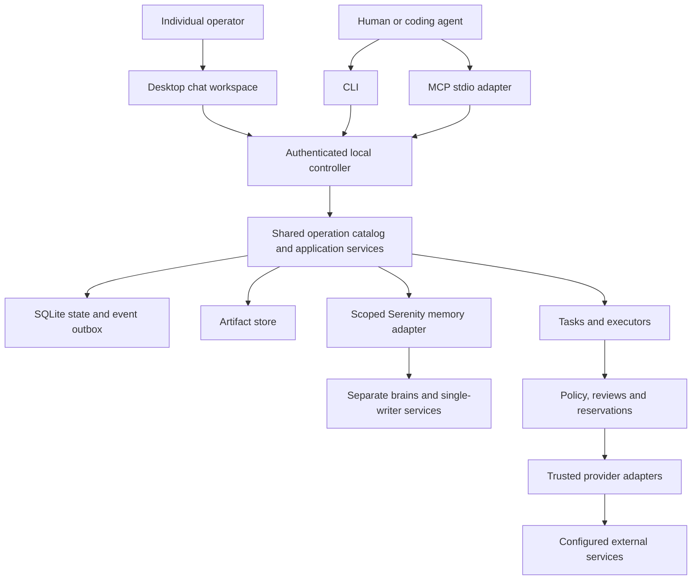

# Implementation assignment: `internal/installation`

Generated specification revision 3; source digest `30eaa5b15e99e3b454a0fc0315010ed50f8d30f00c9d416aa8f62476e73a1066`. This file is committed implementation context. Do not independently edit it. Everything required from the product specification and adjacent interfaces is embedded below; no RFC copy is required.

## Mission and scope

Own bootstrap, installation restriction/maintenance state, health, encrypted backup and paused restore jobs.

Write scope: **`internal/installation/` only**, excluding this generated AGENTS.md. Go package name: `installation`. Ownership kind: domain; integration wave: 2.

Allowed production imports from this repository: `github.com/zatiti/zatiti/internal/contract`. Tests may use interfaces/fakes defined locally and, once available, storage-backed temporary fixtures; integration owns cross-package tests. No sibling raw SQL. No root dependency edits except the integration exception stated in its own brief.

## Implementation decisions and acceptance focus

Own installation_state/jobs/manifests/recovery_obligations. Initialize only local OS-authorized uninitialized destination under exclusive lock. Trusted helper creates owner secret outside transaction, then one bootstrap transaction initializes identity + root organization/chief + distinct memory brains + pinned conversation and evidence. Handle crash between helper and transaction with opaque pending bootstrap intent and recover/cleanup without exporting token; refuse reinitialization. Init selects secure store and creates metadata only, no paid model until configured. Bootstrap MCP mode ends after success and cannot become admin session. Maintenance/pause is immediate acknowledged restriction; drains/fences owned work, preserve unknown effects. Backup IO obtains SQLite consistent backup plus pinned artifact manifest/brain revisions at quiesced boundary, encrypts and verifies whole bundle before completed. The consistent backup bytes come ONLY from the contract.DatabaseBackup capability supplied by entrypoint assembly: expose type Option func(*Service); WithDatabaseBackup(contract.DatabaseBackup) Option; New(contract.Dependencies, ...Option) (*Service,error). This package receives no contract.Database, Reader or file path and must not type-assert the capability to a wider interface. Call Backup only in LocalIO.Perform, never inside a Unit, streaming through a hashing/counting writer into Blobs.Stage so database_digest and database_size describe exactly the staged bytes; the same call before a restore produces RecoveryOverlay.source_database_digest. Without the option, installation.backup and installation.restore return prerequisite_missing naming the database backup capability and never fabricate a digest; init, maintenance, health and doctor work without it, and doctor reports the missing capability. Backups use schema zatiti.backup/v1: installation_id, generation, database_digest, artifact manifest entries, brain revisions, retained command/revocation obligations and opaque key prerequisites. Never include decrypting master keys in same bundle. Restore uploaded reference only, maintenance exclusive ownership, validate integrity/version/keys, starts paused. Preserve both backup and later durable revocation/command/claimed-effect obligations across rewind: before restore export an encrypted current recovery overlay, merge monotonically after restore; fail closed on unresolved conflicts and keep overlay. Reconcile pending effects/memory writes before resume; a database rewind cannot undo providers. Doctor names missing provider/price/profile/Serenity/platform limitations without secrets. Local IO executor handles backup/helper work; no IO in Unit. Revision 3 adds a narrow entrypoint-supplied SnapshotInventory/RestoreCoordinator capability (contract), separate from DatabaseBackup and supplied only to this package the same way: Inventory returns the exact BackupManifest; Prepare validates the source bundle and stages a RecoveryOverlay without a destructive action; Commit atomically switches the database/blobs under exclusive maintenance ownership after the current monotonic overlay (revocations, cancellations, consumed claims, provider dedup keys, unresolved effects/costs, retained evidence) has been captured. Restore starts paused and requires an explicit authorized resume that rechecks prerequisites again; never resurrect a revoked credential, resend a consumed dispatch or erase a liability absent from the older snapshot. Public installation.verifier.list enumerates installed trusted verifier profiles (secret-free) so a task's acceptance contract can name one.

Local proving focus: One-time init parity/lock/crash cleanup, no owner token in result, provider-less chief, backup WAL+artifact consistency/encryption/verify, database digest/size equal to the exact staged backup bytes from a fake DatabaseBackup, Backup failure mid-stream leaves no completed manifest, absent capability yields prerequisite_missing, current revocation overlay survives old backup, paused restore and unresolved provider/memory obligations.

## Incoming and outgoing boundaries

Incoming callers: controller, application (authenticated public operations).

Outgoing owner calls: `_identity.bootstrap`, `_identity.restrict`, `_configuration.snapshot`, `_configuration.bootstrap`, `_policy.check`, `_accounting.settle`, `_accounting.inspect`, `_tasks.transition`, `_effects.pending`, `_effects.prepare`, `_execution.fence`, `_messaging.bootstrap`, `_memory.bootstrap`, `_memory.manifest`, `_artifacts.metadata`, `_artifacts.publish`, `_evidence.snapshot`, `_execution.job.create`, `_execution.job.record`, `_identity.revocations`. Each exact input/output schema appears below. Calls retain current Unit/authority; owner allowlists are mandatory.

Expose `New(contract.Dependencies, ...Option) (*Service,error)`; `*Service` implements `contract.Module` with Name `installation`, owner-prefixed migrations, all owned descriptors, and strict dispatch. No calls/goroutines during construction. Implement optional authentication/LocalIO interfaces where specified in the common contract. Tables are private under `installation_`; external callers rely only on methods and schemas.

### Imported package APIs and behavior

These briefs are embedded so you need not read a sibling prompt to discover its incoming API. Implement only your own package.

## Shared foundation contract

# Frozen implementation contract, revision 3

These decisions complete the product specification and bind every scope. Report contradictions with an affected-dependency list and proposed coordinated revision; do not change another owner's interface locally.

Revision 3 changes, each a coordinated revision that code written against revision 2 must follow. Every new field named below is additive and optional on an existing type: no existing required field changed type, name or was removed, so old persisted rows validate unchanged and remain inspectable with the new field simply absent. New tables (`WorkerTurn`, proposal records) and new operations have no prior callers to break.

- **Durable worker turn.** Execution owns a persisted `WorkerTurn` (see the embedded `WorkerTurn`/`TurnSource` schemas in `internal/execution`'s generated prompt) keyed by unique `(installation_id, source_kind, source_id, source_version, recipient_worker_id)`; re-admission through `_execution.turn.admit` returns the same turn. A pending inbox message and its turn admission/processed marker (`_messaging.processed`) commit in one shared transaction. A message arriving during an active turn is admitted as a safe-boundary injection durably linked to that turn, never silently dropped or processed twice. One active decision stream exists per worker/task lane; different eligible workers may run concurrently within aggregate limits. Each model step/proposal is stored separately as a `ProposalRecord` keyed by unique `(turn_id, step_index, proposal_id)`; the same key with different bytes is `submission_conflict`.
- **Worker turn pipeline operations.** `_execution.work.pending`/`.claim`, `_execution.context.prepare`/`.commit`, `_execution.proposal.prepare`/`.record`, `_execution.report`, `_execution.verification.pending`/`.claim`, `_tasks.evidence.record`, `_tasks.dependencies.wake`, `_messaging.ready`/`.processed` are new internal operations driving the durable worker loop end to end (admit → claim work → prepare/commit context → dispatch a model or tool effect → record the proposal → report → independently verify). Public `task.start` transitions an eligible draft/ready task to ready and enqueues its run in the same transaction; `task.create`/`task.assign` are unchanged. Exact schemas, callers and behavior are embedded in the generated prompts of `internal/execution`, `internal/tasks` and `internal/messaging`.
- **Worker operation executor.** A narrow `contract.WorkerOperator` capability (declared below) lets a worker-authored local proposal invoke an ordinary public operation under the worker's own authenticated actor, scope-intersected with the task/source authorization envelope. It resolves the actor from the persisted turn/worker mapping; `WorkerID` is an asserted match against that turn, never a way to select any principal. Local model-visible operations are an explicit allowlist (authorized configuration authoring/inspection, task/delegation/responsibility actions, approved memory/messaging operations, output publication); grant/policy changes, secrets, internal bookkeeping and human review never become available merely because they exist in the public catalog. The controller's administrative identity authorizes scheduling/bookkeeping only, never a model proposal. **Public/internal caller fix:** `task.assign` is a public operation and carries no caller allowlist (the registry rejects a public descriptor with callers — confirmed 2026-09-18 descriptor-drift finding in docs/roadmap.md); a chief-driven assignment is an ordinary authenticated `task.assign` call made through this executor under the requesting worker's own actor, not a domain-internal caller path.
- **Effects callback routing.** `Operation` gains optional `attempts` (`{attempt_id, generation}` pairs, additive alongside the unchanged `attempt_ids`) and optional `callback_route`; `Dispatch` gains the matching optional `callback_route`. `_effects.prepare` accepts an optional `callback_route` (`CallbackRoute`: `worker_turn`/`job`/`memory`/`skill`/`connection` plus the relevant turn/step/job id) persisted alongside the action and returned at claim. The controller resolves callback routing from this persisted route; it never infers routing by inserting an undeclared `attempt_id` into strict adapter parameters (fixes audit finding G05). `_effects.record` gains an optional `current_generation` for the successor-generation rule: a stray attempt is `not_sent` if never actually claimed under its recorded generation, `outcome_unknown` if claimed but unconfirmed — never silently dropped.
- **Effects reconciliation reaches `Adapter.Reconcile`.** New `_effects.reconciliation.prepare`/`.record` create a separately admitted, separately authorized and accounted bounded reconciliation read distinct from the original write, merging the qualified observation into the original operation's uncertainty without overwriting history or replaying the original action (fixes audit finding G13).
- **Job registry linkage.** `_execution.job.create` gains an optional `operation_id`, linking a network-backed job to its originating effects `Operation` at creation so reconciliation resolves it without scanning another owner's table; a job without `operation_id` is an ordinary local runner. New `_skills.evaluation.record` and `_configuration.export.prepare`/`.record` route skill evaluation and configuration export/import through this durable job ledger instead of handler-local ID minting with no owner-backed lookup (fixes audit findings G11, G12).
- **Registry lookup and schema normalization (already implemented; confirmed for revision 3).** `Lookup(id, 0)` resolves the highest registered version for that operation id. The registry accepts either a bare `$defs`-relative schema or a fully self-contained document at registration, and `Lookup` always returns a self-contained document pruned to reachable `$defs`. These two rules were implemented and tested against application's assumptions before this revision; this entry is their authored record (docs/roadmap.md, 2026-09-18).
- **CLI root tokens (clarification, no schema change).** `Descriptor.CLI` is the subcommand path only and excludes the binary name; `cmd/zatiti` prepends `zatiti` once at command-tree assembly. Generated `AGENTS.md` prose shows the full invocation (for example "CLI `zatiti artifact export`") for readability — that rendering convenience is not part of the wire contract, and an implementer must not treat the printed binary name as part of `Descriptor.CLI` (this ambiguity produced a wrong descriptor token shape in 11 modules; docs/roadmap.md, 2026-09-18).
- **Service-principal bootstrap.** `_identity.bootstrap` gains optional `service_credential_id`/`service_store_ref` so the bootstrap-created controller service principal can receive a credential in the same transaction, letting an out-of-process controller authenticate; omitted fields leave the service principal credential-less for the in-process explicit-`Actor` seam, unchanged from revision 2.
- **Review eligibility (ruling, confirmed for revision 3).** The eligible reviewer of an exact review-class request is the human principal whose current authority admitted that request; services, workers and agents are never eligible, and proposer separation stays mandatory for them. This settles "an eligible owner's decision" left undefined in revision 2's policy/reviews briefs (docs/roadmap.md, 2026-09-18 evening REVISION-3 RULING).
- **Internal authority checks (ruling, confirmed for revision 3).** `_identity.authority`, like every internal operation, is gated by its caller allowlist and by the calling actor being a registered, unrevoked principal in the transaction's installation — never by requiring the calling actor to independently hold the capability named in its own request. A standing grant of `_identity.authority` to work around a circular subject-capability check is unnecessary and must not be relied upon (docs/roadmap.md, 2026-09-19 REVISION-3 RULING). Whether an actor may read another principal's authority is an explicit code-level decision this ruling does not settle; downstream implementers must document it in place rather than infer it.
- **Artifact locator staging (confirmed unchanged).** `PhysicalCallEvidence.request_context` and `ModelOutput.request_context` remain the revision-2 `ArtifactLocator` retype; revision 3 makes no further change here and extends the same staged/artifact pattern to `_execution.context.commit`'s `staged_context`.
- **Responses `prepare_session`/`model_step` split.** See "OpenAI Responses session preparation" below.
- **Small query/result additions.** `conversation.get`/`.list` return the calling principal's optional `caller_unread_count`/`caller_last_read_marker`; new public `conversation.message.list` reads authorized message history for one conversation. New public `memory.list` lists authorized scoped claim refs (source/freshness/lineage/supported actions) without performing paid retrieval. `Artifact` gains optional `source_operation_id`/`purpose` (provenance). `Status` gains optional `runtime_ready`. `Responsibility` gains optional `last_cycle_id`, and `_scheduling.cycle.record` gains a required `cycle_id` replay/conflict fence plus optional `turn_id` linkage. New public `installation.verifier.list` enumerates installed trusted verifier profiles (secret-free) so a task's acceptance contract can name one. `event.list`'s drained-cursor/filter/scope/principal/retention behavior is unchanged; this is its explicit revision-3 confirmation, not a schema change. Public task/turn status projection and installed-capability desktop surfacing are explicitly deferred to `internal/evidence` (P34) and `apps/desktop` (P42) rather than invented here.
- **Local decision tools pinned separately from provider tools.** `ReplyProposal`, `ClarifyProposal`, `ReportOutputsProposal` and `CycleDecisionProposal` (schemas below) are the sealed names/inputs for the context builder's non-provider decision tools (`reply`, `clarify`, `report_outputs`, `cycle_decision`). They are execution-local proposals evaluated by the worker operation executor, never routed through a `connections.Tool`/adapter and never given a provider operation mapping; a final text answer alone may complete a chat turn but never implicitly fulfills a task's required outputs.
- Desktop client (ADR 002): the desktop is a Flutter application at `apps/desktop` that is a direct wire client of internal/server. The Go roots `internal/desktop` and `cmd/zatiti-desktop` are retired; no Go package may import or stand in for the desktop.
- Adapter request context: `PhysicalCallEvidence.request_context` and `ModelOutput.request_context` are an `ArtifactLocator`, not a bare `ArtifactRef`. Adapters return the staged variant; the controller publishes it and substitutes the artifact variant in normalized evidence.
- **MCP client connection adapter (coordinated revision 2026-09-24, dec-1256).** New ownership root `internal/adapters/mcpclient` (adapter name `mcp`, provider `mcp`), the fifth adapter beside responses/github/httpread/serenity, with frozen `MCPClientProfile`/`MCPClientParameters`/`MCPClientEvidence` schemas in `docs/implementation/adapter-schemas.json`; new public `connection.discover` and `connection.tools` and internal `_connections.discovery.record` on `internal/connections`, plus the `MCPDiscoveredTool` DTO. Additive: no existing type, operation or table changes. Section below.
- Installation database seam: `contract.DatabaseBackup` is a one-method capability that entrypoint assembly supplies only to internal/installation through `installation.WithDatabaseBackup`. `contract.Dependencies` is unchanged and no domain gains general database access.

## Build and dependency decisions

Module `github.com/zatiti/zatiti`; language `go 1.26.0`; initial toolchain `go1.26.2`. Integration owns go.mod/go.sum. The Flutter desktop pins its own Flutter/Dart SDK and plugins in `apps/desktop/pubspec.lock`; integration records those pins and licenses in the same lock report and the Go module never depends on them. Domains import standard library and internal/contract, not sibling domains. Application composes owner methods through a checked in-process dispatcher: ordinary Go calls, not another server or scheduler.

Library families: Cobra CLI; official MCP Go SDK, handwritten adapter for MCP `2025-11-25`; Flutter (Dart) desktop application at `apps/desktop` with an operating-system secure-storage plugin, outside the Go module; modernc.org/sqlite. Mint is optional build-time tooling and cannot weaken contracts. Hosted provider v1: a specifically qualified OpenAI Responses endpoint/profile, with configured model and prices. Other compatible endpoints remain unavailable until qualified. GitHub uses documented REST over net/http, with mutation retries disabled. Serenity is a separate pinned service using public interfaces only. Integration must resolve exact dependency releases/commits, checksums, licenses and qualification commands in a lock report BEFORE dispatching dependent implementation. These are selected implementation families, not claims that upstream behavior has been qualified. No agent independently substitutes libraries, models, prices, accounts or Serenity APIs. Dependency resolution/qualification is an explicit foundation assignment.

## Shared Go declarations

The contract owner implements these exact declarations. Omitted function bodies are the implementation assignment, not production stubs. Public JSON uses snake_case. Schema-derived DTO names concatenate operation path segments in PascalCase plus Input/Output and live in the owning package. JSON integer => int64, UUID => contract.ID, timestamp => time.Time, optional scalar => pointer, array => slice, explicitly open JSON => json.RawMessage. Unknown fields are rejected.

```go
package contract
import (
    "context"
    "database/sql"
    "encoding/json"
    "io"
    "net/http"
    "time"
)
type ID string
type Digest string
type Version int64
type Clock interface { Now() time.Time }
type IDSource interface { New() ID }
type Scope struct {
    InstallationID ID `json:"installation_id"`
    OrganizationID ID `json:"organization_id,omitempty"`
    ProjectID ID `json:"project_id,omitempty"`
    WorkerID ID `json:"worker_id,omitempty"`
    TaskID ID `json:"task_id,omitempty"`
}
type Actor struct {
    PrincipalID ID `json:"principal_id"`
    Kind string `json:"kind"` // human | client_agent | worker | service
    CredentialID ID `json:"credential_id"`
}
type Request struct {
    Schema string `json:"schema"` // zatiti.request/v1
    SubmissionKey string `json:"submission_key,omitempty"`
    Input json.RawMessage `json:"input"`
}
type Fault struct {
    Code string `json:"code"`
    Message string `json:"message"`
    Retryable bool `json:"retryable"`
    Details json.RawMessage `json:"details,omitempty"`
}
func (*Fault) Error() string
type Outcome[T any] struct { Status string; Data T; NextCursor *string }
type Payload struct {
    Status string `json:"status"` // completed | accepted | failed
    Data json.RawMessage `json:"data"`
    Error *Fault `json:"error"`
    NextCursor *string `json:"next_cursor"`
}
type Result struct {
    Schema string `json:"schema"` // zatiti.result/v1
    CommandID ID `json:"command_id"`
    Payload
}
type Invocation struct { Operation string; Version int64; Input json.RawMessage }
type Event struct {
    ID ID `json:"id"`
    Sequence int64 `json:"sequence"`
    At time.Time `json:"at"`
    Scope Scope `json:"scope"`
    Kind string `json:"kind"` // owner.entity.transition
    ResourceID ID `json:"resource_id"`
    ResourceVersion Version `json:"resource_version"`
    Data json.RawMessage `json:"data"`
}
type Reader interface {
    QueryContext(context.Context, string, ...any) (*sql.Rows, error)
    QueryRowContext(context.Context, string, ...any) *sql.Row
}
type Unit interface {
    Reader
    ExecContext(context.Context, string, ...any) (sql.Result, error)
    Actor() Actor
    Scope() Scope
    Generation() int64
    ReadOnly() bool
    Emit(context.Context, Event) error
}
type Ownership interface { Held() bool; Lost() <-chan struct{}; Close() error }
type Database interface {
    StartGeneration(context.Context) (int64, error)
    Generation(context.Context) (int64, error)
    Read(context.Context, Actor, Scope, func(Unit) error) error
    Write(context.Context, Actor, Scope, func(Unit) error) error
    Migrate(context.Context, []Migration) error
    Events(context.Context, int64, int) ([]Event, error)
    Backup(context.Context, io.Writer) error
    Close() error
}
type Migration struct { Owner string; Version int64; SQL string; SHA256 Digest }
type Descriptor struct {
    ID string; Version int64; Owner string
    Visibility string // public | internal
    Mode string // query | mutation
    Effect string // local | disclosure | external_read | external_mutation
    InputSchema json.RawMessage; OutputSchema json.RawMessage; CompletionSchema json.RawMessage
    CLI []string; MCP string; ScopeRequired []string; Callers []string
    ExpectedVersion bool; SubmissionKey bool
}
type Handler func(context.Context, Unit, Invocation) (Payload, error)
type Module interface {
    Name() string
    Migrations() []Migration
    Descriptors() []Descriptor
    Handle(context.Context, Unit, Invocation) (Payload, error)
}
type Ports interface { Call(context.Context, Unit, Invocation) (Payload, error) }
type SecretStore interface {
    Put(context.Context, string, []byte) (string, error)
    Get(context.Context, string) ([]byte, error)
    Delete(context.Context, string) error
}
type BlobStore interface {
    Stage(context.Context, io.Reader, int64) (string, Digest, int64, error)
    Publish(context.Context, string, Digest) error
    Open(context.Context, Digest, int64, int64) (io.ReadCloser, error)
    RemoveStaged(context.Context, string) error
}
type Dependencies struct {
    Clock Clock; IDs IDSource; Ports Ports
    Secrets SecretStore; Blobs BlobStore
}
// Every domain owner: New(Dependencies) (*Service, error).
// *Service implements Module. Only declared outgoing ports may be used.
// Sole exception: installation's New also takes options (see DatabaseBackup).
type Dispatch struct {
    OperationID ID `json:"operation_id"`
    AttemptID ID `json:"attempt_id"`
    Generation int64 `json:"generation"`
    Adapter string `json:"adapter"`
    Action json.RawMessage `json:"action"`
    CredentialRef string `json:"credential_ref"`
    ProviderKey string `json:"provider_key,omitempty"`
    Deadline time.Time `json:"deadline"`
}
type Observation struct {
    Disposition string `json:"disposition"` // succeeded | failed | accepted | unknown | not_sent
    ProviderReference string `json:"provider_reference,omitempty"`
    Evidence json.RawMessage `json:"evidence"`
    Usage json.RawMessage `json:"usage"`
    ConfirmedAt *time.Time `json:"confirmed_at,omitempty"`
}
type Adapter interface {
    Name() string
    Contract() json.RawMessage
    Invoke(context.Context, Dispatch) (Observation, error)
    Reconcile(context.Context, Dispatch) (Observation, error)
}
type AdapterDependencies struct {
    HTTP *http.Client; Secrets SecretStore; Clock Clock; Blobs BlobStore
}
// Every adapter: New(AdapterDependencies, json.RawMessage) (Adapter, error).
// Config is strictly validated, versioned and secret-free.
type Operator interface { Call(context.Context, string, Request) (Result, error) }
type CredentialSource interface { Credential(context.Context) ([]byte, error) }
```

The registry binds concrete input/output DTO types to descriptors and handlers using `Bind[I, O any](descriptor contract.Descriptor, fn func(context.Context, contract.Unit, I) (contract.Outcome[O], error)) (contract.Handler, error)`. JSON decoding is strict and schema validation precedes execution. Internal cross-owner calls use the same schema-checked Invocation boundary to avoid sibling package imports. They retain the same Unit, actor, scope, generation and transaction; cannot mint authority; and are not exposed as public operations.

## Transaction and ownership rules

Each domain owns tables prefixed with its package name and `_`. Schema and migration bodies inside that namespace are package-private; no other package depends on their layout. Storage owns installation generation, migration metadata and `storage_events`. Evidence owns commands/receipts. Migration ordering is explicit in application assembly. All migrations run under exclusive installation ownership before serving. Cross-owner reads and changes use Ports.Call and the embedded internal schemas. Internal operations have a caller allowlist. The dispatcher detects recursive calls. Queries cannot invoke mutation descriptors. Public clients cannot supply Actor or Unit or invoke internal operations.

One controller, one ordered writer, WAL, foreign keys on every connection, synchronous FULL, busy timeout 5 seconds, consistent read snapshots. Database.Write performs ONE transaction callback attempt with no automatic callback retry. Busy exhaustion returns controller_unavailable/retryable. Unit is valid only inside its callback; no goroutines or retained handles. Unit.Emit appends state-correlated evidence to the storage outbox in the same transaction. Delivery is at least once and consumers deduplicate event IDs. No network/model calls, secret-store access, filesystem streaming or subprocess work inside a Unit. Stage bytes or local helper actions outside transactions, then publish metadata or reconciliation intent through owner methods.

Handler errors roll back the entire transaction. Persist a command refusal in a separate short transaction after rollback where necessary, retaining the original request identity. Query command IDs need not be durable. All mutations return durable command IDs; accepted responses must identify inspectable durable work. Output schemas describe Payload.Data, not the result envelope. Never leak SQL, tokens, provider raw responses or private paths through Fault.

Definition creates/updates/archive stage drafts, including schedules, responsibilities, policies and memory bindings. Only configuration.apply activates definitions. It validates owners' candidate slices, seals base revision/dependencies/requirements, and calls internal activate in the same transaction under old authority. Internal activate is admitted only from the compiler during exact plan application, not by a public flag. Public restrictive pause/revoke/cancel commits immediately without compilation or spending. Archive staging may immediately disable new admissions as an explicitly reported restrictive side effect; final removal waits for obligations.

## Effect and execution rules

Admit: current authorization, exact review/preconditions, all budget reservations, attempt/dispatch intent and evidence atomically. Claim: second transaction rechecks generation/restrictions/expiry and consumes the one-use claim. Invoke the adapter outside transactions. Record: third transaction stores observations, costs or retained uncertainty and events. Each physical call, including reconciliation and retries, has a distinct attempt. Reconciliation is an admitted bounded read and links to the original effect; it does not overwrite history. Internal jobs use explicitly provisioned scoped service identities plus current worker/task restrictions.

Once claimed, crash/timeout/cancel/lease expiry/operator acknowledgement/weak not-found cannot prove nonexecution. Preserve outcome_unknown and its reservation until authoritative evidence. Earlier unknown attempts survive later failures. Mutation SDK/HTTP retries are disabled. Even qualified idempotent retries need fresh authorization and physical-attempt evidence. Trusted adapters resolve credential references outside transactions; no public raw secrets or inherited owner credential environment. Fencing external workers blocks Zatiti mutations but cannot prove their processes stopped.

Task success needs independently established acceptance against pinned verifier code/version, sealed inputs and observations. Worker report/exit zero cannot set succeeded. Defaults: one concurrent attempt/worker, four/installation, 30 minutes/attempt, 100 model steps, eight children, delegation depth three, root deadline 24 hours. Configure explicit currency and finite spend limits before paid work. Amounts are int64 micro-units with checked overflow; rational rates use integer numerator/denominator and round reservations upward. Unknown/advisory usage and missing prices are not zero. Children share root and ancestor budgets.

## Wire conventions and limits

UUIDv4 for new identities; stable UUID references thereafter. SHA-256 lowercase hex digests. Versioned canonical JSON sorts keys, rejects duplicate keys/unknown fields, preserves exact integer values and semantic array order; schema-declared sets sort by stable identity. Preserve exact skill bytes. UTC RFC3339Nano timestamps and int64 versions >=1. Patches and snapshots are distinct; explicit delete only. Inert `extensions` alone permits namespaced extra keys. Scope is explicit and every referenced object is revalidated; no implicit global organization.

Default limits: JSON request 1 MiB; chunk 1 MiB decoded; artifact 256 MiB; skill archive 16 MiB compressed, 64 MiB expanded, 4096 entries, depth 32; list 50/max 200; read 1 MiB; redacted log record 8 KiB; event page 100/max 500; upload expiry 24 hours. Narrowing is allowed, increases require authorized configuration. Reject overflow and unsupported bounds.

Mutations require submission_key (1..128 printable ASCII) except one-time init. Bind principal, operation/version and canonical input hash. Retain >=30 days and through unresolved obligations. Replay identical input returns original disposition BEFORE stale-version validation; changed input => submission_conflict. Concurrent duplicates serialize. Recover lost acknowledgements by command lookup, not a new key. Resource updates require expected_version; apply requires base_revision and plan digest. Creation has no existing version. Opaque authenticated cursors bind principal/scope/filter/order/snapshot and expire explicitly with cursor_expired and snapshot_required=true. Event replay cannot silently omit a gap.

HTTP POST `/v1/operations/{operation_id}` uses the common request envelope. Local HTTP runs over a private Unix socket. The Flutter desktop is a direct client of this endpoint: the private Unix socket locally and, for an explicitly configured remote desktop, mutual TLS mapped to current application principals over the same operation contract, never remote MCP. It shares the envelope, fault mapping, limits, submission-key replay and cursor rules with every other client, holds no business logic or database access, and consumes the generated operation catalog rather than any Go package. Completed => HTTP 200; accepted => 202. Failed mapping: invalid_input 400, permission_denied 403, not_found 404, stale_version/submission_conflict/conflict/review_required/outcome_unknown/artifact_fault 409, cursor_expired 410, prerequisite_missing/external_action_required/budget_unavailable/capability_unsupported/verification_failed 422, controller_unavailable 503, internal_error 500. Domain failures always include the result envelope.

CLI completed/accepted => exit 0; invalid_input 2; permission_denied/review_required 3; stale_version/submission_conflict/conflict 4; prerequisite_missing/external_action_required/budget_unavailable/capability_unsupported 5; controller_unavailable/outcome_unknown 6; other failures 1. CLI --json emits one envelope to stdout, diagnostics stderr, no implicit prompts. MCP structuredContent is the full envelope, text is equivalent JSON, failed => isError true, malformed protocol => protocol error. Dot-separated operation IDs map to CLI tokens and `zatiti_` MCP names. Exceptions: installation.init => `zatiti init` / `zatiti_installation_init`; capabilities.list => `zatiti capabilities` / `zatiti_capabilities`. Lifecycle steps are individual tools. Tool input never selects a credential profile or accepts raw secrets/unrestricted server paths.

## Completion policy

Write only within the assigned root. Do not edit this prompt, siblings, shared contracts, root dependencies or external acceptance inputs. Implement exact fake dependencies locally; do not return invented production success for unavailable prerequisites. Use controlled providers, deterministic clocks and synthetic fixtures. Preserve expected/observed results and failure evidence. Package tests prove local properties; actual subprocess parity, crash recovery, desktop and adapter qualification prove integration. Z01-Z21 and first-release journeys on macOS/Linux must pass before a release is claimed.

## Local IO, authentication, jobs and verification seams

These additional declarations are part of the SAME frozen contract package (using imports already shown). Implementing an interface does not permit calling it inside a Unit except where the signature explicitly takes Unit/Reader.

```go
type Authenticator interface {
    Authenticate(context.Context, Reader, []byte) (Actor, error)
    AuthenticateCertificate(context.Context, Reader, Digest) (Actor, error)
}
type IOPlan struct {
    ID ID
    Owner string
    Invocation Invocation
    Actor Actor
    Scope Scope
    Generation int64
    ExpectedVersions map[ID]Version
    Prepared json.RawMessage
}
type IOResult struct { Data json.RawMessage; Fault *Fault }
type LocalIO interface {
    Prepare(context.Context, Unit, Invocation) (IOPlan, error)
    Perform(context.Context, IOPlan) (IOResult, error)
    Finish(context.Context, Unit, IOPlan, IOResult) (Payload, error)
}
// Request is the exact VerificationRequest JSON schema embedded in the prompt.
type Verification struct { Request json.RawMessage }
// Document is the exact VerificationResult schema, including independently
// observed checks, pinned identity, task/attempt and staged artifact handoff.
type VerificationResult struct { Document json.RawMessage }
type Verifier interface {
    Verify(context.Context, Verification) (VerificationResult, error)
}
type VerifierDependencies struct { Clock Clock; Blobs BlobStore }
// DatabaseBackup is a narrow capability, not database access. Database satisfies
// it structurally. Entrypoint assembly supplies it to installation only.
type DatabaseBackup interface { Backup(ctx context.Context, w io.Writer) error }

// Revision 3: worker operation execution and durable job registry. Same
// package, same import set; no new dependency. (Revision 3 also introduces a
// restore capability, but as shipped it is `controller.RestoreLifecycle`,
// declared in internal/controller, not a contract-package type -- see
// "Restore protocol (revision 3)" below.)
type WorkerRequest struct {
    TurnID ID
    ProposalID string
    WorkerID ID
    Scope Scope
    Operation string
    Version Version
    SubmissionKey string
    Input json.RawMessage
}
// WorkerOperator resolves the actor from the persisted turn/worker mapping and
// re-enters ordinary application authorization; WorkerID is an asserted match
// against that turn, never a way to select any principal. Injected only into
// trusted runtime composition (application, given to execution/controller).
type WorkerOperator interface {
    ExecuteWorker(context.Context, WorkerRequest) (Result, error)
}
// JobWork/JobOutcome/LocalJobRunner are the minimal shared job types, kept in
// contract (not controller) to avoid a domain->controller import. Execution owns
// the durable ledger (execution_jobs); owners retain their domain rows and
// receive idempotent typed completion callbacks through JobOutcome.
type JobWork struct {
    ID ID
    Version Version
    Generation int64
    Owner, Operation string
    Scope Scope
    Input json.RawMessage
}
type JobOutcome struct {
    State string
    Result json.RawMessage
    EvidenceIDs []ID
    Requirements []Requirement
}
type LocalJobRunner interface {
    RunJob(context.Context, JobWork) (JobOutcome, error)
}
// Requirement mirrors the shared $defs/Requirement schema (code/message plus
// optional resource_id/challenge_id); embedded here only for the Go signature.
type Requirement struct {
    Code string `json:"code"`
    Message string `json:"message"`
    ResourceID *ID `json:"resource_id,omitempty"`
    ChallengeID *ID `json:"challenge_id,omitempty"`
}
```

### Restore protocol (revision 3)

The six-step offline restore protocol (contract-proposals.md section 7) is split across two owners as shipped, not implemented by a single entrypoint-owned capability supplied to `internal/installation` alone: `internal/installation`'s public `installation.restore` operation performs steps 1-3 without ever touching the live database file, and `internal/controller` performs steps 4-6. `installation.restore` runs the same synchronous LocalIO Prepare/Perform/Finish flow as `installation.backup` (`internal/installation/restore.go`): Prepare requires exclusive maintenance, validates the pinned backup artifact and creates the durable job; Perform (outside any transaction) decrypts and verifies the uploaded bundle's binding, integrity and framed image, then — before any rewind — exports a sealed, published `RecoveryOverlay` document of this installation's CURRENT pre-restore state (source database digest from the `DatabaseBackup` capability, plus the obligations `snapshotObligations` captured at Prepare time from pending effects and unresolved memory writes); Finish registers that overlay artifact and leaves the job `running` with an `external_action_required` requirement naming the verified backup image. `internal/installation` never swaps the SQLite file itself: a domain module cannot replace the live database out from under its own open handle mid-process, so the installation stays merely paused, not yet rewound, once `installation.restore` completes.

That handoff is driven forward by `RestoreLifecycle`, declared in `internal/controller` (`internal/controller/restore.go`) — not `contract.SnapshotInventory`/`contract.RestoreCoordinator` as this section previously described; no such contract-package types exist. `RestoreLifecycle` has two methods: `StageCandidate(ctx context.Context, restoreJobID contract.ID, dir string) (RestoreCandidate, error)` resolves the job's already-verified backup artifact into a locally staged, decrypted candidate database file, and `MergeOverlay(ctx context.Context, u contract.Unit, restoreJobID contract.ID) error` folds the already-captured `RecoveryOverlay` into every owner's own tables monotonically — never resurrecting a revoked credential, resending a consumed dispatch or erasing a liability absent from the older snapshot — inside one transaction. It is a field of `controller.Collaborators` (`RestoreLifecycle RestoreLifecycle`), attached through `Controller.Attach` exactly like `Verifier`/`Operator`/`Blobs`: only entrypoint assembly may supply an implementation, because only it has direct Go access to `internal/installation`'s private bundle/key/overlay code, and the controller itself never decrypts a backup bundle or resolves a secret reference. `cmd/zatiti/restore.go` defines the one production implementation (unexported `restoreLifecycle{}`); `cmd/zatiti/serve.go`'s `superviseController` wires it into `Collaborators.RestoreLifecycle` alongside every other trusted collaborator before `ctl.Attach(collab)`.

Once a job reaches `running`/`external_action_required`, the controller's own tick flow claims it and `runRestore` drives the remaining steps: quiesce admission and drain every other in-flight unit (`drainOrdinary`), stage the candidate image via `RestoreLifecycle.StageCandidate` and hand it to `storage.Restorable.PrepareRestore`/`CommitRestore` for the atomic file-level swap and generation advance (`performSwap`), fold the overlay via `RestoreLifecycle.MergeOverlay` inside the transaction `storage.Restorable.WriteRestoreOverlay` opens on the freshly reopened, still-paused database, then call `storage.Restorable.ResumeAfterRestore` to lift the write gate (`mergeAndResume`), and finally report the durable disposition back to `internal/installation` through its own internal `_installation.restore.record` operation (`failRestore`/`settleRestore`). A controller lifetime that itself performs the swap cannot continue afterward: its `*application.Application` was built over the now-closed pre-restore database handle and there is no seam to repoint it, so `Controller.Run` returns the `ErrRestoreHandoff` sentinel error — not a fault — the instant the swap, overlay merge and storage resume are durable. `cmd/zatiti`'s `runServe` is an outer loop around exactly this signal: on `ErrRestoreHandoff` it calls `reassembleAfterRestoreHandoff` (closes the stale `Application` and database, reopens storage at the same path — which already observes the swap — and calls `Database.StartGeneration` again to fence out the lifetime that just ended) under the SAME held installation lock, then runs again. A crash mid-protocol recovers the same way at the next startup: `recoverRestoreBeforeFence` runs before the ordinary generation fence and drives any journal entry left open forward from its last durable phase, re-checking `storage.Restorable.RestorePaused` rather than trusting the last written phase, so it never repeats an already-committed swap or loses track of one.

Current state, honestly: production's only `RestoreLifecycle` implementation, `cmd/zatiti`'s `restoreLifecycle{}`, fails both methods closed with `contract.CodePrerequisiteMissing` rather than guessing or fabricating success — exactly the fallback `Collaborators.RestoreLifecycle`'s own doc comment designs for. `StageCandidate` fails because no operation, public or internal, exposes a pending restore job's original backup-artifact reference to entrypoint assembly (public `job.get`'s wire projection never carries `Input`; only the controller's own internal `_execution.job.claim` call does, and that result stays in the controller's private journal entry). `MergeOverlay` fails because no owner-defined merge operation yet exists in `internal/effects`, `internal/identity` or `internal/memory` to fold a `RecoveryOverlay`'s obligations into their own tables, and because credential/grant revocation obligations are never captured into the overlay to begin with: `snapshotObligations` (`internal/installation/restore.go`) records only `claimed_effect`/`unknown_effect` and `memory_write` obligation kinds. This is a scoped, tracked gap — new merge operations spanning effects/identity/memory, revocation-obligation capture in `snapshotObligations`, a job-input lookup path for `StageCandidate` — not a defect in what shipped: a restore observed without a working merge/staging path is recorded failed with `prerequisite_missing`, and the database is never touched by an incomplete attempt. A clean destination additionally needs a secure key-transfer/provisioning route; an opaque source secret-store reference alone is not portability. Missing required Serenity export guarantees blocks a full-memory backup claim; an empty `Brains` array must never be reported complete.

Identity Service also implements Authenticator. Application receives this interface explicitly in New; it uses a dedicated read snapshot and never reads identity-owned tables itself. Only the byte-slice credential boundary carries secret authentication material, never Invocation JSON. Zero sensitive buffers after use where practical; no logging. Certificate authentication resolves a preprovisioned credential reference and follows the same current principal/revocation rules.

Artifacts, skills, connections and installation Services also implement LocalIO. The registry detects this interface at assembly and routes ONLY registered local IO operations through Prepare/Perform/Finish: artifact.upload.chunk/finish/cancel/read/export; skill.import; connection.setup.begin/complete/cancel; installation.init/backup/restore. LocalIO handles local bounded files, secure helpers and backup work, never unadmitted provider/model calls. Prepare strictly validates input, versions, identity and authority and records replayable local intent under IOPlan.ID; Perform receives that exact trusted in-memory plan outside transactions, resolves opaque staging/helper references, and returns metadata; Finish rechecks authority/versions/generation and commits result/evidence. IOPlan is never public, accepted from an agent or stored with secrets. Prepared/Data JSON must use the operation's declared schemas plus private owner-local metadata, which no other package reads. No cross-owner business protocol may hide in those private fields. Perform must support safe replay of local staging/publication by plan ID, or preserve an inspectable failed/unknown local obligation. A synchronous read does not return bytes to client until final authorization check. New raw provider writes always use effects, not this interface.

For synchronous local IO mutations, persist command identity plus accepted internal pending disposition at Prepare, then replace pending disposition once at Finish. Concurrent same-key calls join/inspect that same in-progress command and never run duplicate Perform. The controller can recover abandoned local intents using the execution job API. Async backup/export uses the same interface with an inspectable job returned immediately. The artifact.upload.chunk endpoint has a 2 MiB encoded request cap (all other ordinary JSON requests 1 MiB), allowing the specified 1 MiB decoded chunk plus envelope.

Execution owns shared durable jobs (execution_jobs), distinct from runs and physical effects. `_execution.job.create` stores the original owner/operation/input and idempotent source identity; public job.get inspects any authorized job. Controller lists pending jobs, claims generation-bound ownership, invokes the named LocalIO owner outside transactions through its exact plan, and records result/obligation. Network jobs first prepare effects and wait on their recorded outcomes. `_execution.job.record` stores result data matching the originating operation's explicit completion_schema and links actual artifact/operation evidence. Never mark a job succeeded merely because its physical request was accepted.

Tasks calls `_execution.enqueue` with ready pinned task inside the same transaction; execution creates one run for task/version and returns it. `_tasks.ready` also exposes a bounded recovery scan. Execution's verifier constructor is `NewVerifier(contract.VerifierDependencies) (contract.Verifier,error)`. Verify executes outside Unit and returns actual independently established observations under the pinned accepted profile; `_execution.verification.record` rechecks attempt/task/version before changing task state. A forged worker-provided VerificationResult is never accepted through public report. Concrete context/adapter/verification payload schemas are included in relevant prompts.

Administrative effects that have no task use their command/operation ID as an accountable admission root; no fictional worker/task or fabricated task foreign key is required. Accounting skips absent scope dimensions but always reserves installation and present organization ancestors/project limits. Task effects additionally share root_task_id. A profile without enforceable charge bounds cannot claim a hard cap.

Typed handler bindings return `contract.Outcome[O]` so accepted results and page cursors survive typed registration. The frozen Bind signature is `Bind[I, O any](contract.Descriptor, func(context.Context, contract.Unit, I) (contract.Outcome[O], error)) (contract.Handler, error)`. Errors carry Fault and roll back, while accepted/completed status and cursor come from Outcome.

Assembly order: application.NewPorts() returns an unbound *PortRouter; For(owner string) returns an owner-bound contract.Ports without domain calls; construct identity and all other modules with those ports, passing installation.WithDatabaseBackup(backup-only wrapper over the opened Database) to installation.New and to no other constructor; registry.New(modules); application.New(db, registry, identityAuthenticator, clock, ids); router.Bind(app) exactly once; start serving only after Bind. PortRouter exposes `For(string) contract.Ports` and `Bind(*Application) error`, rejects pre-bind invocation, and never allows a domain to change its bound caller identity. Registry also implements Module for its own capabilities methods. Constructor execution must not query peers or start goroutines.

All native BlobStore objects are encrypted at rest (including public-classification content), because Stage has no classification argument. Metadata publication sets encrypted=true; classification separately governs disclosure. Controller records the raw adapter observation and cost disposition durably first, then publishes StagedOutput bytes outside Unit, then commits artifact metadata and normalized owner callbacks through an outbox consumer. Publication failure is a visible artifact obligation and blocks task/job acceptance; it does not erase a confirmed provider observation or authorize resending. The adapter cannot mint artifact IDs: AdapterDependencies carries no IDSource and BlobStore.Stage returns only a staging reference, digest and size. The same handoff covers the request record. Each adapter stages its exact secret-free request before sending and names it in `physical_call.request_context` as a staged ArtifactLocator with a matching StagedOutput of purpose context; the controller publishes it with the other staged bytes, for every disposition including not_sent and unknown, and delivers normalized evidence whose request_context is the artifact variant. The raw recorded observation keeps the staged locator and is never rewritten.

Installation alone needs the bytes of a consistent SQLite backup: BackupManifest requires database_digest/database_size and RecoveryOverlay requires source_database_digest, while Dependencies {Clock, IDs, Ports, Secrets, Blobs} deliberately exposes no database. The seam is the DatabaseBackup capability above and these exact declarations in internal/installation: `type Option func(*Service)`; `func WithDatabaseBackup(contract.DatabaseBackup) Option`; `func New(contract.Dependencies, ...Option) (*Service, error)`. `New(deps)` without options stays valid, so the common domain constructor shape holds. Dependencies gains no field and no other module receives the capability. Entrypoint assembly passes a wrapper value whose method set is exactly Backup and which delegates to the opened contract.Database, never the Database value itself; installation must not type-assert the capability to any wider interface or retain it beyond the Service. Installation calls Backup only from LocalIO.Perform for installation.backup and for the pre-restore recovery overlay, never inside a Unit, streaming through a hashing writer into BlobStore.Stage so database_digest/database_size and source_database_digest describe the exact staged bytes without unbounded buffering or a caller-supplied path. The capability grants no query, write, migration, event-feed or file-path access and is not the restore rewind mechanism. When the option is absent, installation.backup and installation.restore fail prerequisite_missing naming the database backup capability; they never fabricate a digest, and every other installation operation is unaffected.

Entrypoint assembly owns platform.Acquire -> storage.Open -> Migrate -> Database.StartGeneration, exactly once before controller/server admission. Pass the held contract.Ownership into controller.New; controller never acquires a second lock or advances generation again. Ownership.Lost closes when ownership is lost/released; stop admission immediately. Generation is a persisted local-controller fence, not distributed locking. The installation lock is retained until controller shutdown and DB close.

Remote TLS additionally validates the certificate chain and maps the SHA-256 certificate SPKI fingerprint through application.AuthenticateCertificate(ctx,Digest), which delegates to identity Authenticator.AuthenticateCertificate on a read snapshot. Only a verified TLS peer can enter that API; operation input cannot supply the fingerprint. Store certificate fingerprints as identity-owned authentication metadata on an explicitly provisioned credential reference. If a bearer credential is also supplied, its principal must match the verified certificate principal. No self-asserted certificate name, profile name or fingerprint header grants authority.

Every async operation declares completion_schema separately from its immediate Job response. job.get returns that schema as Job.result only when established; pending jobs omit result. Local IO mutations that may be recovered asynchronously accept either their completed resource output or `{job: Job}` in the descriptor output schema. Bootstrap remains synchronous under its exclusive one-time lock. No unspecified job kind may execute: _execution.job.create requires a registered completion_schema or a specifically registered private local-intent recovery contract.

Evidence retains the complete original result envelope for command replay, including fault message/details/retryability and cursor; projections of status/data/error_code must agree with Command.result. `_evidence.command.finish` takes that exact result. A replay cannot reconstruct a different error or lose an accepted job reference. ScopeRequired lists installation_id where input scope is required; resource-specific organization/project/worker conditions are enforced by the owned operation schemas and current referenced-resource validation, never inferred from a profile name.

Descriptor.Callers carries the exact catalog internal caller allowlist into runtime registration; application enforces this metadata rather than inventing it from operation names. Internal metadata remains available to trusted assembly/registry while public capability output contains public operations only. An empty allowlist never authorizes an internal call.

## MCP client connection adapter (coordinated revision 2026-09-24)

Founder ruling dec-1256 (hq `designs/2026-09-23-marketer-org-on-zatiti.md`, row Z-M2): Zatiti gains MCP *client* ability as a generic connection adapter, not a per-server package; RFC 2.4's "arbitrary third-party server execution" and social-publishing exclusions are superseded for this adapter only. Postiz (streamable HTTP, Bearer/`pos_` token, 13 tools) is the first qualified server. This section is the coordinated-revision record; the field-level schemas are frozen in `docs/implementation/adapter-schemas.json` under `adapter_mapping.mcpclient` and embedded in the root's generated prompt.

**Root and names.** Go package `internal/adapters/mcpclient` (specgen name `mcpclient`); the wire adapter name in `Tool.adapter`/`Dispatch.Adapter` and the `Connection.provider` value are both `mcp`. The package identifier `mcp` is already `internal/mcp` (the stdio MCP *server* over the controller client); the two are unrelated and neither imports the other. `cmd/zatiti` registers `mcpclient.New` under `"mcp"` beside the four existing constructors; `tests/qualification` gains the root as an import for executable qualification against a controlled server and, once bound, Postiz.

**Profile (`zatiti.mcp/v1`).** One profile is one server: `transport` is a `kind`-discriminated `oneOf` — `streamable_http` with exactly one `https` `endpoint`, `allow_private_endpoint` (explicit installation authorization for loopback/private/link-local, dial addresses bound after validation exactly as httpread does) and `max_redirects` const 0; `stdio` is frozen in shape (absolute `command`, `args`) but a profile naming it fails `capability_unsupported` at construction until a later coordinated revision qualifies subprocess custody. `protocol_version` const `2025-11-25` (the pinned go-sdk v1.7.0 default; a server negotiating anything else fails `open_session` as `capability_unsupported`). `credential_kind` is `bearer` or `none`; credential-in-path (`/mcp/:apiKey`) and the OAuth authorization-code flow are refused `capability_unsupported` — the first would put the secret in the staged request record and server logs, the second has no frozen token-endpoint shape (see `cmd/zatiti/helper.go`). `allowed_tools` is the server-level allowlist; `tool_call_cost` (`Money`, may be zero) makes every attempt a `bounded_estimate` charge under ordinary accounting; `max_request_bytes`, `max_response_bytes`, `timeout_seconds`, `classifications` (which classifications may be disclosed as arguments) and `capability_evidence` follow the other adapters.

**Destination policy.** The action never carries a URL. The only destination is the profile endpoint, which the `Connection.destinations` and the tool binding's `destinations` must name; `_connections.resolve` checks them as for every adapter. Redirects are refused; a redirect response is a failed attempt with the location recorded, never followed.

**Actions (`zatiti.mcp.action/v1`, `kind`-discriminated).**
- `open_session` — the MCP initialize handshake: `initialize` request then `notifications/initialized`. This is **the one declared exception** to one-request-per-attempt, bounded and recorded: two JSON-RPC messages over exactly two HTTP requests, each listed in `evidence.handshake` with its own `http_status` and `request_sent`; neither carries model-supplied content or causes an external effect. The adapter keeps the SDK `ClientSession` in a bounded in-memory table keyed by an opaque `MCPSessionHandle` returned in evidence; the raw `Mcp-Session-Id` never leaves the adapter. A stateless server (no session id) yields `session_state: stateless`. `connection.validate` for provider `mcp` is this action (`buildValidationAction`), recording server name/version/protocol/capabilities as the observed account/scopes.
- `list_tools` — exactly one `tools/list` request for one page; `next_cursor` is returned, never followed by the adapter. `connection.discover` admits it as a separately authorized `external_read` and its evidence lands through `_connections.discovery.record` (callback route kind `connection`, same as validation), which records name, pinned `input_schema`, `input_schema_digest`, optional `output_schema` and `annotations` per tool into a connections-private table and marks tools absent from a complete catalog as stale. `connection.tools` lists the recorded catalog; it is never a live call.
- `call_tool` — exactly one `tools/call`. The action carries `session_handle`, `tool`, `arguments`, the pinned `input_schema` and its digest, and the `classification` of the arguments. Before any bytes: the tool must be in profile `allowed_tools`, in the connection's recorded discovery with the same digest, and in the calling worker's binding permissions (`_connections.resolve` composes the returned `Tool` from the recorded catalog, so the existing seam returns the concrete pinned schema); arguments validate strictly against that schema (`invalid_input` otherwise); classification must be in profile `classifications`. Effect classification of an MCP tool binding defaults to `external_mutation`; an operator may bind a tool as `external_read` only through the ordinary reviewed binding change — server annotations (`read_only_hint` and friends) are recorded as hints and change nothing.
- `close_session` — one HTTP `DELETE`; a server that does not support termination yields a failed attempt with the status recorded, and the local handle is dropped either way.

**Evidence (`zatiti.mcp.evidence/v1`).** `physical_call` as for every adapter (the staged secret-free request record as `request_context`, headers with the Authorization value excluded); `kind`, `session_handle`, `session_state`, `handshake`, server identity/capabilities, `tools`/`next_cursor` (list), `tool`/`arguments_digest`/`is_error`/`content_summary`/`structured_content_digest` (call), `refused_server_requests`, `usage`, and the tool result staged as one `StagedOutput` of purpose `tool_result` under the action's classification. `resource_link` and embedded-resource content items are recorded as opaque references inside that staged result and never fetched; a fetch is a separate governed read.

**Unsupported features are refusals, never inferred success.** Every server-to-client request (sampling, elicitation, roots, ping) is answered with JSON-RPC method-not-found and named in `refused_server_requests`; the adapter opens no GET listening stream and never calls resources, prompts or tasks. `Reconcile` is `capability_unsupported` for every kind: the protocol has no authoritative call lookup, so a `call_tool` timeout after bytes were sent, a lost response, or a body above `max_response_bytes` (`error_code: response_oversize`) is `outcome_unknown` with its reservation retained until a separately admitted linked operation resolves it. An unknown `session_handle` (restart, expiry, server 404) is `prerequisite_missing` and `not_sent`; execution opens a new session through a new admitted `open_session`, never inside the failed attempt. SDK retries and reconnects are disabled.

**Phase-0 defects (hq `designs/2026-09-23-zatiti-total-migration-gaps.md`, items 1-2) are routed around, not depended on.** The `connection.setup.complete` receipt-key gap (`cmd/zatiti/helper.go`, `internal/connections/localio.go` reading a literal constant as a secret reference) blocks helper-driven credential capture on a real installation; the adapter root's own proving uses a local fake `SecretStore`, and the real-credential path is Z-M3's (Postiz end to end), which depends on Z-M1.2 or on a verified `connection.create` with the opaque reference `SecretStore.Put` actually returns. The Unix-socket-only CLI/MCP surface is unrelated: this adapter is an outbound client dialing the server's `https` endpoint from the controller, not a listener.

## OpenAI Responses session preparation (revision 3)

The checked-in `internal/adapters/responses` adapter created a provider conversation and then called Responses inside one `Invoke`, which is two physical requests behind a contract that specifies exactly one physical call per claimed effect (audit finding G27). Revision 3 freezes the split into two explicit effects, each making one physical call, with a persisted session handle passed between them:

- `prepare_session` — `kind: "prepare_session"` — creates the provider conversation and returns its authoritative handle as `ResponsesEvidence.session_handle` (a stable provider-issued string, never fabricated locally). **Disclosure:** the action carries no model-visible content beyond what an empty conversation creation requires; no `context_artifact` is sent. **Timeout:** a timeout after the request was sent leaves the session unknown, not absent — the caller must not create a second session on an unconfirmed `prepare_session` outcome; it waits for recovery. **Cost:** session creation itself is not billed by the pinned protocol; usage is `unknown`/advisory only if the provider's behavior deviates from that pin. **Unknown outcome:** if session creation may have succeeded but its response was lost, retain the unknown outcome without resending — a fresh `prepare_session` could create a second, unlinked provider conversation.
- `model_step` — `kind: "model_step"` — names the persisted session handle (`ResponsesParameters.session_handle`, required) and sends the model input (`context_artifact`, `max_output_tokens`, `tool_contract_versions`). **Disclosure:** exactly the pinned `context_artifact`; no other model-visible bytes. **Timeout:** a timeout after bytes were sent is `outcome_unknown`; an empty item list is equally consistent with "never ran" and "still running" (the provider documents no conversation search), so nonexecution is never assumed. **Cost:** reserved against the profile's accepted token bound before dispatch; a lookup that finds output but no usage cannot release the worst-case billing liability, so it stays reserved. **Unknown outcome:** preserved exactly as any other adapter unknown — no automatic fresh call, no silent retry.

`ResponsesParameters` is versioned to require `kind` (`prepare_session` | `model_step`) as a discriminator; `model_step` additionally requires `session_handle`. `session_handle` is scoped to the same conversation/context lineage as the turn that created it and is never reused across turns. P13 implements both translations against the pinned protocol; P15 consumes the resolved handle when preparing a `model_step` action; P12/P23 journal and dispatch each effect separately through the callback-routed `_effects.prepare`/`.record` pipeline above, so a lost `prepare_session` acknowledgement and a lost `model_step` acknowledgement are two independently recoverable unknowns, never conflated into one. Exact `ResponsesParameters`/`ResponsesEvidence` field-level schemas are frozen in `docs/implementation/adapter-schemas.json` and embedded in `internal/adapters/responses`'s generated prompt; this section is the coordinated-revision record for why they carry a `kind` discriminator and a `session_handle`, not a description of a new adapter behavior beyond the split itself.

## Local decision tool schemas (revision 3)

`ReplyProposal { text }`, `ClarifyProposal { question }`, `ReportOutputsProposal { bindings: [{name, artifact}] }` and `CycleDecisionProposal { decision: continue|wait|escalate|done, reason, next_wake? }` are frozen in `docs/implementation/operations.json`'s `$defs` (via `tools/specgen/model.py`) as `LocalDecisionTool`, a `oneOf` over the four. They are the sealed names/inputs contract-proposals.md section 4 requires before P16 interprets model output: execution-local proposals the context builder registers as non-provider tool definitions, never routed through a `connections.Tool`/adapter and never given a provider operation mapping. A final `reply` alone may complete a chat turn; it never implicitly fulfills a task's required outputs, which only `report_outputs` (bound through `_tasks.evidence.record`) can do.

## Owned product requirements

### R1-002 (source section 1; primary owner configuration)

| Field | Value |
|---|---|
| Status | Draft; proposed implementation specification |
| Date | 2026-09-07 |
| Repository | [zatiti/zatiti](https://github.com/zatiti/zatiti) |
| License | Apache-2.0 |
| Implementation | Go |
| Interfaces | Desktop application for people; CLI and Model Context Protocol (MCP) for coding agents, with shared product operations |
| Deployment | Single-tenant, operator-controlled installation |

### R1-003 (source section 1; primary owner configuration)

Zatiti gives humans and coding agents a shared system for organizing and operating persistent AI workers. An authorized agent can create organizations, projects, skills, workers, connections, policies, and schedules; assign and delegate tasks; inspect artifacts; and manage recovery through either CLI or MCP. These interfaces operate the same state and use the same permissions.

### R1-004 (source section 1; primary owner configuration)

The primary user is an individual operating a personal agent organization through a chat-first desktop workspace. First launch opens a conversation with a personal chief. The user gives it bounded tasks and ongoing responsibilities, and grows an organization through conversation: "Create marketing and engineering chiefs and have them build their teams." Each new chief heads a child organization; ordinary workers do not require their own organizations. CLI and MCP let external coding agents operate the same product without becoming the human user's required interface.

### R1-005 (source section 1; primary owner configuration)

Organizations describe responsibilities. Workers carry identity and versioned configuration. Tasks describe outcomes. Runs and attempts execute tasks. Deterministic services authorize actions, manage budgets, protect credentials, and record evidence. A worker's assertion is an observation, not proof of completion.

### R1-006 (source section 1; primary owner configuration)

This RFC is a design, not a claim of working software. Go, Apache-2.0, single tenancy, agent operation, and CLI/MCP parity are product requirements. The storage, authentication, operation schemas, and release decomposition below are proposed design choices. Amend this document when those choices change.

### R2.1-002 (source section 2.1; primary owner configuration)

One installation belongs to one operator or team and has one database, credential custody boundary, controller owner, and administrative trust root. It may contain multiple organizations. An organization is a grouping of teams, projects, workers, and configuration; it is not a hosted tenant.

### R2.1-003 (source section 2.1; primary owner configuration)

Organization and project scopes still restrict ordinary principals and workers. Cross-organization references require an explicit binding, and secrets are never globally available by default. These checks protect against accidental or unauthorized application access. They do not promise isolation from the installation administrator, database owner, or another process with unrestricted access to the same operating-system account.

### R2.1-004 (source section 2.1; primary owner configuration)

Organizations form an acyclic parent-child tree rooted in the personal organization. Bootstrap creates that root and its personal-chief identity; paid execution remains unavailable until the operator configures a provider and limits. Creating another organization creates its chief in the same configuration plan. Each active organization has exactly one designated chief, whose replacement preserves the organization's identity, memory, obligations, and history. Workers have one home organization; cross-organization assignments require explicit bindings. Creating an ordinary worker does not create an organization.

### R2.1-005 (source section 2.1; primary owner configuration)

Parent organizations impose permission ceilings and aggregate budget limits on descendants. Child policy can narrow those limits, never expand them. Parent chiefs receive authorized reports from children, not automatic access to every descendant's private memory, credentials, or project data. Moving an organization or worker is an explicit configuration plan that rechecks inherited limits and memory bindings; it cannot silently transfer old private memories or widen the authority of active work.

### R2.1-006 (source section 2.1; primary owner configuration)

There is no tenant routing, tenant signup, tenant billing, or hosted multitenant control plane in v1. Separate installations are the boundary for mutually untrusted operators. Installation IDs prevent accidental mixing of exports, credentials, and checkpoints; they are not tenant IDs in another form.

### R2.3-002 (source section 2.3; primary owner integration)

1. An operator initializes an installation and configures scoped access for an agent.
2. That agent creates an organization, imports a skill, binds a connection, creates workers and a project, validates the resulting configuration, and activates it under current policy.
3. The agent assigns a task with pinned inputs, a resource envelope, and an acceptance contract; it follows runs, artifacts, reviews, costs, and results.
4. A worker delegates bounded child tasks, waits durably, and resumes after controller restart without duplicating protected effects.
5. A human or appropriately authorized principal reviews exact actions; a separate client can inspect or continue the workflow.
6. The installation can pause, export, back up, restore, and reconcile unresolved work through the same operation model.

### R2.3-003 (source section 2.3; primary owner integration)

The first release includes the chat-first desktop application, CLI and local stdio MCP, a complete shared operation catalog, hierarchical organization authoring, personal and organization chiefs, Serenity-backed memory, versioned skills, connection setup, durable execution, scoped policy, earned autonomy, approvals, evidence, and recovery. It includes one qualified hosted model-provider adapter, the cooperative external-worker protocol, bounded HTTP reads, repository artifact workflows, and one qualified GitHub adapter for explicitly authorized repository actions. Provider/model selections are installation inputs, not hardcoded personal accounts or model aliases.

### R2.3-004 (source section 2.3; primary owner integration)

Initial distribution targets macOS and Linux. Windows is a later qualification target. No advertised platform or agent-client compatibility is established solely by code compiling.

### R3-002 (source section 3; primary owner storage)

Ship a `zatiti` Go controller/CLI binary with CLI commands, `serve`, and `mcp serve`, plus a desktop client and a pinned Serenity integration. One always-on controller owns scheduling, admission, persistence, credential access, and recovery. It may run on the user's computer or an operator-controlled server; ongoing work requires that host to remain available. Closing the desktop client does not stop the controller. Optional local execution workers connect to that same owner; moving work between controllers is not a v1 feature.

### R3-003 (source section 3; primary owner storage)

Desktop, CLI, and MCP are clients of the controller's application services. MCP processes do not start separate schedulers or write the database directly. Local clients use a private Unix-domain socket; a remote desktop connection uses an explicitly configured authenticated TLS endpoint over the same versioned operation contract. Credentials remain in secure client storage and are not supplied as model-visible arguments. Reconnection reads snapshots and replayable events, and retries commands with their original submission keys. A disconnected desktop can display cached history and retain unsent drafts, but cannot claim a command, approval, or pause reached the controller until acknowledged.

### R3-004 (source section 3; primary owner storage)

The controller publishes a versioned API contract; a pinned Mint generation step may turn that contract into the MCP server shipped with Zatiti. Mint is a build-time adapter, not a second source of domain behavior. Serenity has a separate canonical memory store and one writer owner per brain; this revises the original single-binary-only deployment proposal. Its process packaging and lifecycle must be qualified with the desktop/controller distribution.

### R3-005 (source section 3; primary owner storage)



### R3-006 (source section 3; primary owner storage)

| Area | Proposed implementation |
|---|---|
| Language | Supported stable Go toolchain, pinned in `go.mod` and CI |
| CLI | Cobra for command structure; generated operation commands over shared schemas |
| MCP | Generated from the versioned API contract with Mint, pinned and tested against the supported MCP protocol; explicit protocol and parity tests |
| Client transport | Versioned HTTP/JSON over a private Unix-domain socket locally; authenticated TLS for explicitly configured remote desktop access |
| State | SQLite in WAL mode, foreign keys enabled, bounded busy timeout, short explicit transactions; a pinned Go SQLite driver |
| Artifacts | Content-addressed local files; encrypted sensitive content and integrity-checked metadata |
| Credentials | OS secret store or explicitly provisioned headless secret source; encrypted database values reference an external master key |
| Logs | Structured `slog` on stderr or protected files; bounded, redacted fields |
| Tests | Go unit/integration suites, deterministic clocks and provider simulators, subprocess CLI/MCP conformance tests |

### R3-007 (source section 3; primary owner storage)

SQLite is selected to make a single-tenant installation usable without a database service. There is one controller writer and no shared network-filesystem database. An exclusive installation lock prevents a second controller from serving the same state directory. Startup advances a persisted controller generation; workers, dispatch claims, and leases bind that generation. Losing installation ownership stops admission. The supported deployment relies on local OS lock semantics; distributed fencing is not claimed.

### R3-008 (source section 3; primary owner storage)

The controller uses a single ordered write path with transaction-aware domain methods. Reads use consistent snapshots. No network or model call runs inside a retryable database transaction. State changes and their event/outbox entries commit together. Crash recovery reads durable state, not log text. Database contention returns a bounded retryable error rather than hanging a client indefinitely.

### R3-009 (source section 3; primary owner storage)

The database owns principals, grants, revisions, tasks, schedules, runs, attempts, operations, approvals, reservations, commands, events, artifact metadata, and recovery obligations. Definition JSON is canonicalized before hashing. Query projections are not a second hashing authority. Files are staged and hashed before metadata publication; unreferenced staging content is reclaimed later. A committed reference whose bytes are unavailable produces a visible artifact fault, never a successful result.

### R5-002 (source section 5; primary owner identity)

Bootstrap establishes a local owner under explicit OS-level installation access. `installation.init` is available through both interfaces before normal authentication exists, but only in a one-time local bootstrap mode. `zatiti init` and `zatiti mcp serve --bootstrap` use the same initializer. Bootstrap checks the destination is uninitialized, acquires exclusive ownership, creates owner credentials in the selected secure store, and returns metadata only. It refuses reinitialization; it never exports an owner token into model context. Bootstrap mode ends after successful initialization and cannot be used as an alternate administration session.

### R5-003 (source section 5; primary owner identity)

Normal CLI and MCP sessions select an explicitly provisioned local credential profile. The controller authenticates its credential and resolves a principal; a profile name, tool argument, MCP client name, socket access, or OS username alone does not establish application authority. MCP tool arguments cannot select a more privileged profile. Subprocesses do not receive the owner's credential environment by default. Same-user processes with access to the secure store remain within the OS trust boundary described in section 2.

### R5-004 (source section 5; primary owner identity)

An owner can delegate administration of named organizations, projects, workers, skills, and connections to a client-agent principal. This permits an agent to create and activate ordinary configuration within that existing envelope without a human confirming every edit. Requests outside the envelope produce a precise review or denial. Authority is evaluated using current grants and policy, never the proposed replacement policy.

### R5-005 (source section 5; primary owner identity)

Permissions intersect principal scope, project/organization binding, worker/task scope where applicable, policy, active restrictions, resource availability, and required review. Delegation only narrows tool access, destinations, deadlines, and shared budgets. Explicit denials win. Unknown required conditions refuse admission. Worker self-modification and imported skill text cannot install grants.

### R5-006 (source section 5; primary owner identity)

Policy supports standing authorized classes and exact-review classes. Default external publication, outbound messages, merges, deployment, credential-account substitution, and permission expansion require an eligible owner's decision unless the owner has explicitly established a narrower standing policy for that class. New policy is applied under old authority. Enabling automation, including an earned-autonomy promotion rule, is an explicit administrative act, not a competence score or model assertion.

### R5-007 (source section 5; primary owner identity)

Workers and chiefs start with minimum permissions. The product supports increasing autonomy up to the operator's explicitly authorized ceilings. Chiefs propose promotions using recorded outcomes; deterministic rules evaluate independently established evidence against operator-approved requirements before activating a narrowly scoped grant. Without an applicable promotion rule, expansion requires the eligible owner's decision. No worker can approve its own evidence, rewrite its qualification criteria, or enlarge the ceiling that permits promotion.

### R5-008 (source section 5; primary owner identity)

Qualifications bind capability, destination/scope, worker identity, relevant model/tool/skill versions, evidence window, and the promotion-rule version. Success in one capability does not grant unrelated powers. Relevant configuration changes trigger requalification; specified failures or incidents automatically restrict or demote the affected grant before further admission. Promotion and demotion produce durable events and user-visible explanations. Mandatory human-review classes remain mandatory unless the owner explicitly changes their governing policy under existing authority.

### R5-009 (source section 5; primary owner identity)

Reviews declare whether a human is required. The same `review.decide` operation exists in CLI and MCP; both enforce principal kind, eligibility, current version, action digest, expiry, and optional separation of proposer and reviewer. An agent credential cannot satisfy a human-required review, even if it sends `approved_by_human: true` or runs the CLI instead. A human session can use either transport. V1 does not claim a model invocation through a human-authorized process proves physical human presence; installation owners are responsible for credential delegation.

### R5-010 (source section 5; primary owner identity)

Pause, revoke, and cancel commit restrictive state immediately under authorized access, without a model call, configuration compilation, or spend reservation. Resume and expansion use normal authorization. A pause prevents future admissions; it cannot retract a request already transmitted or terminate an uncooperative external process by assertion.

### R8.4-002 (source section 8.4; primary owner contract)

```json
{
  "schema": "zatiti.result/v1",
  "command_id": "00000000-0000-4000-8000-000000000001",
  "status": "completed",
  "data": {"draft_id": "00000000-0000-4000-8000-000000000002", "version": 1},
  "error": null,
  "next_cursor": null
}
```

### R8.4-003 (source section 8.4; primary owner contract)

`status` is `completed`, `accepted`, or `failed`. Completion of a command such as task creation or approval is not completion of the task or external effect it refers to. Data carries resource IDs, actual lifecycle state, versions, relevant artifact/event references and next actions. Accepted long operations include an inspectable task/job reference. Stable error codes include `invalid_input`, `not_found`, `permission_denied`, `stale_version`, `review_required`, `prerequisite_missing`, `external_action_required`, `budget_unavailable`, `capability_unsupported`, `controller_unavailable`, and `outcome_unknown`.

### R8.4-004 (source section 8.4; primary owner contract)

CLI exits are 0 for completed/accepted commands, 2 for input errors, 3 for denied/review-required access, 4 for stale/conflicting state, 5 for missing prerequisites or unsupported capability, 6 for unavailable/unknown outcomes, and 1 for other failures. Machine clients inspect the envelope as well as the exit code. A pending task is not a CLI failure. An unknown external outcome is not a successful write.

### R8.4-005 (source section 8.4; primary owner contract)

Mutating requests require a caller-generated submission key except during initial bootstrap, where the uninitialized installation lock supplies uniqueness. The controller binds keys to principal, operation ID/version and canonical request hash. Reuse with identical input returns the original durable command disposition; changed input refuses. A lost acknowledgement is recovered through command lookup, not a new key. Keep keys at least 30 days and through all unresolved obligations. MCP JSON-RPC request IDs are not submission keys.

### R8.4-006 (source section 8.4; primary owner contract)

Resource changes require an expected version or base revision. Pagination uses stable opaque cursors and bounded page sizes; list/get/event operations return the same scope and freshness in both transports. MCP resources and CLI watch are optional presentation conveniences over replayable event reads. Clients encountering an expired event cursor fetch a new snapshot and resume; no silent gap is presented as complete history.

### R8.4-007 (source section 8.4; primary owner contract)

Large content uses bounded chunk upload and byte-range read operations in both interfaces. The client chooses local file locations; MCP never accepts an unrestricted server filesystem path. Backup creation returns an opaque backup artifact, and restore consumes an uploaded backup reference in a quiesced maintenance mode. The same local owner operation can enter maintenance through CLI or MCP; it does not require a transport-specific admin endpoint.

### R8.4-008 (source section 8.4; primary owner contract)

Starting/stopping a client process, shell completion, help formatting and MCP protocol negotiation are transport mechanics rather than product operations. Installation initialization, health, credentials, backup and restore remain product operations and require parity. The parity suite enumerates the registry and rejects unmapped operations or unequal authorization, state, error, pagination, or event behavior.

### R11-002 (source section 11; primary owner accounting)

Use exact integer micro-units of an explicit currency and rational rate arithmetic. Reserve enforceable costs atomically across installation, organization, project, worker and root task using a stable lock/update order. Inference, evaluation, retries and delegated tasks share relevant limits. Record spent, reserved, estimated and unknown amounts separately. Missing prices or advisory external usage are not zero cost. Hard caps are claimed only where the selected provider contract bounds charges.

### R11-003 (source section 11; primary owner accounting)

Budgets need finite defaults. Proposed defaults are one concurrent attempt per worker, four per installation, a 30-minute attempt, 100 model steps, eight children, delegation depth three, and a 24-hour root deadline. Installations explicitly select currency and spending limits before paid work; the shipped default refuses paid execution until configured. No fixed provider price is embedded in the RFC.

### R11-004 (source section 11; primary owner accounting)

Commands, configuration revisions, state transitions, decisions, provider observations and artifact digests produce durable evidence. Receipts are projections over these records. Hash integrity is not a claim of an incorruptible log or independent external custody. A host/database administrator is outside the evidence threat model; external signing/anchoring is future work.

### R11-005 (source section 11; primary owner accounting)

Backups use the database's consistent backup mechanism and a pinned artifact manifest; copying a live database file without its consistency requirements is not a backup contract. Encrypt backups, preserve key-recovery prerequisites separately, and verify before advertising completion. Restore acquires exclusive maintenance ownership and starts paused. Preserve unresolved operations, reservations, credentials' revocation state and retained command identities. Reconcile pending dispatches before resuming. A database rewind cannot undo provider effects.

### R11-006 (source section 11; primary owner accounting)

Bound input sizes, archive expansion, log payloads, lists and event replay. Redact credentials before persistence and logging where possible; arbitrary secret recognition is not claimed. Retention never removes unresolved obligations to make the system appear healthy. Disk pressure pauses new artifact-producing work; it does not discard unknown effects. A doctor report names missing prerequisites and current execution/profile limitations without exposing secrets.

### R15-002 (source section 15; primary owner memory)

Serenity supplies accumulated knowledge; Zatiti owns execution state, authorization, acceptance, budgets, and recovery obligations. Use its public interfaces through a pinned adapter, without importing its internal packages or creating a competing canonical memory writer. The integration must qualify the pinned implementation rather than treating upstream documentation as proof of supported behavior.

### R15-003 (source section 15; primary owner memory)

Each worker has an individual brain, each organization has a shared brain, and the installation has a separate brain for deliberately shared cross-organizational knowledge. The personal chief's worker memory, the root organization's shared memory, and installation-wide memory remain distinct scopes even when one chief curates them. Separate brains are logical access boundaries enforced by Zatiti's bindings; they do not isolate data from the installation administrator or unrestricted same-user filesystem access.

### R15-004 (source section 15; primary owner memory)

Memory bindings explicitly name read, write, curate/promote, and retract permissions. Zatiti resolves the caller's current worker, task, project, organization ancestry, and grants before selecting brains to query. Filter before retrieval or model composition, not after unauthorized data has already reached a model. An organization brain contains only knowledge suitable for its authorized readers; restricted project information remains in a narrower bound brain or governed artifact. Parentage alone never grants read access to a child's private knowledge.

### R15-005 (source section 15; primary owner memory)

Organization chiefs automatically curate shared memory within their standing authority: reconcile evidence, retain useful lessons, identify contradictions, and promote suitable knowledge from permitted worker or child-organization sources. The personal chief curates installation-wide memory. Automatic curation is scoped work with budgets and evidence, not permission to read everything. Promotion is a new destination claim linked to source brain, claim/version, supporting artifact references, curator identity, and any redaction. It requires both source disclosure authority and destination write authority. Shared-memory writes that exceed that envelope wait for the appropriate decision.

### R15-006 (source section 15; primary owner memory)

Corrections and retractions propagate through recorded promotion lineage as durable reconciliation obligations. A promoted statement is not independent corroboration of its own source. Revocation blocks subsequent retrieval immediately; it cannot erase already disclosed context. Forget/retract operations distinguish removal from active recall from historical erasure, including copies in Git history, backups, and prior run artifacts. The UI must state that distinction when relevant.

### R15-007 (source section 15; primary owner memory)

The adapter provides memory recall, remember, inspect, promotion, and retraction operations through the shared registry and exposes their supported prerequisites and outcomes equally through CLI and MCP. Desktop memory controls and conversational requests call those same operations. Recalled results retain scope, source references, confidence, relevant versions, and freshness; each run stores the actual selected context as an artifact. Reads across brains are not presumed to be one atomic snapshot. A task requiring unavailable freshness waits or reports a prerequisite failure rather than silently treating stale context as current.

### R15-008 (source section 15; primary owner memory)

Serenity's exported Go read facade may serve compatible reads. Canonical writes go to exactly one writer owner per brain through the supported protocol. Its Recall path may invoke models and record spend: "read" does not imply no disclosure or no charge. Composition, embedding, extraction, and curation must obey Zatiti's provider disclosure rules and reservations; until the adapter can enforce a required bound, that execution mode is unavailable or explicitly advisory where policy permits. Serenity's remembered judgments and plan checks inform work but cannot override Zatiti policy or constitute task acceptance on their own.

### R15-009 (source section 15; primary owner memory)

Zatiti's SQLite transaction cannot atomically commit a Serenity write. Persist a submission intent and adapter command identity before dispatch, record the actual disposition afterward, and reconcile a lost acknowledgment without blindly repeating the write. Backup manifests pin the required brain revisions and key-recovery prerequisites alongside Zatiti state. Restore starts paused and reconciles pending memory writes and promotions before resuming curation. Availability failures remain visible; no failed memory operation is presented as remembered knowledge.

### P00-011 (source section P00; primary owner installation)

A narrow entrypoint-supplied SnapshotInventory/RestoreCoordinator capability, distinct from DatabaseBackup and supplied only to internal/installation the same way, implements the six-step restore protocol: exclusive maintenance and admission closure; source verification including installation binding, schema compatibility and key availability; a captured authenticated current monotonic RecoveryOverlay; atomic database/blob switch without mixing WAL files; reopening with a newer controller generation and an owner-defined monotonic overlay merge that never resurrects a revoked credential, resends a consumed dispatch or erases a liability absent from the older snapshot; and a paused result requiring an explicit authorized resume that rechecks prerequisites again. A missing required Serenity export guarantee blocks a full-memory backup claim; an empty Brains array is never reported complete.

### P00-014 (source section P00; primary owner identity)

_identity.bootstrap accepts optional service_credential_id/service_store_ref so the bootstrap-created controller service principal can receive a credential in the same transaction, letting an out-of-process controller authenticate; an in-process explicit-Actor seam may omit them and remains credential-less as in revision 2. _identity.authority, like every internal operation, is gated by its caller allowlist and by the calling actor being a registered, unrevoked principal in the transaction's installation -- never by requiring that actor to already hold the capability named in its own request; no standing grant of _identity.authority is needed to work around a circular subject-capability check.
## Exact operation and dependency schemas

### `_accounting.inspect` v1 — accounting / internal / query / local

Allowed internal callers: policy, tasks, execution, effects, scheduling, installation. Submission key: not required at this internal/query/bootstrap boundary.

Return current intersected limits and honest usage to admission/doctor.

Input schema:
```json
{"type":"object","additionalProperties":false,"properties":{"scope":{"$ref":"#/$defs/Scope"}},"required":["scope"]}
```
Output data schema:
```json
{"type":"object","additionalProperties":false,"properties":{"limits":{"$ref":"#/$defs/Limits"},"usage":{"$ref":"#/$defs/Usage"}},"required":["limits","usage"]}
```

### `_accounting.settle` v1 — accounting / internal / mutation / local

Allowed internal callers: effects, execution, installation. Submission key: not required at this internal/query/bootstrap boundary.

Settle observed cost or retain unknown reservation; release only proven unused portion and conclusive no-effect/no-cost evidence. Check currency and overflow.

Input schema:
```json
{"type":"object","additionalProperties":false,"properties":{"reservation_id":{"type":"string","format":"uuid"},"expected_version":{"type":"integer","minimum":1,"maximum":9223372036854775807},"usage":{"$ref":"#/$defs/Usage"},"authoritative_nonexecution":{"type":"boolean"}},"required":["reservation_id","expected_version","usage","authoritative_nonexecution"]}
```
Output data schema:
```json
{"type":"object","additionalProperties":false,"properties":{"resource":{"$ref":"#/$defs/Reservation"}},"required":["resource"]}
```

### `_artifacts.metadata` v1 — artifacts / internal / query / local

Allowed internal callers: execution, tasks, effects, memory, messaging, skills, installation. Submission key: not required at this internal/query/bootstrap boundary.

Validate scope, availability and classification of pinned artifacts, by id alone or id-plus-digest, before disclosure or acceptance; a caller with only an id (evidence and acceptance references never carry one) resolves by id, and one that also supplies a digest additionally fences the match against it.

Input schema:
```json
{"type":"object","additionalProperties":false,"properties":{"scope":{"$ref":"#/$defs/Scope"},"artifacts":{"type":"array","items":{"type":"object","additionalProperties":false,"properties":{"id":{"type":"string","format":"uuid"},"digest":{"type":"string","pattern":"^[0-9a-f]{64}$"}},"required":["id"]},"maxItems":4096}},"required":["scope","artifacts"]}
```
Output data schema:
```json
{"type":"object","additionalProperties":false,"properties":{"artifacts":{"type":"array","items":{"$ref":"#/$defs/Artifact"},"maxItems":4096}},"required":["artifacts"]}
```

### `_artifacts.publish` v1 — artifacts / internal / mutation / local

Allowed internal callers: controller, execution, memory, skills, installation. Submission key: not required at this internal/query/bootstrap boundary.

Publish metadata only after trusted IO phase has staged/hashed/published bytes; create visible fault if later bytes unavailable.

Input schema:
```json
{"type":"object","additionalProperties":false,"properties":{"scope":{"$ref":"#/$defs/Scope"},"digest":{"type":"string","pattern":"^[0-9a-f]{64}$"},"size":{"type":"integer","minimum":0,"maximum":9223372036854775807},"media_type":{"type":"string","maxLength":8192},"classification":{"type":"string","enum":["internal","public","restricted"]},"encrypted":{"type":"boolean"}},"required":["scope","digest","size","media_type","classification","encrypted"]}
```
Output data schema:
```json
{"type":"object","additionalProperties":false,"properties":{"resource":{"$ref":"#/$defs/Artifact"}},"required":["resource"]}
```

### `_configuration.bootstrap` v1 — configuration / internal / mutation / local

Allowed internal callers: installation. Submission key: not required at this internal/query/bootstrap boundary.

Atomically initialize root organization/chief with minimal non-executable configuration. Separate worker/org/installation brains provisioned through memory owner.

Input schema:
```json
{"type":"object","additionalProperties":false,"properties":{"installation_id":{"type":"string","format":"uuid"},"owner_id":{"type":"string","format":"uuid"},"organization_id":{"type":"string","format":"uuid"},"chief_id":{"type":"string","format":"uuid"}},"required":["installation_id","owner_id","organization_id","chief_id"]}
```
Output data schema:
```json
{"type":"object","additionalProperties":false,"properties":{"organization":{"$ref":"#/$defs/Organization"},"chief":{"$ref":"#/$defs/Worker"}},"required":["organization","chief"]}
```

### `_configuration.snapshot` v1 — configuration / internal / query / local

Allowed internal callers: application, policy, tasks, execution, effects, memory, reviews, accounting, scheduling, messaging, connections, installation. Submission key: not required at this internal/query/bootstrap boundary.

Read current ancestry, effective bindings, worker/project and revision; no automatic descendant private data access.

Input schema:
```json
{"type":"object","additionalProperties":false,"properties":{"scope":{"$ref":"#/$defs/Scope"}},"required":["scope"]}
```
Output data schema:
```json
{"type":"object","additionalProperties":false,"properties":{"resource":{"$ref":"#/$defs/ScopeSnapshot"}},"required":["resource"]}
```

### `_effects.pending` v1 — effects / internal / query / local

Allowed internal callers: controller, installation. Submission key: not required at this internal/query/bootstrap boundary.

List pending intents/confirmation/reconciliation obligations; claimed attempts after restart become unknown, not ready for resend.

Input schema:
```json
{"type":"object","additionalProperties":false,"properties":{"limit":{"type":"integer","minimum":1,"maximum":100}},"required":["limit"]}
```
Output data schema:
```json
{"type":"object","additionalProperties":false,"properties":{"operations":{"type":"array","items":{"$ref":"#/$defs/Operation"},"maxItems":100}},"required":["operations"]}
```

### `_effects.prepare` v1 — effects / internal / mutation / local

Allowed internal callers: execution, memory, connections, skills, installation. Submission key: not required at this internal/query/bootstrap boundary.

Persist immutable action and logical effect for hosted steps/memory/probes/evaluation; required decisions produce awaiting_review. No physical call here. callback_route is an explicit controller-owned routing reference (worker turn/step or job id), persisted alongside the action and returned at claim; adapters never receive it. The controller resolves callback routing from this persisted route, never by inserting an undeclared attempt_id into strict adapter parameters.

Input schema:
```json
{"type":"object","additionalProperties":false,"properties":{"scope":{"$ref":"#/$defs/Scope"},"action":{"$ref":"#/$defs/Action"},"source_id":{"type":"string","format":"uuid"},"callback_route":{"$ref":"#/$defs/CallbackRoute"}},"required":["scope","action","source_id"]}
```
Output data schema:
```json
{"type":"object","additionalProperties":false,"properties":{"resource":{"$ref":"#/$defs/Operation"}},"required":["resource"]}
```

### `_evidence.snapshot` v1 — evidence / internal / query / local

Allowed internal callers: application, installation, messaging. Submission key: not required at this internal/query/bootstrap boundary.

Get current event checkpoint with consistent scoped read; no private events through cursor position.

Input schema:
```json
{"type":"object","additionalProperties":false,"properties":{"scope":{"$ref":"#/$defs/Scope"}},"required":["scope"]}
```
Output data schema:
```json
{"type":"object","additionalProperties":false,"properties":{"last_sequence":{"type":"integer","minimum":0,"maximum":9223372036854775807}},"required":["last_sequence"]}
```

### `_execution.fence` v1 — execution / internal / mutation / local

Allowed internal callers: controller, installation. Submission key: not required at this internal/query/bootstrap boundary.

Fence old governed leases and record recovery obligations; never assert external processes stopped.

Input schema:
```json
{"type":"object","additionalProperties":false,"properties":{"generation":{"type":"integer","minimum":1,"maximum":9223372036854775807},"reason":{"type":"string","maxLength":8192}},"required":["generation","reason"]}
```
Output data schema:
```json
{"type":"object","additionalProperties":false,"properties":{"attempt_ids":{"type":"array","items":{"type":"string","format":"uuid"},"maxItems":4096}},"required":["attempt_ids"]}
```

### `_execution.job.create` v1 — execution / internal / mutation / local

Allowed internal callers: configuration, skills, connections, memory, artifacts, installation, execution, effects, application. Submission key: not required at this internal/query/bootstrap boundary.

Validate owner/operation against catalog and original input schema; deduplicate source identity with canonical input hash. No arbitrary executable jobs. Optional operation_id links a network-backed job to its originating effects Operation at creation, so reconciliation resolves it without scanning another owner's table; a job without operation_id is an ordinary local runner.

Input schema:
```json
{"type":"object","additionalProperties":false,"properties":{"scope":{"$ref":"#/$defs/Scope"},"owner":{"type":"string","maxLength":8192},"operation":{"type":"string","maxLength":8192},"input":{"type":"object","description":"Inert JSON data bounded by the enclosing size limit; never executable authority."},"source_id":{"type":"string","format":"uuid"},"operation_id":{"type":"string","format":"uuid"}},"required":["scope","owner","operation","input","source_id"]}
```
Output data schema:
```json
{"type":"object","additionalProperties":false,"properties":{"resource":{"$ref":"#/$defs/Job"}},"required":["resource"]}
```

### `_execution.job.record` v1 — execution / internal / mutation / local

Allowed internal callers: controller, application, effects, memory, skills, connections, installation. Submission key: not required at this internal/query/bootstrap boundary.

Record real result conforming originating operation schema, preserve unknown obligations and actual evidence; result changes require current claim.

Input schema:
```json
{"type":"object","additionalProperties":false,"properties":{"job_id":{"type":"string","format":"uuid"},"expected_version":{"type":"integer","minimum":1,"maximum":9223372036854775807},"generation":{"type":"integer","minimum":1,"maximum":9223372036854775807},"state":{"type":"string","enum":["pending","running","succeeded","failed","outcome_unknown","cancelled"]},"result":{"type":"object","description":"Inert JSON data bounded by the enclosing size limit; never executable authority."},"evidence_ids":{"type":"array","items":{"type":"string","format":"uuid"},"maxItems":4096}},"required":["job_id","expected_version","generation","state","result","evidence_ids"]}
```
Output data schema:
```json
{"type":"object","additionalProperties":false,"properties":{"resource":{"$ref":"#/$defs/Job"}},"required":["resource"]}
```

### `_identity.bootstrap` v1 — identity / internal / mutation / local

Allowed internal callers: installation. Submission key: not required at this internal/query/bootstrap boundary.

Create one initial human owner and scoped service identities in exclusive bootstrap transaction. Credential bytes were stored by trusted helper beforehand. Optional service_credential_id/service_store_ref provision a credential for the bootstrap-created controller service principal in the same transaction, so an out-of-process controller can authenticate; omitted fields leave the service principal creditalless for an in-process explicit-Actor seam, unchanged from revision 2.

Input schema:
```json
{"type":"object","additionalProperties":false,"properties":{"owner_id":{"type":"string","format":"uuid"},"credential_id":{"type":"string","format":"uuid"},"store_ref":{"type":"string","maxLength":8192},"name":{"type":"string","maxLength":8192},"installation_id":{"type":"string","format":"uuid"},"service_credential_id":{"type":"string","format":"uuid"},"service_store_ref":{"type":"string","maxLength":8192}},"required":["owner_id","credential_id","store_ref","name","installation_id"]}
```
Output data schema:
```json
{"type":"object","additionalProperties":false,"properties":{"resource":{"$ref":"#/$defs/Principal"}},"required":["resource"]}
```

### `_identity.restrict` v1 — identity / internal / mutation / local

Allowed internal callers: policy, installation. Submission key: not required at this internal/query/bootstrap boundary.

Atomically narrow/revoke effective grant before future admission, never expand.

Input schema:
```json
{"type":"object","additionalProperties":false,"properties":{"principal_id":{"type":"string","format":"uuid"},"capability":{"type":"string","maxLength":8192},"reason":{"type":"string","maxLength":8192}},"required":["principal_id","capability","reason"]}
```
Output data schema:
```json
{"type":"object","additionalProperties":false,"properties":{"resource":{"$ref":"#/$defs/Disposition"}},"required":["resource"]}
```

### `_identity.revocations` v1 — identity / internal / query / local

Allowed internal callers: installation. Submission key: not required at this internal/query/bootstrap boundary.

Report every credential and grant this installation currently holds revoked, so a paused backup or restore can capture revocations into its manifest and recovery overlay and a later merge can re-apply them after a rewind. Read only: it lists revocations, never creates, lifts or explains them, and returns no secret material or store reference.

Input schema:
```json
{"type":"object","additionalProperties":false,"properties":{"scope":{"$ref":"#/$defs/Scope"}},"required":["scope"]}
```
Output data schema:
```json
{"type":"object","additionalProperties":false,"properties":{"revocations":{"type":"array","items":{"$ref":"#/$defs/Revocation"},"maxItems":4096}},"required":["revocations"]}
```

### `_installation.restore.overlay` v1 — installation / internal / query / local

Allowed internal callers: controller. Submission key: not required at this internal/query/bootstrap boundary.

Return the published, sealed recovery-overlay artifact installation.restore already registered against this restore job, so the controller can resolve and merge it after the database swap. The reference is read before the swap, while the caller's own application is still valid, and names bytes the artifacts owner already published; this operation performs no IO, decrypts nothing and returns not_found for a job with no registered overlay rather than guessing one.

Input schema:
```json
{"type":"object","additionalProperties":false,"properties":{"job_id":{"type":"string","format":"uuid"}},"required":["job_id"]}
```
Output data schema:
```json
{"type":"object","additionalProperties":false,"properties":{"artifact":{"$ref":"#/$defs/ArtifactRef"},"size":{"type":"integer","minimum":0,"maximum":9223372036854775807}},"required":["artifact","size"]}
```

### `_installation.restore.record` v1 — installation / internal / mutation / local

Allowed internal callers: controller. Submission key: not required at this internal/query/bootstrap boundary.

Record maintenance job disposition after IO/verification; restored installation remains paused with unresolved obligations intact.

Input schema:
```json
{"type":"object","additionalProperties":false,"properties":{"job_id":{"type":"string","format":"uuid"},"state":{"type":"string","enum":["pending","running","succeeded","failed","outcome_unknown"]},"requirements":{"type":"array","items":{"$ref":"#/$defs/Requirement"},"maxItems":4096}},"required":["job_id","state","requirements"]}
```
Output data schema:
```json
{"type":"object","additionalProperties":false,"properties":{"resource":{"$ref":"#/$defs/Job"}},"required":["resource"]}
```

### `_memory.bootstrap` v1 — memory / internal / mutation / local

Allowed internal callers: installation. Submission key: not required at this internal/query/bootstrap boundary.

Allocate distinct installation/organization/chief brains and explicit minimal bindings; durable writer provision jobs do not claim external service is already available.

Input schema:
```json
{"type":"object","additionalProperties":false,"properties":{"installation_id":{"type":"string","format":"uuid"},"organization_id":{"type":"string","format":"uuid"},"chief_id":{"type":"string","format":"uuid"}},"required":["installation_id","organization_id","chief_id"]}
```
Output data schema:
```json
{"type":"object","additionalProperties":false,"properties":{"bindings":{"type":"array","items":{"$ref":"#/$defs/MemoryBinding"},"maxItems":4096}},"required":["bindings"]}
```

### `_memory.manifest` v1 — memory / internal / query / local

Allowed internal callers: installation. Submission key: not required at this internal/query/bootstrap boundary.

Return qualified brain revisions and unresolved writer/promotion obligations for paused backup/restore.

Input schema:
```json
{"type":"object","additionalProperties":false,"properties":{"scope":{"$ref":"#/$defs/Scope"}},"required":["scope"]}
```
Output data schema:
```json
{"type":"object","additionalProperties":false,"properties":{"brain_revisions":{"type":"array","items":{"$ref":"#/$defs/Ref"},"maxItems":4096},"obligations":{"type":"array","items":{"$ref":"#/$defs/Requirement"},"maxItems":4096}},"required":["brain_revisions","obligations"]}
```

### `_messaging.bootstrap` v1 — messaging / internal / mutation / local

Allowed internal callers: installation. Submission key: not required at this internal/query/bootstrap boundary.

Create pinned personal-chief direct conversation from committed identities.

Input schema:
```json
{"type":"object","additionalProperties":false,"properties":{"scope":{"$ref":"#/$defs/Scope"},"owner_id":{"type":"string","format":"uuid"},"chief_id":{"type":"string","format":"uuid"}},"required":["scope","owner_id","chief_id"]}
```
Output data schema:
```json
{"type":"object","additionalProperties":false,"properties":{"resource":{"$ref":"#/$defs/Conversation"}},"required":["resource"]}
```

### `_policy.check` v1 — policy / internal / query / local

Allowed internal callers: application, configuration, tasks, execution, effects, memory, messaging, connections, installation, reviews, accounting. Submission key: not required at this internal/query/bootstrap boundary.

Intersect authenticated current grants, ancestry/bindings, task/worker scope, policy, restrictions and required conditions. Explicit deny wins; unknown required conditions fail closed. Check exact human review requirements without accepting user assertions.

Input schema:
```json
{"type":"object","additionalProperties":false,"properties":{"scope":{"$ref":"#/$defs/Scope"},"capability":{"type":"string","maxLength":8192},"action":{"$ref":"#/$defs/Action"},"candidate_digest":{"type":"string","pattern":"^[0-9a-f]{64}$"}},"required":["scope","capability"]}
```
Output data schema:
```json
{"type":"object","additionalProperties":false,"properties":{"resource":{"$ref":"#/$defs/PolicyResult"}},"required":["resource"]}
```

### `_tasks.transition` v1 — tasks / internal / mutation / local

Allowed internal callers: execution, scheduling, installation. Submission key: not required at this internal/query/bootstrap boundary.

Validate legal transition and pinned independent acceptance. succeeded requires verifier-established observations or eligible explicitly manual acceptance; failed verification never releases success dependents.

Input schema:
```json
{"type":"object","additionalProperties":false,"properties":{"task_id":{"type":"string","format":"uuid"},"expected_version":{"type":"integer","minimum":1,"maximum":9223372036854775807},"state":{"type":"string","enum":["draft","ready","running","waiting","verifying","succeeded","failed","cancelled"]},"evidence_ids":{"type":"array","items":{"type":"string","format":"uuid"},"maxItems":4096},"waiting_reason":{"type":"string","maxLength":8192},"manual":{"type":"boolean"}},"required":["task_id","expected_version","state","evidence_ids"]}
```
Output data schema:
```json
{"type":"object","additionalProperties":false,"properties":{"resource":{"$ref":"#/$defs/Task"}},"required":["resource"]}
```

### `installation.backup` v1 — installation / public / mutation / local

CLI `zatiti installation backup`; MCP `zatiti_installation_backup`. Submission key: required.

Create encrypted verified consistent SQLite+artifact+brain manifest backup. Return opaque backup artifact; preserve separate key-recovery prerequisites. Never copy a live SQLite file casually.

Input schema:
```json
{"type":"object","additionalProperties":false,"properties":{"scope":{"$ref":"#/$defs/Scope"}},"required":["scope"]}
```
Output data schema:
```json
{"type":"object","additionalProperties":false,"properties":{"resource":{"$ref":"#/$defs/Job"}},"required":["resource"]}
```

Eventual job result schema (job.get resource.result):
```json
{"type":"object","additionalProperties":false,"properties":{"resource":{"$ref":"#/$defs/Backup"}},"required":["resource"]}
```

### `installation.doctor` v1 — installation / public / query / local

CLI `zatiti installation doctor`; MCP `zatiti_installation_doctor`. Submission key: not required at this internal/query/bootstrap boundary.

Inspect acknowledged owner/generation/paused/maintenance state and named prerequisites/limitations with secret-free diagnostics.

Input schema:
```json
{"type":"object","additionalProperties":false,"properties":{"scope":{"$ref":"#/$defs/Scope"}},"required":["scope"]}
```
Output data schema:
```json
{"type":"object","additionalProperties":false,"properties":{"resource":{"$ref":"#/$defs/Status"}},"required":["resource"]}
```

### `installation.init` v1 — installation / public / mutation / local

CLI `zatiti init`; MCP `zatiti_installation_init`. Submission key: not required at this internal/query/bootstrap boundary.

One-time OS-authorized local bootstrap acquires exclusive lock and creates installation, owner credential and personal organization/chief together. Return metadata only. Refuse initialized destination. End bootstrap session; paid work remains unavailable.

Input schema:
```json
{"type":"object","additionalProperties":false,"properties":{"credential_store":{"type":"string","enum":["os","headless"]},"owner_name":{"type":"string","maxLength":8192},"headless_key_ref":{"type":"string","maxLength":8192}},"required":["credential_store","owner_name"]}
```
Output data schema:
```json
{"type":"object","additionalProperties":false,"properties":{"resource":{"$ref":"#/$defs/Status"}},"required":["resource"]}
```

### `installation.job.get` v1 — installation / public / query / local

CLI `zatiti installation job get`; MCP `zatiti_installation_job_get`. Submission key: not required at this internal/query/bootstrap boundary.

Inspect durable backup/restore progress and verified results.

Input schema:
```json
{"type":"object","additionalProperties":false,"properties":{"scope":{"$ref":"#/$defs/Scope"},"id":{"type":"string","format":"uuid"}},"required":["scope","id"]}
```
Output data schema:
```json
{"type":"object","additionalProperties":false,"properties":{"resource":{"$ref":"#/$defs/Job"}},"required":["resource"]}
```

### `installation.maintenance.enter` v1 — installation / public / mutation / local

CLI `zatiti installation maintenance enter`; MCP `zatiti_installation_maintenance_enter`. Submission key: required.

Pause/maintenance enter immediately blocks new admissions; maintenance drains/fences work and records unresolved effects. Resume rechecks current authority and recovery prerequisites; never claims in-flight bytes were retracted.

Input schema:
```json
{"type":"object","additionalProperties":false,"properties":{"scope":{"$ref":"#/$defs/Scope"},"expected_version":{"type":"integer","minimum":1,"maximum":9223372036854775807}},"required":["scope","expected_version"]}
```
Output data schema:
```json
{"type":"object","additionalProperties":false,"properties":{"resource":{"$ref":"#/$defs/Status"}},"required":["resource"]}
```

### `installation.pause` v1 — installation / public / mutation / local

CLI `zatiti installation pause`; MCP `zatiti_installation_pause`. Submission key: required.

Pause/maintenance enter immediately blocks new admissions; maintenance drains/fences work and records unresolved effects. Resume rechecks current authority and recovery prerequisites; never claims in-flight bytes were retracted.

Input schema:
```json
{"type":"object","additionalProperties":false,"properties":{"scope":{"$ref":"#/$defs/Scope"},"expected_version":{"type":"integer","minimum":1,"maximum":9223372036854775807}},"required":["scope","expected_version"]}
```
Output data schema:
```json
{"type":"object","additionalProperties":false,"properties":{"resource":{"$ref":"#/$defs/Status"}},"required":["resource"]}
```

### `installation.restore` v1 — installation / public / mutation / local

CLI `zatiti installation restore`; MCP `zatiti_installation_restore`. Submission key: required.

Require exclusive quiesced local-owner maintenance session. Verify encrypted backup/installation bindings/keys. Restore paused, preserve revocation/command identities/reservations and reconcile provider/memory intents before resume.

Input schema:
```json
{"type":"object","additionalProperties":false,"properties":{"scope":{"$ref":"#/$defs/Scope"},"backup_artifact":{"$ref":"#/$defs/ArtifactRef"},"expected_version":{"type":"integer","minimum":1,"maximum":9223372036854775807}},"required":["scope","backup_artifact","expected_version"]}
```
Output data schema:
```json
{"type":"object","additionalProperties":false,"properties":{"resource":{"$ref":"#/$defs/Job"}},"required":["resource"]}
```

Eventual job result schema (job.get resource.result):
```json
{"type":"object","additionalProperties":false,"properties":{"resource":{"$ref":"#/$defs/Status"}},"required":["resource"]}
```

### `installation.resume` v1 — installation / public / mutation / local

CLI `zatiti installation resume`; MCP `zatiti_installation_resume`. Submission key: required.

Pause/maintenance enter immediately blocks new admissions; maintenance drains/fences work and records unresolved effects. Resume rechecks current authority and recovery prerequisites; never claims in-flight bytes were retracted.

Input schema:
```json
{"type":"object","additionalProperties":false,"properties":{"scope":{"$ref":"#/$defs/Scope"},"expected_version":{"type":"integer","minimum":1,"maximum":9223372036854775807}},"required":["scope","expected_version"]}
```
Output data schema:
```json
{"type":"object","additionalProperties":false,"properties":{"resource":{"$ref":"#/$defs/Status"}},"required":["resource"]}
```

### `installation.status` v1 — installation / public / query / local

CLI `zatiti installation status`; MCP `zatiti_installation_status`. Submission key: not required at this internal/query/bootstrap boundary.

Inspect acknowledged owner/generation/paused/maintenance state and named prerequisites/limitations with secret-free diagnostics.

Input schema:
```json
{"type":"object","additionalProperties":false,"properties":{"scope":{"$ref":"#/$defs/Scope"}},"required":["scope"]}
```
Output data schema:
```json
{"type":"object","additionalProperties":false,"properties":{"resource":{"$ref":"#/$defs/Status"}},"required":["resource"]}
```

### `installation.verifier.list` v1 — installation / public / query / local

CLI `zatiti installation verifier list`; MCP `zatiti_installation_verifier_list`. Submission key: not required at this internal/query/bootstrap boundary.

Enumerate installed trusted verifier profiles available to name in a task acceptance contract; secret-free, no executable path or argv disclosed.

Input schema:
```json
{"type":"object","additionalProperties":false,"properties":{"scope":{"$ref":"#/$defs/Scope"},"cursor":{"type":"string","maxLength":8192},"limit":{"type":"integer","minimum":1,"maximum":200}},"required":["scope"]}
```
Output data schema:
```json
{"type":"object","additionalProperties":false,"properties":{"items":{"type":"array","items":{"$ref":"#/$defs/VerifierDescriptor"},"maxItems":500}},"required":["items"]}
```

### Local schema definitions

The schemas above resolve exclusively against this embedded `$defs` object. Input objects reject additional properties except explicitly open schema/data fields. Field semantics are completed by the owned requirements and operation descriptions. Output `resource`, `items`, `draft`, `job`, etc. are literal keys. Pagination cursor lives in the common envelope.

```json
{"$defs":{"Acceptance":{"type":"object","additionalProperties":false,"properties":{"verifier_id":{"type":"string","maxLength":8192},"verifier_version":{"type":"string","maxLength":8192},"sealed_inputs":{"type":"array","items":{"$ref":"#/$defs/ArtifactRef"},"maxItems":4096},"expected_observations":{"type":"array","items":{"$ref":"#/$defs/Adapter_ExpectedVerificationObservation"},"maxItems":512},"mode":{"type":"string","enum":["independent","manual"]},"required_child_ids":{"type":"array","items":{"type":"string","format":"uuid"},"maxItems":4096},"profile":{"$ref":"#/$defs/Adapter_VerificationProfile"}},"required":["verifier_id","verifier_version","sealed_inputs","expected_observations","mode","required_child_ids","profile"]},"Action":{"type":"object","additionalProperties":false,"properties":{"scope":{"$ref":"#/$defs/Scope"},"tool":{"$ref":"#/$defs/Ref"},"connection":{"$ref":"#/$defs/Ref"},"account_identity":{"type":"string","maxLength":8192},"destination":{"type":"string","maxLength":8192},"content":{"type":"array","items":{"$ref":"#/$defs/ArtifactRef"},"maxItems":4096},"not_before":{"type":"string","format":"date-time"},"expires_at":{"type":"string","format":"date-time"},"preconditions":{"type":"object","description":"Inert JSON data bounded by the enclosing size limit; never executable authority."},"configuration_revision":{"type":"integer","minimum":1,"maximum":9223372036854775807},"parameters":{"type":"object","description":"Inert JSON data bounded by the enclosing size limit; never executable authority."},"cost_bound":{"$ref":"#/$defs/Money"}},"required":["scope","tool","connection","account_identity","destination","content","not_before","expires_at","preconditions","configuration_revision","parameters","cost_bound"]},"Adapter_ArtifactRef":{"type":"object","additionalProperties":false,"properties":{"id":{"$ref":"#/$defs/Adapter_ID"},"digest":{"$ref":"#/$defs/Adapter_Digest"}},"required":["id","digest"],"$schema":"https://json-schema.org/draft/2020-12/schema"},"Adapter_ArtifactVerifierProfile":{"type":"object","additionalProperties":false,"properties":{"schema":{"const":"zatiti.verifier-profile/v1","type":"string"},"kind":{"const":"artifact_contract","type":"string"},"id":{"type":"string","minLength":1,"maxLength":256},"version":{"type":"string","minLength":1,"maxLength":128},"code_digest":{"$ref":"#/$defs/Adapter_Digest"},"supported_checks":{"type":"array","items":{"type":"string","enum":["presence","digest","json_schema"]},"minItems":1,"maxItems":3},"max_bytes":{"type":"integer","minimum":1,"maximum":268435456},"timeout_seconds":{"type":"integer","minimum":1,"maximum":1800},"capability_evidence":{"$ref":"#/$defs/Adapter_CapabilityEvidence"}},"required":["schema","kind","id","version","code_digest","supported_checks","max_bytes","timeout_seconds","capability_evidence"],"$schema":"https://json-schema.org/draft/2020-12/schema"},"Adapter_CapabilityEvidence":{"type":"object","additionalProperties":false,"properties":{"artifact":{"$ref":"#/$defs/Adapter_ArtifactRef"},"adapter_version":{"type":"string","minLength":1,"maxLength":128},"source_revision":{"type":"string","minLength":1,"maxLength":128},"protocol_revision":{"type":"string","minLength":1,"maxLength":128},"profile_digest":{"$ref":"#/$defs/Adapter_Digest"},"qualified_at":{"$ref":"#/$defs/Adapter_UTC"},"capabilities":{"type":"array","items":{"type":"string","minLength":1,"maxLength":128},"minItems":0,"maxItems":128},"limitations":{"type":"array","items":{"type":"string","minLength":1,"maxLength":2048},"minItems":0,"maxItems":128}},"required":["artifact","adapter_version","source_revision","protocol_revision","profile_digest","qualified_at","capabilities","limitations"],"$schema":"https://json-schema.org/draft/2020-12/schema"},"Adapter_Digest":{"type":"string","pattern":"^[0-9a-f]{64}$","maxLength":64,"$schema":"https://json-schema.org/draft/2020-12/schema"},"Adapter_ExpectedVerificationObservation":{"type":"object","additionalProperties":false,"properties":{"check_id":{"type":"string","minLength":1,"maxLength":256},"kind":{"type":"string","enum":["artifact_presence","artifact_digest","json_schema","repository_patch_applies","repository_command"]},"expected":{"type":"string","enum":["pass","fail"]},"artifact_name":{"type":"string","minLength":1,"maxLength":128},"expected_digest":{"$ref":"#/$defs/Adapter_Digest"},"schema":{"$ref":"#/$defs/Adapter_InertSchema"},"command_id":{"type":"string","minLength":1,"maxLength":256},"expected_exit_code":{"type":"integer","minimum":-2147483648,"maximum":2147483647}},"required":["check_id","kind","expected"],"$schema":"https://json-schema.org/draft/2020-12/schema"},"Adapter_ID":{"type":"string","format":"uuid","maxLength":36,"$schema":"https://json-schema.org/draft/2020-12/schema"},"Adapter_InertSchema":{"type":"object","description":"A bounded JSON Schema 2020-12 document. Local references only; validators reject remote references, duplicate keys, excessive depth/node count and unsupported executable behavior. This is schema data, not authority.","maxProperties":256,"$schema":"https://json-schema.org/draft/2020-12/schema"},"Adapter_RepositoryVerifierProfile":{"type":"object","additionalProperties":false,"properties":{"schema":{"const":"zatiti.verifier-profile/v1","type":"string"},"kind":{"const":"repository_patch","type":"string"},"id":{"type":"string","minLength":1,"maxLength":256},"version":{"type":"string","minLength":1,"maxLength":128},"code_digest":{"$ref":"#/$defs/Adapter_Digest"},"runner_profile":{"type":"string","minLength":1,"maxLength":256},"command_id":{"type":"string","minLength":1,"maxLength":256},"command_digest":{"$ref":"#/$defs/Adapter_Digest"},"environment_profile":{"type":"string","minLength":1,"maxLength":256},"network":{"type":"string","enum":["disabled","qualified_allowlist"]},"max_output_bytes":{"type":"integer","minimum":1,"maximum":1048576},"timeout_seconds":{"type":"integer","minimum":1,"maximum":1800},"capability_evidence":{"$ref":"#/$defs/Adapter_CapabilityEvidence"}},"required":["schema","kind","id","version","code_digest","runner_profile","command_id","command_digest","environment_profile","network","max_output_bytes","timeout_seconds","capability_evidence"],"$schema":"https://json-schema.org/draft/2020-12/schema"},"Adapter_UTC":{"type":"string","format":"date-time","pattern":"Z$","maxLength":40,"$schema":"https://json-schema.org/draft/2020-12/schema"},"Adapter_VerificationProfile":{"oneOf":[{"$ref":"#/$defs/Adapter_ArtifactVerifierProfile"},{"$ref":"#/$defs/Adapter_RepositoryVerifierProfile"}],"$schema":"https://json-schema.org/draft/2020-12/schema"},"Artifact":{"type":"object","additionalProperties":false,"properties":{"id":{"type":"string","format":"uuid"},"version":{"type":"integer","minimum":1,"maximum":9223372036854775807},"scope":{"$ref":"#/$defs/Scope"},"digest":{"type":"string","pattern":"^[0-9a-f]{64}$"},"size":{"type":"integer","minimum":0,"maximum":9223372036854775807},"media_type":{"type":"string","maxLength":8192},"classification":{"type":"string","enum":["internal","public","restricted"]},"encrypted":{"type":"boolean"},"state":{"type":"string","enum":["available","fault"]},"created_at":{"type":"string","format":"date-time"},"source_operation_id":{"type":"string","format":"uuid"},"purpose":{"type":"string","maxLength":8192}},"required":["id","version","scope","digest","size","media_type","classification","encrypted","state","created_at"]},"ArtifactRef":{"type":"object","additionalProperties":false,"properties":{"id":{"type":"string","format":"uuid"},"digest":{"type":"string","pattern":"^[0-9a-f]{64}$"}},"required":["id","digest"]},"Backup":{"type":"object","additionalProperties":false,"properties":{"id":{"type":"string","format":"uuid"},"version":{"type":"integer","minimum":1,"maximum":9223372036854775807},"artifact":{"$ref":"#/$defs/ArtifactRef"},"installation_id":{"type":"string","format":"uuid"},"created_at":{"type":"string","format":"date-time"},"brain_revisions":{"type":"array","items":{"$ref":"#/$defs/Ref"},"maxItems":4096},"key_prerequisites":{"type":"array","items":{"type":"string","maxLength":8192},"maxItems":4096},"verified":{"type":"boolean"}},"required":["id","version","artifact","installation_id","created_at","brain_revisions","key_prerequisites","verified"]},"Binding":{"type":"object","additionalProperties":false,"properties":{"id":{"type":"string","format":"uuid"},"version":{"type":"integer","minimum":1,"maximum":9223372036854775807},"scope":{"$ref":"#/$defs/Scope"},"kind":{"type":"string","enum":["tool","skill","connection","worker","repository","reporting","memory"]},"target_id":{"type":"string","format":"uuid"},"permissions":{"type":"array","items":{"type":"string","maxLength":8192},"maxItems":4096},"source_scope":{"$ref":"#/$defs/Scope"},"destinations":{"type":"array","items":{"type":"string","maxLength":8192},"maxItems":4096}},"required":["id","version","scope","kind","target_id","permissions"]},"CallbackRoute":{"type":"object","additionalProperties":false,"properties":{"kind":{"type":"string","enum":["worker_turn","job","memory","skill","connection"]},"turn_id":{"type":"string","format":"uuid"},"step_index":{"type":"integer","minimum":0,"maximum":9223372036854775807},"job_id":{"type":"string","format":"uuid"}},"required":["kind"]},"Conversation":{"type":"object","additionalProperties":false,"properties":{"id":{"type":"string","format":"uuid"},"version":{"type":"integer","minimum":1,"maximum":9223372036854775807},"scope":{"$ref":"#/$defs/Scope"},"kind":{"type":"string","enum":["direct","group"]},"participant_ids":{"type":"array","items":{"type":"string","format":"uuid"},"maxItems":4096},"title":{"type":"string","maxLength":8192},"pinned":{"type":"boolean"},"last_meaningful_event":{"type":"string","format":"date-time"},"caller_unread_count":{"type":"integer","minimum":0,"maximum":9223372036854775807},"caller_last_read_marker":{"type":"string","format":"date-time"}},"required":["id","version","scope","kind","participant_ids","title","pinned"]},"DecisionRequirement":{"type":"object","additionalProperties":false,"properties":{"action_digest":{"type":"string","pattern":"^[0-9a-f]{64}$"},"human_required":{"type":"boolean"},"eligible_principals":{"type":"array","items":{"type":"string","format":"uuid"},"maxItems":4096},"expires_at":{"type":"string","format":"date-time"},"separate_proposer":{"type":"boolean"}},"required":["action_digest","human_required","eligible_principals","expires_at","separate_proposer"]},"Disposition":{"type":"object","additionalProperties":false,"properties":{"id":{"type":"string","format":"uuid"},"version":{"type":"integer","minimum":1,"maximum":9223372036854775807},"state":{"type":"string","maxLength":8192},"job":{"$ref":"#/$defs/Job"},"operation":{"$ref":"#/$defs/Operation"},"requirements":{"type":"array","items":{"$ref":"#/$defs/Requirement"},"maxItems":4096}},"required":["id","version","state"]},"ExecutionProfile":{"type":"object","additionalProperties":false,"properties":{"id":{"type":"string","format":"uuid"},"version":{"type":"integer","minimum":1,"maximum":9223372036854775807},"executor":{"type":"string","enum":["hosted","cooperative"]},"model":{"type":"string","maxLength":8192},"connection_id":{"type":"string","format":"uuid"},"provider_destination":{"type":"string","maxLength":8192},"capabilities":{"type":"array","items":{"type":"string","maxLength":8192},"maxItems":4096},"cost_bound":{"$ref":"#/$defs/Money"},"classification":{"type":"string","enum":["internal","public","restricted"]},"context_capture":{"type":"string","enum":["complete","partial","advisory"]}},"required":["id","version","executor","model","connection_id","provider_destination","capabilities","cost_bound","classification","context_capture"]},"Job":{"type":"object","additionalProperties":false,"properties":{"id":{"type":"string","format":"uuid"},"version":{"type":"integer","minimum":1,"maximum":9223372036854775807},"kind":{"type":"string","maxLength":8192},"state":{"type":"string","enum":["pending","running","succeeded","failed","outcome_unknown","cancelled"]},"requirements":{"type":"array","items":{"$ref":"#/$defs/Requirement"},"maxItems":4096},"result_artifact":{"$ref":"#/$defs/ArtifactRef"},"operation_id":{"type":"string","format":"uuid"},"owner":{"type":"string","maxLength":8192},"operation":{"type":"string","maxLength":8192},"result":{"type":"object","description":"Inert JSON data bounded by the enclosing size limit; never executable authority."}},"required":["id","version","kind","state","requirements","owner","operation"]},"Limits":{"type":"object","additionalProperties":false,"properties":{"currency":{"type":"string","pattern":"^[A-Z]{3}$"},"spend_micro_units":{"type":"integer","minimum":0,"maximum":9223372036854775807},"concurrency":{"type":"integer","minimum":1,"maximum":9223372036854775807},"model_steps":{"type":"integer","minimum":1,"maximum":9223372036854775807},"child_count":{"type":"integer","minimum":0,"maximum":9223372036854775807},"delegation_depth":{"type":"integer","minimum":0,"maximum":9223372036854775807},"attempt_seconds":{"type":"integer","minimum":1,"maximum":9223372036854775807},"root_deadline":{"type":"string","format":"date-time"}},"required":["currency","spend_micro_units","concurrency","model_steps","child_count","delegation_depth","attempt_seconds","root_deadline"]},"MemoryBinding":{"type":"object","additionalProperties":false,"properties":{"id":{"type":"string","format":"uuid"},"version":{"type":"integer","minimum":1,"maximum":9223372036854775807},"scope":{"$ref":"#/$defs/Scope"},"brain_id":{"type":"string","format":"uuid"},"permissions":{"type":"array","items":{"type":"string","enum":["read","write","curate","promote","retract"]},"maxItems":4096},"classification":{"type":"string","enum":["internal","public","restricted"]}},"required":["id","version","scope","brain_id","permissions","classification"]},"Money":{"type":"object","additionalProperties":false,"properties":{"currency":{"type":"string","pattern":"^[A-Z]{3}$"},"micro_units":{"type":"integer","minimum":0,"maximum":9223372036854775807}},"required":["currency","micro_units"]},"Operation":{"type":"object","additionalProperties":false,"properties":{"id":{"type":"string","format":"uuid"},"version":{"type":"integer","minimum":1,"maximum":9223372036854775807},"action":{"$ref":"#/$defs/Action"},"action_digest":{"type":"string","pattern":"^[0-9a-f]{64}$"},"state":{"type":"string","enum":["prepared","awaiting_review","ready","executing","awaiting_confirmation","outcome_unknown","succeeded","failed","denied","expired","cancelled"]},"attempt_ids":{"type":"array","items":{"type":"string","format":"uuid"},"maxItems":4096},"linked_operation_id":{"type":"string","format":"uuid"},"relationship":{"type":"string","enum":["retry","reconciliation","compensation","replacement"]},"attempts":{"type":"array","items":{"$ref":"#/$defs/OperationAttempt"},"maxItems":4096},"callback_route":{"$ref":"#/$defs/CallbackRoute"}},"required":["id","version","action","action_digest","state","attempt_ids"]},"OperationAttempt":{"type":"object","additionalProperties":false,"properties":{"attempt_id":{"type":"string","format":"uuid"},"generation":{"type":"integer","minimum":1,"maximum":9223372036854775807}},"required":["attempt_id","generation"]},"Organization":{"type":"object","additionalProperties":false,"properties":{"id":{"type":"string","format":"uuid"},"version":{"type":"integer","minimum":1,"maximum":9223372036854775807},"key":{"type":"string","maxLength":8192},"name":{"type":"string","maxLength":8192},"chief_id":{"type":"string","format":"uuid"},"parent_id":{"type":"string","format":"uuid"},"limits":{"$ref":"#/$defs/Limits"},"extensions":{"type":"object","description":"Inert JSON data bounded by the enclosing size limit; never executable authority."}},"required":["id","version","key","name","chief_id"]},"PolicyResult":{"type":"object","additionalProperties":false,"properties":{"decision":{"type":"string","enum":["allow","deny","review","prerequisite_missing"]},"reasons":{"type":"array","items":{"type":"string","maxLength":8192},"maxItems":4096},"requirements":{"type":"array","items":{"$ref":"#/$defs/DecisionRequirement"},"maxItems":4096}},"required":["decision","reasons","requirements"]},"Principal":{"type":"object","additionalProperties":false,"properties":{"id":{"type":"string","format":"uuid"},"version":{"type":"integer","minimum":1,"maximum":9223372036854775807},"kind":{"type":"string","enum":["human","client_agent","worker","service"]},"name":{"type":"string","maxLength":8192},"scope":{"$ref":"#/$defs/Scope"},"revoked":{"type":"boolean"}},"required":["id","version","kind","name","scope","revoked"]},"Project":{"type":"object","additionalProperties":false,"properties":{"id":{"type":"string","format":"uuid"},"version":{"type":"integer","minimum":1,"maximum":9223372036854775807},"organization_id":{"type":"string","format":"uuid"},"key":{"type":"string","maxLength":8192},"name":{"type":"string","maxLength":8192},"repositories":{"type":"array","items":{"type":"string","maxLength":8192},"maxItems":4096},"bindings":{"type":"array","items":{"type":"string","format":"uuid"},"maxItems":4096},"classification":{"type":"string","enum":["internal","public","restricted"]},"limits":{"$ref":"#/$defs/Limits"},"extensions":{"type":"object","description":"Inert JSON data bounded by the enclosing size limit; never executable authority."}},"required":["id","version","organization_id","key","name","repositories","bindings","classification"]},"Ref":{"type":"object","additionalProperties":false,"properties":{"id":{"type":"string","format":"uuid"},"version":{"type":"integer","minimum":1,"maximum":9223372036854775807}},"required":["id","version"]},"Requirement":{"type":"object","additionalProperties":false,"properties":{"code":{"type":"string","maxLength":8192},"message":{"type":"string","maxLength":8192},"resource_id":{"type":"string","format":"uuid"},"challenge_id":{"type":"string","format":"uuid"}},"required":["code","message"]},"Reservation":{"type":"object","additionalProperties":false,"properties":{"id":{"type":"string","format":"uuid"},"version":{"type":"integer","minimum":1,"maximum":9223372036854775807},"scope":{"$ref":"#/$defs/Scope"},"root_task_id":{"type":"string","format":"uuid"},"operation_id":{"type":"string","format":"uuid"},"amount":{"$ref":"#/$defs/Money"},"state":{"type":"string","enum":["reserved","settled","unknown","released"]}},"required":["id","version","scope","operation_id","amount","state"]},"Revocation":{"type":"object","additionalProperties":false,"properties":{"kind":{"type":"string","enum":["credential","grant"]},"id":{"type":"string","format":"uuid"},"version":{"type":"integer","minimum":1,"maximum":9223372036854775807},"principal_id":{"type":"string","format":"uuid"}},"required":["kind","id","version","principal_id"]},"Scope":{"type":"object","additionalProperties":false,"properties":{"installation_id":{"type":"string","format":"uuid"},"organization_id":{"type":"string","format":"uuid"},"project_id":{"type":"string","format":"uuid"},"worker_id":{"type":"string","format":"uuid"},"task_id":{"type":"string","format":"uuid"}},"required":["installation_id"]},"ScopeSnapshot":{"type":"object","additionalProperties":false,"properties":{"scope":{"$ref":"#/$defs/Scope"},"revision":{"type":"integer","minimum":1,"maximum":9223372036854775807},"ancestors":{"type":"array","items":{"$ref":"#/$defs/Organization"},"maxItems":4096},"bindings":{"type":"array","items":{"$ref":"#/$defs/Binding"},"maxItems":4096},"worker":{"$ref":"#/$defs/Worker"},"project":{"$ref":"#/$defs/Project"}},"required":["scope","revision","ancestors","bindings"]},"Status":{"type":"object","additionalProperties":false,"properties":{"installation_id":{"type":"string","format":"uuid"},"generation":{"type":"integer","minimum":1,"maximum":9223372036854775807},"paused":{"type":"boolean"},"maintenance":{"type":"boolean"},"initialized":{"type":"boolean"},"requirements":{"type":"array","items":{"$ref":"#/$defs/Requirement"},"maxItems":4096},"version":{"type":"integer","minimum":1,"maximum":9223372036854775807},"runtime_ready":{"type":"boolean"}},"required":["installation_id","generation","paused","maintenance","initialized","requirements","version"]},"Task":{"type":"object","additionalProperties":false,"properties":{"id":{"type":"string","format":"uuid"},"version":{"type":"integer","minimum":1,"maximum":9223372036854775807},"scope":{"$ref":"#/$defs/Scope"},"owner_id":{"type":"string","format":"uuid"},"worker_id":{"type":"string","format":"uuid"},"outcome":{"type":"string","maxLength":8192},"inputs":{"type":"array","items":{"$ref":"#/$defs/ArtifactRef"},"maxItems":4096},"required_outputs":{"type":"array","items":{"type":"string","maxLength":8192},"maxItems":4096},"acceptance":{"$ref":"#/$defs/Acceptance"},"limits":{"$ref":"#/$defs/Limits"},"dependencies":{"type":"array","items":{"type":"string","format":"uuid"},"maxItems":4096},"state":{"type":"string","enum":["draft","ready","running","waiting","verifying","succeeded","failed","cancelled"]},"parent_id":{"type":"string","format":"uuid"},"root_id":{"type":"string","format":"uuid"},"waiting_reason":{"type":"string","maxLength":8192},"cancellation_requested":{"type":"boolean"},"manual_acceptance":{"type":"boolean"}},"required":["id","version","scope","owner_id","worker_id","outcome","inputs","required_outputs","acceptance","limits","dependencies","state"]},"Usage":{"type":"object","additionalProperties":false,"properties":{"currency":{"type":"string","pattern":"^[A-Z]{3}$"},"spent":{"type":"integer","minimum":0,"maximum":9223372036854775807},"reserved":{"type":"integer","minimum":0,"maximum":9223372036854775807},"estimated":{"type":"integer","minimum":0,"maximum":9223372036854775807},"unknown":{"type":"integer","minimum":0,"maximum":9223372036854775807},"advisory":{"type":"boolean"}},"required":["currency","spent","reserved","estimated","unknown","advisory"]},"VerifierDescriptor":{"type":"object","additionalProperties":false,"properties":{"id":{"type":"string","maxLength":8192},"version":{"type":"integer","minimum":1,"maximum":9223372036854775807},"kind":{"type":"string","enum":["artifact","repository"]},"classification":{"type":"string","enum":["internal","public","restricted"]}},"required":["id","version","kind","classification"]},"Worker":{"type":"object","additionalProperties":false,"properties":{"id":{"type":"string","format":"uuid"},"version":{"type":"integer","minimum":1,"maximum":9223372036854775807},"organization_id":{"type":"string","format":"uuid"},"key":{"type":"string","maxLength":8192},"name":{"type":"string","maxLength":8192},"purpose":{"type":"string","maxLength":8192},"instructions":{"type":"string","maxLength":8192},"skill_versions":{"type":"array","items":{"$ref":"#/$defs/Ref"},"maxItems":4096},"bindings":{"type":"array","items":{"type":"string","format":"uuid"},"maxItems":4096},"profile":{"anyOf":[{"$ref":"#/$defs/ExecutionProfile"},{"type":"null"}]},"limits":{"anyOf":[{"$ref":"#/$defs/Limits"},{"type":"null"}]},"extensions":{"type":"object","description":"Inert JSON data bounded by the enclosing size limit; never executable authority."}},"required":["id","version","organization_id","key","name","purpose","instructions","skill_versions","bindings","profile","limits"]}}}
```

## Local adapter, context, verifier and backup payloads

These local schemas freeze the handoff between execution, adapters and artifact publication. They do not assert upstream compatibility.

These are exact Zatiti-side contracts, not representations of upstream APIs. Adapter implementation translates to a pinned, separately qualified public upstream protocol; unsupported semantics fail capability_unsupported or preserve outcome_unknown.
To validate a named schema, place definitions under the root $defs and reference the selected name. The catalog container uses definitions for packaging only; every embedded #/$defs/Name resolves against that assembled validation document. JSON Schema dialect is 2020-12.
Validate strict objects, formats, explicit field limits, duplicate-key rejection and exact integer bounds. Runtime must also enforce total JSON/artifact byte limits, at most 64 JSON levels and 100000 schema/input nodes; schema documents and dynamic tool arguments cannot escape the qualified local validation dialect.
Opaque references, URLs, headers and diagnostics must never contain secret bytes. Profile configuration is trusted local configuration; public operation arguments cannot install profiles, select a more privileged credential, open an arbitrary server path or replace capability evidence.
Before dispatch, profile capability evidence must match the canonical profile digest computed with the capability_evidence field omitted; self-referential capability evidence and qualification records do not grant authority. The binding/effect owner independently checks current account, scope, destinations, classification, prices and qualified capability.
PhysicalCallEvidence records exactly one physical network request per claimed attempt. request_context is an ArtifactLocator that identifies the pre-dispatch persisted request. An adapter receives no IDSource and BlobStore mints no artifact identity, so an adapter never fabricates an ArtifactRef and never reuses capability_evidence or any other unrelated artifact as a stand-in. Before writing any request bytes, the adapter stages the exact bounded request record (method, destination, permitted headers and body as sent, with credentials and every secret excluded) through BlobStore.Stage and returns request_context as kind staged with that staging_ref and digest, plus exactly one matching StagedOutput with purpose context in the same observation. If staging fails, the adapter sends nothing. Kind artifact is allowed at adapter return only to pass through, unchanged, a published ArtifactRef received in Dispatch.Action whose bytes already are the complete request record, for example ResponsesParameters.context_artifact when the translated provider request adds nothing model-visible beyond the persisted Action. ModelOutput.request_context equals physical_call.request_context. Reconcile is its own physical call with its own request_context. A not_sent, failed or unknown attempt keeps its staged request context. No adapter adds preflight, redirect, polling, SDK retry or model tool execution inside that request; each such external action requires a separate governed attempt.
StagedOutput is an IO handoff, not a published ArtifactRef. Adapter stages bytes and returns staging_ref/digest metadata; controller uses the artifacts owner to publish metadata and replace staged locators with real ArtifactRefs before delivering normalized observations to execution/memory/other domains. output_artifacts may be empty at adapter return and contains the resulting published refs in recorded domain evidence. ArtifactLocator staged references, including physical_call.request_context and ModelOutput.request_context, must match exactly one StagedOutput in the same observation. The controller is responsible for publishing the staged request context with every other StagedOutput and for replacing the staged locator with kind artifact and the published ArtifactRef in the normalized evidence it delivers; the raw recorded adapter observation is not rewritten. Owners receiving normalized evidence accept only kind artifact for request_context and treat a staged locator there as an unpublished obligation, not success. HTTPReadEvidence therefore allows two staged outputs and two output artifacts: the request context and at most one response body. Failed publication remains a visible obligation/fault.
ContextArtifact.messages and each parts array preserve the exact model-visible semantic order. Tool definitions, memory excerpts and injected messages must all appear in the persisted request context before dispatch. Context source artifacts and compaction lineage do not replace retaining the actual selected text. Complete capture is required for owned hosted loops; external capture limitations remain explicit.
Model tool proposals are observations. tool ID/version must match the pinned context tool closure; operation ID/version must be the qualified mapping for that tool. Validate input against that exact schema and apply current authority/review/budgets before a separate operation. Never execute a model proposal directly in an adapter.
Responses input_rate.unit must equal input_token and output_rate.unit output_token; profile currencies and all reported/reserved usage must agree. Round admission reservations upward using checked integer rational arithmetic. Missing or unbounded required charges refuse hard-cap mode. A null/absent upstream usage report maps to unknown/advisory billing, never free success.
GitHubParameters is discriminated by kind. read_repository requires branch for ref, sha for commit/tree/blob, and pull_request_number for pull_request; irrelevant resource selectors are rejected. Relative repository paths and branch syntax receive Git-aware validation. Profile allowed_actions must be separately qualified against real API preconditions and downstream automation.
GitHub push_commit publishes an already prepared exact commit SHA in one qualified physical request. Creating remote blobs, trees or commits is not hidden inside Invoke: it needs an explicit separately admitted decomposition and qualification before enabling that route. Preflight evidence cannot substitute for atomic provider preconditions where the action requires protection against a race; refuse unsupported guarantees.
GitHub open_pull_request and merge_pull_request are consequential effects bound to exact account/repository/head/base/content/timing/automation constraints. A successful HTTP response or accepted request is not independently assumed confirmed completion; response interpretation follows the qualified contract. Eventual not-found never proves nonexecution.
HTTPRead v1 max_redirects is exactly zero. Return redirect_location as evidence/prerequisite and require a separately authorized read for the new URL. Validate DNS results and bind validated dial addresses; reject local/private/link-local/metadata targets unless explicitly permitted by an installation-authorized destination binding. Header values reject controls and duplicate header names; Authorization, Cookie and arbitrary raw credential input are excluded.
Serenity profile endpoints/root_ref/writer_owner are opaque locally provisioned mappings, not model-selectable arbitrary filesystem locations. They identify real pinned public protocol/read-facade support. Zatiti never imports upstream internal packages or invents public endpoints from these local operation names.
Serenity recall/remember/promote may incur disclosure or charges. All nested upstream provider destinations and spend must fit enforcement; unsupported enforceable bounds disable the mode or require explicitly permitted advisory use. Promote resolves and authorizes source content before preparing the destination write and retains the source evidence; it does not perform an unaccounted extra source read inside Invoke.
Serenity adapter_command_id is the durable pre-dispatch command identity. Its existence does not prove upstream idempotency: reconcile through qualified status semantics, retaining unknown after lost acknowledgement if authoritative lookup is unavailable. One writer owner per brain. Retract removes active recall and leaves historical_erasure false; promotion correction lineage remains a durable memory-owner obligation.
Verification profiles are installation-owned and pinned before task execution. command_id, runner_profile and environment_profile resolve only to prequalified local verifiers; no request supplies executable paths or argv. ArtifactVerifierProfile runs presence/digest/schema checks; RepositoryVerifierProfile runs the pinned controlled patch/check profile outside Unit. A worker cannot alter profile bytes, accepted inputs or result authority.
VerificationResult.independent=true is necessary structure, not trust evidence: only the trusted runner may submit that result through its internal admission identity. Match task/attempt, acceptance digest, verifier identity/version/digest and request artifact before accepting. Passed requires all sealed expected checks observed as required; unavailable, interrupted, worker assertion and process exit zero alone cannot succeed a task. Manual acceptance uses the separate task operation and never fabricates an independent result.
BackupManifest is inside an authenticated encrypted bundle; it never includes decrypting master keys. archive_entry values are normalized relative entries with no traversal, absolute paths, symlinks, duplicate/case collisions or devices. Verify database/artifact/brain digests and qualified revision exports before marking backup verified. Large manifests stream through bounded artifact IO, not public JSON request bodies.
Restore starts paused under exclusive maintenance, validates installation binding and key prerequisites, and retains current recovery overlay before rewinding. Merge revocations, durable command identities, claimed/unknown effects, reservations and memory obligations monotonically via their owners; fail closed on conflict and retain the overlay. Overlay record artifacts must be included/pinned and encrypted. No database/brain rewind is represented as undoing an external effect.
Revision 3 splits ResponsesParameters/ResponsesEvidence by the kind discriminator into prepare_session (creates the provider conversation, returns session_handle, no model-visible content and no context_artifact) and model_step (names the persisted session_handle and sends context_artifact/max_output_tokens/tool_contract_versions). Each is exactly one physical call per Invoke; the adapter never performs both requests inside one Invoke. A prepare_session timeout after the request was sent leaves the session unknown, not absent, and must not be resent; a model_step timeout after bytes were sent is outcome_unknown and an empty item list is equally consistent with never ran and still running, so nonexecution is never assumed and no automatic fresh call follows.
MCP client adapter (internal/adapters/mcpclient, adapter name mcp, coordinated revision 2026-09-24, dec-1256): open_session is the one declared exception to one-request-per-attempt, and it is bounded and recorded: the MCP initialize handshake is two JSON-RPC messages (initialize request, notifications/initialized) over exactly two HTTP requests, both listed in evidence.handshake with their own status and request_sent, neither carrying model-supplied content or causing an external effect. list_tools, call_tool and close_session are exactly one request each; a tools/list page is one attempt and the adapter never follows next_cursor itself. Server-to-client requests (sampling, elicitation, roots, ping) are answered with a JSON-RPC method-not-found error and named in refused_server_requests; the adapter opens no GET listening stream and never calls resources, prompts or tasks. Discovered tools, schemas and annotations are untrusted data recorded through _connections.discovery.record; they grant no authority, and a call_tool is admitted only for a tool named in the profile allowed_tools, the connection's recorded discovery and the calling worker's binding permissions, with arguments validated against the pinned input_schema whose digest the action carries.

```json
{"$defs":{"ID":{"type":"string","format":"uuid","maxLength":36,"$schema":"https://json-schema.org/draft/2020-12/schema"},"Digest":{"type":"string","pattern":"^[0-9a-f]{64}$","maxLength":64,"$schema":"https://json-schema.org/draft/2020-12/schema"},"UTC":{"type":"string","format":"date-time","pattern":"Z$","maxLength":40,"$schema":"https://json-schema.org/draft/2020-12/schema"},"Version":{"type":"integer","minimum":1,"maximum":9223372036854775807,"$schema":"https://json-schema.org/draft/2020-12/schema"},"Currency":{"type":"string","pattern":"^[A-Z]{3}$","maxLength":3,"$schema":"https://json-schema.org/draft/2020-12/schema"},"Classification":{"type":"string","enum":["public","internal","restricted"],"$schema":"https://json-schema.org/draft/2020-12/schema"},"HTTPSURL":{"type":"string","format":"uri","pattern":"^https://","maxLength":4096,"$schema":"https://json-schema.org/draft/2020-12/schema"},"Scope":{"type":"object","additionalProperties":false,"properties":{"installation_id":{"$ref":"#/$defs/ID"},"organization_id":{"$ref":"#/$defs/ID"},"project_id":{"$ref":"#/$defs/ID"},"worker_id":{"$ref":"#/$defs/ID"},"task_id":{"$ref":"#/$defs/ID"}},"required":["installation_id"],"$schema":"https://json-schema.org/draft/2020-12/schema"},"VersionRef":{"type":"object","additionalProperties":false,"properties":{"id":{"$ref":"#/$defs/ID"},"version":{"$ref":"#/$defs/Version"}},"required":["id","version"],"$schema":"https://json-schema.org/draft/2020-12/schema"},"ArtifactRef":{"type":"object","additionalProperties":false,"properties":{"id":{"$ref":"#/$defs/ID"},"digest":{"$ref":"#/$defs/Digest"}},"required":["id","digest"],"$schema":"https://json-schema.org/draft/2020-12/schema"},"Money":{"type":"object","additionalProperties":false,"properties":{"currency":{"$ref":"#/$defs/Currency"},"micro_units":{"type":"integer","minimum":0,"maximum":9223372036854775807}},"required":["currency","micro_units"],"$schema":"https://json-schema.org/draft/2020-12/schema"},"Usage":{"type":"object","additionalProperties":false,"properties":{"currency":{"$ref":"#/$defs/Currency"},"spent":{"type":"integer","minimum":0,"maximum":9223372036854775807},"reserved":{"type":"integer","minimum":0,"maximum":9223372036854775807},"estimated":{"type":"integer","minimum":0,"maximum":9223372036854775807},"unknown":{"type":"integer","minimum":0,"maximum":9223372036854775807},"advisory":{"type":"boolean"}},"required":["currency","spent","reserved","estimated","unknown","advisory"],"$schema":"https://json-schema.org/draft/2020-12/schema"},"RationalRate":{"type":"object","additionalProperties":false,"properties":{"numerator_micro_units":{"type":"integer","minimum":0,"maximum":9223372036854775807},"denominator_units":{"type":"integer","minimum":1,"maximum":9223372036854775807},"unit":{"type":"string","enum":["input_token","output_token","request","byte","second"]}},"required":["numerator_micro_units","denominator_units","unit"],"$schema":"https://json-schema.org/draft/2020-12/schema"},"CapabilityEvidence":{"type":"object","additionalProperties":false,"properties":{"artifact":{"$ref":"#/$defs/ArtifactRef"},"adapter_version":{"type":"string","minLength":1,"maxLength":128},"source_revision":{"type":"string","minLength":1,"maxLength":128},"protocol_revision":{"type":"string","minLength":1,"maxLength":128},"profile_digest":{"$ref":"#/$defs/Digest"},"qualified_at":{"$ref":"#/$defs/UTC"},"capabilities":{"type":"array","items":{"type":"string","minLength":1,"maxLength":128},"minItems":0,"maxItems":128},"limitations":{"type":"array","items":{"type":"string","minLength":1,"maxLength":2048},"minItems":0,"maxItems":128}},"required":["artifact","adapter_version","source_revision","protocol_revision","profile_digest","qualified_at","capabilities","limitations"],"$schema":"https://json-schema.org/draft/2020-12/schema"},"BoundEnforcement":{"type":"object","additionalProperties":false,"properties":{"cost":{"type":"string","enum":["enforced","advisory","unsupported"]},"disclosure":{"type":"string","enum":["enforced","advisory","unsupported"]},"maximum_cost":{"$ref":"#/$defs/Money"},"provider_destinations":{"type":"array","items":{"$ref":"#/$defs/HTTPSURL"},"minItems":0,"maxItems":64},"classifications":{"type":"array","items":{"$ref":"#/$defs/Classification"},"minItems":1,"maxItems":3},"evidence":{"$ref":"#/$defs/CapabilityEvidence"}},"required":["cost","disclosure","maximum_cost","provider_destinations","classifications","evidence"],"$schema":"https://json-schema.org/draft/2020-12/schema"},"StagedOutput":{"type":"object","additionalProperties":false,"properties":{"staging_ref":{"type":"string","minLength":1,"maxLength":256},"digest":{"$ref":"#/$defs/Digest"},"size":{"type":"integer","minimum":0,"maximum":268435456},"media_type":{"type":"string","minLength":1,"maxLength":256},"classification":{"$ref":"#/$defs/Classification"},"purpose":{"type":"string","enum":["provider_response","model_text","context","tool_result","repository","public_source","memory","verification","backup","export"]}},"required":["staging_ref","digest","size","media_type","classification","purpose"],"$schema":"https://json-schema.org/draft/2020-12/schema"},"ArtifactLocator":{"oneOf":[{"type":"object","additionalProperties":false,"properties":{"kind":{"const":"artifact","type":"string"},"artifact":{"$ref":"#/$defs/ArtifactRef"}},"required":["kind","artifact"]},{"type":"object","additionalProperties":false,"properties":{"kind":{"const":"staged","type":"string"},"staging_ref":{"type":"string","minLength":1,"maxLength":256},"digest":{"$ref":"#/$defs/Digest"}},"required":["kind","staging_ref","digest"]}],"$schema":"https://json-schema.org/draft/2020-12/schema"},"PhysicalCallEvidence":{"type":"object","additionalProperties":false,"properties":{"operation_id":{"$ref":"#/$defs/ID"},"attempt_id":{"$ref":"#/$defs/ID"},"account_identity":{"type":"string","minLength":1,"maxLength":512},"requested_destination":{"type":"string","minLength":1,"maxLength":4096},"resolved_destination":{"type":"string","minLength":1,"maxLength":4096},"profile_digest":{"$ref":"#/$defs/Digest"},"capability_evidence":{"$ref":"#/$defs/ArtifactRef"},"started_at":{"$ref":"#/$defs/UTC"},"finished_at":{"$ref":"#/$defs/UTC"},"request_context":{"$ref":"#/$defs/ArtifactLocator"},"request_sent":{"type":"string","enum":["no","yes","unknown"]},"confirmation":{"type":"string","enum":["authoritative_success","authoritative_failure","provider_accepted","authoritative_nonexecution","unknown"]},"http_status":{"type":"integer","minimum":100,"maximum":599},"provider_reference":{"type":"string","minLength":0,"maxLength":1024},"error_code":{"type":"string","minLength":0,"maxLength":128},"error_message":{"type":"string","minLength":0,"maxLength":2048}},"required":["operation_id","attempt_id","account_identity","requested_destination","resolved_destination","profile_digest","capability_evidence","started_at","finished_at","request_context","request_sent","confirmation"],"$schema":"https://json-schema.org/draft/2020-12/schema"},"ProviderUsage":{"type":"object","additionalProperties":false,"properties":{"accounting":{"$ref":"#/$defs/Usage"},"billing":{"type":"string","enum":["observed","bounded_estimate","unknown","advisory","no_charge"]},"input_tokens":{"type":"integer","minimum":0,"maximum":9223372036854775807},"output_tokens":{"type":"integer","minimum":0,"maximum":9223372036854775807},"input_rate":{"$ref":"#/$defs/RationalRate"},"output_rate":{"$ref":"#/$defs/RationalRate"},"provider_usage_reference":{"type":"string","minLength":0,"maxLength":1024}},"required":["accounting","billing"],"$schema":"https://json-schema.org/draft/2020-12/schema"},"InertSchema":{"type":"object","description":"A bounded JSON Schema 2020-12 document. Local references only; validators reject remote references, duplicate keys, excessive depth/node count and unsupported executable behavior. This is schema data, not authority.","maxProperties":256,"$schema":"https://json-schema.org/draft/2020-12/schema"},"ToolArguments":{"type":"object","description":"Strictly validate against the exact pinned tool input schema before use. Unknown tool fields fail. This open container is never an executable grant.","maxProperties":256,"$schema":"https://json-schema.org/draft/2020-12/schema"},"ModelToolProposal":{"type":"object","additionalProperties":false,"properties":{"id":{"type":"string","minLength":1,"maxLength":256},"tool":{"$ref":"#/$defs/VersionRef"},"operation_id":{"type":"string","minLength":1,"maxLength":128},"operation_version":{"$ref":"#/$defs/Version"},"input":{"$ref":"#/$defs/ToolArguments"},"source_context":{"$ref":"#/$defs/ArtifactRef"},"explanation":{"type":"string","minLength":0,"maxLength":8192}},"required":["id","tool","operation_id","operation_version","input","source_context"],"$schema":"https://json-schema.org/draft/2020-12/schema"},"ContextText":{"type":"object","additionalProperties":false,"properties":{"kind":{"const":"text","type":"string"},"text":{"type":"string","minLength":0,"maxLength":262144}},"required":["kind","text"],"$schema":"https://json-schema.org/draft/2020-12/schema"},"ContextArtifactPart":{"type":"object","additionalProperties":false,"properties":{"kind":{"const":"artifact","type":"string"},"artifact":{"$ref":"#/$defs/ArtifactRef"},"media_type":{"type":"string","minLength":1,"maxLength":256},"classification":{"$ref":"#/$defs/Classification"},"label":{"type":"string","minLength":0,"maxLength":256}},"required":["kind","artifact","media_type","classification"],"$schema":"https://json-schema.org/draft/2020-12/schema"},"ContextToolCall":{"type":"object","additionalProperties":false,"properties":{"kind":{"const":"tool_call","type":"string"},"proposal":{"$ref":"#/$defs/ModelToolProposal"}},"required":["kind","proposal"],"$schema":"https://json-schema.org/draft/2020-12/schema"},"ContextToolResult":{"type":"object","additionalProperties":false,"properties":{"kind":{"const":"tool_result","type":"string"},"proposal_id":{"type":"string","minLength":1,"maxLength":256},"operation_id":{"$ref":"#/$defs/ID"},"status":{"type":"string","enum":["completed","accepted","failed"]},"artifact":{"$ref":"#/$defs/ArtifactRef"},"error_code":{"type":"string","minLength":0,"maxLength":128}},"required":["kind","proposal_id","operation_id","status","artifact"],"$schema":"https://json-schema.org/draft/2020-12/schema"},"ContextMemoryExcerpt":{"type":"object","additionalProperties":false,"properties":{"kind":{"const":"memory_excerpt","type":"string"},"brain_id":{"$ref":"#/$defs/ID"},"claim":{"$ref":"#/$defs/VersionRef"},"text":{"type":"string","minLength":0,"maxLength":262144},"sources":{"type":"array","items":{"$ref":"#/$defs/ArtifactRef"},"minItems":0,"maxItems":256},"confidence":{"type":"integer","minimum":0,"maximum":1000000},"freshness":{"$ref":"#/$defs/UTC"},"scope":{"$ref":"#/$defs/Scope"},"selected_context":{"$ref":"#/$defs/ArtifactRef"}},"required":["kind","brain_id","claim","text","sources","confidence","freshness","scope","selected_context"],"$schema":"https://json-schema.org/draft/2020-12/schema"},"ContextPart":{"oneOf":[{"$ref":"#/$defs/ContextText"},{"$ref":"#/$defs/ContextArtifactPart"},{"$ref":"#/$defs/ContextToolCall"},{"$ref":"#/$defs/ContextToolResult"},{"$ref":"#/$defs/ContextMemoryExcerpt"}],"$schema":"https://json-schema.org/draft/2020-12/schema"},"ContextMessage":{"type":"object","additionalProperties":false,"properties":{"id":{"$ref":"#/$defs/ID"},"role":{"type":"string","enum":["system","developer","user","assistant","tool"]},"origin":{"type":"string","enum":["effective_instruction","user_message","model_output","tool_result","memory_recall","agent_message","compaction"]},"parts":{"type":"array","items":{"$ref":"#/$defs/ContextPart"},"minItems":1,"maxItems":512},"source_artifacts":{"type":"array","items":{"$ref":"#/$defs/ArtifactRef"},"minItems":0,"maxItems":512},"sender_id":{"$ref":"#/$defs/ID"},"message_id":{"$ref":"#/$defs/ID"},"created_at":{"$ref":"#/$defs/UTC"}},"required":["id","role","origin","parts","source_artifacts"],"$schema":"https://json-schema.org/draft/2020-12/schema"},"ContextToolDefinition":{"type":"object","additionalProperties":false,"properties":{"tool":{"$ref":"#/$defs/VersionRef"},"name":{"type":"string","minLength":1,"maxLength":128},"description":{"type":"string","minLength":0,"maxLength":16384},"input_schema":{"$ref":"#/$defs/InertSchema"},"output_schema":{"$ref":"#/$defs/InertSchema"},"effect":{"type":"string","enum":["local","disclosure","external_read","external_mutation"]},"destinations":{"type":"array","items":{"type":"string","minLength":1,"maxLength":4096},"minItems":0,"maxItems":64},"binding_id":{"$ref":"#/$defs/ID"},"schema_digest":{"$ref":"#/$defs/Digest"}},"required":["tool","name","description","input_schema","output_schema","effect","destinations","binding_id","schema_digest"],"$schema":"https://json-schema.org/draft/2020-12/schema"},"ContextArtifact":{"type":"object","additionalProperties":false,"properties":{"schema":{"const":"zatiti.context/v1","type":"string"},"attempt_id":{"$ref":"#/$defs/ID"},"scope":{"$ref":"#/$defs/Scope"},"configuration_revision":{"$ref":"#/$defs/Version"},"worker":{"$ref":"#/$defs/VersionRef"},"execution_profile":{"$ref":"#/$defs/VersionRef"},"skill_versions":{"type":"array","items":{"$ref":"#/$defs/VersionRef"},"minItems":0,"maxItems":256},"messages":{"type":"array","items":{"$ref":"#/$defs/ContextMessage"},"minItems":0,"maxItems":4096},"tools":{"type":"array","items":{"$ref":"#/$defs/ContextToolDefinition"},"minItems":0,"maxItems":256},"source_artifacts":{"type":"array","items":{"$ref":"#/$defs/ArtifactRef"},"minItems":0,"maxItems":4096},"capture":{"type":"string","enum":["complete","partial","advisory"]},"created_at":{"$ref":"#/$defs/UTC"},"compaction":{"type":"object","additionalProperties":false,"properties":{"source_contexts":{"type":"array","items":{"$ref":"#/$defs/ArtifactRef"},"minItems":1,"maxItems":256},"compactor_profile":{"$ref":"#/$defs/VersionRef"},"summary_artifact":{"$ref":"#/$defs/ArtifactRef"}},"required":["source_contexts","compactor_profile","summary_artifact"]}},"required":["schema","attempt_id","scope","configuration_revision","worker","execution_profile","skill_versions","messages","tools","source_artifacts","capture","created_at"],"$schema":"https://json-schema.org/draft/2020-12/schema"},"ModelOutput":{"type":"object","additionalProperties":false,"properties":{"schema":{"const":"zatiti.model-output/v1","type":"string"},"response_id":{"type":"string","minLength":0,"maxLength":1024},"request_context":{"$ref":"#/$defs/ArtifactLocator"},"finish_reason":{"type":"string","enum":["completed","tool_calls","length_limit","refused","interrupted","failed","unknown"]},"text_outputs":{"type":"array","items":{"$ref":"#/$defs/ArtifactLocator"},"minItems":0,"maxItems":256},"tool_proposals":{"type":"array","items":{"$ref":"#/$defs/ModelToolProposal"},"minItems":0,"maxItems":256},"usage":{"$ref":"#/$defs/ProviderUsage"},"refusal":{"type":"string","minLength":0,"maxLength":8192},"continuation_reference":{"type":"string","minLength":0,"maxLength":1024}},"required":["schema","response_id","request_context","finish_reason","text_outputs","tool_proposals","usage"],"$schema":"https://json-schema.org/draft/2020-12/schema"},"ResponsesProfile":{"type":"object","additionalProperties":false,"properties":{"schema":{"const":"zatiti.responses/v1","type":"string"},"endpoint":{"$ref":"#/$defs/HTTPSURL"},"model":{"type":"string","minLength":1,"maxLength":256},"connection_id":{"$ref":"#/$defs/ID"},"max_input_tokens":{"type":"integer","minimum":1,"maximum":10000000},"max_output_tokens":{"type":"integer","minimum":1,"maximum":1000000},"max_response_bytes":{"type":"integer","minimum":1,"maximum":268435456},"timeout_seconds":{"type":"integer","minimum":1,"maximum":1800},"currency":{"$ref":"#/$defs/Currency"},"input_rate":{"$ref":"#/$defs/RationalRate"},"output_rate":{"$ref":"#/$defs/RationalRate"},"enforcement":{"$ref":"#/$defs/BoundEnforcement"},"capability_evidence":{"$ref":"#/$defs/CapabilityEvidence"}},"required":["schema","endpoint","model","connection_id","max_input_tokens","max_output_tokens","max_response_bytes","timeout_seconds","currency","input_rate","output_rate","enforcement","capability_evidence"],"$schema":"https://json-schema.org/draft/2020-12/schema"},"ResponsesParameters":{"oneOf":[{"$ref":"#/$defs/ResponsesPrepareSessionParameters"},{"$ref":"#/$defs/ResponsesModelStepParameters"}],"$schema":"https://json-schema.org/draft/2020-12/schema"},"ResponsesEvidence":{"type":"object","additionalProperties":false,"properties":{"schema":{"const":"zatiti.responses.evidence/v1","type":"string"},"physical_call":{"$ref":"#/$defs/PhysicalCallEvidence"},"session_handle":{"type":"string","minLength":1,"maxLength":1024},"response_id":{"type":"string","minLength":0,"maxLength":1024},"output":{"$ref":"#/$defs/ModelOutput"},"staged_outputs":{"type":"array","items":{"$ref":"#/$defs/StagedOutput"},"minItems":0,"maxItems":256},"output_artifacts":{"type":"array","items":{"$ref":"#/$defs/ArtifactRef"},"minItems":0,"maxItems":256}},"required":["schema","physical_call","session_handle","staged_outputs"],"$schema":"https://json-schema.org/draft/2020-12/schema"},"Repository":{"type":"object","additionalProperties":false,"properties":{"owner":{"type":"string","pattern":"^[A-Za-z0-9][A-Za-z0-9-]{0,99}$"},"name":{"type":"string","pattern":"^[A-Za-z0-9_.-]{1,100}$"}},"required":["owner","name"],"$schema":"https://json-schema.org/draft/2020-12/schema"},"GitSHA":{"type":"string","pattern":"^([0-9a-f]{40}|[0-9a-f]{64})$","maxLength":64,"$schema":"https://json-schema.org/draft/2020-12/schema"},"GitBranch":{"type":"string","minLength":1,"maxLength":1024,"description":"Validate as a safe Git branch/ref name; reject traversal, control characters and invalid Git ref syntax.","$schema":"https://json-schema.org/draft/2020-12/schema"},"RepositoryPath":{"type":"string","minLength":1,"maxLength":4096,"description":"Normalized relative repository path; reject absolute paths, dot/dot-dot components, NUL, backslash ambiguity and path escapes.","$schema":"https://json-schema.org/draft/2020-12/schema"},"AutomationConstraints":{"type":"object","additionalProperties":false,"properties":{"allowed_workflows":{"type":"array","items":{"type":"string","minLength":1,"maxLength":512},"minItems":0,"maxItems":256},"allowed_deployment_environments":{"type":"array","items":{"type":"string","minLength":1,"maxLength":256},"minItems":0,"maxItems":128},"allow_external_notifications":{"type":"boolean"},"allow_automatic_merge":{"type":"boolean"},"unknown_automation":{"type":"string","enum":["deny","review"]},"evidence":{"type":"array","items":{"$ref":"#/$defs/ArtifactRef"},"minItems":0,"maxItems":256}},"required":["allowed_workflows","allowed_deployment_environments","allow_external_notifications","allow_automatic_merge","unknown_automation","evidence"],"$schema":"https://json-schema.org/draft/2020-12/schema"},"GitHubIdempotencyProfile":{"type":"object","additionalProperties":false,"properties":{"mode":{"type":"string","enum":["none","qualified_key","authoritative_nonexecution"]},"retention_seconds":{"type":"integer","minimum":0,"maximum":9223372036854775807},"equivalence_fields":{"type":"array","items":{"type":"string","minLength":1,"maxLength":128},"minItems":0,"maxItems":64},"evidence":{"type":"array","items":{"$ref":"#/$defs/ArtifactRef"},"minItems":0,"maxItems":64}},"required":["mode","retention_seconds","equivalence_fields","evidence"],"$schema":"https://json-schema.org/draft/2020-12/schema"},"GitHubProfile":{"type":"object","additionalProperties":false,"properties":{"schema":{"const":"zatiti.github/v1","type":"string"},"api_base":{"$ref":"#/$defs/HTTPSURL"},"allowed_repositories":{"type":"array","items":{"$ref":"#/$defs/Repository"},"minItems":1,"maxItems":256},"allowed_actions":{"type":"array","items":{"type":"string","enum":["read_repository","create_branch","push_commit","open_pull_request","merge_pull_request"]},"minItems":1,"maxItems":5},"max_response_bytes":{"type":"integer","minimum":1,"maximum":268435456},"timeout_seconds":{"type":"integer","minimum":1,"maximum":1800},"idempotency_profile":{"$ref":"#/$defs/GitHubIdempotencyProfile"},"automation_constraints":{"$ref":"#/$defs/AutomationConstraints"},"capability_evidence":{"$ref":"#/$defs/CapabilityEvidence"}},"required":["schema","api_base","allowed_repositories","allowed_actions","max_response_bytes","timeout_seconds","idempotency_profile","automation_constraints","capability_evidence"],"$schema":"https://json-schema.org/draft/2020-12/schema"},"GitHubReadRepository":{"type":"object","additionalProperties":false,"properties":{"schema":{"const":"zatiti.github.action/v1","type":"string"},"repository":{"$ref":"#/$defs/Repository"},"kind":{"const":"read_repository","type":"string"},"resource":{"type":"string","enum":["metadata","ref","commit","tree","blob","pull_request"]},"branch":{"$ref":"#/$defs/GitBranch"},"sha":{"$ref":"#/$defs/GitSHA"},"path":{"$ref":"#/$defs/RepositoryPath"},"pull_request_number":{"type":"integer","minimum":1,"maximum":9223372036854775807},"preflight_for_operation_id":{"$ref":"#/$defs/ID"}},"required":["schema","repository","kind","resource"],"$schema":"https://json-schema.org/draft/2020-12/schema"},"GitHubCreateBranch":{"type":"object","additionalProperties":false,"properties":{"schema":{"const":"zatiti.github.action/v1","type":"string"},"repository":{"$ref":"#/$defs/Repository"},"kind":{"const":"create_branch","type":"string"},"branch":{"$ref":"#/$defs/GitBranch"},"base_sha":{"$ref":"#/$defs/GitSHA"},"expected_absent":{"const":"required","type":"string"},"automation_constraints":{"$ref":"#/$defs/AutomationConstraints"},"preflight_evidence":{"type":"array","items":{"$ref":"#/$defs/ArtifactRef"},"minItems":1,"maxItems":64}},"required":["schema","repository","kind","branch","base_sha","expected_absent","automation_constraints","preflight_evidence"],"$schema":"https://json-schema.org/draft/2020-12/schema"},"GitHubPushCommit":{"type":"object","additionalProperties":false,"properties":{"schema":{"const":"zatiti.github.action/v1","type":"string"},"repository":{"$ref":"#/$defs/Repository"},"kind":{"const":"push_commit","type":"string"},"branch":{"$ref":"#/$defs/GitBranch"},"expected_head_sha":{"$ref":"#/$defs/GitSHA"},"prepared_commit_sha":{"$ref":"#/$defs/GitSHA"},"base_sha":{"$ref":"#/$defs/GitSHA"},"patch":{"$ref":"#/$defs/ArtifactRef"},"content_artifacts":{"type":"array","items":{"$ref":"#/$defs/ArtifactRef"},"minItems":0,"maxItems":4096},"force":{"const":false,"type":"boolean"},"automation_constraints":{"$ref":"#/$defs/AutomationConstraints"},"preflight_evidence":{"type":"array","items":{"$ref":"#/$defs/ArtifactRef"},"minItems":1,"maxItems":64}},"required":["schema","repository","kind","branch","expected_head_sha","prepared_commit_sha","base_sha","patch","content_artifacts","force","automation_constraints","preflight_evidence"],"$schema":"https://json-schema.org/draft/2020-12/schema"},"GitHubOpenPullRequest":{"type":"object","additionalProperties":false,"properties":{"schema":{"const":"zatiti.github.action/v1","type":"string"},"repository":{"$ref":"#/$defs/Repository"},"kind":{"const":"open_pull_request","type":"string"},"head_branch":{"$ref":"#/$defs/GitBranch"},"head_sha":{"$ref":"#/$defs/GitSHA"},"base_branch":{"$ref":"#/$defs/GitBranch"},"base_sha":{"$ref":"#/$defs/GitSHA"},"title":{"$ref":"#/$defs/ArtifactRef"},"body":{"$ref":"#/$defs/ArtifactRef"},"patch":{"$ref":"#/$defs/ArtifactRef"},"draft":{"type":"boolean"},"automation_constraints":{"$ref":"#/$defs/AutomationConstraints"},"preflight_evidence":{"type":"array","items":{"$ref":"#/$defs/ArtifactRef"},"minItems":1,"maxItems":64}},"required":["schema","repository","kind","head_branch","head_sha","base_branch","base_sha","title","body","patch","draft","automation_constraints","preflight_evidence"],"$schema":"https://json-schema.org/draft/2020-12/schema"},"GitHubMergePullRequest":{"type":"object","additionalProperties":false,"properties":{"schema":{"const":"zatiti.github.action/v1","type":"string"},"repository":{"$ref":"#/$defs/Repository"},"kind":{"const":"merge_pull_request","type":"string"},"pull_request_number":{"type":"integer","minimum":1,"maximum":9223372036854775807},"expected_head_sha":{"$ref":"#/$defs/GitSHA"},"expected_base_sha":{"$ref":"#/$defs/GitSHA"},"merge_method":{"type":"string","enum":["merge","squash","rebase"]},"commit_title":{"$ref":"#/$defs/ArtifactRef"},"commit_body":{"$ref":"#/$defs/ArtifactRef"},"automation_constraints":{"$ref":"#/$defs/AutomationConstraints"},"preflight_evidence":{"type":"array","items":{"$ref":"#/$defs/ArtifactRef"},"minItems":1,"maxItems":64}},"required":["schema","repository","kind","pull_request_number","expected_head_sha","expected_base_sha","merge_method","commit_title","commit_body","automation_constraints","preflight_evidence"],"$schema":"https://json-schema.org/draft/2020-12/schema"},"GitHubParameters":{"oneOf":[{"$ref":"#/$defs/GitHubReadRepository"},{"$ref":"#/$defs/GitHubCreateBranch"},{"$ref":"#/$defs/GitHubPushCommit"},{"$ref":"#/$defs/GitHubOpenPullRequest"},{"$ref":"#/$defs/GitHubMergePullRequest"}],"$schema":"https://json-schema.org/draft/2020-12/schema"},"GitHubEvidence":{"type":"object","additionalProperties":false,"properties":{"schema":{"const":"zatiti.github.evidence/v1","type":"string"},"physical_call":{"$ref":"#/$defs/PhysicalCallEvidence"},"kind":{"type":"string","enum":["read_repository","create_branch","push_commit","open_pull_request","merge_pull_request"]},"repository":{"$ref":"#/$defs/Repository"},"usage":{"$ref":"#/$defs/ProviderUsage"},"staged_outputs":{"type":"array","items":{"$ref":"#/$defs/StagedOutput"},"minItems":0,"maxItems":256},"output_artifacts":{"type":"array","items":{"$ref":"#/$defs/ArtifactRef"},"minItems":0,"maxItems":256},"branch":{"$ref":"#/$defs/GitBranch"},"observed_head_sha":{"$ref":"#/$defs/GitSHA"},"observed_base_sha":{"$ref":"#/$defs/GitSHA"},"commit_sha":{"$ref":"#/$defs/GitSHA"},"pull_request_number":{"type":"integer","minimum":1,"maximum":9223372036854775807},"pull_request_url":{"$ref":"#/$defs/HTTPSURL"},"automation_evidence":{"type":"array","items":{"$ref":"#/$defs/ArtifactRef"},"minItems":0,"maxItems":256}},"required":["schema","physical_call","kind","repository","usage","staged_outputs","output_artifacts"],"$schema":"https://json-schema.org/draft/2020-12/schema"},"HTTPOrigin":{"type":"string","format":"uri","pattern":"^https?://[^/?#]+$","maxLength":2048,"$schema":"https://json-schema.org/draft/2020-12/schema"},"HTTPURL":{"type":"string","format":"uri","pattern":"^https?://","maxLength":4096,"$schema":"https://json-schema.org/draft/2020-12/schema"},"HTTPReadProfile":{"type":"object","additionalProperties":false,"properties":{"schema":{"const":"zatiti.httpread/v1","type":"string"},"allowed_origins":{"type":"array","items":{"$ref":"#/$defs/HTTPOrigin"},"minItems":1,"maxItems":256},"max_bytes":{"type":"integer","minimum":1,"maximum":268435456},"timeout_seconds":{"type":"integer","minimum":1,"maximum":1800},"max_redirects":{"type":"integer","const":0},"allowed_media_types":{"type":"array","items":{"type":"string","minLength":1,"maxLength":256},"minItems":1,"maxItems":128},"capability_evidence":{"$ref":"#/$defs/CapabilityEvidence"}},"required":["schema","allowed_origins","max_bytes","timeout_seconds","max_redirects","allowed_media_types","capability_evidence"],"$schema":"https://json-schema.org/draft/2020-12/schema"},"HTTPReadHeader":{"type":"object","additionalProperties":false,"properties":{"name":{"type":"string","enum":["Accept","Accept-Language","If-None-Match","If-Modified-Since","User-Agent"]},"value":{"type":"string","maxLength":1024,"pattern":"^[^\r\n]*$"}},"required":["name","value"],"$schema":"https://json-schema.org/draft/2020-12/schema"},"HTTPReadParameters":{"type":"object","additionalProperties":false,"properties":{"schema":{"const":"zatiti.httpread.action/v1","type":"string"},"kind":{"const":"read","type":"string"},"url":{"$ref":"#/$defs/HTTPURL"},"method":{"const":"GET","type":"string"},"headers":{"type":"array","items":{"$ref":"#/$defs/HTTPReadHeader"},"minItems":0,"maxItems":16},"expected_media_type":{"type":"string","minLength":1,"maxLength":256}},"required":["schema","kind","url","method","headers","expected_media_type"],"$schema":"https://json-schema.org/draft/2020-12/schema"},"HTTPReadEvidence":{"type":"object","additionalProperties":false,"properties":{"schema":{"const":"zatiti.httpread.evidence/v1","type":"string"},"physical_call":{"$ref":"#/$defs/PhysicalCallEvidence"},"requested_url":{"$ref":"#/$defs/HTTPURL"},"resolved_url":{"$ref":"#/$defs/HTTPURL"},"validated_dial_addresses":{"type":"array","items":{"type":"string","minLength":1,"maxLength":128},"minItems":0,"maxItems":32},"status":{"type":"integer","minimum":100,"maximum":599},"media_type":{"type":"string","minLength":0,"maxLength":256},"freshness":{"$ref":"#/$defs/UTC"},"usage":{"$ref":"#/$defs/ProviderUsage"},"staged_outputs":{"type":"array","items":{"$ref":"#/$defs/StagedOutput"},"minItems":0,"maxItems":2},"output_artifacts":{"type":"array","items":{"$ref":"#/$defs/ArtifactRef"},"minItems":0,"maxItems":2},"content_digest":{"$ref":"#/$defs/Digest"},"content_size":{"type":"integer","minimum":0,"maximum":268435456},"etag":{"type":"string","minLength":0,"maxLength":1024},"last_modified":{"type":"string","minLength":0,"maxLength":128},"redirect_location":{"$ref":"#/$defs/HTTPURL"}},"required":["schema","physical_call","requested_url","resolved_url","validated_dial_addresses","status","media_type","freshness","usage","staged_outputs","output_artifacts"],"$schema":"https://json-schema.org/draft/2020-12/schema"},"SerenityBrainMapping":{"type":"object","additionalProperties":false,"properties":{"brain_id":{"$ref":"#/$defs/ID"},"endpoint":{"type":"string","minLength":1,"maxLength":4096},"root_ref":{"type":"string","minLength":1,"maxLength":512},"writer_owner":{"type":"string","minLength":1,"maxLength":512},"classification":{"$ref":"#/$defs/Classification"}},"required":["brain_id","endpoint","root_ref","writer_owner","classification"],"$schema":"https://json-schema.org/draft/2020-12/schema"},"SerenityLookupSemantics":{"type":"object","additionalProperties":false,"properties":{"mode":{"type":"string","enum":["authoritative","non_authoritative","unsupported"]},"retention_seconds":{"type":"integer","minimum":0,"maximum":9223372036854775807},"command_identity_supported":{"type":"boolean"},"evidence":{"type":"array","items":{"$ref":"#/$defs/ArtifactRef"},"minItems":0,"maxItems":64}},"required":["mode","retention_seconds","command_identity_supported","evidence"],"$schema":"https://json-schema.org/draft/2020-12/schema"},"SerenityFreshnessCapability":{"type":"object","additionalProperties":false,"properties":{"source_revision_supported":{"type":"boolean"},"index_revision_supported":{"type":"boolean"},"minimum_freshness_enforceable":{"type":"boolean"},"read_facade":{"type":"string","enum":["qualified_local","unsupported"]},"evidence":{"type":"array","items":{"$ref":"#/$defs/ArtifactRef"},"minItems":0,"maxItems":64}},"required":["source_revision_supported","index_revision_supported","minimum_freshness_enforceable","read_facade","evidence"],"$schema":"https://json-schema.org/draft/2020-12/schema"},"SerenityBackupProtocol":{"type":"object","additionalProperties":false,"properties":{"mode":{"type":"string","enum":["qualified_pinned_revision","unsupported"]},"protocol_profile":{"type":"string","minLength":1,"maxLength":256},"immutable_revision_export":{"type":"boolean"},"restore_supported":{"type":"boolean"},"evidence":{"type":"array","items":{"$ref":"#/$defs/ArtifactRef"},"minItems":0,"maxItems":64}},"required":["mode","protocol_profile","immutable_revision_export","restore_supported","evidence"],"$schema":"https://json-schema.org/draft/2020-12/schema"},"SerenityProfile":{"type":"object","additionalProperties":false,"properties":{"schema":{"const":"zatiti.serenity/v1","type":"string"},"version":{"type":"string","minLength":1,"maxLength":128},"commit":{"type":"string","minLength":1,"maxLength":128},"brain_mappings":{"type":"array","items":{"$ref":"#/$defs/SerenityBrainMapping"},"minItems":0,"maxItems":4096},"supported_operations":{"type":"array","items":{"type":"string","enum":["recall","remember","inspect","promote","retract","export_revision"]},"minItems":0,"maxItems":6},"enforcement":{"$ref":"#/$defs/BoundEnforcement"},"command_status_lookup":{"$ref":"#/$defs/SerenityLookupSemantics"},"freshness":{"$ref":"#/$defs/SerenityFreshnessCapability"},"timeout_seconds":{"type":"integer","minimum":1,"maximum":1800},"max_bytes":{"type":"integer","minimum":1,"maximum":268435456},"backup_revision_protocol":{"$ref":"#/$defs/SerenityBackupProtocol"},"capability_evidence":{"$ref":"#/$defs/CapabilityEvidence"}},"required":["schema","version","commit","brain_mappings","supported_operations","enforcement","command_status_lookup","freshness","timeout_seconds","max_bytes","backup_revision_protocol","capability_evidence"],"$schema":"https://json-schema.org/draft/2020-12/schema"},"MemoryClaim":{"type":"object","additionalProperties":false,"properties":{"id":{"$ref":"#/$defs/ID"},"version":{"$ref":"#/$defs/Version"},"brain_id":{"$ref":"#/$defs/ID"},"text":{"type":"string","minLength":0,"maxLength":262144},"sources":{"type":"array","items":{"$ref":"#/$defs/ArtifactRef"},"minItems":0,"maxItems":256},"confidence":{"type":"integer","minimum":0,"maximum":1000000},"freshness":{"$ref":"#/$defs/UTC"},"active":{"type":"boolean"},"source_brain_id":{"$ref":"#/$defs/ID"},"source_claim":{"$ref":"#/$defs/VersionRef"},"curator_id":{"$ref":"#/$defs/ID"},"redaction":{"type":"string","minLength":0,"maxLength":8192}},"required":["id","version","brain_id","text","sources","confidence","freshness","active"],"$schema":"https://json-schema.org/draft/2020-12/schema"},"BrainRevision":{"type":"object","additionalProperties":false,"properties":{"brain_id":{"$ref":"#/$defs/ID"},"revision":{"type":"string","minLength":1,"maxLength":256},"digest":{"$ref":"#/$defs/Digest"},"observed_at":{"$ref":"#/$defs/UTC"},"index_revision":{"type":"string","minLength":1,"maxLength":256}},"required":["brain_id","revision","digest","observed_at"],"$schema":"https://json-schema.org/draft/2020-12/schema"},"SerenityRecall":{"type":"object","additionalProperties":false,"properties":{"schema":{"const":"zatiti.serenity.action/v1","type":"string"},"brain_id":{"$ref":"#/$defs/ID"},"adapter_command_id":{"$ref":"#/$defs/ID"},"kind":{"const":"recall","type":"string"},"query":{"type":"string","minLength":1,"maxLength":8192},"minimum_freshness":{"$ref":"#/$defs/UTC"},"max_claims":{"type":"integer","minimum":1,"maximum":200},"maximum_cost":{"$ref":"#/$defs/Money"},"allowed_provider_destinations":{"type":"array","items":{"$ref":"#/$defs/HTTPSURL"},"minItems":0,"maxItems":64},"classification":{"$ref":"#/$defs/Classification"}},"required":["schema","brain_id","adapter_command_id","kind","query","minimum_freshness","max_claims","maximum_cost","allowed_provider_destinations","classification"],"$schema":"https://json-schema.org/draft/2020-12/schema"},"SerenityRemember":{"type":"object","additionalProperties":false,"properties":{"schema":{"const":"zatiti.serenity.action/v1","type":"string"},"brain_id":{"$ref":"#/$defs/ID"},"adapter_command_id":{"$ref":"#/$defs/ID"},"kind":{"const":"remember","type":"string"},"text":{"type":"string","minLength":1,"maxLength":8192},"sources":{"type":"array","items":{"$ref":"#/$defs/ArtifactRef"},"minItems":0,"maxItems":256},"writer_owner":{"type":"string","minLength":1,"maxLength":512},"maximum_cost":{"$ref":"#/$defs/Money"},"allowed_provider_destinations":{"type":"array","items":{"$ref":"#/$defs/HTTPSURL"},"minItems":0,"maxItems":64}},"required":["schema","brain_id","adapter_command_id","kind","text","sources","writer_owner","maximum_cost","allowed_provider_destinations"],"$schema":"https://json-schema.org/draft/2020-12/schema"},"SerenityInspect":{"type":"object","additionalProperties":false,"properties":{"schema":{"const":"zatiti.serenity.action/v1","type":"string"},"brain_id":{"$ref":"#/$defs/ID"},"adapter_command_id":{"$ref":"#/$defs/ID"},"kind":{"const":"inspect","type":"string"},"claim":{"$ref":"#/$defs/VersionRef"},"minimum_freshness":{"$ref":"#/$defs/UTC"}},"required":["schema","brain_id","adapter_command_id","kind","claim","minimum_freshness"],"$schema":"https://json-schema.org/draft/2020-12/schema"},"SerenityPromote":{"type":"object","additionalProperties":false,"properties":{"schema":{"const":"zatiti.serenity.action/v1","type":"string"},"brain_id":{"$ref":"#/$defs/ID"},"adapter_command_id":{"$ref":"#/$defs/ID"},"kind":{"const":"promote","type":"string"},"source_brain_id":{"$ref":"#/$defs/ID"},"source_claim":{"$ref":"#/$defs/VersionRef"},"source_disclosure_evidence":{"type":"array","items":{"$ref":"#/$defs/ArtifactRef"},"minItems":1,"maxItems":64},"text":{"type":"string","minLength":1,"maxLength":8192},"sources":{"type":"array","items":{"$ref":"#/$defs/ArtifactRef"},"minItems":0,"maxItems":256},"curator_id":{"$ref":"#/$defs/ID"},"writer_owner":{"type":"string","minLength":1,"maxLength":512},"maximum_cost":{"$ref":"#/$defs/Money"},"allowed_provider_destinations":{"type":"array","items":{"$ref":"#/$defs/HTTPSURL"},"minItems":0,"maxItems":64},"redaction":{"type":"string","minLength":0,"maxLength":8192}},"required":["schema","brain_id","adapter_command_id","kind","source_brain_id","source_claim","source_disclosure_evidence","text","sources","curator_id","writer_owner","maximum_cost","allowed_provider_destinations"],"$schema":"https://json-schema.org/draft/2020-12/schema"},"SerenityRetract":{"type":"object","additionalProperties":false,"properties":{"schema":{"const":"zatiti.serenity.action/v1","type":"string"},"brain_id":{"$ref":"#/$defs/ID"},"adapter_command_id":{"$ref":"#/$defs/ID"},"kind":{"const":"retract","type":"string"},"claim":{"$ref":"#/$defs/VersionRef"},"reason":{"type":"string","minLength":1,"maxLength":8192},"writer_owner":{"type":"string","minLength":1,"maxLength":512},"removal":{"const":"active_recall","type":"string"}},"required":["schema","brain_id","adapter_command_id","kind","claim","reason","writer_owner","removal"],"$schema":"https://json-schema.org/draft/2020-12/schema"},"SerenityExportRevision":{"type":"object","additionalProperties":false,"properties":{"schema":{"const":"zatiti.serenity.action/v1","type":"string"},"brain_id":{"$ref":"#/$defs/ID"},"adapter_command_id":{"$ref":"#/$defs/ID"},"kind":{"const":"export_revision","type":"string"},"revision":{"$ref":"#/$defs/BrainRevision"}},"required":["schema","brain_id","adapter_command_id","kind","revision"],"$schema":"https://json-schema.org/draft/2020-12/schema"},"SerenityParameters":{"oneOf":[{"$ref":"#/$defs/SerenityRecall"},{"$ref":"#/$defs/SerenityRemember"},{"$ref":"#/$defs/SerenityInspect"},{"$ref":"#/$defs/SerenityPromote"},{"$ref":"#/$defs/SerenityRetract"},{"$ref":"#/$defs/SerenityExportRevision"}],"$schema":"https://json-schema.org/draft/2020-12/schema"},"SerenityEvidence":{"type":"object","additionalProperties":false,"properties":{"schema":{"const":"zatiti.serenity.evidence/v1","type":"string"},"physical_call":{"$ref":"#/$defs/PhysicalCallEvidence"},"kind":{"type":"string","enum":["recall","remember","inspect","promote","retract","export_revision"]},"brain_id":{"$ref":"#/$defs/ID"},"adapter_command_id":{"$ref":"#/$defs/ID"},"command_status":{"type":"string","enum":["not_admitted","accepted","completed","failed","unknown"]},"claims":{"type":"array","items":{"$ref":"#/$defs/MemoryClaim"},"minItems":0,"maxItems":200},"brain_revisions":{"type":"array","items":{"$ref":"#/$defs/BrainRevision"},"minItems":0,"maxItems":64},"usage":{"$ref":"#/$defs/ProviderUsage"},"staged_outputs":{"type":"array","items":{"$ref":"#/$defs/StagedOutput"},"minItems":0,"maxItems":256},"output_artifacts":{"type":"array","items":{"$ref":"#/$defs/ArtifactRef"},"minItems":0,"maxItems":256},"writer_owner":{"type":"string","minLength":1,"maxLength":512},"active_recall_removed":{"type":"boolean"},"historical_erasure":{"type":"boolean","const":false},"selected_context":{"$ref":"#/$defs/ArtifactLocator"},"lookup_authoritative":{"type":"boolean"}},"required":["schema","physical_call","kind","brain_id","adapter_command_id","command_status","claims","brain_revisions","usage","staged_outputs","output_artifacts"],"$schema":"https://json-schema.org/draft/2020-12/schema"},"VerifierOutputRequirement":{"type":"object","additionalProperties":false,"properties":{"name":{"type":"string","minLength":1,"maxLength":128},"artifact":{"$ref":"#/$defs/ArtifactRef"},"media_type":{"type":"string","minLength":1,"maxLength":256},"json_schema":{"$ref":"#/$defs/InertSchema"}},"required":["name","artifact","media_type"],"$schema":"https://json-schema.org/draft/2020-12/schema"},"ArtifactVerifierProfile":{"type":"object","additionalProperties":false,"properties":{"schema":{"const":"zatiti.verifier-profile/v1","type":"string"},"kind":{"const":"artifact_contract","type":"string"},"id":{"type":"string","minLength":1,"maxLength":256},"version":{"type":"string","minLength":1,"maxLength":128},"code_digest":{"$ref":"#/$defs/Digest"},"supported_checks":{"type":"array","items":{"type":"string","enum":["presence","digest","json_schema"]},"minItems":1,"maxItems":3},"max_bytes":{"type":"integer","minimum":1,"maximum":268435456},"timeout_seconds":{"type":"integer","minimum":1,"maximum":1800},"capability_evidence":{"$ref":"#/$defs/CapabilityEvidence"}},"required":["schema","kind","id","version","code_digest","supported_checks","max_bytes","timeout_seconds","capability_evidence"],"$schema":"https://json-schema.org/draft/2020-12/schema"},"RepositoryVerifierProfile":{"type":"object","additionalProperties":false,"properties":{"schema":{"const":"zatiti.verifier-profile/v1","type":"string"},"kind":{"const":"repository_patch","type":"string"},"id":{"type":"string","minLength":1,"maxLength":256},"version":{"type":"string","minLength":1,"maxLength":128},"code_digest":{"$ref":"#/$defs/Digest"},"runner_profile":{"type":"string","minLength":1,"maxLength":256},"command_id":{"type":"string","minLength":1,"maxLength":256},"command_digest":{"$ref":"#/$defs/Digest"},"environment_profile":{"type":"string","minLength":1,"maxLength":256},"network":{"type":"string","enum":["disabled","qualified_allowlist"]},"max_output_bytes":{"type":"integer","minimum":1,"maximum":1048576},"timeout_seconds":{"type":"integer","minimum":1,"maximum":1800},"capability_evidence":{"$ref":"#/$defs/CapabilityEvidence"}},"required":["schema","kind","id","version","code_digest","runner_profile","command_id","command_digest","environment_profile","network","max_output_bytes","timeout_seconds","capability_evidence"],"$schema":"https://json-schema.org/draft/2020-12/schema"},"VerificationProfile":{"oneOf":[{"$ref":"#/$defs/ArtifactVerifierProfile"},{"$ref":"#/$defs/RepositoryVerifierProfile"}],"$schema":"https://json-schema.org/draft/2020-12/schema"},"ExpectedVerificationObservation":{"type":"object","additionalProperties":false,"properties":{"check_id":{"type":"string","minLength":1,"maxLength":256},"kind":{"type":"string","enum":["artifact_presence","artifact_digest","json_schema","repository_patch_applies","repository_command"]},"expected":{"type":"string","enum":["pass","fail"]},"artifact_name":{"type":"string","minLength":1,"maxLength":128},"expected_digest":{"$ref":"#/$defs/Digest"},"schema":{"$ref":"#/$defs/InertSchema"},"command_id":{"type":"string","minLength":1,"maxLength":256},"expected_exit_code":{"type":"integer","minimum":-2147483648,"maximum":2147483647}},"required":["check_id","kind","expected"],"$schema":"https://json-schema.org/draft/2020-12/schema"},"ObservedVerificationCheck":{"type":"object","additionalProperties":false,"properties":{"check_id":{"type":"string","minLength":1,"maxLength":256},"kind":{"type":"string","enum":["artifact_presence","artifact_digest","json_schema","repository_patch_applies","repository_command"]},"status":{"type":"string","enum":["passed","failed","unavailable","tampered"]},"evidence":{"type":"array","items":{"$ref":"#/$defs/ArtifactLocator"},"minItems":0,"maxItems":128},"explanation":{"type":"string","minLength":0,"maxLength":8192},"observed_digest":{"$ref":"#/$defs/Digest"},"observed_exit_code":{"type":"integer","minimum":-2147483648,"maximum":2147483647}},"required":["check_id","kind","status","evidence","explanation"],"$schema":"https://json-schema.org/draft/2020-12/schema"},"VerificationRequest":{"type":"object","additionalProperties":false,"properties":{"schema":{"const":"zatiti.verification-request/v1","type":"string"},"job_id":{"$ref":"#/$defs/ID"},"task_id":{"$ref":"#/$defs/ID"},"attempt_id":{"$ref":"#/$defs/ID"},"scope":{"$ref":"#/$defs/Scope"},"acceptance_digest":{"$ref":"#/$defs/Digest"},"profile":{"$ref":"#/$defs/VerificationProfile"},"sealed_inputs":{"type":"array","items":{"$ref":"#/$defs/ArtifactRef"},"minItems":0,"maxItems":4096},"outputs":{"type":"array","items":{"$ref":"#/$defs/VerifierOutputRequirement"},"minItems":0,"maxItems":4096},"expected_observations":{"type":"array","items":{"$ref":"#/$defs/ExpectedVerificationObservation"},"minItems":1,"maxItems":512},"deadline":{"$ref":"#/$defs/UTC"},"repository":{"$ref":"#/$defs/Repository"},"base_sha":{"$ref":"#/$defs/GitSHA"},"patch":{"$ref":"#/$defs/ArtifactRef"}},"required":["schema","job_id","task_id","attempt_id","scope","acceptance_digest","profile","sealed_inputs","outputs","expected_observations","deadline"],"$schema":"https://json-schema.org/draft/2020-12/schema"},"VerificationResult":{"type":"object","additionalProperties":false,"properties":{"schema":{"const":"zatiti.verification-result/v1","type":"string"},"job_id":{"$ref":"#/$defs/ID"},"task_id":{"$ref":"#/$defs/ID"},"attempt_id":{"$ref":"#/$defs/ID"},"acceptance_digest":{"$ref":"#/$defs/Digest"},"verifier_id":{"type":"string","minLength":1,"maxLength":256},"verifier_version":{"type":"string","minLength":1,"maxLength":128},"verifier_code_digest":{"$ref":"#/$defs/Digest"},"request_artifact":{"$ref":"#/$defs/ArtifactRef"},"status":{"type":"string","enum":["passed","failed","prerequisite_missing","tampered","interrupted"]},"observations":{"type":"array","items":{"$ref":"#/$defs/ObservedVerificationCheck"},"minItems":0,"maxItems":512},"started_at":{"$ref":"#/$defs/UTC"},"finished_at":{"$ref":"#/$defs/UTC"},"staged_outputs":{"type":"array","items":{"$ref":"#/$defs/StagedOutput"},"minItems":0,"maxItems":256},"output_artifacts":{"type":"array","items":{"$ref":"#/$defs/ArtifactRef"},"minItems":0,"maxItems":256},"independent":{"type":"boolean","const":true}},"required":["schema","job_id","task_id","attempt_id","acceptance_digest","verifier_id","verifier_version","verifier_code_digest","request_artifact","status","observations","started_at","finished_at","staged_outputs","output_artifacts","independent"],"$schema":"https://json-schema.org/draft/2020-12/schema"},"BackupArtifactEntry":{"type":"object","additionalProperties":false,"properties":{"artifact":{"$ref":"#/$defs/ArtifactRef"},"size":{"type":"integer","minimum":0,"maximum":268435456},"media_type":{"type":"string","minLength":1,"maxLength":256},"classification":{"$ref":"#/$defs/Classification"},"encrypted":{"type":"boolean"},"archive_entry":{"type":"string","minLength":1,"maxLength":512},"pins":{"type":"array","items":{"$ref":"#/$defs/ID"},"minItems":0,"maxItems":4096}},"required":["artifact","size","media_type","classification","encrypted","archive_entry","pins"],"$schema":"https://json-schema.org/draft/2020-12/schema"},"BackupBrainEntry":{"type":"object","additionalProperties":false,"properties":{"revision":{"$ref":"#/$defs/BrainRevision"},"export_artifact":{"$ref":"#/$defs/ArtifactRef"},"writer_owner":{"type":"string","minLength":1,"maxLength":512},"adapter_profile_digest":{"$ref":"#/$defs/Digest"},"key_prerequisites":{"type":"array","items":{"type":"string","minLength":1,"maxLength":512},"minItems":0,"maxItems":64}},"required":["revision","export_artifact","writer_owner","adapter_profile_digest","key_prerequisites"],"$schema":"https://json-schema.org/draft/2020-12/schema"},"RecoveryObligation":{"type":"object","additionalProperties":false,"properties":{"id":{"$ref":"#/$defs/ID"},"owner":{"type":"string","enum":["identity","evidence","effects","accounting","execution","memory","installation"]},"kind":{"type":"string","enum":["credential_revocation","principal_revocation","command_identity","claimed_effect","unknown_effect","reservation","lease_conflict","memory_write","memory_promotion","memory_retraction"]},"resource_id":{"$ref":"#/$defs/ID"},"resource_version":{"$ref":"#/$defs/Version"},"record_artifact":{"$ref":"#/$defs/ArtifactRef"},"record_digest":{"$ref":"#/$defs/Digest"},"state":{"type":"string","minLength":1,"maxLength":128},"recorded_at":{"$ref":"#/$defs/UTC"}},"required":["id","owner","kind","resource_id","resource_version","record_artifact","record_digest","state","recorded_at"],"$schema":"https://json-schema.org/draft/2020-12/schema"},"BackupManifest":{"type":"object","additionalProperties":false,"properties":{"schema":{"const":"zatiti.backup/v1","type":"string"},"installation_id":{"$ref":"#/$defs/ID"},"backup_id":{"$ref":"#/$defs/ID"},"generation":{"$ref":"#/$defs/Version"},"created_at":{"$ref":"#/$defs/UTC"},"database_digest":{"$ref":"#/$defs/Digest"},"database_size":{"type":"integer","minimum":1,"maximum":9223372036854775807},"database_archive_entry":{"const":"state.sqlite","type":"string"},"database_schema_versions":{"type":"array","items":{"type":"object","additionalProperties":false,"properties":{"owner":{"type":"string","minLength":1,"maxLength":128},"version":{"$ref":"#/$defs/Version"},"migration_digest":{"$ref":"#/$defs/Digest"}},"required":["owner","version","migration_digest"]},"minItems":0,"maxItems":256},"artifacts":{"type":"array","items":{"$ref":"#/$defs/BackupArtifactEntry"},"minItems":0,"maxItems":1000000},"brains":{"type":"array","items":{"$ref":"#/$defs/BackupBrainEntry"},"minItems":0,"maxItems":100000},"retained_obligations":{"type":"array","items":{"$ref":"#/$defs/RecoveryObligation"},"minItems":0,"maxItems":1000000},"key_prerequisites":{"type":"array","items":{"type":"string","minLength":1,"maxLength":512},"minItems":0,"maxItems":256},"source_revision":{"type":"string","minLength":1,"maxLength":128},"controller_version":{"type":"string","minLength":1,"maxLength":128},"required_protocol_profiles":{"type":"array","items":{"type":"string","minLength":1,"maxLength":256},"minItems":0,"maxItems":256},"paused":{"type":"boolean","const":true},"recovery_overlay":{"$ref":"#/$defs/ArtifactRef"}},"required":["schema","installation_id","backup_id","generation","created_at","database_digest","database_size","database_archive_entry","database_schema_versions","artifacts","brains","retained_obligations","key_prerequisites","source_revision","controller_version","required_protocol_profiles","paused"],"$schema":"https://json-schema.org/draft/2020-12/schema"},"RecoveryOverlay":{"type":"object","additionalProperties":false,"properties":{"schema":{"const":"zatiti.recovery-overlay/v1","type":"string"},"installation_id":{"$ref":"#/$defs/ID"},"captured_at":{"$ref":"#/$defs/UTC"},"source_generation":{"$ref":"#/$defs/Version"},"source_database_digest":{"$ref":"#/$defs/Digest"},"obligations":{"type":"array","items":{"$ref":"#/$defs/RecoveryObligation"},"minItems":0,"maxItems":1000000},"artifact_entries":{"type":"array","items":{"$ref":"#/$defs/BackupArtifactEntry"},"minItems":0,"maxItems":1000000},"key_prerequisites":{"type":"array","items":{"type":"string","minLength":1,"maxLength":512},"minItems":0,"maxItems":256}},"required":["schema","installation_id","captured_at","source_generation","source_database_digest","obligations","artifact_entries","key_prerequisites"],"$schema":"https://json-schema.org/draft/2020-12/schema"},"ResponsesPrepareSessionParameters":{"type":"object","additionalProperties":false,"properties":{"schema":{"const":"zatiti.responses.action/v1","type":"string"},"kind":{"const":"prepare_session","type":"string"}},"required":["schema","kind"],"$schema":"https://json-schema.org/draft/2020-12/schema"},"ResponsesModelStepParameters":{"type":"object","additionalProperties":false,"properties":{"schema":{"const":"zatiti.responses.action/v1","type":"string"},"kind":{"const":"model_step","type":"string"},"session_handle":{"type":"string","minLength":1,"maxLength":1024},"context_artifact":{"$ref":"#/$defs/ArtifactRef"},"max_output_tokens":{"type":"integer","minimum":1,"maximum":1000000},"tool_contract_versions":{"type":"array","items":{"$ref":"#/$defs/VersionRef"},"minItems":0,"maxItems":256},"continuation_reference":{"type":"string","minLength":0,"maxLength":1024}},"required":["schema","kind","session_handle","context_artifact","max_output_tokens","tool_contract_versions"],"$schema":"https://json-schema.org/draft/2020-12/schema"},"MCPToolName":{"type":"string","pattern":"^[A-Za-z0-9_.-]{1,128}$","maxLength":128,"$schema":"https://json-schema.org/draft/2020-12/schema"},"MCPSessionHandle":{"type":"string","description":"Adapter-local opaque handle for one open MCP session (never the raw Mcp-Session-Id, which stays inside the adapter). Scoped to the connection that opened it; unknown after a controller restart, which is reported as prerequisite_missing, never re-derived.","minLength":1,"maxLength":256,"$schema":"https://json-schema.org/draft/2020-12/schema"},"MCPToolAnnotations":{"type":"object","additionalProperties":false,"properties":{"title":{"type":"string","minLength":0,"maxLength":256},"read_only_hint":{"type":"boolean"},"destructive_hint":{"type":"boolean"},"idempotent_hint":{"type":"boolean"},"open_world_hint":{"type":"boolean"}},"required":[],"description":"Server-declared hints copied verbatim for operator review. They are untrusted data and never change effect classification, policy, review or allowlist decisions.","$schema":"https://json-schema.org/draft/2020-12/schema"},"MCPDiscoveredTool":{"type":"object","additionalProperties":false,"properties":{"name":{"$ref":"#/$defs/MCPToolName"},"title":{"type":"string","minLength":0,"maxLength":256},"description":{"type":"string","minLength":0,"maxLength":4096},"input_schema":{"$ref":"#/$defs/InertSchema"},"input_schema_digest":{"$ref":"#/$defs/Digest"},"output_schema":{"$ref":"#/$defs/InertSchema"},"annotations":{"$ref":"#/$defs/MCPToolAnnotations"}},"required":["name","input_schema","input_schema_digest"],"$schema":"https://json-schema.org/draft/2020-12/schema"},"MCPStreamableHTTPTransport":{"type":"object","additionalProperties":false,"properties":{"kind":{"const":"streamable_http","type":"string"},"endpoint":{"$ref":"#/$defs/HTTPSURL"},"allow_private_endpoint":{"type":"boolean","description":"Explicit installation-authorized binding to a loopback/private/link-local destination. False refuses such a resolved address before dialing and binds validated dial addresses to prevent DNS rebinding, exactly as httpread does."},"max_redirects":{"type":"integer","const":0}},"required":["kind","endpoint","allow_private_endpoint","max_redirects"],"$schema":"https://json-schema.org/draft/2020-12/schema"},"MCPStdioTransport":{"type":"object","additionalProperties":false,"properties":{"kind":{"const":"stdio","type":"string"},"command":{"type":"string","minLength":1,"maxLength":4096,"description":"Absolute path of an installation-authorized executable. Not qualified in v1: a profile naming this transport fails capability_unsupported until a coordinated revision qualifies subprocess custody (environment scrubbing, working directory, signal/timeout semantics)."},"args":{"type":"array","items":{"type":"string","minLength":0,"maxLength":4096},"minItems":0,"maxItems":64}},"required":["kind","command","args"],"$schema":"https://json-schema.org/draft/2020-12/schema"},"MCPClientProfile":{"type":"object","additionalProperties":false,"properties":{"schema":{"const":"zatiti.mcp/v1","type":"string"},"transport":{"oneOf":[{"$ref":"#/$defs/MCPStreamableHTTPTransport"},{"$ref":"#/$defs/MCPStdioTransport"}]},"protocol_version":{"const":"2025-11-25","type":"string"},"credential_kind":{"type":"string","enum":["bearer","none"],"description":"bearer sends the resolved credential bytes only in the Authorization header. Credential-in-path (for example /mcp/:apiKey) and OAuth authorization-code flows are refused as capability_unsupported: the first would place the secret in the staged request record and server logs, the second has no frozen token-endpoint shape (cmd/zatiti/helper.go)."},"allowed_tools":{"type":"array","items":{"$ref":"#/$defs/MCPToolName"},"minItems":0,"maxItems":256},"tool_call_cost":{"$ref":"#/$defs/Money"},"max_request_bytes":{"type":"integer","minimum":1,"maximum":16777216},"max_response_bytes":{"type":"integer","minimum":1,"maximum":268435456},"timeout_seconds":{"type":"integer","minimum":1,"maximum":1800},"classifications":{"type":"array","items":{"$ref":"#/$defs/Classification"},"minItems":1,"maxItems":3},"capability_evidence":{"$ref":"#/$defs/CapabilityEvidence"}},"required":["schema","transport","protocol_version","credential_kind","allowed_tools","tool_call_cost","max_request_bytes","max_response_bytes","timeout_seconds","classifications","capability_evidence"],"$schema":"https://json-schema.org/draft/2020-12/schema"},"MCPOpenSession":{"type":"object","additionalProperties":false,"properties":{"schema":{"const":"zatiti.mcp.action/v1","type":"string"},"kind":{"const":"open_session","type":"string"},"client_name":{"type":"string","minLength":1,"maxLength":128},"client_version":{"type":"string","minLength":1,"maxLength":128}},"required":["schema","kind","client_name","client_version"],"$schema":"https://json-schema.org/draft/2020-12/schema"},"MCPListTools":{"type":"object","additionalProperties":false,"properties":{"schema":{"const":"zatiti.mcp.action/v1","type":"string"},"kind":{"const":"list_tools","type":"string"},"session_handle":{"$ref":"#/$defs/MCPSessionHandle"},"cursor":{"type":"string","minLength":0,"maxLength":1024}},"required":["schema","kind","session_handle"],"$schema":"https://json-schema.org/draft/2020-12/schema"},"MCPCallTool":{"type":"object","additionalProperties":false,"properties":{"schema":{"const":"zatiti.mcp.action/v1","type":"string"},"kind":{"const":"call_tool","type":"string"},"session_handle":{"$ref":"#/$defs/MCPSessionHandle"},"tool":{"$ref":"#/$defs/MCPToolName"},"arguments":{"$ref":"#/$defs/ToolArguments"},"input_schema":{"$ref":"#/$defs/InertSchema"},"input_schema_digest":{"$ref":"#/$defs/Digest"},"classification":{"$ref":"#/$defs/Classification"}},"required":["schema","kind","session_handle","tool","arguments","input_schema","input_schema_digest","classification"],"$schema":"https://json-schema.org/draft/2020-12/schema"},"MCPCloseSession":{"type":"object","additionalProperties":false,"properties":{"schema":{"const":"zatiti.mcp.action/v1","type":"string"},"kind":{"const":"close_session","type":"string"},"session_handle":{"$ref":"#/$defs/MCPSessionHandle"}},"required":["schema","kind","session_handle"],"$schema":"https://json-schema.org/draft/2020-12/schema"},"MCPClientParameters":{"oneOf":[{"$ref":"#/$defs/MCPOpenSession"},{"$ref":"#/$defs/MCPListTools"},{"$ref":"#/$defs/MCPCallTool"},{"$ref":"#/$defs/MCPCloseSession"}],"$schema":"https://json-schema.org/draft/2020-12/schema"},"MCPHandshakeExchange":{"type":"object","additionalProperties":false,"properties":{"message":{"type":"string","enum":["initialize","notifications/initialized"]},"http_status":{"type":"integer","minimum":100,"maximum":599},"request_sent":{"type":"string","enum":["no","yes","unknown"]}},"required":["message","http_status","request_sent"],"$schema":"https://json-schema.org/draft/2020-12/schema"},"MCPContentSummary":{"type":"object","additionalProperties":false,"properties":{"text":{"type":"integer","minimum":0,"maximum":65536},"image":{"type":"integer","minimum":0,"maximum":65536},"audio":{"type":"integer","minimum":0,"maximum":65536},"resource_link":{"type":"integer","minimum":0,"maximum":65536},"embedded_resource":{"type":"integer","minimum":0,"maximum":65536}},"required":["text","image","audio","resource_link","embedded_resource"],"$schema":"https://json-schema.org/draft/2020-12/schema"},"MCPClientEvidence":{"type":"object","additionalProperties":false,"properties":{"schema":{"const":"zatiti.mcp.evidence/v1","type":"string"},"physical_call":{"$ref":"#/$defs/PhysicalCallEvidence"},"kind":{"type":"string","enum":["open_session","list_tools","call_tool","close_session"]},"session_handle":{"$ref":"#/$defs/MCPSessionHandle"},"session_state":{"type":"string","enum":["active","stateless","expired","closed","unknown"]},"handshake":{"type":"array","items":{"$ref":"#/$defs/MCPHandshakeExchange"},"minItems":0,"maxItems":2},"server_name":{"type":"string","minLength":0,"maxLength":256},"server_version":{"type":"string","minLength":0,"maxLength":128},"protocol_version":{"type":"string","minLength":0,"maxLength":64},"server_capabilities":{"type":"array","items":{"type":"string","minLength":1,"maxLength":64},"minItems":0,"maxItems":32},"tools":{"type":"array","items":{"$ref":"#/$defs/MCPDiscoveredTool"},"minItems":0,"maxItems":256},"next_cursor":{"type":"string","minLength":0,"maxLength":1024},"tool":{"$ref":"#/$defs/MCPToolName"},"arguments_digest":{"$ref":"#/$defs/Digest"},"is_error":{"type":"boolean"},"content_summary":{"$ref":"#/$defs/MCPContentSummary"},"structured_content_digest":{"$ref":"#/$defs/Digest"},"refused_server_requests":{"type":"array","items":{"type":"string","minLength":1,"maxLength":128},"minItems":0,"maxItems":32},"usage":{"$ref":"#/$defs/ProviderUsage"},"staged_outputs":{"type":"array","items":{"$ref":"#/$defs/StagedOutput"},"minItems":0,"maxItems":2},"output_artifacts":{"type":"array","items":{"$ref":"#/$defs/ArtifactRef"},"minItems":0,"maxItems":2}},"required":["schema","physical_call","kind","session_state","refused_server_requests","usage","staged_outputs","output_artifacts"],"$schema":"https://json-schema.org/draft/2020-12/schema"}},"adapter_mapping":{"responses":{"profile":"ResponsesProfile","parameters":"ResponsesParameters","evidence":"ResponsesEvidence"},"github":{"profile":"GitHubProfile","parameters":"GitHubParameters","evidence":"GitHubEvidence"},"httpread":{"profile":"HTTPReadProfile","parameters":"HTTPReadParameters","evidence":"HTTPReadEvidence"},"serenity":{"profile":"SerenityProfile","parameters":"SerenityParameters","evidence":"SerenityEvidence"},"mcpclient":{"profile":"MCPClientProfile","parameters":"MCPClientParameters","evidence":"MCPClientEvidence"}}}
```

## Named acceptance cases

Tests are implementation deliverables, not claims of already executed qualification. Retain expected/observed results, exact source/config/tool versions and failure evidence.

### Z03.bootstrap_parity — Z03

Setup: Two matching empty installation destinations and secure credential stores are available.

Action: Initialize one with zatiti init and the other with zatiti mcp serve --bootstrap; attempt initialization again.

Expected:

- Both use the one-time local initializer and create owner, personal organization and personal chief consistently.
- Results contain metadata only; reinitialization is refused and bootstrap cannot become a normal administration session.

### Z14.missing_artifact — Z14

Setup: Metadata references a committed content hash whose bytes are missing or corrupt.

Action: Read the artifact, verify its task and create or inspect a backup.

Expected:

- A visible integrity/artifact fault is returned.
- The missing output is never a successful task result or silently accepted backup; unreferenced staging bytes can be reclaimed separately.

### Z14.paused_restore — Z14

Setup: A verified encrypted backup contains a consistent database snapshot and pinned artifact manifest with separately available key prerequisites.

Action: Enter exclusive maintenance and restore into a clean destination.

Expected:

- Restore verifies contents and starts paused with exclusive ownership.
- No pending paid work or effect dispatch resumes automatically; a live-database file copy alone is not accepted as the backup contract.

### Z14.outbox_revocation_restore — Z14

Setup: The backup contains unresolved dispatch/outbox intents, unknown reservations, revoked credentials and pending memory writes/promotions.

Action: Restore, inspect state, attempt use of revoked credentials and reconcile before resuming.

Expected:

- Unresolved obligations and revocation states are preserved and inspectable.
- Pending effect and memory outcomes require reconciliation; restoring an older database does not claim to undo provider effects.

### Z15.export_exclusions — Z15

Setup: An organization owns credentials, completed tasks, unknown operations and run history.

Action: Create an organization export and separately request run history export and encrypted backup.

Expected:

- Organization export includes versioned definitions but excludes secret values, principal credentials, task history and mutable operation state.
- History export and backup have distinct contracts; required runtime obligations remain in state and backup.

### Z16.maintenance_restore_parity — Z16

Setup: A local owner has uploaded a valid encrypted backup artifact.

Action: Enter quiesced maintenance and restore through CLI on one fixture and MCP on another.

Expected:

- Both invoke the same authorized owner operation using opaque backup references.
- No transport-specific admin endpoint is necessary; both restore paused with equivalent preserved obligations.

### Z18.promotion_correction — Z18

Setup: A source claim has several recorded promoted copies and one destination writer is unavailable.

Action: Correct or retract the source, crash/restart and resume reconciliation.

Expected:

- Durable lineage obligations cover every affected promoted copy and survive restart.
- Unavailable reconciliation remains visible; forget/retract distinguishes active recall removal from erasure of Git history, backups and previous run artifacts.

### Z21.first_conversation — Z21

Setup: Start the real desktop on a clean supported installation with bootstrap/provider prerequisites handled through its UI.

Action: Complete first launch and relaunch after selecting a different conversation.

Expected:

- First launch opens the pinned personal-chief conversation with a ready composer.
- Returning launch restores the current conversation; no terminal, operation ID or schema knowledge is required.

### JOURNEY.cross_interface_fault_matrix — JOURNEY

Setup: Prepare each organization, engineering and research journey at mutation acknowledgement, claim, checkpoint, review, upload, effect return and restart boundaries.

Action: Interrupt at each boundary and continue through the opposite interface in both directions.

Expected:

- Submission identity, pinned contracts, events and authorization remain equivalent.
- No duplicate protected effect occurs; unknown outcomes remain unknown until qualified reconciliation.
- The evidence names each fault boundary and both starting/continuing transports.

### QUALIFICATION.macos_distribution — QUALIFICATION

Setup: Build the documented macOS release artifacts with pinned Go/dependency/protocol/service versions and licenses.

Action: Install on a clean supported macOS host, bootstrap, run CLI/MCP/desktop journeys, stop/restart controller, back up/restore and uninstall according to documentation.

Expected:

- Documented installation commands work from actual artifacts; private socket, secure-store and local-lock behavior are exercised.
- Serenity process packaging and one-writer lifecycle work with the controller/desktop.
- Release evidence identifies exact OS/architecture/artifact/source/tool versions and observed results; compile success is not platform qualification.

### QUALIFICATION.linux_distribution — QUALIFICATION

Setup: Build the documented Linux release artifacts with pinned dependencies and an explicitly provisioned supported secret source.

Action: Install on a clean supported Linux host and run the same controller, CLI/MCP, desktop, restart and backup/restore journeys.

Expected:

- Documented artifact installation and headless/desktop credential prerequisites work without secret exposure.
- Controller ownership, Serenity lifecycle and desktop continuation are exercised on Linux itself.
- Advertised Linux targets match executed OS/architecture evidence; Windows support is not inferred.

### P00.restore_protocol_paused_and_resume_rechecks — P00

Setup: A verified encrypted backup bundle exists for a distinct destination installation with at least one revoked credential and one unresolved effect recorded after the backup was taken.

Action: Run RestoreCoordinator.Prepare then Commit against the destination, inspect the paused result, then call the explicit authorized resume.

Expected:

- Restore completes paused, not resumed, and names its recovery overlay.
- The revocation recorded after the backup is preserved after restore; the credential is not resurrected.
- Resume rechecks prerequisites again rather than assuming the paused state was already validated.

## Delivery

Implement production behavior and meaningful local tests within scope. Report files changed, commands actually run, observed results, unresolved dependency qualifications and contract defects. A missing dependency may use an exact local fake for development; production must return a named prerequisite/unsupported error instead of fake success. Integration owns shared dependency changes, real assembly, cross-package proving and landing. Do not advertise release or client/platform support from compilation alone.
